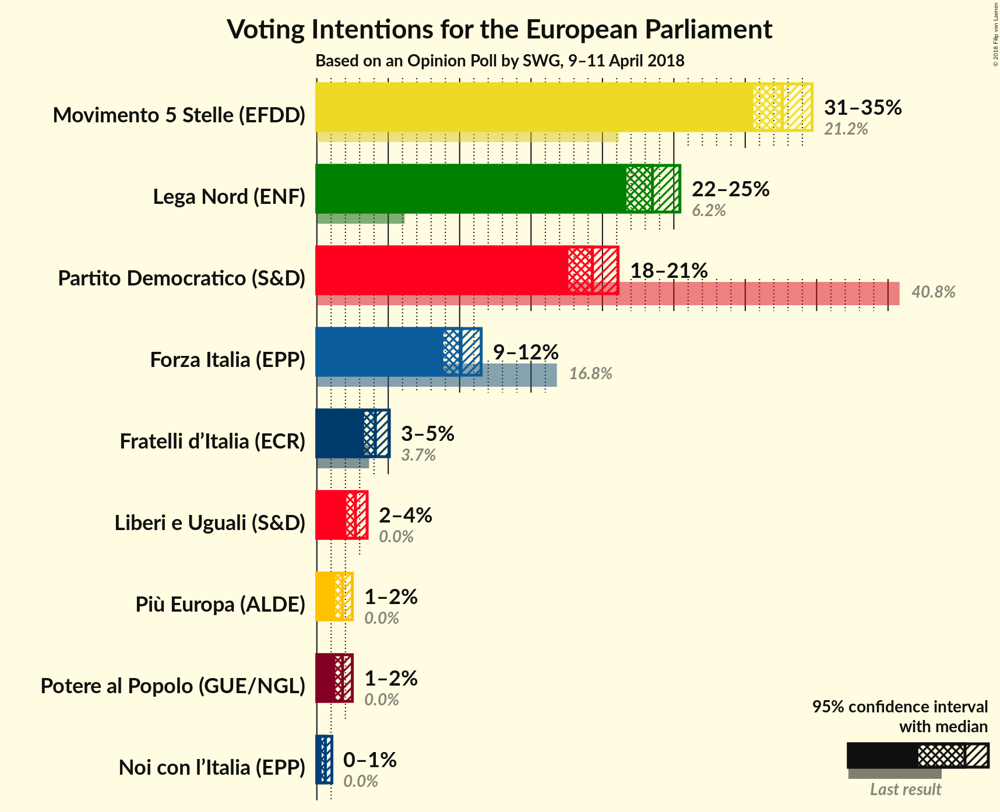
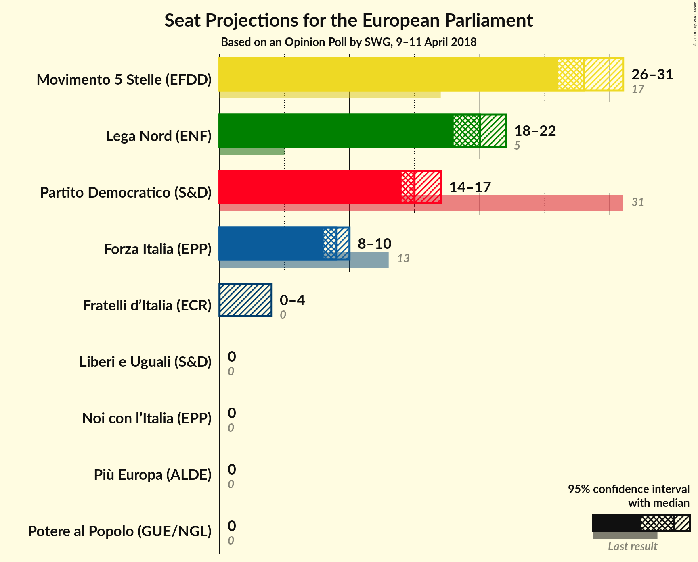
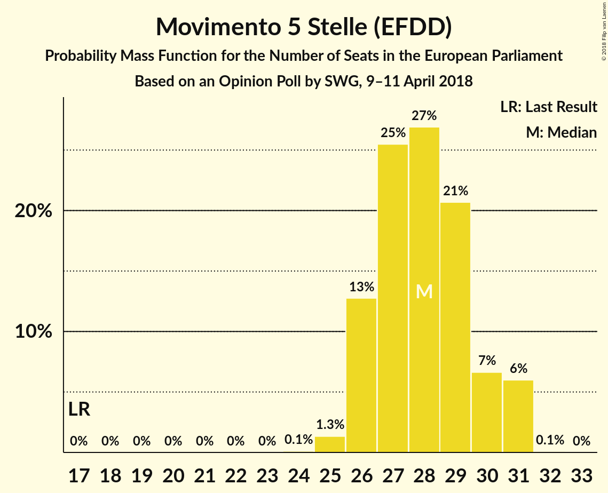
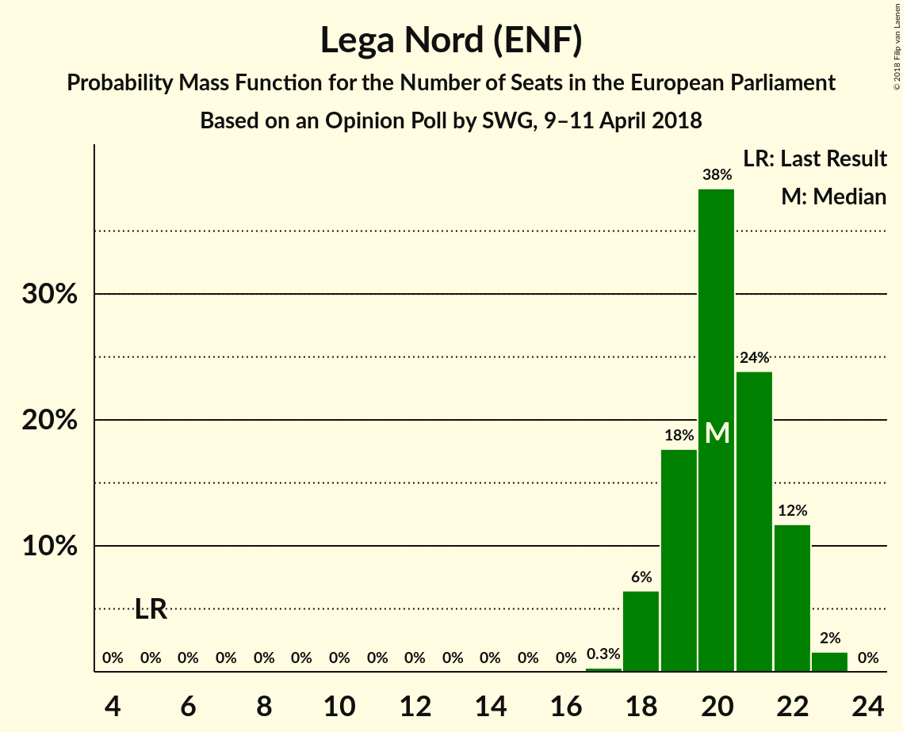
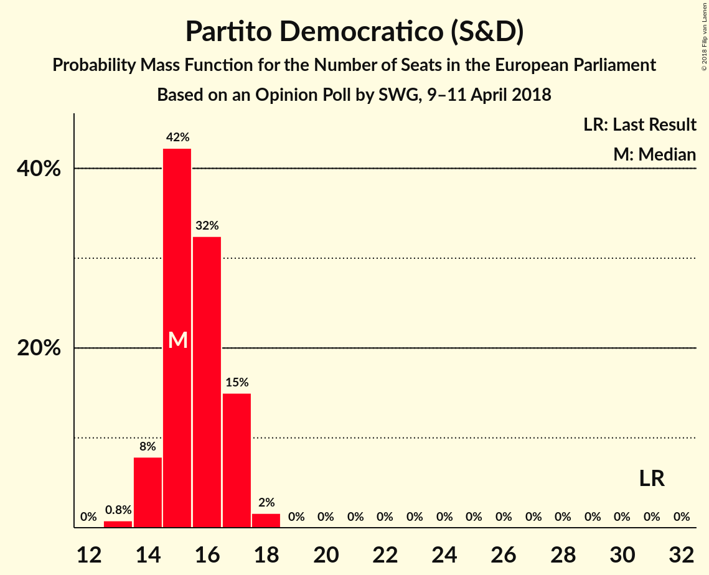
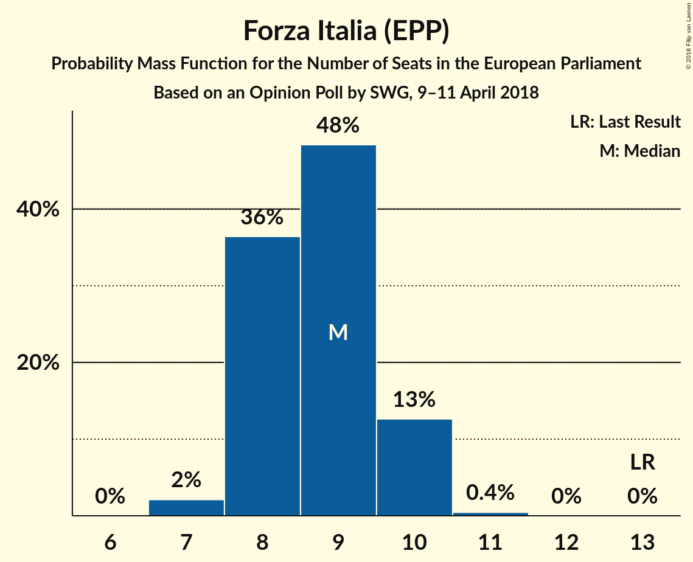
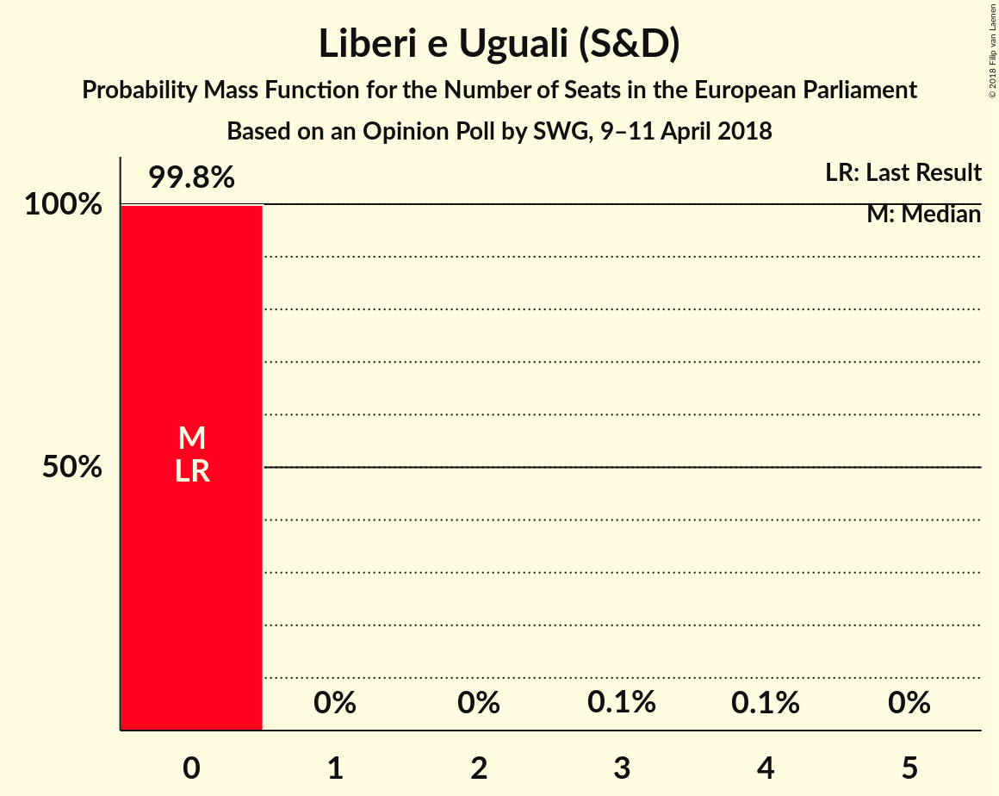
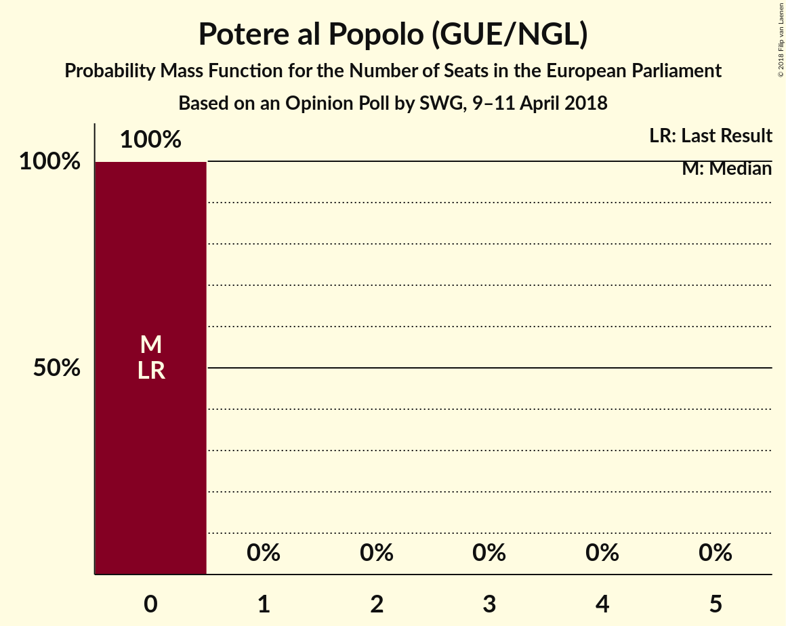
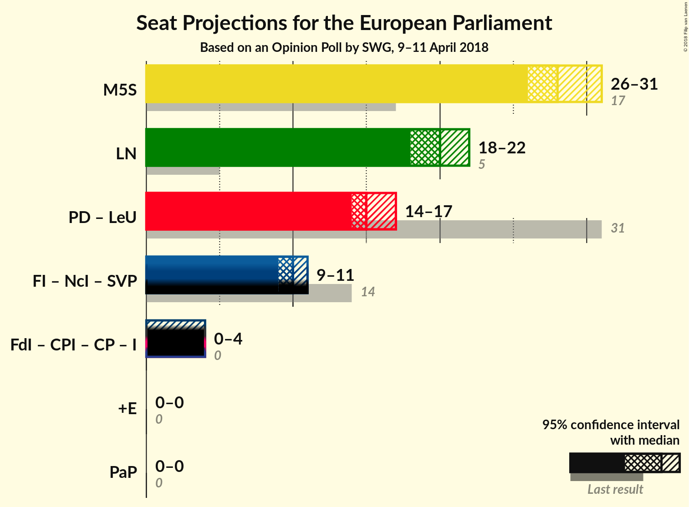

# Opinion Poll by SWG, 9–11 April 2018

<a href="#voting-intentions">Voting Intentions</a> | <a href="#seats">Seats</a> | <a href="#coalitions">Coalitions</a> | <a href="#technical-information">Technical Information</a>

## Voting Intentions

### Confidence Intervals

| Party | Last Result | Poll Result | 80% Confidence Interval | 90% Confidence Interval | 95% Confidence Interval | 99% Confidence Interval |
|:-----:|:-----------:|:-----------:|:-----------------------:|:-----------------------:|:-----------------------:|:-----------------------:|
| Movimento 5 Stelle (EFDD) | 21.1% | 32.6% | 31.3–34.0% |30.9–34.4% |30.6–34.7% |29.9–35.4% |
| Lega Nord (ENF) | 6.2% | 23.5% | 22.3–24.8% |22.0–25.1% |21.7–25.4% |21.1–26.0% |
| Partito Democratico (S&D) | 40.8% | 19.3% | 18.2–20.5% |17.9–20.8% |17.6–21.1% |17.1–21.7% |
| Forza Italia (EPP) | 16.8% | 10.1% | 9.3–11.0% |9.1–11.3% |8.9–11.5% |8.5–12.0% |
| Fratelli d’Italia (*) | 3.7% | 4.1% | 3.6–4.7% |3.4–4.9% |3.3–5.1% |3.1–5.4% |
| Liberi e Uguali (S&D) | 0.0% | 2.7% | 2.3–3.2% |2.2–3.4% |2.1–3.5% |1.9–3.8% |
| Più Europa (ALDE) | 0.0% | 1.8% | 1.5–2.3% |1.4–2.4% |1.3–2.5% |1.2–2.7% |
| Potere al Popolo (GUE/NGL) | 0.0% | 1.8% | 1.5–2.3% |1.4–2.4% |1.3–2.5% |1.2–2.7% |
| Noi con l’Italia (EPP) | 0.0% | 0.6% | 0.4–0.9% |0.4–1.0% |0.3–1.1% |0.3–1.2% |

*Note:* The poll result column reflects the actual value used in the calculations. Published results may vary slightly, and in addition be rounded to fewer digits.

## Seats

### Confidence Intervals

| Party | Last Result | Median | 80% Confidence Interval | 90% Confidence Interval | 95% Confidence Interval | 99% Confidence Interval |
|:-----:|:-----------:|:------:|:-----------------------:|:-----------------------:|:-----------------------:|:-----------------------:|
| <a href="#movimento-5-stelle-(efdd)">Movimento 5 Stelle (EFDD)</a> | 17 | 28 | 27–30 |26–30 |26–31 |25–31 |
| <a href="#lega-nord-(enf)">Lega Nord (ENF)</a> | 5 | 20 | 19–21 |19–22 |18–22 |18–22 |
| <a href="#partito-democratico-(s&d)">Partito Democratico (S&D)</a> | 31 | 16 | 15–17 |14–17 |14–17 |13–18 |
| <a href="#forza-italia-(epp)">Forza Italia (EPP)</a> | 13 | 9 | 8–9 |8–10 |7–10 |7–11 |
| <a href="#fratelli-d’italia-(*)">Fratelli d’Italia (*)</a> | 0 | 0 | 0–4 |0–4 |0–4 |0–5 |
| <a href="#liberi-e-uguali-(s&d)">Liberi e Uguali (S&D)</a> | 0 | 0 | 0 |0 |0 |0 |
| <a href="#più-europa-(alde)">Più Europa (ALDE)</a> | 0 | 0 | 0 |0 |0 |0 |
| <a href="#potere-al-popolo-(gue/ngl)">Potere al Popolo (GUE/NGL)</a> | 0 | 0 | 0 |0 |0 |0 |
| <a href="#noi-con-l’italia-(epp)">Noi con l’Italia (EPP)</a> | 0 | 0 | 0 |0 |0 |0 |

### Movimento 5 Stelle (EFDD)

*For a full overview of the results for this party, see the [Movimento 5 Stelle (EFDD)](party-movimento5stelleefdd.html) page.*

| Number of Seats | Probability | Accumulated | Special Marks |
|:---------------:|:-----------:|:-----------:|:-------------:|
| 17 | 0% | 100% | Last Result |
| 18 | 0% | 100% |  |
| 19 | 0% | 100% |  |
| 20 | 0% | 100% |  |
| 21 | 0% | 100% |  |
| 22 | 0% | 100% |  |
| 23 | 0% | 100% |  |
| 24 | 0.1% | 100% |  |
| 25 | 1.5% | 99.9% |  |
| 26 | 7% | 98% |  |
| 27 | 26% | 92% |  |
| 28 | 37% | 66% | Median |
| 29 | 15% | 29% |  |
| 30 | 9% | 14% |  |
| 31 | 5% | 5% |  |
| 32 | 0.2% | 0.2% |  |
| 33 | 0% | 0% |  |

### Lega Nord (ENF)

*For a full overview of the results for this party, see the [Lega Nord (ENF)](party-leganordenf.html) page.*

| Number of Seats | Probability | Accumulated | Special Marks |
|:---------------:|:-----------:|:-----------:|:-------------:|
| 5 | 0% | 100% | Last Result |
| 6 | 0% | 100% |  |
| 7 | 0% | 100% |  |
| 8 | 0% | 100% |  |
| 9 | 0% | 100% |  |
| 10 | 0% | 100% |  |
| 11 | 0% | 100% |  |
| 12 | 0% | 100% |  |
| 13 | 0% | 100% |  |
| 14 | 0% | 100% |  |
| 15 | 0% | 100% |  |
| 16 | 0% | 100% |  |
| 17 | 0.4% | 100% |  |
| 18 | 4% | 99.6% |  |
| 19 | 19% | 96% |  |
| 20 | 62% | 77% | Median |
| 21 | 9% | 15% |  |
| 22 | 5% | 5% |  |
| 23 | 0.4% | 0.4% |  |
| 24 | 0% | 0% |  |

### Partito Democratico (S&D)

*For a full overview of the results for this party, see the [Partito Democratico (S&D)](party-partitodemocraticosd.html) page.*

| Number of Seats | Probability | Accumulated | Special Marks |
|:---------------:|:-----------:|:-----------:|:-------------:|
| 13 | 0.6% | 100% |  |
| 14 | 7% | 99.4% |  |
| 15 | 40% | 92% |  |
| 16 | 31% | 52% | Median |
| 17 | 20% | 21% |  |
| 18 | 0.5% | 0.5% |  |
| 19 | 0% | 0% |  |
| 20 | 0% | 0% |  |
| 21 | 0% | 0% |  |
| 22 | 0% | 0% |  |
| 23 | 0% | 0% |  |
| 24 | 0% | 0% |  |
| 25 | 0% | 0% |  |
| 26 | 0% | 0% |  |
| 27 | 0% | 0% |  |
| 28 | 0% | 0% |  |
| 29 | 0% | 0% |  |
| 30 | 0% | 0% |  |
| 31 | 0% | 0% | Last Result |

### Forza Italia (EPP)

*For a full overview of the results for this party, see the [Forza Italia (EPP)](party-forzaitaliaepp.html) page.*

| Number of Seats | Probability | Accumulated | Special Marks |
|:---------------:|:-----------:|:-----------:|:-------------:|
| 7 | 3% | 100% |  |
| 8 | 37% | 97% |  |
| 9 | 51% | 60% | Median |
| 10 | 8% | 9% |  |
| 11 | 0.5% | 0.5% |  |
| 12 | 0% | 0% |  |
| 13 | 0% | 0% | Last Result |

### Fratelli d’Italia (*)

*For a full overview of the results for this party, see the [Fratelli d’Italia (*)](party-fratellid’italia.html) page.*

| Number of Seats | Probability | Accumulated | Special Marks |
|:---------------:|:-----------:|:-----------:|:-------------:|
| 0 | 60% | 100% | Last Result, Median |
| 1 | 0% | 40% |  |
| 2 | 0% | 40% |  |
| 3 | 4% | 40% |  |
| 4 | 35% | 36% |  |
| 5 | 0.9% | 0.9% |  |
| 6 | 0% | 0% |  |

### Liberi e Uguali (S&D)

*For a full overview of the results for this party, see the [Liberi e Uguali (S&D)](party-liberieugualisd.html) page.*

| Number of Seats | Probability | Accumulated | Special Marks |
|:---------------:|:-----------:|:-----------:|:-------------:|
| 0 | 99.9% | 100% | Last Result, Median |
| 1 | 0% | 0.1% |  |
| 2 | 0% | 0.1% |  |
| 3 | 0.1% | 0.1% |  |
| 4 | 0% | 0% |  |

### Più Europa (ALDE)

*For a full overview of the results for this party, see the [Più Europa (ALDE)](party-piùeuropaalde.html) page.*

| Number of Seats | Probability | Accumulated | Special Marks |
|:---------------:|:-----------:|:-----------:|:-------------:|
| 0 | 100% | 100% | Last Result, Median |

### Potere al Popolo (GUE/NGL)

*For a full overview of the results for this party, see the [Potere al Popolo (GUE/NGL)](party-poterealpopologuengl.html) page.*

| Number of Seats | Probability | Accumulated | Special Marks |
|:---------------:|:-----------:|:-----------:|:-------------:|
| 0 | 100% | 100% | Last Result, Median |

### Noi con l’Italia (EPP)

*For a full overview of the results for this party, see the [Noi con l’Italia (EPP)](party-noiconl’italiaepp.html) page.*

| Number of Seats | Probability | Accumulated | Special Marks |
|:---------------:|:-----------:|:-----------:|:-------------:|
| 0 | 100% | 100% | Last Result, Median |

## Coalitions

### Confidence Intervals

| Coalition | Last Result | Median | Majority? | 80% Confidence Interval | 90% Confidence Interval | 95% Confidence Interval | 99% Confidence Interval |
|:---------:|:-----------:|:------:|:---------:|:-----------------------:|:-----------------------:|:-----------------------:|:-----------------------:|
| Movimento 5 Stelle (EFDD) | 17 | 28 | 0% | 27–30 | 26–30 | 26–31 | 25–31 |
| Lega Nord (ENF) | 5 | 20 | 0% | 19–21 | 19–22 | 18–22 | 18–22 |
| Partito Democratico (S&D) – Liberi e Uguali (S&D) | 31 | 16 | 0% | 15–17 | 14–17 | 14–17 | 13–18 |
| Più Europa (ALDE) | 0 | 0 | 0% | 0 | 0 | 0 | 0 |
| Potere al Popolo (GUE/NGL) | 0 | 0 | 0% | 0 | 0 | 0 | 0 |

### Movimento 5 Stelle (EFDD)

| Number of Seats | Probability | Accumulated | Special Marks |
|:---------------:|:-----------:|:-----------:|:-------------:|
| 17 | 0% | 100% | Last Result |
| 18 | 0% | 100% |  |
| 19 | 0% | 100% |  |
| 20 | 0% | 100% |  |
| 21 | 0% | 100% |  |
| 22 | 0% | 100% |  |
| 23 | 0% | 100% |  |
| 24 | 0.1% | 100% |  |
| 25 | 1.5% | 99.9% |  |
| 26 | 7% | 98% |  |
| 27 | 26% | 92% |  |
| 28 | 37% | 66% | Median |
| 29 | 15% | 29% |  |
| 30 | 9% | 14% |  |
| 31 | 5% | 5% |  |
| 32 | 0.2% | 0.2% |  |
| 33 | 0% | 0% |  |

### Lega Nord (ENF)

| Number of Seats | Probability | Accumulated | Special Marks |
|:---------------:|:-----------:|:-----------:|:-------------:|
| 5 | 0% | 100% | Last Result |
| 6 | 0% | 100% |  |
| 7 | 0% | 100% |  |
| 8 | 0% | 100% |  |
| 9 | 0% | 100% |  |
| 10 | 0% | 100% |  |
| 11 | 0% | 100% |  |
| 12 | 0% | 100% |  |
| 13 | 0% | 100% |  |
| 14 | 0% | 100% |  |
| 15 | 0% | 100% |  |
| 16 | 0% | 100% |  |
| 17 | 0.4% | 100% |  |
| 18 | 4% | 99.6% |  |
| 19 | 19% | 96% |  |
| 20 | 62% | 77% | Median |
| 21 | 9% | 15% |  |
| 22 | 5% | 5% |  |
| 23 | 0.4% | 0.4% |  |
| 24 | 0% | 0% |  |

### Partito Democratico (S&D) – Liberi e Uguali (S&D)

| Number of Seats | Probability | Accumulated | Special Marks |
|:---------------:|:-----------:|:-----------:|:-------------:|
| 13 | 0.6% | 100% |  |
| 14 | 7% | 99.4% |  |
| 15 | 40% | 92% |  |
| 16 | 31% | 52% | Median |
| 17 | 20% | 21% |  |
| 18 | 0.5% | 0.6% |  |
| 19 | 0% | 0% |  |
| 20 | 0% | 0% |  |
| 21 | 0% | 0% |  |
| 22 | 0% | 0% |  |
| 23 | 0% | 0% |  |
| 24 | 0% | 0% |  |
| 25 | 0% | 0% |  |
| 26 | 0% | 0% |  |
| 27 | 0% | 0% |  |
| 28 | 0% | 0% |  |
| 29 | 0% | 0% |  |
| 30 | 0% | 0% |  |
| 31 | 0% | 0% | Last Result |

### Più Europa (ALDE)

| Number of Seats | Probability | Accumulated | Special Marks |
|:---------------:|:-----------:|:-----------:|:-------------:|
| 0 | 100% | 100% | Last Result, Median |

### Potere al Popolo (GUE/NGL)

| Number of Seats | Probability | Accumulated | Special Marks |
|:---------------:|:-----------:|:-----------:|:-------------:|
| 0 | 100% | 100% | Last Result, Median |

## Technical Information

### Opinion Poll

+ **Polling firm:** SWG
+ **Commissioner(s):** —
+ **Fieldwork period:** 9–11 April 2018

### Calculations

+ **Sample size:** 2000
+ **Simulations done:** 131,072
+ **Error estimate:** 1.25%

