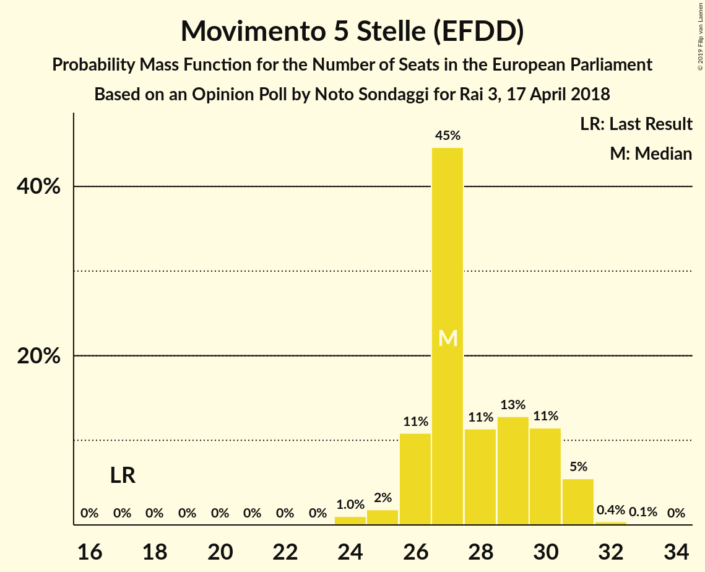
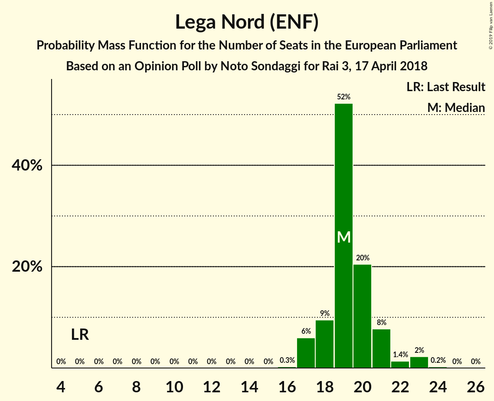
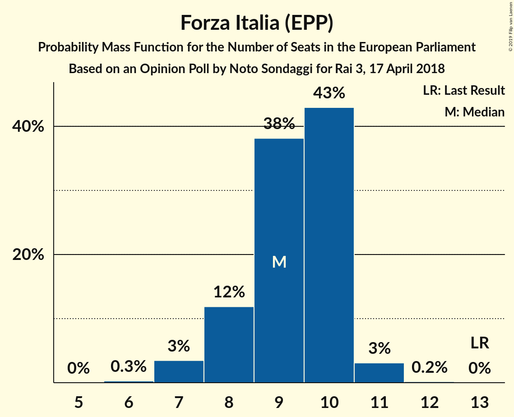
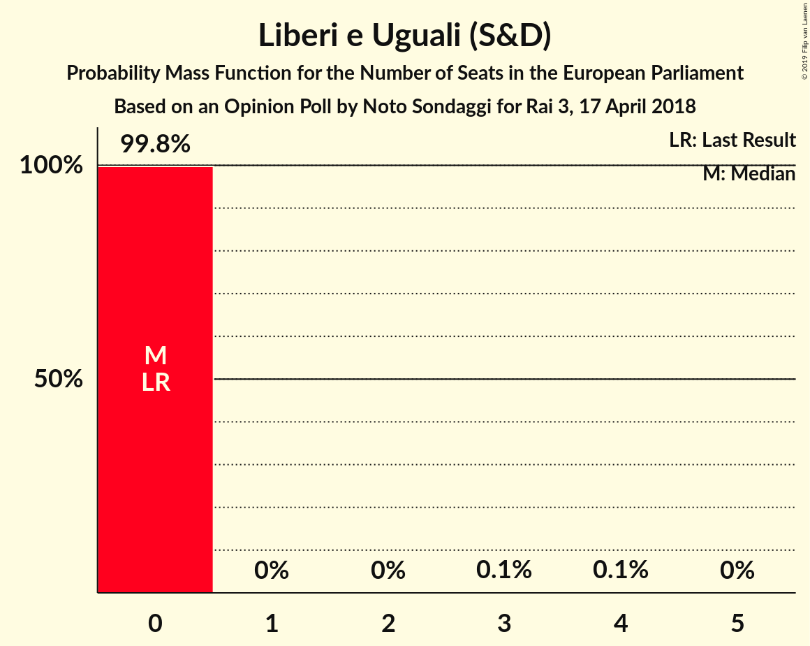
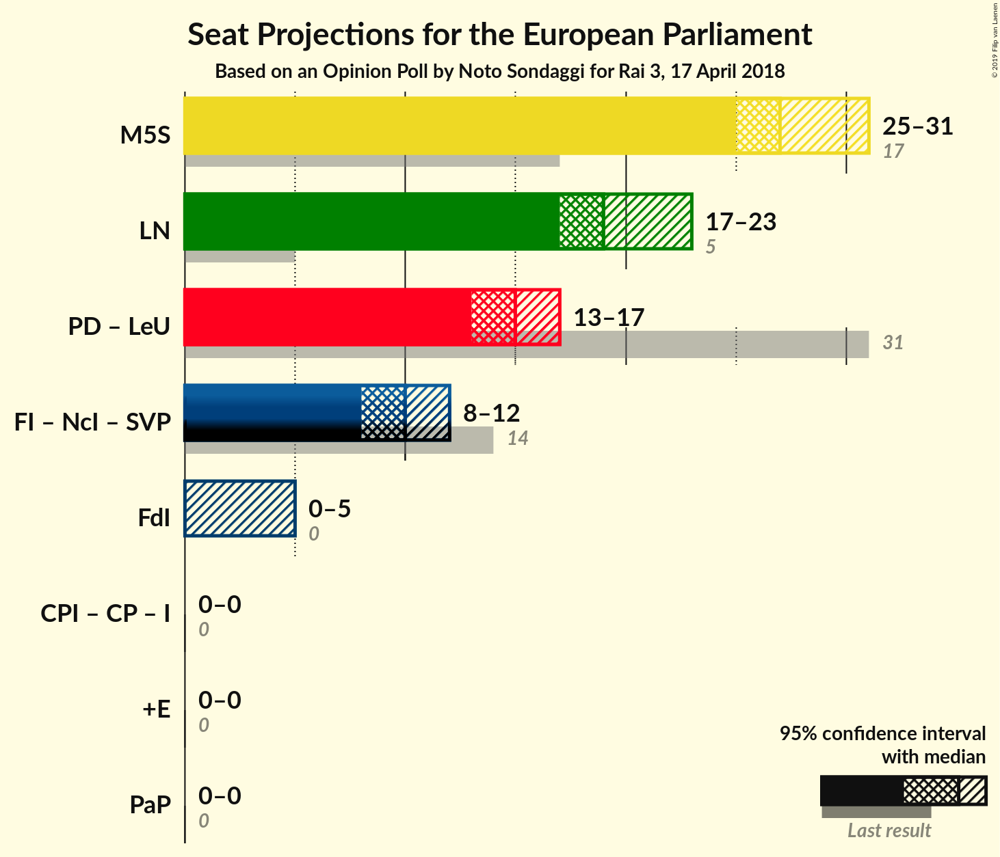
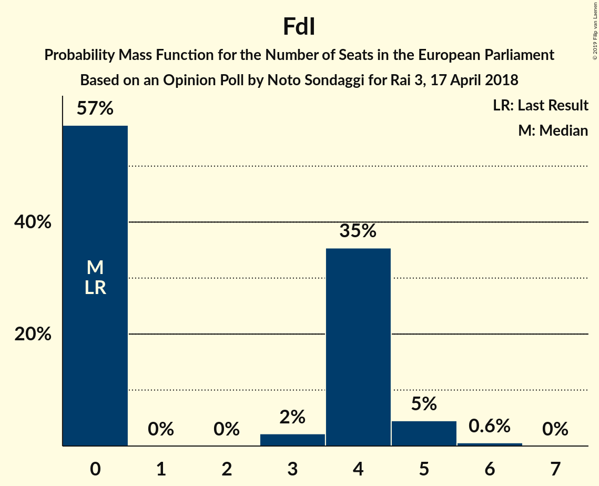

# Opinion Poll by Noto Sondaggi for Rai 3, 17 April 2018

<a href="#voting-intentions">Voting Intentions</a> | <a href="#seats">Seats</a> | <a href="#coalitions">Coalitions</a> | <a href="#technical-information">Technical Information</a>

## Voting Intentions

### Confidence Intervals

| Party | Last Result | Poll Result | 80% Confidence Interval | 90% Confidence Interval | 95% Confidence Interval | 99% Confidence Interval |
|:-----:|:-----------:|:-----------:|:-----------------------:|:-----------------------:|:-----------------------:|:-----------------------:|
| Movimento 5 Stelle (EFDD) | 21.2% | 33.0% | 31.1–34.9% |30.6–35.5% |30.1–36.0% |29.3–36.9% |
| Lega Nord (ENF) | 6.2% | 23.2% | 21.6–25.0% |21.1–25.5% |20.7–25.9% |19.9–26.8% |
| Partito Democratico (S&D) | 40.8% | 18.9% | 17.4–20.6% |16.9–21.0% |16.6–21.5% |15.9–22.3% |
| Forza Italia (EPP) | 16.8% | 10.4% | 9.3–11.7% |8.9–12.1% |8.7–12.5% |8.1–13.1% |
| Fratelli d’Italia (ECR) | 3.7% | 4.4% | 3.7–5.3% |3.5–5.6% |3.3–5.9% |3.0–6.4% |
| Liberi e Uguali (S&D) | 0.0% | 2.4% | 1.9–3.2% |1.7–3.4% |1.6–3.6% |1.4–3.9% |
| Più Europa (ALDE) | 0.0% | 2.0% | 1.5–2.7% |1.4–2.9% |1.3–3.1% |1.1–3.4% |
| Potere al Popolo (GUE/NGL) | 0.0% | 1.5% | 1.1–2.1% |1.0–2.3% |0.9–2.5% |0.7–2.8% |
| Noi con l’Italia (EPP) | 0.0% | 0.7% | 0.5–1.2% |0.4–1.3% |0.3–1.4% |0.2–1.7% |

*Note:* The poll result column reflects the actual value used in the calculations. Published results may vary slightly, and in addition be rounded to fewer digits.

## Seats

### Confidence Intervals

| Party | Last Result | Median | 80% Confidence Interval | 90% Confidence Interval | 95% Confidence Interval | 99% Confidence Interval |
|:-----:|:-----------:|:------:|:-----------------------:|:-----------------------:|:-----------------------:|:-----------------------:|
| <a href="#movimento-5-stelle-(efdd)">Movimento 5 Stelle (EFDD)</a> | 17 | 27 | 26–30 |26–31 |25–31 |24–32 |
| <a href="#lega-nord-(enf)">Lega Nord (ENF)</a> | 5 | 19 | 18–21 |17–21 |17–23 |17–23 |
| <a href="#partito-democratico-(s&d)">Partito Democratico (S&D)</a> | 31 | 15 | 14–17 |13–17 |13–17 |12–18 |
| <a href="#forza-italia-(epp)">Forza Italia (EPP)</a> | 13 | 9 | 8–10 |8–10 |7–11 |7–11 |
| <a href="#fratelli-d’italia-(ecr)">Fratelli d’Italia (ECR)</a> | 0 | 0 | 0–4 |0–5 |0–5 |0–6 |
| <a href="#liberi-e-uguali-(s&d)">Liberi e Uguali (S&D)</a> | 0 | 0 | 0 |0 |0 |0 |
| <a href="#più-europa-(alde)">Più Europa (ALDE)</a> | 0 | 0 | 0 |0 |0 |0 |
| <a href="#potere-al-popolo-(gue/ngl)">Potere al Popolo (GUE/NGL)</a> | 0 | 0 | 0 |0 |0 |0 |
| <a href="#noi-con-l’italia-(epp)">Noi con l’Italia (EPP)</a> | 0 | 0 | 0 |0 |0 |0 |

### Movimento 5 Stelle (EFDD)

*For a full overview of the results for this party, see the [Movimento 5 Stelle (EFDD)](party-movimento5stelleefdd.html) page.*

| Number of Seats | Probability | Accumulated | Special Marks |
|:---------------:|:-----------:|:-----------:|:-------------:|
| 17 | 0% | 100% | Last Result |
| 18 | 0% | 100% |  |
| 19 | 0% | 100% |  |
| 20 | 0% | 100% |  |
| 21 | 0% | 100% |  |
| 22 | 0% | 100% |  |
| 23 | 0% | 100% |  |
| 24 | 1.0% | 100% |  |
| 25 | 2% | 98.9% |  |
| 26 | 11% | 97% |  |
| 27 | 45% | 86% | Median |
| 28 | 11% | 42% |  |
| 29 | 13% | 30% |  |
| 30 | 11% | 17% |  |
| 31 | 5% | 6% |  |
| 32 | 0.4% | 0.5% |  |
| 33 | 0.1% | 0.1% |  |
| 34 | 0% | 0% |  |

### Lega Nord (ENF)

*For a full overview of the results for this party, see the [Lega Nord (ENF)](party-leganordenf.html) page.*

| Number of Seats | Probability | Accumulated | Special Marks |
|:---------------:|:-----------:|:-----------:|:-------------:|
| 5 | 0% | 100% | Last Result |
| 6 | 0% | 100% |  |
| 7 | 0% | 100% |  |
| 8 | 0% | 100% |  |
| 9 | 0% | 100% |  |
| 10 | 0% | 100% |  |
| 11 | 0% | 100% |  |
| 12 | 0% | 100% |  |
| 13 | 0% | 100% |  |
| 14 | 0% | 100% |  |
| 15 | 0% | 100% |  |
| 16 | 0.3% | 100% |  |
| 17 | 6% | 99.7% |  |
| 18 | 9% | 94% |  |
| 19 | 52% | 84% | Median |
| 20 | 20% | 32% |  |
| 21 | 8% | 12% |  |
| 22 | 1.4% | 4% |  |
| 23 | 2% | 3% |  |
| 24 | 0.2% | 0.3% |  |
| 25 | 0% | 0% |  |

### Partito Democratico (S&D)

*For a full overview of the results for this party, see the [Partito Democratico (S&D)](party-partitodemocraticosd.html) page.*

| Number of Seats | Probability | Accumulated | Special Marks |
|:---------------:|:-----------:|:-----------:|:-------------:|
| 11 | 0.1% | 100% |  |
| 12 | 0.7% | 99.9% |  |
| 13 | 5% | 99.2% |  |
| 14 | 13% | 94% |  |
| 15 | 42% | 81% | Median |
| 16 | 27% | 40% |  |
| 17 | 11% | 13% |  |
| 18 | 1.0% | 1.3% |  |
| 19 | 0.1% | 0.2% |  |
| 20 | 0.1% | 0.1% |  |
| 21 | 0% | 0% |  |
| 22 | 0% | 0% |  |
| 23 | 0% | 0% |  |
| 24 | 0% | 0% |  |
| 25 | 0% | 0% |  |
| 26 | 0% | 0% |  |
| 27 | 0% | 0% |  |
| 28 | 0% | 0% |  |
| 29 | 0% | 0% |  |
| 30 | 0% | 0% |  |
| 31 | 0% | 0% | Last Result |

### Forza Italia (EPP)

*For a full overview of the results for this party, see the [Forza Italia (EPP)](party-forzaitaliaepp.html) page.*

| Number of Seats | Probability | Accumulated | Special Marks |
|:---------------:|:-----------:|:-----------:|:-------------:|
| 6 | 0.3% | 100% |  |
| 7 | 3% | 99.7% |  |
| 8 | 12% | 96% |  |
| 9 | 38% | 84% | Median |
| 10 | 43% | 46% |  |
| 11 | 3% | 3% |  |
| 12 | 0.2% | 0.2% |  |
| 13 | 0% | 0% | Last Result |

### Fratelli d’Italia (ECR)

*For a full overview of the results for this party, see the [Fratelli d’Italia (ECR)](party-fratellid’italiaecr.html) page.*

| Number of Seats | Probability | Accumulated | Special Marks |
|:---------------:|:-----------:|:-----------:|:-------------:|
| 0 | 57% | 100% | Last Result, Median |
| 1 | 0% | 43% |  |
| 2 | 0% | 43% |  |
| 3 | 2% | 43% |  |
| 4 | 35% | 40% |  |
| 5 | 5% | 5% |  |
| 6 | 0.6% | 0.6% |  |
| 7 | 0% | 0% |  |

### Liberi e Uguali (S&D)

*For a full overview of the results for this party, see the [Liberi e Uguali (S&D)](party-liberieugualisd.html) page.*

| Number of Seats | Probability | Accumulated | Special Marks |
|:---------------:|:-----------:|:-----------:|:-------------:|
| 0 | 99.8% | 100% | Last Result, Median |
| 1 | 0% | 0.2% |  |
| 2 | 0% | 0.2% |  |
| 3 | 0.1% | 0.2% |  |
| 4 | 0.1% | 0.1% |  |
| 5 | 0% | 0% |  |

### Più Europa (ALDE)

*For a full overview of the results for this party, see the [Più Europa (ALDE)](party-piùeuropaalde.html) page.*

| Number of Seats | Probability | Accumulated | Special Marks |
|:---------------:|:-----------:|:-----------:|:-------------:|
| 0 | 100% | 100% | Last Result, Median |

### Potere al Popolo (GUE/NGL)

*For a full overview of the results for this party, see the [Potere al Popolo (GUE/NGL)](party-poterealpopologuengl.html) page.*

| Number of Seats | Probability | Accumulated | Special Marks |
|:---------------:|:-----------:|:-----------:|:-------------:|
| 0 | 100% | 100% | Last Result, Median |

### Noi con l’Italia (EPP)

*For a full overview of the results for this party, see the [Noi con l’Italia (EPP)](party-noiconl’italiaepp.html) page.*

| Number of Seats | Probability | Accumulated | Special Marks |
|:---------------:|:-----------:|:-----------:|:-------------:|
| 0 | 100% | 100% | Last Result, Median |

## Coalitions

### Confidence Intervals

| Coalition | Last Result | Median | Majority? | 80% Confidence Interval | 90% Confidence Interval | 95% Confidence Interval | 99% Confidence Interval |
|:---------:|:-----------:|:------:|:---------:|:-----------------------:|:-----------------------:|:-----------------------:|:-----------------------:|
| Movimento 5 Stelle (EFDD) | 17 | 27 | 0% | 26–30 | 26–31 | 25–31 | 24–32 |
| Lega Nord (ENF) | 5 | 19 | 0% | 18–21 | 17–21 | 17–23 | 17–23 |
| Partito Democratico (S&D) – Liberi e Uguali (S&D) | 31 | 15 | 0% | 14–17 | 13–17 | 13–17 | 12–18 |
| Fratelli d’Italia (ECR) | 0 | 0 | 0% | 0–4 | 0–5 | 0–5 | 0–6 |
| Più Europa (ALDE) | 0 | 0 | 0% | 0 | 0 | 0 | 0 |
| Potere al Popolo (GUE/NGL) | 0 | 0 | 0% | 0 | 0 | 0 | 0 |

### Movimento 5 Stelle (EFDD)

| Number of Seats | Probability | Accumulated | Special Marks |
|:---------------:|:-----------:|:-----------:|:-------------:|
| 17 | 0% | 100% | Last Result |
| 18 | 0% | 100% |  |
| 19 | 0% | 100% |  |
| 20 | 0% | 100% |  |
| 21 | 0% | 100% |  |
| 22 | 0% | 100% |  |
| 23 | 0% | 100% |  |
| 24 | 1.0% | 100% |  |
| 25 | 2% | 98.9% |  |
| 26 | 11% | 97% |  |
| 27 | 45% | 86% | Median |
| 28 | 11% | 42% |  |
| 29 | 13% | 30% |  |
| 30 | 11% | 17% |  |
| 31 | 5% | 6% |  |
| 32 | 0.4% | 0.5% |  |
| 33 | 0.1% | 0.1% |  |
| 34 | 0% | 0% |  |

### Lega Nord (ENF)

| Number of Seats | Probability | Accumulated | Special Marks |
|:---------------:|:-----------:|:-----------:|:-------------:|
| 5 | 0% | 100% | Last Result |
| 6 | 0% | 100% |  |
| 7 | 0% | 100% |  |
| 8 | 0% | 100% |  |
| 9 | 0% | 100% |  |
| 10 | 0% | 100% |  |
| 11 | 0% | 100% |  |
| 12 | 0% | 100% |  |
| 13 | 0% | 100% |  |
| 14 | 0% | 100% |  |
| 15 | 0% | 100% |  |
| 16 | 0.3% | 100% |  |
| 17 | 6% | 99.7% |  |
| 18 | 9% | 94% |  |
| 19 | 52% | 84% | Median |
| 20 | 20% | 32% |  |
| 21 | 8% | 12% |  |
| 22 | 1.4% | 4% |  |
| 23 | 2% | 3% |  |
| 24 | 0.2% | 0.3% |  |
| 25 | 0% | 0% |  |

### Partito Democratico (S&D) – Liberi e Uguali (S&D)

| Number of Seats | Probability | Accumulated | Special Marks |
|:---------------:|:-----------:|:-----------:|:-------------:|
| 11 | 0.1% | 100% |  |
| 12 | 0.7% | 99.9% |  |
| 13 | 5% | 99.2% |  |
| 14 | 13% | 95% |  |
| 15 | 42% | 82% | Median |
| 16 | 27% | 40% |  |
| 17 | 11% | 13% |  |
| 18 | 1.1% | 1.4% |  |
| 19 | 0.2% | 0.3% |  |
| 20 | 0.1% | 0.1% |  |
| 21 | 0% | 0% |  |
| 22 | 0% | 0% |  |
| 23 | 0% | 0% |  |
| 24 | 0% | 0% |  |
| 25 | 0% | 0% |  |
| 26 | 0% | 0% |  |
| 27 | 0% | 0% |  |
| 28 | 0% | 0% |  |
| 29 | 0% | 0% |  |
| 30 | 0% | 0% |  |
| 31 | 0% | 0% | Last Result |

### Fratelli d’Italia (ECR)

| Number of Seats | Probability | Accumulated | Special Marks |
|:---------------:|:-----------:|:-----------:|:-------------:|
| 0 | 57% | 100% | Last Result, Median |
| 1 | 0% | 43% |  |
| 2 | 0% | 43% |  |
| 3 | 2% | 43% |  |
| 4 | 35% | 40% |  |
| 5 | 5% | 5% |  |
| 6 | 0.6% | 0.6% |  |
| 7 | 0% | 0% |  |

### Più Europa (ALDE)

| Number of Seats | Probability | Accumulated | Special Marks |
|:---------------:|:-----------:|:-----------:|:-------------:|
| 0 | 100% | 100% | Last Result, Median |

### Potere al Popolo (GUE/NGL)

| Number of Seats | Probability | Accumulated | Special Marks |
|:---------------:|:-----------:|:-----------:|:-------------:|
| 0 | 100% | 100% | Last Result, Median |

## Technical Information

### Opinion Poll

+ **Polling firm:** Noto Sondaggi
+ **Commissioner(s):** Rai 3
+ **Fieldwork period:** 17 April 2018

### Calculations

+ **Sample size:** 1000
+ **Simulations done:** 131,072
+ **Error estimate:** 1.63%

