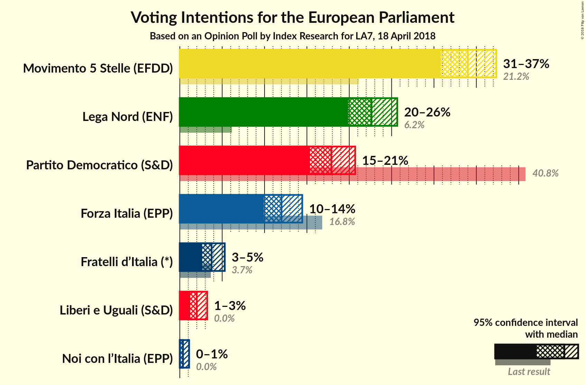
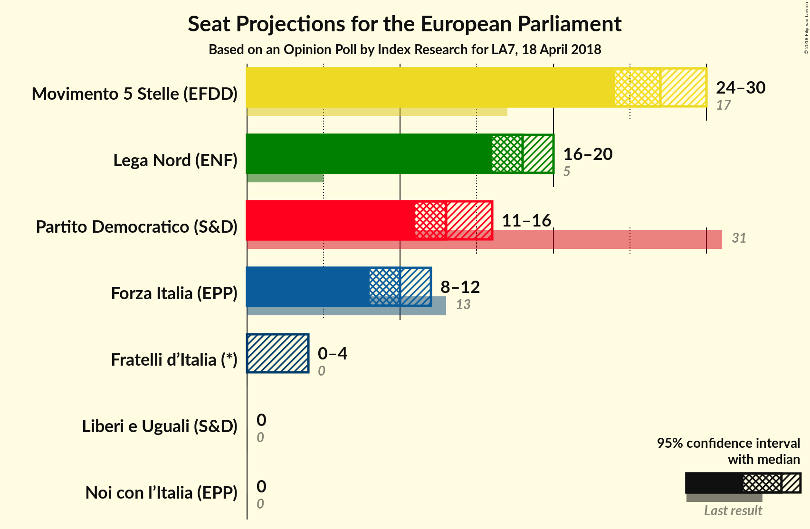
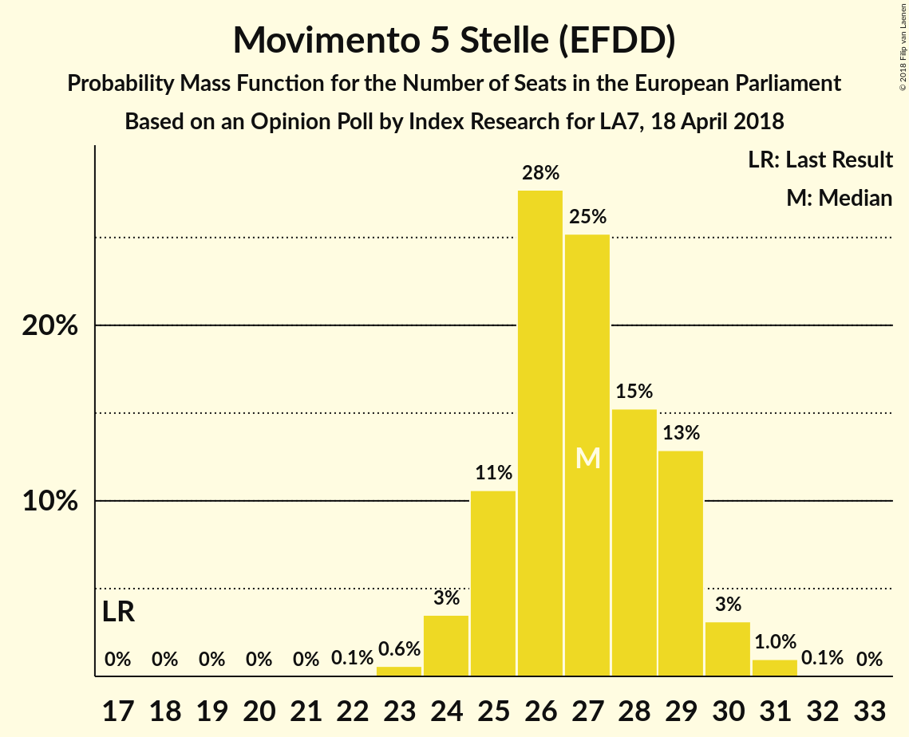
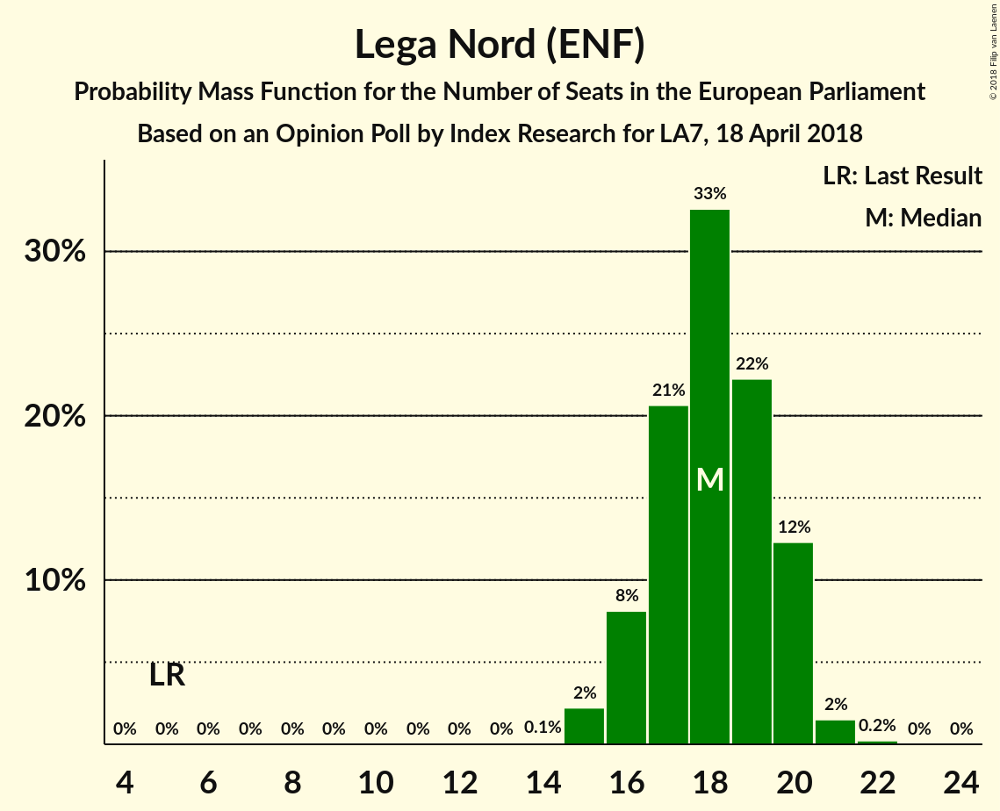
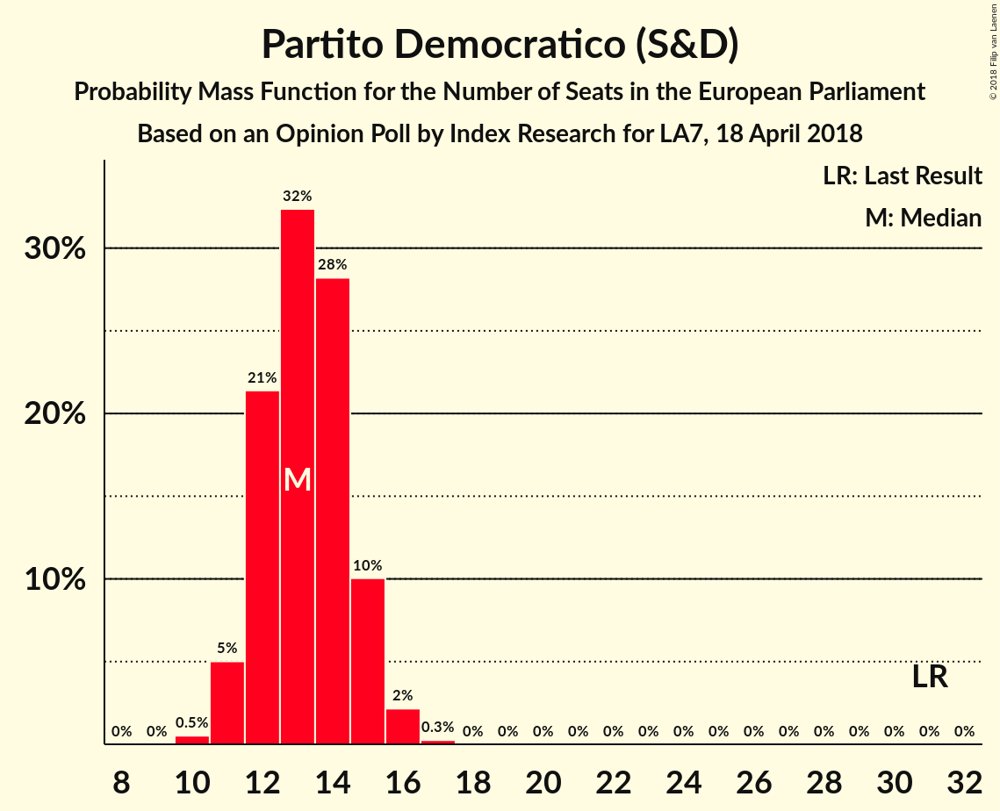
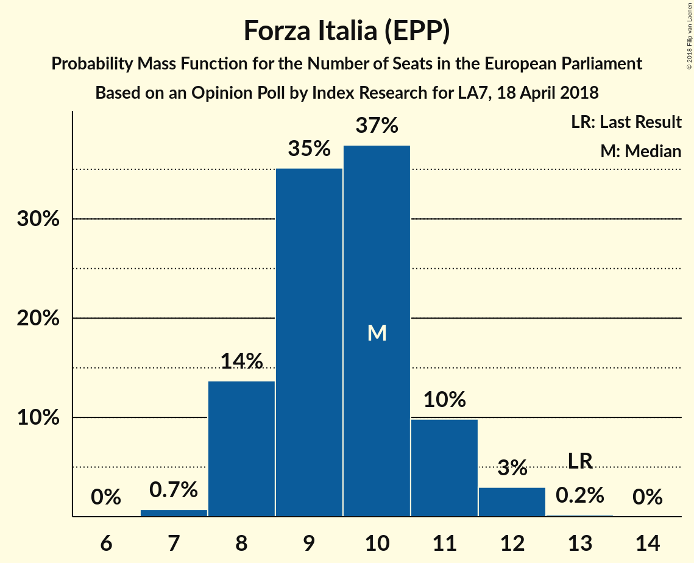
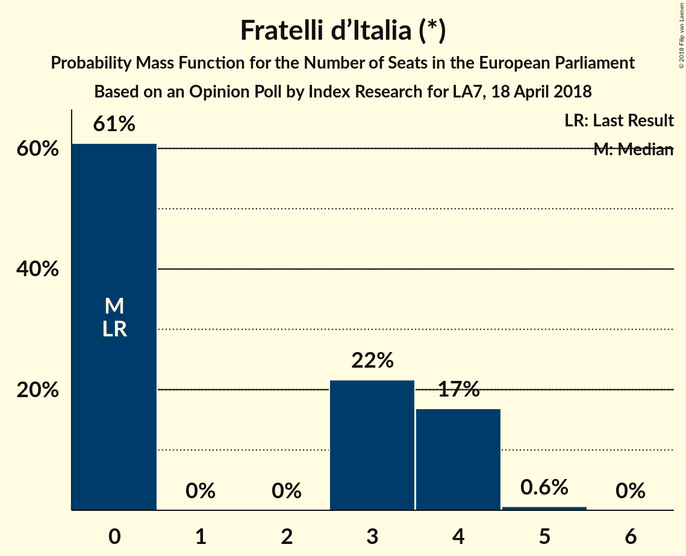
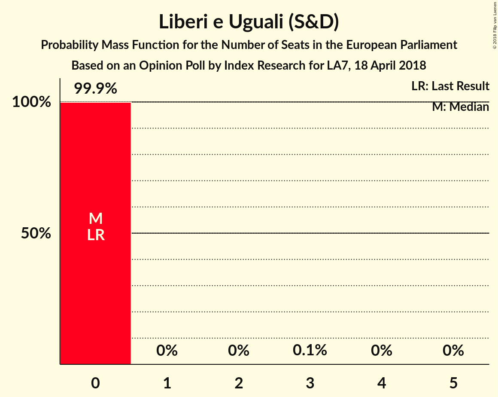
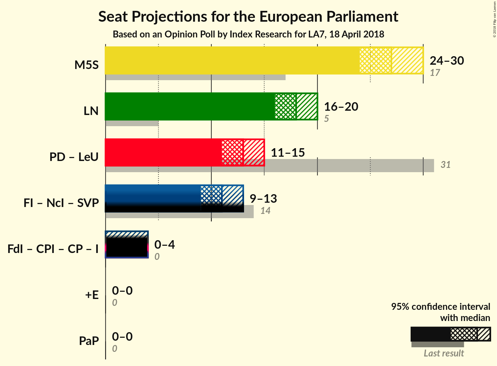

# Opinion Poll by Index Research for LA7, 18 April 2018

<a href="#voting-intentions">Voting Intentions</a> | <a href="#seats">Seats</a> | <a href="#coalitions">Coalitions</a> | <a href="#technical-information">Technical Information</a>

## Voting Intentions

### Confidence Intervals

| Party | Last Result | Poll Result | 80% Confidence Interval | 90% Confidence Interval | 95% Confidence Interval | 99% Confidence Interval |
|:-----:|:-----------:|:-----------:|:-----------------------:|:-----------------------:|:-----------------------:|:-----------------------:|
| Movimento 5 Stelle (EFDD) | 21.2% | 34.0% | 31.9–36.2% |31.3–36.8% |30.8–37.4% |29.8–38.4% |
| Lega Nord (ENF) | 6.2% | 22.6% | 20.8–24.6% |20.3–25.2% |19.9–25.7% |19.0–26.6% |
| Partito Democratico (S&D) | 40.8% | 17.9% | 16.2–19.7% |15.8–20.2% |15.4–20.7% |14.6–21.6% |
| Forza Italia (EPP) | 16.8% | 12.0% | 10.6–13.6% |10.2–14.1% |9.9–14.4% |9.3–15.2% |
| Fratelli d’Italia (*) | 3.7% | 3.8% | 3.0–4.8% |2.8–5.1% |2.6–5.3% |2.3–5.8% |
| Liberi e Uguali (S&D) | 0.0% | 2.0% | 1.5–2.8% |1.4–3.0% |1.2–3.2% |1.0–3.7% |
| Noi con l’Italia (EPP) | 0.0% | 0.4% | 0.2–0.8% |0.2–1.0% |0.1–1.1% |0.1–1.4% |

*Note:* The poll result column reflects the actual value used in the calculations. Published results may vary slightly, and in addition be rounded to fewer digits.

## Seats

### Confidence Intervals

| Party | Last Result | Median | 80% Confidence Interval | 90% Confidence Interval | 95% Confidence Interval | 99% Confidence Interval |
|:-----:|:-----------:|:------:|:-----------------------:|:-----------------------:|:-----------------------:|:-----------------------:|
| <a href="#movimento-5-stelle-(efdd)">Movimento 5 Stelle (EFDD)</a> | 17 | 27 | 25–29 |25–29 |24–30 |23–31 |
| <a href="#lega-nord-(enf)">Lega Nord (ENF)</a> | 5 | 18 | 16–20 |16–20 |16–20 |15–21 |
| <a href="#partito-democratico-(s&d)">Partito Democratico (S&D)</a> | 31 | 13 | 12–15 |11–15 |11–15 |10–16 |
| <a href="#forza-italia-(epp)">Forza Italia (EPP)</a> | 13 | 10 | 8–11 |8–11 |8–12 |7–12 |
| <a href="#fratelli-d’italia-(*)">Fratelli d’Italia (*)</a> | 0 | 0 | 0–4 |0–4 |0–4 |0–5 |
| <a href="#liberi-e-uguali-(s&d)">Liberi e Uguali (S&D)</a> | 0 | 0 | 0 |0 |0 |0 |
| <a href="#noi-con-l’italia-(epp)">Noi con l’Italia (EPP)</a> | 0 | 0 | 0 |0 |0 |0 |

### Movimento 5 Stelle (EFDD)

*For a full overview of the results for this party, see the [Movimento 5 Stelle (EFDD)](party-movimento5stelleefdd.html) page.*

| Number of Seats | Probability | Accumulated | Special Marks |
|:---------------:|:-----------:|:-----------:|:-------------:|
| 17 | 0% | 100% | Last Result |
| 18 | 0% | 100% |  |
| 19 | 0% | 100% |  |
| 20 | 0% | 100% |  |
| 21 | 0% | 100% |  |
| 22 | 0.1% | 100% |  |
| 23 | 0.7% | 99.9% |  |
| 24 | 4% | 99.3% |  |
| 25 | 11% | 95% |  |
| 26 | 22% | 84% |  |
| 27 | 28% | 62% | Median |
| 28 | 20% | 34% |  |
| 29 | 10% | 14% |  |
| 30 | 4% | 4% |  |
| 31 | 0.7% | 0.8% |  |
| 32 | 0.1% | 0.1% |  |
| 33 | 0% | 0% |  |

### Lega Nord (ENF)

*For a full overview of the results for this party, see the [Lega Nord (ENF)](party-leganordenf.html) page.*

| Number of Seats | Probability | Accumulated | Special Marks |
|:---------------:|:-----------:|:-----------:|:-------------:|
| 5 | 0% | 100% | Last Result |
| 6 | 0% | 100% |  |
| 7 | 0% | 100% |  |
| 8 | 0% | 100% |  |
| 9 | 0% | 100% |  |
| 10 | 0% | 100% |  |
| 11 | 0% | 100% |  |
| 12 | 0% | 100% |  |
| 13 | 0% | 100% |  |
| 14 | 0.1% | 100% |  |
| 15 | 2% | 99.9% |  |
| 16 | 8% | 98% |  |
| 17 | 24% | 89% |  |
| 18 | 34% | 65% | Median |
| 19 | 19% | 31% |  |
| 20 | 10% | 12% |  |
| 21 | 2% | 2% |  |
| 22 | 0.3% | 0.3% |  |
| 23 | 0% | 0% |  |

### Partito Democratico (S&D)

*For a full overview of the results for this party, see the [Partito Democratico (S&D)](party-partitodemocraticosd.html) page.*

| Number of Seats | Probability | Accumulated | Special Marks |
|:---------------:|:-----------:|:-----------:|:-------------:|
| 10 | 0.5% | 100% |  |
| 11 | 5% | 99.5% |  |
| 12 | 21% | 94% |  |
| 13 | 32% | 73% | Median |
| 14 | 28% | 41% |  |
| 15 | 10% | 12% |  |
| 16 | 2% | 2% |  |
| 17 | 0.3% | 0.3% |  |
| 18 | 0% | 0% |  |
| 19 | 0% | 0% |  |
| 20 | 0% | 0% |  |
| 21 | 0% | 0% |  |
| 22 | 0% | 0% |  |
| 23 | 0% | 0% |  |
| 24 | 0% | 0% |  |
| 25 | 0% | 0% |  |
| 26 | 0% | 0% |  |
| 27 | 0% | 0% |  |
| 28 | 0% | 0% |  |
| 29 | 0% | 0% |  |
| 30 | 0% | 0% |  |
| 31 | 0% | 0% | Last Result |

### Forza Italia (EPP)

*For a full overview of the results for this party, see the [Forza Italia (EPP)](party-forzaitaliaepp.html) page.*

| Number of Seats | Probability | Accumulated | Special Marks |
|:---------------:|:-----------:|:-----------:|:-------------:|
| 7 | 0.9% | 100% |  |
| 8 | 11% | 99.1% |  |
| 9 | 37% | 88% |  |
| 10 | 35% | 51% | Median |
| 11 | 13% | 16% |  |
| 12 | 2% | 3% |  |
| 13 | 0.2% | 0.2% | Last Result |
| 14 | 0% | 0% |  |

### Fratelli d’Italia (*)

*For a full overview of the results for this party, see the [Fratelli d’Italia (*)](party-fratellid’italia.html) page.*

| Number of Seats | Probability | Accumulated | Special Marks |
|:---------------:|:-----------:|:-----------:|:-------------:|
| 0 | 61% | 100% | Last Result, Median |
| 1 | 0% | 39% |  |
| 2 | 0% | 39% |  |
| 3 | 22% | 39% |  |
| 4 | 17% | 18% |  |
| 5 | 0.6% | 0.6% |  |
| 6 | 0% | 0% |  |

### Liberi e Uguali (S&D)

*For a full overview of the results for this party, see the [Liberi e Uguali (S&D)](party-liberieugualisd.html) page.*

| Number of Seats | Probability | Accumulated | Special Marks |
|:---------------:|:-----------:|:-----------:|:-------------:|
| 0 | 99.9% | 100% | Last Result, Median |
| 1 | 0% | 0.1% |  |
| 2 | 0% | 0.1% |  |
| 3 | 0.1% | 0.1% |  |
| 4 | 0% | 0% |  |

### Noi con l’Italia (EPP)

*For a full overview of the results for this party, see the [Noi con l’Italia (EPP)](party-noiconl’italiaepp.html) page.*

| Number of Seats | Probability | Accumulated | Special Marks |
|:---------------:|:-----------:|:-----------:|:-------------:|
| 0 | 100% | 100% | Last Result, Median |

## Coalitions

### Confidence Intervals

| Coalition | Last Result | Median | Majority? | 80% Confidence Interval | 90% Confidence Interval | 95% Confidence Interval | 99% Confidence Interval |
|:---------:|:-----------:|:------:|:---------:|:-----------------------:|:-----------------------:|:-----------------------:|:-----------------------:|
| Movimento 5 Stelle (EFDD) | 17 | 27 | 0% | 25–29 | 25–29 | 24–30 | 23–31 |
| Lega Nord (ENF) | 5 | 18 | 0% | 16–20 | 16–20 | 16–20 | 15–21 |
| Partito Democratico (S&D) – Liberi e Uguali (S&D) | 31 | 13 | 0% | 12–15 | 11–15 | 11–15 | 10–16 |

### Movimento 5 Stelle (EFDD)

| Number of Seats | Probability | Accumulated | Special Marks |
|:---------------:|:-----------:|:-----------:|:-------------:|
| 17 | 0% | 100% | Last Result |
| 18 | 0% | 100% |  |
| 19 | 0% | 100% |  |
| 20 | 0% | 100% |  |
| 21 | 0% | 100% |  |
| 22 | 0.1% | 100% |  |
| 23 | 0.7% | 99.9% |  |
| 24 | 4% | 99.3% |  |
| 25 | 11% | 95% |  |
| 26 | 22% | 84% |  |
| 27 | 28% | 62% | Median |
| 28 | 20% | 34% |  |
| 29 | 10% | 14% |  |
| 30 | 4% | 4% |  |
| 31 | 0.7% | 0.8% |  |
| 32 | 0.1% | 0.1% |  |
| 33 | 0% | 0% |  |

### Lega Nord (ENF)

| Number of Seats | Probability | Accumulated | Special Marks |
|:---------------:|:-----------:|:-----------:|:-------------:|
| 5 | 0% | 100% | Last Result |
| 6 | 0% | 100% |  |
| 7 | 0% | 100% |  |
| 8 | 0% | 100% |  |
| 9 | 0% | 100% |  |
| 10 | 0% | 100% |  |
| 11 | 0% | 100% |  |
| 12 | 0% | 100% |  |
| 13 | 0% | 100% |  |
| 14 | 0.1% | 100% |  |
| 15 | 2% | 99.9% |  |
| 16 | 8% | 98% |  |
| 17 | 24% | 89% |  |
| 18 | 34% | 65% | Median |
| 19 | 19% | 31% |  |
| 20 | 10% | 12% |  |
| 21 | 2% | 2% |  |
| 22 | 0.3% | 0.3% |  |
| 23 | 0% | 0% |  |

### Partito Democratico (S&D) – Liberi e Uguali (S&D)

| Number of Seats | Probability | Accumulated | Special Marks |
|:---------------:|:-----------:|:-----------:|:-------------:|
| 10 | 0.5% | 100% |  |
| 11 | 5% | 99.5% |  |
| 12 | 21% | 94% |  |
| 13 | 32% | 73% | Median |
| 14 | 28% | 41% |  |
| 15 | 10% | 13% |  |
| 16 | 2% | 2% |  |
| 17 | 0.3% | 0.3% |  |
| 18 | 0% | 0% |  |
| 19 | 0% | 0% |  |
| 20 | 0% | 0% |  |
| 21 | 0% | 0% |  |
| 22 | 0% | 0% |  |
| 23 | 0% | 0% |  |
| 24 | 0% | 0% |  |
| 25 | 0% | 0% |  |
| 26 | 0% | 0% |  |
| 27 | 0% | 0% |  |
| 28 | 0% | 0% |  |
| 29 | 0% | 0% |  |
| 30 | 0% | 0% |  |
| 31 | 0% | 0% | Last Result |

## Technical Information

### Opinion Poll

+ **Polling firm:** Index Research
+ **Commissioner(s):** LA7
+ **Fieldwork period:** 18 April 2018

### Calculations

+ **Sample size:** 800
+ **Simulations done:** 1,048,576
+ **Error estimate:** 2.10%

