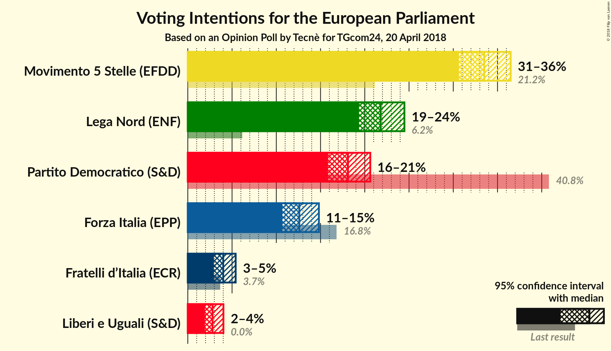

# Opinion Poll by Tecnè for TGcom24, 20 April 2018

<a href="#voting-intentions">Voting Intentions</a> | <a href="#seats">Seats</a> | <a href="#coalitions">Coalitions</a> | <a href="#technical-information">Technical Information</a>

## Voting Intentions

### Confidence Intervals

| Party | Last Result | Poll Result | 80% Confidence Interval | 90% Confidence Interval | 95% Confidence Interval | 99% Confidence Interval |
|:-----:|:-----------:|:-----------:|:-----------------------:|:-----------------------:|:-----------------------:|:-----------------------:|
| Movimento 5 Stelle (EFDD) | 21.1% | 33.5% | 31.6–35.5% |31.1–36.0% |30.6–36.5% |29.8–37.4% |
| Lega Nord (ENF) | 6.2% | 21.8% | 20.2–23.5% |19.7–24.0% |19.3–24.5% |18.6–25.3% |
| Partito Democratico (S&D) | 40.8% | 18.1% | 16.6–19.7% |16.2–20.2% |15.8–20.6% |15.2–21.4% |
| Forza Italia (EPP) | 16.8% | 12.6% | 11.3–14.0% |11.0–14.4% |10.7–14.8% |10.1–15.5% |
| Fratelli d’Italia (*) | 3.7% | 4.0% | 3.3–4.9% |3.1–5.2% |2.9–5.4% |2.7–5.9% |
| Liberi e Uguali (S&D) | 0.0% | 2.8% | 2.2–3.6% |2.1–3.8% |1.9–4.0% |1.7–4.4% |

*Note:* The poll result column reflects the actual value used in the calculations. Published results may vary slightly, and in addition be rounded to fewer digits.

## Seats

### Confidence Intervals

| Party | Last Result | Median | 80% Confidence Interval | 90% Confidence Interval | 95% Confidence Interval | 99% Confidence Interval |
|:-----:|:-----------:|:------:|:-----------------------:|:-----------------------:|:-----------------------:|:-----------------------:|
| <a href="#movimento-5-stelle-(efdd)">Movimento 5 Stelle (EFDD)</a> | 17 | 26 | 25–28 |24–28 |24–29 |23–30 |
| <a href="#lega-nord-(enf)">Lega Nord (ENF)</a> | 5 | 17 | 16–18 |16–18 |16–19 |15–20 |
| <a href="#partito-democratico-(s&d)">Partito Democratico (S&D)</a> | 31 | 14 | 13–15 |13–15 |13–15 |11–15 |
| <a href="#forza-italia-(epp)">Forza Italia (EPP)</a> | 13 | 10 | 9–11 |9–11 |8–11 |8–12 |
| <a href="#fratelli-d’italia-(*)">Fratelli d’Italia (*)</a> | 0 | 3 | 0–4 |0–4 |0–4 |0–5 |
| <a href="#liberi-e-uguali-(s&d)">Liberi e Uguali (S&D)</a> | 0 | 0 | 0 |0 |0 |0–3 |

### Movimento 5 Stelle (EFDD)

*For a full overview of the results for this party, see the [Movimento 5 Stelle (EFDD)](party-movimento5stelleefdd.html) page.*

| Number of Seats | Probability | Accumulated | Special Marks |
|:---------------:|:-----------:|:-----------:|:-------------:|
| 17 | 0% | 100% | Last Result |
| 18 | 0% | 100% |  |
| 19 | 0% | 100% |  |
| 20 | 0% | 100% |  |
| 21 | 0% | 100% |  |
| 22 | 0.1% | 100% |  |
| 23 | 1.0% | 99.9% |  |
| 24 | 7% | 98.9% |  |
| 25 | 25% | 92% |  |
| 26 | 35% | 66% | Median |
| 27 | 20% | 31% |  |
| 28 | 7% | 11% |  |
| 29 | 3% | 3% |  |
| 30 | 0.6% | 0.7% |  |
| 31 | 0.1% | 0.1% |  |
| 32 | 0% | 0% |  |

### Lega Nord (ENF)

*For a full overview of the results for this party, see the [Lega Nord (ENF)](party-leganordenf.html) page.*

| Number of Seats | Probability | Accumulated | Special Marks |
|:---------------:|:-----------:|:-----------:|:-------------:|
| 5 | 0% | 100% | Last Result |
| 6 | 0% | 100% |  |
| 7 | 0% | 100% |  |
| 8 | 0% | 100% |  |
| 9 | 0% | 100% |  |
| 10 | 0% | 100% |  |
| 11 | 0% | 100% |  |
| 12 | 0% | 100% |  |
| 13 | 0% | 100% |  |
| 14 | 0.2% | 100% |  |
| 15 | 1.3% | 99.8% |  |
| 16 | 23% | 98.5% |  |
| 17 | 51% | 76% | Median |
| 18 | 20% | 25% |  |
| 19 | 2% | 4% |  |
| 20 | 2% | 2% |  |
| 21 | 0.4% | 0.4% |  |
| 22 | 0% | 0% |  |

### Partito Democratico (S&D)

*For a full overview of the results for this party, see the [Partito Democratico (S&D)](party-partitodemocraticosd.html) page.*

| Number of Seats | Probability | Accumulated | Special Marks |
|:---------------:|:-----------:|:-----------:|:-------------:|
| 10 | 0.3% | 100% |  |
| 11 | 1.0% | 99.7% |  |
| 12 | 0.9% | 98.6% |  |
| 13 | 23% | 98% |  |
| 14 | 57% | 75% | Median |
| 15 | 19% | 19% |  |
| 16 | 0.1% | 0.1% |  |
| 17 | 0% | 0% |  |
| 18 | 0% | 0% |  |
| 19 | 0% | 0% |  |
| 20 | 0% | 0% |  |
| 21 | 0% | 0% |  |
| 22 | 0% | 0% |  |
| 23 | 0% | 0% |  |
| 24 | 0% | 0% |  |
| 25 | 0% | 0% |  |
| 26 | 0% | 0% |  |
| 27 | 0% | 0% |  |
| 28 | 0% | 0% |  |
| 29 | 0% | 0% |  |
| 30 | 0% | 0% |  |
| 31 | 0% | 0% | Last Result |

### Forza Italia (EPP)

*For a full overview of the results for this party, see the [Forza Italia (EPP)](party-forzaitaliaepp.html) page.*

| Number of Seats | Probability | Accumulated | Special Marks |
|:---------------:|:-----------:|:-----------:|:-------------:|
| 7 | 0.1% | 100% |  |
| 8 | 4% | 99.9% |  |
| 9 | 27% | 96% |  |
| 10 | 46% | 69% | Median |
| 11 | 21% | 23% |  |
| 12 | 2% | 2% |  |
| 13 | 0.1% | 0.1% | Last Result |
| 14 | 0% | 0% |  |

### Fratelli d’Italia (*)

*For a full overview of the results for this party, see the [Fratelli d’Italia (*)](party-fratellid’italia.html) page.*

| Number of Seats | Probability | Accumulated | Special Marks |
|:---------------:|:-----------:|:-----------:|:-------------:|
| 0 | 32% | 100% | Last Result |
| 1 | 0% | 68% |  |
| 2 | 0% | 68% |  |
| 3 | 43% | 68% | Median |
| 4 | 24% | 24% |  |
| 5 | 0.8% | 0.8% |  |
| 6 | 0% | 0% |  |

### Liberi e Uguali (S&D)

*For a full overview of the results for this party, see the [Liberi e Uguali (S&D)](party-liberieugualisd.html) page.*

| Number of Seats | Probability | Accumulated | Special Marks |
|:---------------:|:-----------:|:-----------:|:-------------:|
| 0 | 98% | 100% | Last Result, Median |
| 1 | 0% | 2% |  |
| 2 | 0% | 2% |  |
| 3 | 2% | 2% |  |
| 4 | 0.3% | 0.3% |  |
| 5 | 0% | 0% |  |

## Coalitions

### Confidence Intervals

| Coalition | Last Result | Median | Majority? | 80% Confidence Interval | 90% Confidence Interval | 95% Confidence Interval | 99% Confidence Interval |
|:---------:|:-----------:|:------:|:---------:|:-----------------------:|:-----------------------:|:-----------------------:|:-----------------------:|
| Movimento 5 Stelle (EFDD) | 17 | 26 | 0% | 25–28 | 24–28 | 24–29 | 23–30 |
| Lega Nord (ENF) | 5 | 17 | 0% | 16–18 | 16–18 | 16–19 | 15–20 |
| Partito Democratico (S&D) – Liberi e Uguali (S&D) | 31 | 14 | 0% | 13–15 | 13–15 | 13–15 | 11–17 |

### Movimento 5 Stelle (EFDD)

| Number of Seats | Probability | Accumulated | Special Marks |
|:---------------:|:-----------:|:-----------:|:-------------:|
| 17 | 0% | 100% | Last Result |
| 18 | 0% | 100% |  |
| 19 | 0% | 100% |  |
| 20 | 0% | 100% |  |
| 21 | 0% | 100% |  |
| 22 | 0.1% | 100% |  |
| 23 | 1.0% | 99.9% |  |
| 24 | 7% | 98.9% |  |
| 25 | 25% | 92% |  |
| 26 | 35% | 66% | Median |
| 27 | 20% | 31% |  |
| 28 | 7% | 11% |  |
| 29 | 3% | 3% |  |
| 30 | 0.6% | 0.7% |  |
| 31 | 0.1% | 0.1% |  |
| 32 | 0% | 0% |  |

### Lega Nord (ENF)

| Number of Seats | Probability | Accumulated | Special Marks |
|:---------------:|:-----------:|:-----------:|:-------------:|
| 5 | 0% | 100% | Last Result |
| 6 | 0% | 100% |  |
| 7 | 0% | 100% |  |
| 8 | 0% | 100% |  |
| 9 | 0% | 100% |  |
| 10 | 0% | 100% |  |
| 11 | 0% | 100% |  |
| 12 | 0% | 100% |  |
| 13 | 0% | 100% |  |
| 14 | 0.2% | 100% |  |
| 15 | 1.3% | 99.8% |  |
| 16 | 23% | 98.5% |  |
| 17 | 51% | 76% | Median |
| 18 | 20% | 25% |  |
| 19 | 2% | 4% |  |
| 20 | 2% | 2% |  |
| 21 | 0.4% | 0.4% |  |
| 22 | 0% | 0% |  |

### Partito Democratico (S&D) – Liberi e Uguali (S&D)

| Number of Seats | Probability | Accumulated | Special Marks |
|:---------------:|:-----------:|:-----------:|:-------------:|
| 10 | 0.3% | 100% |  |
| 11 | 1.0% | 99.7% |  |
| 12 | 0.7% | 98.7% |  |
| 13 | 21% | 98% |  |
| 14 | 56% | 77% | Median |
| 15 | 19% | 21% |  |
| 16 | 1.4% | 2% |  |
| 17 | 0.9% | 1.0% |  |
| 18 | 0.1% | 0.1% |  |
| 19 | 0% | 0% |  |
| 20 | 0% | 0% |  |
| 21 | 0% | 0% |  |
| 22 | 0% | 0% |  |
| 23 | 0% | 0% |  |
| 24 | 0% | 0% |  |
| 25 | 0% | 0% |  |
| 26 | 0% | 0% |  |
| 27 | 0% | 0% |  |
| 28 | 0% | 0% |  |
| 29 | 0% | 0% |  |
| 30 | 0% | 0% |  |
| 31 | 0% | 0% | Last Result |

## Technical Information

### Opinion Poll

+ **Polling firm:** Tecnè
+ **Commissioner(s):** TGcom24
+ **Fieldwork period:** 20 April 2018

### Calculations

+ **Sample size:** 1000
+ **Simulations done:** 131,072
+ **Error estimate:** 0.78%

