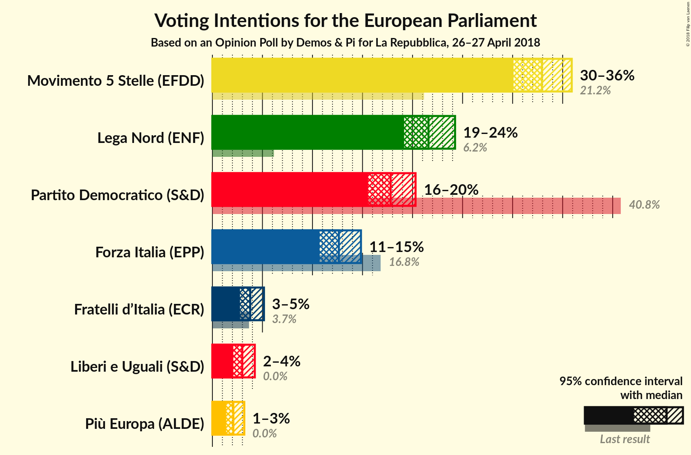
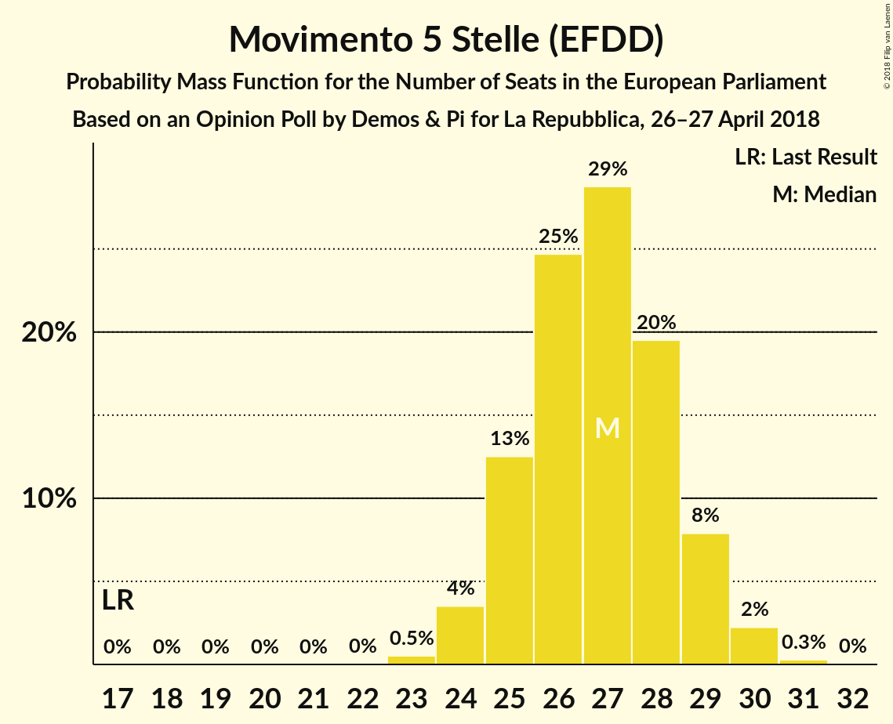
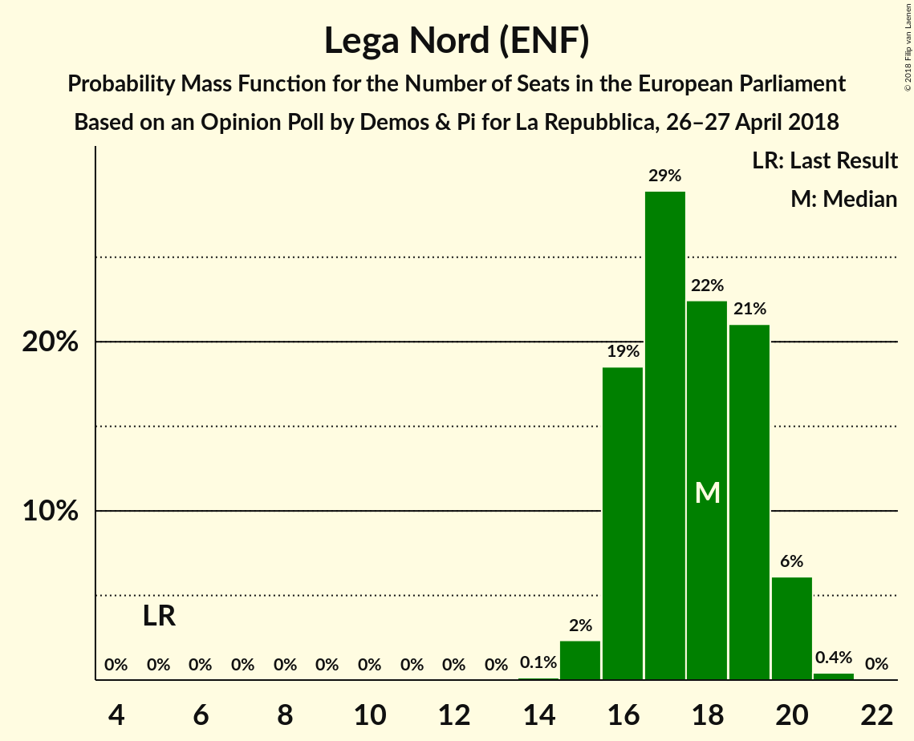
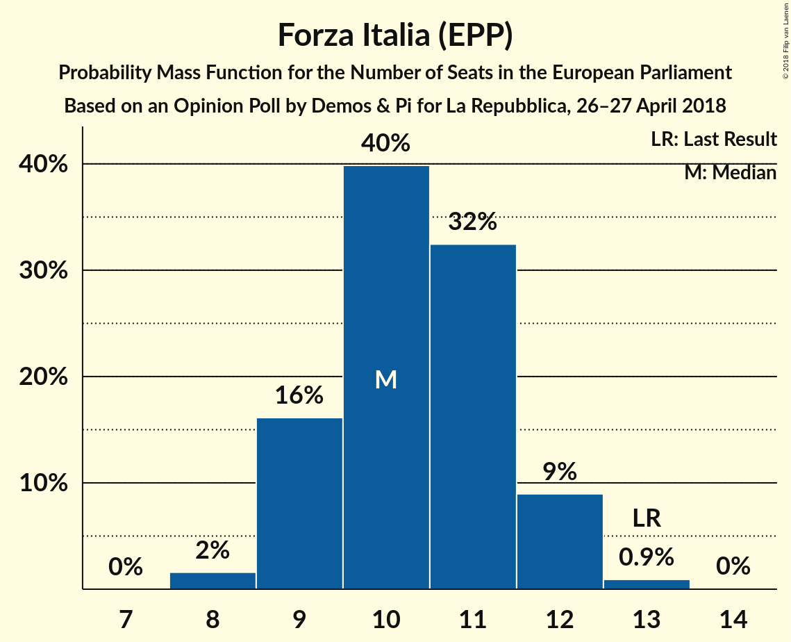
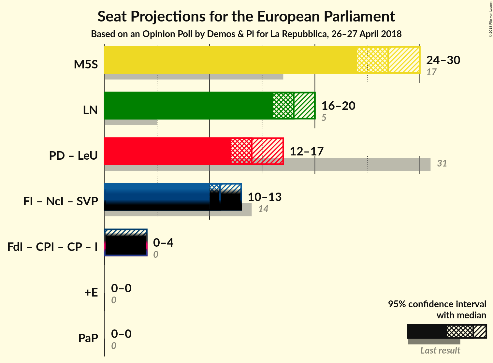

# Opinion Poll by Demos & Pi for La Repubblica, 26–27 April 2018

<a href="#voting-intentions">Voting Intentions</a> | <a href="#seats">Seats</a> | <a href="#coalitions">Coalitions</a> | <a href="#technical-information">Technical Information</a>

## Voting Intentions

### Confidence Intervals

| Party | Last Result | Poll Result | 80% Confidence Interval | 90% Confidence Interval | 95% Confidence Interval | 99% Confidence Interval |
|:-----:|:-----------:|:-----------:|:-----------------------:|:-----------------------:|:-----------------------:|:-----------------------:|
| Movimento 5 Stelle (EFDD) | 21.1% | 32.9% | 31.1–34.9% |30.5–35.4% |30.1–35.9% |29.2–36.9% |
| Lega Nord (ENF) | 6.2% | 21.6% | 20.0–23.3% |19.5–23.8% |19.2–24.2% |18.4–25.1% |
| Partito Democratico (S&D) | 40.8% | 17.8% | 16.3–19.4% |15.9–19.9% |15.6–20.3% |14.9–21.1% |
| Forza Italia (EPP) | 16.8% | 12.6% | 11.4–14.1% |11.0–14.5% |10.7–14.8% |10.1–15.6% |
| Fratelli d’Italia (*) | 3.7% | 3.8% | 3.1–4.7% |2.9–4.9% |2.8–5.2% |2.5–5.6% |
| Liberi e Uguali (S&D) | 0.0% | 3.0% | 2.4–3.8% |2.2–4.0% |2.1–4.2% |1.8–4.7% |
| Più Europa (ALDE) | 0.0% | 2.1% | 1.6–2.8% |1.5–3.0% |1.4–3.2% |1.2–3.6% |

*Note:* The poll result column reflects the actual value used in the calculations. Published results may vary slightly, and in addition be rounded to fewer digits.

## Seats

### Confidence Intervals

| Party | Last Result | Median | 80% Confidence Interval | 90% Confidence Interval | 95% Confidence Interval | 99% Confidence Interval |
|:-----:|:-----------:|:------:|:-----------------------:|:-----------------------:|:-----------------------:|:-----------------------:|
| <a href="#movimento-5-stelle-(efdd)">Movimento 5 Stelle (EFDD)</a> | 17 | 27 | 26–30 |26–30 |25–30 |24–30 |
| <a href="#lega-nord-(enf)">Lega Nord (ENF)</a> | 5 | 16 | 16–19 |16–19 |16–20 |15–20 |
| <a href="#partito-democratico-(s&d)">Partito Democratico (S&D)</a> | 31 | 14 | 11–14 |11–15 |11–15 |10–16 |
| <a href="#forza-italia-(epp)">Forza Italia (EPP)</a> | 13 | 10 | 10–12 |9–12 |8–12 |7–12 |
| <a href="#fratelli-d’italia-(*)">Fratelli d’Italia (*)</a> | 0 | 0 | 0 |0–4 |0–4 |0–4 |
| <a href="#liberi-e-uguali-(s&d)">Liberi e Uguali (S&D)</a> | 0 | 0 | 0–4 |0–4 |0–4 |0–4 |
| <a href="#più-europa-(alde)">Più Europa (ALDE)</a> | 0 | 0 | 0 |0 |0 |0 |

### Movimento 5 Stelle (EFDD)

*For a full overview of the results for this party, see the [Movimento 5 Stelle (EFDD)](party-movimento5stelleefdd.html) page.*

| Number of Seats | Probability | Accumulated | Special Marks |
|:---------------:|:-----------:|:-----------:|:-------------:|
| 17 | 0% | 100% | Last Result |
| 18 | 0% | 100% |  |
| 19 | 0% | 100% |  |
| 20 | 0% | 100% |  |
| 21 | 0% | 100% |  |
| 22 | 0.1% | 100% |  |
| 23 | 0% | 99.9% |  |
| 24 | 0.4% | 99.9% |  |
| 25 | 3% | 99.5% |  |
| 26 | 46% | 96% |  |
| 27 | 2% | 50% | Median |
| 28 | 22% | 49% |  |
| 29 | 0.9% | 27% |  |
| 30 | 26% | 26% |  |
| 31 | 0% | 0% |  |

### Lega Nord (ENF)

*For a full overview of the results for this party, see the [Lega Nord (ENF)](party-leganordenf.html) page.*

| Number of Seats | Probability | Accumulated | Special Marks |
|:---------------:|:-----------:|:-----------:|:-------------:|
| 5 | 0% | 100% | Last Result |
| 6 | 0% | 100% |  |
| 7 | 0% | 100% |  |
| 8 | 0% | 100% |  |
| 9 | 0% | 100% |  |
| 10 | 0% | 100% |  |
| 11 | 0% | 100% |  |
| 12 | 0% | 100% |  |
| 13 | 0% | 100% |  |
| 14 | 0.1% | 100% |  |
| 15 | 2% | 99.9% |  |
| 16 | 65% | 98% | Median |
| 17 | 0.4% | 33% |  |
| 18 | 21% | 33% |  |
| 19 | 8% | 12% |  |
| 20 | 4% | 4% |  |
| 21 | 0% | 0% |  |

### Partito Democratico (S&D)

*For a full overview of the results for this party, see the [Partito Democratico (S&D)](party-partitodemocraticosd.html) page.*

| Number of Seats | Probability | Accumulated | Special Marks |
|:---------------:|:-----------:|:-----------:|:-------------:|
| 10 | 0.6% | 100% |  |
| 11 | 17% | 99.4% |  |
| 12 | 8% | 83% |  |
| 13 | 14% | 74% |  |
| 14 | 54% | 60% | Median |
| 15 | 5% | 7% |  |
| 16 | 2% | 2% |  |
| 17 | 0% | 0% |  |
| 18 | 0% | 0% |  |
| 19 | 0% | 0% |  |
| 20 | 0% | 0% |  |
| 21 | 0% | 0% |  |
| 22 | 0% | 0% |  |
| 23 | 0% | 0% |  |
| 24 | 0% | 0% |  |
| 25 | 0% | 0% |  |
| 26 | 0% | 0% |  |
| 27 | 0% | 0% |  |
| 28 | 0% | 0% |  |
| 29 | 0% | 0% |  |
| 30 | 0% | 0% |  |
| 31 | 0% | 0% | Last Result |

### Forza Italia (EPP)

*For a full overview of the results for this party, see the [Forza Italia (EPP)](party-forzaitaliaepp.html) page.*

| Number of Seats | Probability | Accumulated | Special Marks |
|:---------------:|:-----------:|:-----------:|:-------------:|
| 7 | 1.4% | 100% |  |
| 8 | 3% | 98.6% |  |
| 9 | 2% | 96% |  |
| 10 | 44% | 94% | Median |
| 11 | 26% | 50% |  |
| 12 | 24% | 24% |  |
| 13 | 0.1% | 0.1% | Last Result |
| 14 | 0% | 0% |  |

### Fratelli d’Italia (*)

*For a full overview of the results for this party, see the [Fratelli d’Italia (*)](party-fratellid’italia.html) page.*

| Number of Seats | Probability | Accumulated | Special Marks |
|:---------------:|:-----------:|:-----------:|:-------------:|
| 0 | 94% | 100% | Last Result, Median |
| 1 | 0% | 6% |  |
| 2 | 0% | 6% |  |
| 3 | 0.1% | 6% |  |
| 4 | 6% | 6% |  |
| 5 | 0.1% | 0.1% |  |
| 6 | 0% | 0% |  |

### Liberi e Uguali (S&D)

*For a full overview of the results for this party, see the [Liberi e Uguali (S&D)](party-liberieugualisd.html) page.*

| Number of Seats | Probability | Accumulated | Special Marks |
|:---------------:|:-----------:|:-----------:|:-------------:|
| 0 | 59% | 100% | Last Result, Median |
| 1 | 0% | 41% |  |
| 2 | 0% | 41% |  |
| 3 | 1.5% | 41% |  |
| 4 | 39% | 39% |  |
| 5 | 0% | 0% |  |

### Più Europa (ALDE)

*For a full overview of the results for this party, see the [Più Europa (ALDE)](party-piùeuropaalde.html) page.*

| Number of Seats | Probability | Accumulated | Special Marks |
|:---------------:|:-----------:|:-----------:|:-------------:|
| 0 | 100% | 100% | Last Result, Median |

## Coalitions

### Confidence Intervals

| Coalition | Last Result | Median | Majority? | 80% Confidence Interval | 90% Confidence Interval | 95% Confidence Interval | 99% Confidence Interval |
|:---------:|:-----------:|:------:|:---------:|:-----------------------:|:-----------------------:|:-----------------------:|:-----------------------:|
| Movimento 5 Stelle (EFDD) | 17 | 27 | 0% | 26–30 | 26–30 | 25–30 | 24–30 |
| Lega Nord (ENF) | 5 | 16 | 0% | 16–19 | 16–19 | 16–20 | 15–20 |
| Partito Democratico (S&D) – Liberi e Uguali (S&D) | 31 | 14 | 0% | 11–18 | 11–18 | 11–18 | 10–18 |
| Più Europa (ALDE) | 0 | 0 | 0% | 0 | 0 | 0 | 0 |

### Movimento 5 Stelle (EFDD)

| Number of Seats | Probability | Accumulated | Special Marks |
|:---------------:|:-----------:|:-----------:|:-------------:|
| 17 | 0% | 100% | Last Result |
| 18 | 0% | 100% |  |
| 19 | 0% | 100% |  |
| 20 | 0% | 100% |  |
| 21 | 0% | 100% |  |
| 22 | 0.1% | 100% |  |
| 23 | 0% | 99.9% |  |
| 24 | 0.4% | 99.9% |  |
| 25 | 3% | 99.5% |  |
| 26 | 46% | 96% |  |
| 27 | 2% | 50% | Median |
| 28 | 22% | 49% |  |
| 29 | 0.9% | 27% |  |
| 30 | 26% | 26% |  |
| 31 | 0% | 0% |  |

### Lega Nord (ENF)

| Number of Seats | Probability | Accumulated | Special Marks |
|:---------------:|:-----------:|:-----------:|:-------------:|
| 5 | 0% | 100% | Last Result |
| 6 | 0% | 100% |  |
| 7 | 0% | 100% |  |
| 8 | 0% | 100% |  |
| 9 | 0% | 100% |  |
| 10 | 0% | 100% |  |
| 11 | 0% | 100% |  |
| 12 | 0% | 100% |  |
| 13 | 0% | 100% |  |
| 14 | 0.1% | 100% |  |
| 15 | 2% | 99.9% |  |
| 16 | 65% | 98% | Median |
| 17 | 0.4% | 33% |  |
| 18 | 21% | 33% |  |
| 19 | 8% | 12% |  |
| 20 | 4% | 4% |  |
| 21 | 0% | 0% |  |

### Partito Democratico (S&D) – Liberi e Uguali (S&D)

| Number of Seats | Probability | Accumulated | Special Marks |
|:---------------:|:-----------:|:-----------:|:-------------:|
| 10 | 0.6% | 100% |  |
| 11 | 17% | 99.4% |  |
| 12 | 7% | 83% |  |
| 13 | 0.4% | 75% |  |
| 14 | 28% | 75% | Median |
| 15 | 6% | 47% |  |
| 16 | 2% | 41% |  |
| 17 | 14% | 39% |  |
| 18 | 26% | 26% |  |
| 19 | 0% | 0% |  |
| 20 | 0% | 0% |  |
| 21 | 0% | 0% |  |
| 22 | 0% | 0% |  |
| 23 | 0% | 0% |  |
| 24 | 0% | 0% |  |
| 25 | 0% | 0% |  |
| 26 | 0% | 0% |  |
| 27 | 0% | 0% |  |
| 28 | 0% | 0% |  |
| 29 | 0% | 0% |  |
| 30 | 0% | 0% |  |
| 31 | 0% | 0% | Last Result |

### Più Europa (ALDE)

| Number of Seats | Probability | Accumulated | Special Marks |
|:---------------:|:-----------:|:-----------:|:-------------:|
| 0 | 100% | 100% | Last Result, Median |

## Technical Information

### Opinion Poll

+ **Polling firm:** Demos & Pi
+ **Commissioner(s):** La Repubblica
+ **Fieldwork period:** 26–27 April 2018

### Calculations

+ **Sample size:** 1005
+ **Simulations done:** 1,024
+ **Error estimate:** 2.99%

