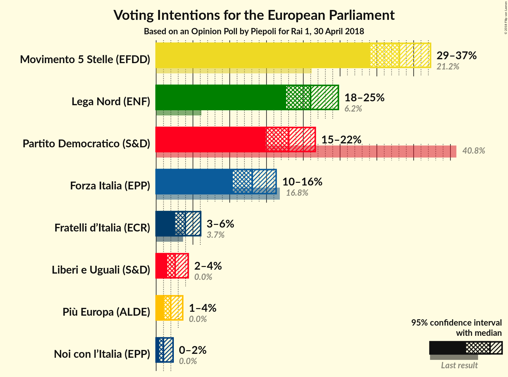
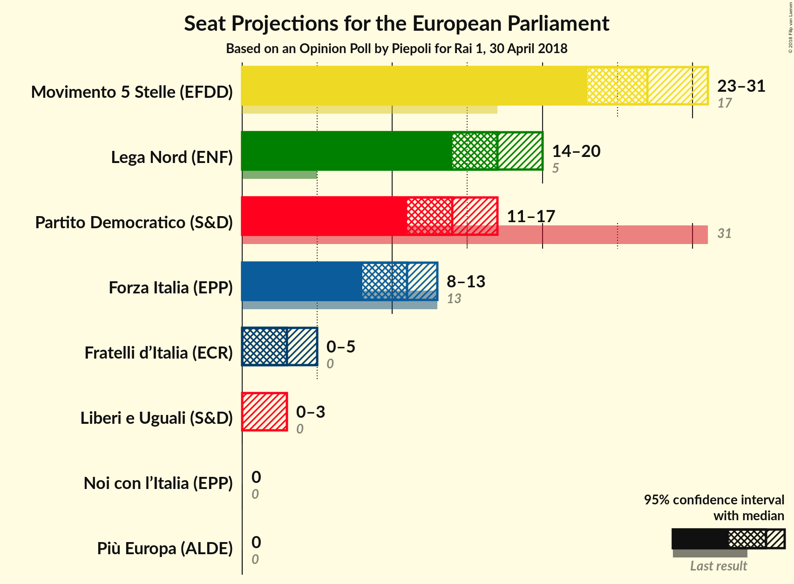
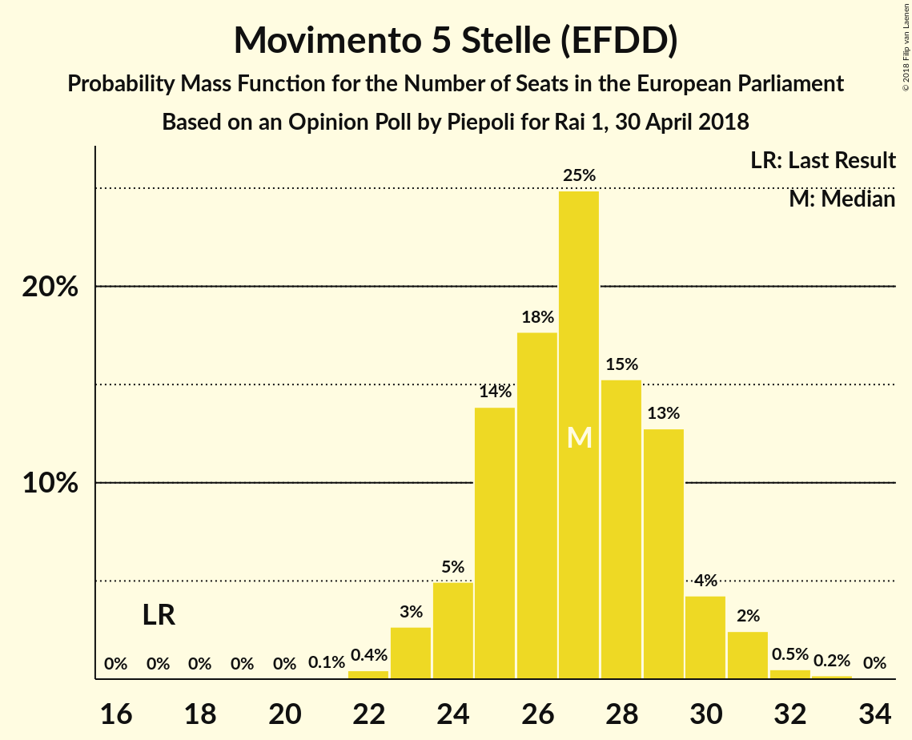
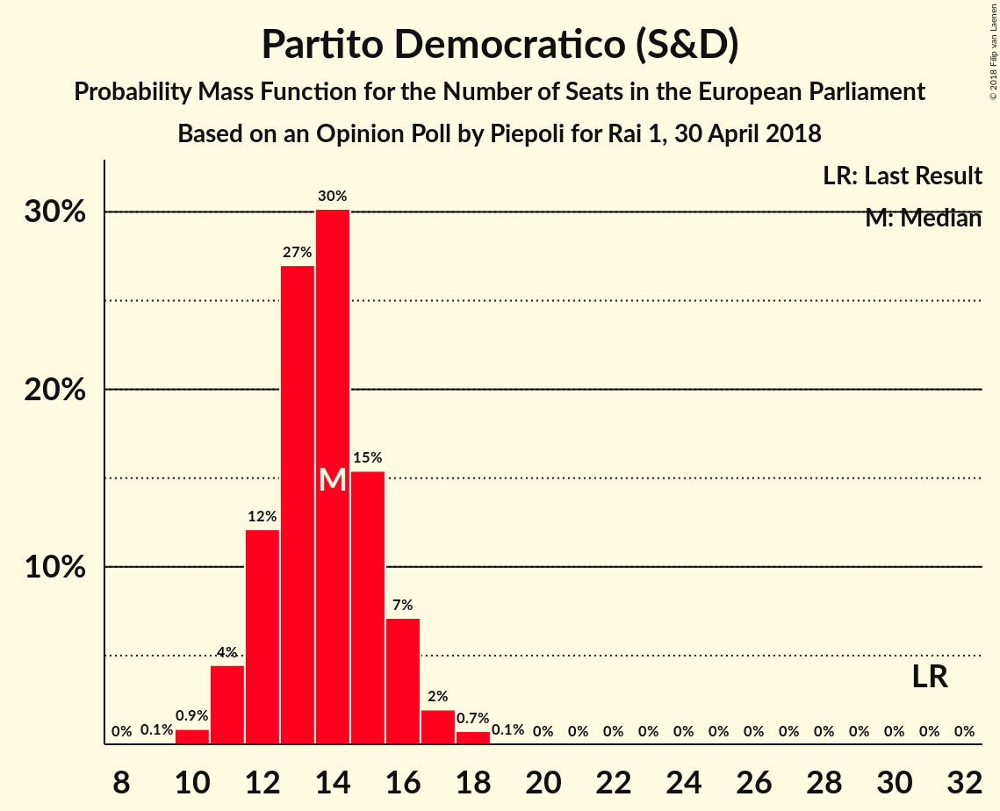
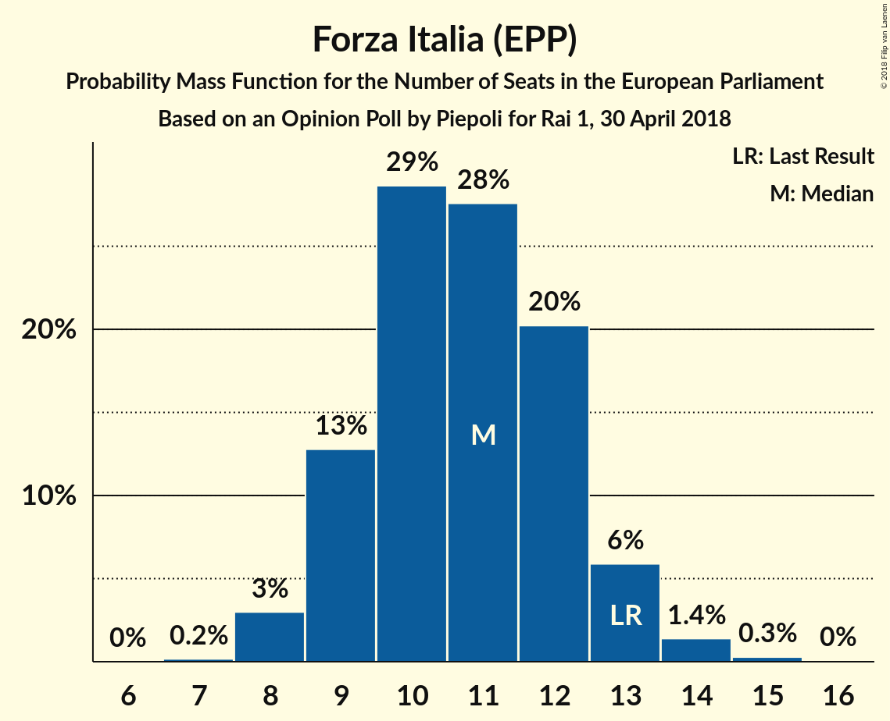

# Opinion Poll by Piepoli for Rai 1, 30 April 2018

<a href="#voting-intentions">Voting Intentions</a> | <a href="#seats">Seats</a> | <a href="#coalitions">Coalitions</a> | <a href="#technical-information">Technical Information</a>

## Voting Intentions

### Confidence Intervals

| Party | Last Result | Poll Result | 80% Confidence Interval | 90% Confidence Interval | 95% Confidence Interval | 99% Confidence Interval |
|:-----:|:-----------:|:-----------:|:-----------------------:|:-----------------------:|:-----------------------:|:-----------------------:|
| Movimento 5 Stelle (EFDD) | 21.1% | 33.1% | 30.5–35.8% |29.7–36.6% |29.1–37.3% |27.9–38.6% |
| Lega Nord (ENF) | 6.2% | 21.0% | 18.8–23.5% |18.2–24.2% |17.7–24.8% |16.7–26.0% |
| Partito Democratico (S&D) | 40.8% | 18.0% | 16.0–20.4% |15.4–21.0% |14.9–21.6% |14.0–22.8% |
| Forza Italia (EPP) | 16.8% | 13.1% | 11.3–15.2% |10.8–15.8% |10.4–16.3% |9.6–17.4% |
| Fratelli d’Italia (*) | 3.7% | 4.0% | 3.0–5.3% |2.8–5.7% |2.6–6.1% |2.2–6.8% |
| Liberi e Uguali (S&D) | 0.0% | 2.6% | 1.9–3.7% |1.7–4.1% |1.5–4.4% |1.2–5.0% |
| Più Europa (ALDE) | 0.0% | 2.0% | 1.4–3.0% |1.2–3.3% |1.1–3.6% |0.9–4.2% |
| Noi con l’Italia (EPP) | 0.0% | 1.0% | 0.6–1.8% |0.5–2.1% |0.4–2.3% |0.3–2.8% |

*Note:* The poll result column reflects the actual value used in the calculations. Published results may vary slightly, and in addition be rounded to fewer digits.

## Seats

### Confidence Intervals

| Party | Last Result | Median | 80% Confidence Interval | 90% Confidence Interval | 95% Confidence Interval | 99% Confidence Interval |
|:-----:|:-----------:|:------:|:-----------------------:|:-----------------------:|:-----------------------:|:-----------------------:|
| <a href="#movimento-5-stelle-(efdd)">Movimento 5 Stelle (EFDD)</a> | 17 | 27 | 25–29 |24–30 |23–30 |23–31 |
| <a href="#lega-nord-(enf)">Lega Nord (ENF)</a> | 5 | 17 | 15–19 |14–20 |14–20 |14–21 |
| <a href="#partito-democratico-(s&d)">Partito Democratico (S&D)</a> | 31 | 14 | 12–15 |12–16 |11–16 |10–18 |
| <a href="#forza-italia-(epp)">Forza Italia (EPP)</a> | 13 | 11 | 9–12 |9–13 |8–13 |8–14 |
| <a href="#fratelli-d’italia-(*)">Fratelli d’Italia (*)</a> | 0 | 0 | 0–4 |0–5 |0–5 |0–5 |
| <a href="#liberi-e-uguali-(s&d)">Liberi e Uguali (S&D)</a> | 0 | 0 | 0 |0 |0–3 |0–4 |
| <a href="#più-europa-(alde)">Più Europa (ALDE)</a> | 0 | 0 | 0 |0 |0 |0–3 |
| <a href="#noi-con-l’italia-(epp)">Noi con l’Italia (EPP)</a> | 0 | 0 | 0 |0 |0 |0 |

### Movimento 5 Stelle (EFDD)

*For a full overview of the results for this party, see the [Movimento 5 Stelle (EFDD)](party-movimento5stelleefdd.html) page.*

| Number of Seats | Probability | Accumulated | Special Marks |
|:---------------:|:-----------:|:-----------:|:-------------:|
| 17 | 0% | 100% | Last Result |
| 18 | 0% | 100% |  |
| 19 | 0% | 100% |  |
| 20 | 0% | 100% |  |
| 21 | 0.1% | 100% |  |
| 22 | 0.3% | 99.9% |  |
| 23 | 2% | 99.6% |  |
| 24 | 6% | 97% |  |
| 25 | 13% | 91% |  |
| 26 | 25% | 79% |  |
| 27 | 15% | 54% | Median |
| 28 | 19% | 39% |  |
| 29 | 14% | 20% |  |
| 30 | 4% | 7% |  |
| 31 | 2% | 2% |  |
| 32 | 0.2% | 0.4% |  |
| 33 | 0.2% | 0.2% |  |
| 34 | 0% | 0% |  |

### Lega Nord (ENF)

*For a full overview of the results for this party, see the [Lega Nord (ENF)](party-leganordenf.html) page.*

| Number of Seats | Probability | Accumulated | Special Marks |
|:---------------:|:-----------:|:-----------:|:-------------:|
| 5 | 0% | 100% | Last Result |
| 6 | 0% | 100% |  |
| 7 | 0% | 100% |  |
| 8 | 0% | 100% |  |
| 9 | 0% | 100% |  |
| 10 | 0% | 100% |  |
| 11 | 0% | 100% |  |
| 12 | 0% | 100% |  |
| 13 | 0.3% | 100% |  |
| 14 | 5% | 99.6% |  |
| 15 | 7% | 95% |  |
| 16 | 23% | 88% |  |
| 17 | 19% | 64% | Median |
| 18 | 29% | 46% |  |
| 19 | 9% | 17% |  |
| 20 | 6% | 8% |  |
| 21 | 1.4% | 2% |  |
| 22 | 0.4% | 0.4% |  |
| 23 | 0% | 0% |  |

### Partito Democratico (S&D)

*For a full overview of the results for this party, see the [Partito Democratico (S&D)](party-partitodemocraticosd.html) page.*

| Number of Seats | Probability | Accumulated | Special Marks |
|:---------------:|:-----------:|:-----------:|:-------------:|
| 9 | 0.1% | 100% |  |
| 10 | 1.4% | 99.9% |  |
| 11 | 3% | 98.5% |  |
| 12 | 13% | 95% |  |
| 13 | 16% | 82% |  |
| 14 | 34% | 67% | Median |
| 15 | 24% | 33% |  |
| 16 | 6% | 9% |  |
| 17 | 2% | 2% |  |
| 18 | 0.4% | 0.5% |  |
| 19 | 0.1% | 0.1% |  |
| 20 | 0% | 0% |  |
| 21 | 0% | 0% |  |
| 22 | 0% | 0% |  |
| 23 | 0% | 0% |  |
| 24 | 0% | 0% |  |
| 25 | 0% | 0% |  |
| 26 | 0% | 0% |  |
| 27 | 0% | 0% |  |
| 28 | 0% | 0% |  |
| 29 | 0% | 0% |  |
| 30 | 0% | 0% |  |
| 31 | 0% | 0% | Last Result |

### Forza Italia (EPP)

*For a full overview of the results for this party, see the [Forza Italia (EPP)](party-forzaitaliaepp.html) page.*

| Number of Seats | Probability | Accumulated | Special Marks |
|:---------------:|:-----------:|:-----------:|:-------------:|
| 7 | 0.1% | 100% |  |
| 8 | 4% | 99.9% |  |
| 9 | 8% | 96% |  |
| 10 | 26% | 89% |  |
| 11 | 42% | 63% | Median |
| 12 | 15% | 21% |  |
| 13 | 3% | 6% | Last Result |
| 14 | 2% | 2% |  |
| 15 | 0.2% | 0.2% |  |
| 16 | 0% | 0% |  |

### Fratelli d’Italia (*)

*For a full overview of the results for this party, see the [Fratelli d’Italia (*)](party-fratellid’italia.html) page.*

| Number of Seats | Probability | Accumulated | Special Marks |
|:---------------:|:-----------:|:-----------:|:-------------:|
| 0 | 53% | 100% | Last Result, Median |
| 1 | 0% | 47% |  |
| 2 | 0% | 47% |  |
| 3 | 8% | 47% |  |
| 4 | 32% | 39% |  |
| 5 | 7% | 7% |  |
| 6 | 0.3% | 0.3% |  |
| 7 | 0% | 0% |  |

### Liberi e Uguali (S&D)

*For a full overview of the results for this party, see the [Liberi e Uguali (S&D)](party-liberieugualisd.html) page.*

| Number of Seats | Probability | Accumulated | Special Marks |
|:---------------:|:-----------:|:-----------:|:-------------:|
| 0 | 97% | 100% | Last Result, Median |
| 1 | 0% | 3% |  |
| 2 | 0% | 3% |  |
| 3 | 2% | 3% |  |
| 4 | 0.8% | 0.8% |  |
| 5 | 0% | 0% |  |

### Più Europa (ALDE)

*For a full overview of the results for this party, see the [Più Europa (ALDE)](party-piùeuropaalde.html) page.*

| Number of Seats | Probability | Accumulated | Special Marks |
|:---------------:|:-----------:|:-----------:|:-------------:|
| 0 | 99.4% | 100% | Last Result, Median |
| 1 | 0% | 0.6% |  |
| 2 | 0% | 0.6% |  |
| 3 | 0.4% | 0.6% |  |
| 4 | 0.3% | 0.3% |  |
| 5 | 0% | 0% |  |

### Noi con l’Italia (EPP)

*For a full overview of the results for this party, see the [Noi con l’Italia (EPP)](party-noiconl’italiaepp.html) page.*

| Number of Seats | Probability | Accumulated | Special Marks |
|:---------------:|:-----------:|:-----------:|:-------------:|
| 0 | 100% | 100% | Last Result, Median |

## Coalitions

### Confidence Intervals

| Coalition | Last Result | Median | Majority? | 80% Confidence Interval | 90% Confidence Interval | 95% Confidence Interval | 99% Confidence Interval |
|:---------:|:-----------:|:------:|:---------:|:-----------------------:|:-----------------------:|:-----------------------:|:-----------------------:|
| Movimento 5 Stelle (EFDD) | 17 | 27 | 0% | 25–29 | 24–30 | 23–30 | 23–31 |
| Lega Nord (ENF) | 5 | 17 | 0% | 15–19 | 14–20 | 14–20 | 14–21 |
| Partito Democratico (S&D) – Liberi e Uguali (S&D) | 31 | 14 | 0% | 12–16 | 12–16 | 11–17 | 10–18 |
| Più Europa (ALDE) | 0 | 0 | 0% | 0 | 0 | 0 | 0–3 |

### Movimento 5 Stelle (EFDD)

| Number of Seats | Probability | Accumulated | Special Marks |
|:---------------:|:-----------:|:-----------:|:-------------:|
| 17 | 0% | 100% | Last Result |
| 18 | 0% | 100% |  |
| 19 | 0% | 100% |  |
| 20 | 0% | 100% |  |
| 21 | 0.1% | 100% |  |
| 22 | 0.3% | 99.9% |  |
| 23 | 2% | 99.6% |  |
| 24 | 6% | 97% |  |
| 25 | 13% | 91% |  |
| 26 | 25% | 79% |  |
| 27 | 15% | 54% | Median |
| 28 | 19% | 39% |  |
| 29 | 14% | 20% |  |
| 30 | 4% | 7% |  |
| 31 | 2% | 2% |  |
| 32 | 0.2% | 0.4% |  |
| 33 | 0.2% | 0.2% |  |
| 34 | 0% | 0% |  |

### Lega Nord (ENF)

| Number of Seats | Probability | Accumulated | Special Marks |
|:---------------:|:-----------:|:-----------:|:-------------:|
| 5 | 0% | 100% | Last Result |
| 6 | 0% | 100% |  |
| 7 | 0% | 100% |  |
| 8 | 0% | 100% |  |
| 9 | 0% | 100% |  |
| 10 | 0% | 100% |  |
| 11 | 0% | 100% |  |
| 12 | 0% | 100% |  |
| 13 | 0.3% | 100% |  |
| 14 | 5% | 99.6% |  |
| 15 | 7% | 95% |  |
| 16 | 23% | 88% |  |
| 17 | 19% | 64% | Median |
| 18 | 29% | 46% |  |
| 19 | 9% | 17% |  |
| 20 | 6% | 8% |  |
| 21 | 1.4% | 2% |  |
| 22 | 0.4% | 0.4% |  |
| 23 | 0% | 0% |  |

### Partito Democratico (S&D) – Liberi e Uguali (S&D)

| Number of Seats | Probability | Accumulated | Special Marks |
|:---------------:|:-----------:|:-----------:|:-------------:|
| 9 | 0.1% | 100% |  |
| 10 | 1.3% | 99.9% |  |
| 11 | 3% | 98.6% |  |
| 12 | 12% | 96% |  |
| 13 | 15% | 84% |  |
| 14 | 34% | 69% | Median |
| 15 | 25% | 35% |  |
| 16 | 7% | 10% |  |
| 17 | 2% | 3% |  |
| 18 | 0.6% | 0.9% |  |
| 19 | 0.2% | 0.3% |  |
| 20 | 0.1% | 0.1% |  |
| 21 | 0% | 0% |  |
| 22 | 0% | 0% |  |
| 23 | 0% | 0% |  |
| 24 | 0% | 0% |  |
| 25 | 0% | 0% |  |
| 26 | 0% | 0% |  |
| 27 | 0% | 0% |  |
| 28 | 0% | 0% |  |
| 29 | 0% | 0% |  |
| 30 | 0% | 0% |  |
| 31 | 0% | 0% | Last Result |

### Più Europa (ALDE)

| Number of Seats | Probability | Accumulated | Special Marks |
|:---------------:|:-----------:|:-----------:|:-------------:|
| 0 | 99.4% | 100% | Last Result, Median |
| 1 | 0% | 0.6% |  |
| 2 | 0% | 0.6% |  |
| 3 | 0.4% | 0.6% |  |
| 4 | 0.3% | 0.3% |  |
| 5 | 0% | 0% |  |

## Technical Information

### Opinion Poll

+ **Polling firm:** Piepoli
+ **Commissioner(s):** Rai 1
+ **Fieldwork period:** 30 April 2018

### Calculations

+ **Sample size:** 505
+ **Simulations done:** 131,072
+ **Error estimate:** 2.80%

