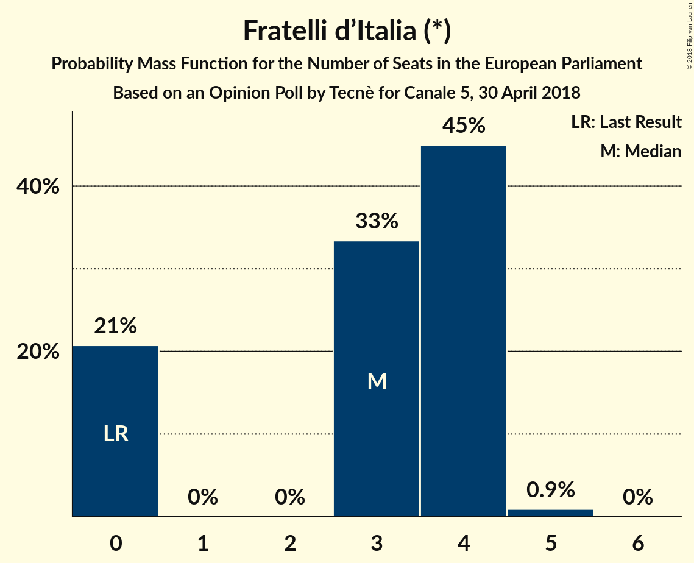

# Opinion Poll by Tecnè for Canale 5, 30 April 2018

<a href="#voting-intentions">Voting Intentions</a> | <a href="#seats">Seats</a> | <a href="#coalitions">Coalitions</a> | <a href="#technical-information">Technical Information</a>

## Voting Intentions

### Confidence Intervals

| Party | Last Result | Poll Result | 80% Confidence Interval | 90% Confidence Interval | 95% Confidence Interval | 99% Confidence Interval |
|:-----:|:-----------:|:-----------:|:-----------------------:|:-----------------------:|:-----------------------:|:-----------------------:|
| Movimento 5 Stelle (EFDD) | 21.1% | 31.8% | 30.3–33.3% |29.9–33.8% |29.6–34.1% |28.9–34.9% |
| Lega Nord (ENF) | 6.2% | 22.8% | 21.5–24.2% |21.1–24.6% |20.8–24.9% |20.2–25.6% |
| Partito Democratico (S&D) | 40.8% | 17.6% | 16.4–18.9% |16.1–19.3% |15.8–19.6% |15.3–20.2% |
| Forza Italia (EPP) | 16.8% | 12.6% | 11.6–13.7% |11.3–14.1% |11.1–14.4% |10.6–14.9% |
| Fratelli d’Italia (*) | 3.7% | 4.4% | 3.8–5.1% |3.6–5.3% |3.5–5.5% |3.2–5.9% |
| Liberi e Uguali (S&D) | 0.0% | 3.3% | 2.8–4.0% |2.7–4.1% |2.5–4.3% |2.3–4.6% |

*Note:* The poll result column reflects the actual value used in the calculations. Published results may vary slightly, and in addition be rounded to fewer digits.

## Seats

### Confidence Intervals

| Party | Last Result | Median | 80% Confidence Interval | 90% Confidence Interval | 95% Confidence Interval | 99% Confidence Interval |
|:-----:|:-----------:|:------:|:-----------------------:|:-----------------------:|:-----------------------:|:-----------------------:|
| <a href="#movimento-5-stelle-(efdd)">Movimento 5 Stelle (EFDD)</a> | 17 | 25 | 24–26 |23–27 |23–27 |22–28 |
| <a href="#lega-nord-(enf)">Lega Nord (ENF)</a> | 5 | 18 | 17–19 |17–20 |16–20 |16–20 |
| <a href="#partito-democratico-(s&d)">Partito Democratico (S&D)</a> | 31 | 13 | 12–14 |12–14 |11–15 |11–15 |
| <a href="#forza-italia-(epp)">Forza Italia (EPP)</a> | 13 | 10 | 9–11 |9–11 |9–11 |8–12 |
| <a href="#fratelli-d’italia-(*)">Fratelli d’Italia (*)</a> | 0 | 3 | 0–4 |0–4 |0–4 |0–5 |
| <a href="#liberi-e-uguali-(s&d)">Liberi e Uguali (S&D)</a> | 0 | 0 | 0 |0–3 |0–3 |0–4 |

### Movimento 5 Stelle (EFDD)

*For a full overview of the results for this party, see the [Movimento 5 Stelle (EFDD)](party-movimento5stelleefdd.html) page.*

| Number of Seats | Probability | Accumulated | Special Marks |
|:---------------:|:-----------:|:-----------:|:-------------:|
| 17 | 0% | 100% | Last Result |
| 18 | 0% | 100% |  |
| 19 | 0% | 100% |  |
| 20 | 0% | 100% |  |
| 21 | 0% | 100% |  |
| 22 | 0.6% | 100% |  |
| 23 | 6% | 99.4% |  |
| 24 | 24% | 93% |  |
| 25 | 37% | 70% | Median |
| 26 | 23% | 33% |  |
| 27 | 8% | 10% |  |
| 28 | 1.4% | 2% |  |
| 29 | 0.1% | 0.1% |  |
| 30 | 0% | 0% |  |

### Lega Nord (ENF)

*For a full overview of the results for this party, see the [Lega Nord (ENF)](party-leganordenf.html) page.*

| Number of Seats | Probability | Accumulated | Special Marks |
|:---------------:|:-----------:|:-----------:|:-------------:|
| 5 | 0% | 100% | Last Result |
| 6 | 0% | 100% |  |
| 7 | 0% | 100% |  |
| 8 | 0% | 100% |  |
| 9 | 0% | 100% |  |
| 10 | 0% | 100% |  |
| 11 | 0% | 100% |  |
| 12 | 0% | 100% |  |
| 13 | 0% | 100% |  |
| 14 | 0% | 100% |  |
| 15 | 0.2% | 100% |  |
| 16 | 5% | 99.8% |  |
| 17 | 23% | 95% |  |
| 18 | 43% | 72% | Median |
| 19 | 24% | 29% |  |
| 20 | 5% | 6% |  |
| 21 | 0.4% | 0.5% |  |
| 22 | 0% | 0% |  |

### Partito Democratico (S&D)

*For a full overview of the results for this party, see the [Partito Democratico (S&D)](party-partitodemocraticosd.html) page.*

| Number of Seats | Probability | Accumulated | Special Marks |
|:---------------:|:-----------:|:-----------:|:-------------:|
| 10 | 0.1% | 100% |  |
| 11 | 3% | 99.9% |  |
| 12 | 28% | 97% |  |
| 13 | 48% | 69% | Median |
| 14 | 17% | 21% |  |
| 15 | 3% | 3% |  |
| 16 | 0.2% | 0.2% |  |
| 17 | 0% | 0% |  |
| 18 | 0% | 0% |  |
| 19 | 0% | 0% |  |
| 20 | 0% | 0% |  |
| 21 | 0% | 0% |  |
| 22 | 0% | 0% |  |
| 23 | 0% | 0% |  |
| 24 | 0% | 0% |  |
| 25 | 0% | 0% |  |
| 26 | 0% | 0% |  |
| 27 | 0% | 0% |  |
| 28 | 0% | 0% |  |
| 29 | 0% | 0% |  |
| 30 | 0% | 0% |  |
| 31 | 0% | 0% | Last Result |

### Forza Italia (EPP)

*For a full overview of the results for this party, see the [Forza Italia (EPP)](party-forzaitaliaepp.html) page.*

| Number of Seats | Probability | Accumulated | Special Marks |
|:---------------:|:-----------:|:-----------:|:-------------:|
| 8 | 1.3% | 100% |  |
| 9 | 23% | 98.7% |  |
| 10 | 52% | 75% | Median |
| 11 | 21% | 23% |  |
| 12 | 2% | 2% |  |
| 13 | 0% | 0% | Last Result |

### Fratelli d’Italia (*)

*For a full overview of the results for this party, see the [Fratelli d’Italia (*)](party-fratellid’italia.html) page.*

| Number of Seats | Probability | Accumulated | Special Marks |
|:---------------:|:-----------:|:-----------:|:-------------:|
| 0 | 21% | 100% | Last Result |
| 1 | 0% | 79% |  |
| 2 | 0% | 79% |  |
| 3 | 33% | 79% | Median |
| 4 | 45% | 46% |  |
| 5 | 0.9% | 0.9% |  |
| 6 | 0% | 0% |  |

### Liberi e Uguali (S&D)

*For a full overview of the results for this party, see the [Liberi e Uguali (S&D)](party-liberieugualisd.html) page.*

| Number of Seats | Probability | Accumulated | Special Marks |
|:---------------:|:-----------:|:-----------:|:-------------:|
| 0 | 92% | 100% | Last Result, Median |
| 1 | 0% | 8% |  |
| 2 | 0% | 8% |  |
| 3 | 8% | 8% |  |
| 4 | 0.9% | 0.9% |  |
| 5 | 0% | 0% |  |

## Coalitions

### Confidence Intervals

| Coalition | Last Result | Median | Majority? | 80% Confidence Interval | 90% Confidence Interval | 95% Confidence Interval | 99% Confidence Interval |
|:---------:|:-----------:|:------:|:---------:|:-----------------------:|:-----------------------:|:-----------------------:|:-----------------------:|
| Movimento 5 Stelle (EFDD) | 17 | 25 | 0% | 24–26 | 23–27 | 23–27 | 22–28 |
| Lega Nord (ENF) | 5 | 18 | 0% | 17–19 | 17–20 | 16–20 | 16–20 |
| Partito Democratico (S&D) – Liberi e Uguali (S&D) | 31 | 13 | 0% | 12–15 | 12–15 | 12–16 | 11–17 |

### Movimento 5 Stelle (EFDD)

| Number of Seats | Probability | Accumulated | Special Marks |
|:---------------:|:-----------:|:-----------:|:-------------:|
| 17 | 0% | 100% | Last Result |
| 18 | 0% | 100% |  |
| 19 | 0% | 100% |  |
| 20 | 0% | 100% |  |
| 21 | 0% | 100% |  |
| 22 | 0.6% | 100% |  |
| 23 | 6% | 99.4% |  |
| 24 | 24% | 93% |  |
| 25 | 37% | 70% | Median |
| 26 | 23% | 33% |  |
| 27 | 8% | 10% |  |
| 28 | 1.4% | 2% |  |
| 29 | 0.1% | 0.1% |  |
| 30 | 0% | 0% |  |

### Lega Nord (ENF)

| Number of Seats | Probability | Accumulated | Special Marks |
|:---------------:|:-----------:|:-----------:|:-------------:|
| 5 | 0% | 100% | Last Result |
| 6 | 0% | 100% |  |
| 7 | 0% | 100% |  |
| 8 | 0% | 100% |  |
| 9 | 0% | 100% |  |
| 10 | 0% | 100% |  |
| 11 | 0% | 100% |  |
| 12 | 0% | 100% |  |
| 13 | 0% | 100% |  |
| 14 | 0% | 100% |  |
| 15 | 0.2% | 100% |  |
| 16 | 5% | 99.8% |  |
| 17 | 23% | 95% |  |
| 18 | 43% | 72% | Median |
| 19 | 24% | 29% |  |
| 20 | 5% | 6% |  |
| 21 | 0.4% | 0.5% |  |
| 22 | 0% | 0% |  |

### Partito Democratico (S&D) – Liberi e Uguali (S&D)

| Number of Seats | Probability | Accumulated | Special Marks |
|:---------------:|:-----------:|:-----------:|:-------------:|
| 11 | 2% | 100% |  |
| 12 | 24% | 98% |  |
| 13 | 46% | 74% | Median |
| 14 | 17% | 28% |  |
| 15 | 7% | 11% |  |
| 16 | 3% | 4% |  |
| 17 | 1.0% | 1.1% |  |
| 18 | 0.1% | 0.1% |  |
| 19 | 0% | 0% |  |
| 20 | 0% | 0% |  |
| 21 | 0% | 0% |  |
| 22 | 0% | 0% |  |
| 23 | 0% | 0% |  |
| 24 | 0% | 0% |  |
| 25 | 0% | 0% |  |
| 26 | 0% | 0% |  |
| 27 | 0% | 0% |  |
| 28 | 0% | 0% |  |
| 29 | 0% | 0% |  |
| 30 | 0% | 0% |  |
| 31 | 0% | 0% | Last Result |

## Technical Information

### Opinion Poll

+ **Polling firm:** Tecnè
+ **Commissioner(s):** Canale 5
+ **Fieldwork period:** 30 April 2018

### Calculations

+ **Sample size:** 1600
+ **Simulations done:** 1,048,576
+ **Error estimate:** 0.67%

