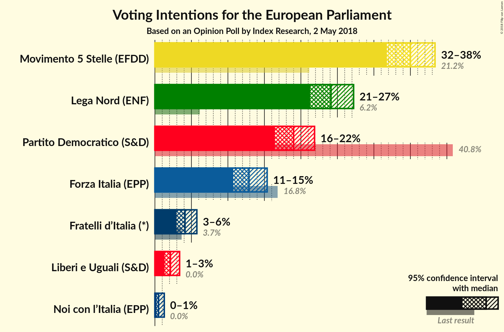
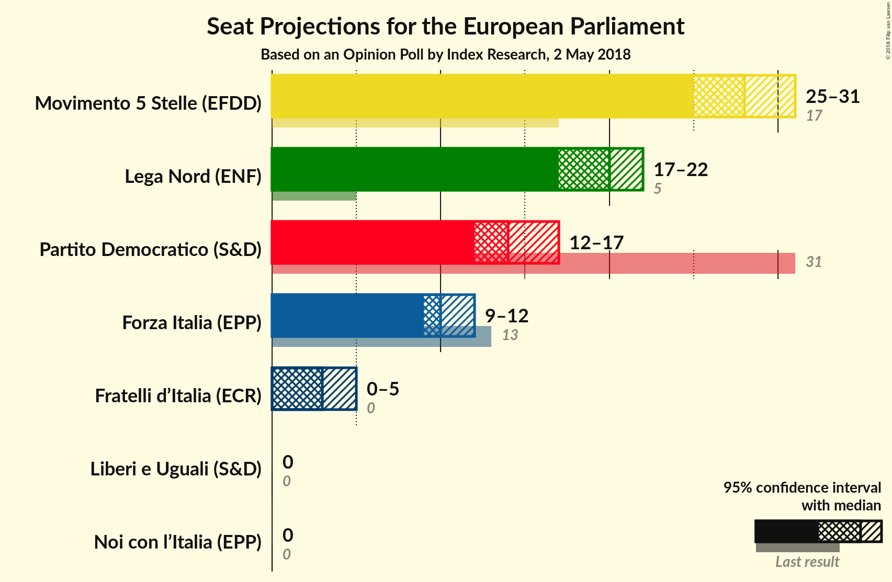
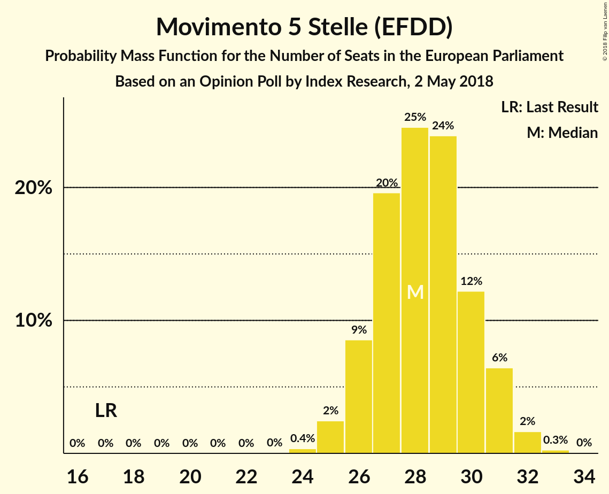
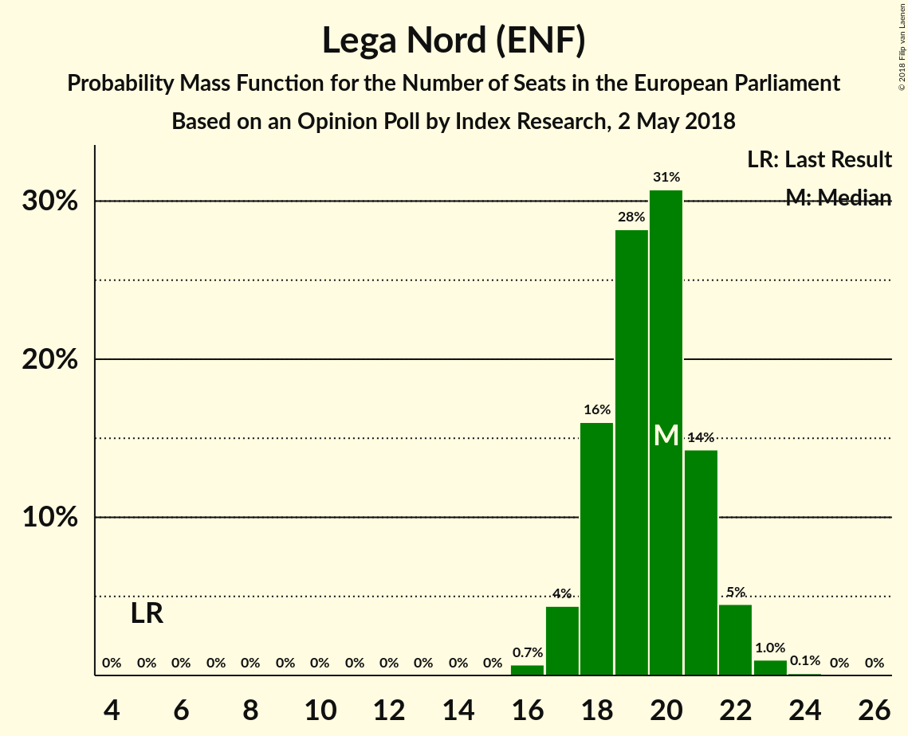
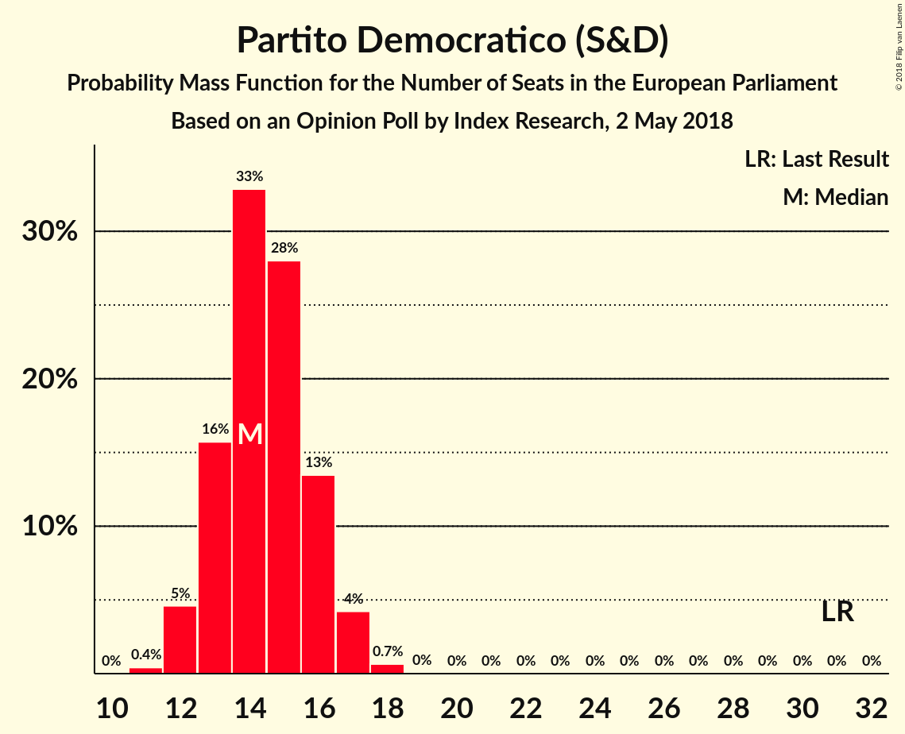
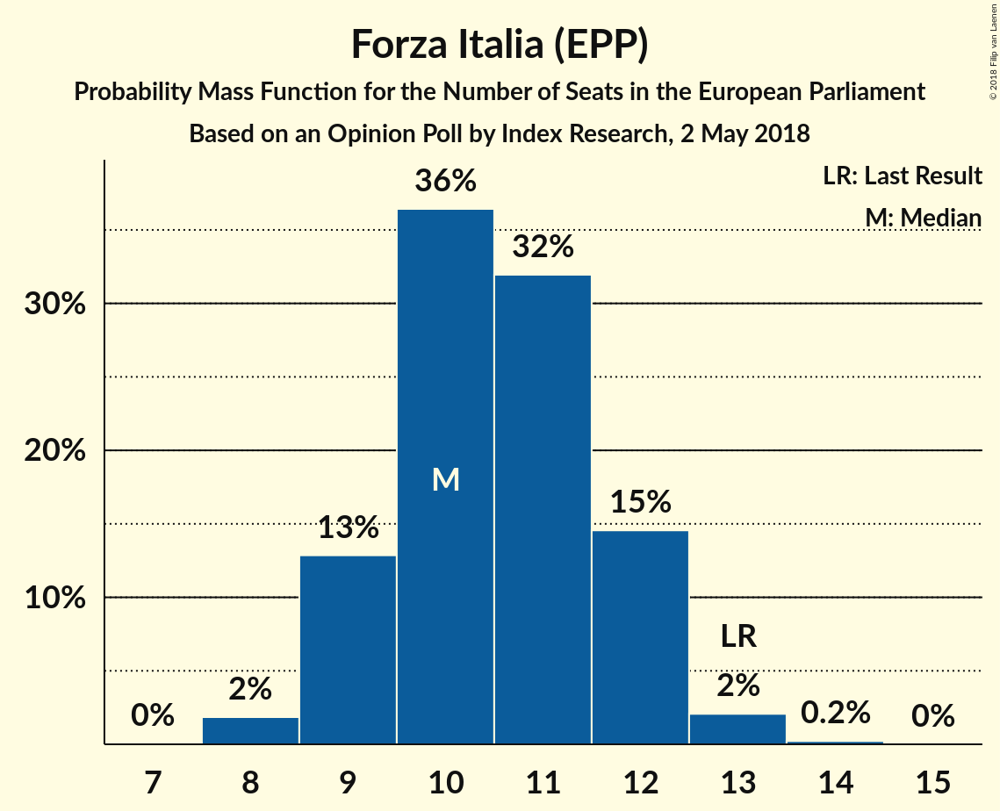
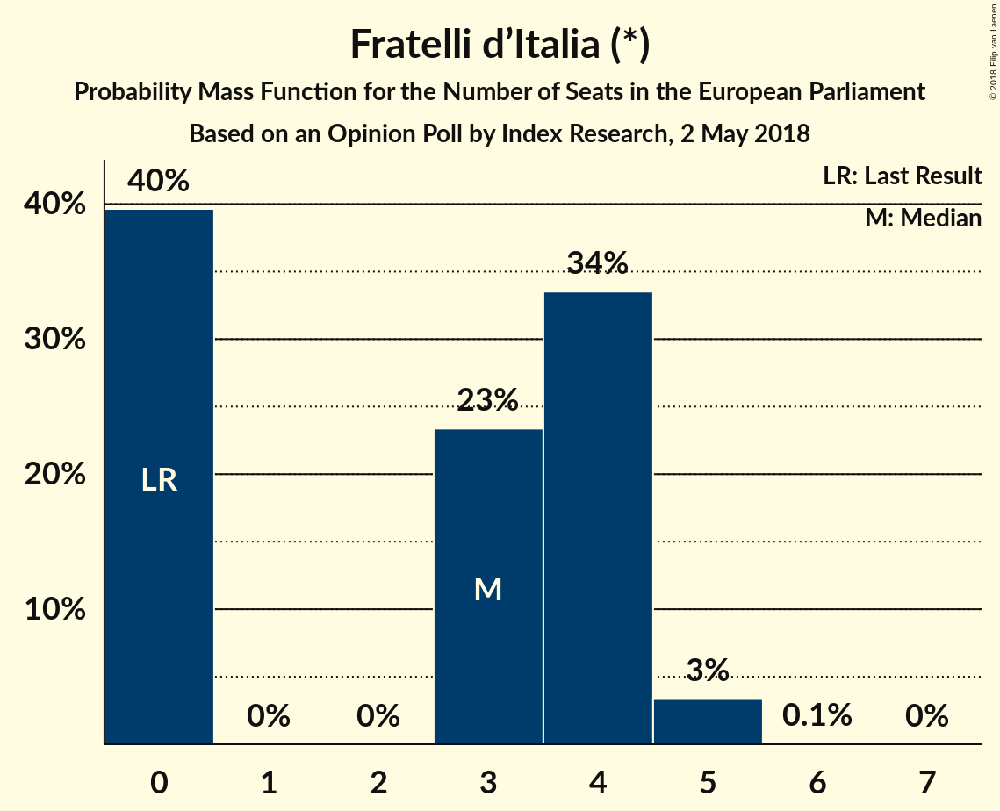
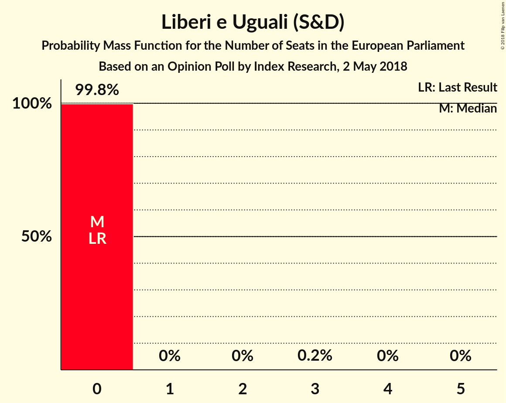
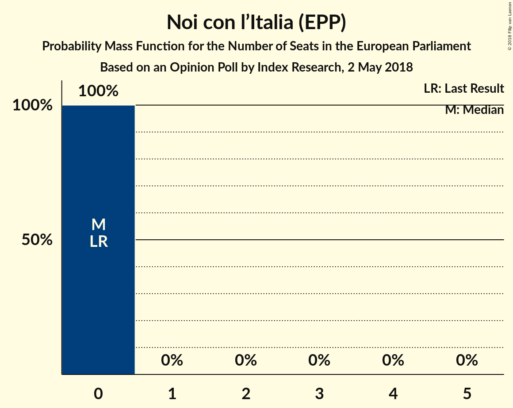
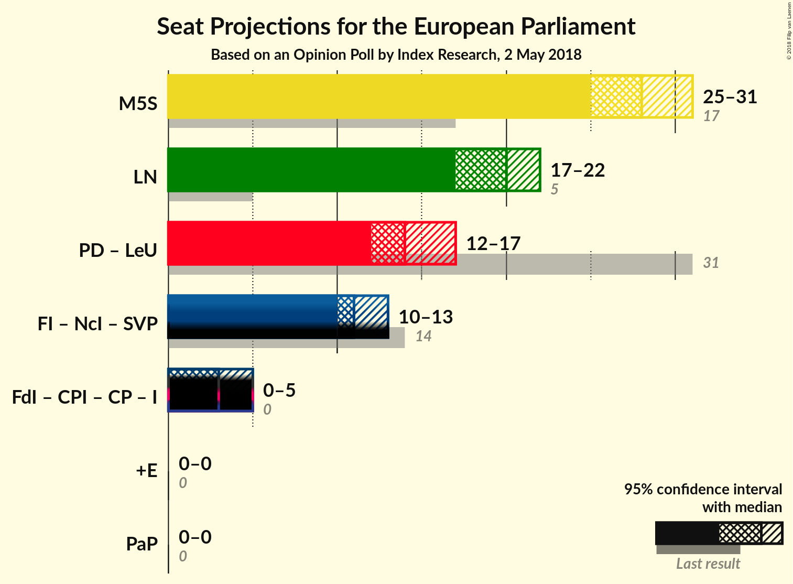

# Opinion Poll by Index Research, 2 May 2018

<a href="#voting-intentions">Voting Intentions</a> | <a href="#seats">Seats</a> | <a href="#coalitions">Coalitions</a> | <a href="#technical-information">Technical Information</a>

## Voting Intentions

### Confidence Intervals

| Party | Last Result | Poll Result | 80% Confidence Interval | 90% Confidence Interval | 95% Confidence Interval | 99% Confidence Interval |
|:-----:|:-----------:|:-----------:|:-----------------------:|:-----------------------:|:-----------------------:|:-----------------------:|
| Movimento 5 Stelle (EFDD) | 21.2% | 35.0% | 32.9–37.2% |32.3–37.8% |31.8–38.4% |30.8–39.4% |
| Lega Nord (ENF) | 6.2% | 24.1% | 22.3–26.2% |21.7–26.7% |21.3–27.2% |20.4–28.2% |
| Partito Democratico (S&D) | 40.8% | 19.0% | 17.3–20.9% |16.8–21.4% |16.4–21.9% |15.7–22.8% |
| Forza Italia (EPP) | 16.8% | 12.9% | 11.5–14.5% |11.1–15.0% |10.7–15.4% |10.1–16.2% |
| Fratelli d’Italia (*) | 3.7% | 4.1% | 3.4–5.2% |3.1–5.5% |3.0–5.7% |2.6–6.3% |
| Liberi e Uguali (S&D) | 0.0% | 2.1% | 1.6–2.9% |1.4–3.2% |1.3–3.4% |1.1–3.8% |
| Noi con l’Italia (EPP) | 0.0% | 0.5% | 0.3–1.0% |0.2–1.1% |0.2–1.3% |0.1–1.6% |

*Note:* The poll result column reflects the actual value used in the calculations. Published results may vary slightly, and in addition be rounded to fewer digits.

## Seats

### Confidence Intervals

| Party | Last Result | Median | 80% Confidence Interval | 90% Confidence Interval | 95% Confidence Interval | 99% Confidence Interval |
|:-----:|:-----------:|:------:|:-----------------------:|:-----------------------:|:-----------------------:|:-----------------------:|
| <a href="#movimento-5-stelle-(efdd)">Movimento 5 Stelle (EFDD)</a> | 17 | 28 | 26–30 |26–31 |25–31 |25–32 |
| <a href="#lega-nord-(enf)">Lega Nord (ENF)</a> | 5 | 20 | 18–21 |17–22 |17–22 |16–23 |
| <a href="#partito-democratico-(s&d)">Partito Democratico (S&D)</a> | 31 | 14 | 13–16 |12–16 |12–17 |12–18 |
| <a href="#forza-italia-(epp)">Forza Italia (EPP)</a> | 13 | 10 | 9–12 |9–12 |9–12 |8–13 |
| <a href="#fratelli-d’italia-(*)">Fratelli d’Italia (*)</a> | 0 | 3 | 0–4 |0–4 |0–5 |0–5 |
| <a href="#liberi-e-uguali-(s&d)">Liberi e Uguali (S&D)</a> | 0 | 0 | 0 |0 |0 |0 |
| <a href="#noi-con-l’italia-(epp)">Noi con l’Italia (EPP)</a> | 0 | 0 | 0 |0 |0 |0 |

### Movimento 5 Stelle (EFDD)

*For a full overview of the results for this party, see the [Movimento 5 Stelle (EFDD)](party-movimento5stelleefdd.html) page.*

| Number of Seats | Probability | Accumulated | Special Marks |
|:---------------:|:-----------:|:-----------:|:-------------:|
| 17 | 0% | 100% | Last Result |
| 18 | 0% | 100% |  |
| 19 | 0% | 100% |  |
| 20 | 0% | 100% |  |
| 21 | 0% | 100% |  |
| 22 | 0% | 100% |  |
| 23 | 0% | 100% |  |
| 24 | 0.4% | 100% |  |
| 25 | 2% | 99.6% |  |
| 26 | 9% | 97% |  |
| 27 | 20% | 89% |  |
| 28 | 25% | 69% | Median |
| 29 | 24% | 44% |  |
| 30 | 12% | 21% |  |
| 31 | 6% | 8% |  |
| 32 | 2% | 2% |  |
| 33 | 0.3% | 0.3% |  |
| 34 | 0% | 0% |  |

### Lega Nord (ENF)

*For a full overview of the results for this party, see the [Lega Nord (ENF)](party-leganordenf.html) page.*

| Number of Seats | Probability | Accumulated | Special Marks |
|:---------------:|:-----------:|:-----------:|:-------------:|
| 5 | 0% | 100% | Last Result |
| 6 | 0% | 100% |  |
| 7 | 0% | 100% |  |
| 8 | 0% | 100% |  |
| 9 | 0% | 100% |  |
| 10 | 0% | 100% |  |
| 11 | 0% | 100% |  |
| 12 | 0% | 100% |  |
| 13 | 0% | 100% |  |
| 14 | 0% | 100% |  |
| 15 | 0% | 100% |  |
| 16 | 0.7% | 100% |  |
| 17 | 4% | 99.3% |  |
| 18 | 16% | 95% |  |
| 19 | 28% | 79% |  |
| 20 | 31% | 51% | Median |
| 21 | 14% | 20% |  |
| 22 | 5% | 6% |  |
| 23 | 1.0% | 1.1% |  |
| 24 | 0.1% | 0.2% |  |
| 25 | 0% | 0% |  |

### Partito Democratico (S&D)

*For a full overview of the results for this party, see the [Partito Democratico (S&D)](party-partitodemocraticosd.html) page.*

| Number of Seats | Probability | Accumulated | Special Marks |
|:---------------:|:-----------:|:-----------:|:-------------:|
| 11 | 0.4% | 100% |  |
| 12 | 5% | 99.6% |  |
| 13 | 16% | 95% |  |
| 14 | 33% | 79% | Median |
| 15 | 28% | 46% |  |
| 16 | 13% | 18% |  |
| 17 | 4% | 5% |  |
| 18 | 0.7% | 0.7% |  |
| 19 | 0% | 0% |  |
| 20 | 0% | 0% |  |
| 21 | 0% | 0% |  |
| 22 | 0% | 0% |  |
| 23 | 0% | 0% |  |
| 24 | 0% | 0% |  |
| 25 | 0% | 0% |  |
| 26 | 0% | 0% |  |
| 27 | 0% | 0% |  |
| 28 | 0% | 0% |  |
| 29 | 0% | 0% |  |
| 30 | 0% | 0% |  |
| 31 | 0% | 0% | Last Result |

### Forza Italia (EPP)

*For a full overview of the results for this party, see the [Forza Italia (EPP)](party-forzaitaliaepp.html) page.*

| Number of Seats | Probability | Accumulated | Special Marks |
|:---------------:|:-----------:|:-----------:|:-------------:|
| 8 | 2% | 100% |  |
| 9 | 13% | 98% |  |
| 10 | 36% | 85% | Median |
| 11 | 32% | 49% |  |
| 12 | 15% | 17% |  |
| 13 | 2% | 2% | Last Result |
| 14 | 0.2% | 0.2% |  |
| 15 | 0% | 0% |  |

### Fratelli d’Italia (*)

*For a full overview of the results for this party, see the [Fratelli d’Italia (*)](party-fratellid’italia.html) page.*

| Number of Seats | Probability | Accumulated | Special Marks |
|:---------------:|:-----------:|:-----------:|:-------------:|
| 0 | 40% | 100% | Last Result |
| 1 | 0% | 60% |  |
| 2 | 0% | 60% |  |
| 3 | 23% | 60% | Median |
| 4 | 34% | 37% |  |
| 5 | 3% | 3% |  |
| 6 | 0.1% | 0.1% |  |
| 7 | 0% | 0% |  |

### Liberi e Uguali (S&D)

*For a full overview of the results for this party, see the [Liberi e Uguali (S&D)](party-liberieugualisd.html) page.*

| Number of Seats | Probability | Accumulated | Special Marks |
|:---------------:|:-----------:|:-----------:|:-------------:|
| 0 | 99.8% | 100% | Last Result, Median |
| 1 | 0% | 0.2% |  |
| 2 | 0% | 0.2% |  |
| 3 | 0.2% | 0.2% |  |
| 4 | 0% | 0% |  |

### Noi con l’Italia (EPP)

*For a full overview of the results for this party, see the [Noi con l’Italia (EPP)](party-noiconl’italiaepp.html) page.*

| Number of Seats | Probability | Accumulated | Special Marks |
|:---------------:|:-----------:|:-----------:|:-------------:|
| 0 | 100% | 100% | Last Result, Median |

## Coalitions

### Confidence Intervals

| Coalition | Last Result | Median | Majority? | 80% Confidence Interval | 90% Confidence Interval | 95% Confidence Interval | 99% Confidence Interval |
|:---------:|:-----------:|:------:|:---------:|:-----------------------:|:-----------------------:|:-----------------------:|:-----------------------:|
| Movimento 5 Stelle (EFDD) | 17 | 28 | 0% | 26–30 | 26–31 | 25–31 | 25–32 |
| Lega Nord (ENF) | 5 | 20 | 0% | 18–21 | 17–22 | 17–22 | 16–23 |
| Partito Democratico (S&D) – Liberi e Uguali (S&D) | 31 | 14 | 0% | 13–16 | 12–17 | 12–17 | 12–18 |

### Movimento 5 Stelle (EFDD)

| Number of Seats | Probability | Accumulated | Special Marks |
|:---------------:|:-----------:|:-----------:|:-------------:|
| 17 | 0% | 100% | Last Result |
| 18 | 0% | 100% |  |
| 19 | 0% | 100% |  |
| 20 | 0% | 100% |  |
| 21 | 0% | 100% |  |
| 22 | 0% | 100% |  |
| 23 | 0% | 100% |  |
| 24 | 0.4% | 100% |  |
| 25 | 2% | 99.6% |  |
| 26 | 9% | 97% |  |
| 27 | 20% | 89% |  |
| 28 | 25% | 69% | Median |
| 29 | 24% | 44% |  |
| 30 | 12% | 21% |  |
| 31 | 6% | 8% |  |
| 32 | 2% | 2% |  |
| 33 | 0.3% | 0.3% |  |
| 34 | 0% | 0% |  |

### Lega Nord (ENF)

| Number of Seats | Probability | Accumulated | Special Marks |
|:---------------:|:-----------:|:-----------:|:-------------:|
| 5 | 0% | 100% | Last Result |
| 6 | 0% | 100% |  |
| 7 | 0% | 100% |  |
| 8 | 0% | 100% |  |
| 9 | 0% | 100% |  |
| 10 | 0% | 100% |  |
| 11 | 0% | 100% |  |
| 12 | 0% | 100% |  |
| 13 | 0% | 100% |  |
| 14 | 0% | 100% |  |
| 15 | 0% | 100% |  |
| 16 | 0.7% | 100% |  |
| 17 | 4% | 99.3% |  |
| 18 | 16% | 95% |  |
| 19 | 28% | 79% |  |
| 20 | 31% | 51% | Median |
| 21 | 14% | 20% |  |
| 22 | 5% | 6% |  |
| 23 | 1.0% | 1.1% |  |
| 24 | 0.1% | 0.2% |  |
| 25 | 0% | 0% |  |

### Partito Democratico (S&D) – Liberi e Uguali (S&D)

| Number of Seats | Probability | Accumulated | Special Marks |
|:---------------:|:-----------:|:-----------:|:-------------:|
| 11 | 0.4% | 100% |  |
| 12 | 5% | 99.6% |  |
| 13 | 16% | 95% |  |
| 14 | 33% | 79% | Median |
| 15 | 28% | 47% |  |
| 16 | 13% | 19% |  |
| 17 | 4% | 5% |  |
| 18 | 0.7% | 0.8% |  |
| 19 | 0.1% | 0.1% |  |
| 20 | 0% | 0% |  |
| 21 | 0% | 0% |  |
| 22 | 0% | 0% |  |
| 23 | 0% | 0% |  |
| 24 | 0% | 0% |  |
| 25 | 0% | 0% |  |
| 26 | 0% | 0% |  |
| 27 | 0% | 0% |  |
| 28 | 0% | 0% |  |
| 29 | 0% | 0% |  |
| 30 | 0% | 0% |  |
| 31 | 0% | 0% | Last Result |

## Technical Information

### Opinion Poll

+ **Polling firm:** Index Research
+ **Commissioner(s):** —
+ **Fieldwork period:** 2 May 2018

### Calculations

+ **Sample size:** 800
+ **Simulations done:** 1,048,576
+ **Error estimate:** 0.94%

