# Opinion Poll by Piepoli, 2 May 2018

<a href="#voting-intentions">Voting Intentions</a> | <a href="#seats">Seats</a> | <a href="#coalitions">Coalitions</a> | <a href="#technical-information">Technical Information</a>

## Voting Intentions

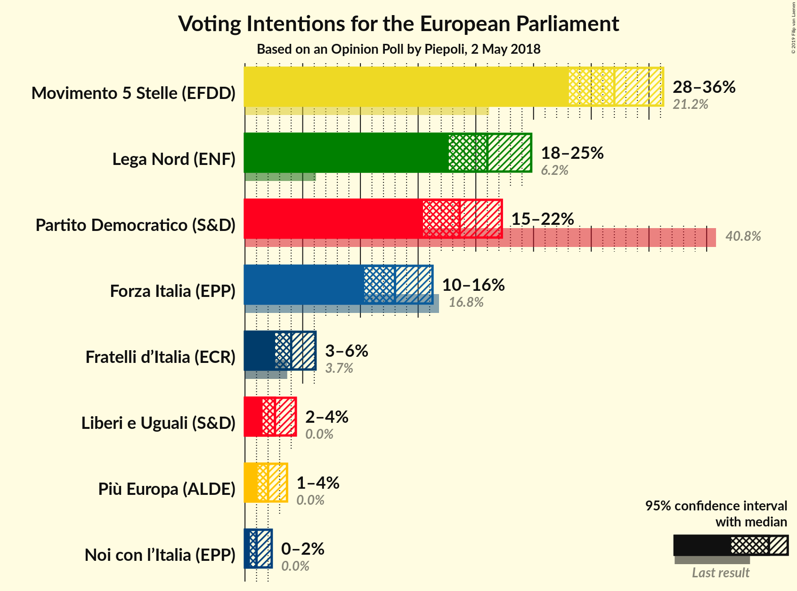

### Confidence Intervals

| Party | Last Result | Poll Result | 80% Confidence Interval | 90% Confidence Interval | 95% Confidence Interval | 99% Confidence Interval |
|:-----:|:-----------:|:-----------:|:-----------------------:|:-----------------------:|:-----------------------:|:-----------------------:|
| Movimento 5 Stelle (EFDD) | 21.2% | 32.0% | 29.4–34.8% |28.7–35.5% |28.1–36.2% |26.8–37.6% |
| Lega Nord (ENF) | 6.2% | 21.0% | 18.8–23.5% |18.2–24.2% |17.6–24.8% |16.6–26.0% |
| Partito Democratico (S&D) | 40.8% | 18.6% | 16.5–21.0% |15.9–21.7% |15.4–22.3% |14.5–23.4% |
| Forza Italia (EPP) | 16.8% | 13.0% | 11.2–15.1% |10.7–15.7% |10.3–16.2% |9.5–17.3% |
| Fratelli d’Italia (ECR) | 3.7% | 4.0% | 3.1–5.4% |2.8–5.8% |2.6–6.1% |2.2–6.8% |
| Liberi e Uguali (S&D) | 0.0% | 2.6% | 1.9–3.8% |1.7–4.1% |1.5–4.4% |1.2–5.0% |
| Più Europa (ALDE) | 0.0% | 2.0% | 1.4–3.1% |1.2–3.4% |1.1–3.6% |0.9–4.2% |
| Noi con l’Italia (EPP) | 0.0% | 1.0% | 0.6–1.8% |0.5–2.1% |0.4–2.3% |0.3–2.8% |

*Note:* The poll result column reflects the actual value used in the calculations. Published results may vary slightly, and in addition be rounded to fewer digits.

## Seats

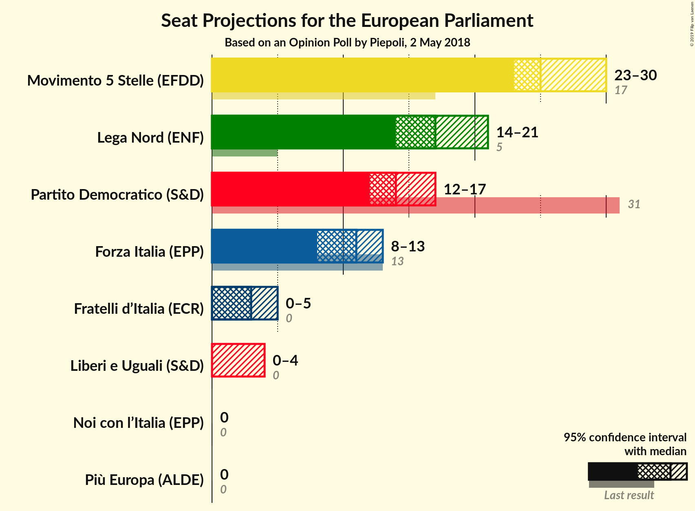

### Confidence Intervals

| Party | Last Result | Median | 80% Confidence Interval | 90% Confidence Interval | 95% Confidence Interval | 99% Confidence Interval |
|:-----:|:-----------:|:------:|:-----------------------:|:-----------------------:|:-----------------------:|:-----------------------:|
| <a href="#movimento-5-stelle-(efdd)">Movimento 5 Stelle (EFDD)</a> | 17 | 24 | 23–28 |22–28 |22–28 |22–30 |
| <a href="#lega-nord-(enf)">Lega Nord (ENF)</a> | 5 | 16 | 16–19 |16–20 |14–20 |14–21 |
| <a href="#partito-democratico-(s&d)">Partito Democratico (S&D)</a> | 31 | 13 | 11–14 |11–17 |11–17 |11–18 |
| <a href="#forza-italia-(epp)">Forza Italia (EPP)</a> | 13 | 11 | 11–14 |9–14 |9–14 |8–15 |
| <a href="#fratelli-d’italia-(ecr)">Fratelli d’Italia (ECR)</a> | 0 | 5 | 0–5 |0–5 |0–5 |0–6 |
| <a href="#liberi-e-uguali-(s&d)">Liberi e Uguali (S&D)</a> | 0 | 0 | 0 |0 |0–4 |0–5 |
| <a href="#più-europa-(alde)">Più Europa (ALDE)</a> | 0 | 0 | 0 |0 |0 |0–4 |
| <a href="#noi-con-l’italia-(epp)">Noi con l’Italia (EPP)</a> | 0 | 0 | 0 |0 |0 |0 |

### Movimento 5 Stelle (EFDD)

*For a full overview of the results for this party, see the [Movimento 5 Stelle (EFDD)](party-movimento5stelleefdd.html) page.*

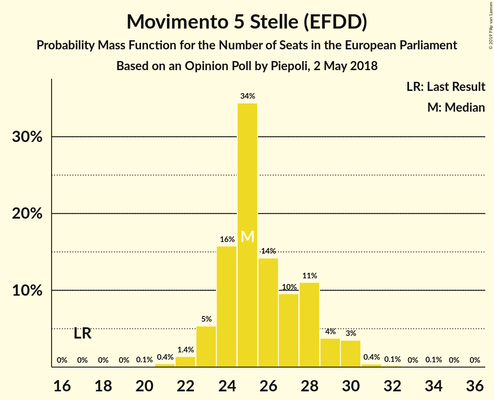

| Number of Seats | Probability | Accumulated | Special Marks |
|:---------------:|:-----------:|:-----------:|:-------------:|
| 17 | 0% | 100% | Last Result |
| 18 | 0% | 100% |  |
| 19 | 0% | 100% |  |
| 20 | 0% | 100% |  |
| 21 | 0.1% | 100% |  |
| 22 | 9% | 99.9% |  |
| 23 | 2% | 91% |  |
| 24 | 51% | 88% | Median |
| 25 | 9% | 38% |  |
| 26 | 12% | 29% |  |
| 27 | 0.3% | 17% |  |
| 28 | 15% | 17% |  |
| 29 | 1.0% | 2% |  |
| 30 | 0.8% | 0.8% |  |
| 31 | 0% | 0% |  |

### Lega Nord (ENF)

*For a full overview of the results for this party, see the [Lega Nord (ENF)](party-leganordenf.html) page.*

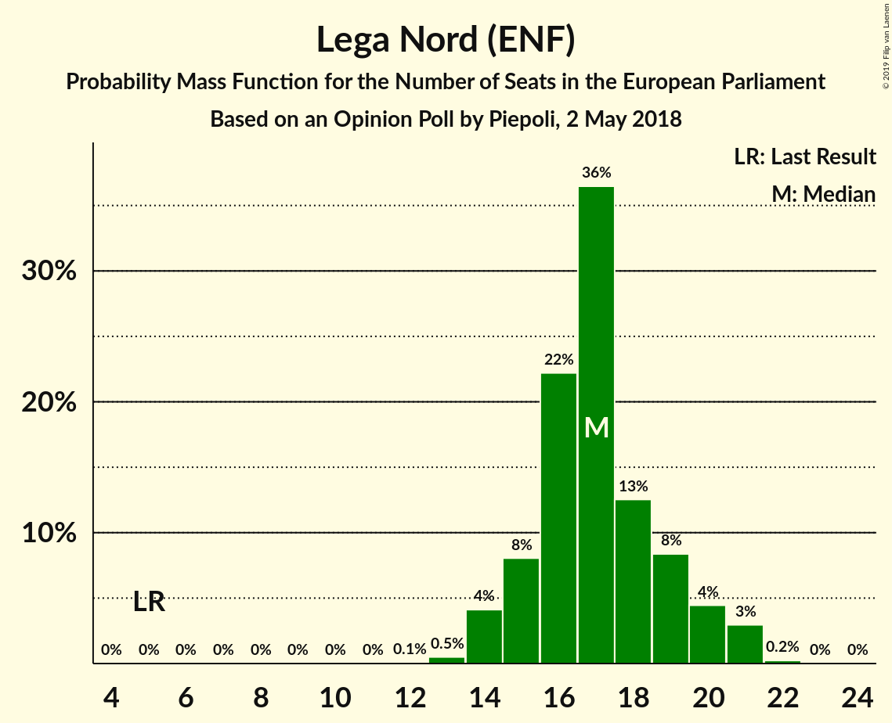

| Number of Seats | Probability | Accumulated | Special Marks |
|:---------------:|:-----------:|:-----------:|:-------------:|
| 5 | 0% | 100% | Last Result |
| 6 | 0% | 100% |  |
| 7 | 0% | 100% |  |
| 8 | 0% | 100% |  |
| 9 | 0% | 100% |  |
| 10 | 0% | 100% |  |
| 11 | 0% | 100% |  |
| 12 | 0% | 100% |  |
| 13 | 0.4% | 100% |  |
| 14 | 3% | 99.6% |  |
| 15 | 2% | 97% |  |
| 16 | 50% | 95% | Median |
| 17 | 15% | 45% |  |
| 18 | 1.4% | 31% |  |
| 19 | 19% | 29% |  |
| 20 | 9% | 10% |  |
| 21 | 0.7% | 1.0% |  |
| 22 | 0.3% | 0.3% |  |
| 23 | 0% | 0% |  |

### Partito Democratico (S&D)

*For a full overview of the results for this party, see the [Partito Democratico (S&D)](party-partitodemocraticosd.html) page.*

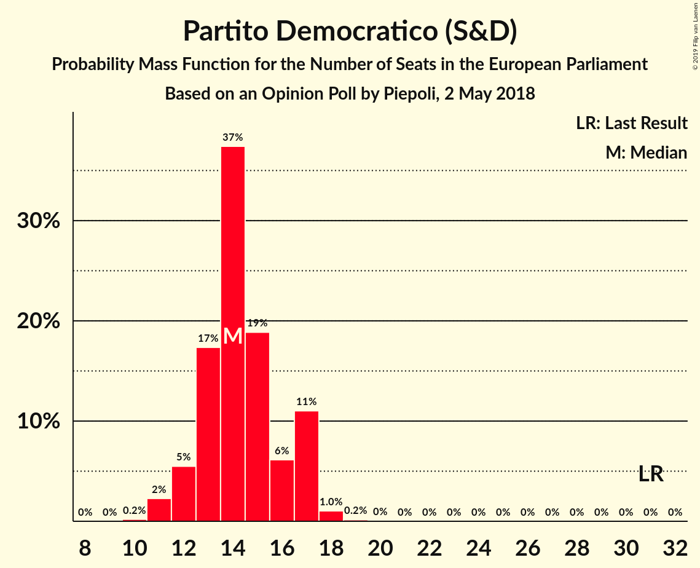

| Number of Seats | Probability | Accumulated | Special Marks |
|:---------------:|:-----------:|:-----------:|:-------------:|
| 10 | 0.4% | 100% |  |
| 11 | 11% | 99.6% |  |
| 12 | 3% | 89% |  |
| 13 | 60% | 85% | Median |
| 14 | 15% | 25% |  |
| 15 | 3% | 10% |  |
| 16 | 1.1% | 7% |  |
| 17 | 5% | 6% |  |
| 18 | 0.6% | 1.0% |  |
| 19 | 0.4% | 0.4% |  |
| 20 | 0% | 0% |  |
| 21 | 0% | 0% |  |
| 22 | 0% | 0% |  |
| 23 | 0% | 0% |  |
| 24 | 0% | 0% |  |
| 25 | 0% | 0% |  |
| 26 | 0% | 0% |  |
| 27 | 0% | 0% |  |
| 28 | 0% | 0% |  |
| 29 | 0% | 0% |  |
| 30 | 0% | 0% |  |
| 31 | 0% | 0% | Last Result |

### Forza Italia (EPP)

*For a full overview of the results for this party, see the [Forza Italia (EPP)](party-forzaitaliaepp.html) page.*

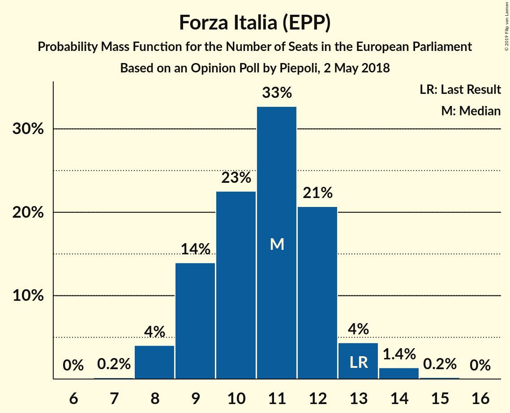

| Number of Seats | Probability | Accumulated | Special Marks |
|:---------------:|:-----------:|:-----------:|:-------------:|
| 8 | 1.3% | 100% |  |
| 9 | 5% | 98.7% |  |
| 10 | 0.9% | 94% |  |
| 11 | 54% | 93% | Median |
| 12 | 5% | 39% |  |
| 13 | 10% | 34% | Last Result |
| 14 | 23% | 24% |  |
| 15 | 1.0% | 1.0% |  |
| 16 | 0% | 0% |  |

### Fratelli d’Italia (ECR)

*For a full overview of the results for this party, see the [Fratelli d’Italia (ECR)](party-fratellid’italiaecr.html) page.*

| Number of Seats | Probability | Accumulated | Special Marks |
|:---------------:|:-----------:|:-----------:|:-------------:|
| 0 | 35% | 100% | Last Result |
| 1 | 0% | 65% |  |
| 2 | 0% | 65% |  |
| 3 | 4% | 65% |  |
| 4 | 4% | 60% |  |
| 5 | 56% | 57% | Median |
| 6 | 0.6% | 0.6% |  |
| 7 | 0% | 0% |  |

### Liberi e Uguali (S&D)

*For a full overview of the results for this party, see the [Liberi e Uguali (S&D)](party-liberieugualisd.html) page.*

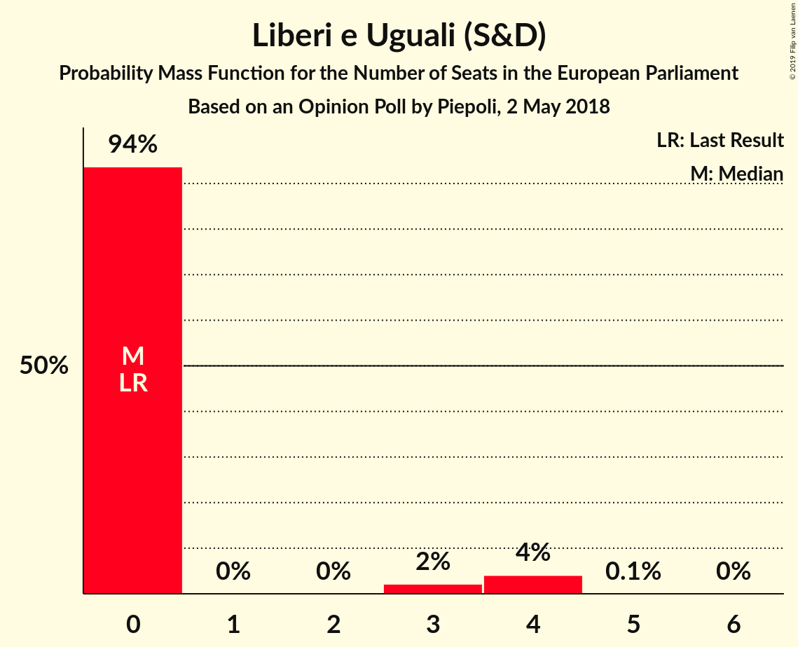

| Number of Seats | Probability | Accumulated | Special Marks |
|:---------------:|:-----------:|:-----------:|:-------------:|
| 0 | 97% | 100% | Last Result, Median |
| 1 | 0% | 3% |  |
| 2 | 0% | 3% |  |
| 3 | 0% | 3% |  |
| 4 | 3% | 3% |  |
| 5 | 0.6% | 0.6% |  |
| 6 | 0% | 0% |  |

### Più Europa (ALDE)

*For a full overview of the results for this party, see the [Più Europa (ALDE)](party-piùeuropaalde.html) page.*

| Number of Seats | Probability | Accumulated | Special Marks |
|:---------------:|:-----------:|:-----------:|:-------------:|
| 0 | 99.4% | 100% | Last Result, Median |
| 1 | 0% | 0.6% |  |
| 2 | 0% | 0.6% |  |
| 3 | 0% | 0.6% |  |
| 4 | 0.6% | 0.6% |  |
| 5 | 0% | 0% |  |

### Noi con l’Italia (EPP)

*For a full overview of the results for this party, see the [Noi con l’Italia (EPP)](party-noiconl’italiaepp.html) page.*

| Number of Seats | Probability | Accumulated | Special Marks |
|:---------------:|:-----------:|:-----------:|:-------------:|
| 0 | 100% | 100% | Last Result, Median |

## Coalitions

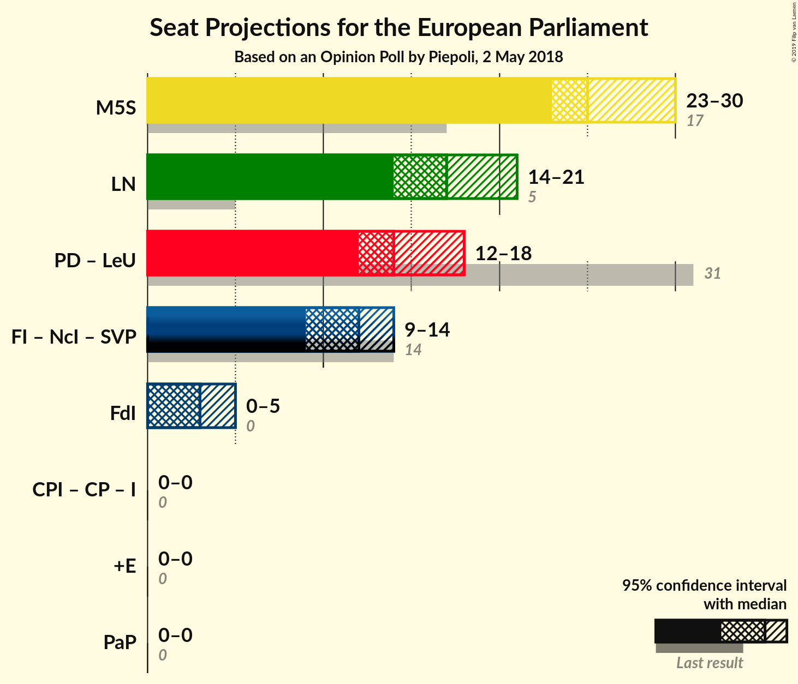

### Confidence Intervals

| Coalition | Last Result | Median | Majority? | 80% Confidence Interval | 90% Confidence Interval | 95% Confidence Interval | 99% Confidence Interval |
|:---------:|:-----------:|:------:|:---------:|:-----------------------:|:-----------------------:|:-----------------------:|:-----------------------:|
| Movimento 5 Stelle (EFDD) | 17 | 24 | 0% | 23–28 | 22–28 | 22–28 | 22–30 |
| Lega Nord (ENF) | 5 | 16 | 0% | 16–19 | 16–20 | 14–20 | 14–21 |
| Partito Democratico (S&D) – Liberi e Uguali (S&D) | 31 | 13 | 0% | 11–15 | 11–17 | 11–17 | 11–19 |
| Fratelli d’Italia (ECR) | 0 | 5 | 0% | 0–5 | 0–5 | 0–5 | 0–6 |
| Più Europa (ALDE) | 0 | 0 | 0% | 0 | 0 | 0 | 0–4 |

### Movimento 5 Stelle (EFDD)

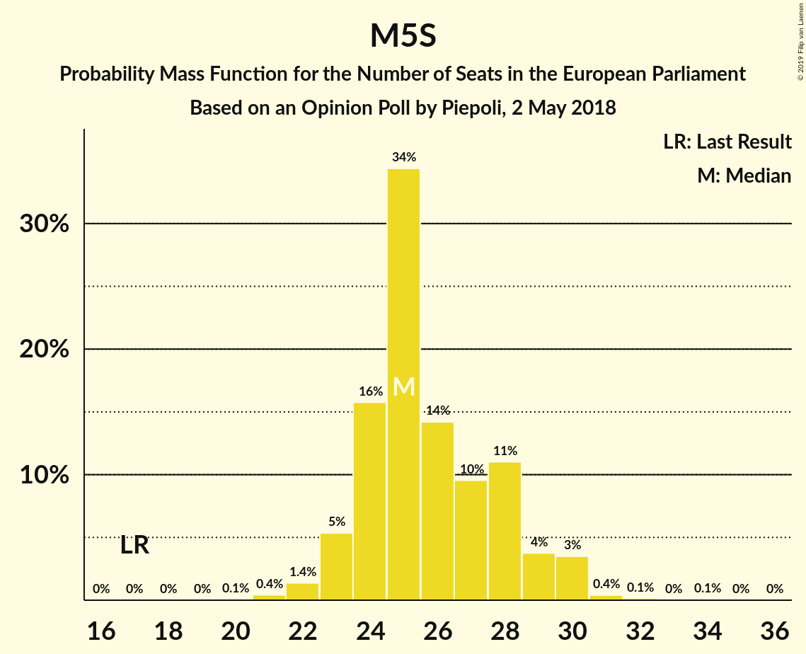

| Number of Seats | Probability | Accumulated | Special Marks |
|:---------------:|:-----------:|:-----------:|:-------------:|
| 17 | 0% | 100% | Last Result |
| 18 | 0% | 100% |  |
| 19 | 0% | 100% |  |
| 20 | 0% | 100% |  |
| 21 | 0.1% | 100% |  |
| 22 | 9% | 99.9% |  |
| 23 | 2% | 91% |  |
| 24 | 51% | 88% | Median |
| 25 | 9% | 38% |  |
| 26 | 12% | 29% |  |
| 27 | 0.3% | 17% |  |
| 28 | 15% | 17% |  |
| 29 | 1.0% | 2% |  |
| 30 | 0.8% | 0.8% |  |
| 31 | 0% | 0% |  |

### Lega Nord (ENF)

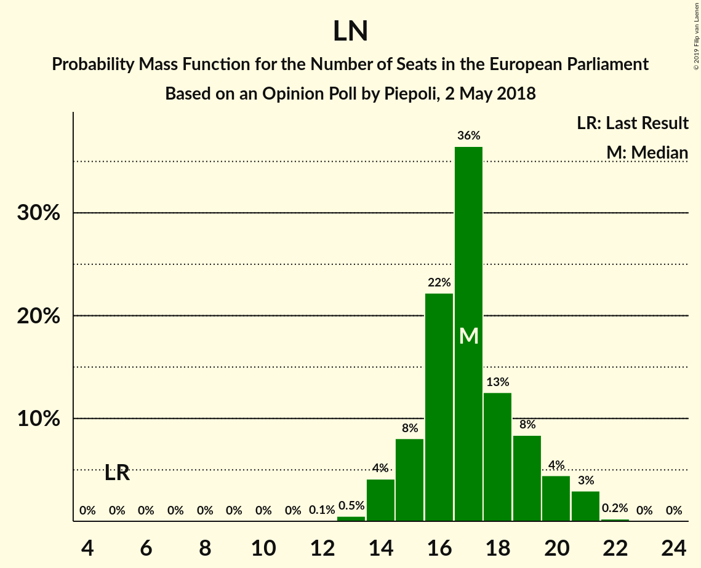

| Number of Seats | Probability | Accumulated | Special Marks |
|:---------------:|:-----------:|:-----------:|:-------------:|
| 5 | 0% | 100% | Last Result |
| 6 | 0% | 100% |  |
| 7 | 0% | 100% |  |
| 8 | 0% | 100% |  |
| 9 | 0% | 100% |  |
| 10 | 0% | 100% |  |
| 11 | 0% | 100% |  |
| 12 | 0% | 100% |  |
| 13 | 0.4% | 100% |  |
| 14 | 3% | 99.6% |  |
| 15 | 2% | 97% |  |
| 16 | 50% | 95% | Median |
| 17 | 15% | 45% |  |
| 18 | 1.4% | 31% |  |
| 19 | 19% | 29% |  |
| 20 | 9% | 10% |  |
| 21 | 0.7% | 1.0% |  |
| 22 | 0.3% | 0.3% |  |
| 23 | 0% | 0% |  |

### Partito Democratico (S&D) – Liberi e Uguali (S&D)

| Number of Seats | Probability | Accumulated | Special Marks |
|:---------------:|:-----------:|:-----------:|:-------------:|
| 11 | 11% | 100% |  |
| 12 | 2% | 89% |  |
| 13 | 60% | 88% | Median |
| 14 | 16% | 28% |  |
| 15 | 4% | 13% |  |
| 16 | 2% | 9% |  |
| 17 | 5% | 7% |  |
| 18 | 0.6% | 1.1% |  |
| 19 | 0.5% | 0.6% |  |
| 20 | 0% | 0.1% |  |
| 21 | 0.1% | 0.1% |  |
| 22 | 0% | 0% |  |
| 23 | 0% | 0% |  |
| 24 | 0% | 0% |  |
| 25 | 0% | 0% |  |
| 26 | 0% | 0% |  |
| 27 | 0% | 0% |  |
| 28 | 0% | 0% |  |
| 29 | 0% | 0% |  |
| 30 | 0% | 0% |  |
| 31 | 0% | 0% | Last Result |

### Fratelli d’Italia (ECR)

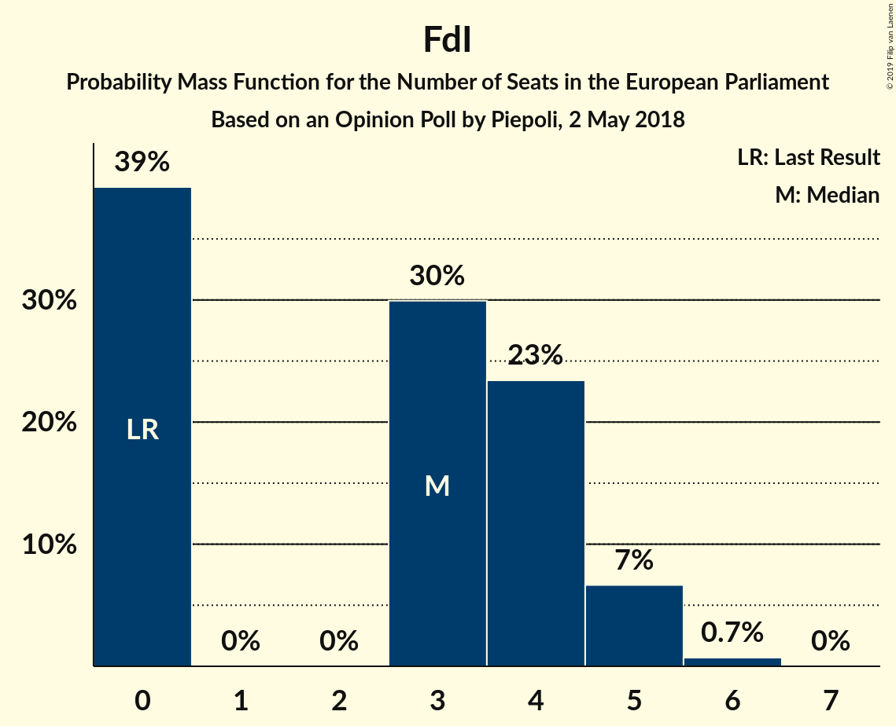

| Number of Seats | Probability | Accumulated | Special Marks |
|:---------------:|:-----------:|:-----------:|:-------------:|
| 0 | 35% | 100% | Last Result |
| 1 | 0% | 65% |  |
| 2 | 0% | 65% |  |
| 3 | 4% | 65% |  |
| 4 | 4% | 60% |  |
| 5 | 56% | 57% | Median |
| 6 | 0.6% | 0.6% |  |
| 7 | 0% | 0% |  |

### Più Europa (ALDE)

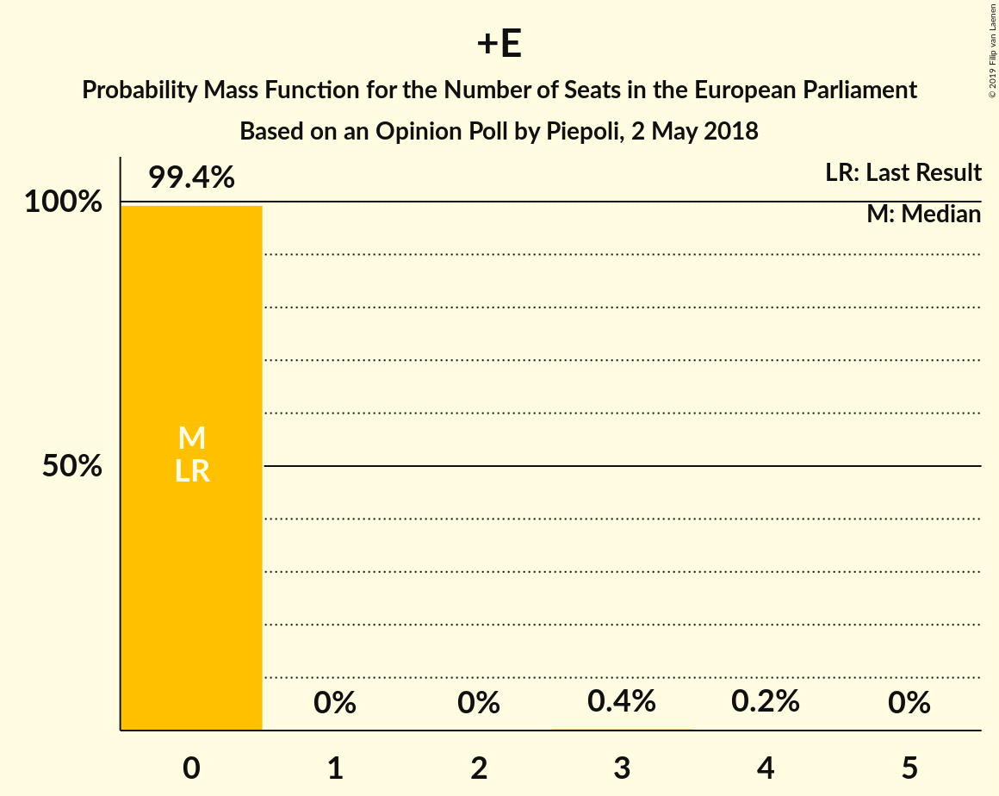

| Number of Seats | Probability | Accumulated | Special Marks |
|:---------------:|:-----------:|:-----------:|:-------------:|
| 0 | 99.4% | 100% | Last Result, Median |
| 1 | 0% | 0.6% |  |
| 2 | 0% | 0.6% |  |
| 3 | 0% | 0.6% |  |
| 4 | 0.6% | 0.6% |  |
| 5 | 0% | 0% |  |

## Technical Information

### Opinion Poll

+ **Polling firm:** Piepoli
+ **Commissioner(s):** —
+ **Fieldwork period:** 2 May 2018

### Calculations

+ **Sample size:** 500
+ **Simulations done:** 1,024
+ **Error estimate:** 3.35%

