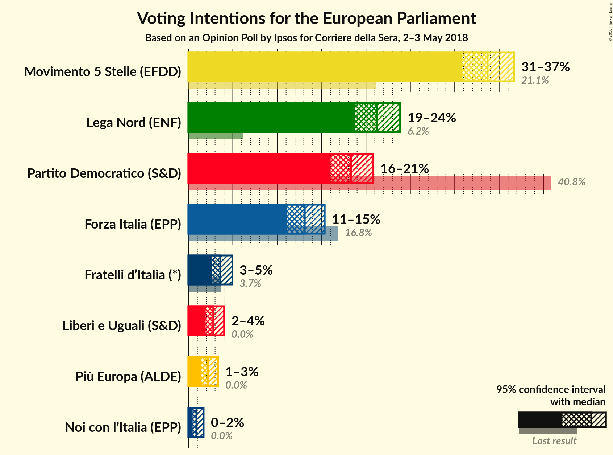
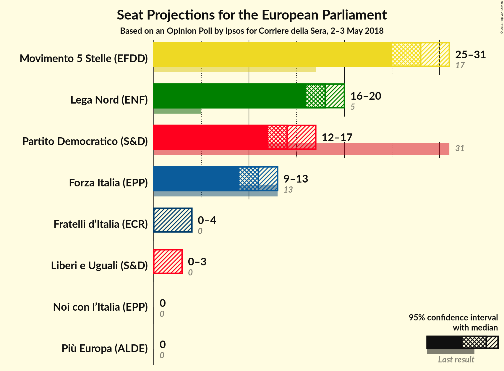
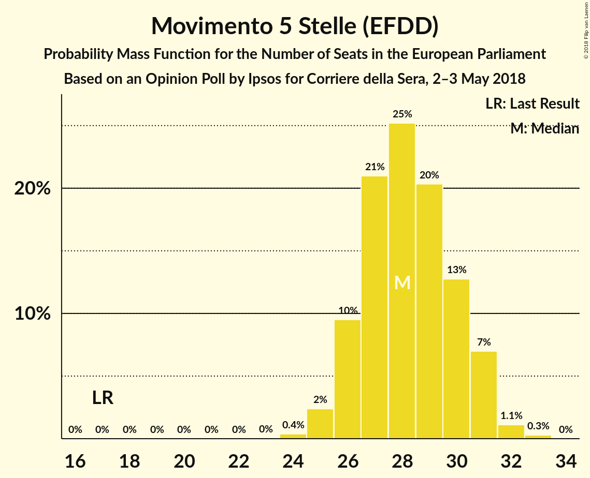
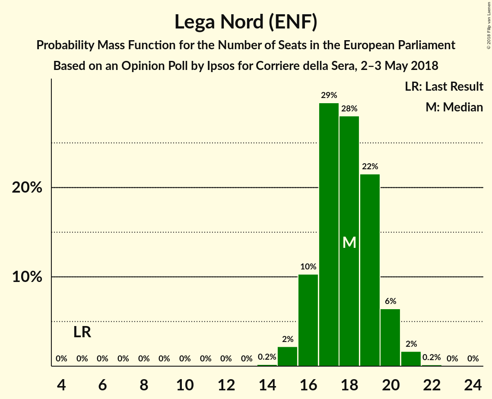
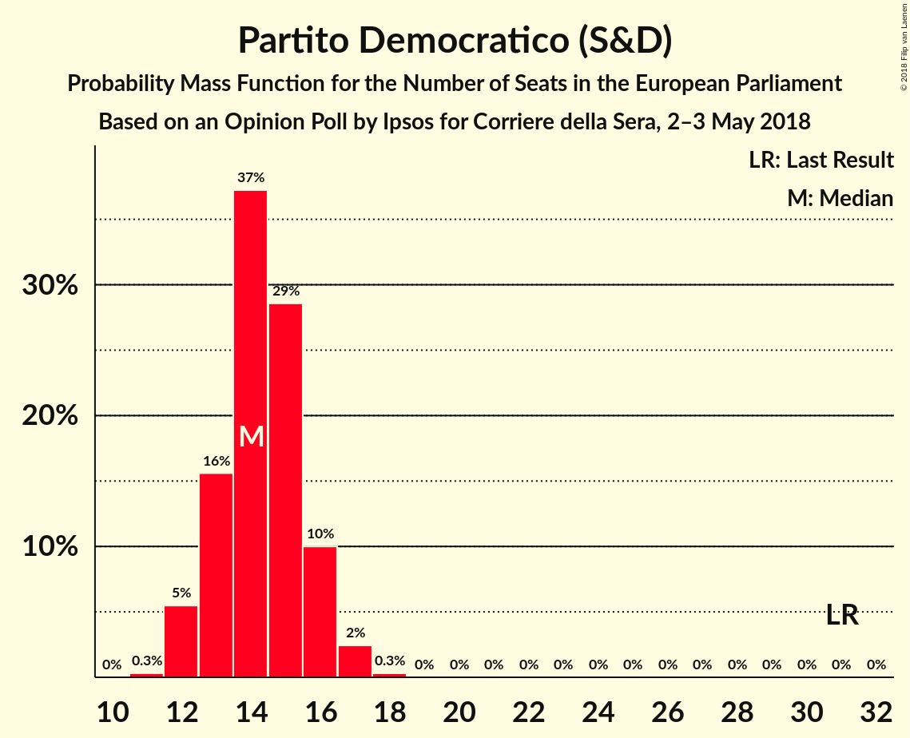
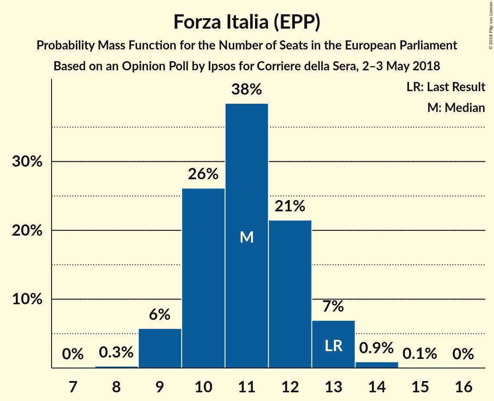
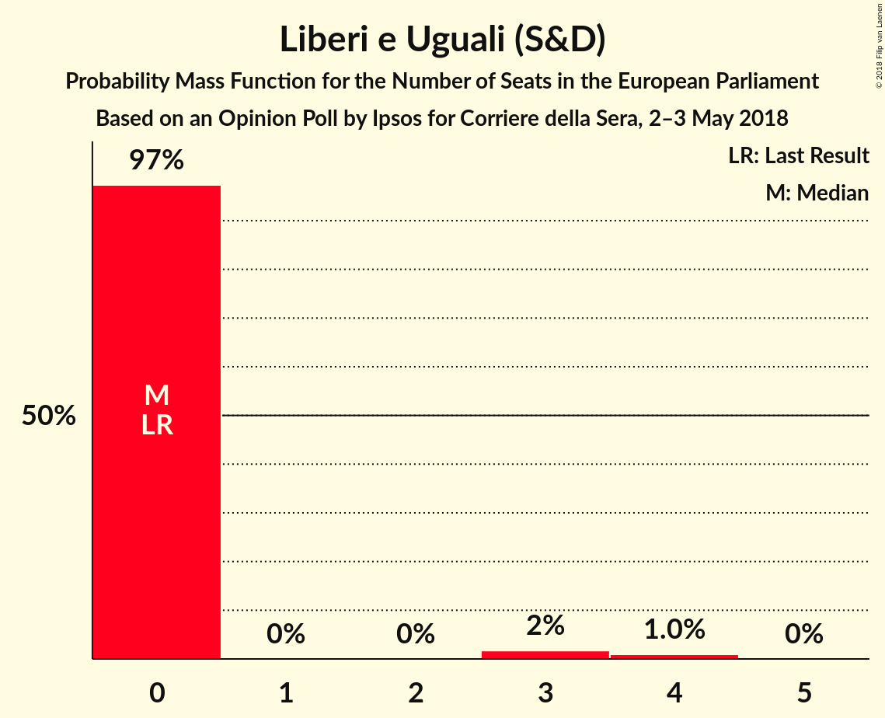
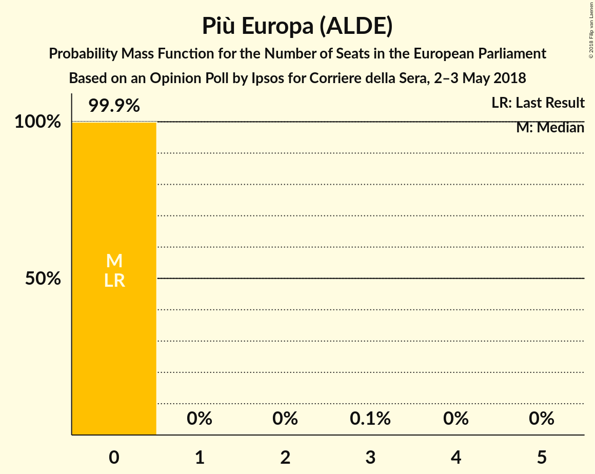
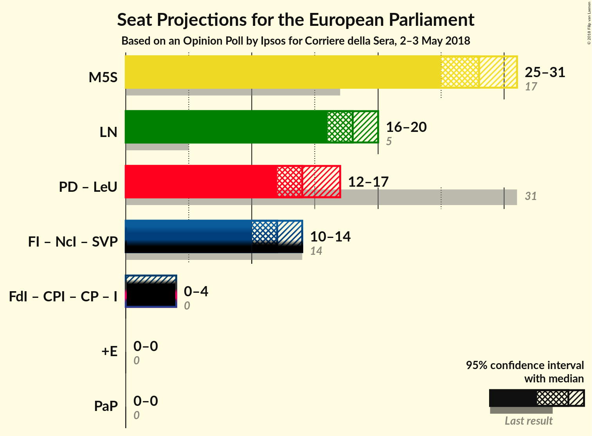

# Opinion Poll by Ipsos for Corriere della Sera, 2–3 May 2018

<a href="#voting-intentions">Voting Intentions</a> | <a href="#seats">Seats</a> | <a href="#coalitions">Coalitions</a> | <a href="#technical-information">Technical Information</a>

## Voting Intentions

### Confidence Intervals

| Party | Last Result | Poll Result | 80% Confidence Interval | 90% Confidence Interval | 95% Confidence Interval | 99% Confidence Interval |
|:-----:|:-----------:|:-----------:|:-----------------------:|:-----------------------:|:-----------------------:|:-----------------------:|
| Movimento 5 Stelle (EFDD) | 21.2% | 33.7% | 31.8–35.7% |31.3–36.2% |30.8–36.7% |29.9–37.6% |
| Lega Nord (ENF) | 6.2% | 21.2% | 19.6–22.9% |19.2–23.4% |18.8–23.9% |18.0–24.7% |
| Partito Democratico (S&D) | 40.8% | 18.3% | 16.8–20.0% |16.4–20.4% |16.0–20.8% |15.3–21.6% |
| Forza Italia (EPP) | 16.8% | 13.1% | 11.8–14.6% |11.4–15.0% |11.1–15.3% |10.6–16.1% |
| Fratelli d’Italia (ECR) | 3.7% | 3.6% | 2.9–4.5% |2.8–4.7% |2.6–5.0% |2.3–5.4% |
| Liberi e Uguali (S&D) | 0.0% | 2.8% | 2.2–3.6% |2.1–3.8% |1.9–4.0% |1.7–4.4% |
| Più Europa (ALDE) | 0.0% | 2.2% | 1.7–2.9% |1.6–3.1% |1.4–3.3% |1.2–3.7% |
| Noi con l’Italia (EPP) | 0.0% | 0.9% | 0.6–1.4% |0.5–1.6% |0.5–1.7% |0.4–2.0% |

*Note:* The poll result column reflects the actual value used in the calculations. Published results may vary slightly, and in addition be rounded to fewer digits.

## Seats

### Confidence Intervals

| Party | Last Result | Median | 80% Confidence Interval | 90% Confidence Interval | 95% Confidence Interval | 99% Confidence Interval |
|:-----:|:-----------:|:------:|:-----------------------:|:-----------------------:|:-----------------------:|:-----------------------:|
| <a href="#movimento-5-stelle-(efdd)">Movimento 5 Stelle (EFDD)</a> | 17 | 28 | 26–30 |26–31 |25–31 |25–32 |
| <a href="#lega-nord-(enf)">Lega Nord (ENF)</a> | 5 | 18 | 16–19 |16–20 |16–20 |15–21 |
| <a href="#partito-democratico-(s&d)">Partito Democratico (S&D)</a> | 31 | 14 | 13–16 |12–16 |12–17 |12–17 |
| <a href="#forza-italia-(epp)">Forza Italia (EPP)</a> | 13 | 11 | 10–12 |9–13 |9–13 |9–14 |
| <a href="#fratelli-d’italia-(ecr)">Fratelli d’Italia (ECR)</a> | 0 | 0 | 0–4 |0–4 |0–4 |0–4 |
| <a href="#liberi-e-uguali-(s&d)">Liberi e Uguali (S&D)</a> | 0 | 0 | 0 |0 |0–3 |0–4 |
| <a href="#più-europa-(alde)">Più Europa (ALDE)</a> | 0 | 0 | 0 |0 |0 |0 |
| <a href="#noi-con-l’italia-(epp)">Noi con l’Italia (EPP)</a> | 0 | 0 | 0 |0 |0 |0 |

### Movimento 5 Stelle (EFDD)

*For a full overview of the results for this party, see the [Movimento 5 Stelle (EFDD)](party-movimento5stelleefdd.html) page.*

| Number of Seats | Probability | Accumulated | Special Marks |
|:---------------:|:-----------:|:-----------:|:-------------:|
| 17 | 0% | 100% | Last Result |
| 18 | 0% | 100% |  |
| 19 | 0% | 100% |  |
| 20 | 0% | 100% |  |
| 21 | 0% | 100% |  |
| 22 | 0% | 100% |  |
| 23 | 0% | 100% |  |
| 24 | 0.4% | 100% |  |
| 25 | 2% | 99.6% |  |
| 26 | 10% | 97% |  |
| 27 | 21% | 88% |  |
| 28 | 25% | 67% | Median |
| 29 | 20% | 42% |  |
| 30 | 13% | 21% |  |
| 31 | 7% | 8% |  |
| 32 | 1.1% | 1.4% |  |
| 33 | 0.3% | 0.3% |  |
| 34 | 0% | 0% |  |

### Lega Nord (ENF)

*For a full overview of the results for this party, see the [Lega Nord (ENF)](party-leganordenf.html) page.*

| Number of Seats | Probability | Accumulated | Special Marks |
|:---------------:|:-----------:|:-----------:|:-------------:|
| 5 | 0% | 100% | Last Result |
| 6 | 0% | 100% |  |
| 7 | 0% | 100% |  |
| 8 | 0% | 100% |  |
| 9 | 0% | 100% |  |
| 10 | 0% | 100% |  |
| 11 | 0% | 100% |  |
| 12 | 0% | 100% |  |
| 13 | 0% | 100% |  |
| 14 | 0.2% | 100% |  |
| 15 | 2% | 99.8% |  |
| 16 | 10% | 98% |  |
| 17 | 29% | 87% |  |
| 18 | 28% | 58% | Median |
| 19 | 22% | 30% |  |
| 20 | 6% | 8% |  |
| 21 | 2% | 2% |  |
| 22 | 0.2% | 0.2% |  |
| 23 | 0% | 0% |  |

### Partito Democratico (S&D)

*For a full overview of the results for this party, see the [Partito Democratico (S&D)](party-partitodemocraticosd.html) page.*

| Number of Seats | Probability | Accumulated | Special Marks |
|:---------------:|:-----------:|:-----------:|:-------------:|
| 11 | 0.3% | 100% |  |
| 12 | 5% | 99.7% |  |
| 13 | 16% | 94% |  |
| 14 | 37% | 79% | Median |
| 15 | 29% | 41% |  |
| 16 | 10% | 13% |  |
| 17 | 2% | 3% |  |
| 18 | 0.3% | 0.3% |  |
| 19 | 0% | 0% |  |
| 20 | 0% | 0% |  |
| 21 | 0% | 0% |  |
| 22 | 0% | 0% |  |
| 23 | 0% | 0% |  |
| 24 | 0% | 0% |  |
| 25 | 0% | 0% |  |
| 26 | 0% | 0% |  |
| 27 | 0% | 0% |  |
| 28 | 0% | 0% |  |
| 29 | 0% | 0% |  |
| 30 | 0% | 0% |  |
| 31 | 0% | 0% | Last Result |

### Forza Italia (EPP)

*For a full overview of the results for this party, see the [Forza Italia (EPP)](party-forzaitaliaepp.html) page.*

| Number of Seats | Probability | Accumulated | Special Marks |
|:---------------:|:-----------:|:-----------:|:-------------:|
| 8 | 0.3% | 100% |  |
| 9 | 6% | 99.7% |  |
| 10 | 26% | 94% |  |
| 11 | 38% | 68% | Median |
| 12 | 21% | 29% |  |
| 13 | 7% | 8% | Last Result |
| 14 | 0.9% | 1.0% |  |
| 15 | 0.1% | 0.1% |  |
| 16 | 0% | 0% |  |

### Fratelli d’Italia (ECR)

*For a full overview of the results for this party, see the [Fratelli d’Italia (ECR)](party-fratellid’italiaecr.html) page.*

| Number of Seats | Probability | Accumulated | Special Marks |
|:---------------:|:-----------:|:-----------:|:-------------:|
| 0 | 72% | 100% | Last Result, Median |
| 1 | 0% | 28% |  |
| 2 | 0% | 28% |  |
| 3 | 8% | 28% |  |
| 4 | 20% | 20% |  |
| 5 | 0.3% | 0.3% |  |
| 6 | 0% | 0% |  |

### Liberi e Uguali (S&D)

*For a full overview of the results for this party, see the [Liberi e Uguali (S&D)](party-liberieugualisd.html) page.*

| Number of Seats | Probability | Accumulated | Special Marks |
|:---------------:|:-----------:|:-----------:|:-------------:|
| 0 | 97% | 100% | Last Result, Median |
| 1 | 0% | 3% |  |
| 2 | 0% | 3% |  |
| 3 | 2% | 3% |  |
| 4 | 1.0% | 1.0% |  |
| 5 | 0% | 0% |  |

### Più Europa (ALDE)

*For a full overview of the results for this party, see the [Più Europa (ALDE)](party-piùeuropaalde.html) page.*

| Number of Seats | Probability | Accumulated | Special Marks |
|:---------------:|:-----------:|:-----------:|:-------------:|
| 0 | 99.9% | 100% | Last Result, Median |
| 1 | 0% | 0.1% |  |
| 2 | 0% | 0.1% |  |
| 3 | 0.1% | 0.1% |  |
| 4 | 0% | 0% |  |

### Noi con l’Italia (EPP)

*For a full overview of the results for this party, see the [Noi con l’Italia (EPP)](party-noiconl’italiaepp.html) page.*

| Number of Seats | Probability | Accumulated | Special Marks |
|:---------------:|:-----------:|:-----------:|:-------------:|
| 0 | 100% | 100% | Last Result, Median |

## Coalitions

### Confidence Intervals

| Coalition | Last Result | Median | Majority? | 80% Confidence Interval | 90% Confidence Interval | 95% Confidence Interval | 99% Confidence Interval |
|:---------:|:-----------:|:------:|:---------:|:-----------------------:|:-----------------------:|:-----------------------:|:-----------------------:|
| Movimento 5 Stelle (EFDD) | 17 | 28 | 0% | 26–30 | 26–31 | 25–31 | 25–32 |
| Lega Nord (ENF) | 5 | 18 | 0% | 16–19 | 16–20 | 16–20 | 15–21 |
| Partito Democratico (S&D) – Liberi e Uguali (S&D) | 31 | 14 | 0% | 13–16 | 12–16 | 12–17 | 12–18 |
| Più Europa (ALDE) | 0 | 0 | 0% | 0 | 0 | 0 | 0 |

### Movimento 5 Stelle (EFDD)

| Number of Seats | Probability | Accumulated | Special Marks |
|:---------------:|:-----------:|:-----------:|:-------------:|
| 17 | 0% | 100% | Last Result |
| 18 | 0% | 100% |  |
| 19 | 0% | 100% |  |
| 20 | 0% | 100% |  |
| 21 | 0% | 100% |  |
| 22 | 0% | 100% |  |
| 23 | 0% | 100% |  |
| 24 | 0.4% | 100% |  |
| 25 | 2% | 99.6% |  |
| 26 | 10% | 97% |  |
| 27 | 21% | 88% |  |
| 28 | 25% | 67% | Median |
| 29 | 20% | 42% |  |
| 30 | 13% | 21% |  |
| 31 | 7% | 8% |  |
| 32 | 1.1% | 1.4% |  |
| 33 | 0.3% | 0.3% |  |
| 34 | 0% | 0% |  |

### Lega Nord (ENF)

| Number of Seats | Probability | Accumulated | Special Marks |
|:---------------:|:-----------:|:-----------:|:-------------:|
| 5 | 0% | 100% | Last Result |
| 6 | 0% | 100% |  |
| 7 | 0% | 100% |  |
| 8 | 0% | 100% |  |
| 9 | 0% | 100% |  |
| 10 | 0% | 100% |  |
| 11 | 0% | 100% |  |
| 12 | 0% | 100% |  |
| 13 | 0% | 100% |  |
| 14 | 0.2% | 100% |  |
| 15 | 2% | 99.8% |  |
| 16 | 10% | 98% |  |
| 17 | 29% | 87% |  |
| 18 | 28% | 58% | Median |
| 19 | 22% | 30% |  |
| 20 | 6% | 8% |  |
| 21 | 2% | 2% |  |
| 22 | 0.2% | 0.2% |  |
| 23 | 0% | 0% |  |

### Partito Democratico (S&D) – Liberi e Uguali (S&D)

| Number of Seats | Probability | Accumulated | Special Marks |
|:---------------:|:-----------:|:-----------:|:-------------:|
| 11 | 0.3% | 100% |  |
| 12 | 5% | 99.7% |  |
| 13 | 15% | 95% |  |
| 14 | 36% | 80% | Median |
| 15 | 28% | 43% |  |
| 16 | 10% | 15% |  |
| 17 | 3% | 5% |  |
| 18 | 1.0% | 1.2% |  |
| 19 | 0.2% | 0.3% |  |
| 20 | 0.1% | 0.1% |  |
| 21 | 0% | 0% |  |
| 22 | 0% | 0% |  |
| 23 | 0% | 0% |  |
| 24 | 0% | 0% |  |
| 25 | 0% | 0% |  |
| 26 | 0% | 0% |  |
| 27 | 0% | 0% |  |
| 28 | 0% | 0% |  |
| 29 | 0% | 0% |  |
| 30 | 0% | 0% |  |
| 31 | 0% | 0% | Last Result |

### Più Europa (ALDE)

| Number of Seats | Probability | Accumulated | Special Marks |
|:---------------:|:-----------:|:-----------:|:-------------:|
| 0 | 99.9% | 100% | Last Result, Median |
| 1 | 0% | 0.1% |  |
| 2 | 0% | 0.1% |  |
| 3 | 0.1% | 0.1% |  |
| 4 | 0% | 0% |  |

## Technical Information

### Opinion Poll

+ **Polling firm:** Ipsos
+ **Commissioner(s):** Corriere della Sera
+ **Fieldwork period:** 2–3 May 2018

### Calculations

+ **Sample size:** 1000
+ **Simulations done:** 1,048,576
+ **Error estimate:** 0.75%

