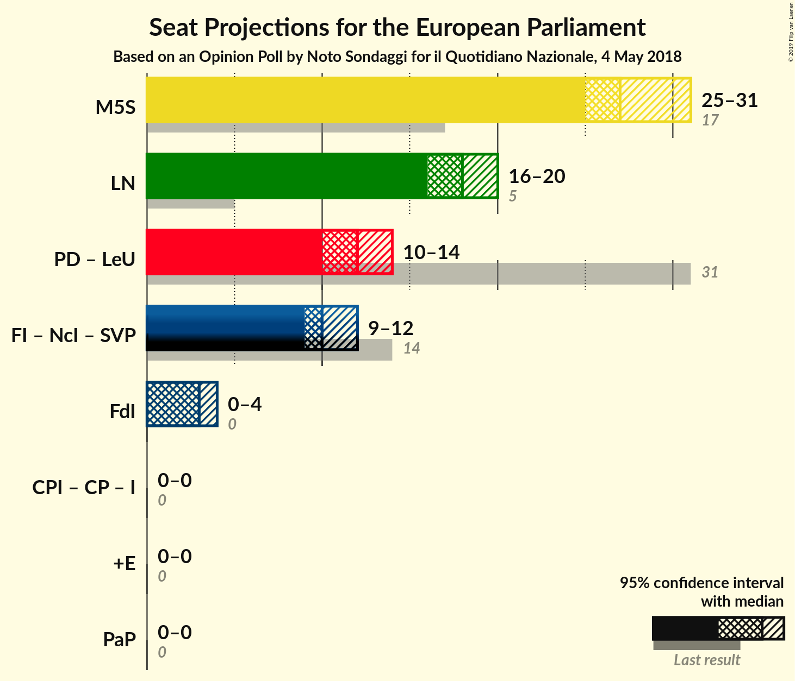
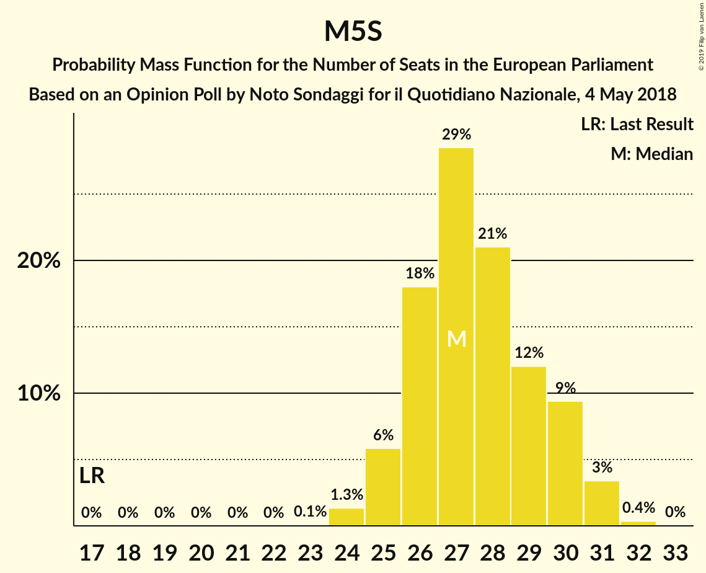
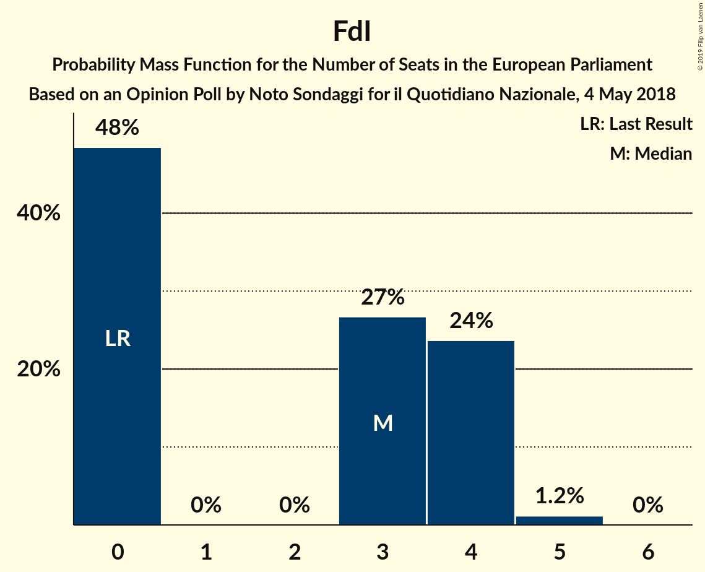

# Opinion Poll by Noto Sondaggi for il Quotidiano Nazionale, 4 May 2018

<a href="#voting-intentions">Voting Intentions</a> | <a href="#seats">Seats</a> | <a href="#coalitions">Coalitions</a> | <a href="#technical-information">Technical Information</a>

## Voting Intentions

### Confidence Intervals

| Party | Last Result | Poll Result | 80% Confidence Interval | 90% Confidence Interval | 95% Confidence Interval | 99% Confidence Interval |
|:-----:|:-----------:|:-----------:|:-----------------------:|:-----------------------:|:-----------------------:|:-----------------------:|
| Movimento 5 Stelle (EFDD) | 21.2% | 35.0% | 33.1–37.0% |32.6–37.5% |32.1–38.0% |31.2–39.0% |
| Lega Nord (ENF) | 6.2% | 22.5% | 20.9–24.3% |20.4–24.8% |20.0–25.2% |19.3–26.1% |
| Partito Democratico (S&D) | 40.8% | 15.5% | 14.1–17.1% |13.7–17.5% |13.4–17.9% |12.7–18.7% |
| Forza Italia (EPP) | 16.8% | 12.0% | 10.8–13.4% |10.4–13.8% |10.1–14.2% |9.6–14.9% |
| Fratelli d’Italia (ECR) | 3.7% | 4.0% | 3.3–4.9% |3.1–5.2% |2.9–5.4% |2.7–5.9% |
| Liberi e Uguali (S&D) | 0.0% | 2.5% | 2.0–3.3% |1.8–3.5% |1.7–3.7% |1.5–4.1% |

*Note:* The poll result column reflects the actual value used in the calculations. Published results may vary slightly, and in addition be rounded to fewer digits.

## Seats

### Confidence Intervals

| Party | Last Result | Median | 80% Confidence Interval | 90% Confidence Interval | 95% Confidence Interval | 99% Confidence Interval |
|:-----:|:-----------:|:------:|:-----------------------:|:-----------------------:|:-----------------------:|:-----------------------:|
| <a href="#movimento-5-stelle-(efdd)">Movimento 5 Stelle (EFDD)</a> | 17 | 29 | 25–29 |25–30 |25–30 |24–31 |
| <a href="#lega-nord-(enf)">Lega Nord (ENF)</a> | 5 | 18 | 18–20 |16–20 |16–20 |15–22 |
| <a href="#partito-democratico-(s&d)">Partito Democratico (S&D)</a> | 31 | 12 | 11–12 |10–12 |8–12 |8–15 |
| <a href="#forza-italia-(epp)">Forza Italia (EPP)</a> | 13 | 9 | 8–10 |8–12 |8–12 |8–13 |
| <a href="#fratelli-d’italia-(ecr)">Fratelli d’Italia (ECR)</a> | 0 | 0 | 0–4 |0–4 |0–4 |0–5 |
| <a href="#liberi-e-uguali-(s&d)">Liberi e Uguali (S&D)</a> | 0 | 0 | 0 |0 |0 |0 |

### Movimento 5 Stelle (EFDD)

*For a full overview of the results for this party, see the [Movimento 5 Stelle (EFDD)](party-movimento5stelleefdd.html) page.*

| Number of Seats | Probability | Accumulated | Special Marks |
|:---------------:|:-----------:|:-----------:|:-------------:|
| 17 | 0% | 100% | Last Result |
| 18 | 0% | 100% |  |
| 19 | 0% | 100% |  |
| 20 | 0% | 100% |  |
| 21 | 0% | 100% |  |
| 22 | 0% | 100% |  |
| 23 | 0% | 100% |  |
| 24 | 2% | 100% |  |
| 25 | 11% | 98% |  |
| 26 | 1.2% | 88% |  |
| 27 | 13% | 86% |  |
| 28 | 14% | 74% |  |
| 29 | 51% | 60% | Median |
| 30 | 8% | 9% |  |
| 31 | 0.9% | 1.3% |  |
| 32 | 0.4% | 0.4% |  |
| 33 | 0% | 0% |  |

### Lega Nord (ENF)

*For a full overview of the results for this party, see the [Lega Nord (ENF)](party-leganordenf.html) page.*

| Number of Seats | Probability | Accumulated | Special Marks |
|:---------------:|:-----------:|:-----------:|:-------------:|
| 5 | 0% | 100% | Last Result |
| 6 | 0% | 100% |  |
| 7 | 0% | 100% |  |
| 8 | 0% | 100% |  |
| 9 | 0% | 100% |  |
| 10 | 0% | 100% |  |
| 11 | 0% | 100% |  |
| 12 | 0% | 100% |  |
| 13 | 0% | 100% |  |
| 14 | 0% | 100% |  |
| 15 | 1.1% | 100% |  |
| 16 | 6% | 98.9% |  |
| 17 | 0.9% | 92% |  |
| 18 | 69% | 92% | Median |
| 19 | 10% | 22% |  |
| 20 | 11% | 12% |  |
| 21 | 0.3% | 0.9% |  |
| 22 | 0.6% | 0.6% |  |
| 23 | 0% | 0% |  |

### Partito Democratico (S&D)

*For a full overview of the results for this party, see the [Partito Democratico (S&D)](party-partitodemocraticosd.html) page.*

| Number of Seats | Probability | Accumulated | Special Marks |
|:---------------:|:-----------:|:-----------:|:-------------:|
| 8 | 3% | 100% |  |
| 9 | 1.0% | 97% |  |
| 10 | 1.3% | 96% |  |
| 11 | 17% | 94% |  |
| 12 | 76% | 78% | Median |
| 13 | 0.1% | 2% |  |
| 14 | 0.6% | 2% |  |
| 15 | 1.1% | 1.1% |  |
| 16 | 0% | 0% |  |
| 17 | 0% | 0% |  |
| 18 | 0% | 0% |  |
| 19 | 0% | 0% |  |
| 20 | 0% | 0% |  |
| 21 | 0% | 0% |  |
| 22 | 0% | 0% |  |
| 23 | 0% | 0% |  |
| 24 | 0% | 0% |  |
| 25 | 0% | 0% |  |
| 26 | 0% | 0% |  |
| 27 | 0% | 0% |  |
| 28 | 0% | 0% |  |
| 29 | 0% | 0% |  |
| 30 | 0% | 0% |  |
| 31 | 0% | 0% | Last Result |

### Forza Italia (EPP)

*For a full overview of the results for this party, see the [Forza Italia (EPP)](party-forzaitaliaepp.html) page.*

| Number of Seats | Probability | Accumulated | Special Marks |
|:---------------:|:-----------:|:-----------:|:-------------:|
| 7 | 0.3% | 100% |  |
| 8 | 11% | 99.7% |  |
| 9 | 72% | 89% | Median |
| 10 | 10% | 16% |  |
| 11 | 0% | 6% |  |
| 12 | 6% | 6% |  |
| 13 | 0.5% | 0.5% | Last Result |
| 14 | 0% | 0% |  |

### Fratelli d’Italia (ECR)

*For a full overview of the results for this party, see the [Fratelli d’Italia (ECR)](party-fratellid’italiaecr.html) page.*

| Number of Seats | Probability | Accumulated | Special Marks |
|:---------------:|:-----------:|:-----------:|:-------------:|
| 0 | 69% | 100% | Last Result, Median |
| 1 | 0% | 31% |  |
| 2 | 0% | 31% |  |
| 3 | 14% | 31% |  |
| 4 | 15% | 16% |  |
| 5 | 1.2% | 1.3% |  |
| 6 | 0% | 0% |  |

### Liberi e Uguali (S&D)

*For a full overview of the results for this party, see the [Liberi e Uguali (S&D)](party-liberieugualisd.html) page.*

| Number of Seats | Probability | Accumulated | Special Marks |
|:---------------:|:-----------:|:-----------:|:-------------:|
| 0 | 99.8% | 100% | Last Result, Median |
| 1 | 0% | 0.2% |  |
| 2 | 0% | 0.2% |  |
| 3 | 0.1% | 0.2% |  |
| 4 | 0.1% | 0.1% |  |
| 5 | 0% | 0% |  |

## Coalitions

### Confidence Intervals

| Coalition | Last Result | Median | Majority? | 80% Confidence Interval | 90% Confidence Interval | 95% Confidence Interval | 99% Confidence Interval |
|:---------:|:-----------:|:------:|:---------:|:-----------------------:|:-----------------------:|:-----------------------:|:-----------------------:|
| Movimento 5 Stelle (EFDD) | 17 | 29 | 0% | 25–29 | 25–30 | 25–30 | 24–31 |
| Lega Nord (ENF) | 5 | 18 | 0% | 18–20 | 16–20 | 16–20 | 15–22 |
| Partito Democratico (S&D) – Liberi e Uguali (S&D) | 31 | 12 | 0% | 11–12 | 10–12 | 8–12 | 8–15 |
| Fratelli d’Italia (ECR) | 0 | 0 | 0% | 0–4 | 0–4 | 0–4 | 0–5 |

### Movimento 5 Stelle (EFDD)

| Number of Seats | Probability | Accumulated | Special Marks |
|:---------------:|:-----------:|:-----------:|:-------------:|
| 17 | 0% | 100% | Last Result |
| 18 | 0% | 100% |  |
| 19 | 0% | 100% |  |
| 20 | 0% | 100% |  |
| 21 | 0% | 100% |  |
| 22 | 0% | 100% |  |
| 23 | 0% | 100% |  |
| 24 | 2% | 100% |  |
| 25 | 11% | 98% |  |
| 26 | 1.2% | 88% |  |
| 27 | 13% | 86% |  |
| 28 | 14% | 74% |  |
| 29 | 51% | 60% | Median |
| 30 | 8% | 9% |  |
| 31 | 0.9% | 1.3% |  |
| 32 | 0.4% | 0.4% |  |
| 33 | 0% | 0% |  |

### Lega Nord (ENF)

| Number of Seats | Probability | Accumulated | Special Marks |
|:---------------:|:-----------:|:-----------:|:-------------:|
| 5 | 0% | 100% | Last Result |
| 6 | 0% | 100% |  |
| 7 | 0% | 100% |  |
| 8 | 0% | 100% |  |
| 9 | 0% | 100% |  |
| 10 | 0% | 100% |  |
| 11 | 0% | 100% |  |
| 12 | 0% | 100% |  |
| 13 | 0% | 100% |  |
| 14 | 0% | 100% |  |
| 15 | 1.1% | 100% |  |
| 16 | 6% | 98.9% |  |
| 17 | 0.9% | 92% |  |
| 18 | 69% | 92% | Median |
| 19 | 10% | 22% |  |
| 20 | 11% | 12% |  |
| 21 | 0.3% | 0.9% |  |
| 22 | 0.6% | 0.6% |  |
| 23 | 0% | 0% |  |

### Partito Democratico (S&D) – Liberi e Uguali (S&D)

| Number of Seats | Probability | Accumulated | Special Marks |
|:---------------:|:-----------:|:-----------:|:-------------:|
| 8 | 3% | 100% |  |
| 9 | 1.0% | 97% |  |
| 10 | 1.3% | 96% |  |
| 11 | 17% | 94% |  |
| 12 | 76% | 78% | Median |
| 13 | 0.1% | 2% |  |
| 14 | 0.6% | 2% |  |
| 15 | 1.4% | 1.4% |  |
| 16 | 0% | 0% |  |
| 17 | 0% | 0% |  |
| 18 | 0% | 0% |  |
| 19 | 0% | 0% |  |
| 20 | 0% | 0% |  |
| 21 | 0% | 0% |  |
| 22 | 0% | 0% |  |
| 23 | 0% | 0% |  |
| 24 | 0% | 0% |  |
| 25 | 0% | 0% |  |
| 26 | 0% | 0% |  |
| 27 | 0% | 0% |  |
| 28 | 0% | 0% |  |
| 29 | 0% | 0% |  |
| 30 | 0% | 0% |  |
| 31 | 0% | 0% | Last Result |

### Fratelli d’Italia (ECR)

| Number of Seats | Probability | Accumulated | Special Marks |
|:---------------:|:-----------:|:-----------:|:-------------:|
| 0 | 69% | 100% | Last Result, Median |
| 1 | 0% | 31% |  |
| 2 | 0% | 31% |  |
| 3 | 14% | 31% |  |
| 4 | 15% | 16% |  |
| 5 | 1.2% | 1.3% |  |
| 6 | 0% | 0% |  |

## Technical Information

### Opinion Poll

+ **Polling firm:** Noto Sondaggi
+ **Commissioner(s):** il Quotidiano Nazionale
+ **Fieldwork period:** 4 May 2018

### Calculations

+ **Sample size:** 1000
+ **Simulations done:** 1,024
+ **Error estimate:** 5.08%

