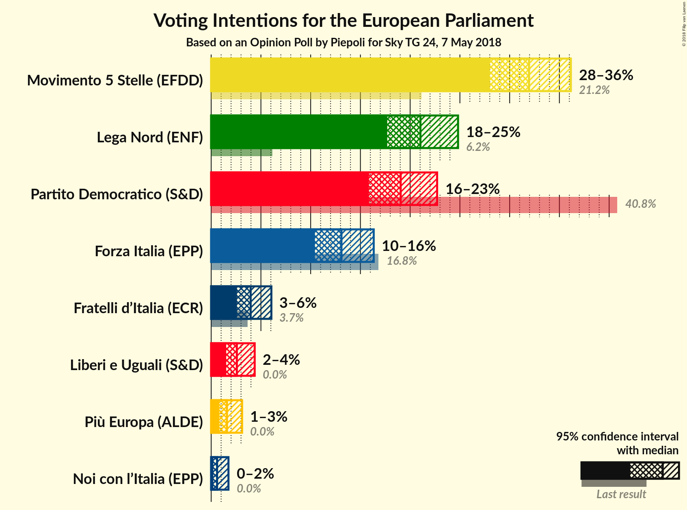
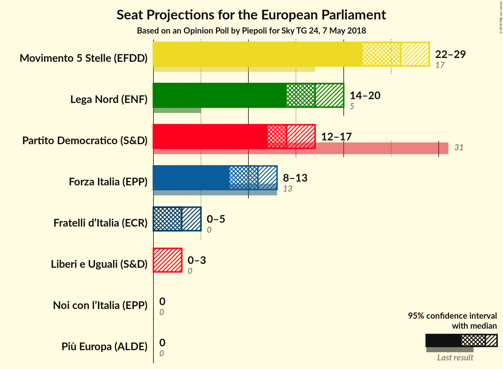

# Opinion Poll by Piepoli for Sky TG 24, 7 May 2018

<a href="#voting-intentions">Voting Intentions</a> | <a href="#seats">Seats</a> | <a href="#coalitions">Coalitions</a> | <a href="#technical-information">Technical Information</a>

## Voting Intentions

### Confidence Intervals

| Party | Last Result | Poll Result | 80% Confidence Interval | 90% Confidence Interval | 95% Confidence Interval | 99% Confidence Interval |
|:-----:|:-----------:|:-----------:|:-----------------------:|:-----------------------:|:-----------------------:|:-----------------------:|
| Movimento 5 Stelle (EFDD) | 21.2% | 31.9% | 29.4–34.7% |28.6–35.5% |28.0–36.2% |26.8–37.5% |
| Lega Nord (ENF) | 6.2% | 21.0% | 18.8–23.5% |18.2–24.2% |17.7–24.8% |16.7–26.0% |
| Partito Democratico (S&D) | 40.8% | 19.0% | 16.9–21.4% |16.4–22.1% |15.9–22.7% |14.9–23.9% |
| Forza Italia (EPP) | 16.8% | 13.1% | 11.3–15.2% |10.8–15.8% |10.4–16.3% |9.6–17.4% |
| Fratelli d’Italia (*) | 3.7% | 4.0% | 3.0–5.3% |2.8–5.7% |2.6–6.1% |2.2–6.8% |
| Liberi e Uguali (S&D) | 0.0% | 2.6% | 1.9–3.7% |1.7–4.1% |1.5–4.4% |1.2–5.0% |
| Più Europa (ALDE) | 0.0% | 1.6% | 1.1–2.6% |0.9–2.9% |0.8–3.1% |0.6–3.6% |
| Noi con l’Italia (EPP) | 0.0% | 0.6% | 0.3–1.3% |0.3–1.5% |0.2–1.7% |0.1–2.2% |

*Note:* The poll result column reflects the actual value used in the calculations. Published results may vary slightly, and in addition be rounded to fewer digits.

## Seats

### Confidence Intervals

| Party | Last Result | Median | 80% Confidence Interval | 90% Confidence Interval | 95% Confidence Interval | 99% Confidence Interval |
|:-----:|:-----------:|:------:|:-----------------------:|:-----------------------:|:-----------------------:|:-----------------------:|
| <a href="#movimento-5-stelle-(efdd)">Movimento 5 Stelle (EFDD)</a> | 17 | 26 | 23–28 |23–29 |22–29 |21–30 |
| <a href="#lega-nord-(enf)">Lega Nord (ENF)</a> | 5 | 17 | 15–19 |15–20 |14–20 |13–21 |
| <a href="#partito-democratico-(s&d)">Partito Democratico (S&D)</a> | 31 | 14 | 13–16 |12–17 |12–17 |11–19 |
| <a href="#forza-italia-(epp)">Forza Italia (EPP)</a> | 13 | 11 | 9–12 |9–13 |8–13 |8–14 |
| <a href="#fratelli-d’italia-(*)">Fratelli d’Italia (*)</a> | 0 | 3 | 0–4 |0–5 |0–5 |0–5 |
| <a href="#liberi-e-uguali-(s&d)">Liberi e Uguali (S&D)</a> | 0 | 0 | 0 |0 |0–3 |0–4 |
| <a href="#più-europa-(alde)">Più Europa (ALDE)</a> | 0 | 0 | 0 |0 |0 |0 |
| <a href="#noi-con-l’italia-(epp)">Noi con l’Italia (EPP)</a> | 0 | 0 | 0 |0 |0 |0 |

### Movimento 5 Stelle (EFDD)

*For a full overview of the results for this party, see the [Movimento 5 Stelle (EFDD)](party-movimento5stelleefdd.html) page.*

| Number of Seats | Probability | Accumulated | Special Marks |
|:---------------:|:-----------:|:-----------:|:-------------:|
| 17 | 0% | 100% | Last Result |
| 18 | 0% | 100% |  |
| 19 | 0% | 100% |  |
| 20 | 0.1% | 100% |  |
| 21 | 0.5% | 99.9% |  |
| 22 | 2% | 99.4% |  |
| 23 | 7% | 97% |  |
| 24 | 13% | 90% |  |
| 25 | 21% | 77% |  |
| 26 | 21% | 56% | Median |
| 27 | 19% | 35% |  |
| 28 | 10% | 16% |  |
| 29 | 4% | 6% |  |
| 30 | 1.2% | 2% |  |
| 31 | 0.4% | 0.5% |  |
| 32 | 0.1% | 0.1% |  |
| 33 | 0% | 0% |  |

### Lega Nord (ENF)

*For a full overview of the results for this party, see the [Lega Nord (ENF)](party-leganordenf.html) page.*

| Number of Seats | Probability | Accumulated | Special Marks |
|:---------------:|:-----------:|:-----------:|:-------------:|
| 5 | 0% | 100% | Last Result |
| 6 | 0% | 100% |  |
| 7 | 0% | 100% |  |
| 8 | 0% | 100% |  |
| 9 | 0% | 100% |  |
| 10 | 0% | 100% |  |
| 11 | 0% | 100% |  |
| 12 | 0.1% | 100% |  |
| 13 | 0.7% | 99.9% |  |
| 14 | 4% | 99.3% |  |
| 15 | 12% | 96% |  |
| 16 | 19% | 83% |  |
| 17 | 29% | 64% | Median |
| 18 | 18% | 35% |  |
| 19 | 11% | 17% |  |
| 20 | 4% | 6% |  |
| 21 | 1.1% | 1.4% |  |
| 22 | 0.2% | 0.3% |  |
| 23 | 0% | 0% |  |

### Partito Democratico (S&D)

*For a full overview of the results for this party, see the [Partito Democratico (S&D)](party-partitodemocraticosd.html) page.*

| Number of Seats | Probability | Accumulated | Special Marks |
|:---------------:|:-----------:|:-----------:|:-------------:|
| 10 | 0.2% | 100% |  |
| 11 | 2% | 99.8% |  |
| 12 | 7% | 98% |  |
| 13 | 15% | 91% |  |
| 14 | 29% | 76% | Median |
| 15 | 25% | 47% |  |
| 16 | 15% | 22% |  |
| 17 | 5% | 7% |  |
| 18 | 1.4% | 2% |  |
| 19 | 0.5% | 0.6% |  |
| 20 | 0% | 0.1% |  |
| 21 | 0% | 0% |  |
| 22 | 0% | 0% |  |
| 23 | 0% | 0% |  |
| 24 | 0% | 0% |  |
| 25 | 0% | 0% |  |
| 26 | 0% | 0% |  |
| 27 | 0% | 0% |  |
| 28 | 0% | 0% |  |
| 29 | 0% | 0% |  |
| 30 | 0% | 0% |  |
| 31 | 0% | 0% | Last Result |

### Forza Italia (EPP)

*For a full overview of the results for this party, see the [Forza Italia (EPP)](party-forzaitaliaepp.html) page.*

| Number of Seats | Probability | Accumulated | Special Marks |
|:---------------:|:-----------:|:-----------:|:-------------:|
| 7 | 0.3% | 100% |  |
| 8 | 4% | 99.7% |  |
| 9 | 14% | 96% |  |
| 10 | 31% | 82% |  |
| 11 | 25% | 51% | Median |
| 12 | 18% | 26% |  |
| 13 | 7% | 8% | Last Result |
| 14 | 1.1% | 1.3% |  |
| 15 | 0.2% | 0.2% |  |
| 16 | 0% | 0% |  |

### Fratelli d’Italia (*)

*For a full overview of the results for this party, see the [Fratelli d’Italia (*)](party-fratellid’italia.html) page.*

| Number of Seats | Probability | Accumulated | Special Marks |
|:---------------:|:-----------:|:-----------:|:-------------:|
| 0 | 50% | 100% | Last Result |
| 1 | 0% | 50% |  |
| 2 | 0% | 50% |  |
| 3 | 13% | 50% | Median |
| 4 | 32% | 37% |  |
| 5 | 5% | 5% |  |
| 6 | 0.3% | 0.3% |  |
| 7 | 0% | 0% |  |

### Liberi e Uguali (S&D)

*For a full overview of the results for this party, see the [Liberi e Uguali (S&D)](party-liberieugualisd.html) page.*

| Number of Seats | Probability | Accumulated | Special Marks |
|:---------------:|:-----------:|:-----------:|:-------------:|
| 0 | 95% | 100% | Last Result, Median |
| 1 | 0% | 5% |  |
| 2 | 0% | 5% |  |
| 3 | 2% | 5% |  |
| 4 | 2% | 2% |  |
| 5 | 0.1% | 0.1% |  |
| 6 | 0% | 0% |  |

### Più Europa (ALDE)

*For a full overview of the results for this party, see the [Più Europa (ALDE)](party-piùeuropaalde.html) page.*

| Number of Seats | Probability | Accumulated | Special Marks |
|:---------------:|:-----------:|:-----------:|:-------------:|
| 0 | 99.9% | 100% | Last Result, Median |
| 1 | 0% | 0.1% |  |
| 2 | 0% | 0.1% |  |
| 3 | 0.1% | 0.1% |  |
| 4 | 0% | 0% |  |

### Noi con l’Italia (EPP)

*For a full overview of the results for this party, see the [Noi con l’Italia (EPP)](party-noiconl’italiaepp.html) page.*

| Number of Seats | Probability | Accumulated | Special Marks |
|:---------------:|:-----------:|:-----------:|:-------------:|
| 0 | 100% | 100% | Last Result, Median |

## Coalitions

### Confidence Intervals

| Coalition | Last Result | Median | Majority? | 80% Confidence Interval | 90% Confidence Interval | 95% Confidence Interval | 99% Confidence Interval |
|:---------:|:-----------:|:------:|:---------:|:-----------------------:|:-----------------------:|:-----------------------:|:-----------------------:|
| Movimento 5 Stelle (EFDD) | 17 | 26 | 0% | 23–28 | 23–29 | 22–29 | 21–30 |
| Lega Nord (ENF) | 5 | 17 | 0% | 15–19 | 15–20 | 14–20 | 13–21 |
| Partito Democratico (S&D) – Liberi e Uguali (S&D) | 31 | 14 | 0% | 13–17 | 12–17 | 12–18 | 11–19 |
| Più Europa (ALDE) | 0 | 0 | 0% | 0 | 0 | 0 | 0 |

### Movimento 5 Stelle (EFDD)

| Number of Seats | Probability | Accumulated | Special Marks |
|:---------------:|:-----------:|:-----------:|:-------------:|
| 17 | 0% | 100% | Last Result |
| 18 | 0% | 100% |  |
| 19 | 0% | 100% |  |
| 20 | 0.1% | 100% |  |
| 21 | 0.5% | 99.9% |  |
| 22 | 2% | 99.4% |  |
| 23 | 7% | 97% |  |
| 24 | 13% | 90% |  |
| 25 | 21% | 77% |  |
| 26 | 21% | 56% | Median |
| 27 | 19% | 35% |  |
| 28 | 10% | 16% |  |
| 29 | 4% | 6% |  |
| 30 | 1.2% | 2% |  |
| 31 | 0.4% | 0.5% |  |
| 32 | 0.1% | 0.1% |  |
| 33 | 0% | 0% |  |

### Lega Nord (ENF)

| Number of Seats | Probability | Accumulated | Special Marks |
|:---------------:|:-----------:|:-----------:|:-------------:|
| 5 | 0% | 100% | Last Result |
| 6 | 0% | 100% |  |
| 7 | 0% | 100% |  |
| 8 | 0% | 100% |  |
| 9 | 0% | 100% |  |
| 10 | 0% | 100% |  |
| 11 | 0% | 100% |  |
| 12 | 0.1% | 100% |  |
| 13 | 0.7% | 99.9% |  |
| 14 | 4% | 99.3% |  |
| 15 | 12% | 96% |  |
| 16 | 19% | 83% |  |
| 17 | 29% | 64% | Median |
| 18 | 18% | 35% |  |
| 19 | 11% | 17% |  |
| 20 | 4% | 6% |  |
| 21 | 1.1% | 1.4% |  |
| 22 | 0.2% | 0.3% |  |
| 23 | 0% | 0% |  |

### Partito Democratico (S&D) – Liberi e Uguali (S&D)

| Number of Seats | Probability | Accumulated | Special Marks |
|:---------------:|:-----------:|:-----------:|:-------------:|
| 10 | 0.1% | 100% |  |
| 11 | 2% | 99.9% |  |
| 12 | 6% | 98% |  |
| 13 | 14% | 92% |  |
| 14 | 28% | 78% | Median |
| 15 | 24% | 50% |  |
| 16 | 15% | 26% |  |
| 17 | 6% | 10% |  |
| 18 | 2% | 4% |  |
| 19 | 1.2% | 2% |  |
| 20 | 0.3% | 0.4% |  |
| 21 | 0.1% | 0.1% |  |
| 22 | 0% | 0% |  |
| 23 | 0% | 0% |  |
| 24 | 0% | 0% |  |
| 25 | 0% | 0% |  |
| 26 | 0% | 0% |  |
| 27 | 0% | 0% |  |
| 28 | 0% | 0% |  |
| 29 | 0% | 0% |  |
| 30 | 0% | 0% |  |
| 31 | 0% | 0% | Last Result |

### Più Europa (ALDE)

| Number of Seats | Probability | Accumulated | Special Marks |
|:---------------:|:-----------:|:-----------:|:-------------:|
| 0 | 99.9% | 100% | Last Result, Median |
| 1 | 0% | 0.1% |  |
| 2 | 0% | 0.1% |  |
| 3 | 0.1% | 0.1% |  |
| 4 | 0% | 0% |  |

## Technical Information

### Opinion Poll

+ **Polling firm:** Piepoli
+ **Commissioner(s):** Sky TG 24
+ **Fieldwork period:** 7 May 2018

### Calculations

+ **Sample size:** 504
+ **Simulations done:** 1,048,576
+ **Error estimate:** 1.30%

