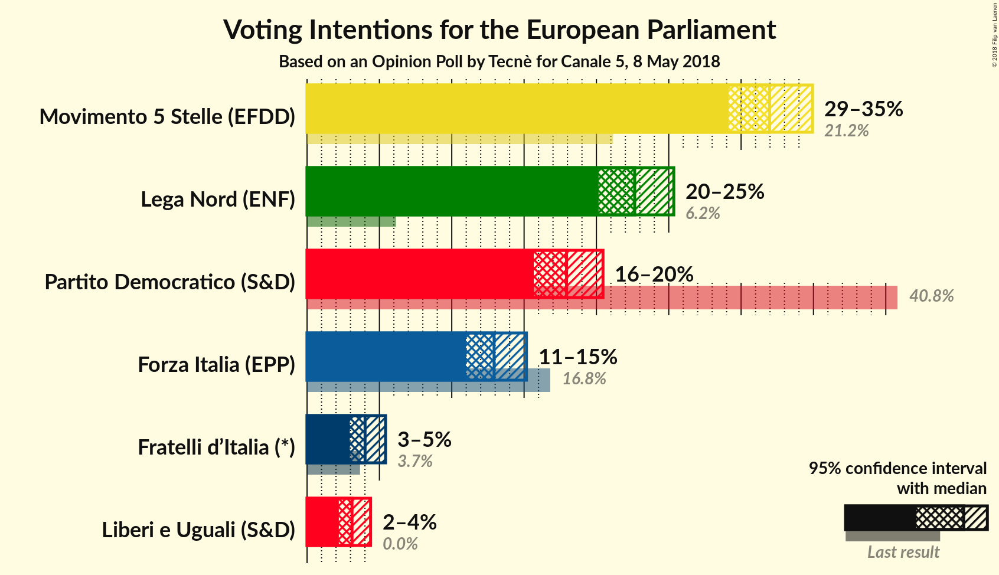
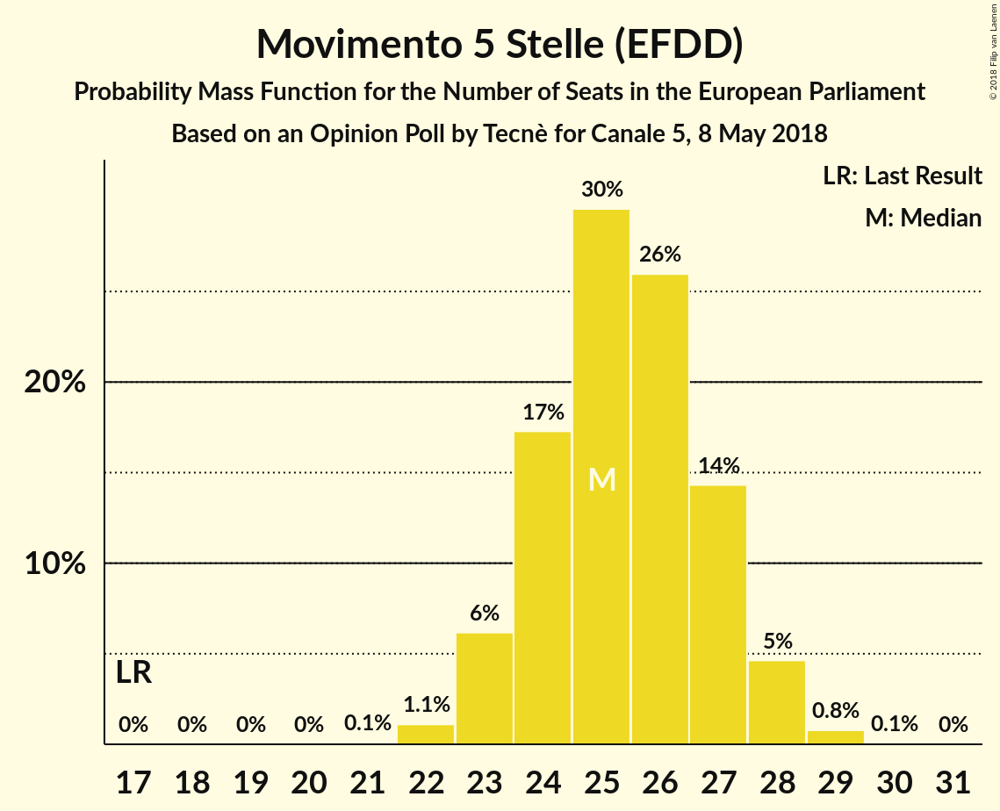
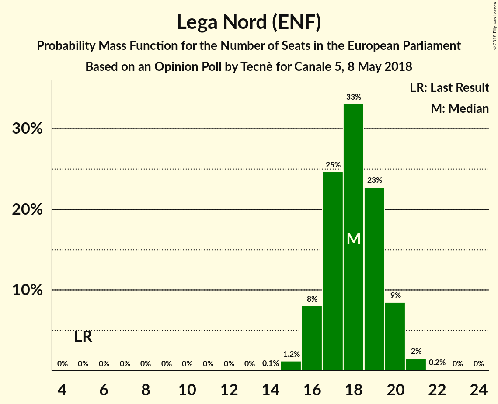
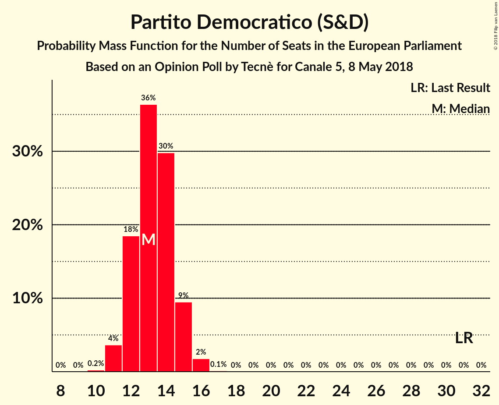
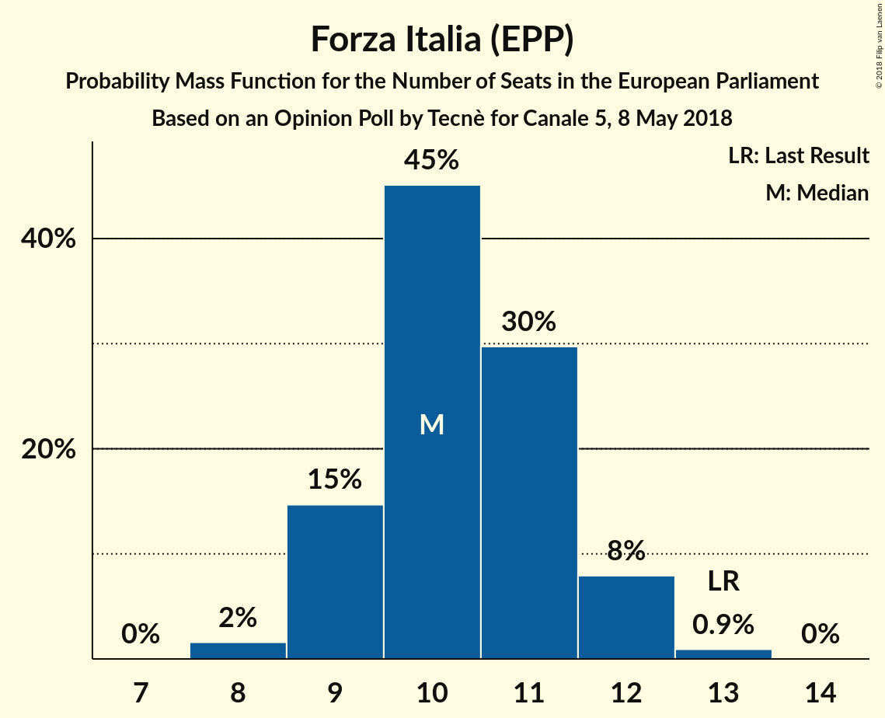
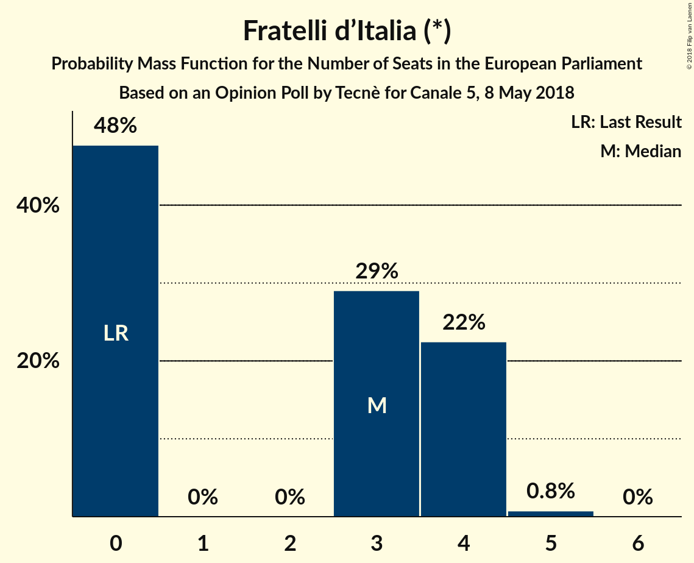
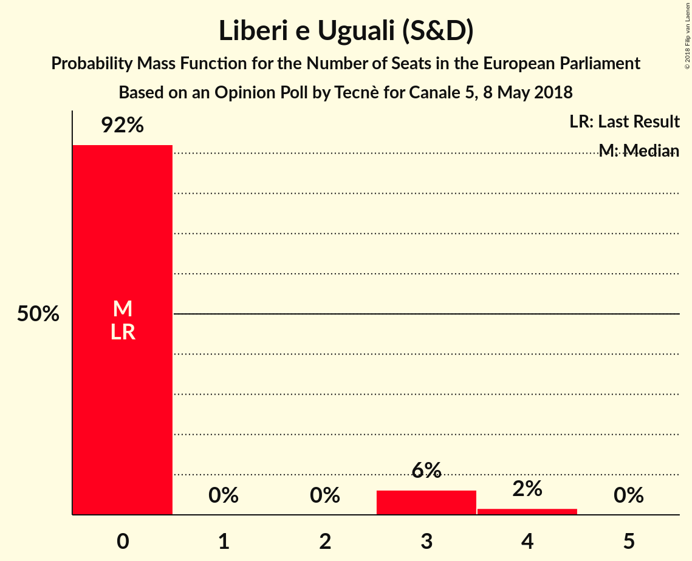
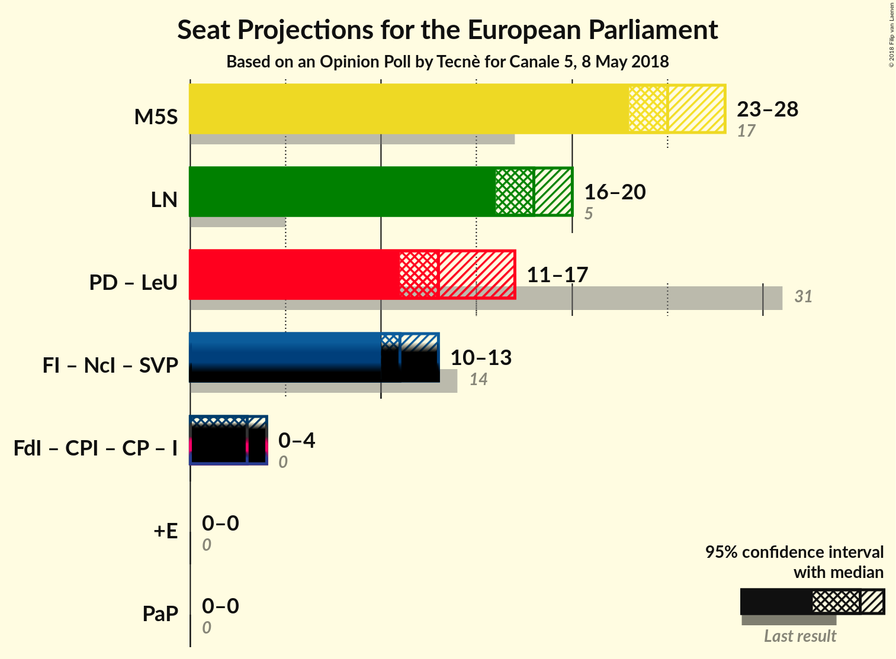

# Opinion Poll by Tecnè for Canale 5, 8 May 2018

<a href="#voting-intentions">Voting Intentions</a> | <a href="#seats">Seats</a> | <a href="#coalitions">Coalitions</a> | <a href="#technical-information">Technical Information</a>

## Voting Intentions

### Confidence Intervals

| Party | Last Result | Poll Result | 80% Confidence Interval | 90% Confidence Interval | 95% Confidence Interval | 99% Confidence Interval |
|:-----:|:-----------:|:-----------:|:-----------------------:|:-----------------------:|:-----------------------:|:-----------------------:|
| Movimento 5 Stelle (EFDD) | 21.2% | 32.0% | 30.1–33.9% |29.6–34.4% |29.1–34.9% |28.3–35.9% |
| Lega Nord (ENF) | 6.2% | 22.6% | 21.0–24.4% |20.5–24.9% |20.1–25.3% |19.4–26.2% |
| Partito Democratico (S&D) | 40.8% | 17.9% | 16.4–19.6% |16.0–20.0% |15.7–20.5% |15.0–21.2% |
| Forza Italia (EPP) | 16.8% | 12.9% | 11.6–14.4% |11.3–14.8% |11.0–15.2% |10.4–15.9% |
| Fratelli d’Italia (*) | 3.7% | 4.0% | 3.3–4.9% |3.1–5.2% |3.0–5.4% |2.7–5.9% |
| Liberi e Uguali (S&D) | 0.0% | 3.1% | 2.5–3.9% |2.3–4.2% |2.2–4.4% |1.9–4.8% |

*Note:* The poll result column reflects the actual value used in the calculations. Published results may vary slightly, and in addition be rounded to fewer digits.

## Seats

### Confidence Intervals

| Party | Last Result | Median | 80% Confidence Interval | 90% Confidence Interval | 95% Confidence Interval | 99% Confidence Interval |
|:-----:|:-----------:|:------:|:-----------------------:|:-----------------------:|:-----------------------:|:-----------------------:|
| <a href="#movimento-5-stelle-(efdd)">Movimento 5 Stelle (EFDD)</a> | 17 | 25 | 24–27 |23–28 |23–28 |22–29 |
| <a href="#lega-nord-(enf)">Lega Nord (ENF)</a> | 5 | 18 | 17–20 |16–20 |16–20 |15–21 |
| <a href="#partito-democratico-(s&d)">Partito Democratico (S&D)</a> | 31 | 13 | 12–15 |12–15 |11–15 |11–16 |
| <a href="#forza-italia-(epp)">Forza Italia (EPP)</a> | 13 | 10 | 9–11 |9–12 |9–12 |8–13 |
| <a href="#fratelli-d’italia-(*)">Fratelli d’Italia (*)</a> | 0 | 3 | 0–4 |0–4 |0–4 |0–5 |
| <a href="#liberi-e-uguali-(s&d)">Liberi e Uguali (S&D)</a> | 0 | 0 | 0 |0–3 |0–3 |0–4 |

### Movimento 5 Stelle (EFDD)

*For a full overview of the results for this party, see the [Movimento 5 Stelle (EFDD)](party-movimento5stelleefdd.html) page.*

| Number of Seats | Probability | Accumulated | Special Marks |
|:---------------:|:-----------:|:-----------:|:-------------:|
| 17 | 0% | 100% | Last Result |
| 18 | 0% | 100% |  |
| 19 | 0% | 100% |  |
| 20 | 0% | 100% |  |
| 21 | 0.1% | 100% |  |
| 22 | 1.1% | 99.9% |  |
| 23 | 6% | 98.8% |  |
| 24 | 17% | 93% |  |
| 25 | 30% | 75% | Median |
| 26 | 26% | 46% |  |
| 27 | 14% | 20% |  |
| 28 | 5% | 5% |  |
| 29 | 0.8% | 0.9% |  |
| 30 | 0.1% | 0.1% |  |
| 31 | 0% | 0% |  |

### Lega Nord (ENF)

*For a full overview of the results for this party, see the [Lega Nord (ENF)](party-leganordenf.html) page.*

| Number of Seats | Probability | Accumulated | Special Marks |
|:---------------:|:-----------:|:-----------:|:-------------:|
| 5 | 0% | 100% | Last Result |
| 6 | 0% | 100% |  |
| 7 | 0% | 100% |  |
| 8 | 0% | 100% |  |
| 9 | 0% | 100% |  |
| 10 | 0% | 100% |  |
| 11 | 0% | 100% |  |
| 12 | 0% | 100% |  |
| 13 | 0% | 100% |  |
| 14 | 0.1% | 100% |  |
| 15 | 1.2% | 99.9% |  |
| 16 | 8% | 98.7% |  |
| 17 | 25% | 91% |  |
| 18 | 33% | 66% | Median |
| 19 | 23% | 33% |  |
| 20 | 9% | 10% |  |
| 21 | 2% | 2% |  |
| 22 | 0.2% | 0.2% |  |
| 23 | 0% | 0% |  |

### Partito Democratico (S&D)

*For a full overview of the results for this party, see the [Partito Democratico (S&D)](party-partitodemocraticosd.html) page.*

| Number of Seats | Probability | Accumulated | Special Marks |
|:---------------:|:-----------:|:-----------:|:-------------:|
| 10 | 0.2% | 100% |  |
| 11 | 4% | 99.8% |  |
| 12 | 18% | 96% |  |
| 13 | 36% | 78% | Median |
| 14 | 30% | 41% |  |
| 15 | 9% | 11% |  |
| 16 | 2% | 2% |  |
| 17 | 0.1% | 0.1% |  |
| 18 | 0% | 0% |  |
| 19 | 0% | 0% |  |
| 20 | 0% | 0% |  |
| 21 | 0% | 0% |  |
| 22 | 0% | 0% |  |
| 23 | 0% | 0% |  |
| 24 | 0% | 0% |  |
| 25 | 0% | 0% |  |
| 26 | 0% | 0% |  |
| 27 | 0% | 0% |  |
| 28 | 0% | 0% |  |
| 29 | 0% | 0% |  |
| 30 | 0% | 0% |  |
| 31 | 0% | 0% | Last Result |

### Forza Italia (EPP)

*For a full overview of the results for this party, see the [Forza Italia (EPP)](party-forzaitaliaepp.html) page.*

| Number of Seats | Probability | Accumulated | Special Marks |
|:---------------:|:-----------:|:-----------:|:-------------:|
| 8 | 2% | 100% |  |
| 9 | 15% | 98% |  |
| 10 | 45% | 84% | Median |
| 11 | 30% | 39% |  |
| 12 | 8% | 9% |  |
| 13 | 0.9% | 0.9% | Last Result |
| 14 | 0% | 0% |  |

### Fratelli d’Italia (*)

*For a full overview of the results for this party, see the [Fratelli d’Italia (*)](party-fratellid’italia.html) page.*

| Number of Seats | Probability | Accumulated | Special Marks |
|:---------------:|:-----------:|:-----------:|:-------------:|
| 0 | 48% | 100% | Last Result |
| 1 | 0% | 52% |  |
| 2 | 0% | 52% |  |
| 3 | 29% | 52% | Median |
| 4 | 22% | 23% |  |
| 5 | 0.8% | 0.8% |  |
| 6 | 0% | 0% |  |

### Liberi e Uguali (S&D)

*For a full overview of the results for this party, see the [Liberi e Uguali (S&D)](party-liberieugualisd.html) page.*

| Number of Seats | Probability | Accumulated | Special Marks |
|:---------------:|:-----------:|:-----------:|:-------------:|
| 0 | 92% | 100% | Last Result, Median |
| 1 | 0% | 8% |  |
| 2 | 0% | 8% |  |
| 3 | 6% | 8% |  |
| 4 | 2% | 2% |  |
| 5 | 0% | 0% |  |

## Coalitions

### Confidence Intervals

| Coalition | Last Result | Median | Majority? | 80% Confidence Interval | 90% Confidence Interval | 95% Confidence Interval | 99% Confidence Interval |
|:---------:|:-----------:|:------:|:---------:|:-----------------------:|:-----------------------:|:-----------------------:|:-----------------------:|
| Movimento 5 Stelle (EFDD) | 17 | 25 | 0% | 24–27 | 23–28 | 23–28 | 22–29 |
| Lega Nord (ENF) | 5 | 18 | 0% | 17–20 | 16–20 | 16–20 | 15–21 |
| Partito Democratico (S&D) – Liberi e Uguali (S&D) | 31 | 13 | 0% | 12–15 | 12–16 | 11–17 | 11–18 |

### Movimento 5 Stelle (EFDD)

| Number of Seats | Probability | Accumulated | Special Marks |
|:---------------:|:-----------:|:-----------:|:-------------:|
| 17 | 0% | 100% | Last Result |
| 18 | 0% | 100% |  |
| 19 | 0% | 100% |  |
| 20 | 0% | 100% |  |
| 21 | 0.1% | 100% |  |
| 22 | 1.1% | 99.9% |  |
| 23 | 6% | 98.8% |  |
| 24 | 17% | 93% |  |
| 25 | 30% | 75% | Median |
| 26 | 26% | 46% |  |
| 27 | 14% | 20% |  |
| 28 | 5% | 5% |  |
| 29 | 0.8% | 0.9% |  |
| 30 | 0.1% | 0.1% |  |
| 31 | 0% | 0% |  |

### Lega Nord (ENF)

| Number of Seats | Probability | Accumulated | Special Marks |
|:---------------:|:-----------:|:-----------:|:-------------:|
| 5 | 0% | 100% | Last Result |
| 6 | 0% | 100% |  |
| 7 | 0% | 100% |  |
| 8 | 0% | 100% |  |
| 9 | 0% | 100% |  |
| 10 | 0% | 100% |  |
| 11 | 0% | 100% |  |
| 12 | 0% | 100% |  |
| 13 | 0% | 100% |  |
| 14 | 0.1% | 100% |  |
| 15 | 1.2% | 99.9% |  |
| 16 | 8% | 98.7% |  |
| 17 | 25% | 91% |  |
| 18 | 33% | 66% | Median |
| 19 | 23% | 33% |  |
| 20 | 9% | 10% |  |
| 21 | 2% | 2% |  |
| 22 | 0.2% | 0.2% |  |
| 23 | 0% | 0% |  |

### Partito Democratico (S&D) – Liberi e Uguali (S&D)

| Number of Seats | Probability | Accumulated | Special Marks |
|:---------------:|:-----------:|:-----------:|:-------------:|
| 10 | 0.2% | 100% |  |
| 11 | 3% | 99.8% |  |
| 12 | 16% | 97% |  |
| 13 | 34% | 81% | Median |
| 14 | 29% | 47% |  |
| 15 | 11% | 18% |  |
| 16 | 5% | 7% |  |
| 17 | 2% | 3% |  |
| 18 | 0.5% | 0.6% |  |
| 19 | 0.1% | 0.1% |  |
| 20 | 0% | 0% |  |
| 21 | 0% | 0% |  |
| 22 | 0% | 0% |  |
| 23 | 0% | 0% |  |
| 24 | 0% | 0% |  |
| 25 | 0% | 0% |  |
| 26 | 0% | 0% |  |
| 27 | 0% | 0% |  |
| 28 | 0% | 0% |  |
| 29 | 0% | 0% |  |
| 30 | 0% | 0% |  |
| 31 | 0% | 0% | Last Result |

## Technical Information

### Opinion Poll

+ **Polling firm:** Tecnè
+ **Commissioner(s):** Canale 5
+ **Fieldwork period:** 8 May 2018

### Calculations

+ **Sample size:** 998
+ **Simulations done:** 1,048,576
+ **Error estimate:** 0.49%

