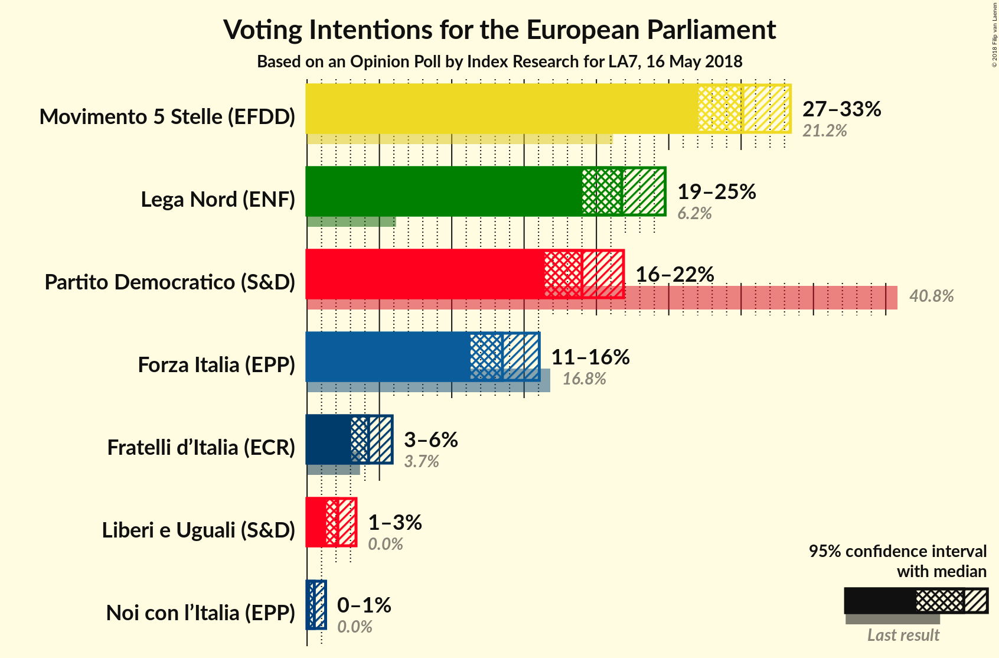
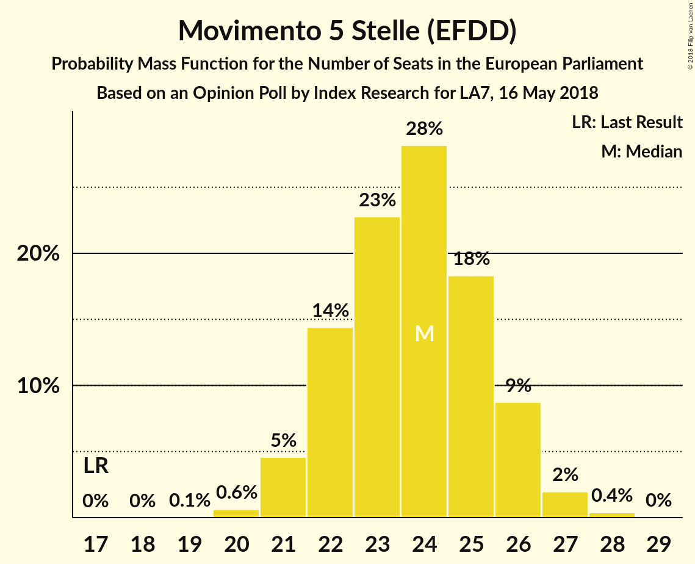
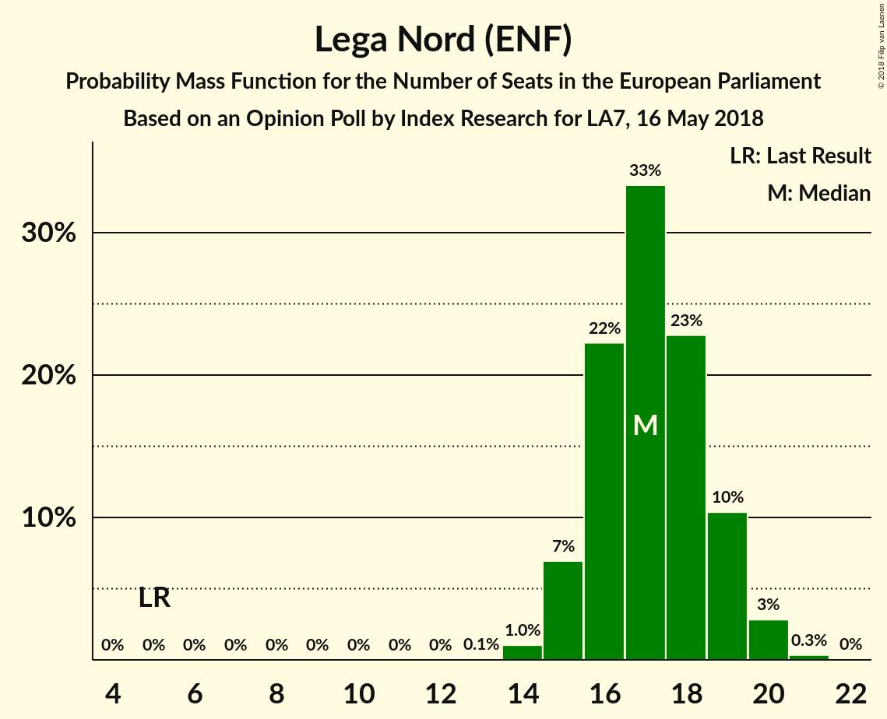
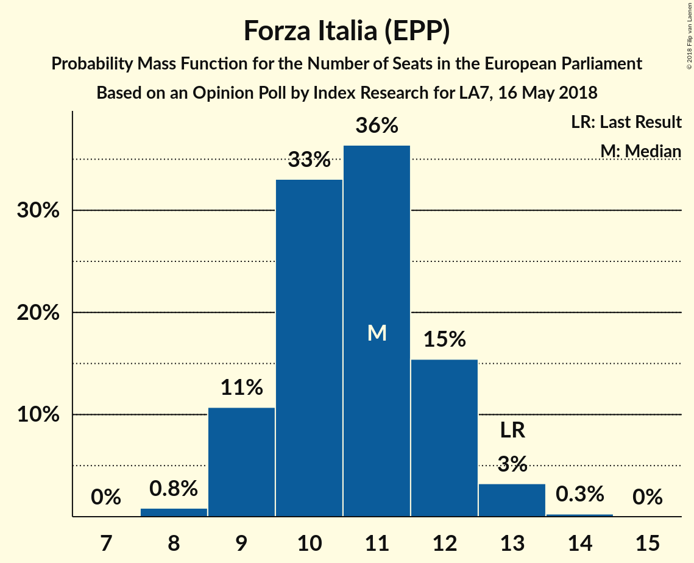

# Opinion Poll by Index Research for LA7, 16 May 2018

<a href="#voting-intentions">Voting Intentions</a> | <a href="#seats">Seats</a> | <a href="#coalitions">Coalitions</a> | <a href="#technical-information">Technical Information</a>

## Voting Intentions

### Confidence Intervals

| Party | Last Result | Poll Result | 80% Confidence Interval | 90% Confidence Interval | 95% Confidence Interval | 99% Confidence Interval |
|:-----:|:-----------:|:-----------:|:-----------------------:|:-----------------------:|:-----------------------:|:-----------------------:|
| Movimento 5 Stelle (EFDD) | 21.2% | 30.1% | 28.1–32.3% |27.5–32.9% |27.0–33.4% |26.1–34.4% |
| Lega Nord (ENF) | 6.2% | 21.8% | 20.0–23.7% |19.4–24.3% |19.0–24.8% |18.2–25.7% |
| Partito Democratico (S&D) | 40.8% | 19.0% | 17.3–20.9% |16.8–21.4% |16.4–21.9% |15.7–22.8% |
| Forza Italia (EPP) | 16.8% | 13.5% | 12.1–15.2% |11.6–15.6% |11.3–16.0% |10.6–16.9% |
| Fratelli d’Italia (*) | 3.7% | 4.2% | 3.5–5.3% |3.2–5.6% |3.0–5.9% |2.7–6.4% |
| Liberi e Uguali (S&D) | 0.0% | 2.1% | 1.6–2.9% |1.4–3.2% |1.3–3.4% |1.1–3.8% |
| Noi con l’Italia (EPP) | 0.0% | 0.5% | 0.3–1.0% |0.2–1.1% |0.2–1.3% |0.1–1.6% |

*Note:* The poll result column reflects the actual value used in the calculations. Published results may vary slightly, and in addition be rounded to fewer digits.

## Seats

### Confidence Intervals

| Party | Last Result | Median | 80% Confidence Interval | 90% Confidence Interval | 95% Confidence Interval | 99% Confidence Interval |
|:-----:|:-----------:|:------:|:-----------------------:|:-----------------------:|:-----------------------:|:-----------------------:|
| <a href="#movimento-5-stelle-(efdd)">Movimento 5 Stelle (EFDD)</a> | 17 | 24 | 22–25 |21–26 |21–26 |21–27 |
| <a href="#lega-nord-(enf)">Lega Nord (ENF)</a> | 5 | 17 | 16–19 |15–19 |15–20 |14–20 |
| <a href="#partito-democratico-(s&d)">Partito Democratico (S&D)</a> | 31 | 14 | 13–15 |13–15 |12–16 |11–17 |
| <a href="#forza-italia-(epp)">Forza Italia (EPP)</a> | 13 | 11 | 9–12 |9–12 |9–13 |8–13 |
| <a href="#fratelli-d’italia-(*)">Fratelli d’Italia (*)</a> | 0 | 3 | 0–4 |0–4 |0–5 |0–5 |
| <a href="#liberi-e-uguali-(s&d)">Liberi e Uguali (S&D)</a> | 0 | 0 | 0 |0 |0 |0 |
| <a href="#noi-con-l’italia-(epp)">Noi con l’Italia (EPP)</a> | 0 | 0 | 0 |0 |0 |0 |

### Movimento 5 Stelle (EFDD)

*For a full overview of the results for this party, see the [Movimento 5 Stelle (EFDD)](party-movimento5stelleefdd.html) page.*

| Number of Seats | Probability | Accumulated | Special Marks |
|:---------------:|:-----------:|:-----------:|:-------------:|
| 17 | 0% | 100% | Last Result |
| 18 | 0% | 100% |  |
| 19 | 0% | 100% |  |
| 20 | 0.5% | 100% |  |
| 21 | 7% | 99.5% |  |
| 22 | 12% | 93% |  |
| 23 | 28% | 80% |  |
| 24 | 29% | 52% | Median |
| 25 | 14% | 23% |  |
| 26 | 8% | 10% |  |
| 27 | 2% | 2% |  |
| 28 | 0.2% | 0.3% |  |
| 29 | 0% | 0% |  |

### Lega Nord (ENF)

*For a full overview of the results for this party, see the [Lega Nord (ENF)](party-leganordenf.html) page.*

| Number of Seats | Probability | Accumulated | Special Marks |
|:---------------:|:-----------:|:-----------:|:-------------:|
| 5 | 0% | 100% | Last Result |
| 6 | 0% | 100% |  |
| 7 | 0% | 100% |  |
| 8 | 0% | 100% |  |
| 9 | 0% | 100% |  |
| 10 | 0% | 100% |  |
| 11 | 0% | 100% |  |
| 12 | 0% | 100% |  |
| 13 | 0% | 100% |  |
| 14 | 0.9% | 100% |  |
| 15 | 7% | 99.1% |  |
| 16 | 21% | 92% |  |
| 17 | 32% | 71% | Median |
| 18 | 26% | 38% |  |
| 19 | 8% | 12% |  |
| 20 | 4% | 5% |  |
| 21 | 0.3% | 0.3% |  |
| 22 | 0% | 0% |  |

### Partito Democratico (S&D)

*For a full overview of the results for this party, see the [Partito Democratico (S&D)](party-partitodemocraticosd.html) page.*

| Number of Seats | Probability | Accumulated | Special Marks |
|:---------------:|:-----------:|:-----------:|:-------------:|
| 10 | 0.1% | 100% |  |
| 11 | 0.6% | 99.9% |  |
| 12 | 4% | 99.4% |  |
| 13 | 13% | 95% |  |
| 14 | 47% | 83% | Median |
| 15 | 31% | 36% |  |
| 16 | 4% | 5% |  |
| 17 | 0.9% | 1.0% |  |
| 18 | 0.1% | 0.1% |  |
| 19 | 0% | 0% |  |
| 20 | 0% | 0% |  |
| 21 | 0% | 0% |  |
| 22 | 0% | 0% |  |
| 23 | 0% | 0% |  |
| 24 | 0% | 0% |  |
| 25 | 0% | 0% |  |
| 26 | 0% | 0% |  |
| 27 | 0% | 0% |  |
| 28 | 0% | 0% |  |
| 29 | 0% | 0% |  |
| 30 | 0% | 0% |  |
| 31 | 0% | 0% | Last Result |

### Forza Italia (EPP)

*For a full overview of the results for this party, see the [Forza Italia (EPP)](party-forzaitaliaepp.html) page.*

| Number of Seats | Probability | Accumulated | Special Marks |
|:---------------:|:-----------:|:-----------:|:-------------:|
| 8 | 1.2% | 100% |  |
| 9 | 12% | 98.7% |  |
| 10 | 32% | 87% |  |
| 11 | 42% | 55% | Median |
| 12 | 10% | 13% |  |
| 13 | 2% | 3% | Last Result |
| 14 | 0.2% | 0.2% |  |
| 15 | 0% | 0% |  |

### Fratelli d’Italia (*)

*For a full overview of the results for this party, see the [Fratelli d’Italia (*)](party-fratellid’italia.html) page.*

| Number of Seats | Probability | Accumulated | Special Marks |
|:---------------:|:-----------:|:-----------:|:-------------:|
| 0 | 32% | 100% | Last Result |
| 1 | 0% | 68% |  |
| 2 | 0% | 68% |  |
| 3 | 30% | 68% | Median |
| 4 | 35% | 38% |  |
| 5 | 4% | 4% |  |
| 6 | 0.1% | 0.1% |  |
| 7 | 0% | 0% |  |

### Liberi e Uguali (S&D)

*For a full overview of the results for this party, see the [Liberi e Uguali (S&D)](party-liberieugualisd.html) page.*

| Number of Seats | Probability | Accumulated | Special Marks |
|:---------------:|:-----------:|:-----------:|:-------------:|
| 0 | 99.9% | 100% | Last Result, Median |
| 1 | 0% | 0.1% |  |
| 2 | 0% | 0.1% |  |
| 3 | 0.1% | 0.1% |  |
| 4 | 0% | 0% |  |

### Noi con l’Italia (EPP)

*For a full overview of the results for this party, see the [Noi con l’Italia (EPP)](party-noiconl’italiaepp.html) page.*

| Number of Seats | Probability | Accumulated | Special Marks |
|:---------------:|:-----------:|:-----------:|:-------------:|
| 0 | 100% | 100% | Last Result, Median |

## Coalitions

### Confidence Intervals

| Coalition | Last Result | Median | Majority? | 80% Confidence Interval | 90% Confidence Interval | 95% Confidence Interval | 99% Confidence Interval |
|:---------:|:-----------:|:------:|:---------:|:-----------------------:|:-----------------------:|:-----------------------:|:-----------------------:|
| Movimento 5 Stelle (EFDD) | 17 | 24 | 0% | 22–25 | 21–26 | 21–26 | 21–27 |
| Lega Nord (ENF) | 5 | 17 | 0% | 16–19 | 15–19 | 15–20 | 14–20 |
| Partito Democratico (S&D) – Liberi e Uguali (S&D) | 31 | 14 | 0% | 13–15 | 13–15 | 12–16 | 11–17 |

### Movimento 5 Stelle (EFDD)

| Number of Seats | Probability | Accumulated | Special Marks |
|:---------------:|:-----------:|:-----------:|:-------------:|
| 17 | 0% | 100% | Last Result |
| 18 | 0% | 100% |  |
| 19 | 0% | 100% |  |
| 20 | 0.5% | 100% |  |
| 21 | 7% | 99.5% |  |
| 22 | 12% | 93% |  |
| 23 | 28% | 80% |  |
| 24 | 29% | 52% | Median |
| 25 | 14% | 23% |  |
| 26 | 8% | 10% |  |
| 27 | 2% | 2% |  |
| 28 | 0.2% | 0.3% |  |
| 29 | 0% | 0% |  |

### Lega Nord (ENF)

| Number of Seats | Probability | Accumulated | Special Marks |
|:---------------:|:-----------:|:-----------:|:-------------:|
| 5 | 0% | 100% | Last Result |
| 6 | 0% | 100% |  |
| 7 | 0% | 100% |  |
| 8 | 0% | 100% |  |
| 9 | 0% | 100% |  |
| 10 | 0% | 100% |  |
| 11 | 0% | 100% |  |
| 12 | 0% | 100% |  |
| 13 | 0% | 100% |  |
| 14 | 0.9% | 100% |  |
| 15 | 7% | 99.1% |  |
| 16 | 21% | 92% |  |
| 17 | 32% | 71% | Median |
| 18 | 26% | 38% |  |
| 19 | 8% | 12% |  |
| 20 | 4% | 5% |  |
| 21 | 0.3% | 0.3% |  |
| 22 | 0% | 0% |  |

### Partito Democratico (S&D) – Liberi e Uguali (S&D)

| Number of Seats | Probability | Accumulated | Special Marks |
|:---------------:|:-----------:|:-----------:|:-------------:|
| 10 | 0.1% | 100% |  |
| 11 | 0.6% | 99.9% |  |
| 12 | 4% | 99.4% |  |
| 13 | 12% | 95% |  |
| 14 | 47% | 83% | Median |
| 15 | 31% | 36% |  |
| 16 | 4% | 5% |  |
| 17 | 0.9% | 1.0% |  |
| 18 | 0.1% | 0.1% |  |
| 19 | 0% | 0% |  |
| 20 | 0% | 0% |  |
| 21 | 0% | 0% |  |
| 22 | 0% | 0% |  |
| 23 | 0% | 0% |  |
| 24 | 0% | 0% |  |
| 25 | 0% | 0% |  |
| 26 | 0% | 0% |  |
| 27 | 0% | 0% |  |
| 28 | 0% | 0% |  |
| 29 | 0% | 0% |  |
| 30 | 0% | 0% |  |
| 31 | 0% | 0% | Last Result |

## Technical Information

### Opinion Poll

+ **Polling firm:** Index Research
+ **Commissioner(s):** LA7
+ **Fieldwork period:** 16 May 2018

### Calculations

+ **Sample size:** 800
+ **Simulations done:** 131,072
+ **Error estimate:** 1.17%

