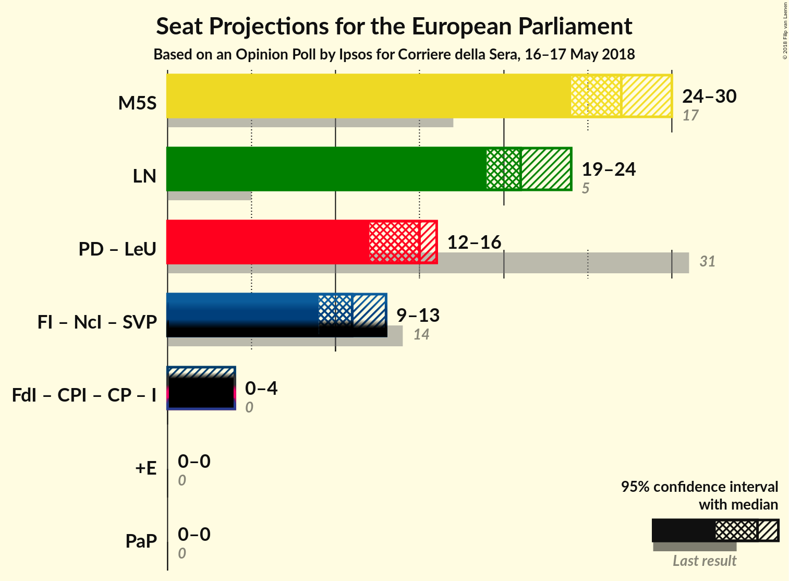

# Opinion Poll by Ipsos for Corriere della Sera, 16–17 May 2018

<a href="#voting-intentions">Voting Intentions</a> | <a href="#seats">Seats</a> | <a href="#coalitions">Coalitions</a> | <a href="#technical-information">Technical Information</a>

## Voting Intentions

### Confidence Intervals

| Party | Last Result | Poll Result | 80% Confidence Interval | 90% Confidence Interval | 95% Confidence Interval | 99% Confidence Interval |
|:-----:|:-----------:|:-----------:|:-----------------------:|:-----------------------:|:-----------------------:|:-----------------------:|
| Movimento 5 Stelle (EFDD) | 21.2% | 32.6% | 30.7–34.6% |30.2–35.1% |29.7–35.6% |28.9–36.5% |
| Lega Nord (ENF) | 6.2% | 25.4% | 23.7–27.3% |23.2–27.8% |22.8–28.2% |22.0–29.1% |
| Partito Democratico (S&D) | 40.8% | 18.1% | 16.6–19.8% |16.2–20.2% |15.8–20.6% |15.1–21.4% |
| Forza Italia (EPP) | 16.8% | 12.0% | 10.7–13.4% |10.4–13.9% |10.1–14.2% |9.6–14.9% |
| Fratelli d’Italia (*) | 3.7% | 3.4% | 2.7–4.3% |2.6–4.5% |2.4–4.8% |2.1–5.2% |
| Liberi e Uguali (S&D) | 0.0% | 2.4% | 1.9–3.2% |1.7–3.4% |1.6–3.6% |1.4–4.0% |
| Più Europa (ALDE) | 0.0% | 1.8% | 1.3–2.5% |1.2–2.7% |1.1–2.8% |1.0–3.2% |
| Noi con l’Italia (EPP) | 0.0% | 0.6% | 0.4–1.1% |0.3–1.2% |0.3–1.3% |0.2–1.6% |

*Note:* The poll result column reflects the actual value used in the calculations. Published results may vary slightly, and in addition be rounded to fewer digits.

## Seats

### Confidence Intervals

| Party | Last Result | Median | 80% Confidence Interval | 90% Confidence Interval | 95% Confidence Interval | 99% Confidence Interval |
|:-----:|:-----------:|:------:|:-----------------------:|:-----------------------:|:-----------------------:|:-----------------------:|
| <a href="#movimento-5-stelle-(efdd)">Movimento 5 Stelle (EFDD)</a> | 17 | N/A | N/A |N/A |N/A |N/A |
| <a href="#lega-nord-(enf)">Lega Nord (ENF)</a> | 5 | N/A | N/A |N/A |N/A |N/A |
| <a href="#partito-democratico-(s&d)">Partito Democratico (S&D)</a> | 31 | N/A | N/A |N/A |N/A |N/A |
| <a href="#forza-italia-(epp)">Forza Italia (EPP)</a> | 13 | N/A | N/A |N/A |N/A |N/A |
| <a href="#fratelli-d’italia-(*)">Fratelli d’Italia (*)</a> | 0 | N/A | N/A |N/A |N/A |N/A |
| <a href="#liberi-e-uguali-(s&d)">Liberi e Uguali (S&D)</a> | 0 | N/A | N/A |N/A |N/A |N/A |
| <a href="#più-europa-(alde)">Più Europa (ALDE)</a> | 0 | N/A | N/A |N/A |N/A |N/A |
| <a href="#noi-con-l’italia-(epp)">Noi con l’Italia (EPP)</a> | 0 | N/A | N/A |N/A |N/A |N/A |

## Coalitions

## Technical Information

### Opinion Poll

+ **Polling firm:** Ipsos
+ **Commissioner(s):** Corriere della Sera
+ **Fieldwork period:** 16–17 May 2018

### Calculations

+ **Sample size:** 1000
+ **Simulations done:** 0
+ **Error estimate:** 100.00%

