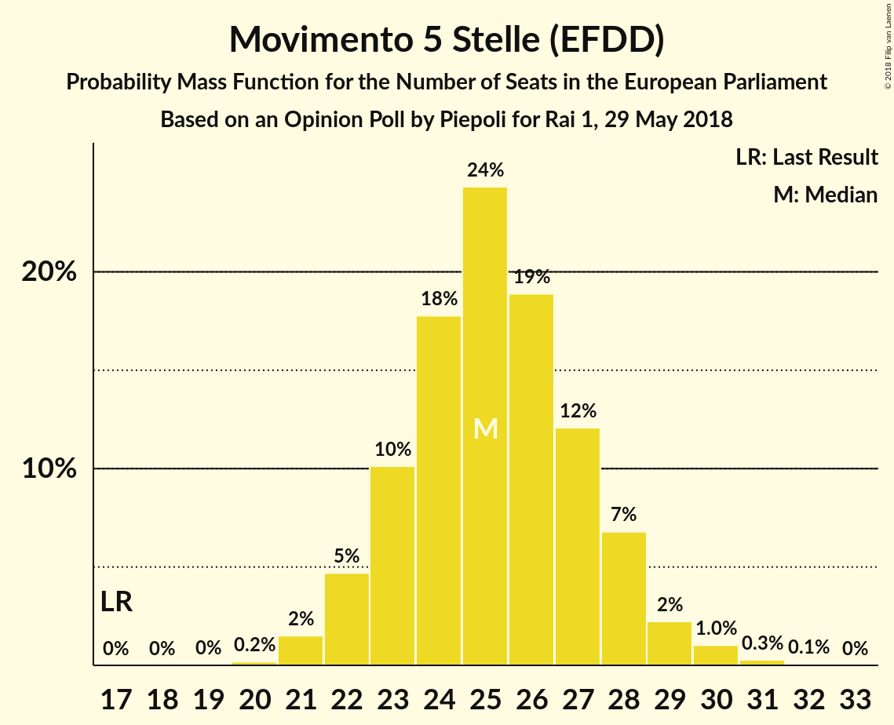
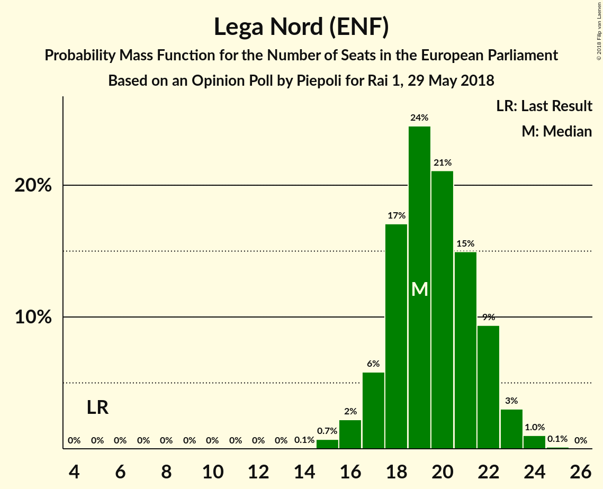
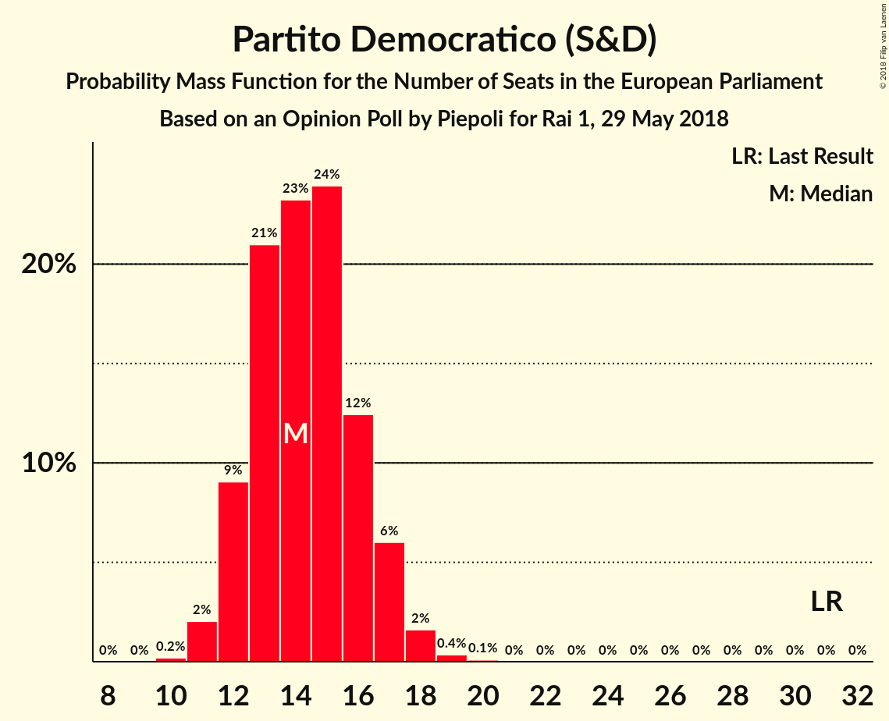
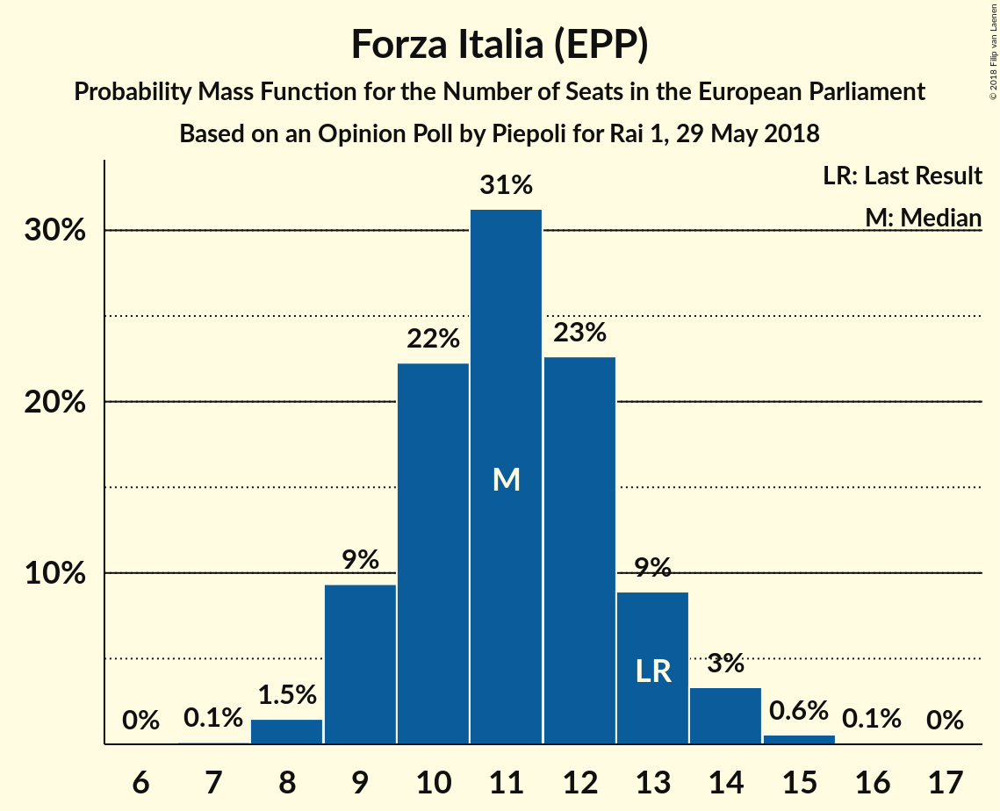
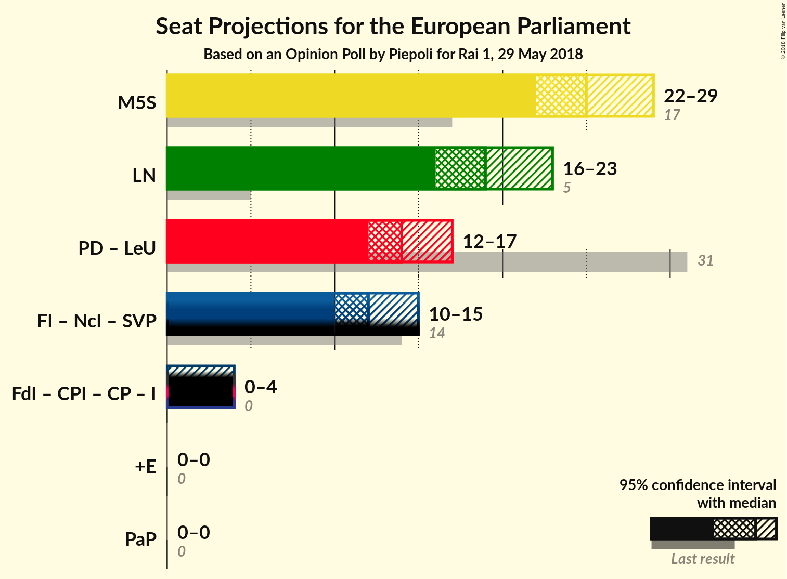

# Opinion Poll by Piepoli for Rai 1, 29 May 2018

<a href="#voting-intentions">Voting Intentions</a> | <a href="#seats">Seats</a> | <a href="#coalitions">Coalitions</a> | <a href="#technical-information">Technical Information</a>

## Voting Intentions

### Confidence Intervals

| Party | Last Result | Poll Result | 80% Confidence Interval | 90% Confidence Interval | 95% Confidence Interval | 99% Confidence Interval |
|:-----:|:-----------:|:-----------:|:-----------------------:|:-----------------------:|:-----------------------:|:-----------------------:|
| Movimento 5 Stelle (EFDD) | 21.2% | 31.5% | 28.9–34.2% |28.2–35.0% |27.6–35.7% |26.4–37.0% |
| Lega Nord (ENF) | 6.2% | 24.0% | 21.6–26.5% |21.0–27.3% |20.4–27.9% |19.4–29.1% |
| Partito Democratico (S&D) | 40.8% | 19.0% | 16.9–21.4% |16.3–22.1% |15.8–22.7% |14.9–23.9% |
| Forza Italia (EPP) | 16.8% | 13.5% | 11.7–15.6% |11.2–16.2% |10.8–16.7% |10.0–17.8% |
| Fratelli d’Italia (*) | 3.7% | 3.6% | 2.7–4.9% |2.5–5.2% |2.3–5.6% |1.9–6.3% |
| Liberi e Uguali (S&D) | 0.0% | 1.6% | 1.1–2.6% |0.9–2.8% |0.8–3.1% |0.6–3.6% |
| Più Europa (ALDE) | 0.0% | 1.6% | 1.1–2.6% |0.9–2.8% |0.8–3.1% |0.6–3.6% |
| Noi con l’Italia (EPP) | 0.0% | 0.6% | 0.3–1.3% |0.3–1.5% |0.2–1.7% |0.1–2.2% |

*Note:* The poll result column reflects the actual value used in the calculations. Published results may vary slightly, and in addition be rounded to fewer digits.

## Seats

### Confidence Intervals

| Party | Last Result | Median | 80% Confidence Interval | 90% Confidence Interval | 95% Confidence Interval | 99% Confidence Interval |
|:-----:|:-----------:|:------:|:-----------------------:|:-----------------------:|:-----------------------:|:-----------------------:|
| <a href="#movimento-5-stelle-(efdd)">Movimento 5 Stelle (EFDD)</a> | 17 | 25 | 23–27 |23–28 |22–28 |21–30 |
| <a href="#lega-nord-(enf)">Lega Nord (ENF)</a> | 5 | 19 | 18–22 |18–22 |17–23 |16–23 |
| <a href="#partito-democratico-(s&d)">Partito Democratico (S&D)</a> | 31 | 14 | 12–17 |12–17 |12–17 |11–18 |
| <a href="#forza-italia-(epp)">Forza Italia (EPP)</a> | 13 | 11 | 9–12 |9–13 |9–13 |8–14 |
| <a href="#fratelli-d’italia-(*)">Fratelli d’Italia (*)</a> | 0 | 3 | 0–4 |0–4 |0–4 |0–5 |
| <a href="#liberi-e-uguali-(s&d)">Liberi e Uguali (S&D)</a> | 0 | 0 | 0 |0 |0 |0 |
| <a href="#più-europa-(alde)">Più Europa (ALDE)</a> | 0 | 0 | 0 |0 |0 |0 |
| <a href="#noi-con-l’italia-(epp)">Noi con l’Italia (EPP)</a> | 0 | 0 | 0 |0 |0 |0 |

### Movimento 5 Stelle (EFDD)

*For a full overview of the results for this party, see the [Movimento 5 Stelle (EFDD)](party-movimento5stelleefdd.html) page.*

| Number of Seats | Probability | Accumulated | Special Marks |
|:---------------:|:-----------:|:-----------:|:-------------:|
| 17 | 0% | 100% | Last Result |
| 18 | 0% | 100% |  |
| 19 | 0% | 100% |  |
| 20 | 0.1% | 100% |  |
| 21 | 0.7% | 99.9% |  |
| 22 | 4% | 99.1% |  |
| 23 | 6% | 95% |  |
| 24 | 24% | 89% |  |
| 25 | 25% | 65% | Median |
| 26 | 24% | 40% |  |
| 27 | 12% | 17% |  |
| 28 | 3% | 5% |  |
| 29 | 2% | 2% |  |
| 30 | 0.5% | 0.7% |  |
| 31 | 0.2% | 0.2% |  |
| 32 | 0% | 0% |  |

### Lega Nord (ENF)

*For a full overview of the results for this party, see the [Lega Nord (ENF)](party-leganordenf.html) page.*

| Number of Seats | Probability | Accumulated | Special Marks |
|:---------------:|:-----------:|:-----------:|:-------------:|
| 5 | 0% | 100% | Last Result |
| 6 | 0% | 100% |  |
| 7 | 0% | 100% |  |
| 8 | 0% | 100% |  |
| 9 | 0% | 100% |  |
| 10 | 0% | 100% |  |
| 11 | 0% | 100% |  |
| 12 | 0% | 100% |  |
| 13 | 0% | 100% |  |
| 14 | 0% | 100% |  |
| 15 | 0.2% | 100% |  |
| 16 | 2% | 99.8% |  |
| 17 | 3% | 98% |  |
| 18 | 14% | 95% |  |
| 19 | 40% | 81% | Median |
| 20 | 12% | 41% |  |
| 21 | 18% | 29% |  |
| 22 | 8% | 11% |  |
| 23 | 3% | 3% |  |
| 24 | 0.3% | 0.4% |  |
| 25 | 0.1% | 0.1% |  |
| 26 | 0% | 0% |  |

### Partito Democratico (S&D)

*For a full overview of the results for this party, see the [Partito Democratico (S&D)](party-partitodemocraticosd.html) page.*

| Number of Seats | Probability | Accumulated | Special Marks |
|:---------------:|:-----------:|:-----------:|:-------------:|
| 10 | 0.1% | 100% |  |
| 11 | 2% | 99.9% |  |
| 12 | 11% | 98% |  |
| 13 | 27% | 87% |  |
| 14 | 21% | 60% | Median |
| 15 | 22% | 39% |  |
| 16 | 6% | 17% |  |
| 17 | 10% | 11% |  |
| 18 | 1.4% | 2% |  |
| 19 | 0.1% | 0.2% |  |
| 20 | 0% | 0% |  |
| 21 | 0% | 0% |  |
| 22 | 0% | 0% |  |
| 23 | 0% | 0% |  |
| 24 | 0% | 0% |  |
| 25 | 0% | 0% |  |
| 26 | 0% | 0% |  |
| 27 | 0% | 0% |  |
| 28 | 0% | 0% |  |
| 29 | 0% | 0% |  |
| 30 | 0% | 0% |  |
| 31 | 0% | 0% | Last Result |

### Forza Italia (EPP)

*For a full overview of the results for this party, see the [Forza Italia (EPP)](party-forzaitaliaepp.html) page.*

| Number of Seats | Probability | Accumulated | Special Marks |
|:---------------:|:-----------:|:-----------:|:-------------:|
| 7 | 0.1% | 100% |  |
| 8 | 0.6% | 99.9% |  |
| 9 | 13% | 99.3% |  |
| 10 | 22% | 86% |  |
| 11 | 37% | 64% | Median |
| 12 | 21% | 27% |  |
| 13 | 5% | 6% | Last Result |
| 14 | 0.7% | 1.0% |  |
| 15 | 0.3% | 0.3% |  |
| 16 | 0% | 0% |  |

### Fratelli d’Italia (*)

*For a full overview of the results for this party, see the [Fratelli d’Italia (*)](party-fratellid’italia.html) page.*

| Number of Seats | Probability | Accumulated | Special Marks |
|:---------------:|:-----------:|:-----------:|:-------------:|
| 0 | 45% | 100% | Last Result |
| 1 | 0% | 55% |  |
| 2 | 0% | 55% |  |
| 3 | 40% | 55% | Median |
| 4 | 14% | 15% |  |
| 5 | 0.9% | 0.9% |  |
| 6 | 0.1% | 0.1% |  |
| 7 | 0% | 0% |  |

### Liberi e Uguali (S&D)

*For a full overview of the results for this party, see the [Liberi e Uguali (S&D)](party-liberieugualisd.html) page.*

| Number of Seats | Probability | Accumulated | Special Marks |
|:---------------:|:-----------:|:-----------:|:-------------:|
| 0 | 99.9% | 100% | Last Result, Median |
| 1 | 0% | 0.1% |  |
| 2 | 0% | 0.1% |  |
| 3 | 0% | 0.1% |  |
| 4 | 0% | 0% |  |

### Più Europa (ALDE)

*For a full overview of the results for this party, see the [Più Europa (ALDE)](party-piùeuropaalde.html) page.*

| Number of Seats | Probability | Accumulated | Special Marks |
|:---------------:|:-----------:|:-----------:|:-------------:|
| 0 | 99.9% | 100% | Last Result, Median |
| 1 | 0% | 0.1% |  |
| 2 | 0% | 0.1% |  |
| 3 | 0% | 0.1% |  |
| 4 | 0% | 0% |  |

### Noi con l’Italia (EPP)

*For a full overview of the results for this party, see the [Noi con l’Italia (EPP)](party-noiconl’italiaepp.html) page.*

| Number of Seats | Probability | Accumulated | Special Marks |
|:---------------:|:-----------:|:-----------:|:-------------:|
| 0 | 100% | 100% | Last Result, Median |

## Coalitions

### Confidence Intervals

| Coalition | Last Result | Median | Majority? | 80% Confidence Interval | 90% Confidence Interval | 95% Confidence Interval | 99% Confidence Interval |
|:---------:|:-----------:|:------:|:---------:|:-----------------------:|:-----------------------:|:-----------------------:|:-----------------------:|
| Movimento 5 Stelle (EFDD) | 17 | 25 | 0% | 23–27 | 23–28 | 22–28 | 21–30 |
| Lega Nord (ENF) | 5 | 19 | 0% | 18–22 | 18–22 | 17–23 | 16–23 |
| Partito Democratico (S&D) – Liberi e Uguali (S&D) | 31 | 14 | 0% | 12–17 | 12–17 | 12–17 | 11–18 |
| Più Europa (ALDE) | 0 | 0 | 0% | 0 | 0 | 0 | 0 |

### Movimento 5 Stelle (EFDD)

| Number of Seats | Probability | Accumulated | Special Marks |
|:---------------:|:-----------:|:-----------:|:-------------:|
| 17 | 0% | 100% | Last Result |
| 18 | 0% | 100% |  |
| 19 | 0% | 100% |  |
| 20 | 0.1% | 100% |  |
| 21 | 0.7% | 99.9% |  |
| 22 | 4% | 99.1% |  |
| 23 | 6% | 95% |  |
| 24 | 24% | 89% |  |
| 25 | 25% | 65% | Median |
| 26 | 24% | 40% |  |
| 27 | 12% | 17% |  |
| 28 | 3% | 5% |  |
| 29 | 2% | 2% |  |
| 30 | 0.5% | 0.7% |  |
| 31 | 0.2% | 0.2% |  |
| 32 | 0% | 0% |  |

### Lega Nord (ENF)

| Number of Seats | Probability | Accumulated | Special Marks |
|:---------------:|:-----------:|:-----------:|:-------------:|
| 5 | 0% | 100% | Last Result |
| 6 | 0% | 100% |  |
| 7 | 0% | 100% |  |
| 8 | 0% | 100% |  |
| 9 | 0% | 100% |  |
| 10 | 0% | 100% |  |
| 11 | 0% | 100% |  |
| 12 | 0% | 100% |  |
| 13 | 0% | 100% |  |
| 14 | 0% | 100% |  |
| 15 | 0.2% | 100% |  |
| 16 | 2% | 99.8% |  |
| 17 | 3% | 98% |  |
| 18 | 14% | 95% |  |
| 19 | 40% | 81% | Median |
| 20 | 12% | 41% |  |
| 21 | 18% | 29% |  |
| 22 | 8% | 11% |  |
| 23 | 3% | 3% |  |
| 24 | 0.3% | 0.4% |  |
| 25 | 0.1% | 0.1% |  |
| 26 | 0% | 0% |  |

### Partito Democratico (S&D) – Liberi e Uguali (S&D)

| Number of Seats | Probability | Accumulated | Special Marks |
|:---------------:|:-----------:|:-----------:|:-------------:|
| 10 | 0.1% | 100% |  |
| 11 | 2% | 99.9% |  |
| 12 | 11% | 98% |  |
| 13 | 27% | 87% |  |
| 14 | 21% | 60% | Median |
| 15 | 22% | 39% |  |
| 16 | 6% | 17% |  |
| 17 | 10% | 11% |  |
| 18 | 1.4% | 2% |  |
| 19 | 0.1% | 0.2% |  |
| 20 | 0% | 0.1% |  |
| 21 | 0% | 0% |  |
| 22 | 0% | 0% |  |
| 23 | 0% | 0% |  |
| 24 | 0% | 0% |  |
| 25 | 0% | 0% |  |
| 26 | 0% | 0% |  |
| 27 | 0% | 0% |  |
| 28 | 0% | 0% |  |
| 29 | 0% | 0% |  |
| 30 | 0% | 0% |  |
| 31 | 0% | 0% | Last Result |

### Più Europa (ALDE)

| Number of Seats | Probability | Accumulated | Special Marks |
|:---------------:|:-----------:|:-----------:|:-------------:|
| 0 | 99.9% | 100% | Last Result, Median |
| 1 | 0% | 0.1% |  |
| 2 | 0% | 0.1% |  |
| 3 | 0% | 0.1% |  |
| 4 | 0% | 0% |  |

## Technical Information

### Opinion Poll

+ **Polling firm:** Piepoli
+ **Commissioner(s):** Rai 1
+ **Fieldwork period:** 29 May 2018

### Calculations

+ **Sample size:** 505
+ **Simulations done:** 131,072
+ **Error estimate:** 1.66%

