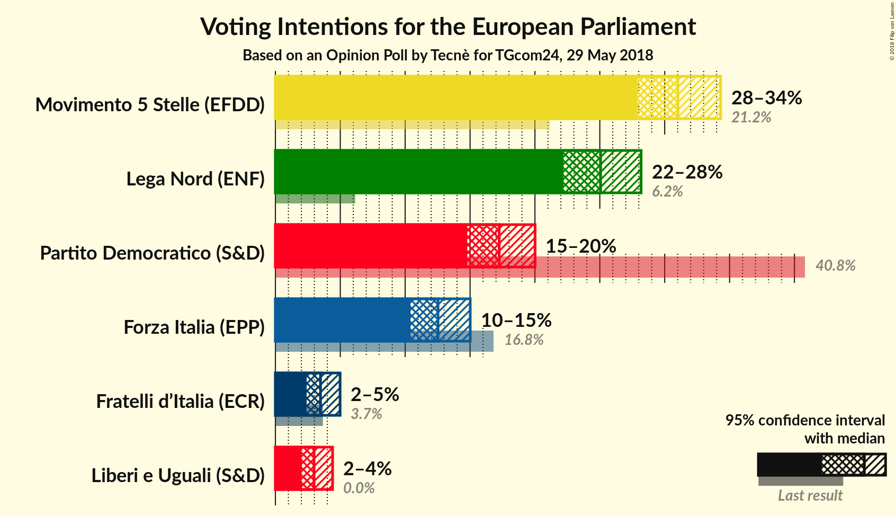

# Opinion Poll by Tecnè for TGcom24, 29 May 2018

<a href="#voting-intentions">Voting Intentions</a> | <a href="#seats">Seats</a> | <a href="#coalitions">Coalitions</a> | <a href="#technical-information">Technical Information</a>

## Voting Intentions

### Confidence Intervals

| Party | Last Result | Poll Result | 80% Confidence Interval | 90% Confidence Interval | 95% Confidence Interval | 99% Confidence Interval |
|:-----:|:-----------:|:-----------:|:-----------------------:|:-----------------------:|:-----------------------:|:-----------------------:|
| Movimento 5 Stelle (EFDD) | 21.2% | 31.0% | 29.0–33.2% |28.4–33.8% |27.9–34.3% |27.0–35.3% |
| Lega Nord (ENF) | 6.2% | 25.1% | 23.2–27.1% |22.6–27.7% |22.2–28.2% |21.3–29.2% |
| Partito Democratico (S&D) | 40.8% | 17.2% | 15.6–19.1% |15.2–19.6% |14.8–20.0% |14.1–20.9% |
| Forza Italia (EPP) | 16.8% | 12.5% | 11.1–14.1% |10.7–14.6% |10.4–15.0% |9.8–15.8% |
| Fratelli d’Italia (*) | 3.7% | 3.5% | 2.8–4.5% |2.6–4.7% |2.4–5.0% |2.1–5.5% |
| Liberi e Uguali (S&D) | 0.0% | 3.0% | 2.3–3.9% |2.1–4.2% |2.0–4.4% |1.7–4.9% |

*Note:* The poll result column reflects the actual value used in the calculations. Published results may vary slightly, and in addition be rounded to fewer digits.

## Seats

### Confidence Intervals

| Party | Last Result | Median | 80% Confidence Interval | 90% Confidence Interval | 95% Confidence Interval | 99% Confidence Interval |
|:-----:|:-----------:|:------:|:-----------------------:|:-----------------------:|:-----------------------:|:-----------------------:|
| <a href="#movimento-5-stelle-(efdd)">Movimento 5 Stelle (EFDD)</a> | 17 | 25 | 23–27 |22–27 |22–28 |21–28 |
| <a href="#lega-nord-(enf)">Lega Nord (ENF)</a> | 5 | 20 | 18–22 |18–22 |18–23 |17–23 |
| <a href="#partito-democratico-(s&d)">Partito Democratico (S&D)</a> | 31 | 13 | 11–14 |11–15 |11–15 |10–16 |
| <a href="#forza-italia-(epp)">Forza Italia (EPP)</a> | 13 | 10 | 9–11 |8–12 |8–12 |8–12 |
| <a href="#fratelli-d’italia-(*)">Fratelli d’Italia (*)</a> | 0 | 0 | 0–4 |0–4 |0–4 |0–4 |
| <a href="#liberi-e-uguali-(s&d)">Liberi e Uguali (S&D)</a> | 0 | 0 | 0 |0 |0–3 |0–4 |

### Movimento 5 Stelle (EFDD)

*For a full overview of the results for this party, see the [Movimento 5 Stelle (EFDD)](party-movimento5stelleefdd.html) page.*

| Number of Seats | Probability | Accumulated | Special Marks |
|:---------------:|:-----------:|:-----------:|:-------------:|
| 17 | 0% | 100% | Last Result |
| 18 | 0% | 100% |  |
| 19 | 0% | 100% |  |
| 20 | 0.1% | 100% |  |
| 21 | 0.8% | 99.9% |  |
| 22 | 4% | 99.1% |  |
| 23 | 13% | 95% |  |
| 24 | 26% | 82% |  |
| 25 | 22% | 56% | Median |
| 26 | 18% | 34% |  |
| 27 | 13% | 16% |  |
| 28 | 3% | 3% |  |
| 29 | 0.2% | 0.2% |  |
| 30 | 0% | 0% |  |

### Lega Nord (ENF)

*For a full overview of the results for this party, see the [Lega Nord (ENF)](party-leganordenf.html) page.*

| Number of Seats | Probability | Accumulated | Special Marks |
|:---------------:|:-----------:|:-----------:|:-------------:|
| 5 | 0% | 100% | Last Result |
| 6 | 0% | 100% |  |
| 7 | 0% | 100% |  |
| 8 | 0% | 100% |  |
| 9 | 0% | 100% |  |
| 10 | 0% | 100% |  |
| 11 | 0% | 100% |  |
| 12 | 0% | 100% |  |
| 13 | 0% | 100% |  |
| 14 | 0% | 100% |  |
| 15 | 0% | 100% |  |
| 16 | 0.3% | 100% |  |
| 17 | 2% | 99.7% |  |
| 18 | 10% | 98% |  |
| 19 | 21% | 88% |  |
| 20 | 32% | 67% | Median |
| 21 | 23% | 34% |  |
| 22 | 9% | 11% |  |
| 23 | 2% | 3% |  |
| 24 | 0.4% | 0.5% |  |
| 25 | 0% | 0% |  |

### Partito Democratico (S&D)

*For a full overview of the results for this party, see the [Partito Democratico (S&D)](party-partitodemocraticosd.html) page.*

| Number of Seats | Probability | Accumulated | Special Marks |
|:---------------:|:-----------:|:-----------:|:-------------:|
| 9 | 0.1% | 100% |  |
| 10 | 2% | 99.9% |  |
| 11 | 13% | 98% |  |
| 12 | 28% | 86% |  |
| 13 | 32% | 58% | Median |
| 14 | 17% | 26% |  |
| 15 | 8% | 9% |  |
| 16 | 1.1% | 1.2% |  |
| 17 | 0.1% | 0.1% |  |
| 18 | 0% | 0% |  |
| 19 | 0% | 0% |  |
| 20 | 0% | 0% |  |
| 21 | 0% | 0% |  |
| 22 | 0% | 0% |  |
| 23 | 0% | 0% |  |
| 24 | 0% | 0% |  |
| 25 | 0% | 0% |  |
| 26 | 0% | 0% |  |
| 27 | 0% | 0% |  |
| 28 | 0% | 0% |  |
| 29 | 0% | 0% |  |
| 30 | 0% | 0% |  |
| 31 | 0% | 0% | Last Result |

### Forza Italia (EPP)

*For a full overview of the results for this party, see the [Forza Italia (EPP)](party-forzaitaliaepp.html) page.*

| Number of Seats | Probability | Accumulated | Special Marks |
|:---------------:|:-----------:|:-----------:|:-------------:|
| 7 | 0.2% | 100% |  |
| 8 | 5% | 99.8% |  |
| 9 | 23% | 95% |  |
| 10 | 38% | 72% | Median |
| 11 | 25% | 35% |  |
| 12 | 9% | 9% |  |
| 13 | 0.4% | 0.5% | Last Result |
| 14 | 0% | 0% |  |

### Fratelli d’Italia (*)

*For a full overview of the results for this party, see the [Fratelli d’Italia (*)](party-fratellid’italia.html) page.*

| Number of Seats | Probability | Accumulated | Special Marks |
|:---------------:|:-----------:|:-----------:|:-------------:|
| 0 | 74% | 100% | Last Result, Median |
| 1 | 0% | 26% |  |
| 2 | 0% | 26% |  |
| 3 | 16% | 26% |  |
| 4 | 10% | 10% |  |
| 5 | 0.2% | 0.2% |  |
| 6 | 0% | 0% |  |

### Liberi e Uguali (S&D)

*For a full overview of the results for this party, see the [Liberi e Uguali (S&D)](party-liberieugualisd.html) page.*

| Number of Seats | Probability | Accumulated | Special Marks |
|:---------------:|:-----------:|:-----------:|:-------------:|
| 0 | 96% | 100% | Last Result, Median |
| 1 | 0% | 4% |  |
| 2 | 0% | 4% |  |
| 3 | 3% | 4% |  |
| 4 | 2% | 2% |  |
| 5 | 0% | 0% |  |

## Coalitions

### Confidence Intervals

| Coalition | Last Result | Median | Majority? | 80% Confidence Interval | 90% Confidence Interval | 95% Confidence Interval | 99% Confidence Interval |
|:---------:|:-----------:|:------:|:---------:|:-----------------------:|:-----------------------:|:-----------------------:|:-----------------------:|
| Movimento 5 Stelle (EFDD) | 17 | 25 | 0% | 23–27 | 22–27 | 22–28 | 21–28 |
| Lega Nord (ENF) | 5 | 20 | 0% | 18–22 | 18–22 | 18–23 | 17–23 |
| Partito Democratico (S&D) – Liberi e Uguali (S&D) | 31 | 13 | 0% | 11–15 | 11–15 | 11–16 | 10–17 |

### Movimento 5 Stelle (EFDD)

| Number of Seats | Probability | Accumulated | Special Marks |
|:---------------:|:-----------:|:-----------:|:-------------:|
| 17 | 0% | 100% | Last Result |
| 18 | 0% | 100% |  |
| 19 | 0% | 100% |  |
| 20 | 0.1% | 100% |  |
| 21 | 0.8% | 99.9% |  |
| 22 | 4% | 99.1% |  |
| 23 | 13% | 95% |  |
| 24 | 26% | 82% |  |
| 25 | 22% | 56% | Median |
| 26 | 18% | 34% |  |
| 27 | 13% | 16% |  |
| 28 | 3% | 3% |  |
| 29 | 0.2% | 0.2% |  |
| 30 | 0% | 0% |  |

### Lega Nord (ENF)

| Number of Seats | Probability | Accumulated | Special Marks |
|:---------------:|:-----------:|:-----------:|:-------------:|
| 5 | 0% | 100% | Last Result |
| 6 | 0% | 100% |  |
| 7 | 0% | 100% |  |
| 8 | 0% | 100% |  |
| 9 | 0% | 100% |  |
| 10 | 0% | 100% |  |
| 11 | 0% | 100% |  |
| 12 | 0% | 100% |  |
| 13 | 0% | 100% |  |
| 14 | 0% | 100% |  |
| 15 | 0% | 100% |  |
| 16 | 0.3% | 100% |  |
| 17 | 2% | 99.7% |  |
| 18 | 10% | 98% |  |
| 19 | 21% | 88% |  |
| 20 | 32% | 67% | Median |
| 21 | 23% | 34% |  |
| 22 | 9% | 11% |  |
| 23 | 2% | 3% |  |
| 24 | 0.4% | 0.5% |  |
| 25 | 0% | 0% |  |

### Partito Democratico (S&D) – Liberi e Uguali (S&D)

| Number of Seats | Probability | Accumulated | Special Marks |
|:---------------:|:-----------:|:-----------:|:-------------:|
| 9 | 0.1% | 100% |  |
| 10 | 1.4% | 99.9% |  |
| 11 | 12% | 98.6% |  |
| 12 | 26% | 87% |  |
| 13 | 30% | 60% | Median |
| 14 | 17% | 30% |  |
| 15 | 9% | 13% |  |
| 16 | 3% | 4% |  |
| 17 | 0.7% | 1.0% |  |
| 18 | 0.2% | 0.3% |  |
| 19 | 0% | 0% |  |
| 20 | 0% | 0% |  |
| 21 | 0% | 0% |  |
| 22 | 0% | 0% |  |
| 23 | 0% | 0% |  |
| 24 | 0% | 0% |  |
| 25 | 0% | 0% |  |
| 26 | 0% | 0% |  |
| 27 | 0% | 0% |  |
| 28 | 0% | 0% |  |
| 29 | 0% | 0% |  |
| 30 | 0% | 0% |  |
| 31 | 0% | 0% | Last Result |

## Technical Information

### Opinion Poll

+ **Polling firm:** Tecnè
+ **Commissioner(s):** TGcom24
+ **Fieldwork period:** 29 May 2018

### Calculations

+ **Sample size:** 806
+ **Simulations done:** 131,072
+ **Error estimate:** 1.69%

