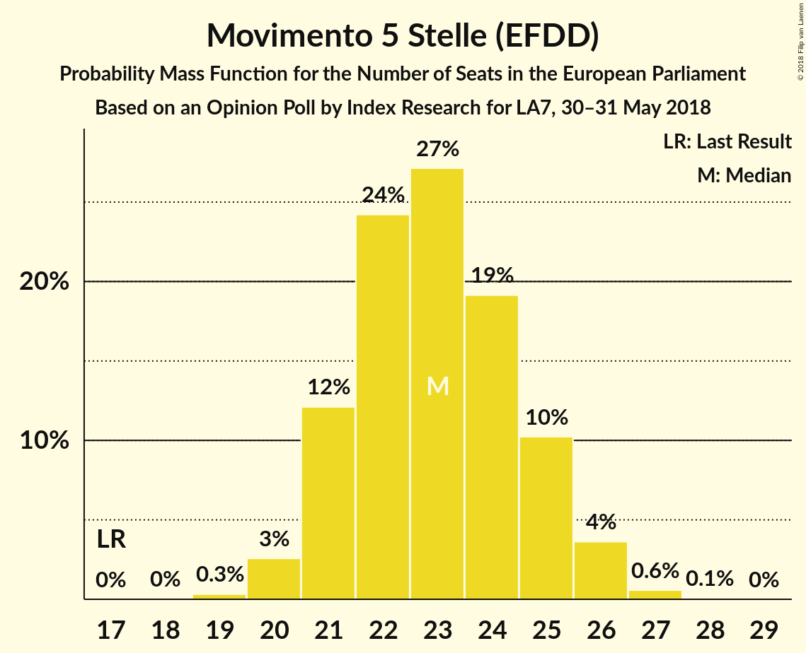
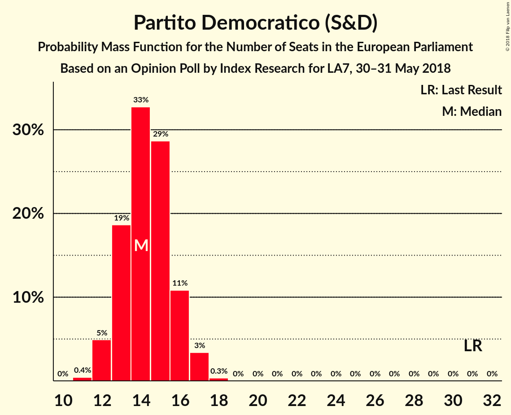
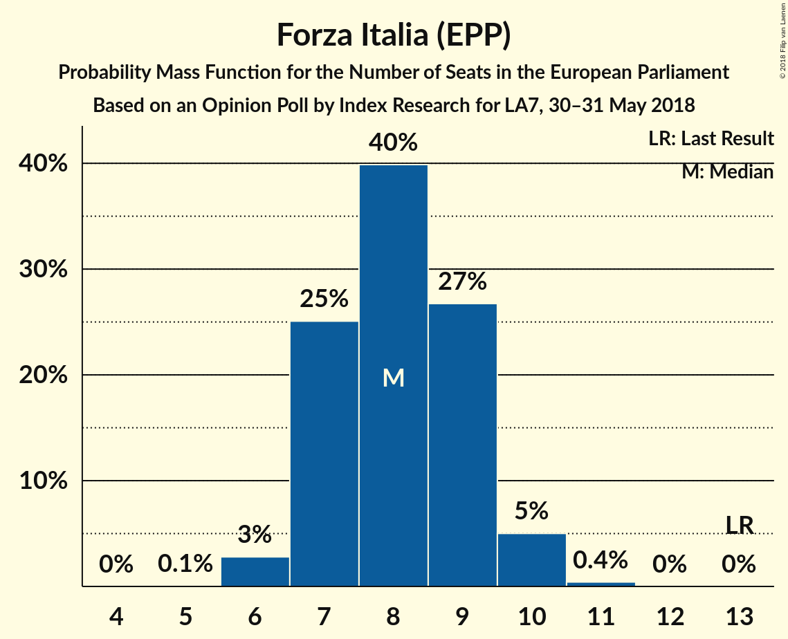

# Opinion Poll by Index Research for LA7, 30–31 May 2018

<a href="#voting-intentions">Voting Intentions</a> | <a href="#seats">Seats</a> | <a href="#coalitions">Coalitions</a> | <a href="#technical-information">Technical Information</a>

## Voting Intentions

### Confidence Intervals

| Party | Last Result | Poll Result | 80% Confidence Interval | 90% Confidence Interval | 95% Confidence Interval | 99% Confidence Interval |
|:-----:|:-----------:|:-----------:|:-----------------------:|:-----------------------:|:-----------------------:|:-----------------------:|
| Movimento 5 Stelle (EFDD) | 21.2% | 29.0% | 27.0–31.1% |26.4–31.7% |26.0–32.3% |25.0–33.3% |
| Lega Nord (ENF) | 6.2% | 26.5% | 24.6–28.6% |24.0–29.2% |23.5–29.7% |22.6–30.7% |
| Partito Democratico (S&D) | 40.8% | 19.2% | 17.5–21.1% |17.1–21.7% |16.7–22.1% |15.9–23.1% |
| Forza Italia (EPP) | 16.8% | 10.1% | 8.9–11.6% |8.5–12.0% |8.2–12.4% |7.7–13.2% |
| Fratelli d’Italia (*) | 3.7% | 3.5% | 2.8–4.5% |2.6–4.8% |2.4–5.0% |2.1–5.5% |
| Liberi e Uguali (S&D) | 0.0% | 1.9% | 1.4–2.7% |1.2–2.9% |1.1–3.1% |0.9–3.5% |
| Noi con l’Italia (EPP) | 0.0% | 0.2% | 0.1–0.7% |0.1–0.8% |0.1–0.9% |0.0–1.2% |

*Note:* The poll result column reflects the actual value used in the calculations. Published results may vary slightly, and in addition be rounded to fewer digits.

## Seats

### Confidence Intervals

| Party | Last Result | Median | 80% Confidence Interval | 90% Confidence Interval | 95% Confidence Interval | 99% Confidence Interval |
|:-----:|:-----------:|:------:|:-----------------------:|:-----------------------:|:-----------------------:|:-----------------------:|
| <a href="#movimento-5-stelle-(efdd)">Movimento 5 Stelle (EFDD)</a> | 17 | 23 | 21–25 |21–25 |21–26 |20–26 |
| <a href="#lega-nord-(enf)">Lega Nord (ENF)</a> | 5 | 21 | 19–23 |19–23 |19–24 |18–24 |
| <a href="#partito-democratico-(s&d)">Partito Democratico (S&D)</a> | 31 | 14 | 13–16 |12–16 |12–17 |12–17 |
| <a href="#forza-italia-(epp)">Forza Italia (EPP)</a> | 13 | 8 | 7–9 |7–9 |6–10 |6–10 |
| <a href="#fratelli-d’italia-(*)">Fratelli d’Italia (*)</a> | 0 | 0 | 0–3 |0–4 |0–4 |0–4 |
| <a href="#liberi-e-uguali-(s&d)">Liberi e Uguali (S&D)</a> | 0 | 0 | 0 |0 |0 |0 |
| <a href="#noi-con-l’italia-(epp)">Noi con l’Italia (EPP)</a> | 0 | 0 | 0 |0 |0 |0 |

### Movimento 5 Stelle (EFDD)

*For a full overview of the results for this party, see the [Movimento 5 Stelle (EFDD)](party-movimento5stelleefdd.html) page.*

| Number of Seats | Probability | Accumulated | Special Marks |
|:---------------:|:-----------:|:-----------:|:-------------:|
| 17 | 0% | 100% | Last Result |
| 18 | 0% | 100% |  |
| 19 | 0.3% | 100% |  |
| 20 | 2% | 99.7% |  |
| 21 | 9% | 98% |  |
| 22 | 24% | 88% |  |
| 23 | 35% | 64% | Median |
| 24 | 17% | 29% |  |
| 25 | 9% | 12% |  |
| 26 | 2% | 3% |  |
| 27 | 0.3% | 0.3% |  |
| 28 | 0% | 0% |  |

### Lega Nord (ENF)

*For a full overview of the results for this party, see the [Lega Nord (ENF)](party-leganordenf.html) page.*

| Number of Seats | Probability | Accumulated | Special Marks |
|:---------------:|:-----------:|:-----------:|:-------------:|
| 5 | 0% | 100% | Last Result |
| 6 | 0% | 100% |  |
| 7 | 0% | 100% |  |
| 8 | 0% | 100% |  |
| 9 | 0% | 100% |  |
| 10 | 0% | 100% |  |
| 11 | 0% | 100% |  |
| 12 | 0% | 100% |  |
| 13 | 0% | 100% |  |
| 14 | 0% | 100% |  |
| 15 | 0% | 100% |  |
| 16 | 0% | 100% |  |
| 17 | 0.2% | 100% |  |
| 18 | 2% | 99.8% |  |
| 19 | 10% | 98% |  |
| 20 | 30% | 88% |  |
| 21 | 24% | 58% | Median |
| 22 | 18% | 34% |  |
| 23 | 13% | 16% |  |
| 24 | 2% | 3% |  |
| 25 | 0.4% | 0.4% |  |
| 26 | 0% | 0% |  |

### Partito Democratico (S&D)

*For a full overview of the results for this party, see the [Partito Democratico (S&D)](party-partitodemocraticosd.html) page.*

| Number of Seats | Probability | Accumulated | Special Marks |
|:---------------:|:-----------:|:-----------:|:-------------:|
| 11 | 0.2% | 100% |  |
| 12 | 6% | 99.8% |  |
| 13 | 10% | 94% |  |
| 14 | 40% | 84% | Median |
| 15 | 27% | 43% |  |
| 16 | 12% | 16% |  |
| 17 | 4% | 4% |  |
| 18 | 0.3% | 0.3% |  |
| 19 | 0% | 0% |  |
| 20 | 0% | 0% |  |
| 21 | 0% | 0% |  |
| 22 | 0% | 0% |  |
| 23 | 0% | 0% |  |
| 24 | 0% | 0% |  |
| 25 | 0% | 0% |  |
| 26 | 0% | 0% |  |
| 27 | 0% | 0% |  |
| 28 | 0% | 0% |  |
| 29 | 0% | 0% |  |
| 30 | 0% | 0% |  |
| 31 | 0% | 0% | Last Result |

### Forza Italia (EPP)

*For a full overview of the results for this party, see the [Forza Italia (EPP)](party-forzaitaliaepp.html) page.*

| Number of Seats | Probability | Accumulated | Special Marks |
|:---------------:|:-----------:|:-----------:|:-------------:|
| 6 | 3% | 100% |  |
| 7 | 33% | 97% |  |
| 8 | 31% | 64% | Median |
| 9 | 29% | 33% |  |
| 10 | 3% | 3% |  |
| 11 | 0.2% | 0.3% |  |
| 12 | 0% | 0% |  |
| 13 | 0% | 0% | Last Result |

### Fratelli d’Italia (*)

*For a full overview of the results for this party, see the [Fratelli d’Italia (*)](party-fratellid’italia.html) page.*

| Number of Seats | Probability | Accumulated | Special Marks |
|:---------------:|:-----------:|:-----------:|:-------------:|
| 0 | 68% | 100% | Last Result, Median |
| 1 | 0% | 32% |  |
| 2 | 0% | 32% |  |
| 3 | 23% | 32% |  |
| 4 | 8% | 8% |  |
| 5 | 0.2% | 0.2% |  |
| 6 | 0% | 0% |  |

### Liberi e Uguali (S&D)

*For a full overview of the results for this party, see the [Liberi e Uguali (S&D)](party-liberieugualisd.html) page.*

| Number of Seats | Probability | Accumulated | Special Marks |
|:---------------:|:-----------:|:-----------:|:-------------:|
| 0 | 99.9% | 100% | Last Result, Median |
| 1 | 0% | 0.1% |  |
| 2 | 0% | 0.1% |  |
| 3 | 0% | 0.1% |  |
| 4 | 0% | 0% |  |

### Noi con l’Italia (EPP)

*For a full overview of the results for this party, see the [Noi con l’Italia (EPP)](party-noiconl’italiaepp.html) page.*

| Number of Seats | Probability | Accumulated | Special Marks |
|:---------------:|:-----------:|:-----------:|:-------------:|
| 0 | 100% | 100% | Last Result, Median |

## Coalitions

### Confidence Intervals

| Coalition | Last Result | Median | Majority? | 80% Confidence Interval | 90% Confidence Interval | 95% Confidence Interval | 99% Confidence Interval |
|:---------:|:-----------:|:------:|:---------:|:-----------------------:|:-----------------------:|:-----------------------:|:-----------------------:|
| Movimento 5 Stelle (EFDD) | 17 | 23 | 0% | 21–25 | 21–25 | 21–26 | 20–26 |
| Lega Nord (ENF) | 5 | 21 | 0% | 19–23 | 19–23 | 19–24 | 18–24 |
| Partito Democratico (S&D) – Liberi e Uguali (S&D) | 31 | 14 | 0% | 13–16 | 12–16 | 12–17 | 12–17 |

### Movimento 5 Stelle (EFDD)

| Number of Seats | Probability | Accumulated | Special Marks |
|:---------------:|:-----------:|:-----------:|:-------------:|
| 17 | 0% | 100% | Last Result |
| 18 | 0% | 100% |  |
| 19 | 0.3% | 100% |  |
| 20 | 2% | 99.7% |  |
| 21 | 9% | 98% |  |
| 22 | 24% | 88% |  |
| 23 | 35% | 64% | Median |
| 24 | 17% | 29% |  |
| 25 | 9% | 12% |  |
| 26 | 2% | 3% |  |
| 27 | 0.3% | 0.3% |  |
| 28 | 0% | 0% |  |

### Lega Nord (ENF)

| Number of Seats | Probability | Accumulated | Special Marks |
|:---------------:|:-----------:|:-----------:|:-------------:|
| 5 | 0% | 100% | Last Result |
| 6 | 0% | 100% |  |
| 7 | 0% | 100% |  |
| 8 | 0% | 100% |  |
| 9 | 0% | 100% |  |
| 10 | 0% | 100% |  |
| 11 | 0% | 100% |  |
| 12 | 0% | 100% |  |
| 13 | 0% | 100% |  |
| 14 | 0% | 100% |  |
| 15 | 0% | 100% |  |
| 16 | 0% | 100% |  |
| 17 | 0.2% | 100% |  |
| 18 | 2% | 99.8% |  |
| 19 | 10% | 98% |  |
| 20 | 30% | 88% |  |
| 21 | 24% | 58% | Median |
| 22 | 18% | 34% |  |
| 23 | 13% | 16% |  |
| 24 | 2% | 3% |  |
| 25 | 0.4% | 0.4% |  |
| 26 | 0% | 0% |  |

### Partito Democratico (S&D) – Liberi e Uguali (S&D)

| Number of Seats | Probability | Accumulated | Special Marks |
|:---------------:|:-----------:|:-----------:|:-------------:|
| 11 | 0.2% | 100% |  |
| 12 | 6% | 99.8% |  |
| 13 | 10% | 94% |  |
| 14 | 40% | 84% | Median |
| 15 | 27% | 43% |  |
| 16 | 12% | 16% |  |
| 17 | 4% | 4% |  |
| 18 | 0.3% | 0.3% |  |
| 19 | 0% | 0% |  |
| 20 | 0% | 0% |  |
| 21 | 0% | 0% |  |
| 22 | 0% | 0% |  |
| 23 | 0% | 0% |  |
| 24 | 0% | 0% |  |
| 25 | 0% | 0% |  |
| 26 | 0% | 0% |  |
| 27 | 0% | 0% |  |
| 28 | 0% | 0% |  |
| 29 | 0% | 0% |  |
| 30 | 0% | 0% |  |
| 31 | 0% | 0% | Last Result |

## Technical Information

### Opinion Poll

+ **Polling firm:** Index Research
+ **Commissioner(s):** LA7
+ **Fieldwork period:** 30–31 May 2018

### Calculations

+ **Sample size:** 800
+ **Simulations done:** 131,072
+ **Error estimate:** 1.57%

