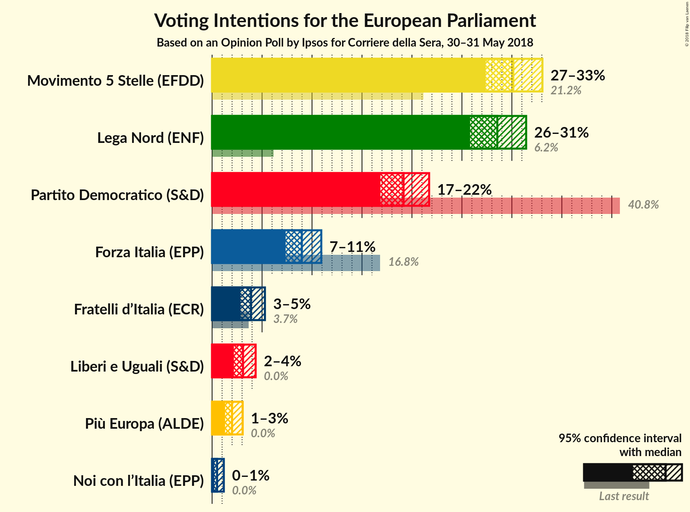
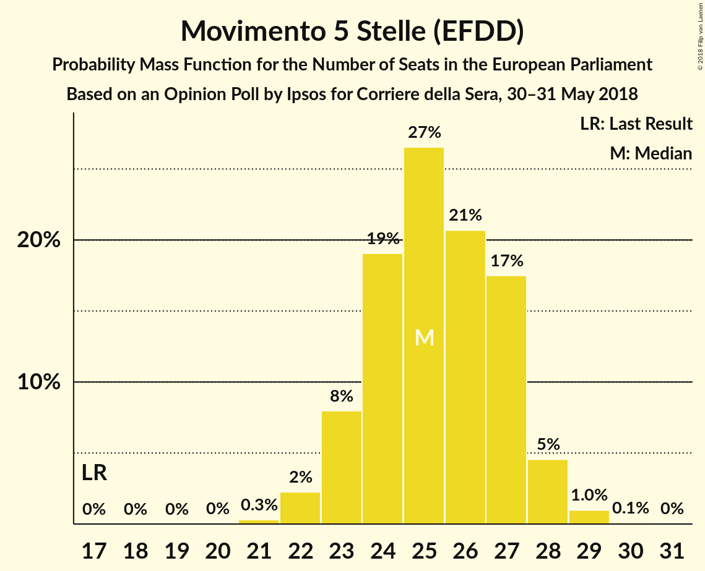
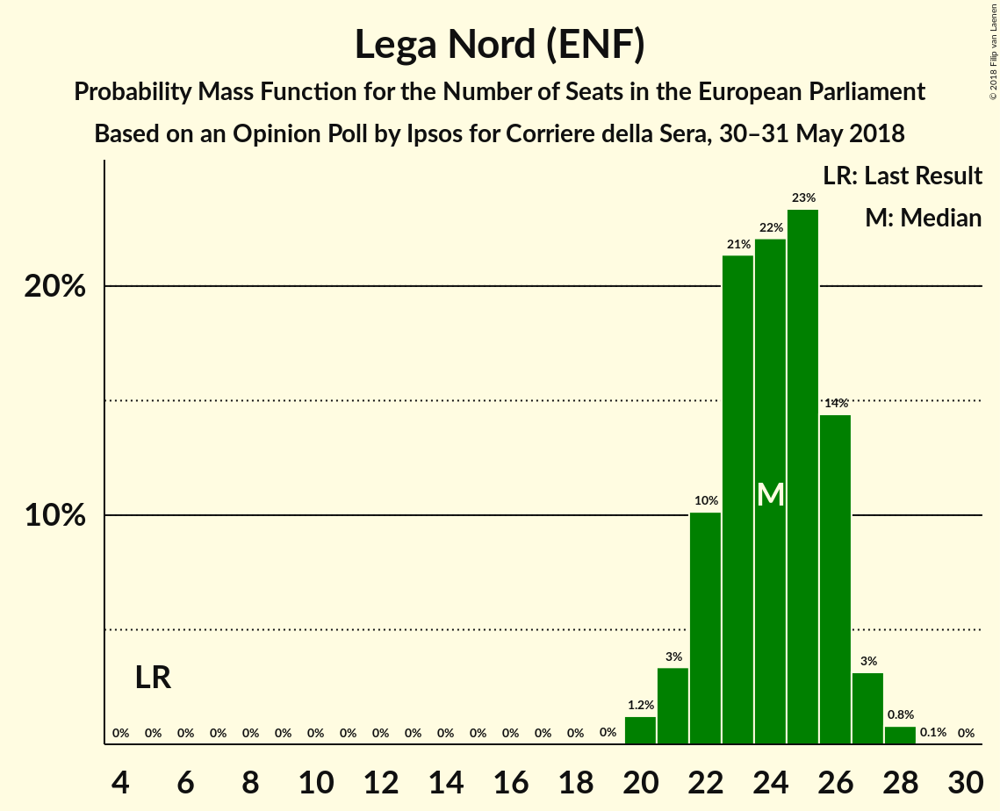
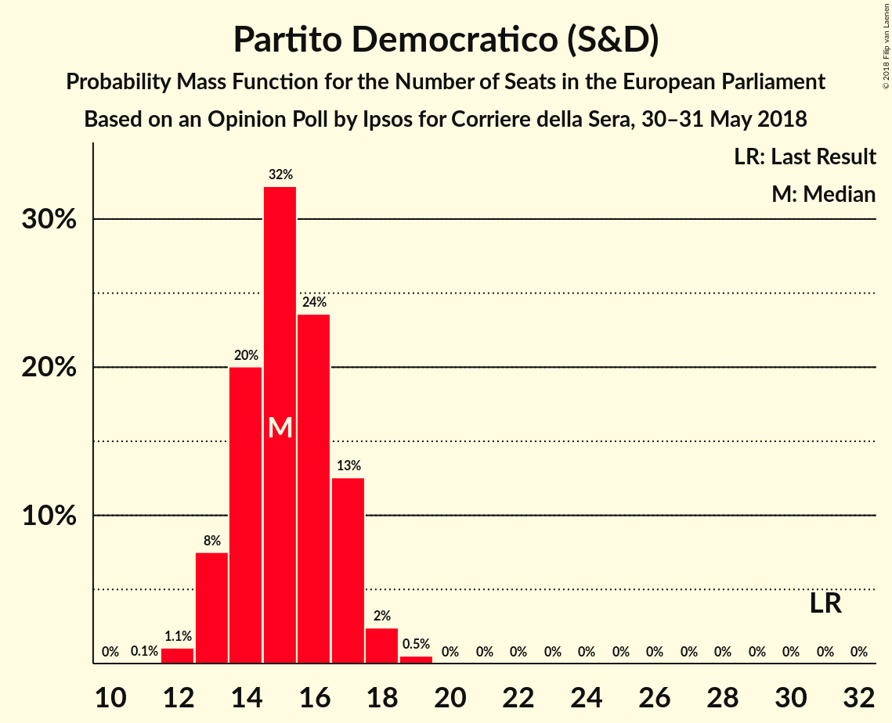
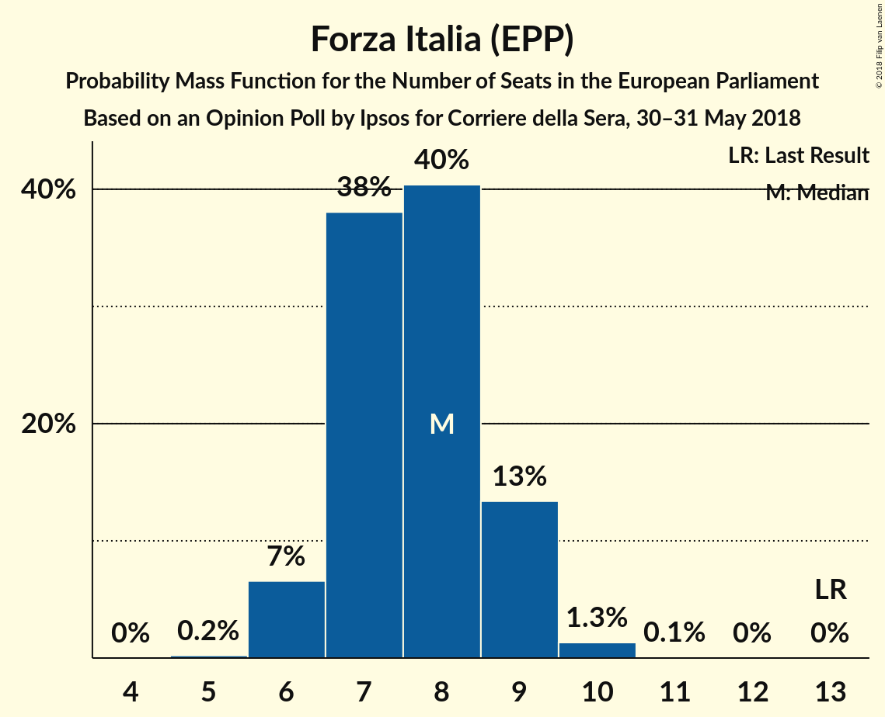

# Opinion Poll by Ipsos for Corriere della Sera, 30–31 May 2018

<a href="#voting-intentions">Voting Intentions</a> | <a href="#seats">Seats</a> | <a href="#coalitions">Coalitions</a> | <a href="#technical-information">Technical Information</a>

## Voting Intentions

### Confidence Intervals

| Party | Last Result | Poll Result | 80% Confidence Interval | 90% Confidence Interval | 95% Confidence Interval | 99% Confidence Interval |
|:-----:|:-----------:|:-----------:|:-----------------------:|:-----------------------:|:-----------------------:|:-----------------------:|
| Movimento 5 Stelle (EFDD) | 21.2% | 30.1% | 28.3–32.1% |27.8–32.6% |27.4–33.1% |26.5–34.0% |
| Lega Nord (ENF) | 6.2% | 28.5% | 26.8–30.4% |26.3–31.0% |25.8–31.4% |25.0–32.3% |
| Partito Democratico (S&D) | 40.8% | 19.2% | 17.6–20.8% |17.2–21.3% |16.8–21.7% |16.1–22.5% |
| Forza Italia (EPP) | 16.8% | 9.0% | 7.9–10.2% |7.6–10.6% |7.4–10.9% |6.9–11.6% |
| Fratelli d’Italia (*) | 3.7% | 3.9% | 3.2–4.8% |3.0–5.1% |2.9–5.3% |2.6–5.7% |
| Liberi e Uguali (S&D) | 0.0% | 3.1% | 2.5–3.9% |2.3–4.2% |2.2–4.4% |1.9–4.8% |
| Più Europa (ALDE) | 0.0% | 2.0% | 1.5–2.7% |1.4–2.9% |1.3–3.1% |1.1–3.4% |
| Noi con l’Italia (EPP) | 0.0% | 0.5% | 0.3–0.9% |0.3–1.1% |0.2–1.2% |0.2–1.4% |

*Note:* The poll result column reflects the actual value used in the calculations. Published results may vary slightly, and in addition be rounded to fewer digits.

## Seats

### Confidence Intervals

| Party | Last Result | Median | 80% Confidence Interval | 90% Confidence Interval | 95% Confidence Interval | 99% Confidence Interval |
|:-----:|:-----------:|:------:|:-----------------------:|:-----------------------:|:-----------------------:|:-----------------------:|
| <a href="#movimento-5-stelle-(efdd)">Movimento 5 Stelle (EFDD)</a> | 17 | 25 | 24–27 |23–28 |22–28 |22–29 |
| <a href="#lega-nord-(enf)">Lega Nord (ENF)</a> | 5 | 25 | 22–25 |21–26 |20–27 |20–28 |
| <a href="#partito-democratico-(s&d)">Partito Democratico (S&D)</a> | 31 | 15 | 13–17 |13–17 |13–17 |12–18 |
| <a href="#forza-italia-(epp)">Forza Italia (EPP)</a> | 13 | 8 | 7–9 |6–9 |6–9 |6–10 |
| <a href="#fratelli-d’italia-(*)">Fratelli d’Italia (*)</a> | 0 | 0 | 0–4 |0–4 |0–4 |0–5 |
| <a href="#liberi-e-uguali-(s&d)">Liberi e Uguali (S&D)</a> | 0 | 0 | 0 |0–3 |0–4 |0–4 |
| <a href="#più-europa-(alde)">Più Europa (ALDE)</a> | 0 | 0 | 0 |0 |0 |0 |
| <a href="#noi-con-l’italia-(epp)">Noi con l’Italia (EPP)</a> | 0 | 0 | 0 |0 |0 |0 |

### Movimento 5 Stelle (EFDD)

*For a full overview of the results for this party, see the [Movimento 5 Stelle (EFDD)](party-movimento5stelleefdd.html) page.*

| Number of Seats | Probability | Accumulated | Special Marks |
|:---------------:|:-----------:|:-----------:|:-------------:|
| 17 | 0% | 100% | Last Result |
| 18 | 0% | 100% |  |
| 19 | 0% | 100% |  |
| 20 | 0% | 100% |  |
| 21 | 0.2% | 100% |  |
| 22 | 3% | 99.8% |  |
| 23 | 6% | 96% |  |
| 24 | 19% | 90% |  |
| 25 | 33% | 72% | Median |
| 26 | 10% | 38% |  |
| 27 | 22% | 28% |  |
| 28 | 5% | 6% |  |
| 29 | 0.7% | 0.8% |  |
| 30 | 0.1% | 0.1% |  |
| 31 | 0% | 0% |  |

### Lega Nord (ENF)

*For a full overview of the results for this party, see the [Lega Nord (ENF)](party-leganordenf.html) page.*

| Number of Seats | Probability | Accumulated | Special Marks |
|:---------------:|:-----------:|:-----------:|:-------------:|
| 5 | 0% | 100% | Last Result |
| 6 | 0% | 100% |  |
| 7 | 0% | 100% |  |
| 8 | 0% | 100% |  |
| 9 | 0% | 100% |  |
| 10 | 0% | 100% |  |
| 11 | 0% | 100% |  |
| 12 | 0% | 100% |  |
| 13 | 0% | 100% |  |
| 14 | 0% | 100% |  |
| 15 | 0% | 100% |  |
| 16 | 0% | 100% |  |
| 17 | 0% | 100% |  |
| 18 | 0% | 100% |  |
| 19 | 0% | 100% |  |
| 20 | 3% | 100% |  |
| 21 | 3% | 97% |  |
| 22 | 9% | 94% |  |
| 23 | 22% | 85% |  |
| 24 | 11% | 62% |  |
| 25 | 43% | 51% | Median |
| 26 | 6% | 9% |  |
| 27 | 2% | 3% |  |
| 28 | 0.6% | 0.6% |  |
| 29 | 0% | 0% |  |

### Partito Democratico (S&D)

*For a full overview of the results for this party, see the [Partito Democratico (S&D)](party-partitodemocraticosd.html) page.*

| Number of Seats | Probability | Accumulated | Special Marks |
|:---------------:|:-----------:|:-----------:|:-------------:|
| 11 | 0.1% | 100% |  |
| 12 | 1.4% | 99.9% |  |
| 13 | 10% | 98.6% |  |
| 14 | 22% | 89% |  |
| 15 | 27% | 67% | Median |
| 16 | 18% | 40% |  |
| 17 | 20% | 22% |  |
| 18 | 2% | 2% |  |
| 19 | 0.1% | 0.1% |  |
| 20 | 0% | 0% |  |
| 21 | 0% | 0% |  |
| 22 | 0% | 0% |  |
| 23 | 0% | 0% |  |
| 24 | 0% | 0% |  |
| 25 | 0% | 0% |  |
| 26 | 0% | 0% |  |
| 27 | 0% | 0% |  |
| 28 | 0% | 0% |  |
| 29 | 0% | 0% |  |
| 30 | 0% | 0% |  |
| 31 | 0% | 0% | Last Result |

### Forza Italia (EPP)

*For a full overview of the results for this party, see the [Forza Italia (EPP)](party-forzaitaliaepp.html) page.*

| Number of Seats | Probability | Accumulated | Special Marks |
|:---------------:|:-----------:|:-----------:|:-------------:|
| 5 | 0.4% | 100% |  |
| 6 | 6% | 99.6% |  |
| 7 | 33% | 94% |  |
| 8 | 49% | 61% | Median |
| 9 | 11% | 12% |  |
| 10 | 1.3% | 1.3% |  |
| 11 | 0% | 0% |  |
| 12 | 0% | 0% |  |
| 13 | 0% | 0% | Last Result |

### Fratelli d’Italia (*)

*For a full overview of the results for this party, see the [Fratelli d’Italia (*)](party-fratellid’italia.html) page.*

| Number of Seats | Probability | Accumulated | Special Marks |
|:---------------:|:-----------:|:-----------:|:-------------:|
| 0 | 62% | 100% | Last Result, Median |
| 1 | 0% | 38% |  |
| 2 | 0% | 38% |  |
| 3 | 8% | 38% |  |
| 4 | 29% | 30% |  |
| 5 | 1.0% | 1.0% |  |
| 6 | 0% | 0% |  |

### Liberi e Uguali (S&D)

*For a full overview of the results for this party, see the [Liberi e Uguali (S&D)](party-liberieugualisd.html) page.*

| Number of Seats | Probability | Accumulated | Special Marks |
|:---------------:|:-----------:|:-----------:|:-------------:|
| 0 | 94% | 100% | Last Result, Median |
| 1 | 0% | 6% |  |
| 2 | 0% | 6% |  |
| 3 | 3% | 6% |  |
| 4 | 4% | 4% |  |
| 5 | 0% | 0% |  |

### Più Europa (ALDE)

*For a full overview of the results for this party, see the [Più Europa (ALDE)](party-piùeuropaalde.html) page.*

| Number of Seats | Probability | Accumulated | Special Marks |
|:---------------:|:-----------:|:-----------:|:-------------:|
| 0 | 100% | 100% | Last Result, Median |

### Noi con l’Italia (EPP)

*For a full overview of the results for this party, see the [Noi con l’Italia (EPP)](party-noiconl’italiaepp.html) page.*

| Number of Seats | Probability | Accumulated | Special Marks |
|:---------------:|:-----------:|:-----------:|:-------------:|
| 0 | 100% | 100% | Last Result, Median |

## Coalitions

### Confidence Intervals

| Coalition | Last Result | Median | Majority? | 80% Confidence Interval | 90% Confidence Interval | 95% Confidence Interval | 99% Confidence Interval |
|:---------:|:-----------:|:------:|:---------:|:-----------------------:|:-----------------------:|:-----------------------:|:-----------------------:|
| Movimento 5 Stelle (EFDD) | 17 | 25 | 0% | 24–27 | 23–28 | 22–28 | 22–29 |
| Lega Nord (ENF) | 5 | 25 | 0% | 22–25 | 21–26 | 20–27 | 20–28 |
| Partito Democratico (S&D) – Liberi e Uguali (S&D) | 31 | 15 | 0% | 14–17 | 13–18 | 13–18 | 12–20 |
| Più Europa (ALDE) | 0 | 0 | 0% | 0 | 0 | 0 | 0 |

### Movimento 5 Stelle (EFDD)

| Number of Seats | Probability | Accumulated | Special Marks |
|:---------------:|:-----------:|:-----------:|:-------------:|
| 17 | 0% | 100% | Last Result |
| 18 | 0% | 100% |  |
| 19 | 0% | 100% |  |
| 20 | 0% | 100% |  |
| 21 | 0.2% | 100% |  |
| 22 | 3% | 99.8% |  |
| 23 | 6% | 96% |  |
| 24 | 19% | 90% |  |
| 25 | 33% | 72% | Median |
| 26 | 10% | 38% |  |
| 27 | 22% | 28% |  |
| 28 | 5% | 6% |  |
| 29 | 0.7% | 0.8% |  |
| 30 | 0.1% | 0.1% |  |
| 31 | 0% | 0% |  |

### Lega Nord (ENF)

| Number of Seats | Probability | Accumulated | Special Marks |
|:---------------:|:-----------:|:-----------:|:-------------:|
| 5 | 0% | 100% | Last Result |
| 6 | 0% | 100% |  |
| 7 | 0% | 100% |  |
| 8 | 0% | 100% |  |
| 9 | 0% | 100% |  |
| 10 | 0% | 100% |  |
| 11 | 0% | 100% |  |
| 12 | 0% | 100% |  |
| 13 | 0% | 100% |  |
| 14 | 0% | 100% |  |
| 15 | 0% | 100% |  |
| 16 | 0% | 100% |  |
| 17 | 0% | 100% |  |
| 18 | 0% | 100% |  |
| 19 | 0% | 100% |  |
| 20 | 3% | 100% |  |
| 21 | 3% | 97% |  |
| 22 | 9% | 94% |  |
| 23 | 22% | 85% |  |
| 24 | 11% | 62% |  |
| 25 | 43% | 51% | Median |
| 26 | 6% | 9% |  |
| 27 | 2% | 3% |  |
| 28 | 0.6% | 0.6% |  |
| 29 | 0% | 0% |  |

### Partito Democratico (S&D) – Liberi e Uguali (S&D)

| Number of Seats | Probability | Accumulated | Special Marks |
|:---------------:|:-----------:|:-----------:|:-------------:|
| 12 | 1.1% | 100% |  |
| 13 | 9% | 98.9% |  |
| 14 | 20% | 90% |  |
| 15 | 25% | 70% | Median |
| 16 | 17% | 45% |  |
| 17 | 22% | 28% |  |
| 18 | 4% | 6% |  |
| 19 | 1.4% | 2% |  |
| 20 | 0.6% | 0.9% |  |
| 21 | 0.2% | 0.2% |  |
| 22 | 0% | 0% |  |
| 23 | 0% | 0% |  |
| 24 | 0% | 0% |  |
| 25 | 0% | 0% |  |
| 26 | 0% | 0% |  |
| 27 | 0% | 0% |  |
| 28 | 0% | 0% |  |
| 29 | 0% | 0% |  |
| 30 | 0% | 0% |  |
| 31 | 0% | 0% | Last Result |

### Più Europa (ALDE)

| Number of Seats | Probability | Accumulated | Special Marks |
|:---------------:|:-----------:|:-----------:|:-------------:|
| 0 | 100% | 100% | Last Result, Median |

## Technical Information

### Opinion Poll

+ **Polling firm:** Ipsos
+ **Commissioner(s):** Corriere della Sera
+ **Fieldwork period:** 30–31 May 2018

### Calculations

+ **Sample size:** 1002
+ **Simulations done:** 131,072
+ **Error estimate:** 1.11%

