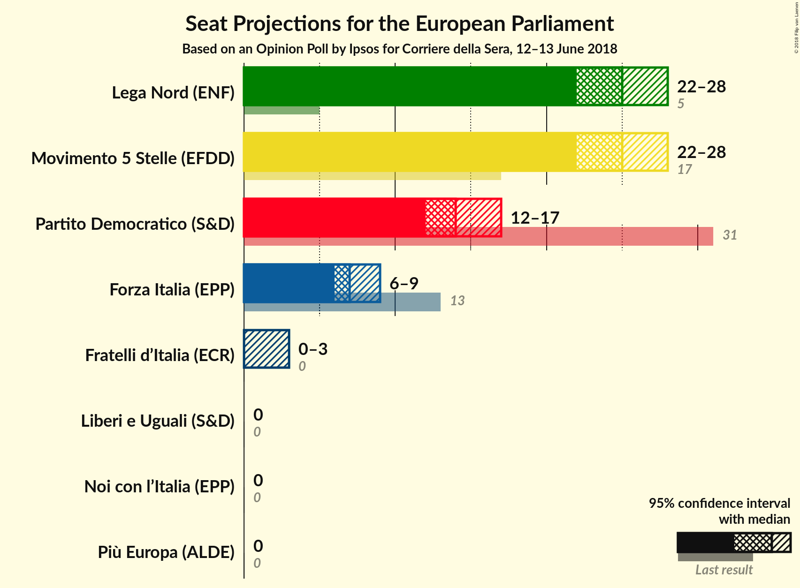
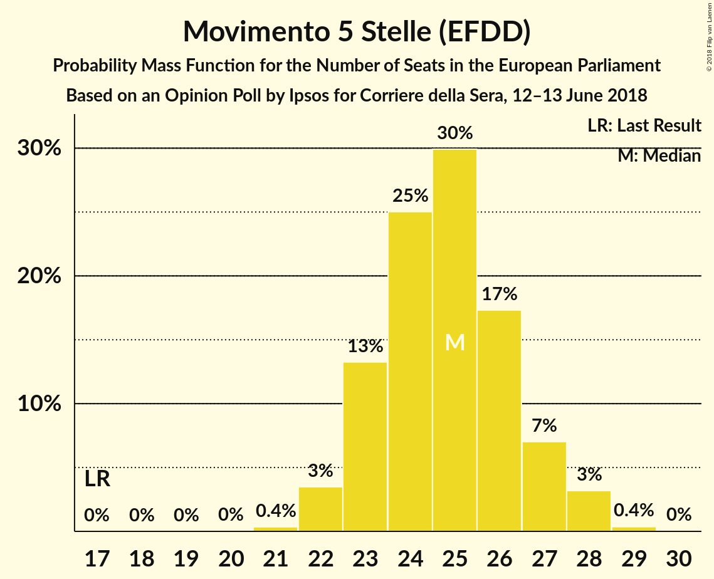

# Opinion Poll by Ipsos for Corriere della Sera, 12–13 June 2018

<a href="#voting-intentions">Voting Intentions</a> | <a href="#seats">Seats</a> | <a href="#coalitions">Coalitions</a> | <a href="#technical-information">Technical Information</a>

## Voting Intentions

### Confidence Intervals

| Party | Last Result | Poll Result | 80% Confidence Interval | 90% Confidence Interval | 95% Confidence Interval | 99% Confidence Interval |
|:-----:|:-----------:|:-----------:|:-----------------------:|:-----------------------:|:-----------------------:|:-----------------------:|
| Lega Nord (ENF) | 6.2% | 30.1% | 28.3–32.0% |27.8–32.6% |27.3–33.0% |26.5–33.9% |
| Movimento 5 Stelle (EFDD) | 21.2% | 29.9% | 28.1–31.8% |27.6–32.3% |27.1–32.8% |26.3–33.7% |
| Partito Democratico (S&D) | 40.8% | 18.6% | 17.1–20.3% |16.7–20.7% |16.3–21.1% |15.6–21.9% |
| Forza Italia (EPP) | 16.8% | 8.7% | 7.7–10.0% |7.3–10.3% |7.1–10.6% |6.6–11.2% |

*Note:* The poll result column reflects the actual value used in the calculations. Published results may vary slightly, and in addition be rounded to fewer digits.

## Seats

### Confidence Intervals

| Party | Last Result | Median | 80% Confidence Interval | 90% Confidence Interval | 95% Confidence Interval | 99% Confidence Interval |
|:-----:|:-----------:|:------:|:-----------------------:|:-----------------------:|:-----------------------:|:-----------------------:|
| <a href="#lega-nord-(enf)">Lega Nord (ENF)</a> | 5 | 23 | 21–24 |21–25 |21–25 |20–26 |
| <a href="#movimento-5-stelle-(efdd)">Movimento 5 Stelle (EFDD)</a> | 17 | 23 | 21–24 |21–25 |21–25 |20–26 |
| <a href="#partito-democratico-(s&d)">Partito Democratico (S&D)</a> | 31 | 13 | 12–14 |12–15 |11–15 |11–16 |
| <a href="#forza-italia-(epp)">Forza Italia (EPP)</a> | 13 | 7 | 6–8 |6–8 |5–8 |5–9 |

### Lega Nord (ENF)

*For a full overview of the results for this party, see the [Lega Nord (ENF)](party-leganordenf.html) page.*

| Number of Seats | Probability | Accumulated | Special Marks |
|:---------------:|:-----------:|:-----------:|:-------------:|
| 5 | 0% | 100% | Last Result |
| 6 | 0% | 100% |  |
| 7 | 0% | 100% |  |
| 8 | 0% | 100% |  |
| 9 | 0% | 100% |  |
| 10 | 0% | 100% |  |
| 11 | 0% | 100% |  |
| 12 | 0% | 100% |  |
| 13 | 0% | 100% |  |
| 14 | 0% | 100% |  |
| 15 | 0% | 100% |  |
| 16 | 0% | 100% |  |
| 17 | 0% | 100% |  |
| 18 | 0% | 100% |  |
| 19 | 0.1% | 100% |  |
| 20 | 1.5% | 99.9% |  |
| 21 | 10% | 98% |  |
| 22 | 27% | 89% |  |
| 23 | 35% | 62% | Median |
| 24 | 20% | 27% |  |
| 25 | 6% | 7% |  |
| 26 | 0.9% | 0.9% |  |
| 27 | 0.1% | 0.1% |  |
| 28 | 0% | 0% |  |

### Movimento 5 Stelle (EFDD)

*For a full overview of the results for this party, see the [Movimento 5 Stelle (EFDD)](party-movimento5stelleefdd.html) page.*

| Number of Seats | Probability | Accumulated | Special Marks |
|:---------------:|:-----------:|:-----------:|:-------------:|
| 17 | 0% | 100% | Last Result |
| 18 | 0% | 100% |  |
| 19 | 0.1% | 100% |  |
| 20 | 2% | 99.8% |  |
| 21 | 13% | 98% |  |
| 22 | 27% | 85% |  |
| 23 | 36% | 58% | Median |
| 24 | 16% | 22% |  |
| 25 | 5% | 5% |  |
| 26 | 0.6% | 0.6% |  |
| 27 | 0% | 0% |  |

### Partito Democratico (S&D)

*For a full overview of the results for this party, see the [Partito Democratico (S&D)](party-partitodemocraticosd.html) page.*

| Number of Seats | Probability | Accumulated | Special Marks |
|:---------------:|:-----------:|:-----------:|:-------------:|
| 10 | 0.2% | 100% |  |
| 11 | 4% | 99.8% |  |
| 12 | 21% | 96% |  |
| 13 | 40% | 75% | Median |
| 14 | 27% | 35% |  |
| 15 | 7% | 8% |  |
| 16 | 0.7% | 0.8% |  |
| 17 | 0% | 0% |  |
| 18 | 0% | 0% |  |
| 19 | 0% | 0% |  |
| 20 | 0% | 0% |  |
| 21 | 0% | 0% |  |
| 22 | 0% | 0% |  |
| 23 | 0% | 0% |  |
| 24 | 0% | 0% |  |
| 25 | 0% | 0% |  |
| 26 | 0% | 0% |  |
| 27 | 0% | 0% |  |
| 28 | 0% | 0% |  |
| 29 | 0% | 0% |  |
| 30 | 0% | 0% |  |
| 31 | 0% | 0% | Last Result |

### Forza Italia (EPP)

*For a full overview of the results for this party, see the [Forza Italia (EPP)](party-forzaitaliaepp.html) page.*

| Number of Seats | Probability | Accumulated | Special Marks |
|:---------------:|:-----------:|:-----------:|:-------------:|
| 5 | 4% | 100% |  |
| 6 | 38% | 96% |  |
| 7 | 46% | 58% | Median |
| 8 | 11% | 11% |  |
| 9 | 0.5% | 0.5% |  |
| 10 | 0% | 0% |  |
| 11 | 0% | 0% |  |
| 12 | 0% | 0% |  |
| 13 | 0% | 0% | Last Result |

## Coalitions

### Confidence Intervals

| Coalition | Last Result | Median | Majority? | 80% Confidence Interval | 90% Confidence Interval | 95% Confidence Interval | 99% Confidence Interval |
|:---------:|:-----------:|:------:|:---------:|:-----------------------:|:-----------------------:|:-----------------------:|:-----------------------:|
| Lega Nord (ENF) | 5 | 23 | 0% | 21–24 | 21–25 | 21–25 | 20–26 |
| Movimento 5 Stelle (EFDD) | 17 | 23 | 0% | 21–24 | 21–25 | 21–25 | 20–26 |

### Lega Nord (ENF)

| Number of Seats | Probability | Accumulated | Special Marks |
|:---------------:|:-----------:|:-----------:|:-------------:|
| 5 | 0% | 100% | Last Result |
| 6 | 0% | 100% |  |
| 7 | 0% | 100% |  |
| 8 | 0% | 100% |  |
| 9 | 0% | 100% |  |
| 10 | 0% | 100% |  |
| 11 | 0% | 100% |  |
| 12 | 0% | 100% |  |
| 13 | 0% | 100% |  |
| 14 | 0% | 100% |  |
| 15 | 0% | 100% |  |
| 16 | 0% | 100% |  |
| 17 | 0% | 100% |  |
| 18 | 0% | 100% |  |
| 19 | 0.1% | 100% |  |
| 20 | 1.5% | 99.9% |  |
| 21 | 10% | 98% |  |
| 22 | 27% | 89% |  |
| 23 | 35% | 62% | Median |
| 24 | 20% | 27% |  |
| 25 | 6% | 7% |  |
| 26 | 0.9% | 0.9% |  |
| 27 | 0.1% | 0.1% |  |
| 28 | 0% | 0% |  |

### Movimento 5 Stelle (EFDD)

| Number of Seats | Probability | Accumulated | Special Marks |
|:---------------:|:-----------:|:-----------:|:-------------:|
| 17 | 0% | 100% | Last Result |
| 18 | 0% | 100% |  |
| 19 | 0.1% | 100% |  |
| 20 | 2% | 99.8% |  |
| 21 | 13% | 98% |  |
| 22 | 27% | 85% |  |
| 23 | 36% | 58% | Median |
| 24 | 16% | 22% |  |
| 25 | 5% | 5% |  |
| 26 | 0.6% | 0.6% |  |
| 27 | 0% | 0% |  |

## Technical Information

### Opinion Poll

+ **Polling firm:** Ipsos
+ **Commissioner(s):** Corriere della Sera
+ **Fieldwork period:** 12–13 June 2018

### Calculations

+ **Sample size:** 1000
+ **Simulations done:** 131,072
+ **Error estimate:** 0.66%

