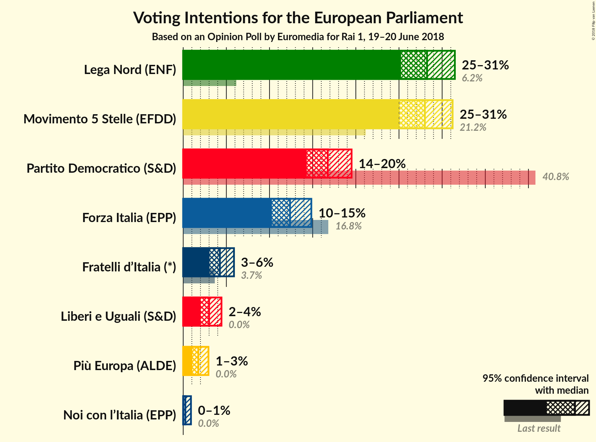
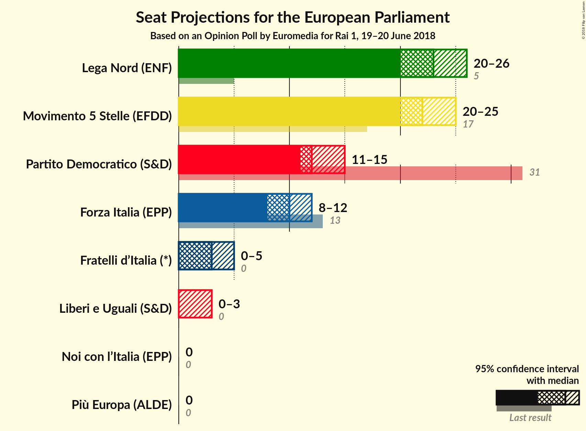
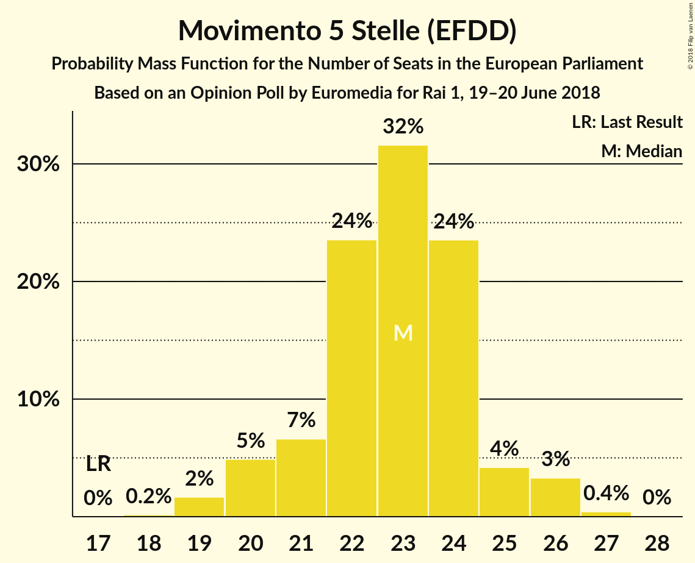
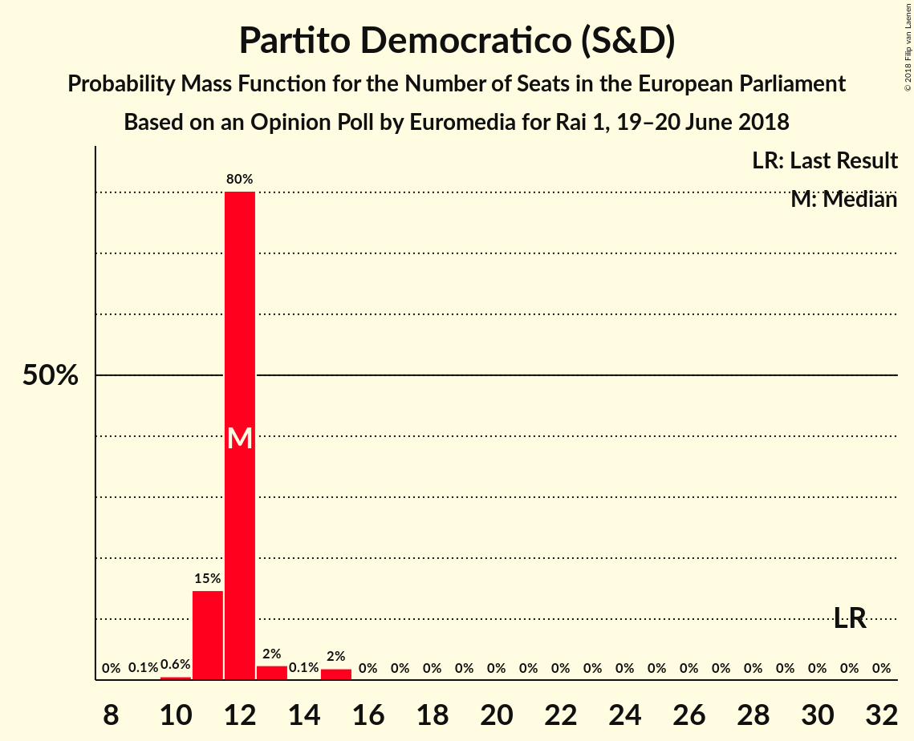
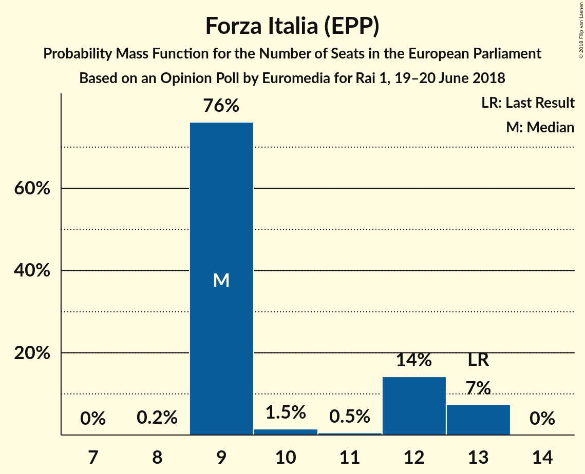
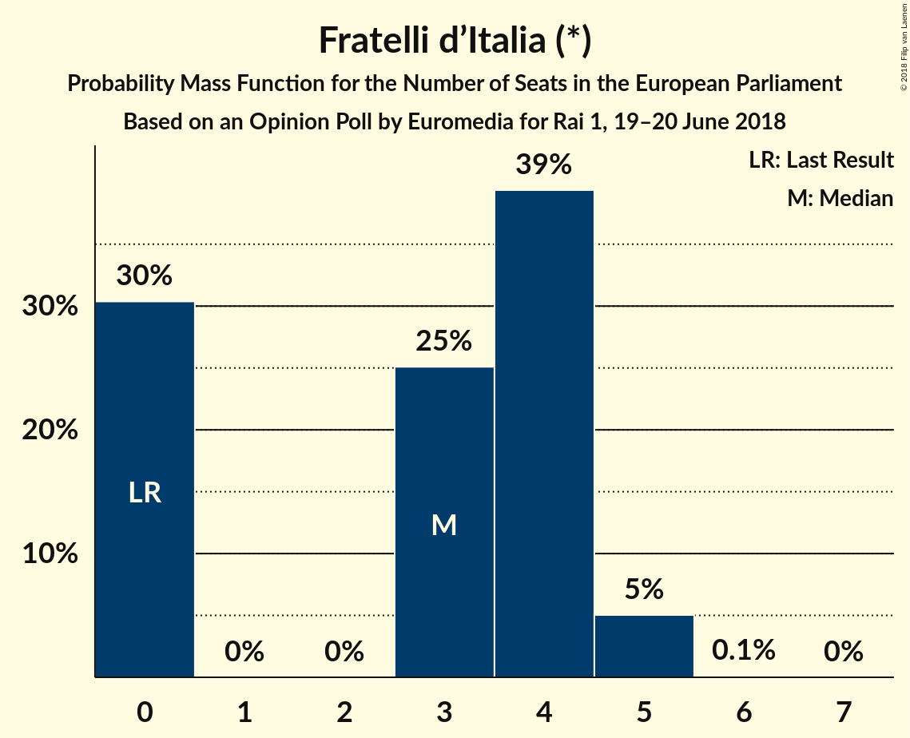
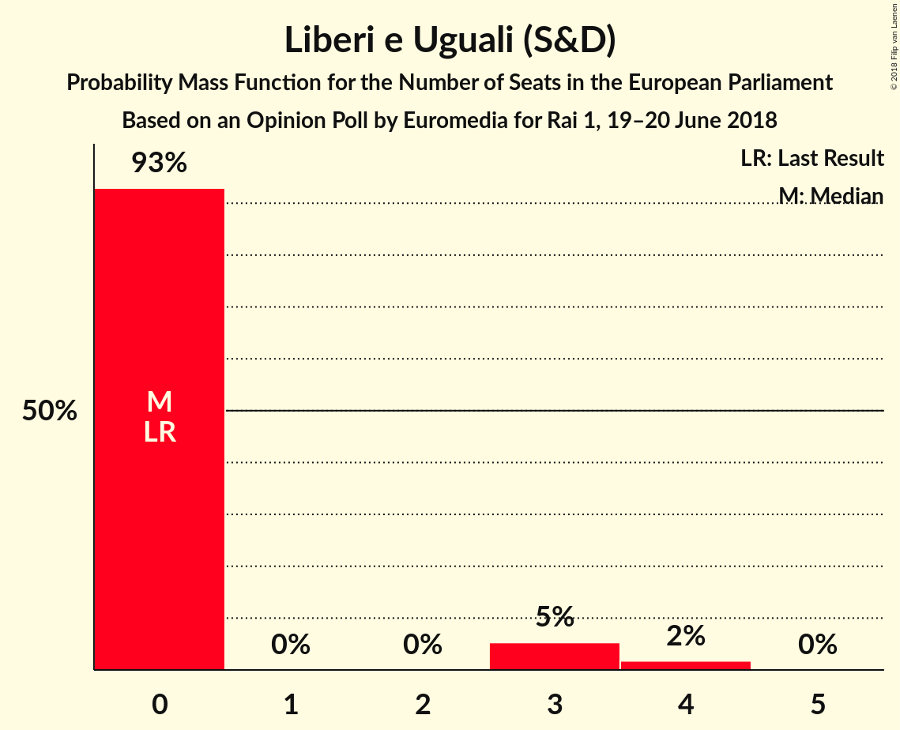
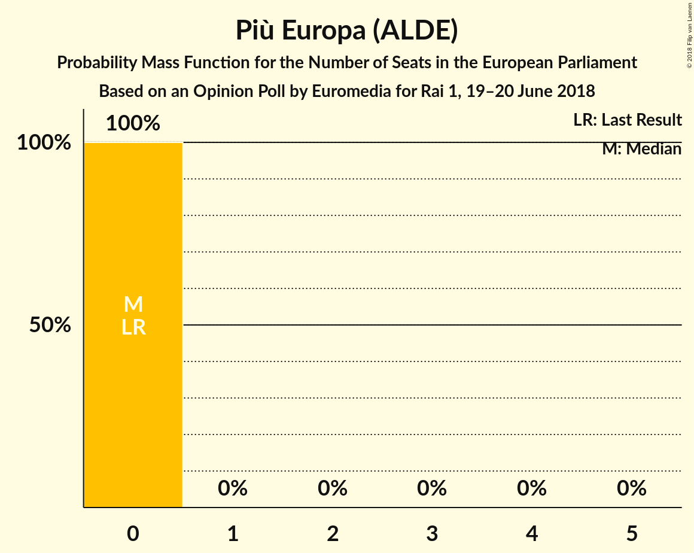
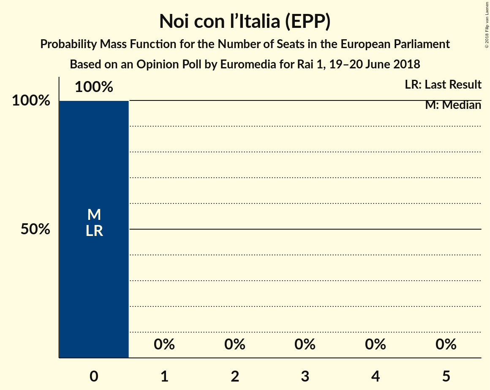
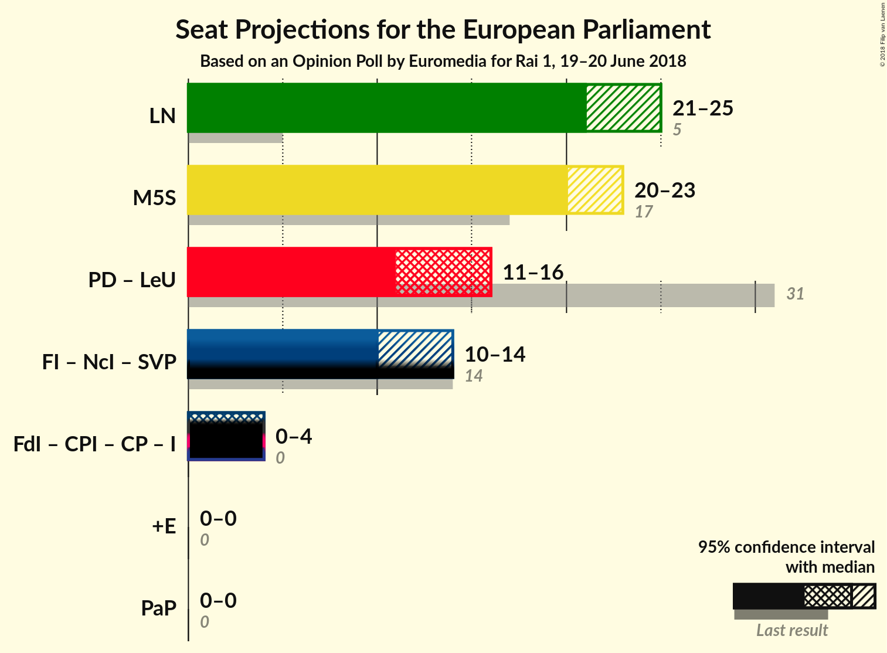

# Opinion Poll by Euromedia for Rai 1, 19–20 June 2018

<a href="#voting-intentions">Voting Intentions</a> | <a href="#seats">Seats</a> | <a href="#coalitions">Coalitions</a> | <a href="#technical-information">Technical Information</a>

## Voting Intentions

### Confidence Intervals

| Party | Last Result | Poll Result | 80% Confidence Interval | 90% Confidence Interval | 95% Confidence Interval | 99% Confidence Interval |
|:-----:|:-----------:|:-----------:|:-----------------------:|:-----------------------:|:-----------------------:|:-----------------------:|
| Lega Nord (ENF) | 6.2% | 28.2% | 26.3–30.4% |25.7–31.0% |25.2–31.5% |24.3–32.5% |
| Movimento 5 Stelle (EFDD) | 21.2% | 28.0% | 26.0–30.1% |25.5–30.7% |25.0–31.2% |24.1–32.3% |
| Partito Democratico (S&D) | 40.8% | 16.8% | 15.2–18.5% |14.7–19.1% |14.3–19.5% |13.6–20.4% |
| Forza Italia (EPP) | 16.8% | 12.4% | 11.0–14.0% |10.6–14.4% |10.3–14.8% |9.6–15.7% |
| Fratelli d’Italia (*) | 3.7% | 4.2% | 3.5–5.3% |3.2–5.6% |3.0–5.9% |2.7–6.4% |
| Liberi e Uguali (S&D) | 0.0% | 3.0% | 2.3–3.9% |2.2–4.2% |2.0–4.4% |1.8–4.9% |
| Più Europa (ALDE) | 0.0% | 1.8% | 1.3–2.5% |1.1–2.7% |1.1–2.9% |0.9–3.3% |
| Noi con l’Italia (EPP) | 0.0% | 0.2% | 0.1–0.7% |0.1–0.8% |0.1–0.9% |0.0–1.2% |

*Note:* The poll result column reflects the actual value used in the calculations. Published results may vary slightly, and in addition be rounded to fewer digits.

## Seats

### Confidence Intervals

| Party | Last Result | Median | 80% Confidence Interval | 90% Confidence Interval | 95% Confidence Interval | 99% Confidence Interval |
|:-----:|:-----------:|:------:|:-----------------------:|:-----------------------:|:-----------------------:|:-----------------------:|
| <a href="#lega-nord-(enf)">Lega Nord (ENF)</a> | 5 | 21 | 21–25 |21–25 |21–25 |20–28 |
| <a href="#movimento-5-stelle-(efdd)">Movimento 5 Stelle (EFDD)</a> | 17 | 20 | 20–21 |20–21 |20–23 |19–26 |
| <a href="#partito-democratico-(s&d)">Partito Democratico (S&D)</a> | 31 | 12 | 11–12 |11–12 |11–13 |10–15 |
| <a href="#forza-italia-(epp)">Forza Italia (EPP)</a> | 13 | 9 | 9–12 |9–13 |9–13 |9–13 |
| <a href="#fratelli-d’italia-(*)">Fratelli d’Italia (*)</a> | 0 | 4 | 0–4 |0–4 |0–4 |0–6 |
| <a href="#liberi-e-uguali-(s&d)">Liberi e Uguali (S&D)</a> | 0 | 4 | 0–4 |0–4 |0–4 |0–4 |
| <a href="#più-europa-(alde)">Più Europa (ALDE)</a> | 0 | 0 | 0 |0 |0 |0 |
| <a href="#noi-con-l’italia-(epp)">Noi con l’Italia (EPP)</a> | 0 | 0 | 0 |0 |0 |0 |

### Lega Nord (ENF)

*For a full overview of the results for this party, see the [Lega Nord (ENF)](party-leganordenf.html) page.*

| Number of Seats | Probability | Accumulated | Special Marks |
|:---------------:|:-----------:|:-----------:|:-------------:|
| 5 | 0% | 100% | Last Result |
| 6 | 0% | 100% |  |
| 7 | 0% | 100% |  |
| 8 | 0% | 100% |  |
| 9 | 0% | 100% |  |
| 10 | 0% | 100% |  |
| 11 | 0% | 100% |  |
| 12 | 0% | 100% |  |
| 13 | 0% | 100% |  |
| 14 | 0% | 100% |  |
| 15 | 0% | 100% |  |
| 16 | 0% | 100% |  |
| 17 | 0% | 100% |  |
| 18 | 0.1% | 100% |  |
| 19 | 0.1% | 99.9% |  |
| 20 | 2% | 99.9% |  |
| 21 | 74% | 98% | Median |
| 22 | 0.1% | 24% |  |
| 23 | 1.3% | 24% |  |
| 24 | 0.2% | 22% |  |
| 25 | 21% | 22% |  |
| 26 | 0% | 1.0% |  |
| 27 | 0% | 1.0% |  |
| 28 | 0.9% | 0.9% |  |
| 29 | 0% | 0% |  |

### Movimento 5 Stelle (EFDD)

*For a full overview of the results for this party, see the [Movimento 5 Stelle (EFDD)](party-movimento5stelleefdd.html) page.*

| Number of Seats | Probability | Accumulated | Special Marks |
|:---------------:|:-----------:|:-----------:|:-------------:|
| 17 | 0% | 100% | Last Result |
| 18 | 0% | 100% |  |
| 19 | 0.5% | 100% |  |
| 20 | 74% | 99.5% | Median |
| 21 | 22% | 26% |  |
| 22 | 0.5% | 4% |  |
| 23 | 1.2% | 4% |  |
| 24 | 0.2% | 2% |  |
| 25 | 0% | 2% |  |
| 26 | 2% | 2% |  |
| 27 | 0.2% | 0.2% |  |
| 28 | 0% | 0% |  |

### Partito Democratico (S&D)

*For a full overview of the results for this party, see the [Partito Democratico (S&D)](party-partitodemocraticosd.html) page.*

| Number of Seats | Probability | Accumulated | Special Marks |
|:---------------:|:-----------:|:-----------:|:-------------:|
| 9 | 0.1% | 100% |  |
| 10 | 0.6% | 99.9% |  |
| 11 | 15% | 99.4% |  |
| 12 | 80% | 85% | Median |
| 13 | 2% | 4% |  |
| 14 | 0.1% | 2% |  |
| 15 | 2% | 2% |  |
| 16 | 0% | 0% |  |
| 17 | 0% | 0% |  |
| 18 | 0% | 0% |  |
| 19 | 0% | 0% |  |
| 20 | 0% | 0% |  |
| 21 | 0% | 0% |  |
| 22 | 0% | 0% |  |
| 23 | 0% | 0% |  |
| 24 | 0% | 0% |  |
| 25 | 0% | 0% |  |
| 26 | 0% | 0% |  |
| 27 | 0% | 0% |  |
| 28 | 0% | 0% |  |
| 29 | 0% | 0% |  |
| 30 | 0% | 0% |  |
| 31 | 0% | 0% | Last Result |

### Forza Italia (EPP)

*For a full overview of the results for this party, see the [Forza Italia (EPP)](party-forzaitaliaepp.html) page.*

| Number of Seats | Probability | Accumulated | Special Marks |
|:---------------:|:-----------:|:-----------:|:-------------:|
| 8 | 0.2% | 100% |  |
| 9 | 76% | 99.8% | Median |
| 10 | 1.5% | 24% |  |
| 11 | 0.5% | 22% |  |
| 12 | 14% | 22% |  |
| 13 | 7% | 7% | Last Result |
| 14 | 0% | 0% |  |

### Fratelli d’Italia (*)

*For a full overview of the results for this party, see the [Fratelli d’Italia (*)](party-fratellid’italia.html) page.*

| Number of Seats | Probability | Accumulated | Special Marks |
|:---------------:|:-----------:|:-----------:|:-------------:|
| 0 | 18% | 100% | Last Result |
| 1 | 0% | 82% |  |
| 2 | 0% | 82% |  |
| 3 | 0.1% | 82% |  |
| 4 | 80% | 82% | Median |
| 5 | 0.7% | 1.2% |  |
| 6 | 0.5% | 0.5% |  |
| 7 | 0% | 0% |  |

### Liberi e Uguali (S&D)

*For a full overview of the results for this party, see the [Liberi e Uguali (S&D)](party-liberieugualisd.html) page.*

| Number of Seats | Probability | Accumulated | Special Marks |
|:---------------:|:-----------:|:-----------:|:-------------:|
| 0 | 26% | 100% | Last Result |
| 1 | 0% | 74% |  |
| 2 | 0% | 74% |  |
| 3 | 0.3% | 74% |  |
| 4 | 74% | 74% | Median |
| 5 | 0.4% | 0.4% |  |
| 6 | 0% | 0% |  |

### Più Europa (ALDE)

*For a full overview of the results for this party, see the [Più Europa (ALDE)](party-piùeuropaalde.html) page.*

| Number of Seats | Probability | Accumulated | Special Marks |
|:---------------:|:-----------:|:-----------:|:-------------:|
| 0 | 100% | 100% | Last Result, Median |

### Noi con l’Italia (EPP)

*For a full overview of the results for this party, see the [Noi con l’Italia (EPP)](party-noiconl’italiaepp.html) page.*

| Number of Seats | Probability | Accumulated | Special Marks |
|:---------------:|:-----------:|:-----------:|:-------------:|
| 0 | 100% | 100% | Last Result, Median |

## Coalitions

### Confidence Intervals

| Coalition | Last Result | Median | Majority? | 80% Confidence Interval | 90% Confidence Interval | 95% Confidence Interval | 99% Confidence Interval |
|:---------:|:-----------:|:------:|:---------:|:-----------------------:|:-----------------------:|:-----------------------:|:-----------------------:|
| Lega Nord (ENF) | 5 | 21 | 0% | 21–25 | 21–25 | 21–25 | 20–28 |
| Movimento 5 Stelle (EFDD) | 17 | 20 | 0% | 20–21 | 20–21 | 20–23 | 19–26 |
| Partito Democratico (S&D) – Liberi e Uguali (S&D) | 31 | 16 | 0% | 11–16 | 11–16 | 11–16 | 11–17 |
| Più Europa (ALDE) | 0 | 0 | 0% | 0 | 0 | 0 | 0 |

### Lega Nord (ENF)

| Number of Seats | Probability | Accumulated | Special Marks |
|:---------------:|:-----------:|:-----------:|:-------------:|
| 5 | 0% | 100% | Last Result |
| 6 | 0% | 100% |  |
| 7 | 0% | 100% |  |
| 8 | 0% | 100% |  |
| 9 | 0% | 100% |  |
| 10 | 0% | 100% |  |
| 11 | 0% | 100% |  |
| 12 | 0% | 100% |  |
| 13 | 0% | 100% |  |
| 14 | 0% | 100% |  |
| 15 | 0% | 100% |  |
| 16 | 0% | 100% |  |
| 17 | 0% | 100% |  |
| 18 | 0.1% | 100% |  |
| 19 | 0.1% | 99.9% |  |
| 20 | 2% | 99.9% |  |
| 21 | 74% | 98% | Median |
| 22 | 0.1% | 24% |  |
| 23 | 1.3% | 24% |  |
| 24 | 0.2% | 22% |  |
| 25 | 21% | 22% |  |
| 26 | 0% | 1.0% |  |
| 27 | 0% | 1.0% |  |
| 28 | 0.9% | 0.9% |  |
| 29 | 0% | 0% |  |

### Movimento 5 Stelle (EFDD)

| Number of Seats | Probability | Accumulated | Special Marks |
|:---------------:|:-----------:|:-----------:|:-------------:|
| 17 | 0% | 100% | Last Result |
| 18 | 0% | 100% |  |
| 19 | 0.5% | 100% |  |
| 20 | 74% | 99.5% | Median |
| 21 | 22% | 26% |  |
| 22 | 0.5% | 4% |  |
| 23 | 1.2% | 4% |  |
| 24 | 0.2% | 2% |  |
| 25 | 0% | 2% |  |
| 26 | 2% | 2% |  |
| 27 | 0.2% | 0.2% |  |
| 28 | 0% | 0% |  |

### Partito Democratico (S&D) – Liberi e Uguali (S&D)

| Number of Seats | Probability | Accumulated | Special Marks |
|:---------------:|:-----------:|:-----------:|:-------------:|
| 11 | 15% | 100% |  |
| 12 | 8% | 85% |  |
| 13 | 1.0% | 77% |  |
| 14 | 0.2% | 76% |  |
| 15 | 2% | 76% |  |
| 16 | 73% | 74% | Median |
| 17 | 1.3% | 1.3% |  |
| 18 | 0% | 0% |  |
| 19 | 0% | 0% |  |
| 20 | 0% | 0% |  |
| 21 | 0% | 0% |  |
| 22 | 0% | 0% |  |
| 23 | 0% | 0% |  |
| 24 | 0% | 0% |  |
| 25 | 0% | 0% |  |
| 26 | 0% | 0% |  |
| 27 | 0% | 0% |  |
| 28 | 0% | 0% |  |
| 29 | 0% | 0% |  |
| 30 | 0% | 0% |  |
| 31 | 0% | 0% | Last Result |

### Più Europa (ALDE)

| Number of Seats | Probability | Accumulated | Special Marks |
|:---------------:|:-----------:|:-----------:|:-------------:|
| 0 | 100% | 100% | Last Result, Median |

## Technical Information

### Opinion Poll

+ **Polling firm:** Euromedia
+ **Commissioner(s):** Rai 1
+ **Fieldwork period:** 19–20 June 2018

### Calculations

+ **Sample size:** 800
+ **Simulations done:** 1,024
+ **Error estimate:** 3.22%

