# Opinion Poll by Lorien Consulting, 20 June 2018

<a href="#voting-intentions">Voting Intentions</a> | <a href="#seats">Seats</a> | <a href="#coalitions">Coalitions</a> | <a href="#technical-information">Technical Information</a>

## Voting Intentions

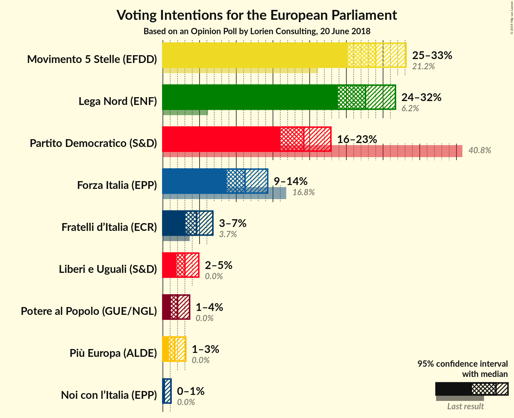

### Confidence Intervals

| Party | Last Result | Poll Result | 80% Confidence Interval | 90% Confidence Interval | 95% Confidence Interval | 99% Confidence Interval |
|:-----:|:-----------:|:-----------:|:-----------------------:|:-----------------------:|:-----------------------:|:-----------------------:|
| Movimento 5 Stelle (EFDD) | 21.2% | 29.0% | 26.5–31.7% |25.8–32.5% |25.2–33.1% |24.0–34.5% |
| Lega Nord (ENF) | 6.2% | 27.6% | 25.1–30.3% |24.4–31.0% |23.9–31.7% |22.7–33.0% |
| Partito Democratico (S&D) | 40.8% | 19.2% | 17.1–21.6% |16.5–22.3% |16.0–22.9% |15.0–24.1% |
| Forza Italia (EPP) | 16.8% | 11.2% | 9.6–13.2% |9.1–13.8% |8.7–14.3% |8.0–15.3% |
| Fratelli d’Italia (ECR) | 3.7% | 4.6% | 3.6–6.0% |3.3–6.4% |3.1–6.8% |2.7–7.6% |
| Liberi e Uguali (S&D) | 0.0% | 3.0% | 2.2–4.2% |2.0–4.6% |1.8–4.9% |1.5–5.5% |
| Potere al Popolo (GUE/NGL) | 0.0% | 2.0% | 1.4–3.1% |1.2–3.4% |1.1–3.6% |0.9–4.2% |
| Più Europa (ALDE) | 0.0% | 1.6% | 1.1–2.6% |0.9–2.9% |0.8–3.1% |0.6–3.7% |
| Noi con l’Italia (EPP) | 0.0% | 0.2% | 0.1–0.8% |0.1–0.9% |0.0–1.1% |0.0–1.5% |

*Note:* The poll result column reflects the actual value used in the calculations. Published results may vary slightly, and in addition be rounded to fewer digits.

## Seats

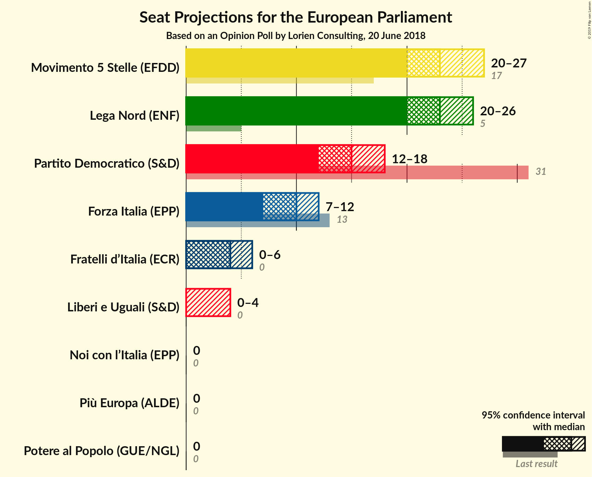

### Confidence Intervals

| Party | Last Result | Median | 80% Confidence Interval | 90% Confidence Interval | 95% Confidence Interval | 99% Confidence Interval |
|:-----:|:-----------:|:------:|:-----------------------:|:-----------------------:|:-----------------------:|:-----------------------:|
| <a href="#movimento-5-stelle-(efdd)">Movimento 5 Stelle (EFDD)</a> | 17 | 23 | 22–27 |21–27 |20–27 |20–28 |
| <a href="#lega-nord-(enf)">Lega Nord (ENF)</a> | 5 | 23 | 21–25 |21–26 |20–26 |19–27 |
| <a href="#partito-democratico-(s&d)">Partito Democratico (S&D)</a> | 31 | 15 | 13–16 |13–17 |12–18 |11–19 |
| <a href="#forza-italia-(epp)">Forza Italia (EPP)</a> | 13 | 10 | 8–11 |8–11 |7–12 |7–12 |
| <a href="#fratelli-d’italia-(ecr)">Fratelli d’Italia (ECR)</a> | 0 | 4 | 0–4 |0–5 |0–6 |0–7 |
| <a href="#liberi-e-uguali-(s&d)">Liberi e Uguali (S&D)</a> | 0 | 0 | 0 |0–4 |0–4 |0–5 |
| <a href="#potere-al-popolo-(gue/ngl)">Potere al Popolo (GUE/NGL)</a> | 0 | 0 | 0 |0 |0 |0–4 |
| <a href="#più-europa-(alde)">Più Europa (ALDE)</a> | 0 | 0 | 0 |0 |0 |0 |
| <a href="#noi-con-l’italia-(epp)">Noi con l’Italia (EPP)</a> | 0 | 0 | 0 |0 |0 |0 |

### Movimento 5 Stelle (EFDD)

*For a full overview of the results for this party, see the [Movimento 5 Stelle (EFDD)](party-movimento5stelleefdd.html) page.*

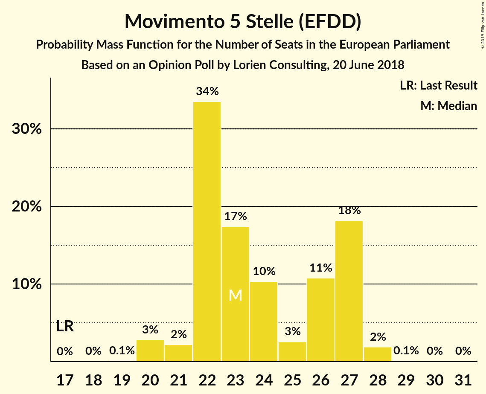

| Number of Seats | Probability | Accumulated | Special Marks |
|:---------------:|:-----------:|:-----------:|:-------------:|
| 17 | 0% | 100% | Last Result |
| 18 | 0% | 100% |  |
| 19 | 0.1% | 100% |  |
| 20 | 3% | 99.8% |  |
| 21 | 2% | 97% |  |
| 22 | 34% | 95% |  |
| 23 | 17% | 61% | Median |
| 24 | 10% | 44% |  |
| 25 | 3% | 34% |  |
| 26 | 11% | 31% |  |
| 27 | 18% | 20% |  |
| 28 | 2% | 2% |  |
| 29 | 0.1% | 0.2% |  |
| 30 | 0% | 0.1% |  |
| 31 | 0% | 0% |  |

### Lega Nord (ENF)

*For a full overview of the results for this party, see the [Lega Nord (ENF)](party-leganordenf.html) page.*

| Number of Seats | Probability | Accumulated | Special Marks |
|:---------------:|:-----------:|:-----------:|:-------------:|
| 5 | 0% | 100% | Last Result |
| 6 | 0% | 100% |  |
| 7 | 0% | 100% |  |
| 8 | 0% | 100% |  |
| 9 | 0% | 100% |  |
| 10 | 0% | 100% |  |
| 11 | 0% | 100% |  |
| 12 | 0% | 100% |  |
| 13 | 0% | 100% |  |
| 14 | 0% | 100% |  |
| 15 | 0% | 100% |  |
| 16 | 0% | 100% |  |
| 17 | 0% | 100% |  |
| 18 | 0.3% | 100% |  |
| 19 | 1.2% | 99.7% |  |
| 20 | 3% | 98% |  |
| 21 | 6% | 95% |  |
| 22 | 19% | 89% |  |
| 23 | 20% | 70% | Median |
| 24 | 38% | 50% |  |
| 25 | 6% | 12% |  |
| 26 | 5% | 5% |  |
| 27 | 0.5% | 0.6% |  |
| 28 | 0% | 0.2% |  |
| 29 | 0.1% | 0.1% |  |
| 30 | 0% | 0% |  |

### Partito Democratico (S&D)

*For a full overview of the results for this party, see the [Partito Democratico (S&D)](party-partitodemocraticosd.html) page.*

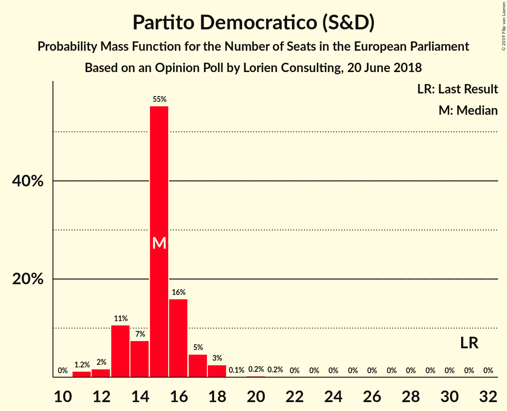

| Number of Seats | Probability | Accumulated | Special Marks |
|:---------------:|:-----------:|:-----------:|:-------------:|
| 11 | 1.2% | 100% |  |
| 12 | 2% | 98.8% |  |
| 13 | 11% | 97% |  |
| 14 | 7% | 86% |  |
| 15 | 55% | 79% | Median |
| 16 | 16% | 24% |  |
| 17 | 5% | 8% |  |
| 18 | 3% | 3% |  |
| 19 | 0.1% | 0.5% |  |
| 20 | 0.2% | 0.4% |  |
| 21 | 0.2% | 0.2% |  |
| 22 | 0% | 0% |  |
| 23 | 0% | 0% |  |
| 24 | 0% | 0% |  |
| 25 | 0% | 0% |  |
| 26 | 0% | 0% |  |
| 27 | 0% | 0% |  |
| 28 | 0% | 0% |  |
| 29 | 0% | 0% |  |
| 30 | 0% | 0% |  |
| 31 | 0% | 0% | Last Result |

### Forza Italia (EPP)

*For a full overview of the results for this party, see the [Forza Italia (EPP)](party-forzaitaliaepp.html) page.*

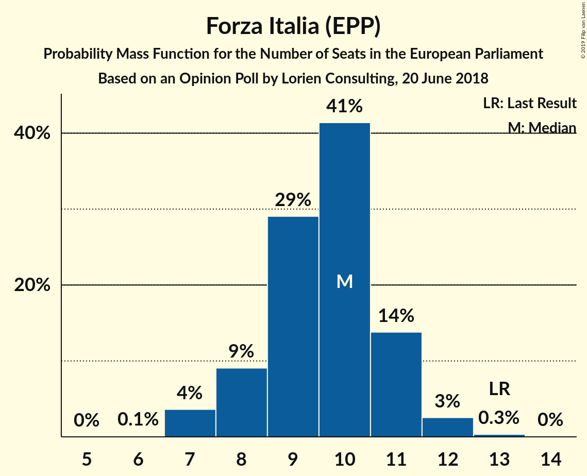

| Number of Seats | Probability | Accumulated | Special Marks |
|:---------------:|:-----------:|:-----------:|:-------------:|
| 6 | 0.1% | 100% |  |
| 7 | 4% | 99.9% |  |
| 8 | 9% | 96% |  |
| 9 | 29% | 87% |  |
| 10 | 41% | 58% | Median |
| 11 | 14% | 17% |  |
| 12 | 3% | 3% |  |
| 13 | 0.3% | 0.4% | Last Result |
| 14 | 0% | 0% |  |

### Fratelli d’Italia (ECR)

*For a full overview of the results for this party, see the [Fratelli d’Italia (ECR)](party-fratellid’italiaecr.html) page.*

| Number of Seats | Probability | Accumulated | Special Marks |
|:---------------:|:-----------:|:-----------:|:-------------:|
| 0 | 28% | 100% | Last Result |
| 1 | 0% | 72% |  |
| 2 | 0% | 72% |  |
| 3 | 2% | 72% |  |
| 4 | 61% | 70% | Median |
| 5 | 6% | 9% |  |
| 6 | 2% | 3% |  |
| 7 | 0.5% | 0.5% |  |
| 8 | 0% | 0% |  |

### Liberi e Uguali (S&D)

*For a full overview of the results for this party, see the [Liberi e Uguali (S&D)](party-liberieugualisd.html) page.*

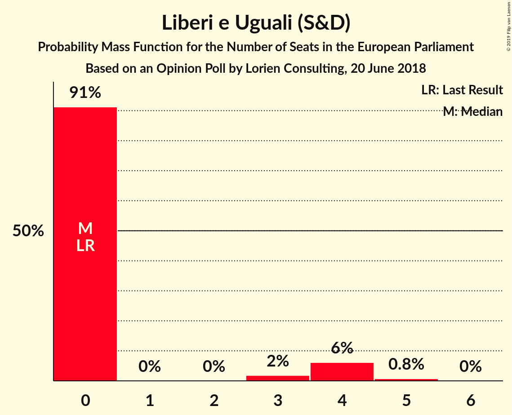

| Number of Seats | Probability | Accumulated | Special Marks |
|:---------------:|:-----------:|:-----------:|:-------------:|
| 0 | 91% | 100% | Last Result, Median |
| 1 | 0% | 9% |  |
| 2 | 0% | 9% |  |
| 3 | 2% | 9% |  |
| 4 | 6% | 7% |  |
| 5 | 0.8% | 0.8% |  |
| 6 | 0% | 0% |  |

### Potere al Popolo (GUE/NGL)

*For a full overview of the results for this party, see the [Potere al Popolo (GUE/NGL)](party-poterealpopologuengl.html) page.*

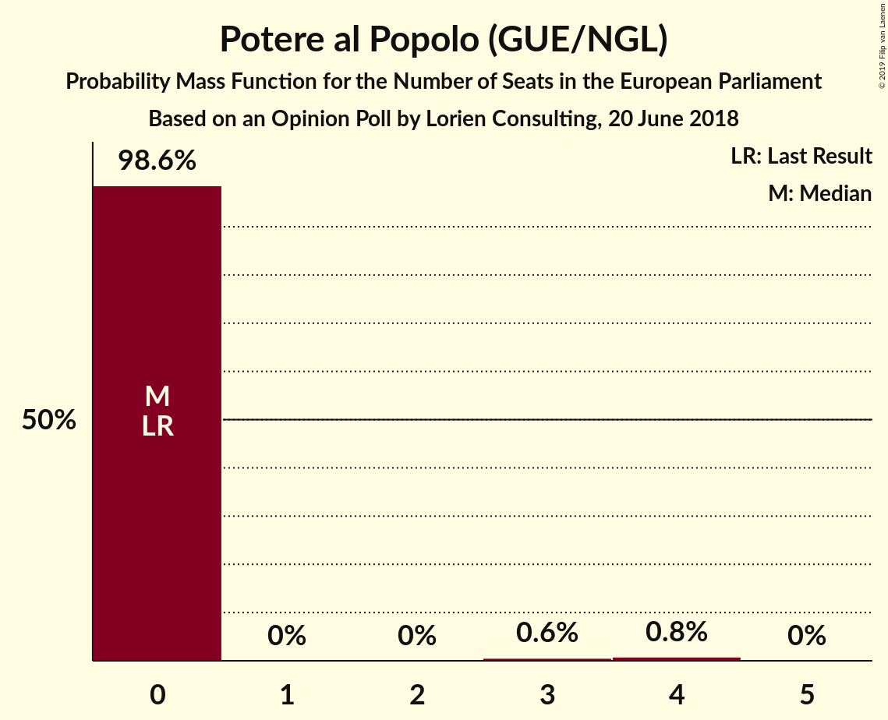

| Number of Seats | Probability | Accumulated | Special Marks |
|:---------------:|:-----------:|:-----------:|:-------------:|
| 0 | 98.6% | 100% | Last Result, Median |
| 1 | 0% | 1.4% |  |
| 2 | 0% | 1.4% |  |
| 3 | 0.6% | 1.4% |  |
| 4 | 0.8% | 0.9% |  |
| 5 | 0% | 0% |  |

### Più Europa (ALDE)

*For a full overview of the results for this party, see the [Più Europa (ALDE)](party-piùeuropaalde.html) page.*

| Number of Seats | Probability | Accumulated | Special Marks |
|:---------------:|:-----------:|:-----------:|:-------------:|
| 0 | 99.9% | 100% | Last Result, Median |
| 1 | 0% | 0.1% |  |
| 2 | 0% | 0.1% |  |
| 3 | 0% | 0.1% |  |
| 4 | 0.1% | 0.1% |  |
| 5 | 0% | 0% |  |

### Noi con l’Italia (EPP)

*For a full overview of the results for this party, see the [Noi con l’Italia (EPP)](party-noiconl’italiaepp.html) page.*

| Number of Seats | Probability | Accumulated | Special Marks |
|:---------------:|:-----------:|:-----------:|:-------------:|
| 0 | 100% | 100% | Last Result, Median |

## Coalitions

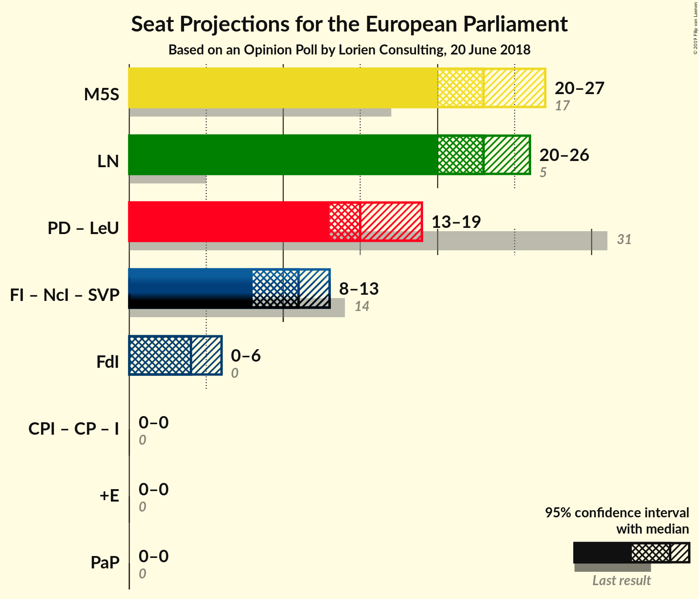

### Confidence Intervals

| Coalition | Last Result | Median | Majority? | 80% Confidence Interval | 90% Confidence Interval | 95% Confidence Interval | 99% Confidence Interval |
|:---------:|:-----------:|:------:|:---------:|:-----------------------:|:-----------------------:|:-----------------------:|:-----------------------:|
| Movimento 5 Stelle (EFDD) | 17 | 23 | 0% | 22–27 | 21–27 | 20–27 | 20–28 |
| Lega Nord (ENF) | 5 | 23 | 0% | 21–25 | 21–26 | 20–26 | 19–27 |
| Partito Democratico (S&D) – Liberi e Uguali (S&D) | 31 | 15 | 0% | 13–17 | 13–19 | 13–19 | 11–21 |
| Fratelli d’Italia (ECR) | 0 | 4 | 0% | 0–4 | 0–5 | 0–6 | 0–7 |
| Più Europa (ALDE) | 0 | 0 | 0% | 0 | 0 | 0 | 0 |
| Potere al Popolo (GUE/NGL) | 0 | 0 | 0% | 0 | 0 | 0 | 0–4 |

### Movimento 5 Stelle (EFDD)

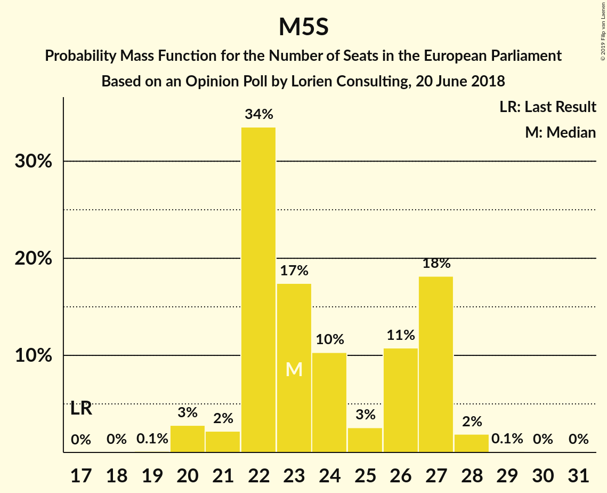

| Number of Seats | Probability | Accumulated | Special Marks |
|:---------------:|:-----------:|:-----------:|:-------------:|
| 17 | 0% | 100% | Last Result |
| 18 | 0% | 100% |  |
| 19 | 0.1% | 100% |  |
| 20 | 3% | 99.8% |  |
| 21 | 2% | 97% |  |
| 22 | 34% | 95% |  |
| 23 | 17% | 61% | Median |
| 24 | 10% | 44% |  |
| 25 | 3% | 34% |  |
| 26 | 11% | 31% |  |
| 27 | 18% | 20% |  |
| 28 | 2% | 2% |  |
| 29 | 0.1% | 0.2% |  |
| 30 | 0% | 0.1% |  |
| 31 | 0% | 0% |  |

### Lega Nord (ENF)

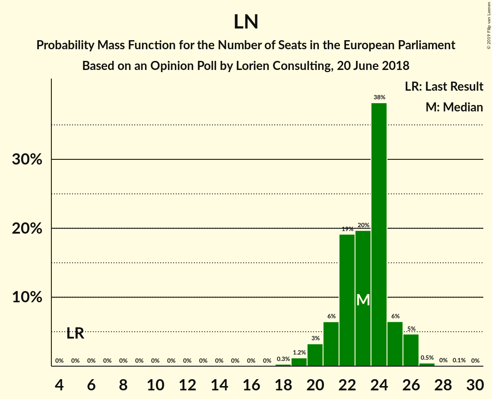

| Number of Seats | Probability | Accumulated | Special Marks |
|:---------------:|:-----------:|:-----------:|:-------------:|
| 5 | 0% | 100% | Last Result |
| 6 | 0% | 100% |  |
| 7 | 0% | 100% |  |
| 8 | 0% | 100% |  |
| 9 | 0% | 100% |  |
| 10 | 0% | 100% |  |
| 11 | 0% | 100% |  |
| 12 | 0% | 100% |  |
| 13 | 0% | 100% |  |
| 14 | 0% | 100% |  |
| 15 | 0% | 100% |  |
| 16 | 0% | 100% |  |
| 17 | 0% | 100% |  |
| 18 | 0.3% | 100% |  |
| 19 | 1.2% | 99.7% |  |
| 20 | 3% | 98% |  |
| 21 | 6% | 95% |  |
| 22 | 19% | 89% |  |
| 23 | 20% | 70% | Median |
| 24 | 38% | 50% |  |
| 25 | 6% | 12% |  |
| 26 | 5% | 5% |  |
| 27 | 0.5% | 0.6% |  |
| 28 | 0% | 0.2% |  |
| 29 | 0.1% | 0.1% |  |
| 30 | 0% | 0% |  |

### Partito Democratico (S&D) – Liberi e Uguali (S&D)

| Number of Seats | Probability | Accumulated | Special Marks |
|:---------------:|:-----------:|:-----------:|:-------------:|
| 11 | 1.2% | 100% |  |
| 12 | 0.6% | 98.8% |  |
| 13 | 10% | 98% |  |
| 14 | 6% | 89% |  |
| 15 | 52% | 83% | Median |
| 16 | 16% | 30% |  |
| 17 | 6% | 14% |  |
| 18 | 3% | 9% |  |
| 19 | 4% | 6% |  |
| 20 | 0.6% | 2% |  |
| 21 | 0.8% | 1.2% |  |
| 22 | 0.4% | 0.4% |  |
| 23 | 0% | 0% |  |
| 24 | 0% | 0% |  |
| 25 | 0% | 0% |  |
| 26 | 0% | 0% |  |
| 27 | 0% | 0% |  |
| 28 | 0% | 0% |  |
| 29 | 0% | 0% |  |
| 30 | 0% | 0% |  |
| 31 | 0% | 0% | Last Result |

### Fratelli d’Italia (ECR)

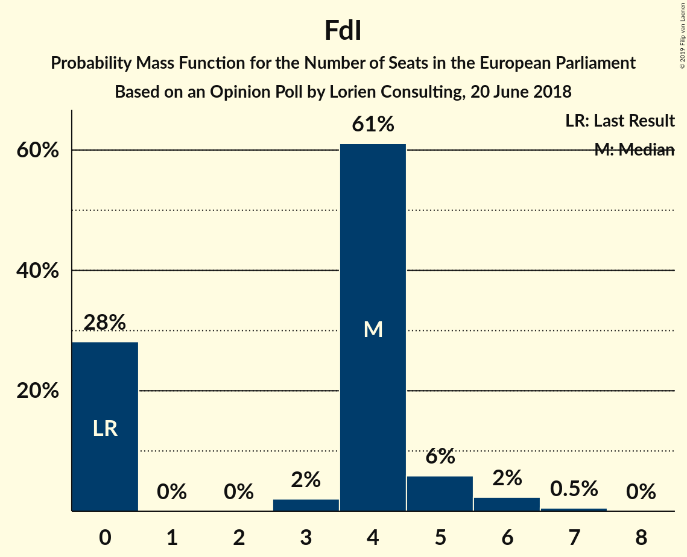

| Number of Seats | Probability | Accumulated | Special Marks |
|:---------------:|:-----------:|:-----------:|:-------------:|
| 0 | 28% | 100% | Last Result |
| 1 | 0% | 72% |  |
| 2 | 0% | 72% |  |
| 3 | 2% | 72% |  |
| 4 | 61% | 70% | Median |
| 5 | 6% | 9% |  |
| 6 | 2% | 3% |  |
| 7 | 0.5% | 0.5% |  |
| 8 | 0% | 0% |  |

### Più Europa (ALDE)

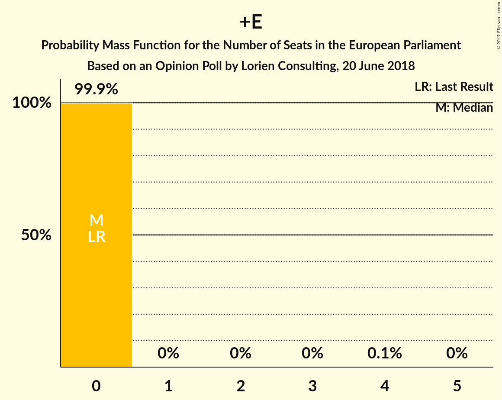

| Number of Seats | Probability | Accumulated | Special Marks |
|:---------------:|:-----------:|:-----------:|:-------------:|
| 0 | 99.9% | 100% | Last Result, Median |
| 1 | 0% | 0.1% |  |
| 2 | 0% | 0.1% |  |
| 3 | 0% | 0.1% |  |
| 4 | 0.1% | 0.1% |  |
| 5 | 0% | 0% |  |

### Potere al Popolo (GUE/NGL)

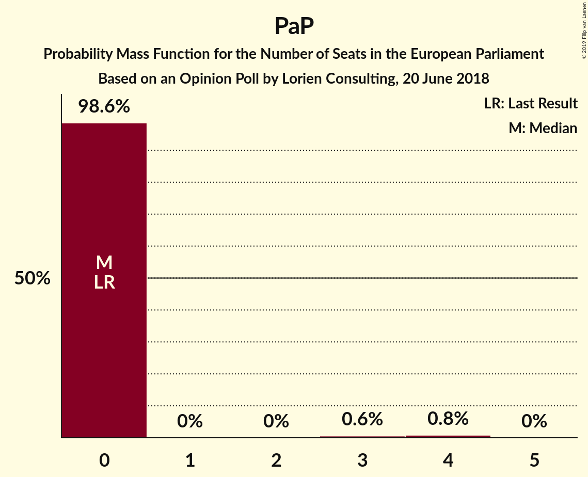

| Number of Seats | Probability | Accumulated | Special Marks |
|:---------------:|:-----------:|:-----------:|:-------------:|
| 0 | 98.6% | 100% | Last Result, Median |
| 1 | 0% | 1.4% |  |
| 2 | 0% | 1.4% |  |
| 3 | 0.6% | 1.4% |  |
| 4 | 0.8% | 0.9% |  |
| 5 | 0% | 0% |  |

## Technical Information

### Opinion Poll

+ **Polling firm:** Lorien Consulting
+ **Commissioner(s):** —
+ **Fieldwork period:** 20 June 2018

### Calculations

+ **Sample size:** 500
+ **Simulations done:** 131,072
+ **Error estimate:** 2.73%

