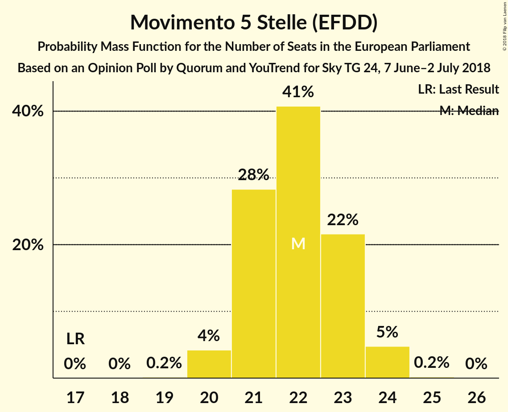
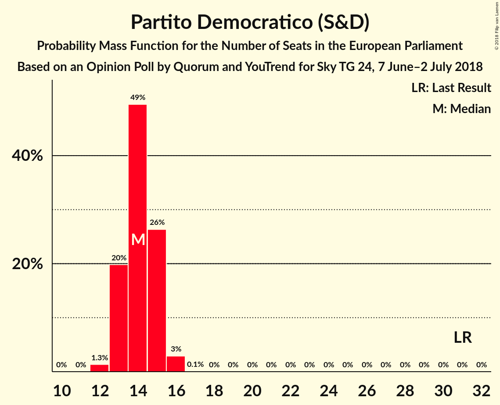

# Opinion Poll by Quorum and YouTrend for Sky TG 24, 7 June–2 July 2018

<a href="#voting-intentions">Voting Intentions</a> | <a href="#seats">Seats</a> | <a href="#coalitions">Coalitions</a> | <a href="#technical-information">Technical Information</a>

## Voting Intentions

### Confidence Intervals

| Party | Last Result | Poll Result | 80% Confidence Interval | 90% Confidence Interval | 95% Confidence Interval | 99% Confidence Interval |
|:-----:|:-----------:|:-----------:|:-----------------------:|:-----------------------:|:-----------------------:|:-----------------------:|
| Movimento 5 Stelle (EFDD) | 21.2% | 28.1% | 26.9–29.4% |26.6–29.7% |26.2–30.0% |25.7–30.7% |
| Lega Nord (ENF) | 6.2% | 27.7% | 26.5–29.0% |26.1–29.3% |25.8–29.6% |25.3–30.2% |
| Partito Democratico (S&D) | 40.8% | 19.3% | 18.2–20.4% |18.0–20.7% |17.7–21.0% |17.2–21.6% |
| Forza Italia (EPP) | 16.8% | 9.9% | 9.1–10.8% |8.9–11.0% |8.7–11.2% |8.4–11.7% |
| Fratelli d’Italia (*) | 3.7% | 4.0% | 3.5–4.6% |3.4–4.8% |3.2–4.9% |3.0–5.2% |
| Noi con l’Italia (EPP) | 0.0% | 0.9% | 0.7–1.2% |0.6–1.3% |0.6–1.4% |0.5–1.6% |

*Note:* The poll result column reflects the actual value used in the calculations. Published results may vary slightly, and in addition be rounded to fewer digits.

## Seats

### Confidence Intervals

| Party | Last Result | Median | 80% Confidence Interval | 90% Confidence Interval | 95% Confidence Interval | 99% Confidence Interval |
|:-----:|:-----------:|:------:|:-----------------------:|:-----------------------:|:-----------------------:|:-----------------------:|
| <a href="#movimento-5-stelle-(efdd)">Movimento 5 Stelle (EFDD)</a> | 17 | 22 | 21–23 |21–23 |20–24 |20–24 |
| <a href="#lega-nord-(enf)">Lega Nord (ENF)</a> | 5 | 22 | 20–23 |20–23 |20–23 |19–24 |
| <a href="#partito-democratico-(s&d)">Partito Democratico (S&D)</a> | 31 | 14 | 13–15 |13–15 |13–16 |12–16 |
| <a href="#forza-italia-(epp)">Forza Italia (EPP)</a> | 13 | 8 | 7–9 |7–9 |7–9 |6–9 |
| <a href="#fratelli-d’italia-(*)">Fratelli d’Italia (*)</a> | 0 | 0 | 0–4 |0–4 |0–4 |0–4 |
| <a href="#noi-con-l’italia-(epp)">Noi con l’Italia (EPP)</a> | 0 | 0 | 0 |0 |0 |0 |

### Movimento 5 Stelle (EFDD)

*For a full overview of the results for this party, see the [Movimento 5 Stelle (EFDD)](party-movimento5stelleefdd.html) page.*

| Number of Seats | Probability | Accumulated | Special Marks |
|:---------------:|:-----------:|:-----------:|:-------------:|
| 17 | 0% | 100% | Last Result |
| 18 | 0% | 100% |  |
| 19 | 0.1% | 100% |  |
| 20 | 4% | 99.9% |  |
| 21 | 24% | 96% |  |
| 22 | 43% | 71% | Median |
| 23 | 25% | 29% |  |
| 24 | 4% | 4% |  |
| 25 | 0.2% | 0.2% |  |
| 26 | 0% | 0% |  |

### Lega Nord (ENF)

*For a full overview of the results for this party, see the [Lega Nord (ENF)](party-leganordenf.html) page.*

| Number of Seats | Probability | Accumulated | Special Marks |
|:---------------:|:-----------:|:-----------:|:-------------:|
| 5 | 0% | 100% | Last Result |
| 6 | 0% | 100% |  |
| 7 | 0% | 100% |  |
| 8 | 0% | 100% |  |
| 9 | 0% | 100% |  |
| 10 | 0% | 100% |  |
| 11 | 0% | 100% |  |
| 12 | 0% | 100% |  |
| 13 | 0% | 100% |  |
| 14 | 0% | 100% |  |
| 15 | 0% | 100% |  |
| 16 | 0% | 100% |  |
| 17 | 0% | 100% |  |
| 18 | 0% | 100% |  |
| 19 | 0.8% | 100% |  |
| 20 | 12% | 99.2% |  |
| 21 | 25% | 87% |  |
| 22 | 51% | 62% | Median |
| 23 | 9% | 11% |  |
| 24 | 2% | 2% |  |
| 25 | 0% | 0% |  |

### Partito Democratico (S&D)

*For a full overview of the results for this party, see the [Partito Democratico (S&D)](party-partitodemocraticosd.html) page.*

| Number of Seats | Probability | Accumulated | Special Marks |
|:---------------:|:-----------:|:-----------:|:-------------:|
| 12 | 1.1% | 100% |  |
| 13 | 21% | 98.9% |  |
| 14 | 49% | 78% | Median |
| 15 | 25% | 29% |  |
| 16 | 3% | 3% |  |
| 17 | 0.1% | 0.1% |  |
| 18 | 0% | 0% |  |
| 19 | 0% | 0% |  |
| 20 | 0% | 0% |  |
| 21 | 0% | 0% |  |
| 22 | 0% | 0% |  |
| 23 | 0% | 0% |  |
| 24 | 0% | 0% |  |
| 25 | 0% | 0% |  |
| 26 | 0% | 0% |  |
| 27 | 0% | 0% |  |
| 28 | 0% | 0% |  |
| 29 | 0% | 0% |  |
| 30 | 0% | 0% |  |
| 31 | 0% | 0% | Last Result |

### Forza Italia (EPP)

*For a full overview of the results for this party, see the [Forza Italia (EPP)](party-forzaitaliaepp.html) page.*

| Number of Seats | Probability | Accumulated | Special Marks |
|:---------------:|:-----------:|:-----------:|:-------------:|
| 6 | 0.6% | 100% |  |
| 7 | 29% | 99.4% |  |
| 8 | 60% | 71% | Median |
| 9 | 10% | 10% |  |
| 10 | 0.1% | 0.1% |  |
| 11 | 0% | 0% |  |
| 12 | 0% | 0% |  |
| 13 | 0% | 0% | Last Result |

### Fratelli d’Italia (*)

*For a full overview of the results for this party, see the [Fratelli d’Italia (*)](party-fratellid’italia.html) page.*

| Number of Seats | Probability | Accumulated | Special Marks |
|:---------------:|:-----------:|:-----------:|:-------------:|
| 0 | 52% | 100% | Last Result, Median |
| 1 | 0% | 48% |  |
| 2 | 0% | 48% |  |
| 3 | 37% | 48% |  |
| 4 | 11% | 11% |  |
| 5 | 0% | 0% |  |

### Noi con l’Italia (EPP)

*For a full overview of the results for this party, see the [Noi con l’Italia (EPP)](party-noiconl’italiaepp.html) page.*

| Number of Seats | Probability | Accumulated | Special Marks |
|:---------------:|:-----------:|:-----------:|:-------------:|
| 0 | 100% | 100% | Last Result, Median |

## Coalitions

### Confidence Intervals

| Coalition | Last Result | Median | Majority? | 80% Confidence Interval | 90% Confidence Interval | 95% Confidence Interval | 99% Confidence Interval |
|:---------:|:-----------:|:------:|:---------:|:-----------------------:|:-----------------------:|:-----------------------:|:-----------------------:|
| Movimento 5 Stelle (EFDD) | 17 | 22 | 0% | 21–23 | 21–23 | 20–24 | 20–24 |
| Lega Nord (ENF) | 5 | 22 | 0% | 20–23 | 20–23 | 20–23 | 19–24 |

### Movimento 5 Stelle (EFDD)

| Number of Seats | Probability | Accumulated | Special Marks |
|:---------------:|:-----------:|:-----------:|:-------------:|
| 17 | 0% | 100% | Last Result |
| 18 | 0% | 100% |  |
| 19 | 0.1% | 100% |  |
| 20 | 4% | 99.9% |  |
| 21 | 24% | 96% |  |
| 22 | 43% | 71% | Median |
| 23 | 25% | 29% |  |
| 24 | 4% | 4% |  |
| 25 | 0.2% | 0.2% |  |
| 26 | 0% | 0% |  |

### Lega Nord (ENF)

| Number of Seats | Probability | Accumulated | Special Marks |
|:---------------:|:-----------:|:-----------:|:-------------:|
| 5 | 0% | 100% | Last Result |
| 6 | 0% | 100% |  |
| 7 | 0% | 100% |  |
| 8 | 0% | 100% |  |
| 9 | 0% | 100% |  |
| 10 | 0% | 100% |  |
| 11 | 0% | 100% |  |
| 12 | 0% | 100% |  |
| 13 | 0% | 100% |  |
| 14 | 0% | 100% |  |
| 15 | 0% | 100% |  |
| 16 | 0% | 100% |  |
| 17 | 0% | 100% |  |
| 18 | 0% | 100% |  |
| 19 | 0.8% | 100% |  |
| 20 | 12% | 99.2% |  |
| 21 | 25% | 87% |  |
| 22 | 51% | 62% | Median |
| 23 | 9% | 11% |  |
| 24 | 2% | 2% |  |
| 25 | 0% | 0% |  |

## Technical Information

### Opinion Poll

+ **Polling firm:** Quorum and YouTrend
+ **Commissioner(s):** Sky TG 24
+ **Fieldwork period:** 7 June–2 July 2018

### Calculations

+ **Sample size:** 2181
+ **Simulations done:** 131,072
+ **Error estimate:** 0.37%

