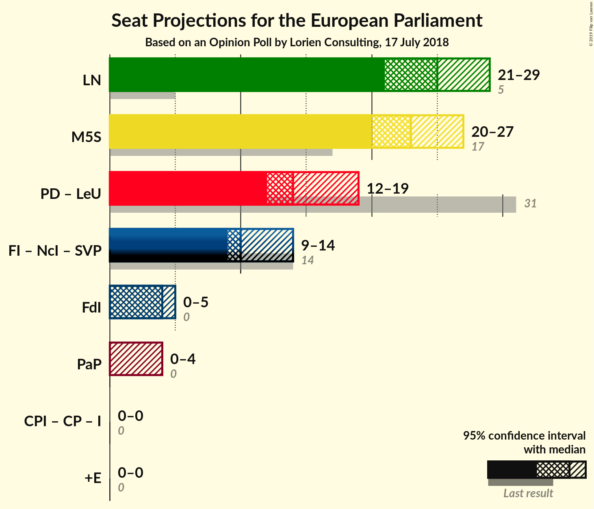
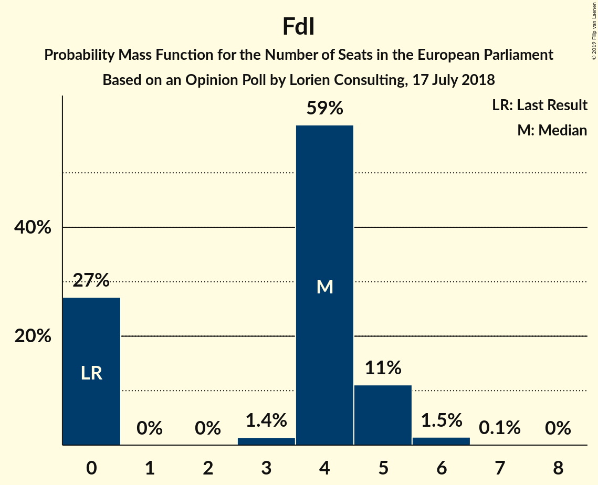

# Opinion Poll by Lorien Consulting, 17 July 2018

<a href="#voting-intentions">Voting Intentions</a> | <a href="#seats">Seats</a> | <a href="#coalitions">Coalitions</a> | <a href="#technical-information">Technical Information</a>

## Voting Intentions

### Confidence Intervals

| Party | Last Result | Poll Result | 80% Confidence Interval | 90% Confidence Interval | 95% Confidence Interval | 99% Confidence Interval |
|:-----:|:-----------:|:-----------:|:-----------------------:|:-----------------------:|:-----------------------:|:-----------------------:|
| Lega Nord (ENF) | 6.2% | 28.2% | 25.7–30.9% |25.0–31.6% |24.4–32.3% |23.3–33.6% |
| Movimento 5 Stelle (EFDD) | 21.2% | 28.0% | 25.5–30.7% |24.8–31.4% |24.2–32.1% |23.1–33.4% |
| Partito Democratico (S&D) | 40.8% | 17.8% | 15.8–20.1% |15.2–20.8% |14.7–21.4% |13.8–22.6% |
| Forza Italia (EPP) | 16.8% | 11.4% | 9.8–13.4% |9.3–14.0% |8.9–14.5% |8.2–15.5% |
| Fratelli d’Italia (ECR) | 3.7% | 4.2% | 3.2–5.6% |3.0–6.0% |2.8–6.3% |2.4–7.1% |
| Liberi e Uguali (S&D) | 0.0% | 3.6% | 2.7–4.9% |2.5–5.3% |2.3–5.6% |1.9–6.3% |
| Potere al Popolo (GUE/NGL) | 0.0% | 2.6% | 1.9–3.8% |1.7–4.1% |1.5–4.4% |1.2–5.0% |
| Più Europa (ALDE) | 0.0% | 2.0% | 1.4–3.1% |1.2–3.4% |1.1–3.6% |0.9–4.2% |
| Noi con l’Italia (EPP) | 0.0% | 0.6% | 0.3–1.3% |0.3–1.6% |0.2–1.8% |0.1–2.2% |

*Note:* The poll result column reflects the actual value used in the calculations. Published results may vary slightly, and in addition be rounded to fewer digits.

## Seats

### Confidence Intervals

| Party | Last Result | Median | 80% Confidence Interval | 90% Confidence Interval | 95% Confidence Interval | 99% Confidence Interval |
|:-----:|:-----------:|:------:|:-----------------------:|:-----------------------:|:-----------------------:|:-----------------------:|
| <a href="#lega-nord-(enf)">Lega Nord (ENF)</a> | 5 | 24 | 22–24 |22–24 |21–24 |19–24 |
| <a href="#movimento-5-stelle-(efdd)">Movimento 5 Stelle (EFDD)</a> | 17 | 20 | 20–21 |20–21 |20–24 |18–26 |
| <a href="#partito-democratico-(s&d)">Partito Democratico (S&D)</a> | 31 | 13 | 13 |13 |13–14 |10–17 |
| <a href="#forza-italia-(epp)">Forza Italia (EPP)</a> | 13 | 8 | 8–9 |8–9 |8–10 |8–10 |
| <a href="#fratelli-d’italia-(ecr)">Fratelli d’Italia (ECR)</a> | 0 | 3 | 3–6 |3–6 |3–6 |0–6 |
| <a href="#liberi-e-uguali-(s&d)">Liberi e Uguali (S&D)</a> | 0 | 4 | 4 |0–4 |0–4 |0–6 |
| <a href="#potere-al-popolo-(gue/ngl)">Potere al Popolo (GUE/NGL)</a> | 0 | 0 | 0 |0–3 |0–4 |0–5 |
| <a href="#più-europa-(alde)">Più Europa (ALDE)</a> | 0 | 3 | 0–3 |0–3 |0–3 |0–3 |
| <a href="#noi-con-l’italia-(epp)">Noi con l’Italia (EPP)</a> | 0 | 0 | 0 |0 |0 |0 |

### Lega Nord (ENF)

*For a full overview of the results for this party, see the [Lega Nord (ENF)](party-leganordenf.html) page.*

| Number of Seats | Probability | Accumulated | Special Marks |
|:---------------:|:-----------:|:-----------:|:-------------:|
| 5 | 0% | 100% | Last Result |
| 6 | 0% | 100% |  |
| 7 | 0% | 100% |  |
| 8 | 0% | 100% |  |
| 9 | 0% | 100% |  |
| 10 | 0% | 100% |  |
| 11 | 0% | 100% |  |
| 12 | 0% | 100% |  |
| 13 | 0% | 100% |  |
| 14 | 0% | 100% |  |
| 15 | 0% | 100% |  |
| 16 | 0% | 100% |  |
| 17 | 0% | 100% |  |
| 18 | 0% | 100% |  |
| 19 | 0.5% | 100% |  |
| 20 | 2% | 99.5% |  |
| 21 | 2% | 98% |  |
| 22 | 13% | 96% |  |
| 23 | 0.5% | 84% |  |
| 24 | 83% | 83% | Median |
| 25 | 0.4% | 0.5% |  |
| 26 | 0% | 0.1% |  |
| 27 | 0% | 0.1% |  |
| 28 | 0% | 0% |  |

### Movimento 5 Stelle (EFDD)

*For a full overview of the results for this party, see the [Movimento 5 Stelle (EFDD)](party-movimento5stelleefdd.html) page.*

| Number of Seats | Probability | Accumulated | Special Marks |
|:---------------:|:-----------:|:-----------:|:-------------:|
| 17 | 0.1% | 100% | Last Result |
| 18 | 0.5% | 99.9% |  |
| 19 | 0.1% | 99.4% |  |
| 20 | 80% | 99.4% | Median |
| 21 | 16% | 19% |  |
| 22 | 0.2% | 3% |  |
| 23 | 0% | 3% |  |
| 24 | 1.1% | 3% |  |
| 25 | 0% | 2% |  |
| 26 | 2% | 2% |  |
| 27 | 0% | 0.1% |  |
| 28 | 0% | 0.1% |  |
| 29 | 0% | 0% |  |

### Partito Democratico (S&D)

*For a full overview of the results for this party, see the [Partito Democratico (S&D)](party-partitodemocraticosd.html) page.*

| Number of Seats | Probability | Accumulated | Special Marks |
|:---------------:|:-----------:|:-----------:|:-------------:|
| 10 | 2% | 100% |  |
| 11 | 0.2% | 98% |  |
| 12 | 0.4% | 98% |  |
| 13 | 95% | 98% | Median |
| 14 | 0.7% | 3% |  |
| 15 | 0.4% | 2% |  |
| 16 | 0.4% | 2% |  |
| 17 | 1.5% | 2% |  |
| 18 | 0% | 0.1% |  |
| 19 | 0% | 0% |  |
| 20 | 0% | 0% |  |
| 21 | 0% | 0% |  |
| 22 | 0% | 0% |  |
| 23 | 0% | 0% |  |
| 24 | 0% | 0% |  |
| 25 | 0% | 0% |  |
| 26 | 0% | 0% |  |
| 27 | 0% | 0% |  |
| 28 | 0% | 0% |  |
| 29 | 0% | 0% |  |
| 30 | 0% | 0% |  |
| 31 | 0% | 0% | Last Result |

### Forza Italia (EPP)

*For a full overview of the results for this party, see the [Forza Italia (EPP)](party-forzaitaliaepp.html) page.*

| Number of Seats | Probability | Accumulated | Special Marks |
|:---------------:|:-----------:|:-----------:|:-------------:|
| 6 | 0.3% | 100% |  |
| 7 | 0.1% | 99.7% |  |
| 8 | 82% | 99.6% | Median |
| 9 | 14% | 17% |  |
| 10 | 3% | 3% |  |
| 11 | 0% | 0.4% |  |
| 12 | 0.1% | 0.3% |  |
| 13 | 0.1% | 0.3% | Last Result |
| 14 | 0% | 0.2% |  |
| 15 | 0.2% | 0.2% |  |
| 16 | 0% | 0% |  |

### Fratelli d’Italia (ECR)

*For a full overview of the results for this party, see the [Fratelli d’Italia (ECR)](party-fratellid’italiaecr.html) page.*

| Number of Seats | Probability | Accumulated | Special Marks |
|:---------------:|:-----------:|:-----------:|:-------------:|
| 0 | 1.3% | 100% | Last Result |
| 1 | 0% | 98.7% |  |
| 2 | 0% | 98.7% |  |
| 3 | 81% | 98.7% | Median |
| 4 | 4% | 18% |  |
| 5 | 2% | 14% |  |
| 6 | 12% | 13% |  |
| 7 | 0% | 0% |  |

### Liberi e Uguali (S&D)

*For a full overview of the results for this party, see the [Liberi e Uguali (S&D)](party-liberieugualisd.html) page.*

| Number of Seats | Probability | Accumulated | Special Marks |
|:---------------:|:-----------:|:-----------:|:-------------:|
| 0 | 6% | 100% | Last Result |
| 1 | 0% | 94% |  |
| 2 | 0% | 94% |  |
| 3 | 0.2% | 94% |  |
| 4 | 93% | 94% | Median |
| 5 | 0.2% | 0.9% |  |
| 6 | 0.7% | 0.7% |  |
| 7 | 0% | 0% |  |

### Potere al Popolo (GUE/NGL)

*For a full overview of the results for this party, see the [Potere al Popolo (GUE/NGL)](party-poterealpopologuengl.html) page.*

| Number of Seats | Probability | Accumulated | Special Marks |
|:---------------:|:-----------:|:-----------:|:-------------:|
| 0 | 95% | 100% | Last Result, Median |
| 1 | 0% | 5% |  |
| 2 | 0% | 5% |  |
| 3 | 1.5% | 5% |  |
| 4 | 2% | 4% |  |
| 5 | 2% | 2% |  |
| 6 | 0% | 0% |  |

### Più Europa (ALDE)

*For a full overview of the results for this party, see the [Più Europa (ALDE)](party-piùeuropaalde.html) page.*

| Number of Seats | Probability | Accumulated | Special Marks |
|:---------------:|:-----------:|:-----------:|:-------------:|
| 0 | 19% | 100% | Last Result |
| 1 | 0% | 81% |  |
| 2 | 0% | 81% |  |
| 3 | 81% | 81% | Median |
| 4 | 0.1% | 0.1% |  |
| 5 | 0.1% | 0.1% |  |
| 6 | 0% | 0% |  |

### Noi con l’Italia (EPP)

*For a full overview of the results for this party, see the [Noi con l’Italia (EPP)](party-noiconl’italiaepp.html) page.*

| Number of Seats | Probability | Accumulated | Special Marks |
|:---------------:|:-----------:|:-----------:|:-------------:|
| 0 | 100% | 100% | Last Result, Median |

## Coalitions

### Confidence Intervals

| Coalition | Last Result | Median | Majority? | 80% Confidence Interval | 90% Confidence Interval | 95% Confidence Interval | 99% Confidence Interval |
|:---------:|:-----------:|:------:|:---------:|:-----------------------:|:-----------------------:|:-----------------------:|:-----------------------:|
| Lega Nord (ENF) | 5 | 24 | 0% | 22–24 | 22–24 | 21–24 | 19–24 |
| Movimento 5 Stelle (EFDD) | 17 | 20 | 0% | 20–21 | 20–21 | 20–24 | 18–26 |
| Partito Democratico (S&D) – Liberi e Uguali (S&D) | 31 | 17 | 0% | 17 | 17 | 13–17 | 10–21 |
| Fratelli d’Italia (ECR) | 0 | 3 | 0% | 3–6 | 3–6 | 3–6 | 0–6 |
| Potere al Popolo (GUE/NGL) | 0 | 0 | 0% | 0 | 0–3 | 0–4 | 0–5 |
| Più Europa (ALDE) | 0 | 3 | 0% | 0–3 | 0–3 | 0–3 | 0–3 |

### Lega Nord (ENF)

| Number of Seats | Probability | Accumulated | Special Marks |
|:---------------:|:-----------:|:-----------:|:-------------:|
| 5 | 0% | 100% | Last Result |
| 6 | 0% | 100% |  |
| 7 | 0% | 100% |  |
| 8 | 0% | 100% |  |
| 9 | 0% | 100% |  |
| 10 | 0% | 100% |  |
| 11 | 0% | 100% |  |
| 12 | 0% | 100% |  |
| 13 | 0% | 100% |  |
| 14 | 0% | 100% |  |
| 15 | 0% | 100% |  |
| 16 | 0% | 100% |  |
| 17 | 0% | 100% |  |
| 18 | 0% | 100% |  |
| 19 | 0.5% | 100% |  |
| 20 | 2% | 99.5% |  |
| 21 | 2% | 98% |  |
| 22 | 13% | 96% |  |
| 23 | 0.5% | 84% |  |
| 24 | 83% | 83% | Median |
| 25 | 0.4% | 0.5% |  |
| 26 | 0% | 0.1% |  |
| 27 | 0% | 0.1% |  |
| 28 | 0% | 0% |  |

### Movimento 5 Stelle (EFDD)

| Number of Seats | Probability | Accumulated | Special Marks |
|:---------------:|:-----------:|:-----------:|:-------------:|
| 17 | 0.1% | 100% | Last Result |
| 18 | 0.5% | 99.9% |  |
| 19 | 0.1% | 99.4% |  |
| 20 | 80% | 99.4% | Median |
| 21 | 16% | 19% |  |
| 22 | 0.2% | 3% |  |
| 23 | 0% | 3% |  |
| 24 | 1.1% | 3% |  |
| 25 | 0% | 2% |  |
| 26 | 2% | 2% |  |
| 27 | 0% | 0.1% |  |
| 28 | 0% | 0.1% |  |
| 29 | 0% | 0% |  |

### Partito Democratico (S&D) – Liberi e Uguali (S&D)

| Number of Seats | Probability | Accumulated | Special Marks |
|:---------------:|:-----------:|:-----------:|:-------------:|
| 10 | 1.5% | 100% |  |
| 11 | 0.1% | 98% |  |
| 12 | 0.2% | 98% |  |
| 13 | 2% | 98% |  |
| 14 | 0.2% | 96% |  |
| 15 | 0% | 96% |  |
| 16 | 0.1% | 96% |  |
| 17 | 94% | 96% | Median |
| 18 | 0.7% | 1.5% |  |
| 19 | 0% | 0.7% |  |
| 20 | 0% | 0.7% |  |
| 21 | 0.3% | 0.7% |  |
| 22 | 0.4% | 0.5% |  |
| 23 | 0.1% | 0.1% |  |
| 24 | 0% | 0% |  |
| 25 | 0% | 0% |  |
| 26 | 0% | 0% |  |
| 27 | 0% | 0% |  |
| 28 | 0% | 0% |  |
| 29 | 0% | 0% |  |
| 30 | 0% | 0% |  |
| 31 | 0% | 0% | Last Result |

### Fratelli d’Italia (ECR)

| Number of Seats | Probability | Accumulated | Special Marks |
|:---------------:|:-----------:|:-----------:|:-------------:|
| 0 | 1.3% | 100% | Last Result |
| 1 | 0% | 98.7% |  |
| 2 | 0% | 98.7% |  |
| 3 | 81% | 98.7% | Median |
| 4 | 4% | 18% |  |
| 5 | 2% | 14% |  |
| 6 | 12% | 13% |  |
| 7 | 0% | 0% |  |

### Potere al Popolo (GUE/NGL)

| Number of Seats | Probability | Accumulated | Special Marks |
|:---------------:|:-----------:|:-----------:|:-------------:|
| 0 | 95% | 100% | Last Result, Median |
| 1 | 0% | 5% |  |
| 2 | 0% | 5% |  |
| 3 | 1.5% | 5% |  |
| 4 | 2% | 4% |  |
| 5 | 2% | 2% |  |
| 6 | 0% | 0% |  |

### Più Europa (ALDE)

| Number of Seats | Probability | Accumulated | Special Marks |
|:---------------:|:-----------:|:-----------:|:-------------:|
| 0 | 19% | 100% | Last Result |
| 1 | 0% | 81% |  |
| 2 | 0% | 81% |  |
| 3 | 81% | 81% | Median |
| 4 | 0.1% | 0.1% |  |
| 5 | 0.1% | 0.1% |  |
| 6 | 0% | 0% |  |

## Technical Information

### Opinion Poll

+ **Polling firm:** Lorien Consulting
+ **Commissioner(s):** —
+ **Fieldwork period:** 17 July 2018

### Calculations

+ **Sample size:** 500
+ **Simulations done:** 1,024
+ **Error estimate:** 2.61%

