# Opinion Poll by Lorien Consulting, 24–27 August 2018

<a href="#voting-intentions">Voting Intentions</a> | <a href="#seats">Seats</a> | <a href="#coalitions">Coalitions</a> | <a href="#technical-information">Technical Information</a>

## Voting Intentions

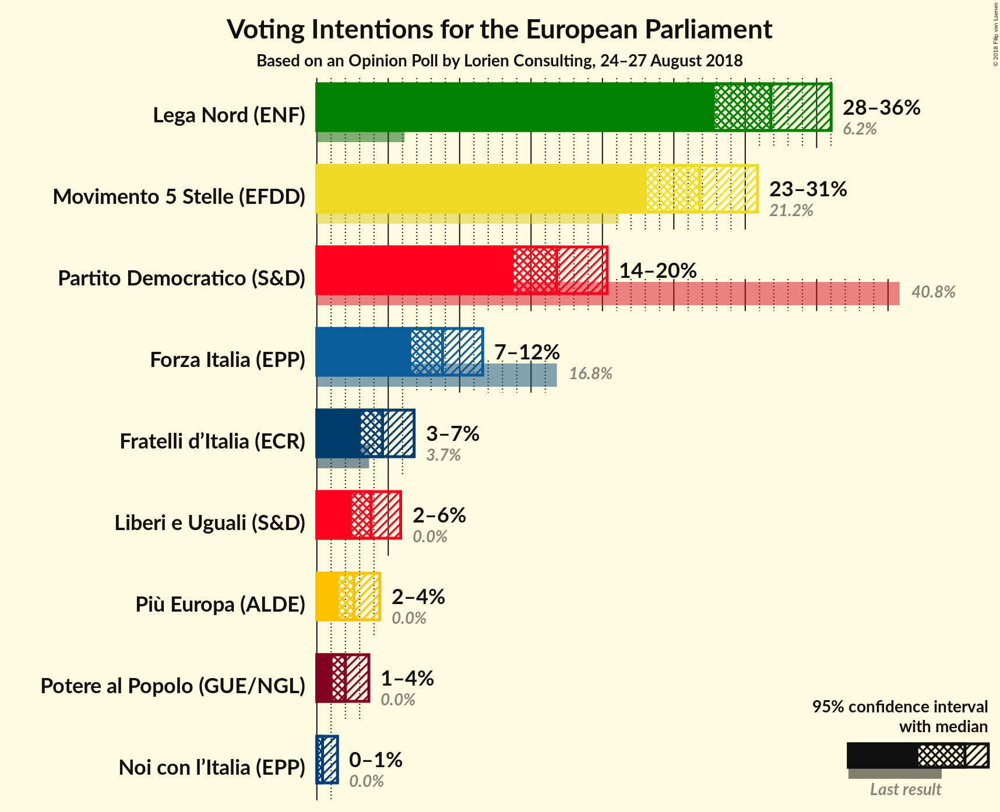

### Confidence Intervals

| Party | Last Result | Poll Result | 80% Confidence Interval | 90% Confidence Interval | 95% Confidence Interval | 99% Confidence Interval |
|:-----:|:-----------:|:-----------:|:-----------------------:|:-----------------------:|:-----------------------:|:-----------------------:|
| Lega Nord (ENF) | 6.2% | 31.8% | 29.2–34.6% |28.5–35.3% |27.9–36.0% |26.7–37.4% |
| Movimento 5 Stelle (EFDD) | 21.2% | 26.8% | 24.4–29.4% |23.7–30.2% |23.1–30.9% |22.0–32.2% |
| Partito Democratico (S&D) | 40.8% | 16.8% | 14.8–19.1% |14.3–19.8% |13.8–20.3% |12.9–21.5% |
| Forza Italia (EPP) | 16.8% | 8.8% | 7.4–10.6% |7.0–11.2% |6.6–11.6% |6.0–12.6% |
| Fratelli d’Italia (*) | 3.7% | 4.6% | 3.6–6.0% |3.3–6.4% |3.1–6.8% |2.7–7.6% |
| Liberi e Uguali (S&D) | 0.0% | 3.8% | 2.9–5.1% |2.7–5.5% |2.5–5.9% |2.1–6.6% |
| Più Europa (ALDE) | 0.0% | 2.6% | 1.9–3.8% |1.7–4.1% |1.5–4.4% |1.2–5.0% |
| Potere al Popolo (GUE/NGL) | 0.0% | 2.0% | 1.4–3.1% |1.2–3.4% |1.1–3.6% |0.9–4.2% |
| Noi con l’Italia (EPP) | 0.0% | 0.4% | 0.2–1.1% |0.2–1.3% |0.1–1.4% |0.1–1.8% |

*Note:* The poll result column reflects the actual value used in the calculations. Published results may vary slightly, and in addition be rounded to fewer digits.

## Seats

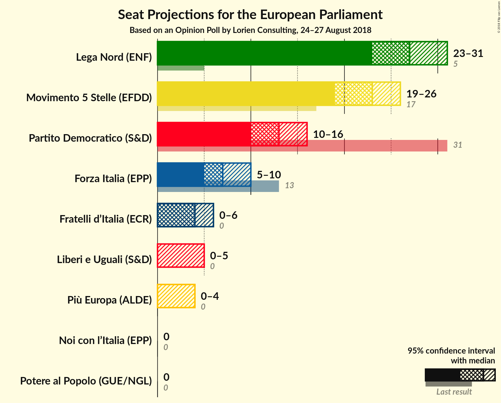

### Confidence Intervals

| Party | Last Result | Median | 80% Confidence Interval | 90% Confidence Interval | 95% Confidence Interval | 99% Confidence Interval |
|:-----:|:-----------:|:------:|:-----------------------:|:-----------------------:|:-----------------------:|:-----------------------:|
| <a href="#lega-nord-(enf)">Lega Nord (ENF)</a> | 5 | 27 | 24–29 |23–30 |23–31 |22–32 |
| <a href="#movimento-5-stelle-(efdd)">Movimento 5 Stelle (EFDD)</a> | 17 | 23 | 20–25 |19–26 |19–26 |18–28 |
| <a href="#partito-democratico-(s&d)">Partito Democratico (S&D)</a> | 31 | 13 | 11–15 |11–16 |10–16 |10–17 |
| <a href="#forza-italia-(epp)">Forza Italia (EPP)</a> | 13 | 7 | 6–9 |6–10 |5–10 |5–11 |
| <a href="#fratelli-d’italia-(*)">Fratelli d’Italia (*)</a> | 0 | 4 | 0–5 |0–5 |0–6 |0–6 |
| <a href="#liberi-e-uguali-(s&d)">Liberi e Uguali (S&D)</a> | 0 | 0 | 0–4 |0–4 |0–5 |0–6 |
| <a href="#più-europa-(alde)">Più Europa (ALDE)</a> | 0 | 0 | 0 |0–3 |0–4 |0–4 |
| <a href="#potere-al-popolo-(gue/ngl)">Potere al Popolo (GUE/NGL)</a> | 0 | 0 | 0 |0 |0 |0–4 |
| <a href="#noi-con-l’italia-(epp)">Noi con l’Italia (EPP)</a> | 0 | 0 | 0 |0 |0 |0 |

### Lega Nord (ENF)

*For a full overview of the results for this party, see the [Lega Nord (ENF)](party-leganordenf.html) page.*

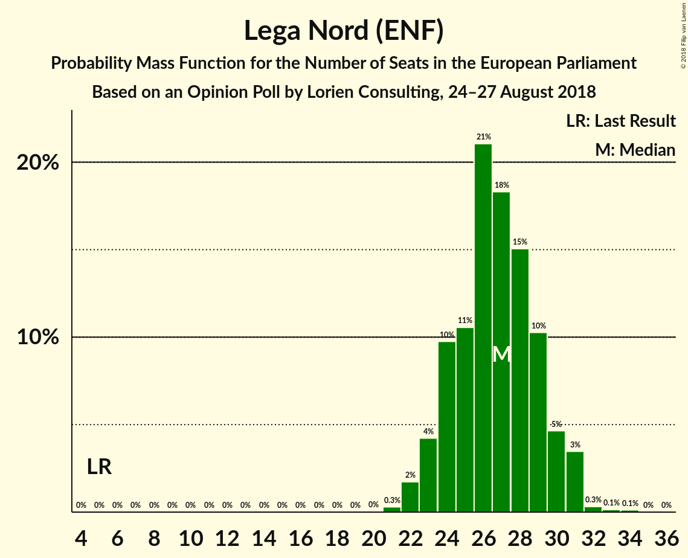

| Number of Seats | Probability | Accumulated | Special Marks |
|:---------------:|:-----------:|:-----------:|:-------------:|
| 5 | 0% | 100% | Last Result |
| 6 | 0% | 100% |  |
| 7 | 0% | 100% |  |
| 8 | 0% | 100% |  |
| 9 | 0% | 100% |  |
| 10 | 0% | 100% |  |
| 11 | 0% | 100% |  |
| 12 | 0% | 100% |  |
| 13 | 0% | 100% |  |
| 14 | 0% | 100% |  |
| 15 | 0% | 100% |  |
| 16 | 0% | 100% |  |
| 17 | 0% | 100% |  |
| 18 | 0% | 100% |  |
| 19 | 0% | 100% |  |
| 20 | 0% | 100% |  |
| 21 | 0.3% | 100% |  |
| 22 | 2% | 99.7% |  |
| 23 | 4% | 98% |  |
| 24 | 10% | 94% |  |
| 25 | 11% | 84% |  |
| 26 | 21% | 73% |  |
| 27 | 18% | 52% | Median |
| 28 | 15% | 34% |  |
| 29 | 10% | 19% |  |
| 30 | 5% | 9% |  |
| 31 | 3% | 4% |  |
| 32 | 0.3% | 0.6% |  |
| 33 | 0.1% | 0.3% |  |
| 34 | 0.1% | 0.1% |  |
| 35 | 0% | 0% |  |

### Movimento 5 Stelle (EFDD)

*For a full overview of the results for this party, see the [Movimento 5 Stelle (EFDD)](party-movimento5stelleefdd.html) page.*

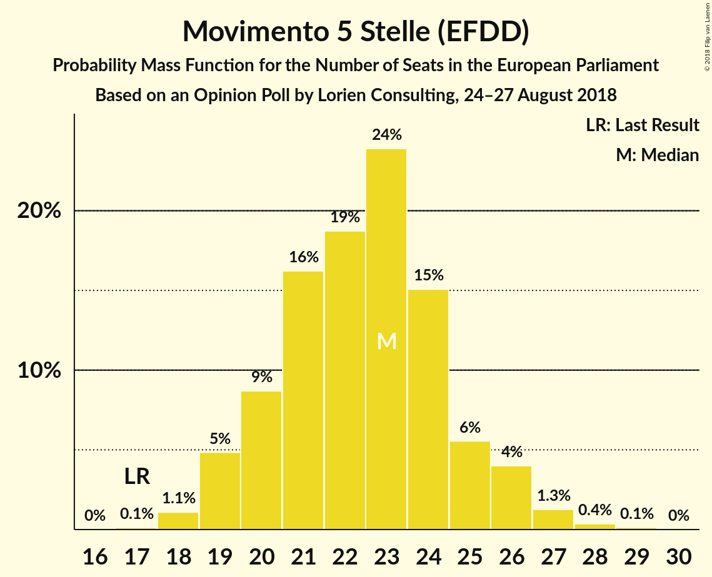

| Number of Seats | Probability | Accumulated | Special Marks |
|:---------------:|:-----------:|:-----------:|:-------------:|
| 17 | 0.1% | 100% | Last Result |
| 18 | 1.1% | 99.9% |  |
| 19 | 5% | 98.8% |  |
| 20 | 9% | 94% |  |
| 21 | 16% | 85% |  |
| 22 | 19% | 69% |  |
| 23 | 24% | 50% | Median |
| 24 | 15% | 26% |  |
| 25 | 6% | 11% |  |
| 26 | 4% | 6% |  |
| 27 | 1.3% | 2% |  |
| 28 | 0.4% | 0.5% |  |
| 29 | 0.1% | 0.1% |  |
| 30 | 0% | 0% |  |

### Partito Democratico (S&D)

*For a full overview of the results for this party, see the [Partito Democratico (S&D)](party-partitodemocraticosd.html) page.*

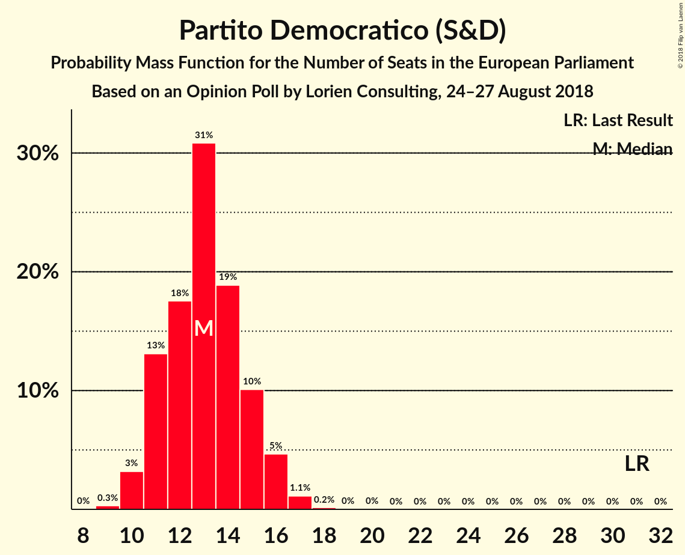

| Number of Seats | Probability | Accumulated | Special Marks |
|:---------------:|:-----------:|:-----------:|:-------------:|
| 9 | 0.3% | 100% |  |
| 10 | 3% | 99.7% |  |
| 11 | 13% | 96% |  |
| 12 | 18% | 83% |  |
| 13 | 31% | 66% | Median |
| 14 | 19% | 35% |  |
| 15 | 10% | 16% |  |
| 16 | 5% | 6% |  |
| 17 | 1.1% | 1.3% |  |
| 18 | 0.2% | 0.2% |  |
| 19 | 0% | 0% |  |
| 20 | 0% | 0% |  |
| 21 | 0% | 0% |  |
| 22 | 0% | 0% |  |
| 23 | 0% | 0% |  |
| 24 | 0% | 0% |  |
| 25 | 0% | 0% |  |
| 26 | 0% | 0% |  |
| 27 | 0% | 0% |  |
| 28 | 0% | 0% |  |
| 29 | 0% | 0% |  |
| 30 | 0% | 0% |  |
| 31 | 0% | 0% | Last Result |

### Forza Italia (EPP)

*For a full overview of the results for this party, see the [Forza Italia (EPP)](party-forzaitaliaepp.html) page.*

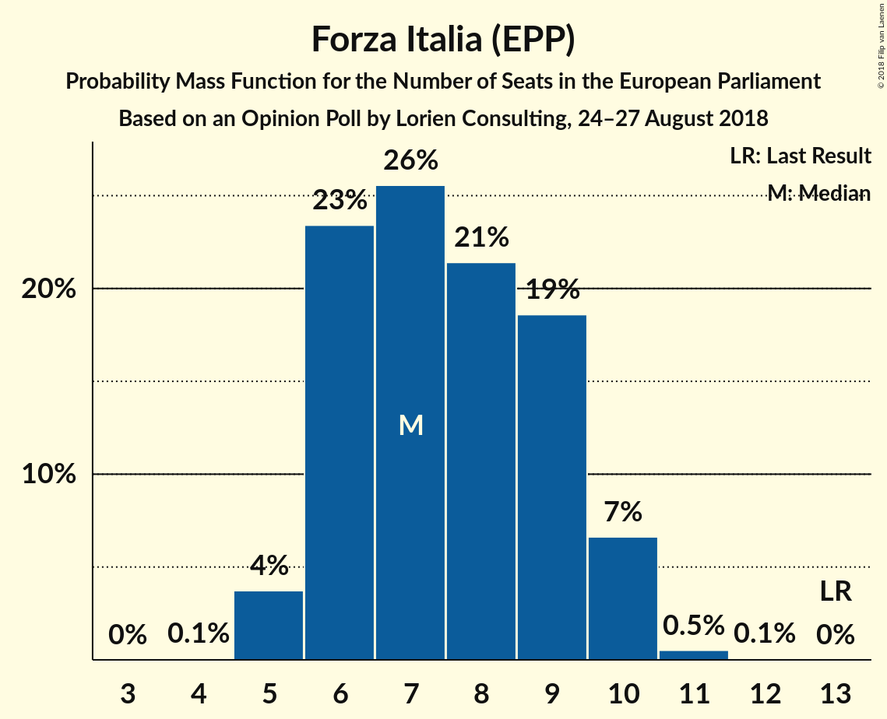

| Number of Seats | Probability | Accumulated | Special Marks |
|:---------------:|:-----------:|:-----------:|:-------------:|
| 4 | 0.1% | 100% |  |
| 5 | 4% | 99.9% |  |
| 6 | 23% | 96% |  |
| 7 | 26% | 73% | Median |
| 8 | 21% | 47% |  |
| 9 | 19% | 26% |  |
| 10 | 7% | 7% |  |
| 11 | 0.5% | 0.6% |  |
| 12 | 0.1% | 0.1% |  |
| 13 | 0% | 0% | Last Result |

### Fratelli d’Italia (*)

*For a full overview of the results for this party, see the [Fratelli d’Italia (*)](party-fratellid’italia.html) page.*

| Number of Seats | Probability | Accumulated | Special Marks |
|:---------------:|:-----------:|:-----------:|:-------------:|
| 0 | 24% | 100% | Last Result |
| 1 | 0% | 76% |  |
| 2 | 0% | 76% |  |
| 3 | 10% | 76% |  |
| 4 | 43% | 67% | Median |
| 5 | 21% | 24% |  |
| 6 | 3% | 3% |  |
| 7 | 0.3% | 0.3% |  |
| 8 | 0% | 0% |  |

### Liberi e Uguali (S&D)

*For a full overview of the results for this party, see the [Liberi e Uguali (S&D)](party-liberieugualisd.html) page.*

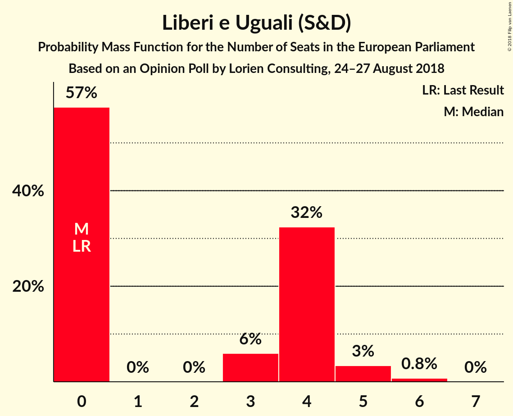

| Number of Seats | Probability | Accumulated | Special Marks |
|:---------------:|:-----------:|:-----------:|:-------------:|
| 0 | 57% | 100% | Last Result, Median |
| 1 | 0% | 43% |  |
| 2 | 0% | 43% |  |
| 3 | 6% | 43% |  |
| 4 | 32% | 37% |  |
| 5 | 3% | 4% |  |
| 6 | 0.8% | 0.8% |  |
| 7 | 0% | 0% |  |

### Più Europa (ALDE)

*For a full overview of the results for this party, see the [Più Europa (ALDE)](party-piùeuropaalde.html) page.*

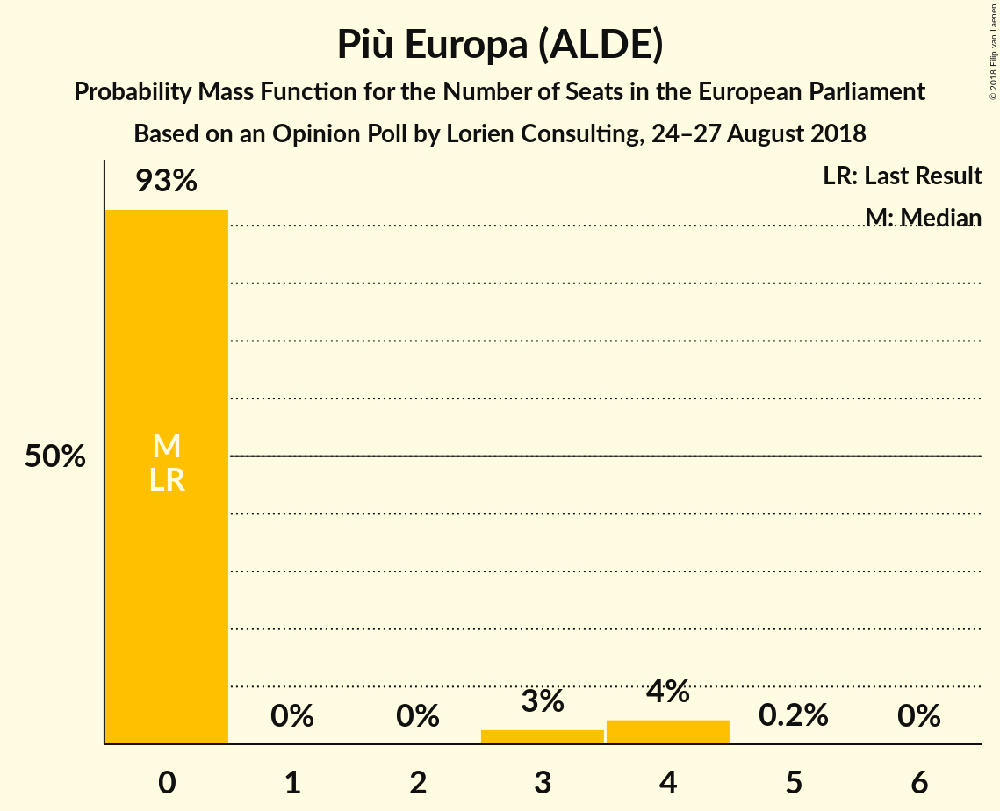

| Number of Seats | Probability | Accumulated | Special Marks |
|:---------------:|:-----------:|:-----------:|:-------------:|
| 0 | 93% | 100% | Last Result, Median |
| 1 | 0% | 7% |  |
| 2 | 0% | 7% |  |
| 3 | 3% | 7% |  |
| 4 | 4% | 4% |  |
| 5 | 0.2% | 0.2% |  |
| 6 | 0% | 0% |  |

### Potere al Popolo (GUE/NGL)

*For a full overview of the results for this party, see the [Potere al Popolo (GUE/NGL)](party-poterealpopologuengl.html) page.*

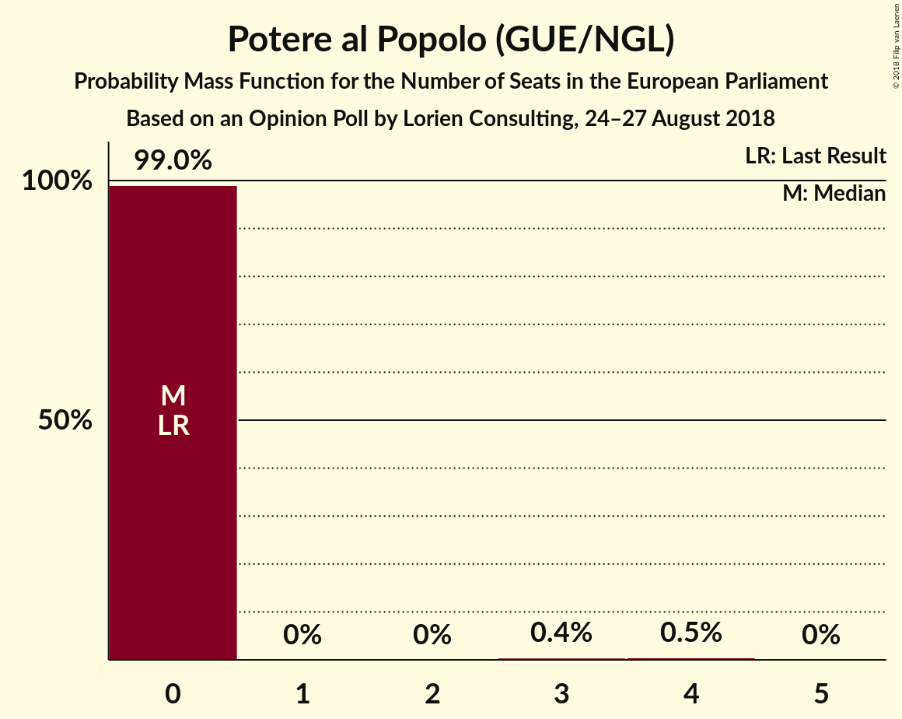

| Number of Seats | Probability | Accumulated | Special Marks |
|:---------------:|:-----------:|:-----------:|:-------------:|
| 0 | 99.0% | 100% | Last Result, Median |
| 1 | 0% | 1.0% |  |
| 2 | 0% | 1.0% |  |
| 3 | 0.4% | 1.0% |  |
| 4 | 0.5% | 0.5% |  |
| 5 | 0% | 0% |  |

### Noi con l’Italia (EPP)

*For a full overview of the results for this party, see the [Noi con l’Italia (EPP)](party-noiconl’italiaepp.html) page.*

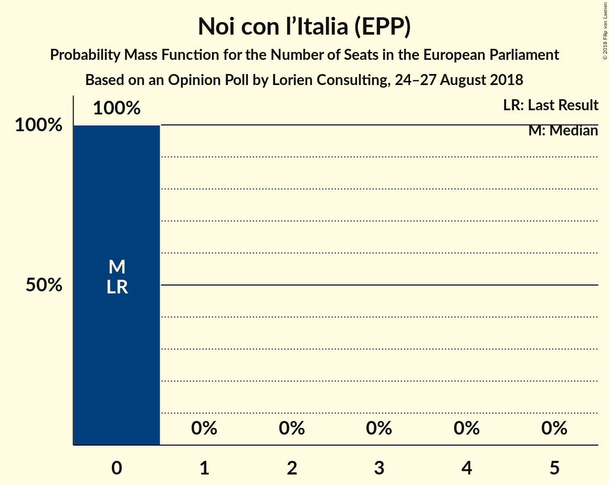

| Number of Seats | Probability | Accumulated | Special Marks |
|:---------------:|:-----------:|:-----------:|:-------------:|
| 0 | 100% | 100% | Last Result, Median |

## Coalitions

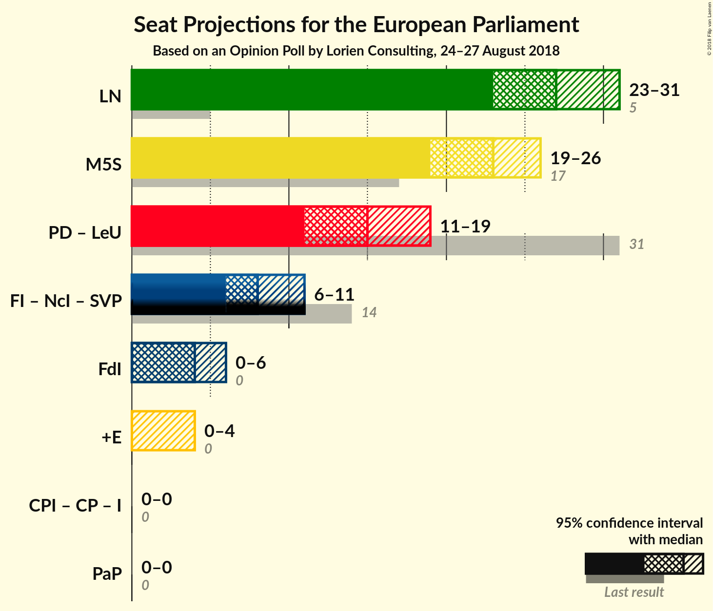

### Confidence Intervals

| Coalition | Last Result | Median | Majority? | 80% Confidence Interval | 90% Confidence Interval | 95% Confidence Interval | 99% Confidence Interval |
|:---------:|:-----------:|:------:|:---------:|:-----------------------:|:-----------------------:|:-----------------------:|:-----------------------:|
| Lega Nord (ENF) | 5 | 27 | 0% | 24–29 | 23–30 | 23–31 | 22–32 |
| Movimento 5 Stelle (EFDD) | 17 | 23 | 0% | 20–25 | 19–26 | 19–26 | 18–28 |
| Partito Democratico (S&D) – Liberi e Uguali (S&D) | 31 | 15 | 0% | 12–18 | 11–18 | 11–19 | 10–20 |
| Più Europa (ALDE) | 0 | 0 | 0% | 0 | 0–3 | 0–4 | 0–4 |
| Potere al Popolo (GUE/NGL) | 0 | 0 | 0% | 0 | 0 | 0 | 0–4 |

### Lega Nord (ENF)

| Number of Seats | Probability | Accumulated | Special Marks |
|:---------------:|:-----------:|:-----------:|:-------------:|
| 5 | 0% | 100% | Last Result |
| 6 | 0% | 100% |  |
| 7 | 0% | 100% |  |
| 8 | 0% | 100% |  |
| 9 | 0% | 100% |  |
| 10 | 0% | 100% |  |
| 11 | 0% | 100% |  |
| 12 | 0% | 100% |  |
| 13 | 0% | 100% |  |
| 14 | 0% | 100% |  |
| 15 | 0% | 100% |  |
| 16 | 0% | 100% |  |
| 17 | 0% | 100% |  |
| 18 | 0% | 100% |  |
| 19 | 0% | 100% |  |
| 20 | 0% | 100% |  |
| 21 | 0.3% | 100% |  |
| 22 | 2% | 99.7% |  |
| 23 | 4% | 98% |  |
| 24 | 10% | 94% |  |
| 25 | 11% | 84% |  |
| 26 | 21% | 73% |  |
| 27 | 18% | 52% | Median |
| 28 | 15% | 34% |  |
| 29 | 10% | 19% |  |
| 30 | 5% | 9% |  |
| 31 | 3% | 4% |  |
| 32 | 0.3% | 0.6% |  |
| 33 | 0.1% | 0.3% |  |
| 34 | 0.1% | 0.1% |  |
| 35 | 0% | 0% |  |

### Movimento 5 Stelle (EFDD)

| Number of Seats | Probability | Accumulated | Special Marks |
|:---------------:|:-----------:|:-----------:|:-------------:|
| 17 | 0.1% | 100% | Last Result |
| 18 | 1.1% | 99.9% |  |
| 19 | 5% | 98.8% |  |
| 20 | 9% | 94% |  |
| 21 | 16% | 85% |  |
| 22 | 19% | 69% |  |
| 23 | 24% | 50% | Median |
| 24 | 15% | 26% |  |
| 25 | 6% | 11% |  |
| 26 | 4% | 6% |  |
| 27 | 1.3% | 2% |  |
| 28 | 0.4% | 0.5% |  |
| 29 | 0.1% | 0.1% |  |
| 30 | 0% | 0% |  |

### Partito Democratico (S&D) – Liberi e Uguali (S&D)

| Number of Seats | Probability | Accumulated | Special Marks |
|:---------------:|:-----------:|:-----------:|:-------------:|
| 9 | 0.1% | 100% |  |
| 10 | 0.9% | 99.9% |  |
| 11 | 5% | 99.0% |  |
| 12 | 10% | 94% |  |
| 13 | 19% | 84% | Median |
| 14 | 13% | 66% |  |
| 15 | 16% | 52% |  |
| 16 | 13% | 36% |  |
| 17 | 12% | 24% |  |
| 18 | 8% | 12% |  |
| 19 | 3% | 4% |  |
| 20 | 0.8% | 1.1% |  |
| 21 | 0.3% | 0.3% |  |
| 22 | 0% | 0% |  |
| 23 | 0% | 0% |  |
| 24 | 0% | 0% |  |
| 25 | 0% | 0% |  |
| 26 | 0% | 0% |  |
| 27 | 0% | 0% |  |
| 28 | 0% | 0% |  |
| 29 | 0% | 0% |  |
| 30 | 0% | 0% |  |
| 31 | 0% | 0% | Last Result |

### Più Europa (ALDE)

| Number of Seats | Probability | Accumulated | Special Marks |
|:---------------:|:-----------:|:-----------:|:-------------:|
| 0 | 93% | 100% | Last Result, Median |
| 1 | 0% | 7% |  |
| 2 | 0% | 7% |  |
| 3 | 3% | 7% |  |
| 4 | 4% | 4% |  |
| 5 | 0.2% | 0.2% |  |
| 6 | 0% | 0% |  |

### Potere al Popolo (GUE/NGL)

| Number of Seats | Probability | Accumulated | Special Marks |
|:---------------:|:-----------:|:-----------:|:-------------:|
| 0 | 99.0% | 100% | Last Result, Median |
| 1 | 0% | 1.0% |  |
| 2 | 0% | 1.0% |  |
| 3 | 0.4% | 1.0% |  |
| 4 | 0.5% | 0.5% |  |
| 5 | 0% | 0% |  |

## Technical Information

### Opinion Poll

+ **Polling firm:** Lorien Consulting
+ **Commissioner(s):** —
+ **Fieldwork period:** 24–27 August 2018

### Calculations

+ **Sample size:** 500
+ **Simulations done:** 1,048,576
+ **Error estimate:** 3.73%

