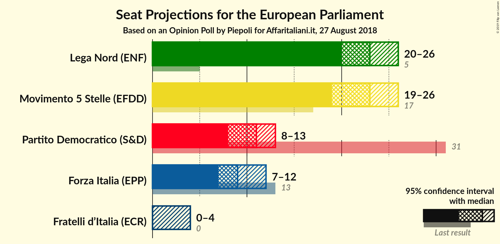
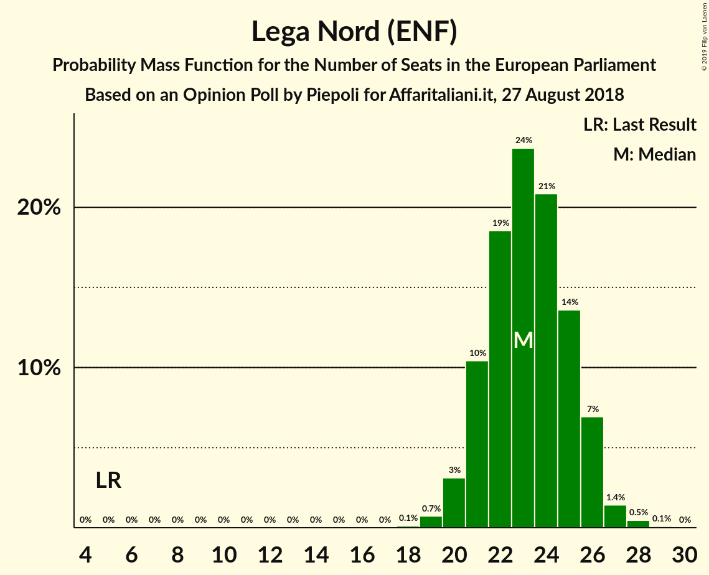
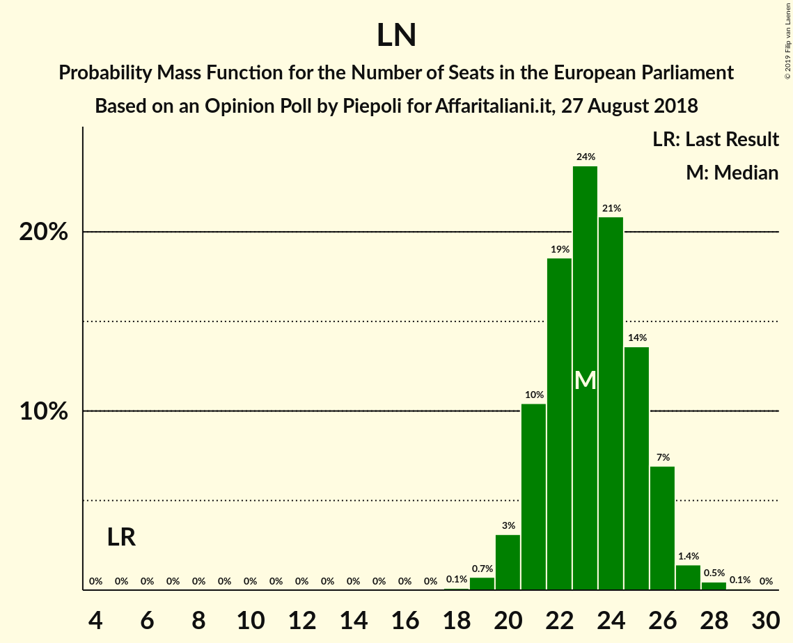

# Opinion Poll by Piepoli for Affaritaliani.it, 27 August 2018

<a href="#voting-intentions">Voting Intentions</a> | <a href="#seats">Seats</a> | <a href="#coalitions">Coalitions</a> | <a href="#technical-information">Technical Information</a>

## Voting Intentions

### Confidence Intervals

| Party | Last Result | Poll Result | 80% Confidence Interval | 90% Confidence Interval | 95% Confidence Interval | 99% Confidence Interval |
|:-----:|:-----------:|:-----------:|:-----------------------:|:-----------------------:|:-----------------------:|:-----------------------:|
| Lega Nord (ENF) | 6.2% | 30.0% | 27.5–32.7% |26.7–33.5% |26.1–34.2% |25.0–35.5% |
| Movimento 5 Stelle (EFDD) | 21.2% | 29.0% | 26.5–31.7% |25.8–32.5% |25.2–33.1% |24.0–34.5% |
| Partito Democratico (S&D) | 40.8% | 15.0% | 13.1–17.2% |12.6–17.8% |12.1–18.4% |11.3–19.5% |
| Forza Italia (EPP) | 16.8% | 12.0% | 10.3–14.1% |9.8–14.6% |9.4–15.2% |8.7–16.2% |
| Fratelli d’Italia (ECR) | 3.7% | 3.0% | 2.2–4.2% |2.0–4.6% |1.8–4.9% |1.5–5.5% |

*Note:* The poll result column reflects the actual value used in the calculations. Published results may vary slightly, and in addition be rounded to fewer digits.

## Seats

### Confidence Intervals

| Party | Last Result | Median | 80% Confidence Interval | 90% Confidence Interval | 95% Confidence Interval | 99% Confidence Interval |
|:-----:|:-----------:|:------:|:-----------------------:|:-----------------------:|:-----------------------:|:-----------------------:|
| <a href="#lega-nord-(enf)">Lega Nord (ENF)</a> | 5 | 22 | 22–23 |22–24 |22–24 |21–27 |
| <a href="#movimento-5-stelle-(efdd)">Movimento 5 Stelle (EFDD)</a> | 17 | 23 | 21–24 |21–24 |20–24 |18–24 |
| <a href="#partito-democratico-(s&d)">Partito Democratico (S&D)</a> | 31 | 12 | 12–13 |11–13 |8–13 |8–13 |
| <a href="#forza-italia-(epp)">Forza Italia (EPP)</a> | 13 | 9 | 9–10 |8–10 |8–12 |7–12 |
| <a href="#fratelli-d’italia-(ecr)">Fratelli d’Italia (ECR)</a> | 0 | 0 | 0 |0 |0 |0 |

### Lega Nord (ENF)

*For a full overview of the results for this party, see the [Lega Nord (ENF)](party-leganordenf.html) page.*

| Number of Seats | Probability | Accumulated | Special Marks |
|:---------------:|:-----------:|:-----------:|:-------------:|
| 5 | 0% | 100% | Last Result |
| 6 | 0% | 100% |  |
| 7 | 0% | 100% |  |
| 8 | 0% | 100% |  |
| 9 | 0% | 100% |  |
| 10 | 0% | 100% |  |
| 11 | 0% | 100% |  |
| 12 | 0% | 100% |  |
| 13 | 0% | 100% |  |
| 14 | 0% | 100% |  |
| 15 | 0% | 100% |  |
| 16 | 0% | 100% |  |
| 17 | 0% | 100% |  |
| 18 | 0.1% | 100% |  |
| 19 | 0.1% | 99.9% |  |
| 20 | 0% | 99.7% |  |
| 21 | 0.5% | 99.7% |  |
| 22 | 54% | 99.2% | Median |
| 23 | 39% | 45% |  |
| 24 | 5% | 7% |  |
| 25 | 0.1% | 1.1% |  |
| 26 | 0.1% | 1.0% |  |
| 27 | 0.5% | 0.8% |  |
| 28 | 0.3% | 0.4% |  |
| 29 | 0.1% | 0.1% |  |
| 30 | 0% | 0% |  |

### Movimento 5 Stelle (EFDD)

*For a full overview of the results for this party, see the [Movimento 5 Stelle (EFDD)](party-movimento5stelleefdd.html) page.*

| Number of Seats | Probability | Accumulated | Special Marks |
|:---------------:|:-----------:|:-----------:|:-------------:|
| 17 | 0% | 100% | Last Result |
| 18 | 0.6% | 100% |  |
| 19 | 0% | 99.4% |  |
| 20 | 3% | 99.4% |  |
| 21 | 34% | 96% |  |
| 22 | 6% | 62% |  |
| 23 | 24% | 56% | Median |
| 24 | 31% | 32% |  |
| 25 | 0.1% | 0.4% |  |
| 26 | 0.1% | 0.3% |  |
| 27 | 0.2% | 0.2% |  |
| 28 | 0% | 0.1% |  |
| 29 | 0.1% | 0.1% |  |
| 30 | 0% | 0% |  |

### Partito Democratico (S&D)

*For a full overview of the results for this party, see the [Partito Democratico (S&D)](party-partitodemocraticosd.html) page.*

| Number of Seats | Probability | Accumulated | Special Marks |
|:---------------:|:-----------:|:-----------:|:-------------:|
| 8 | 3% | 100% |  |
| 9 | 0.8% | 96% |  |
| 10 | 0.6% | 96% |  |
| 11 | 2% | 95% |  |
| 12 | 80% | 93% | Median |
| 13 | 13% | 13% |  |
| 14 | 0.1% | 0.1% |  |
| 15 | 0% | 0% |  |
| 16 | 0% | 0% |  |
| 17 | 0% | 0% |  |
| 18 | 0% | 0% |  |
| 19 | 0% | 0% |  |
| 20 | 0% | 0% |  |
| 21 | 0% | 0% |  |
| 22 | 0% | 0% |  |
| 23 | 0% | 0% |  |
| 24 | 0% | 0% |  |
| 25 | 0% | 0% |  |
| 26 | 0% | 0% |  |
| 27 | 0% | 0% |  |
| 28 | 0% | 0% |  |
| 29 | 0% | 0% |  |
| 30 | 0% | 0% |  |
| 31 | 0% | 0% | Last Result |

### Forza Italia (EPP)

*For a full overview of the results for this party, see the [Forza Italia (EPP)](party-forzaitaliaepp.html) page.*

| Number of Seats | Probability | Accumulated | Special Marks |
|:---------------:|:-----------:|:-----------:|:-------------:|
| 7 | 0.6% | 100% |  |
| 8 | 9% | 99.3% |  |
| 9 | 43% | 91% | Median |
| 10 | 43% | 47% |  |
| 11 | 0% | 4% |  |
| 12 | 4% | 4% |  |
| 13 | 0.1% | 0.1% | Last Result |
| 14 | 0% | 0% |  |

### Fratelli d’Italia (ECR)

*For a full overview of the results for this party, see the [Fratelli d’Italia (ECR)](party-fratellid’italiaecr.html) page.*

| Number of Seats | Probability | Accumulated | Special Marks |
|:---------------:|:-----------:|:-----------:|:-------------:|
| 0 | 99.6% | 100% | Last Result, Median |
| 1 | 0% | 0.4% |  |
| 2 | 0% | 0.4% |  |
| 3 | 0.1% | 0.4% |  |
| 4 | 0.2% | 0.2% |  |
| 5 | 0% | 0% |  |

## Coalitions

### Confidence Intervals

| Coalition | Last Result | Median | Majority? | 80% Confidence Interval | 90% Confidence Interval | 95% Confidence Interval | 99% Confidence Interval |
|:---------:|:-----------:|:------:|:---------:|:-----------------------:|:-----------------------:|:-----------------------:|:-----------------------:|
| Lega Nord (ENF) | 5 | 22 | 0% | 22–23 | 22–24 | 22–24 | 21–27 |
| Movimento 5 Stelle (EFDD) | 17 | 23 | 0% | 21–24 | 21–24 | 20–24 | 18–24 |
| Fratelli d’Italia (ECR) | 0 | 0 | 0% | 0 | 0 | 0 | 0 |

### Lega Nord (ENF)

| Number of Seats | Probability | Accumulated | Special Marks |
|:---------------:|:-----------:|:-----------:|:-------------:|
| 5 | 0% | 100% | Last Result |
| 6 | 0% | 100% |  |
| 7 | 0% | 100% |  |
| 8 | 0% | 100% |  |
| 9 | 0% | 100% |  |
| 10 | 0% | 100% |  |
| 11 | 0% | 100% |  |
| 12 | 0% | 100% |  |
| 13 | 0% | 100% |  |
| 14 | 0% | 100% |  |
| 15 | 0% | 100% |  |
| 16 | 0% | 100% |  |
| 17 | 0% | 100% |  |
| 18 | 0.1% | 100% |  |
| 19 | 0.1% | 99.9% |  |
| 20 | 0% | 99.7% |  |
| 21 | 0.5% | 99.7% |  |
| 22 | 54% | 99.2% | Median |
| 23 | 39% | 45% |  |
| 24 | 5% | 7% |  |
| 25 | 0.1% | 1.1% |  |
| 26 | 0.1% | 1.0% |  |
| 27 | 0.5% | 0.8% |  |
| 28 | 0.3% | 0.4% |  |
| 29 | 0.1% | 0.1% |  |
| 30 | 0% | 0% |  |

### Movimento 5 Stelle (EFDD)

| Number of Seats | Probability | Accumulated | Special Marks |
|:---------------:|:-----------:|:-----------:|:-------------:|
| 17 | 0% | 100% | Last Result |
| 18 | 0.6% | 100% |  |
| 19 | 0% | 99.4% |  |
| 20 | 3% | 99.4% |  |
| 21 | 34% | 96% |  |
| 22 | 6% | 62% |  |
| 23 | 24% | 56% | Median |
| 24 | 31% | 32% |  |
| 25 | 0.1% | 0.4% |  |
| 26 | 0.1% | 0.3% |  |
| 27 | 0.2% | 0.2% |  |
| 28 | 0% | 0.1% |  |
| 29 | 0.1% | 0.1% |  |
| 30 | 0% | 0% |  |

### Fratelli d’Italia (ECR)

| Number of Seats | Probability | Accumulated | Special Marks |
|:---------------:|:-----------:|:-----------:|:-------------:|
| 0 | 99.6% | 100% | Last Result, Median |
| 1 | 0% | 0.4% |  |
| 2 | 0% | 0.4% |  |
| 3 | 0.1% | 0.4% |  |
| 4 | 0.2% | 0.2% |  |
| 5 | 0% | 0% |  |

## Technical Information

### Opinion Poll

+ **Polling firm:** Piepoli
+ **Commissioner(s):** Affaritaliani.it
+ **Fieldwork period:** 27 August 2018

### Calculations

+ **Sample size:** 500
+ **Simulations done:** 1,024
+ **Error estimate:** 3.06%

