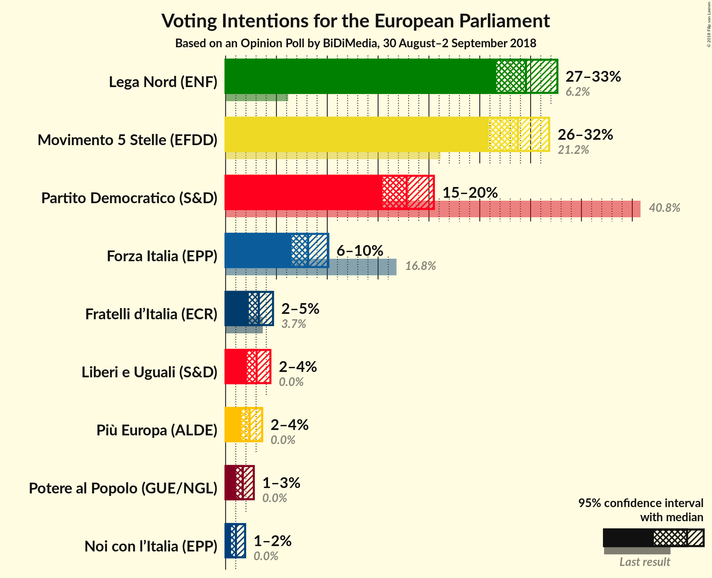
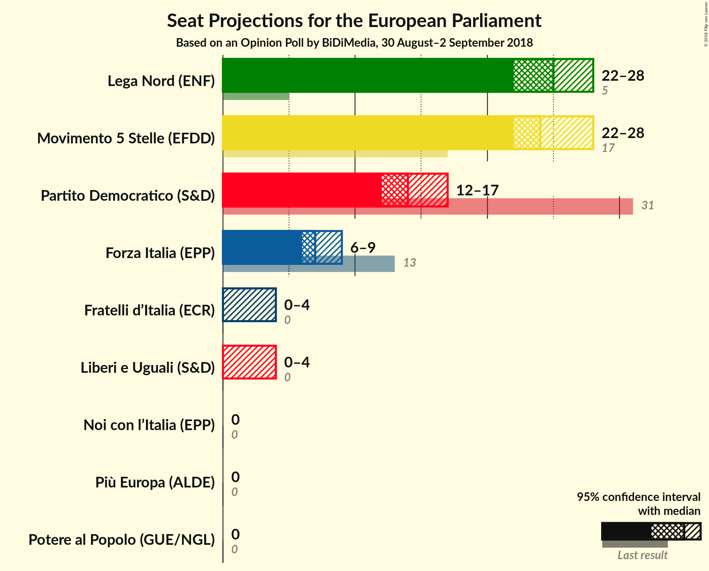
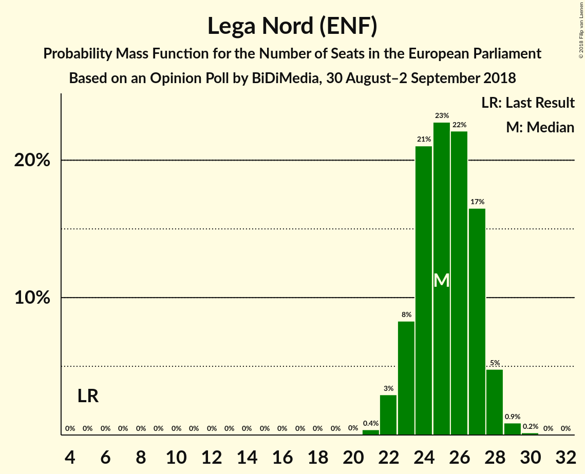
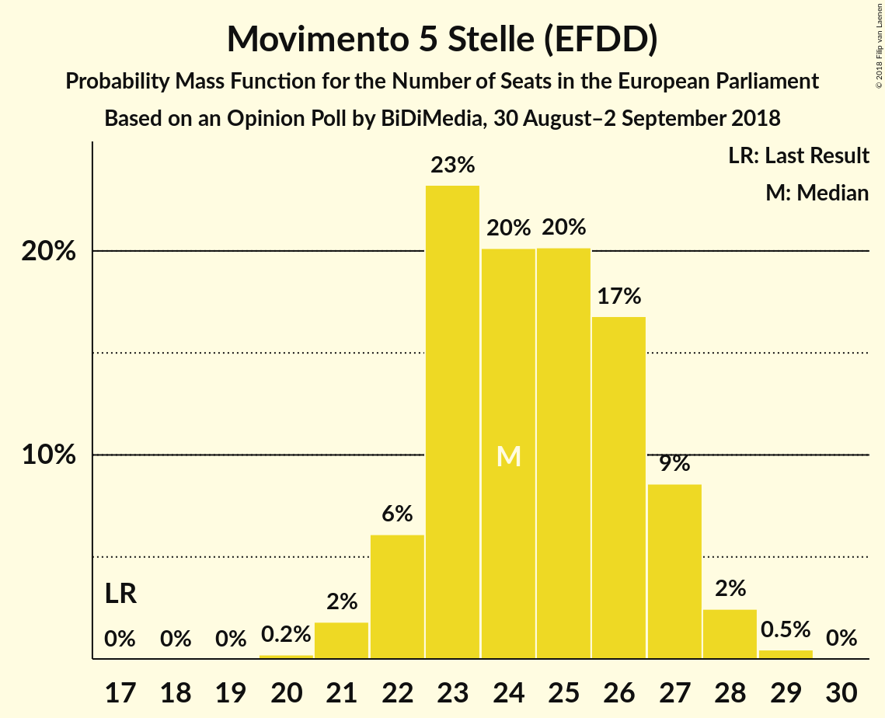
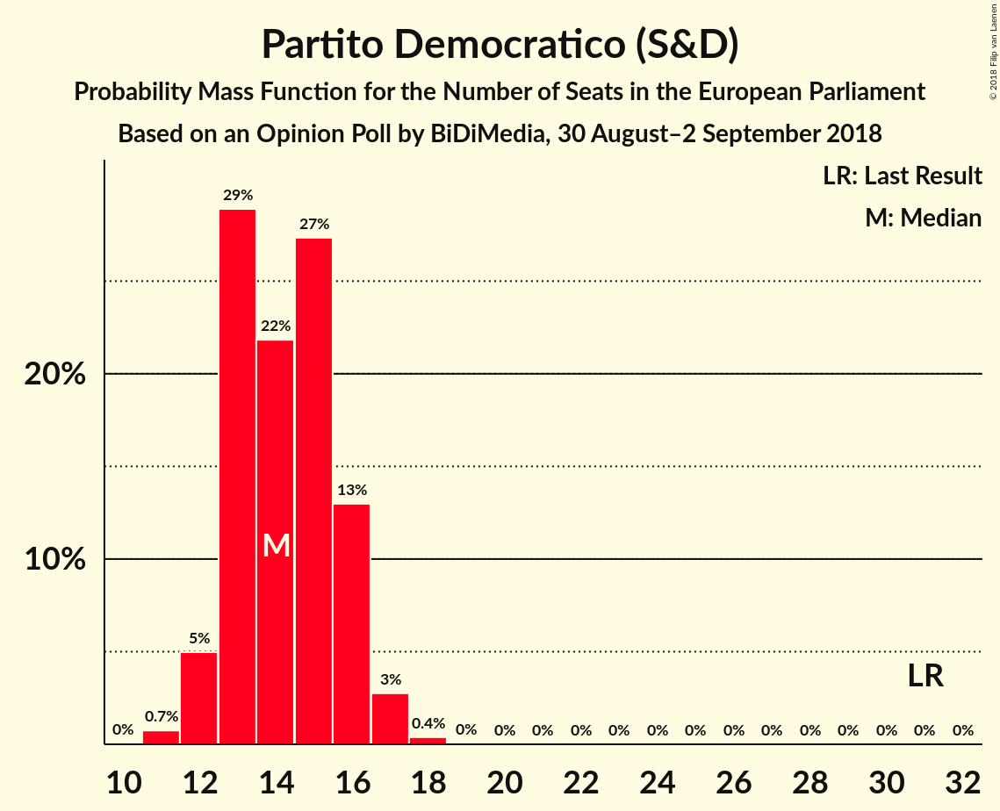
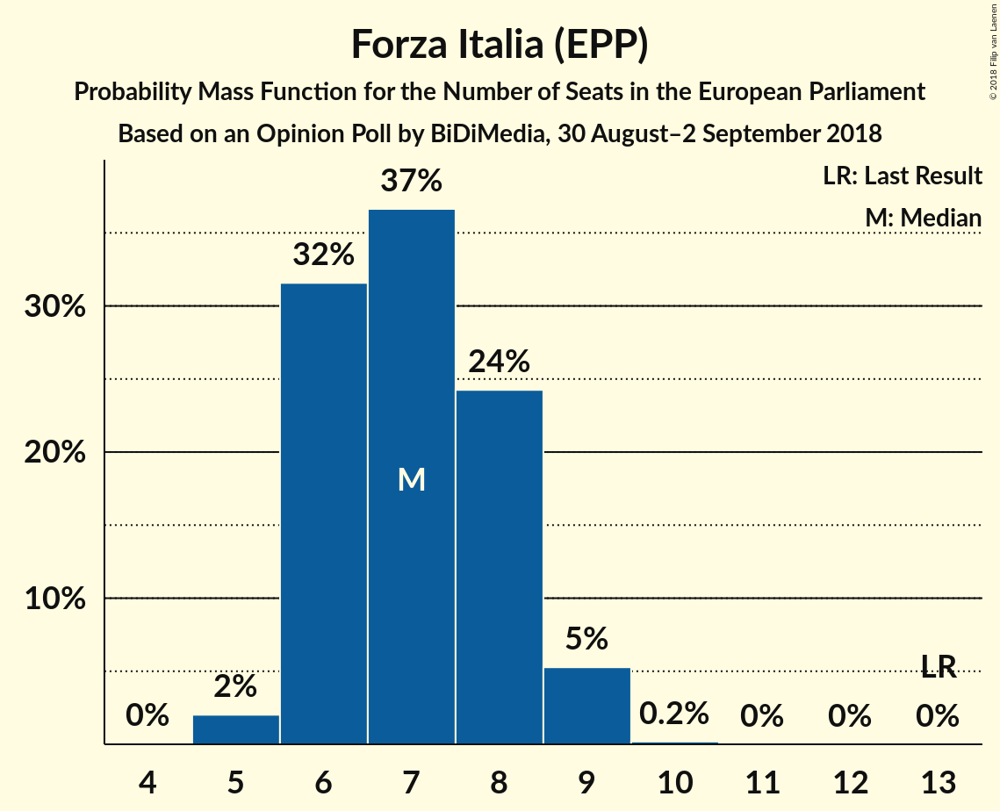
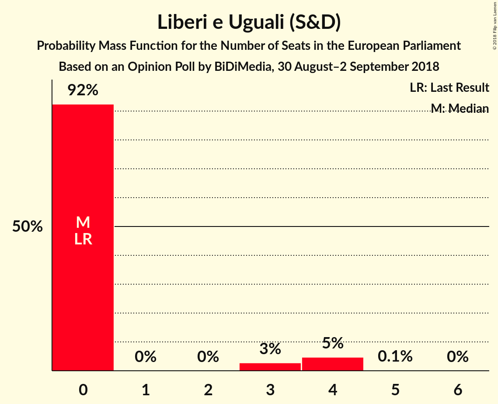
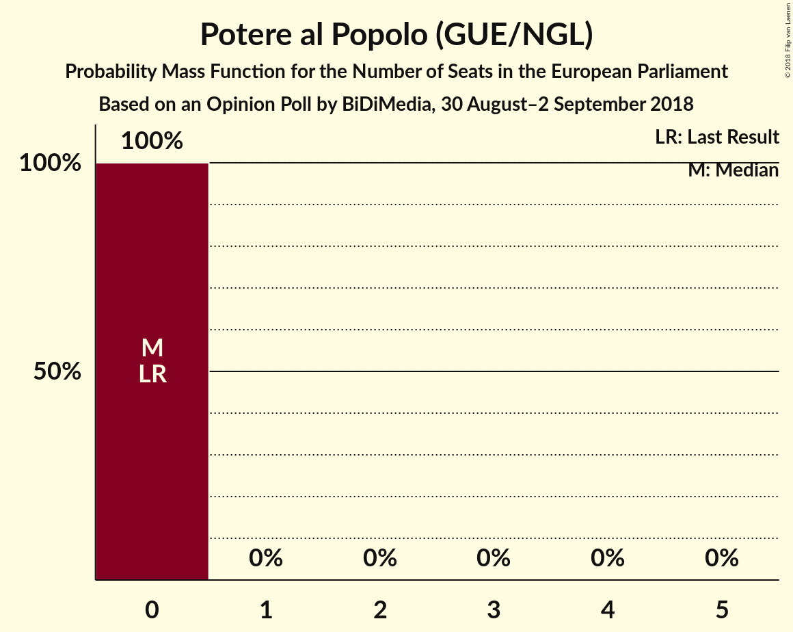
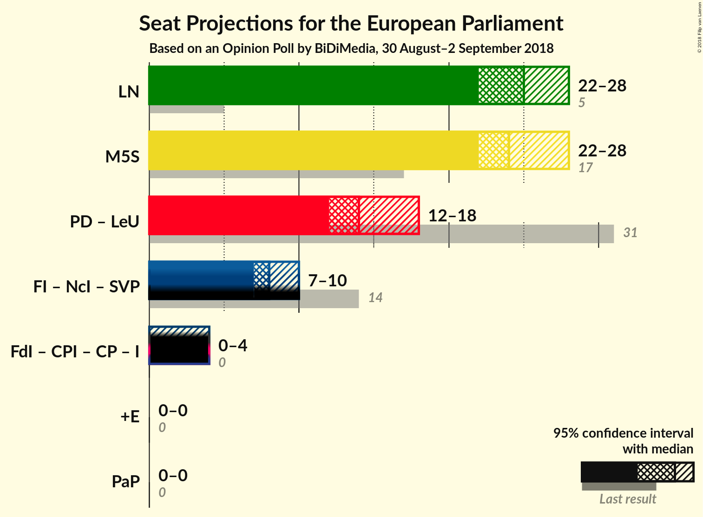

# Opinion Poll by BiDiMedia, 30 August–2 September 2018

<a href="#voting-intentions">Voting Intentions</a> | <a href="#seats">Seats</a> | <a href="#coalitions">Coalitions</a> | <a href="#technical-information">Technical Information</a>

## Voting Intentions

### Confidence Intervals

| Party | Last Result | Poll Result | 80% Confidence Interval | 90% Confidence Interval | 95% Confidence Interval | 99% Confidence Interval |
|:-----:|:-----------:|:-----------:|:-----------------------:|:-----------------------:|:-----------------------:|:-----------------------:|
| Lega Nord (ENF) | 6.2% | 29.5% | 27.6–31.6% |27.1–32.1% |26.6–32.6% |25.7–33.6% |
| Movimento 5 Stelle (EFDD) | 21.2% | 28.7% | 26.9–30.8% |26.3–31.3% |25.9–31.8% |25.0–32.8% |
| Partito Democratico (S&D) | 40.8% | 17.8% | 16.2–19.6% |15.8–20.0% |15.4–20.5% |14.7–21.3% |
| Forza Italia (EPP) | 16.8% | 8.1% | 7.0–9.4% |6.8–9.8% |6.5–10.1% |6.0–10.8% |
| Fratelli d’Italia (ECR) | 3.7% | 3.3% | 2.6–4.2% |2.4–4.4% |2.3–4.7% |2.0–5.1% |
| Liberi e Uguali (S&D) | 0.0% | 3.0% | 2.4–3.9% |2.2–4.2% |2.1–4.4% |1.8–4.9% |
| Più Europa (ALDE) | 0.0% | 2.4% | 1.8–3.2% |1.7–3.4% |1.6–3.6% |1.3–4.0% |
| Potere al Popolo (GUE/NGL) | 0.0% | 1.7% | 1.2–2.4% |1.1–2.6% |1.0–2.8% |0.9–3.2% |
| Noi con l’Italia (EPP) | 0.0% | 1.0% | 0.7–1.6% |0.6–1.8% |0.5–1.9% |0.4–2.2% |

*Note:* The poll result column reflects the actual value used in the calculations. Published results may vary slightly, and in addition be rounded to fewer digits.

## Seats

### Confidence Intervals

| Party | Last Result | Median | 80% Confidence Interval | 90% Confidence Interval | 95% Confidence Interval | 99% Confidence Interval |
|:-----:|:-----------:|:------:|:-----------------------:|:-----------------------:|:-----------------------:|:-----------------------:|
| <a href="#lega-nord-(enf)">Lega Nord (ENF)</a> | 5 | 25 | 23–27 |23–28 |22–28 |22–29 |
| <a href="#movimento-5-stelle-(efdd)">Movimento 5 Stelle (EFDD)</a> | 17 | 24 | 23–27 |22–27 |22–28 |21–28 |
| <a href="#partito-democratico-(s&d)">Partito Democratico (S&D)</a> | 31 | 14 | 13–16 |12–16 |12–17 |11–17 |
| <a href="#forza-italia-(epp)">Forza Italia (EPP)</a> | 13 | 7 | 6–8 |6–9 |6–9 |5–9 |
| <a href="#fratelli-d’italia-(ecr)">Fratelli d’Italia (ECR)</a> | 0 | 0 | 0–3 |0–4 |0–4 |0–4 |
| <a href="#liberi-e-uguali-(s&d)">Liberi e Uguali (S&D)</a> | 0 | 0 | 0 |0–3 |0–4 |0–4 |
| <a href="#più-europa-(alde)">Più Europa (ALDE)</a> | 0 | 0 | 0 |0 |0 |0 |
| <a href="#potere-al-popolo-(gue/ngl)">Potere al Popolo (GUE/NGL)</a> | 0 | 0 | 0 |0 |0 |0 |
| <a href="#noi-con-l’italia-(epp)">Noi con l’Italia (EPP)</a> | 0 | 0 | 0 |0 |0 |0 |

### Lega Nord (ENF)

*For a full overview of the results for this party, see the [Lega Nord (ENF)](party-leganordenf.html) page.*

| Number of Seats | Probability | Accumulated | Special Marks |
|:---------------:|:-----------:|:-----------:|:-------------:|
| 5 | 0% | 100% | Last Result |
| 6 | 0% | 100% |  |
| 7 | 0% | 100% |  |
| 8 | 0% | 100% |  |
| 9 | 0% | 100% |  |
| 10 | 0% | 100% |  |
| 11 | 0% | 100% |  |
| 12 | 0% | 100% |  |
| 13 | 0% | 100% |  |
| 14 | 0% | 100% |  |
| 15 | 0% | 100% |  |
| 16 | 0% | 100% |  |
| 17 | 0% | 100% |  |
| 18 | 0% | 100% |  |
| 19 | 0% | 100% |  |
| 20 | 0% | 100% |  |
| 21 | 0.4% | 100% |  |
| 22 | 3% | 99.6% |  |
| 23 | 8% | 97% |  |
| 24 | 21% | 88% |  |
| 25 | 23% | 67% | Median |
| 26 | 22% | 45% |  |
| 27 | 17% | 22% |  |
| 28 | 5% | 6% |  |
| 29 | 0.9% | 1.1% |  |
| 30 | 0.2% | 0.2% |  |
| 31 | 0% | 0% |  |

### Movimento 5 Stelle (EFDD)

*For a full overview of the results for this party, see the [Movimento 5 Stelle (EFDD)](party-movimento5stelleefdd.html) page.*

| Number of Seats | Probability | Accumulated | Special Marks |
|:---------------:|:-----------:|:-----------:|:-------------:|
| 17 | 0% | 100% | Last Result |
| 18 | 0% | 100% |  |
| 19 | 0% | 100% |  |
| 20 | 0.2% | 100% |  |
| 21 | 2% | 99.8% |  |
| 22 | 6% | 98% |  |
| 23 | 23% | 92% |  |
| 24 | 20% | 69% | Median |
| 25 | 20% | 48% |  |
| 26 | 17% | 28% |  |
| 27 | 9% | 12% |  |
| 28 | 2% | 3% |  |
| 29 | 0.5% | 0.5% |  |
| 30 | 0% | 0% |  |

### Partito Democratico (S&D)

*For a full overview of the results for this party, see the [Partito Democratico (S&D)](party-partitodemocraticosd.html) page.*

| Number of Seats | Probability | Accumulated | Special Marks |
|:---------------:|:-----------:|:-----------:|:-------------:|
| 11 | 0.7% | 100% |  |
| 12 | 5% | 99.2% |  |
| 13 | 29% | 94% |  |
| 14 | 22% | 65% | Median |
| 15 | 27% | 44% |  |
| 16 | 13% | 16% |  |
| 17 | 3% | 3% |  |
| 18 | 0.4% | 0.4% |  |
| 19 | 0% | 0% |  |
| 20 | 0% | 0% |  |
| 21 | 0% | 0% |  |
| 22 | 0% | 0% |  |
| 23 | 0% | 0% |  |
| 24 | 0% | 0% |  |
| 25 | 0% | 0% |  |
| 26 | 0% | 0% |  |
| 27 | 0% | 0% |  |
| 28 | 0% | 0% |  |
| 29 | 0% | 0% |  |
| 30 | 0% | 0% |  |
| 31 | 0% | 0% | Last Result |

### Forza Italia (EPP)

*For a full overview of the results for this party, see the [Forza Italia (EPP)](party-forzaitaliaepp.html) page.*

| Number of Seats | Probability | Accumulated | Special Marks |
|:---------------:|:-----------:|:-----------:|:-------------:|
| 5 | 2% | 100% |  |
| 6 | 32% | 98% |  |
| 7 | 37% | 66% | Median |
| 8 | 24% | 30% |  |
| 9 | 5% | 5% |  |
| 10 | 0.2% | 0.2% |  |
| 11 | 0% | 0% |  |
| 12 | 0% | 0% |  |
| 13 | 0% | 0% | Last Result |

### Fratelli d’Italia (ECR)

*For a full overview of the results for this party, see the [Fratelli d’Italia (ECR)](party-fratellid’italiaecr.html) page.*

| Number of Seats | Probability | Accumulated | Special Marks |
|:---------------:|:-----------:|:-----------:|:-------------:|
| 0 | 83% | 100% | Last Result, Median |
| 1 | 0% | 17% |  |
| 2 | 0% | 17% |  |
| 3 | 9% | 17% |  |
| 4 | 8% | 8% |  |
| 5 | 0.2% | 0.2% |  |
| 6 | 0% | 0% |  |

### Liberi e Uguali (S&D)

*For a full overview of the results for this party, see the [Liberi e Uguali (S&D)](party-liberieugualisd.html) page.*

| Number of Seats | Probability | Accumulated | Special Marks |
|:---------------:|:-----------:|:-----------:|:-------------:|
| 0 | 92% | 100% | Last Result, Median |
| 1 | 0% | 8% |  |
| 2 | 0% | 8% |  |
| 3 | 3% | 8% |  |
| 4 | 5% | 5% |  |
| 5 | 0.1% | 0.1% |  |
| 6 | 0% | 0% |  |

### Più Europa (ALDE)

*For a full overview of the results for this party, see the [Più Europa (ALDE)](party-piùeuropaalde.html) page.*

| Number of Seats | Probability | Accumulated | Special Marks |
|:---------------:|:-----------:|:-----------:|:-------------:|
| 0 | 99.6% | 100% | Last Result, Median |
| 1 | 0% | 0.4% |  |
| 2 | 0% | 0.4% |  |
| 3 | 0.1% | 0.4% |  |
| 4 | 0.3% | 0.3% |  |
| 5 | 0% | 0% |  |

### Potere al Popolo (GUE/NGL)

*For a full overview of the results for this party, see the [Potere al Popolo (GUE/NGL)](party-poterealpopologuengl.html) page.*

| Number of Seats | Probability | Accumulated | Special Marks |
|:---------------:|:-----------:|:-----------:|:-------------:|
| 0 | 100% | 100% | Last Result, Median |

### Noi con l’Italia (EPP)

*For a full overview of the results for this party, see the [Noi con l’Italia (EPP)](party-noiconl’italiaepp.html) page.*

| Number of Seats | Probability | Accumulated | Special Marks |
|:---------------:|:-----------:|:-----------:|:-------------:|
| 0 | 100% | 100% | Last Result, Median |

## Coalitions

### Confidence Intervals

| Coalition | Last Result | Median | Majority? | 80% Confidence Interval | 90% Confidence Interval | 95% Confidence Interval | 99% Confidence Interval |
|:---------:|:-----------:|:------:|:---------:|:-----------------------:|:-----------------------:|:-----------------------:|:-----------------------:|
| Lega Nord (ENF) | 5 | 25 | 0% | 23–27 | 23–28 | 22–28 | 22–29 |
| Movimento 5 Stelle (EFDD) | 17 | 24 | 0% | 23–27 | 22–27 | 22–28 | 21–28 |
| Partito Democratico (S&D) – Liberi e Uguali (S&D) | 31 | 14 | 0% | 13–16 | 13–17 | 12–18 | 12–19 |
| Più Europa (ALDE) | 0 | 0 | 0% | 0 | 0 | 0 | 0 |
| Potere al Popolo (GUE/NGL) | 0 | 0 | 0% | 0 | 0 | 0 | 0 |

### Lega Nord (ENF)

| Number of Seats | Probability | Accumulated | Special Marks |
|:---------------:|:-----------:|:-----------:|:-------------:|
| 5 | 0% | 100% | Last Result |
| 6 | 0% | 100% |  |
| 7 | 0% | 100% |  |
| 8 | 0% | 100% |  |
| 9 | 0% | 100% |  |
| 10 | 0% | 100% |  |
| 11 | 0% | 100% |  |
| 12 | 0% | 100% |  |
| 13 | 0% | 100% |  |
| 14 | 0% | 100% |  |
| 15 | 0% | 100% |  |
| 16 | 0% | 100% |  |
| 17 | 0% | 100% |  |
| 18 | 0% | 100% |  |
| 19 | 0% | 100% |  |
| 20 | 0% | 100% |  |
| 21 | 0.4% | 100% |  |
| 22 | 3% | 99.6% |  |
| 23 | 8% | 97% |  |
| 24 | 21% | 88% |  |
| 25 | 23% | 67% | Median |
| 26 | 22% | 45% |  |
| 27 | 17% | 22% |  |
| 28 | 5% | 6% |  |
| 29 | 0.9% | 1.1% |  |
| 30 | 0.2% | 0.2% |  |
| 31 | 0% | 0% |  |

### Movimento 5 Stelle (EFDD)

| Number of Seats | Probability | Accumulated | Special Marks |
|:---------------:|:-----------:|:-----------:|:-------------:|
| 17 | 0% | 100% | Last Result |
| 18 | 0% | 100% |  |
| 19 | 0% | 100% |  |
| 20 | 0.2% | 100% |  |
| 21 | 2% | 99.8% |  |
| 22 | 6% | 98% |  |
| 23 | 23% | 92% |  |
| 24 | 20% | 69% | Median |
| 25 | 20% | 48% |  |
| 26 | 17% | 28% |  |
| 27 | 9% | 12% |  |
| 28 | 2% | 3% |  |
| 29 | 0.5% | 0.5% |  |
| 30 | 0% | 0% |  |

### Partito Democratico (S&D) – Liberi e Uguali (S&D)

| Number of Seats | Probability | Accumulated | Special Marks |
|:---------------:|:-----------:|:-----------:|:-------------:|
| 11 | 0.5% | 100% |  |
| 12 | 4% | 99.5% |  |
| 13 | 27% | 96% |  |
| 14 | 20% | 69% | Median |
| 15 | 26% | 49% |  |
| 16 | 15% | 23% |  |
| 17 | 4% | 8% |  |
| 18 | 3% | 4% |  |
| 19 | 0.9% | 1.1% |  |
| 20 | 0.1% | 0.1% |  |
| 21 | 0% | 0% |  |
| 22 | 0% | 0% |  |
| 23 | 0% | 0% |  |
| 24 | 0% | 0% |  |
| 25 | 0% | 0% |  |
| 26 | 0% | 0% |  |
| 27 | 0% | 0% |  |
| 28 | 0% | 0% |  |
| 29 | 0% | 0% |  |
| 30 | 0% | 0% |  |
| 31 | 0% | 0% | Last Result |

### Più Europa (ALDE)

| Number of Seats | Probability | Accumulated | Special Marks |
|:---------------:|:-----------:|:-----------:|:-------------:|
| 0 | 99.6% | 100% | Last Result, Median |
| 1 | 0% | 0.4% |  |
| 2 | 0% | 0.4% |  |
| 3 | 0.1% | 0.4% |  |
| 4 | 0.3% | 0.3% |  |
| 5 | 0% | 0% |  |

### Potere al Popolo (GUE/NGL)

| Number of Seats | Probability | Accumulated | Special Marks |
|:---------------:|:-----------:|:-----------:|:-------------:|
| 0 | 100% | 100% | Last Result, Median |

## Technical Information

### Opinion Poll

+ **Polling firm:** BiDiMedia
+ **Commissioner(s):** —
+ **Fieldwork period:** 30 August–2 September 2018

### Calculations

+ **Sample size:** 887
+ **Simulations done:** 1,048,576
+ **Error estimate:** 1.22%

