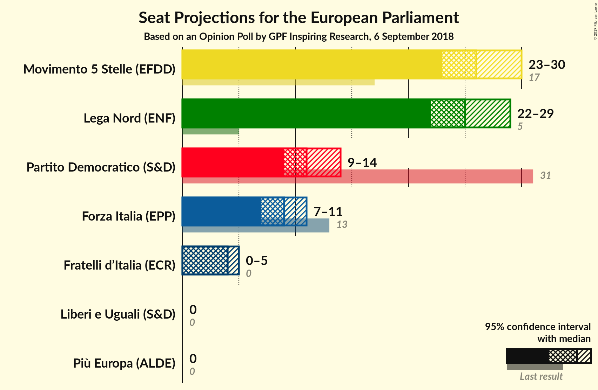
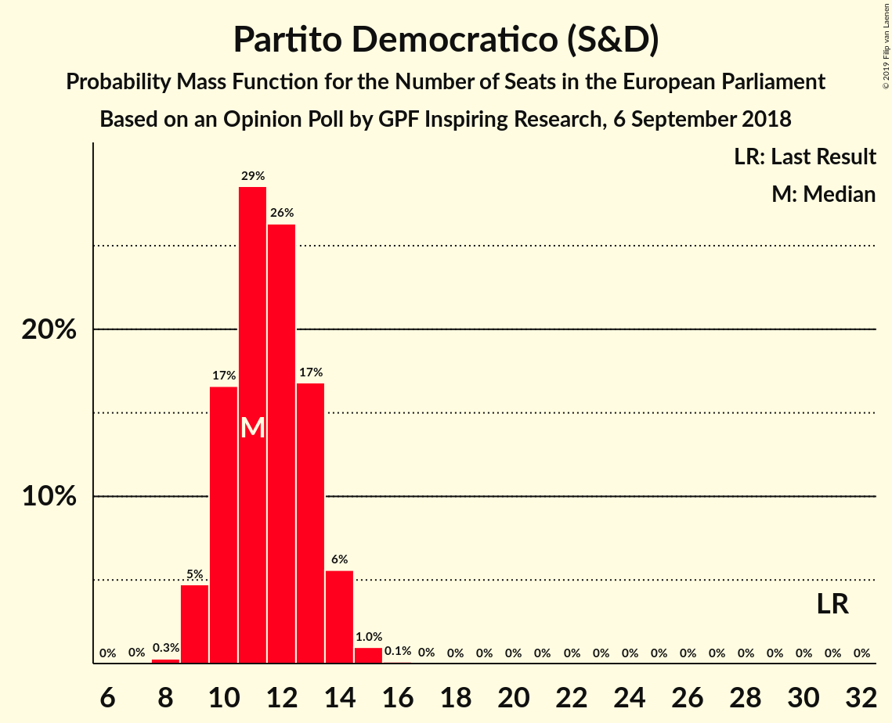

# Opinion Poll by GPF Inspiring Research, 6 September 2018

<a href="#voting-intentions">Voting Intentions</a> | <a href="#seats">Seats</a> | <a href="#coalitions">Coalitions</a> | <a href="#technical-information">Technical Information</a>

## Voting Intentions

### Confidence Intervals

| Party | Last Result | Poll Result | 80% Confidence Interval | 90% Confidence Interval | 95% Confidence Interval | 99% Confidence Interval |
|:-----:|:-----------:|:-----------:|:-----------------------:|:-----------------------:|:-----------------------:|:-----------------------:|
| Movimento 5 Stelle (EFDD) | 21.2% | 31.8% | 29.5–34.3% |28.8–35.0% |28.2–35.6% |27.1–36.8% |
| Lega Nord (ENF) | 6.2% | 30.8% | 28.5–33.3% |27.9–34.0% |27.3–34.6% |26.2–35.8% |
| Partito Democratico (S&D) | 40.8% | 15.5% | 13.7–17.5% |13.3–18.1% |12.8–18.6% |12.1–19.6% |
| Forza Italia (EPP) | 16.8% | 11.3% | 9.8–13.1% |9.3–13.6% |9.0–14.0% |8.3–14.9% |
| Fratelli d’Italia (ECR) | 3.7% | 4.4% | 3.5–5.7% |3.2–6.0% |3.0–6.3% |2.7–7.0% |
| Liberi e Uguali (S&D) | 0.0% | 2.4% | 1.8–3.5% |1.6–3.7% |1.5–4.0% |1.2–4.5% |
| Più Europa (ALDE) | 0.0% | 1.6% | 1.1–2.5% |1.0–2.8% |0.9–3.0% |0.7–3.5% |

*Note:* The poll result column reflects the actual value used in the calculations. Published results may vary slightly, and in addition be rounded to fewer digits.

## Seats

### Confidence Intervals

| Party | Last Result | Median | 80% Confidence Interval | 90% Confidence Interval | 95% Confidence Interval | 99% Confidence Interval |
|:-----:|:-----------:|:------:|:-----------------------:|:-----------------------:|:-----------------------:|:-----------------------:|
| <a href="#movimento-5-stelle-(efdd)">Movimento 5 Stelle (EFDD)</a> | 17 | 27 | 23–29 |22–29 |21–29 |21–29 |
| <a href="#lega-nord-(enf)">Lega Nord (ENF)</a> | 5 | 24 | 22–28 |22–28 |22–28 |20–30 |
| <a href="#partito-democratico-(s&d)">Partito Democratico (S&D)</a> | 31 | 14 | 10–14 |10–14 |10–15 |9–15 |
| <a href="#forza-italia-(epp)">Forza Italia (EPP)</a> | 13 | 10 | 10 |9–10 |8–10 |6–11 |
| <a href="#fratelli-d’italia-(ecr)">Fratelli d’Italia (ECR)</a> | 0 | 0 | 0–4 |0–4 |0–4 |0–5 |
| <a href="#liberi-e-uguali-(s&d)">Liberi e Uguali (S&D)</a> | 0 | 0 | 0 |0 |0 |0–4 |
| <a href="#più-europa-(alde)">Più Europa (ALDE)</a> | 0 | 0 | 0 |0 |0 |0 |

### Movimento 5 Stelle (EFDD)

*For a full overview of the results for this party, see the [Movimento 5 Stelle (EFDD)](party-movimento5stelleefdd.html) page.*

| Number of Seats | Probability | Accumulated | Special Marks |
|:---------------:|:-----------:|:-----------:|:-------------:|
| 17 | 0% | 100% | Last Result |
| 18 | 0% | 100% |  |
| 19 | 0% | 100% |  |
| 20 | 0% | 100% |  |
| 21 | 4% | 100% |  |
| 22 | 3% | 96% |  |
| 23 | 39% | 93% |  |
| 24 | 0% | 54% |  |
| 25 | 0.5% | 54% |  |
| 26 | 1.1% | 54% |  |
| 27 | 12% | 52% | Median |
| 28 | 2% | 40% |  |
| 29 | 38% | 38% |  |
| 30 | 0.4% | 0.4% |  |
| 31 | 0% | 0% |  |

### Lega Nord (ENF)

*For a full overview of the results for this party, see the [Lega Nord (ENF)](party-leganordenf.html) page.*

| Number of Seats | Probability | Accumulated | Special Marks |
|:---------------:|:-----------:|:-----------:|:-------------:|
| 5 | 0% | 100% | Last Result |
| 6 | 0% | 100% |  |
| 7 | 0% | 100% |  |
| 8 | 0% | 100% |  |
| 9 | 0% | 100% |  |
| 10 | 0% | 100% |  |
| 11 | 0% | 100% |  |
| 12 | 0% | 100% |  |
| 13 | 0% | 100% |  |
| 14 | 0% | 100% |  |
| 15 | 0% | 100% |  |
| 16 | 0% | 100% |  |
| 17 | 0% | 100% |  |
| 18 | 0% | 100% |  |
| 19 | 0% | 100% |  |
| 20 | 0.7% | 100% |  |
| 21 | 0.4% | 99.3% |  |
| 22 | 38% | 98.9% |  |
| 23 | 0.2% | 61% |  |
| 24 | 12% | 60% | Median |
| 25 | 0.8% | 48% |  |
| 26 | 6% | 48% |  |
| 27 | 0.2% | 42% |  |
| 28 | 40% | 41% |  |
| 29 | 0% | 1.1% |  |
| 30 | 1.1% | 1.1% |  |
| 31 | 0% | 0% |  |

### Partito Democratico (S&D)

*For a full overview of the results for this party, see the [Partito Democratico (S&D)](party-partitodemocraticosd.html) page.*

| Number of Seats | Probability | Accumulated | Special Marks |
|:---------------:|:-----------:|:-----------:|:-------------:|
| 8 | 0.1% | 100% |  |
| 9 | 0.6% | 99.9% |  |
| 10 | 12% | 99.3% |  |
| 11 | 5% | 87% |  |
| 12 | 1.1% | 82% |  |
| 13 | 0.8% | 81% |  |
| 14 | 76% | 80% | Median |
| 15 | 4% | 4% |  |
| 16 | 0% | 0.1% |  |
| 17 | 0% | 0.1% |  |
| 18 | 0.1% | 0.1% |  |
| 19 | 0% | 0% |  |
| 20 | 0% | 0% |  |
| 21 | 0% | 0% |  |
| 22 | 0% | 0% |  |
| 23 | 0% | 0% |  |
| 24 | 0% | 0% |  |
| 25 | 0% | 0% |  |
| 26 | 0% | 0% |  |
| 27 | 0% | 0% |  |
| 28 | 0% | 0% |  |
| 29 | 0% | 0% |  |
| 30 | 0% | 0% |  |
| 31 | 0% | 0% | Last Result |

### Forza Italia (EPP)

*For a full overview of the results for this party, see the [Forza Italia (EPP)](party-forzaitaliaepp.html) page.*

| Number of Seats | Probability | Accumulated | Special Marks |
|:---------------:|:-----------:|:-----------:|:-------------:|
| 6 | 2% | 100% |  |
| 7 | 0.6% | 98% |  |
| 8 | 0.7% | 98% |  |
| 9 | 6% | 97% |  |
| 10 | 90% | 91% | Median |
| 11 | 1.2% | 1.2% |  |
| 12 | 0% | 0% |  |
| 13 | 0% | 0% | Last Result |

### Fratelli d’Italia (ECR)

*For a full overview of the results for this party, see the [Fratelli d’Italia (ECR)](party-fratellid’italiaecr.html) page.*

| Number of Seats | Probability | Accumulated | Special Marks |
|:---------------:|:-----------:|:-----------:|:-------------:|
| 0 | 77% | 100% | Last Result, Median |
| 1 | 0% | 23% |  |
| 2 | 0% | 23% |  |
| 3 | 0% | 23% |  |
| 4 | 20% | 23% |  |
| 5 | 2% | 2% |  |
| 6 | 0.1% | 0.2% |  |
| 7 | 0.1% | 0.1% |  |
| 8 | 0% | 0% |  |

### Liberi e Uguali (S&D)

*For a full overview of the results for this party, see the [Liberi e Uguali (S&D)](party-liberieugualisd.html) page.*

| Number of Seats | Probability | Accumulated | Special Marks |
|:---------------:|:-----------:|:-----------:|:-------------:|
| 0 | 99.5% | 100% | Last Result, Median |
| 1 | 0% | 0.5% |  |
| 2 | 0% | 0.5% |  |
| 3 | 0% | 0.5% |  |
| 4 | 0.3% | 0.5% |  |
| 5 | 0.2% | 0.2% |  |
| 6 | 0% | 0% |  |

### Più Europa (ALDE)

*For a full overview of the results for this party, see the [Più Europa (ALDE)](party-piùeuropaalde.html) page.*

| Number of Seats | Probability | Accumulated | Special Marks |
|:---------------:|:-----------:|:-----------:|:-------------:|
| 0 | 99.8% | 100% | Last Result, Median |
| 1 | 0% | 0.2% |  |
| 2 | 0% | 0.2% |  |
| 3 | 0% | 0.2% |  |
| 4 | 0.2% | 0.2% |  |
| 5 | 0% | 0% |  |

## Coalitions

### Confidence Intervals

| Coalition | Last Result | Median | Majority? | 80% Confidence Interval | 90% Confidence Interval | 95% Confidence Interval | 99% Confidence Interval |
|:---------:|:-----------:|:------:|:---------:|:-----------------------:|:-----------------------:|:-----------------------:|:-----------------------:|
| Movimento 5 Stelle (EFDD) | 17 | 27 | 0% | 23–29 | 22–29 | 21–29 | 21–29 |
| Lega Nord (ENF) | 5 | 24 | 0% | 22–28 | 22–28 | 22–28 | 20–30 |
| Partito Democratico (S&D) – Liberi e Uguali (S&D) | 31 | 14 | 0% | 10–14 | 10–14 | 10–15 | 9–16 |
| Fratelli d’Italia (ECR) | 0 | 0 | 0% | 0–4 | 0–4 | 0–4 | 0–5 |
| Più Europa (ALDE) | 0 | 0 | 0% | 0 | 0 | 0 | 0 |

### Movimento 5 Stelle (EFDD)

| Number of Seats | Probability | Accumulated | Special Marks |
|:---------------:|:-----------:|:-----------:|:-------------:|
| 17 | 0% | 100% | Last Result |
| 18 | 0% | 100% |  |
| 19 | 0% | 100% |  |
| 20 | 0% | 100% |  |
| 21 | 4% | 100% |  |
| 22 | 3% | 96% |  |
| 23 | 39% | 93% |  |
| 24 | 0% | 54% |  |
| 25 | 0.5% | 54% |  |
| 26 | 1.1% | 54% |  |
| 27 | 12% | 52% | Median |
| 28 | 2% | 40% |  |
| 29 | 38% | 38% |  |
| 30 | 0.4% | 0.4% |  |
| 31 | 0% | 0% |  |

### Lega Nord (ENF)

| Number of Seats | Probability | Accumulated | Special Marks |
|:---------------:|:-----------:|:-----------:|:-------------:|
| 5 | 0% | 100% | Last Result |
| 6 | 0% | 100% |  |
| 7 | 0% | 100% |  |
| 8 | 0% | 100% |  |
| 9 | 0% | 100% |  |
| 10 | 0% | 100% |  |
| 11 | 0% | 100% |  |
| 12 | 0% | 100% |  |
| 13 | 0% | 100% |  |
| 14 | 0% | 100% |  |
| 15 | 0% | 100% |  |
| 16 | 0% | 100% |  |
| 17 | 0% | 100% |  |
| 18 | 0% | 100% |  |
| 19 | 0% | 100% |  |
| 20 | 0.7% | 100% |  |
| 21 | 0.4% | 99.3% |  |
| 22 | 38% | 98.9% |  |
| 23 | 0.2% | 61% |  |
| 24 | 12% | 60% | Median |
| 25 | 0.8% | 48% |  |
| 26 | 6% | 48% |  |
| 27 | 0.2% | 42% |  |
| 28 | 40% | 41% |  |
| 29 | 0% | 1.1% |  |
| 30 | 1.1% | 1.1% |  |
| 31 | 0% | 0% |  |

### Partito Democratico (S&D) – Liberi e Uguali (S&D)

| Number of Seats | Probability | Accumulated | Special Marks |
|:---------------:|:-----------:|:-----------:|:-------------:|
| 8 | 0.1% | 100% |  |
| 9 | 0.6% | 99.9% |  |
| 10 | 12% | 99.3% |  |
| 11 | 5% | 87% |  |
| 12 | 0.7% | 82% |  |
| 13 | 0.8% | 81% |  |
| 14 | 76% | 80% | Median |
| 15 | 4% | 5% |  |
| 16 | 0.1% | 0.5% |  |
| 17 | 0.2% | 0.4% |  |
| 18 | 0.1% | 0.2% |  |
| 19 | 0.1% | 0.1% |  |
| 20 | 0% | 0% |  |
| 21 | 0% | 0% |  |
| 22 | 0% | 0% |  |
| 23 | 0% | 0% |  |
| 24 | 0% | 0% |  |
| 25 | 0% | 0% |  |
| 26 | 0% | 0% |  |
| 27 | 0% | 0% |  |
| 28 | 0% | 0% |  |
| 29 | 0% | 0% |  |
| 30 | 0% | 0% |  |
| 31 | 0% | 0% | Last Result |

### Fratelli d’Italia (ECR)

| Number of Seats | Probability | Accumulated | Special Marks |
|:---------------:|:-----------:|:-----------:|:-------------:|
| 0 | 77% | 100% | Last Result, Median |
| 1 | 0% | 23% |  |
| 2 | 0% | 23% |  |
| 3 | 0% | 23% |  |
| 4 | 20% | 23% |  |
| 5 | 2% | 2% |  |
| 6 | 0.1% | 0.2% |  |
| 7 | 0.1% | 0.1% |  |
| 8 | 0% | 0% |  |

### Più Europa (ALDE)

| Number of Seats | Probability | Accumulated | Special Marks |
|:---------------:|:-----------:|:-----------:|:-------------:|
| 0 | 99.8% | 100% | Last Result, Median |
| 1 | 0% | 0.2% |  |
| 2 | 0% | 0.2% |  |
| 3 | 0% | 0.2% |  |
| 4 | 0.2% | 0.2% |  |
| 5 | 0% | 0% |  |

## Technical Information

### Opinion Poll

+ **Polling firm:** GPF Inspiring Research
+ **Commissioner(s):** —
+ **Fieldwork period:** 6 September 2018

### Calculations

+ **Sample size:** 613
+ **Simulations done:** 1,024
+ **Error estimate:** 5.40%

