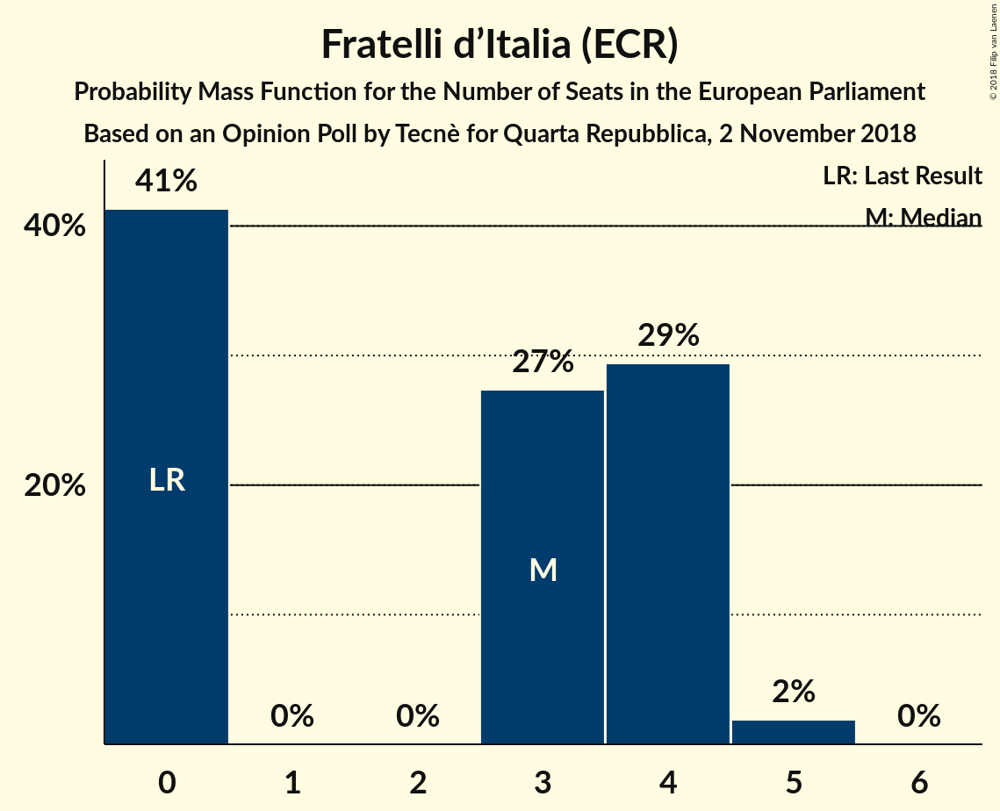

# Opinion Poll by Tecnè for Quarta Repubblica, 2 November 2018

<a href="#voting-intentions">Voting Intentions</a> | <a href="#seats">Seats</a> | <a href="#coalitions">Coalitions</a> | <a href="#technical-information">Technical Information</a>

## Voting Intentions

### Confidence Intervals

| Party | Last Result | Poll Result | 80% Confidence Interval | 90% Confidence Interval | 95% Confidence Interval | 99% Confidence Interval |
|:-----:|:-----------:|:-----------:|:-----------------------:|:-----------------------:|:-----------------------:|:-----------------------:|
| Lega Nord (ENF) | 6.2% | 30.2% | 28.2–32.3% |27.6–32.9% |27.1–33.5% |26.2–34.5% |
| Movimento 5 Stelle (EFDD) | 21.2% | 27.1% | 25.1–29.2% |24.6–29.8% |24.1–30.3% |23.2–31.3% |
| Partito Democratico (S&D) | 40.8% | 17.6% | 16.0–19.5% |15.5–20.0% |15.2–20.4% |14.4–21.3% |
| Forza Italia (EPP) | 16.8% | 11.1% | 9.8–12.6% |9.4–13.0% |9.1–13.4% |8.5–14.2% |
| Fratelli d’Italia (ECR) | 3.7% | 4.1% | 3.3–5.2% |3.1–5.4% |2.9–5.7% |2.6–6.2% |
| Liberi e Uguali (S&D) | 0.0% | 2.5% | 1.9–3.4% |1.7–3.6% |1.6–3.8% |1.4–4.3% |

*Note:* The poll result column reflects the actual value used in the calculations. Published results may vary slightly, and in addition be rounded to fewer digits.

## Seats

### Confidence Intervals

| Party | Last Result | Median | 80% Confidence Interval | 90% Confidence Interval | 95% Confidence Interval | 99% Confidence Interval |
|:-----:|:-----------:|:------:|:-----------------------:|:-----------------------:|:-----------------------:|:-----------------------:|
| <a href="#lega-nord-(enf)">Lega Nord (ENF)</a> | 5 | 24 | 22–25 |22–26 |21–27 |21–28 |
| <a href="#movimento-5-stelle-(efdd)">Movimento 5 Stelle (EFDD)</a> | 17 | 21 | 20–23 |19–24 |19–24 |18–25 |
| <a href="#partito-democratico-(s&d)">Partito Democratico (S&D)</a> | 31 | 13 | 12–14 |11–15 |11–15 |10–16 |
| <a href="#forza-italia-(epp)">Forza Italia (EPP)</a> | 13 | 9 | 8–10 |7–10 |7–11 |7–11 |
| <a href="#fratelli-d’italia-(ecr)">Fratelli d’Italia (ECR)</a> | 0 | 3 | 0–4 |0–4 |0–4 |0–5 |
| <a href="#liberi-e-uguali-(s&d)">Liberi e Uguali (S&D)</a> | 0 | 0 | 0 |0 |0 |0–3 |

### Lega Nord (ENF)

*For a full overview of the results for this party, see the [Lega Nord (ENF)](party-leganordenf.html) page.*

| Number of Seats | Probability | Accumulated | Special Marks |
|:---------------:|:-----------:|:-----------:|:-------------:|
| 5 | 0% | 100% | Last Result |
| 6 | 0% | 100% |  |
| 7 | 0% | 100% |  |
| 8 | 0% | 100% |  |
| 9 | 0% | 100% |  |
| 10 | 0% | 100% |  |
| 11 | 0% | 100% |  |
| 12 | 0% | 100% |  |
| 13 | 0% | 100% |  |
| 14 | 0% | 100% |  |
| 15 | 0% | 100% |  |
| 16 | 0% | 100% |  |
| 17 | 0% | 100% |  |
| 18 | 0% | 100% |  |
| 19 | 0.1% | 100% |  |
| 20 | 0.4% | 99.9% |  |
| 21 | 4% | 99.6% |  |
| 22 | 16% | 96% |  |
| 23 | 23% | 80% |  |
| 24 | 25% | 57% | Median |
| 25 | 23% | 32% |  |
| 26 | 6% | 9% |  |
| 27 | 2% | 3% |  |
| 28 | 0.5% | 0.5% |  |
| 29 | 0% | 0% |  |

### Movimento 5 Stelle (EFDD)

*For a full overview of the results for this party, see the [Movimento 5 Stelle (EFDD)](party-movimento5stelleefdd.html) page.*

| Number of Seats | Probability | Accumulated | Special Marks |
|:---------------:|:-----------:|:-----------:|:-------------:|
| 17 | 0.1% | 100% | Last Result |
| 18 | 1.0% | 99.9% |  |
| 19 | 9% | 98.9% |  |
| 20 | 17% | 90% |  |
| 21 | 26% | 73% | Median |
| 22 | 22% | 47% |  |
| 23 | 19% | 25% |  |
| 24 | 6% | 7% |  |
| 25 | 0.8% | 0.9% |  |
| 26 | 0.1% | 0.2% |  |
| 27 | 0% | 0% |  |

### Partito Democratico (S&D)

*For a full overview of the results for this party, see the [Partito Democratico (S&D)](party-partitodemocraticosd.html) page.*

| Number of Seats | Probability | Accumulated | Special Marks |
|:---------------:|:-----------:|:-----------:|:-------------:|
| 10 | 1.0% | 100% |  |
| 11 | 6% | 98.9% |  |
| 12 | 27% | 93% |  |
| 13 | 36% | 66% | Median |
| 14 | 23% | 30% |  |
| 15 | 5% | 7% |  |
| 16 | 1.4% | 2% |  |
| 17 | 0.1% | 0.1% |  |
| 18 | 0% | 0% |  |
| 19 | 0% | 0% |  |
| 20 | 0% | 0% |  |
| 21 | 0% | 0% |  |
| 22 | 0% | 0% |  |
| 23 | 0% | 0% |  |
| 24 | 0% | 0% |  |
| 25 | 0% | 0% |  |
| 26 | 0% | 0% |  |
| 27 | 0% | 0% |  |
| 28 | 0% | 0% |  |
| 29 | 0% | 0% |  |
| 30 | 0% | 0% |  |
| 31 | 0% | 0% | Last Result |

### Forza Italia (EPP)

*For a full overview of the results for this party, see the [Forza Italia (EPP)](party-forzaitaliaepp.html) page.*

| Number of Seats | Probability | Accumulated | Special Marks |
|:---------------:|:-----------:|:-----------:|:-------------:|
| 6 | 0.2% | 100% |  |
| 7 | 5% | 99.8% |  |
| 8 | 34% | 94% |  |
| 9 | 41% | 61% | Median |
| 10 | 16% | 20% |  |
| 11 | 4% | 4% |  |
| 12 | 0.2% | 0.3% |  |
| 13 | 0% | 0% | Last Result |

### Fratelli d’Italia (ECR)

*For a full overview of the results for this party, see the [Fratelli d’Italia (ECR)](party-fratellid’italiaecr.html) page.*

| Number of Seats | Probability | Accumulated | Special Marks |
|:---------------:|:-----------:|:-----------:|:-------------:|
| 0 | 41% | 100% | Last Result |
| 1 | 0% | 59% |  |
| 2 | 0% | 59% |  |
| 3 | 29% | 59% | Median |
| 4 | 28% | 30% |  |
| 5 | 1.5% | 1.5% |  |
| 6 | 0% | 0% |  |

### Liberi e Uguali (S&D)

*For a full overview of the results for this party, see the [Liberi e Uguali (S&D)](party-liberieugualisd.html) page.*

| Number of Seats | Probability | Accumulated | Special Marks |
|:---------------:|:-----------:|:-----------:|:-------------:|
| 0 | 98.8% | 100% | Last Result, Median |
| 1 | 0% | 1.2% |  |
| 2 | 0% | 1.2% |  |
| 3 | 1.0% | 1.2% |  |
| 4 | 0.2% | 0.2% |  |
| 5 | 0% | 0% |  |

## Coalitions

### Confidence Intervals

| Coalition | Last Result | Median | Majority? | 80% Confidence Interval | 90% Confidence Interval | 95% Confidence Interval | 99% Confidence Interval |
|:---------:|:-----------:|:------:|:---------:|:-----------------------:|:-----------------------:|:-----------------------:|:-----------------------:|
| Lega Nord (ENF) | 5 | 24 | 0% | 22–25 | 22–26 | 21–27 | 21–28 |
| Movimento 5 Stelle (EFDD) | 17 | 21 | 0% | 20–23 | 19–24 | 19–24 | 18–25 |
| Partito Democratico (S&D) – Liberi e Uguali (S&D) | 31 | 13 | 0% | 12–14 | 11–15 | 11–15 | 10–16 |
| Fratelli d’Italia (ECR) | 0 | 3 | 0% | 0–4 | 0–4 | 0–4 | 0–5 |

### Lega Nord (ENF)

| Number of Seats | Probability | Accumulated | Special Marks |
|:---------------:|:-----------:|:-----------:|:-------------:|
| 5 | 0% | 100% | Last Result |
| 6 | 0% | 100% |  |
| 7 | 0% | 100% |  |
| 8 | 0% | 100% |  |
| 9 | 0% | 100% |  |
| 10 | 0% | 100% |  |
| 11 | 0% | 100% |  |
| 12 | 0% | 100% |  |
| 13 | 0% | 100% |  |
| 14 | 0% | 100% |  |
| 15 | 0% | 100% |  |
| 16 | 0% | 100% |  |
| 17 | 0% | 100% |  |
| 18 | 0% | 100% |  |
| 19 | 0.1% | 100% |  |
| 20 | 0.4% | 99.9% |  |
| 21 | 4% | 99.6% |  |
| 22 | 16% | 96% |  |
| 23 | 23% | 80% |  |
| 24 | 25% | 57% | Median |
| 25 | 23% | 32% |  |
| 26 | 6% | 9% |  |
| 27 | 2% | 3% |  |
| 28 | 0.5% | 0.5% |  |
| 29 | 0% | 0% |  |

### Movimento 5 Stelle (EFDD)

| Number of Seats | Probability | Accumulated | Special Marks |
|:---------------:|:-----------:|:-----------:|:-------------:|
| 17 | 0.1% | 100% | Last Result |
| 18 | 1.0% | 99.9% |  |
| 19 | 9% | 98.9% |  |
| 20 | 17% | 90% |  |
| 21 | 26% | 73% | Median |
| 22 | 22% | 47% |  |
| 23 | 19% | 25% |  |
| 24 | 6% | 7% |  |
| 25 | 0.8% | 0.9% |  |
| 26 | 0.1% | 0.2% |  |
| 27 | 0% | 0% |  |

### Partito Democratico (S&D) – Liberi e Uguali (S&D)

| Number of Seats | Probability | Accumulated | Special Marks |
|:---------------:|:-----------:|:-----------:|:-------------:|
| 10 | 1.0% | 100% |  |
| 11 | 6% | 99.0% |  |
| 12 | 26% | 93% |  |
| 13 | 36% | 67% | Median |
| 14 | 23% | 31% |  |
| 15 | 5% | 8% |  |
| 16 | 2% | 2% |  |
| 17 | 0.3% | 0.4% |  |
| 18 | 0.1% | 0.1% |  |
| 19 | 0% | 0% |  |
| 20 | 0% | 0% |  |
| 21 | 0% | 0% |  |
| 22 | 0% | 0% |  |
| 23 | 0% | 0% |  |
| 24 | 0% | 0% |  |
| 25 | 0% | 0% |  |
| 26 | 0% | 0% |  |
| 27 | 0% | 0% |  |
| 28 | 0% | 0% |  |
| 29 | 0% | 0% |  |
| 30 | 0% | 0% |  |
| 31 | 0% | 0% | Last Result |

### Fratelli d’Italia (ECR)

| Number of Seats | Probability | Accumulated | Special Marks |
|:---------------:|:-----------:|:-----------:|:-------------:|
| 0 | 41% | 100% | Last Result |
| 1 | 0% | 59% |  |
| 2 | 0% | 59% |  |
| 3 | 29% | 59% | Median |
| 4 | 28% | 30% |  |
| 5 | 1.5% | 1.5% |  |
| 6 | 0% | 0% |  |

## Technical Information

### Opinion Poll

+ **Polling firm:** Tecnè
+ **Commissioner(s):** Quarta Repubblica
+ **Fieldwork period:** 2 November 2018

### Calculations

+ **Sample size:** 805
+ **Simulations done:** 131,072
+ **Error estimate:** 0.91%

