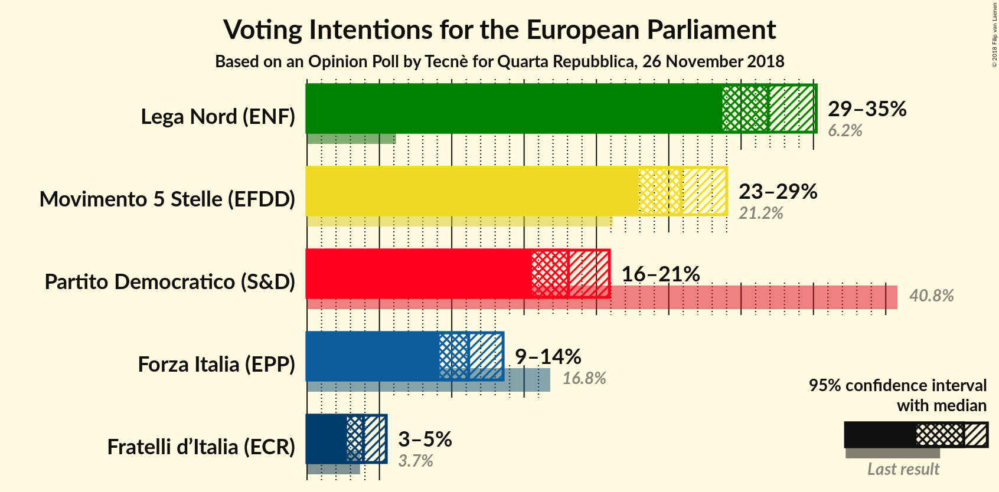
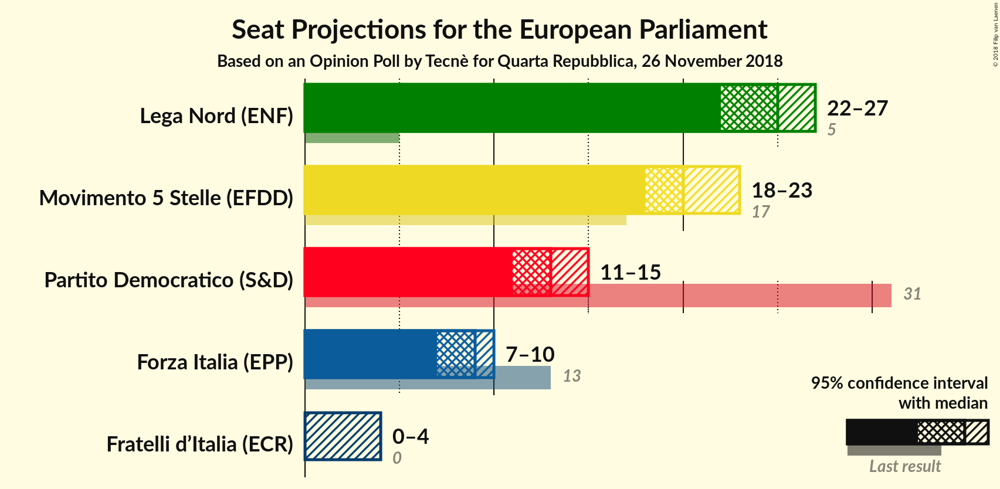
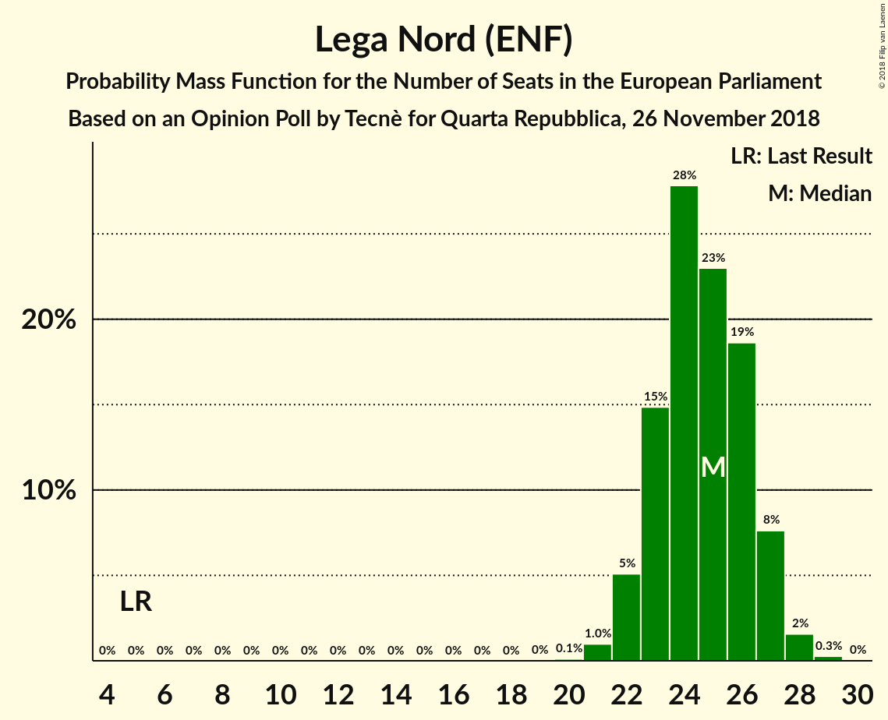
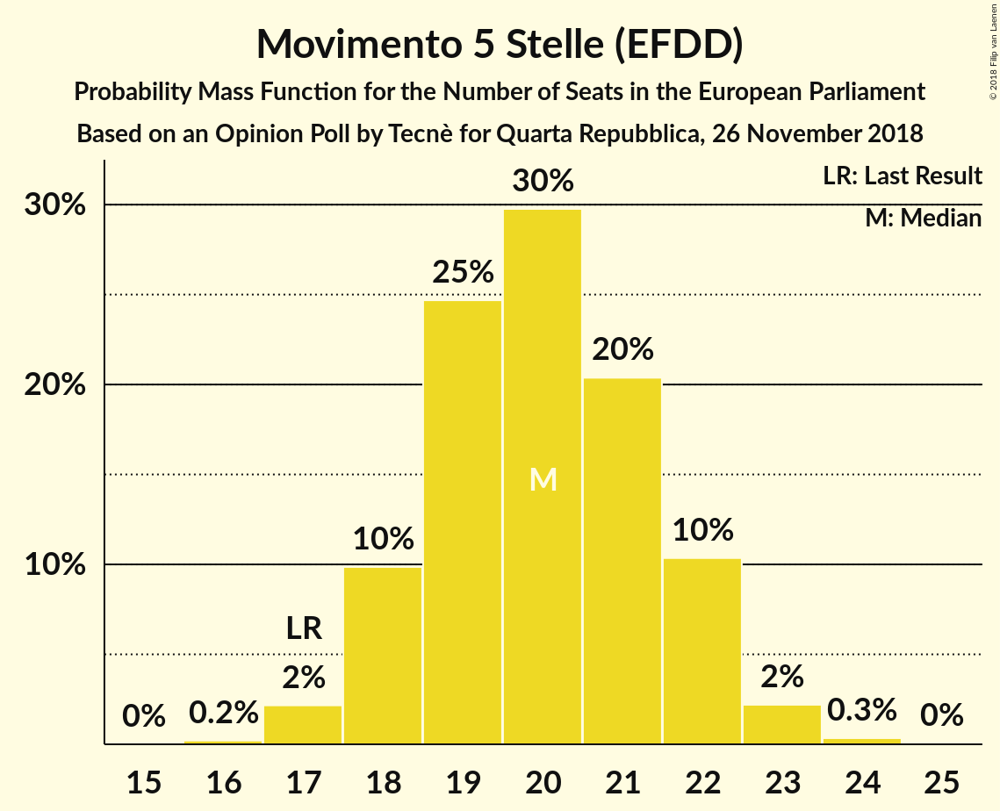
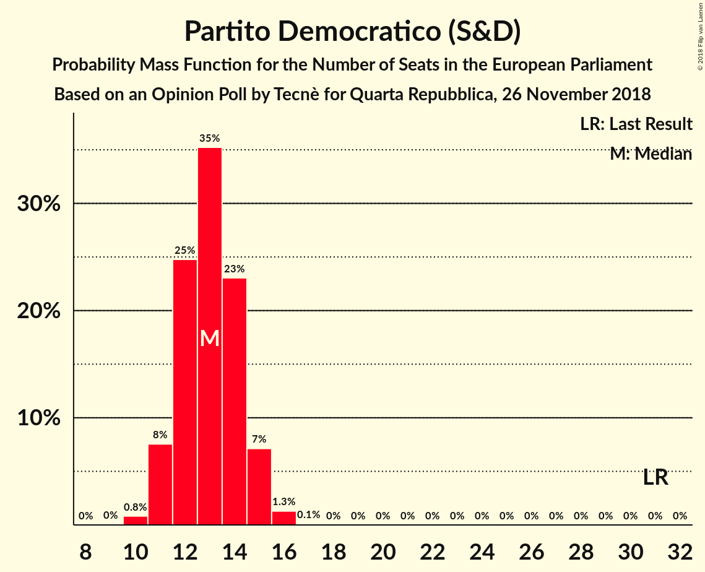
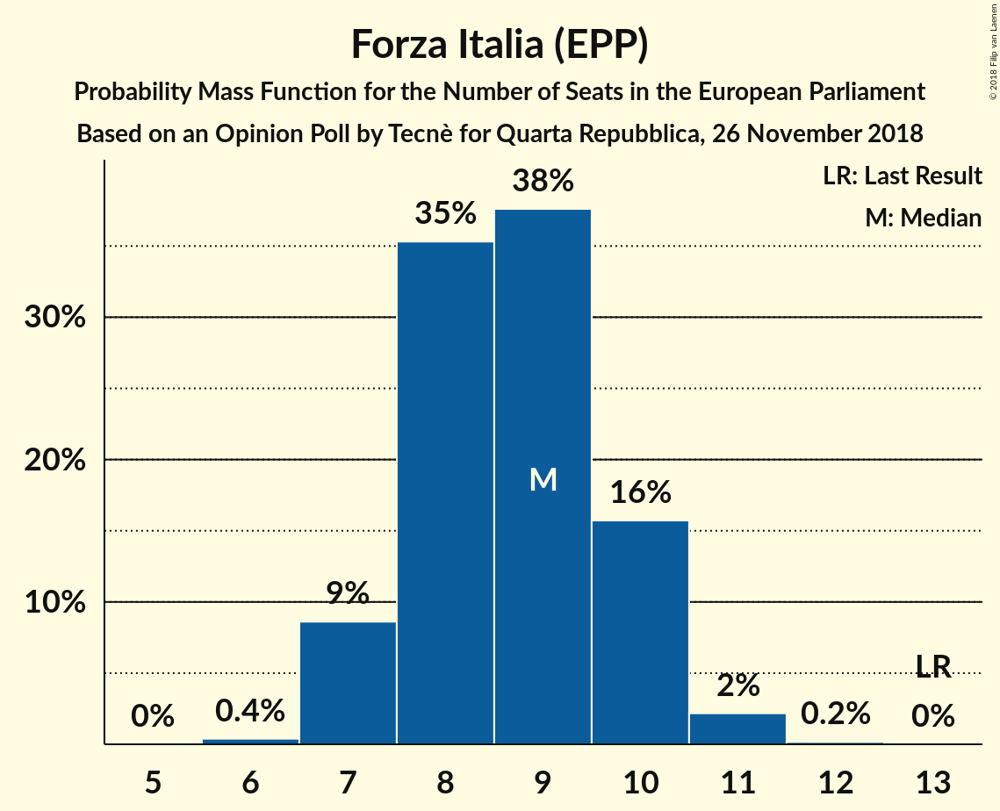
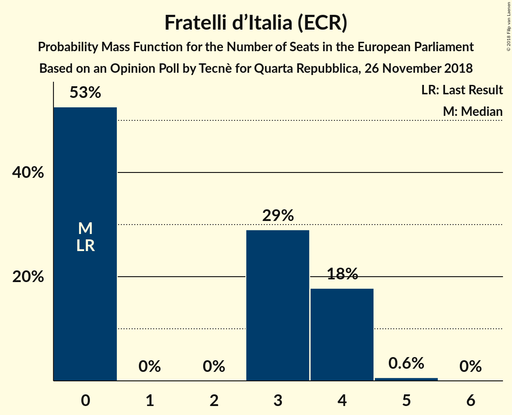

# Opinion Poll by Tecnè for Quarta Repubblica, 26 November 2018

<a href="#voting-intentions">Voting Intentions</a> | <a href="#seats">Seats</a> | <a href="#coalitions">Coalitions</a> | <a href="#technical-information">Technical Information</a>

## Voting Intentions

### Confidence Intervals

| Party | Last Result | Poll Result | 80% Confidence Interval | 90% Confidence Interval | 95% Confidence Interval | 99% Confidence Interval |
|:-----:|:-----------:|:-----------:|:-----------------------:|:-----------------------:|:-----------------------:|:-----------------------:|
| Lega Nord (ENF) | 6.2% | 31.9% | 29.8–34.0% |29.2–34.7% |28.7–35.2% |27.8–36.2% |
| Movimento 5 Stelle (EFDD) | 21.2% | 25.8% | 23.9–27.9% |23.4–28.5% |22.9–29.0% |22.0–30.0% |
| Partito Democratico (S&D) | 40.8% | 18.1% | 16.4–19.9% |15.9–20.4% |15.5–20.9% |14.8–21.8% |
| Forza Italia (EPP) | 16.8% | 11.2% | 9.8–12.7% |9.5–13.2% |9.2–13.5% |8.6–14.3% |
| Fratelli d’Italia (ECR) | 3.7% | 3.9% | 3.1–4.9% |2.9–5.2% |2.8–5.5% |2.4–6.0% |

*Note:* The poll result column reflects the actual value used in the calculations. Published results may vary slightly, and in addition be rounded to fewer digits.

## Seats

### Confidence Intervals

| Party | Last Result | Median | 80% Confidence Interval | 90% Confidence Interval | 95% Confidence Interval | 99% Confidence Interval |
|:-----:|:-----------:|:------:|:-----------------------:|:-----------------------:|:-----------------------:|:-----------------------:|
| <a href="#lega-nord-(enf)">Lega Nord (ENF)</a> | 5 | 25 | 23–26 |22–27 |22–27 |21–28 |
| <a href="#movimento-5-stelle-(efdd)">Movimento 5 Stelle (EFDD)</a> | 17 | 20 | 18–22 |18–22 |18–23 |17–23 |
| <a href="#partito-democratico-(s&d)">Partito Democratico (S&D)</a> | 31 | 13 | 12–14 |11–15 |11–15 |10–16 |
| <a href="#forza-italia-(epp)">Forza Italia (EPP)</a> | 13 | 9 | 8–10 |7–10 |7–10 |7–11 |
| <a href="#fratelli-d’italia-(ecr)">Fratelli d’Italia (ECR)</a> | 0 | 0 | 0–4 |0–4 |0–4 |0–5 |

### Lega Nord (ENF)

*For a full overview of the results for this party, see the [Lega Nord (ENF)](party-leganordenf.html) page.*

| Number of Seats | Probability | Accumulated | Special Marks |
|:---------------:|:-----------:|:-----------:|:-------------:|
| 5 | 0% | 100% | Last Result |
| 6 | 0% | 100% |  |
| 7 | 0% | 100% |  |
| 8 | 0% | 100% |  |
| 9 | 0% | 100% |  |
| 10 | 0% | 100% |  |
| 11 | 0% | 100% |  |
| 12 | 0% | 100% |  |
| 13 | 0% | 100% |  |
| 14 | 0% | 100% |  |
| 15 | 0% | 100% |  |
| 16 | 0% | 100% |  |
| 17 | 0% | 100% |  |
| 18 | 0% | 100% |  |
| 19 | 0% | 100% |  |
| 20 | 0.1% | 100% |  |
| 21 | 1.0% | 99.9% |  |
| 22 | 5% | 98.9% |  |
| 23 | 15% | 94% |  |
| 24 | 26% | 78% |  |
| 25 | 27% | 53% | Median |
| 26 | 17% | 26% |  |
| 27 | 7% | 9% |  |
| 28 | 2% | 2% |  |
| 29 | 0.3% | 0.3% |  |
| 30 | 0% | 0% |  |

### Movimento 5 Stelle (EFDD)

*For a full overview of the results for this party, see the [Movimento 5 Stelle (EFDD)](party-movimento5stelleefdd.html) page.*

| Number of Seats | Probability | Accumulated | Special Marks |
|:---------------:|:-----------:|:-----------:|:-------------:|
| 16 | 0.2% | 100% |  |
| 17 | 2% | 99.8% | Last Result |
| 18 | 10% | 98% |  |
| 19 | 24% | 88% |  |
| 20 | 30% | 64% | Median |
| 21 | 22% | 34% |  |
| 22 | 9% | 12% |  |
| 23 | 2% | 3% |  |
| 24 | 0.3% | 0.4% |  |
| 25 | 0% | 0% |  |

### Partito Democratico (S&D)

*For a full overview of the results for this party, see the [Partito Democratico (S&D)](party-partitodemocraticosd.html) page.*

| Number of Seats | Probability | Accumulated | Special Marks |
|:---------------:|:-----------:|:-----------:|:-------------:|
| 10 | 0.8% | 100% |  |
| 11 | 8% | 99.1% |  |
| 12 | 25% | 92% |  |
| 13 | 35% | 67% | Median |
| 14 | 23% | 32% |  |
| 15 | 7% | 9% |  |
| 16 | 1.3% | 1.4% |  |
| 17 | 0.1% | 0.1% |  |
| 18 | 0% | 0% |  |
| 19 | 0% | 0% |  |
| 20 | 0% | 0% |  |
| 21 | 0% | 0% |  |
| 22 | 0% | 0% |  |
| 23 | 0% | 0% |  |
| 24 | 0% | 0% |  |
| 25 | 0% | 0% |  |
| 26 | 0% | 0% |  |
| 27 | 0% | 0% |  |
| 28 | 0% | 0% |  |
| 29 | 0% | 0% |  |
| 30 | 0% | 0% |  |
| 31 | 0% | 0% | Last Result |

### Forza Italia (EPP)

*For a full overview of the results for this party, see the [Forza Italia (EPP)](party-forzaitaliaepp.html) page.*

| Number of Seats | Probability | Accumulated | Special Marks |
|:---------------:|:-----------:|:-----------:|:-------------:|
| 6 | 0.4% | 100% |  |
| 7 | 8% | 99.6% |  |
| 8 | 35% | 91% |  |
| 9 | 39% | 57% | Median |
| 10 | 16% | 18% |  |
| 11 | 2% | 2% |  |
| 12 | 0.2% | 0.2% |  |
| 13 | 0% | 0% | Last Result |

### Fratelli d’Italia (ECR)

*For a full overview of the results for this party, see the [Fratelli d’Italia (ECR)](party-fratellid’italiaecr.html) page.*

| Number of Seats | Probability | Accumulated | Special Marks |
|:---------------:|:-----------:|:-----------:|:-------------:|
| 0 | 53% | 100% | Last Result, Median |
| 1 | 0% | 47% |  |
| 2 | 0% | 47% |  |
| 3 | 29% | 47% |  |
| 4 | 18% | 18% |  |
| 5 | 0.6% | 0.6% |  |
| 6 | 0% | 0% |  |

## Coalitions

### Confidence Intervals

| Coalition | Last Result | Median | Majority? | 80% Confidence Interval | 90% Confidence Interval | 95% Confidence Interval | 99% Confidence Interval |
|:---------:|:-----------:|:------:|:---------:|:-----------------------:|:-----------------------:|:-----------------------:|:-----------------------:|
| Lega Nord (ENF) | 5 | 25 | 0% | 23–26 | 22–27 | 22–27 | 21–28 |
| Movimento 5 Stelle (EFDD) | 17 | 20 | 0% | 18–22 | 18–22 | 18–23 | 17–23 |
| Fratelli d’Italia (ECR) | 0 | 0 | 0% | 0–4 | 0–4 | 0–4 | 0–5 |

### Lega Nord (ENF)

| Number of Seats | Probability | Accumulated | Special Marks |
|:---------------:|:-----------:|:-----------:|:-------------:|
| 5 | 0% | 100% | Last Result |
| 6 | 0% | 100% |  |
| 7 | 0% | 100% |  |
| 8 | 0% | 100% |  |
| 9 | 0% | 100% |  |
| 10 | 0% | 100% |  |
| 11 | 0% | 100% |  |
| 12 | 0% | 100% |  |
| 13 | 0% | 100% |  |
| 14 | 0% | 100% |  |
| 15 | 0% | 100% |  |
| 16 | 0% | 100% |  |
| 17 | 0% | 100% |  |
| 18 | 0% | 100% |  |
| 19 | 0% | 100% |  |
| 20 | 0.1% | 100% |  |
| 21 | 1.0% | 99.9% |  |
| 22 | 5% | 98.9% |  |
| 23 | 15% | 94% |  |
| 24 | 26% | 78% |  |
| 25 | 27% | 53% | Median |
| 26 | 17% | 26% |  |
| 27 | 7% | 9% |  |
| 28 | 2% | 2% |  |
| 29 | 0.3% | 0.3% |  |
| 30 | 0% | 0% |  |

### Movimento 5 Stelle (EFDD)

| Number of Seats | Probability | Accumulated | Special Marks |
|:---------------:|:-----------:|:-----------:|:-------------:|
| 16 | 0.2% | 100% |  |
| 17 | 2% | 99.8% | Last Result |
| 18 | 10% | 98% |  |
| 19 | 24% | 88% |  |
| 20 | 30% | 64% | Median |
| 21 | 22% | 34% |  |
| 22 | 9% | 12% |  |
| 23 | 2% | 3% |  |
| 24 | 0.3% | 0.4% |  |
| 25 | 0% | 0% |  |

### Fratelli d’Italia (ECR)

| Number of Seats | Probability | Accumulated | Special Marks |
|:---------------:|:-----------:|:-----------:|:-------------:|
| 0 | 53% | 100% | Last Result, Median |
| 1 | 0% | 47% |  |
| 2 | 0% | 47% |  |
| 3 | 29% | 47% |  |
| 4 | 18% | 18% |  |
| 5 | 0.6% | 0.6% |  |
| 6 | 0% | 0% |  |

## Technical Information

### Opinion Poll

+ **Polling firm:** Tecnè
+ **Commissioner(s):** Quarta Repubblica
+ **Fieldwork period:** 26 November 2018

### Calculations

+ **Sample size:** 797
+ **Simulations done:** 1,048,576
+ **Error estimate:** 0.30%

