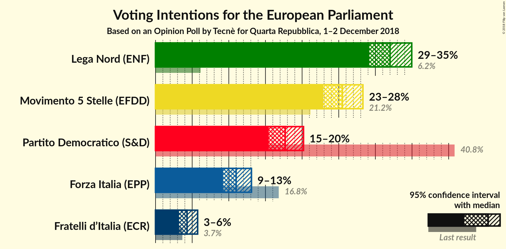
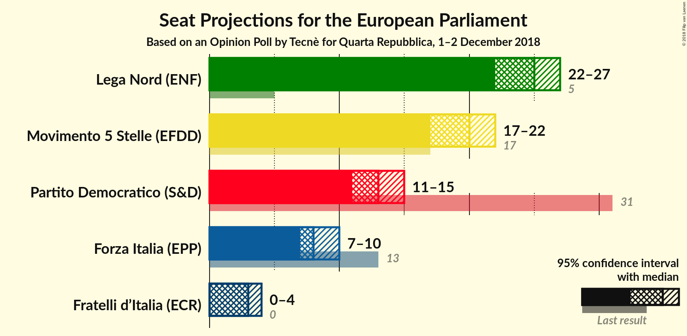
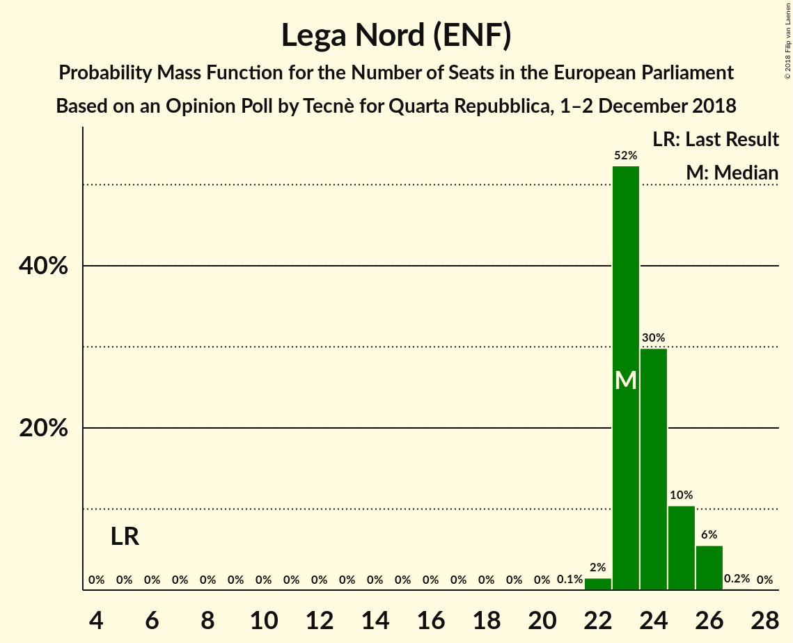
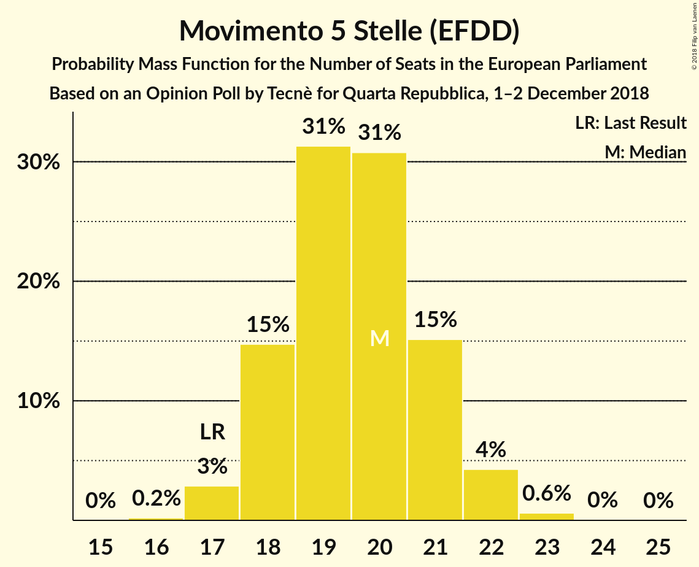
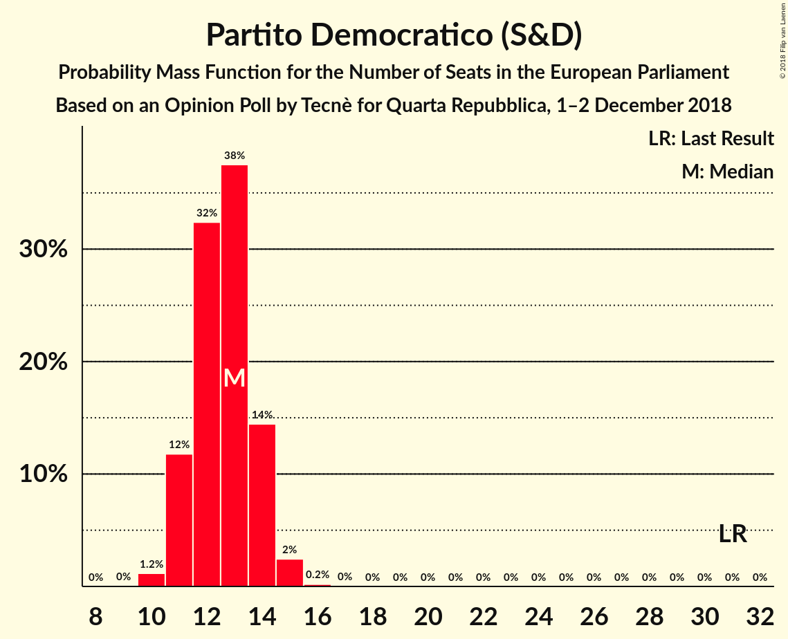
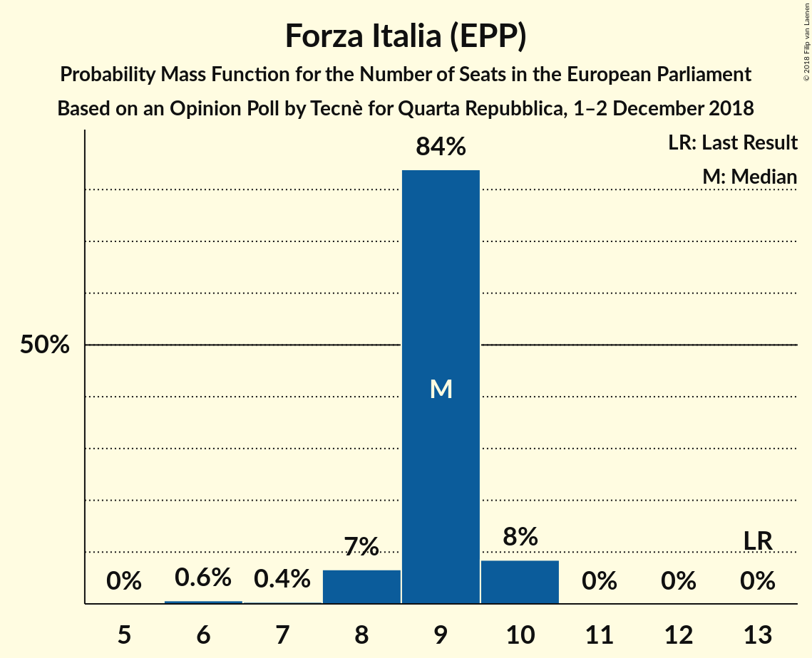
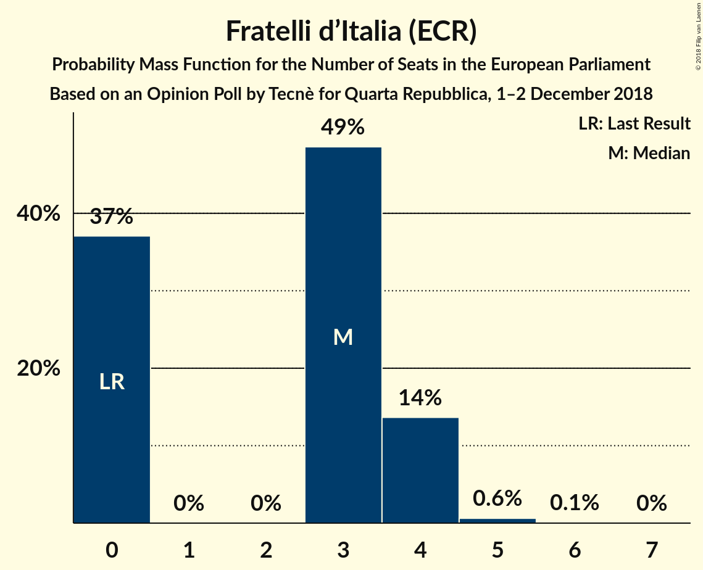
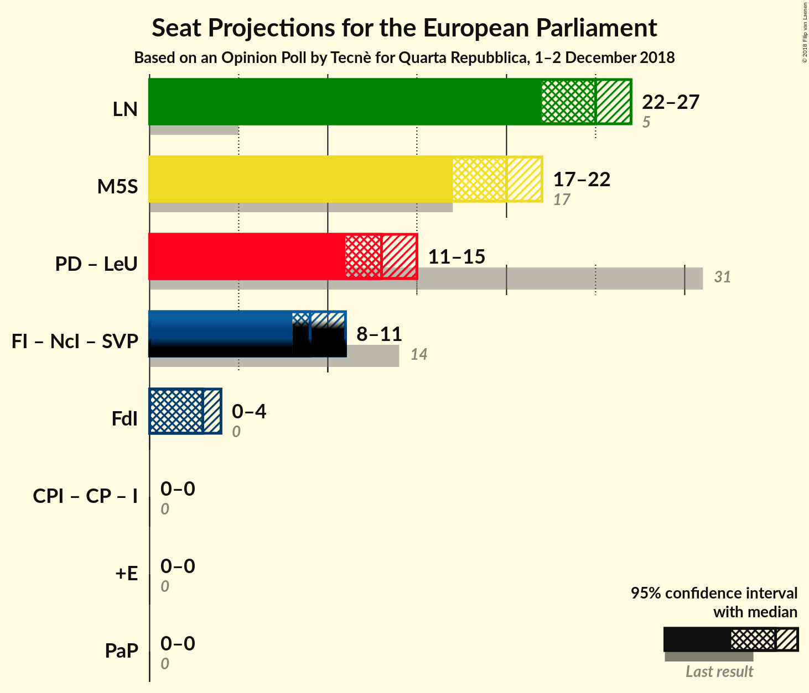

# Opinion Poll by Tecnè for Quarta Repubblica, 1–2 December 2018

<a href="#voting-intentions">Voting Intentions</a> | <a href="#seats">Seats</a> | <a href="#coalitions">Coalitions</a> | <a href="#technical-information">Technical Information</a>

## Voting Intentions

### Confidence Intervals

| Party | Last Result | Poll Result | 80% Confidence Interval | 90% Confidence Interval | 95% Confidence Interval | 99% Confidence Interval |
|:-----:|:-----------:|:-----------:|:-----------------------:|:-----------------------:|:-----------------------:|:-----------------------:|
| Lega Nord (ENF) | 6.2% | 32.0% | 30.1–33.9% |29.6–34.5% |29.2–35.0% |28.3–35.9% |
| Movimento 5 Stelle (EFDD) | 21.2% | 25.5% | 23.8–27.3% |23.3–27.8% |22.9–28.3% |22.1–29.2% |
| Partito Democratico (S&D) | 40.8% | 17.7% | 16.2–19.3% |15.8–19.8% |15.5–20.2% |14.8–21.0% |
| Forza Italia (EPP) | 16.8% | 11.0% | 9.8–12.4% |9.5–12.8% |9.2–13.1% |8.7–13.8% |
| Fratelli d’Italia (ECR) | 3.7% | 4.3% | 3.6–5.2% |3.4–5.5% |3.2–5.7% |2.9–6.2% |

*Note:* The poll result column reflects the actual value used in the calculations. Published results may vary slightly, and in addition be rounded to fewer digits.

## Seats

### Confidence Intervals

| Party | Last Result | Median | 80% Confidence Interval | 90% Confidence Interval | 95% Confidence Interval | 99% Confidence Interval |
|:-----:|:-----------:|:------:|:-----------------------:|:-----------------------:|:-----------------------:|:-----------------------:|
| <a href="#lega-nord-(enf)">Lega Nord (ENF)</a> | 5 | 23 | 23–25 |23–26 |23–26 |22–26 |
| <a href="#movimento-5-stelle-(efdd)">Movimento 5 Stelle (EFDD)</a> | 17 | 22 | 17–22 |16–22 |16–23 |16–23 |
| <a href="#partito-democratico-(s&d)">Partito Democratico (S&D)</a> | 31 | 11 | 11–14 |11–15 |11–15 |10–16 |
| <a href="#forza-italia-(epp)">Forza Italia (EPP)</a> | 13 | 9 | 9 |8–10 |8–10 |6–10 |
| <a href="#fratelli-d’italia-(ecr)">Fratelli d’Italia (ECR)</a> | 0 | 3 | 0–4 |0–4 |0–4 |0–5 |

### Lega Nord (ENF)

*For a full overview of the results for this party, see the [Lega Nord (ENF)](party-leganordenf.html) page.*

| Number of Seats | Probability | Accumulated | Special Marks |
|:---------------:|:-----------:|:-----------:|:-------------:|
| 5 | 0% | 100% | Last Result |
| 6 | 0% | 100% |  |
| 7 | 0% | 100% |  |
| 8 | 0% | 100% |  |
| 9 | 0% | 100% |  |
| 10 | 0% | 100% |  |
| 11 | 0% | 100% |  |
| 12 | 0% | 100% |  |
| 13 | 0% | 100% |  |
| 14 | 0% | 100% |  |
| 15 | 0% | 100% |  |
| 16 | 0% | 100% |  |
| 17 | 0% | 100% |  |
| 18 | 0% | 100% |  |
| 19 | 0% | 100% |  |
| 20 | 0% | 100% |  |
| 21 | 0.1% | 100% |  |
| 22 | 2% | 99.9% |  |
| 23 | 52% | 98% | Median |
| 24 | 30% | 46% |  |
| 25 | 10% | 16% |  |
| 26 | 6% | 6% |  |
| 27 | 0.2% | 0.2% |  |
| 28 | 0% | 0% |  |

### Movimento 5 Stelle (EFDD)

*For a full overview of the results for this party, see the [Movimento 5 Stelle (EFDD)](party-movimento5stelleefdd.html) page.*

| Number of Seats | Probability | Accumulated | Special Marks |
|:---------------:|:-----------:|:-----------:|:-------------:|
| 16 | 6% | 100% |  |
| 17 | 6% | 93% | Last Result |
| 18 | 2% | 87% |  |
| 19 | 0.2% | 85% |  |
| 20 | 0.4% | 85% |  |
| 21 | 6% | 85% |  |
| 22 | 76% | 79% | Median |
| 23 | 3% | 3% |  |
| 24 | 0.1% | 0.1% |  |
| 25 | 0% | 0% |  |

### Partito Democratico (S&D)

*For a full overview of the results for this party, see the [Partito Democratico (S&D)](party-partitodemocraticosd.html) page.*

| Number of Seats | Probability | Accumulated | Special Marks |
|:---------------:|:-----------:|:-----------:|:-------------:|
| 9 | 0.1% | 100% |  |
| 10 | 0.9% | 99.9% |  |
| 11 | 60% | 99.0% | Median |
| 12 | 19% | 39% |  |
| 13 | 9% | 20% |  |
| 14 | 4% | 11% |  |
| 15 | 6% | 7% |  |
| 16 | 0.7% | 0.7% |  |
| 17 | 0% | 0% |  |
| 18 | 0% | 0% |  |
| 19 | 0% | 0% |  |
| 20 | 0% | 0% |  |
| 21 | 0% | 0% |  |
| 22 | 0% | 0% |  |
| 23 | 0% | 0% |  |
| 24 | 0% | 0% |  |
| 25 | 0% | 0% |  |
| 26 | 0% | 0% |  |
| 27 | 0% | 0% |  |
| 28 | 0% | 0% |  |
| 29 | 0% | 0% |  |
| 30 | 0% | 0% |  |
| 31 | 0% | 0% | Last Result |

### Forza Italia (EPP)

*For a full overview of the results for this party, see the [Forza Italia (EPP)](party-forzaitaliaepp.html) page.*

| Number of Seats | Probability | Accumulated | Special Marks |
|:---------------:|:-----------:|:-----------:|:-------------:|
| 6 | 0.6% | 100% |  |
| 7 | 0.4% | 99.4% |  |
| 8 | 7% | 99.0% |  |
| 9 | 84% | 92% | Median |
| 10 | 8% | 8% |  |
| 11 | 0% | 0% |  |
| 12 | 0% | 0% |  |
| 13 | 0% | 0% | Last Result |

### Fratelli d’Italia (ECR)

*For a full overview of the results for this party, see the [Fratelli d’Italia (ECR)](party-fratellid’italiaecr.html) page.*

| Number of Seats | Probability | Accumulated | Special Marks |
|:---------------:|:-----------:|:-----------:|:-------------:|
| 0 | 37% | 100% | Last Result |
| 1 | 0% | 63% |  |
| 2 | 0% | 63% |  |
| 3 | 49% | 63% | Median |
| 4 | 14% | 14% |  |
| 5 | 0.6% | 0.7% |  |
| 6 | 0.1% | 0.1% |  |
| 7 | 0% | 0% |  |

## Coalitions

### Confidence Intervals

| Coalition | Last Result | Median | Majority? | 80% Confidence Interval | 90% Confidence Interval | 95% Confidence Interval | 99% Confidence Interval |
|:---------:|:-----------:|:------:|:---------:|:-----------------------:|:-----------------------:|:-----------------------:|:-----------------------:|
| Lega Nord (ENF) | 5 | 23 | 0% | 23–25 | 23–26 | 23–26 | 22–26 |
| Movimento 5 Stelle (EFDD) | 17 | 22 | 0% | 17–22 | 16–22 | 16–23 | 16–23 |
| Fratelli d’Italia (ECR) | 0 | 3 | 0% | 0–4 | 0–4 | 0–4 | 0–5 |

### Lega Nord (ENF)

| Number of Seats | Probability | Accumulated | Special Marks |
|:---------------:|:-----------:|:-----------:|:-------------:|
| 5 | 0% | 100% | Last Result |
| 6 | 0% | 100% |  |
| 7 | 0% | 100% |  |
| 8 | 0% | 100% |  |
| 9 | 0% | 100% |  |
| 10 | 0% | 100% |  |
| 11 | 0% | 100% |  |
| 12 | 0% | 100% |  |
| 13 | 0% | 100% |  |
| 14 | 0% | 100% |  |
| 15 | 0% | 100% |  |
| 16 | 0% | 100% |  |
| 17 | 0% | 100% |  |
| 18 | 0% | 100% |  |
| 19 | 0% | 100% |  |
| 20 | 0% | 100% |  |
| 21 | 0.1% | 100% |  |
| 22 | 2% | 99.9% |  |
| 23 | 52% | 98% | Median |
| 24 | 30% | 46% |  |
| 25 | 10% | 16% |  |
| 26 | 6% | 6% |  |
| 27 | 0.2% | 0.2% |  |
| 28 | 0% | 0% |  |

### Movimento 5 Stelle (EFDD)

| Number of Seats | Probability | Accumulated | Special Marks |
|:---------------:|:-----------:|:-----------:|:-------------:|
| 16 | 6% | 100% |  |
| 17 | 6% | 93% | Last Result |
| 18 | 2% | 87% |  |
| 19 | 0.2% | 85% |  |
| 20 | 0.4% | 85% |  |
| 21 | 6% | 85% |  |
| 22 | 76% | 79% | Median |
| 23 | 3% | 3% |  |
| 24 | 0.1% | 0.1% |  |
| 25 | 0% | 0% |  |

### Fratelli d’Italia (ECR)

| Number of Seats | Probability | Accumulated | Special Marks |
|:---------------:|:-----------:|:-----------:|:-------------:|
| 0 | 37% | 100% | Last Result |
| 1 | 0% | 63% |  |
| 2 | 0% | 63% |  |
| 3 | 49% | 63% | Median |
| 4 | 14% | 14% |  |
| 5 | 0.6% | 0.7% |  |
| 6 | 0.1% | 0.1% |  |
| 7 | 0% | 0% |  |

## Technical Information

### Opinion Poll

+ **Polling firm:** Tecnè
+ **Commissioner(s):** Quarta Repubblica
+ **Fieldwork period:** 1–2 December 2018

### Calculations

+ **Sample size:** 1000
+ **Simulations done:** 1,024
+ **Error estimate:** 2.06%

