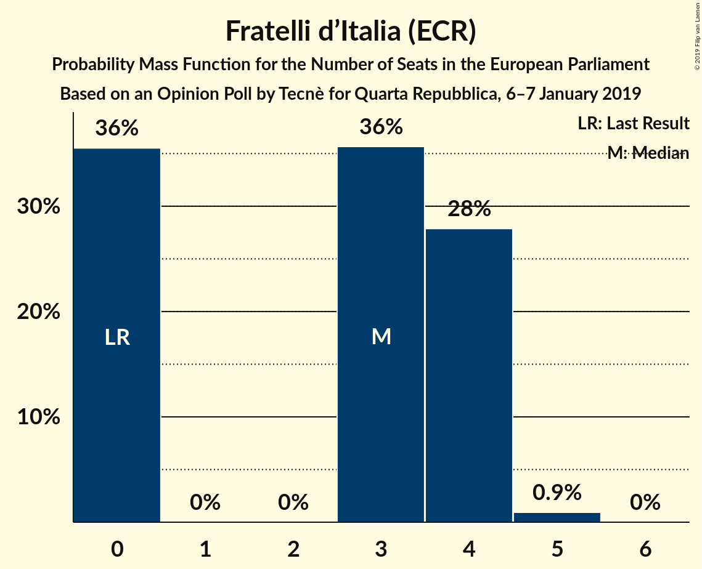

# Opinion Poll by Tecnè for Quarta Repubblica, 6–7 January 2019

<a href="#voting-intentions">Voting Intentions</a> | <a href="#seats">Seats</a> | <a href="#coalitions">Coalitions</a> | <a href="#technical-information">Technical Information</a>

## Voting Intentions

### Confidence Intervals

| Party | Last Result | Poll Result | 80% Confidence Interval | 90% Confidence Interval | 95% Confidence Interval | 99% Confidence Interval |
|:-----:|:-----------:|:-----------:|:-----------------------:|:-----------------------:|:-----------------------:|:-----------------------:|
| Lega Nord (ENF) | 6.2% | 31.8% | 30.0–33.7% |29.4–34.3% |29.0–34.8% |28.1–35.7% |
| Movimento 5 Stelle (EFDD) | 21.2% | 24.9% | 23.2–26.7% |22.8–27.3% |22.3–27.7% |21.6–28.6% |
| Partito Democratico (S&D) | 40.8% | 17.8% | 16.4–19.5% |16.0–19.9% |15.6–20.3% |14.9–21.2% |
| Forza Italia (EPP) | 16.8% | 10.9% | 9.7–12.2% |9.4–12.6% |9.1–13.0% |8.6–13.6% |
| Fratelli d’Italia (ECR) | 3.7% | 4.2% | 3.5–5.1% |3.3–5.4% |3.1–5.6% |2.8–6.1% |

*Note:* The poll result column reflects the actual value used in the calculations. Published results may vary slightly, and in addition be rounded to fewer digits.

## Seats

### Confidence Intervals

| Party | Last Result | Median | 80% Confidence Interval | 90% Confidence Interval | 95% Confidence Interval | 99% Confidence Interval |
|:-----:|:-----------:|:------:|:-----------------------:|:-----------------------:|:-----------------------:|:-----------------------:|
| <a href="#lega-nord-(enf)">Lega Nord (ENF)</a> | 5 | 24 | 23–26 |22–26 |22–27 |21–28 |
| <a href="#movimento-5-stelle-(efdd)">Movimento 5 Stelle (EFDD)</a> | 17 | 19 | 18–21 |17–21 |17–22 |16–22 |
| <a href="#partito-democratico-(s&d)">Partito Democratico (S&D)</a> | 31 | 13 | 11–14 |11–15 |11–15 |10–15 |
| <a href="#forza-italia-(epp)">Forza Italia (EPP)</a> | 13 | 8 | 7–9 |7–10 |7–10 |6–11 |
| <a href="#fratelli-d’italia-(ecr)">Fratelli d’Italia (ECR)</a> | 0 | 3 | 0–4 |0–4 |0–4 |0–5 |

### Lega Nord (ENF)

*For a full overview of the results for this party, see the [Lega Nord (ENF)](party-leganordenf.html) page.*

| Number of Seats | Probability | Accumulated | Special Marks |
|:---------------:|:-----------:|:-----------:|:-------------:|
| 5 | 0% | 100% | Last Result |
| 6 | 0% | 100% |  |
| 7 | 0% | 100% |  |
| 8 | 0% | 100% |  |
| 9 | 0% | 100% |  |
| 10 | 0% | 100% |  |
| 11 | 0% | 100% |  |
| 12 | 0% | 100% |  |
| 13 | 0% | 100% |  |
| 14 | 0% | 100% |  |
| 15 | 0% | 100% |  |
| 16 | 0% | 100% |  |
| 17 | 0% | 100% |  |
| 18 | 0% | 100% |  |
| 19 | 0% | 100% |  |
| 20 | 0% | 100% |  |
| 21 | 0.7% | 100% |  |
| 22 | 5% | 99.3% |  |
| 23 | 21% | 95% |  |
| 24 | 27% | 74% | Median |
| 25 | 26% | 46% |  |
| 26 | 16% | 21% |  |
| 27 | 4% | 5% |  |
| 28 | 0.7% | 0.7% |  |
| 29 | 0.1% | 0.1% |  |
| 30 | 0% | 0% |  |

### Movimento 5 Stelle (EFDD)

*For a full overview of the results for this party, see the [Movimento 5 Stelle (EFDD)](party-movimento5stelleefdd.html) page.*

| Number of Seats | Probability | Accumulated | Special Marks |
|:---------------:|:-----------:|:-----------:|:-------------:|
| 16 | 0.7% | 100% |  |
| 17 | 7% | 99.3% | Last Result |
| 18 | 22% | 92% |  |
| 19 | 36% | 70% | Median |
| 20 | 22% | 34% |  |
| 21 | 10% | 12% |  |
| 22 | 2% | 3% |  |
| 23 | 0.2% | 0.2% |  |
| 24 | 0% | 0% |  |

### Partito Democratico (S&D)

*For a full overview of the results for this party, see the [Partito Democratico (S&D)](party-partitodemocraticosd.html) page.*

| Number of Seats | Probability | Accumulated | Special Marks |
|:---------------:|:-----------:|:-----------:|:-------------:|
| 10 | 0.9% | 100% |  |
| 11 | 9% | 99.1% |  |
| 12 | 27% | 90% |  |
| 13 | 38% | 63% | Median |
| 14 | 19% | 24% |  |
| 15 | 5% | 5% |  |
| 16 | 0.4% | 0.4% |  |
| 17 | 0% | 0% |  |
| 18 | 0% | 0% |  |
| 19 | 0% | 0% |  |
| 20 | 0% | 0% |  |
| 21 | 0% | 0% |  |
| 22 | 0% | 0% |  |
| 23 | 0% | 0% |  |
| 24 | 0% | 0% |  |
| 25 | 0% | 0% |  |
| 26 | 0% | 0% |  |
| 27 | 0% | 0% |  |
| 28 | 0% | 0% |  |
| 29 | 0% | 0% |  |
| 30 | 0% | 0% |  |
| 31 | 0% | 0% | Last Result |

### Forza Italia (EPP)

*For a full overview of the results for this party, see the [Forza Italia (EPP)](party-forzaitaliaepp.html) page.*

| Number of Seats | Probability | Accumulated | Special Marks |
|:---------------:|:-----------:|:-----------:|:-------------:|
| 6 | 0.7% | 100% |  |
| 7 | 12% | 99.3% |  |
| 8 | 44% | 87% | Median |
| 9 | 35% | 43% |  |
| 10 | 8% | 8% |  |
| 11 | 0.6% | 0.6% |  |
| 12 | 0% | 0% |  |
| 13 | 0% | 0% | Last Result |

### Fratelli d’Italia (ECR)

*For a full overview of the results for this party, see the [Fratelli d’Italia (ECR)](party-fratellid’italiaecr.html) page.*

| Number of Seats | Probability | Accumulated | Special Marks |
|:---------------:|:-----------:|:-----------:|:-------------:|
| 0 | 35% | 100% | Last Result |
| 1 | 0% | 65% |  |
| 2 | 0% | 65% |  |
| 3 | 33% | 65% | Median |
| 4 | 31% | 32% |  |
| 5 | 1.1% | 1.1% |  |
| 6 | 0% | 0% |  |

## Coalitions

### Confidence Intervals

| Coalition | Last Result | Median | Majority? | 80% Confidence Interval | 90% Confidence Interval | 95% Confidence Interval | 99% Confidence Interval |
|:---------:|:-----------:|:------:|:---------:|:-----------------------:|:-----------------------:|:-----------------------:|:-----------------------:|
| Lega Nord (ENF) | 5 | 24 | 0% | 23–26 | 22–26 | 22–27 | 21–28 |
| Movimento 5 Stelle (EFDD) | 17 | 19 | 0% | 18–21 | 17–21 | 17–22 | 16–22 |
| Fratelli d’Italia (ECR) | 0 | 3 | 0% | 0–4 | 0–4 | 0–4 | 0–5 |

### Lega Nord (ENF)

| Number of Seats | Probability | Accumulated | Special Marks |
|:---------------:|:-----------:|:-----------:|:-------------:|
| 5 | 0% | 100% | Last Result |
| 6 | 0% | 100% |  |
| 7 | 0% | 100% |  |
| 8 | 0% | 100% |  |
| 9 | 0% | 100% |  |
| 10 | 0% | 100% |  |
| 11 | 0% | 100% |  |
| 12 | 0% | 100% |  |
| 13 | 0% | 100% |  |
| 14 | 0% | 100% |  |
| 15 | 0% | 100% |  |
| 16 | 0% | 100% |  |
| 17 | 0% | 100% |  |
| 18 | 0% | 100% |  |
| 19 | 0% | 100% |  |
| 20 | 0% | 100% |  |
| 21 | 0.7% | 100% |  |
| 22 | 5% | 99.3% |  |
| 23 | 21% | 95% |  |
| 24 | 27% | 74% | Median |
| 25 | 26% | 46% |  |
| 26 | 16% | 21% |  |
| 27 | 4% | 5% |  |
| 28 | 0.7% | 0.7% |  |
| 29 | 0.1% | 0.1% |  |
| 30 | 0% | 0% |  |

### Movimento 5 Stelle (EFDD)

| Number of Seats | Probability | Accumulated | Special Marks |
|:---------------:|:-----------:|:-----------:|:-------------:|
| 16 | 0.7% | 100% |  |
| 17 | 7% | 99.3% | Last Result |
| 18 | 22% | 92% |  |
| 19 | 36% | 70% | Median |
| 20 | 22% | 34% |  |
| 21 | 10% | 12% |  |
| 22 | 2% | 3% |  |
| 23 | 0.2% | 0.2% |  |
| 24 | 0% | 0% |  |

### Fratelli d’Italia (ECR)

| Number of Seats | Probability | Accumulated | Special Marks |
|:---------------:|:-----------:|:-----------:|:-------------:|
| 0 | 35% | 100% | Last Result |
| 1 | 0% | 65% |  |
| 2 | 0% | 65% |  |
| 3 | 33% | 65% | Median |
| 4 | 31% | 32% |  |
| 5 | 1.1% | 1.1% |  |
| 6 | 0% | 0% |  |

## Technical Information

### Opinion Poll

+ **Polling firm:** Tecnè
+ **Commissioner(s):** Quarta Repubblica
+ **Fieldwork period:** 6–7 January 2019

### Calculations

+ **Sample size:** 1003
+ **Simulations done:** 131,072
+ **Error estimate:** 1.07%

