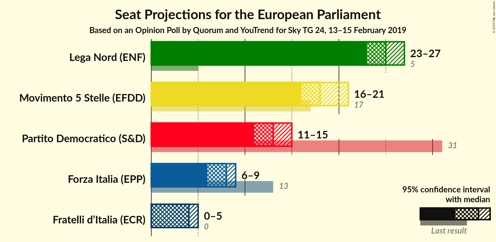
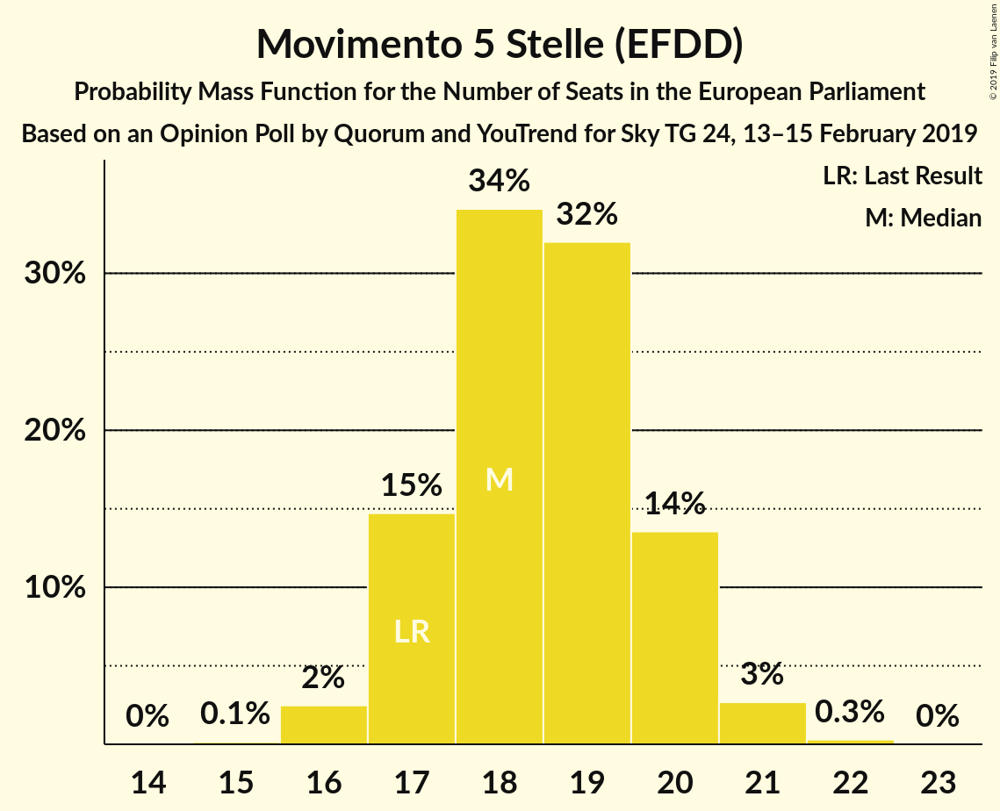
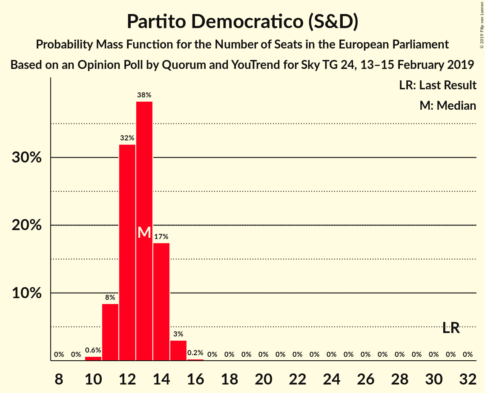
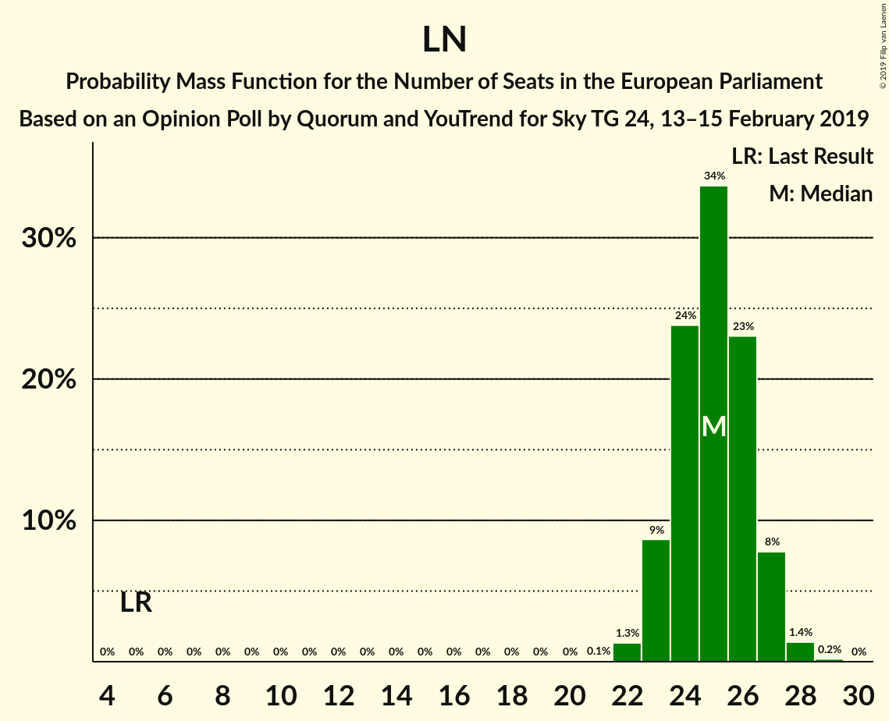
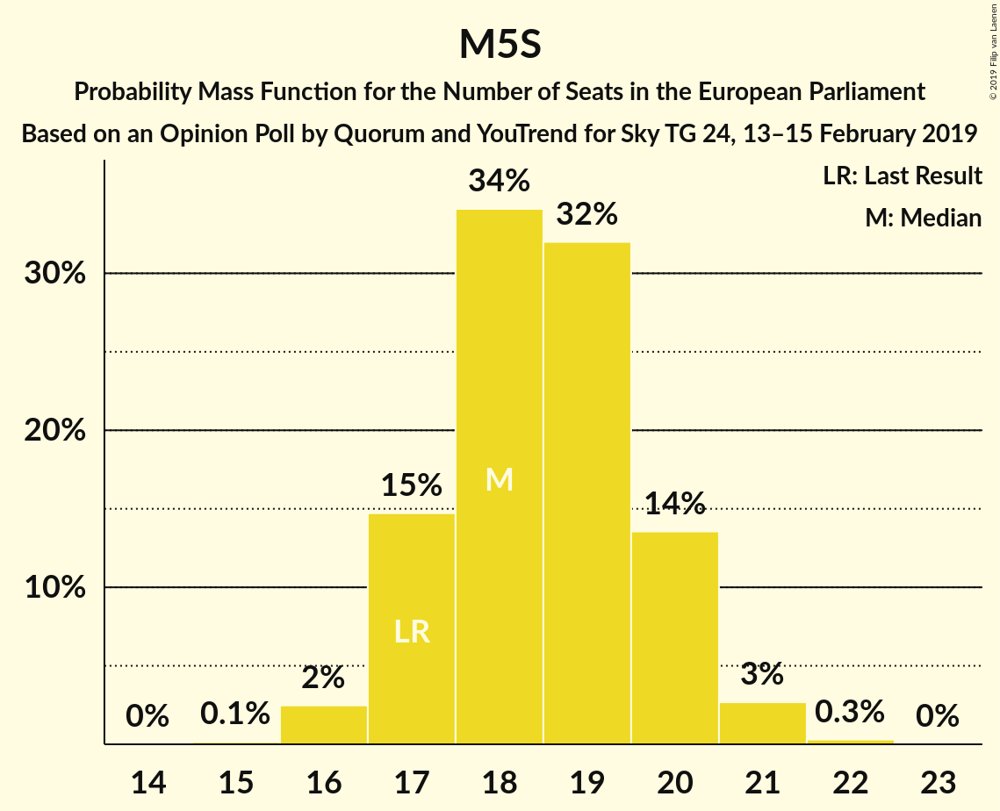
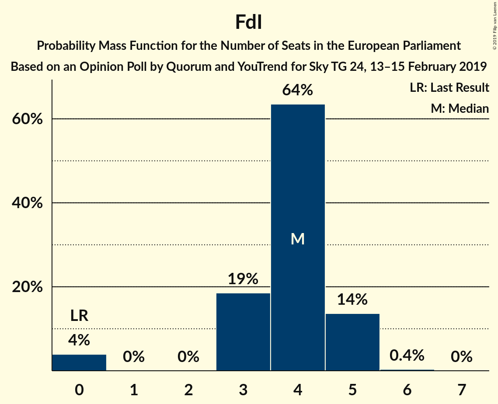

# Opinion Poll by Quorum and YouTrend for Sky TG 24, 13–15 February 2019

<a href="#voting-intentions">Voting Intentions</a> | <a href="#seats">Seats</a> | <a href="#coalitions">Coalitions</a> | <a href="#technical-information">Technical Information</a>

## Voting Intentions

### Confidence Intervals

| Party | Last Result | Poll Result | 80% Confidence Interval | 90% Confidence Interval | 95% Confidence Interval | 99% Confidence Interval |
|:-----:|:-----------:|:-----------:|:-----------------------:|:-----------------------:|:-----------------------:|:-----------------------:|
| Lega Nord (ENF) | 6.2% | 32.9% | 31.0–34.8% |30.5–35.4% |30.1–35.9% |29.2–36.8% |
| Movimento 5 Stelle (EFDD) | 21.2% | 24.3% | 22.6–26.1% |22.2–26.6% |21.8–27.1% |21.0–28.0% |
| Partito Democratico (S&D) | 40.8% | 18.0% | 16.6–19.7% |16.1–20.1% |15.8–20.6% |15.1–21.4% |
| Forza Italia (EPP) | 16.8% | 10.3% | 9.1–11.6% |8.8–12.0% |8.5–12.3% |8.0–13.0% |
| Fratelli d’Italia (ECR) | 3.7% | 5.1% | 4.3–6.1% |4.1–6.4% |3.9–6.6% |3.5–7.1% |

*Note:* The poll result column reflects the actual value used in the calculations. Published results may vary slightly, and in addition be rounded to fewer digits.

## Seats

### Confidence Intervals

| Party | Last Result | Median | 80% Confidence Interval | 90% Confidence Interval | 95% Confidence Interval | 99% Confidence Interval |
|:-----:|:-----------:|:------:|:-----------------------:|:-----------------------:|:-----------------------:|:-----------------------:|
| <a href="#lega-nord-(enf)">Lega Nord (ENF)</a> | 5 | 27 | 22–28 |22–28 |22–28 |21–29 |
| <a href="#movimento-5-stelle-(efdd)">Movimento 5 Stelle (EFDD)</a> | 17 | 18 | 18–19 |17–20 |17–20 |17–20 |
| <a href="#partito-democratico-(s&d)">Partito Democratico (S&D)</a> | 31 | 12 | 11–13 |11–14 |11–14 |11–14 |
| <a href="#forza-italia-(epp)">Forza Italia (EPP)</a> | 13 | 7 | 7–9 |6–9 |6–9 |6–10 |
| <a href="#fratelli-d’italia-(ecr)">Fratelli d’Italia (ECR)</a> | 0 | 3 | 0–5 |0–5 |0–5 |0–6 |

### Lega Nord (ENF)

*For a full overview of the results for this party, see the [Lega Nord (ENF)](party-leganordenf.html) page.*

| Number of Seats | Probability | Accumulated | Special Marks |
|:---------------:|:-----------:|:-----------:|:-------------:|
| 5 | 0% | 100% | Last Result |
| 6 | 0% | 100% |  |
| 7 | 0% | 100% |  |
| 8 | 0% | 100% |  |
| 9 | 0% | 100% |  |
| 10 | 0% | 100% |  |
| 11 | 0% | 100% |  |
| 12 | 0% | 100% |  |
| 13 | 0% | 100% |  |
| 14 | 0% | 100% |  |
| 15 | 0% | 100% |  |
| 16 | 0% | 100% |  |
| 17 | 0% | 100% |  |
| 18 | 0% | 100% |  |
| 19 | 0% | 100% |  |
| 20 | 0.1% | 100% |  |
| 21 | 2% | 99.9% |  |
| 22 | 10% | 98% |  |
| 23 | 10% | 88% |  |
| 24 | 1.2% | 78% |  |
| 25 | 0.1% | 77% |  |
| 26 | 0.2% | 77% |  |
| 27 | 42% | 76% | Median |
| 28 | 33% | 34% |  |
| 29 | 1.3% | 1.3% |  |
| 30 | 0% | 0% |  |

### Movimento 5 Stelle (EFDD)

*For a full overview of the results for this party, see the [Movimento 5 Stelle (EFDD)](party-movimento5stelleefdd.html) page.*

| Number of Seats | Probability | Accumulated | Special Marks |
|:---------------:|:-----------:|:-----------:|:-------------:|
| 16 | 0.1% | 100% |  |
| 17 | 8% | 99.9% | Last Result |
| 18 | 57% | 92% | Median |
| 19 | 30% | 35% |  |
| 20 | 5% | 5% |  |
| 21 | 0.1% | 0.1% |  |
| 22 | 0% | 0% |  |

### Partito Democratico (S&D)

*For a full overview of the results for this party, see the [Partito Democratico (S&D)](party-partitodemocraticosd.html) page.*

| Number of Seats | Probability | Accumulated | Special Marks |
|:---------------:|:-----------:|:-----------:|:-------------:|
| 10 | 0.2% | 100% |  |
| 11 | 12% | 99.8% |  |
| 12 | 39% | 88% | Median |
| 13 | 42% | 48% |  |
| 14 | 6% | 6% |  |
| 15 | 0.4% | 0.4% |  |
| 16 | 0% | 0% |  |
| 17 | 0% | 0% |  |
| 18 | 0% | 0% |  |
| 19 | 0% | 0% |  |
| 20 | 0% | 0% |  |
| 21 | 0% | 0% |  |
| 22 | 0% | 0% |  |
| 23 | 0% | 0% |  |
| 24 | 0% | 0% |  |
| 25 | 0% | 0% |  |
| 26 | 0% | 0% |  |
| 27 | 0% | 0% |  |
| 28 | 0% | 0% |  |
| 29 | 0% | 0% |  |
| 30 | 0% | 0% |  |
| 31 | 0% | 0% | Last Result |

### Forza Italia (EPP)

*For a full overview of the results for this party, see the [Forza Italia (EPP)](party-forzaitaliaepp.html) page.*

| Number of Seats | Probability | Accumulated | Special Marks |
|:---------------:|:-----------:|:-----------:|:-------------:|
| 6 | 6% | 100% |  |
| 7 | 50% | 94% | Median |
| 8 | 32% | 44% |  |
| 9 | 12% | 12% |  |
| 10 | 0.6% | 0.6% |  |
| 11 | 0% | 0% |  |
| 12 | 0% | 0% |  |
| 13 | 0% | 0% | Last Result |

### Fratelli d’Italia (ECR)

*For a full overview of the results for this party, see the [Fratelli d’Italia (ECR)](party-fratellid’italiaecr.html) page.*

| Number of Seats | Probability | Accumulated | Special Marks |
|:---------------:|:-----------:|:-----------:|:-------------:|
| 0 | 15% | 100% | Last Result |
| 1 | 0% | 85% |  |
| 2 | 0% | 85% |  |
| 3 | 46% | 85% | Median |
| 4 | 17% | 39% |  |
| 5 | 19% | 21% |  |
| 6 | 2% | 2% |  |
| 7 | 0% | 0% |  |

## Coalitions

### Confidence Intervals

| Coalition | Last Result | Median | Majority? | 80% Confidence Interval | 90% Confidence Interval | 95% Confidence Interval | 99% Confidence Interval |
|:---------:|:-----------:|:------:|:---------:|:-----------------------:|:-----------------------:|:-----------------------:|:-----------------------:|
| Lega Nord (ENF) | 5 | 27 | 0% | 22–28 | 22–28 | 22–28 | 21–29 |
| Movimento 5 Stelle (EFDD) | 17 | 18 | 0% | 18–19 | 17–20 | 17–20 | 17–20 |
| Fratelli d’Italia (ECR) | 0 | 3 | 0% | 0–5 | 0–5 | 0–5 | 0–6 |

### Lega Nord (ENF)

| Number of Seats | Probability | Accumulated | Special Marks |
|:---------------:|:-----------:|:-----------:|:-------------:|
| 5 | 0% | 100% | Last Result |
| 6 | 0% | 100% |  |
| 7 | 0% | 100% |  |
| 8 | 0% | 100% |  |
| 9 | 0% | 100% |  |
| 10 | 0% | 100% |  |
| 11 | 0% | 100% |  |
| 12 | 0% | 100% |  |
| 13 | 0% | 100% |  |
| 14 | 0% | 100% |  |
| 15 | 0% | 100% |  |
| 16 | 0% | 100% |  |
| 17 | 0% | 100% |  |
| 18 | 0% | 100% |  |
| 19 | 0% | 100% |  |
| 20 | 0.1% | 100% |  |
| 21 | 2% | 99.9% |  |
| 22 | 10% | 98% |  |
| 23 | 10% | 88% |  |
| 24 | 1.2% | 78% |  |
| 25 | 0.1% | 77% |  |
| 26 | 0.2% | 77% |  |
| 27 | 42% | 76% | Median |
| 28 | 33% | 34% |  |
| 29 | 1.3% | 1.3% |  |
| 30 | 0% | 0% |  |

### Movimento 5 Stelle (EFDD)

| Number of Seats | Probability | Accumulated | Special Marks |
|:---------------:|:-----------:|:-----------:|:-------------:|
| 16 | 0.1% | 100% |  |
| 17 | 8% | 99.9% | Last Result |
| 18 | 57% | 92% | Median |
| 19 | 30% | 35% |  |
| 20 | 5% | 5% |  |
| 21 | 0.1% | 0.1% |  |
| 22 | 0% | 0% |  |

### Fratelli d’Italia (ECR)

| Number of Seats | Probability | Accumulated | Special Marks |
|:---------------:|:-----------:|:-----------:|:-------------:|
| 0 | 15% | 100% | Last Result |
| 1 | 0% | 85% |  |
| 2 | 0% | 85% |  |
| 3 | 46% | 85% | Median |
| 4 | 17% | 39% |  |
| 5 | 19% | 21% |  |
| 6 | 2% | 2% |  |
| 7 | 0% | 0% |  |

## Technical Information

### Opinion Poll

+ **Polling firm:** Quorum and YouTrend
+ **Commissioner(s):** Sky TG 24
+ **Fieldwork period:** 13–15 February 2019

### Calculations

+ **Sample size:** 1003
+ **Simulations done:** 1,024
+ **Error estimate:** 1.72%

