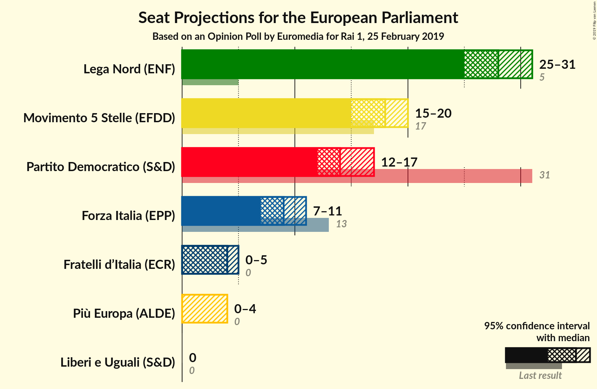
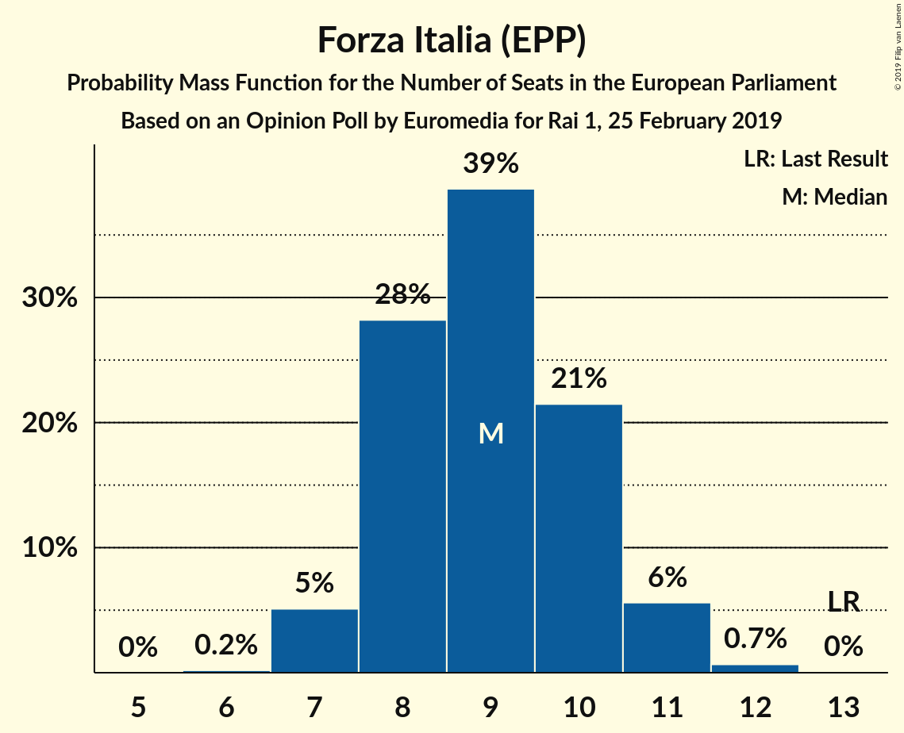
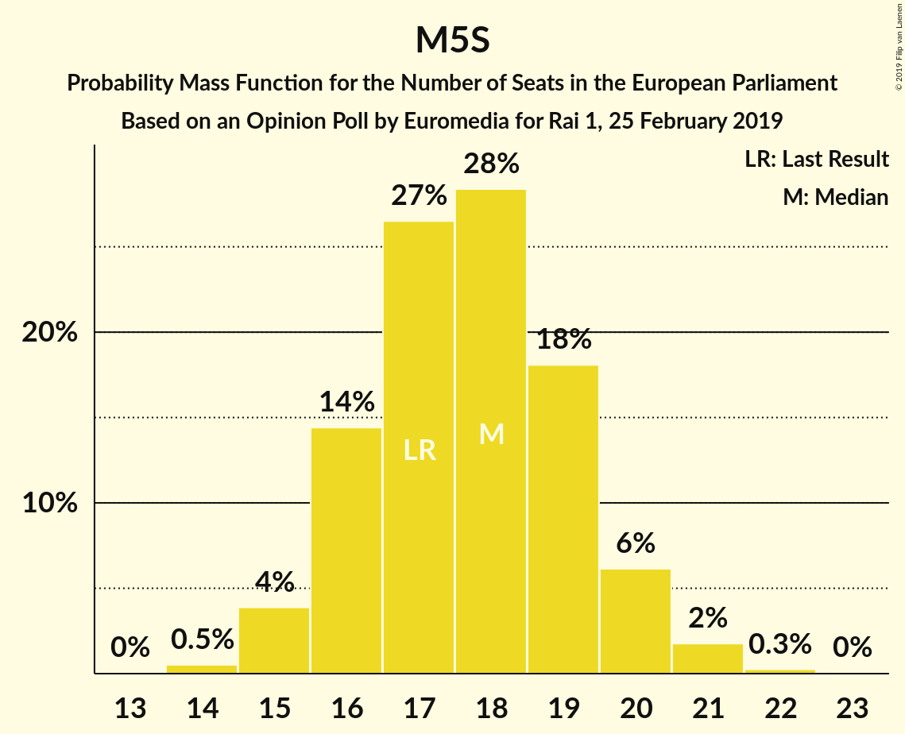

# Opinion Poll by Euromedia for Rai 1, 25 February 2019

<a href="#voting-intentions">Voting Intentions</a> | <a href="#seats">Seats</a> | <a href="#coalitions">Coalitions</a> | <a href="#technical-information">Technical Information</a>

## Voting Intentions

### Confidence Intervals

| Party | Last Result | Poll Result | 80% Confidence Interval | 90% Confidence Interval | 95% Confidence Interval | 99% Confidence Interval |
|:-----:|:-----------:|:-----------:|:-----------------------:|:-----------------------:|:-----------------------:|:-----------------------:|
| Lega Nord (ENF) | 6.2% | 34.6% | 32.5–36.8% |31.9–37.4% |31.4–38.0% |30.4–39.1% |
| Movimento 5 Stelle (EFDD) | 21.2% | 21.8% | 20.0–23.7% |19.4–24.3% |19.0–24.8% |18.2–25.7% |
| Partito Democratico (S&D) | 40.8% | 18.6% | 16.9–20.5% |16.5–21.0% |16.1–21.5% |15.3–22.4% |
| Forza Italia (EPP) | 16.8% | 11.0% | 9.7–12.5% |9.3–13.0% |9.0–13.4% |8.4–14.1% |
| Fratelli d’Italia (ECR) | 3.7% | 4.8% | 3.9–5.9% |3.7–6.2% |3.5–6.5% |3.1–7.0% |
| Più Europa (ALDE) | 0.0% | 3.8% | 3.0–4.8% |2.8–5.1% |2.6–5.3% |2.3–5.8% |
| Liberi e Uguali (S&D) | 0.0% | 1.9% | 1.4–2.7% |1.2–2.9% |1.1–3.1% |0.9–3.5% |

*Note:* The poll result column reflects the actual value used in the calculations. Published results may vary slightly, and in addition be rounded to fewer digits.

## Seats

### Confidence Intervals

| Party | Last Result | Median | 80% Confidence Interval | 90% Confidence Interval | 95% Confidence Interval | 99% Confidence Interval |
|:-----:|:-----------:|:------:|:-----------------------:|:-----------------------:|:-----------------------:|:-----------------------:|
| <a href="#lega-nord-(enf)">Lega Nord (ENF)</a> | 5 | 31 | 25–34 |24–34 |24–34 |23–34 |
| <a href="#movimento-5-stelle-(efdd)">Movimento 5 Stelle (EFDD)</a> | 17 | 17 | 17–18 |16–20 |15–20 |14–20 |
| <a href="#partito-democratico-(s&d)">Partito Democratico (S&D)</a> | 31 | 13 | 11–17 |11–17 |11–18 |11–18 |
| <a href="#forza-italia-(epp)">Forza Italia (EPP)</a> | 13 | 8 | 7–11 |7–11 |7–11 |7–13 |
| <a href="#fratelli-d’italia-(ecr)">Fratelli d’Italia (ECR)</a> | 0 | 3 | 0–5 |0–5 |0–6 |0–6 |
| <a href="#più-europa-(alde)">Più Europa (ALDE)</a> | 0 | 0 | 0–5 |0–5 |0–5 |0–5 |
| <a href="#liberi-e-uguali-(s&d)">Liberi e Uguali (S&D)</a> | 0 | 0 | 0 |0 |0 |0 |

### Lega Nord (ENF)

*For a full overview of the results for this party, see the [Lega Nord (ENF)](party-leganordenf.html) page.*

| Number of Seats | Probability | Accumulated | Special Marks |
|:---------------:|:-----------:|:-----------:|:-------------:|
| 5 | 0% | 100% | Last Result |
| 6 | 0% | 100% |  |
| 7 | 0% | 100% |  |
| 8 | 0% | 100% |  |
| 9 | 0% | 100% |  |
| 10 | 0% | 100% |  |
| 11 | 0% | 100% |  |
| 12 | 0% | 100% |  |
| 13 | 0% | 100% |  |
| 14 | 0% | 100% |  |
| 15 | 0% | 100% |  |
| 16 | 0% | 100% |  |
| 17 | 0% | 100% |  |
| 18 | 0% | 100% |  |
| 19 | 0% | 100% |  |
| 20 | 0% | 100% |  |
| 21 | 0% | 100% |  |
| 22 | 0% | 100% |  |
| 23 | 2% | 100% |  |
| 24 | 7% | 98% |  |
| 25 | 4% | 92% |  |
| 26 | 4% | 88% |  |
| 27 | 21% | 84% |  |
| 28 | 0.3% | 63% |  |
| 29 | 11% | 63% |  |
| 30 | 0.1% | 52% |  |
| 31 | 30% | 52% | Median |
| 32 | 5% | 21% |  |
| 33 | 0.1% | 17% |  |
| 34 | 17% | 17% |  |
| 35 | 0% | 0% |  |

### Movimento 5 Stelle (EFDD)

*For a full overview of the results for this party, see the [Movimento 5 Stelle (EFDD)](party-movimento5stelleefdd.html) page.*

| Number of Seats | Probability | Accumulated | Special Marks |
|:---------------:|:-----------:|:-----------:|:-------------:|
| 14 | 0.9% | 100% |  |
| 15 | 2% | 99.1% |  |
| 16 | 3% | 97% |  |
| 17 | 48% | 95% | Last Result, Median |
| 18 | 37% | 47% |  |
| 19 | 0.2% | 10% |  |
| 20 | 9% | 10% |  |
| 21 | 0.1% | 0.1% |  |
| 22 | 0% | 0% |  |

### Partito Democratico (S&D)

*For a full overview of the results for this party, see the [Partito Democratico (S&D)](party-partitodemocraticosd.html) page.*

| Number of Seats | Probability | Accumulated | Special Marks |
|:---------------:|:-----------:|:-----------:|:-------------:|
| 9 | 0.1% | 100% |  |
| 10 | 0% | 99.9% |  |
| 11 | 10% | 99.8% |  |
| 12 | 38% | 89% |  |
| 13 | 20% | 52% | Median |
| 14 | 17% | 32% |  |
| 15 | 3% | 15% |  |
| 16 | 2% | 13% |  |
| 17 | 7% | 10% |  |
| 18 | 3% | 3% |  |
| 19 | 0.1% | 0.1% |  |
| 20 | 0% | 0% |  |
| 21 | 0% | 0% |  |
| 22 | 0% | 0% |  |
| 23 | 0% | 0% |  |
| 24 | 0% | 0% |  |
| 25 | 0% | 0% |  |
| 26 | 0% | 0% |  |
| 27 | 0% | 0% |  |
| 28 | 0% | 0% |  |
| 29 | 0% | 0% |  |
| 30 | 0% | 0% |  |
| 31 | 0% | 0% | Last Result |

### Forza Italia (EPP)

*For a full overview of the results for this party, see the [Forza Italia (EPP)](party-forzaitaliaepp.html) page.*

| Number of Seats | Probability | Accumulated | Special Marks |
|:---------------:|:-----------:|:-----------:|:-------------:|
| 6 | 0.1% | 100% |  |
| 7 | 20% | 99.9% |  |
| 8 | 38% | 80% | Median |
| 9 | 21% | 42% |  |
| 10 | 8% | 21% |  |
| 11 | 11% | 13% |  |
| 12 | 0.9% | 2% |  |
| 13 | 1.2% | 1.2% | Last Result |
| 14 | 0% | 0% |  |

### Fratelli d’Italia (ECR)

*For a full overview of the results for this party, see the [Fratelli d’Italia (ECR)](party-fratellid’italiaecr.html) page.*

| Number of Seats | Probability | Accumulated | Special Marks |
|:---------------:|:-----------:|:-----------:|:-------------:|
| 0 | 28% | 100% | Last Result |
| 1 | 0% | 72% |  |
| 2 | 0% | 72% |  |
| 3 | 37% | 72% | Median |
| 4 | 9% | 36% |  |
| 5 | 22% | 27% |  |
| 6 | 5% | 5% |  |
| 7 | 0.1% | 0.1% |  |
| 8 | 0% | 0% |  |

### Più Europa (ALDE)

*For a full overview of the results for this party, see the [Più Europa (ALDE)](party-piùeuropaalde.html) page.*

| Number of Seats | Probability | Accumulated | Special Marks |
|:---------------:|:-----------:|:-----------:|:-------------:|
| 0 | 57% | 100% | Last Result, Median |
| 1 | 0% | 43% |  |
| 2 | 0% | 43% |  |
| 3 | 13% | 43% |  |
| 4 | 13% | 30% |  |
| 5 | 17% | 17% |  |
| 6 | 0% | 0% |  |

### Liberi e Uguali (S&D)

*For a full overview of the results for this party, see the [Liberi e Uguali (S&D)](party-liberieugualisd.html) page.*

| Number of Seats | Probability | Accumulated | Special Marks |
|:---------------:|:-----------:|:-----------:|:-------------:|
| 0 | 100% | 100% | Last Result, Median |

## Coalitions

### Confidence Intervals

| Coalition | Last Result | Median | Majority? | 80% Confidence Interval | 90% Confidence Interval | 95% Confidence Interval | 99% Confidence Interval |
|:---------:|:-----------:|:------:|:---------:|:-----------------------:|:-----------------------:|:-----------------------:|:-----------------------:|
| Lega Nord (ENF) | 5 | 31 | 0% | 25–34 | 24–34 | 24–34 | 23–34 |
| Movimento 5 Stelle (EFDD) | 17 | 17 | 0% | 17–18 | 16–20 | 15–20 | 14–20 |
| Partito Democratico (S&D) – Liberi e Uguali (S&D) | 31 | 13 | 0% | 11–17 | 11–17 | 11–18 | 11–18 |
| Fratelli d’Italia (ECR) | 0 | 3 | 0% | 0–5 | 0–5 | 0–6 | 0–6 |
| Più Europa (ALDE) | 0 | 0 | 0% | 0–5 | 0–5 | 0–5 | 0–5 |

### Lega Nord (ENF)

| Number of Seats | Probability | Accumulated | Special Marks |
|:---------------:|:-----------:|:-----------:|:-------------:|
| 5 | 0% | 100% | Last Result |
| 6 | 0% | 100% |  |
| 7 | 0% | 100% |  |
| 8 | 0% | 100% |  |
| 9 | 0% | 100% |  |
| 10 | 0% | 100% |  |
| 11 | 0% | 100% |  |
| 12 | 0% | 100% |  |
| 13 | 0% | 100% |  |
| 14 | 0% | 100% |  |
| 15 | 0% | 100% |  |
| 16 | 0% | 100% |  |
| 17 | 0% | 100% |  |
| 18 | 0% | 100% |  |
| 19 | 0% | 100% |  |
| 20 | 0% | 100% |  |
| 21 | 0% | 100% |  |
| 22 | 0% | 100% |  |
| 23 | 2% | 100% |  |
| 24 | 7% | 98% |  |
| 25 | 4% | 92% |  |
| 26 | 4% | 88% |  |
| 27 | 21% | 84% |  |
| 28 | 0.3% | 63% |  |
| 29 | 11% | 63% |  |
| 30 | 0.1% | 52% |  |
| 31 | 30% | 52% | Median |
| 32 | 5% | 21% |  |
| 33 | 0.1% | 17% |  |
| 34 | 17% | 17% |  |
| 35 | 0% | 0% |  |

### Movimento 5 Stelle (EFDD)

| Number of Seats | Probability | Accumulated | Special Marks |
|:---------------:|:-----------:|:-----------:|:-------------:|
| 14 | 0.9% | 100% |  |
| 15 | 2% | 99.1% |  |
| 16 | 3% | 97% |  |
| 17 | 48% | 95% | Last Result, Median |
| 18 | 37% | 47% |  |
| 19 | 0.2% | 10% |  |
| 20 | 9% | 10% |  |
| 21 | 0.1% | 0.1% |  |
| 22 | 0% | 0% |  |

### Partito Democratico (S&D) – Liberi e Uguali (S&D)

| Number of Seats | Probability | Accumulated | Special Marks |
|:---------------:|:-----------:|:-----------:|:-------------:|
| 9 | 0.1% | 100% |  |
| 10 | 0% | 99.9% |  |
| 11 | 10% | 99.8% |  |
| 12 | 38% | 89% |  |
| 13 | 20% | 52% | Median |
| 14 | 17% | 32% |  |
| 15 | 3% | 15% |  |
| 16 | 2% | 13% |  |
| 17 | 7% | 11% |  |
| 18 | 3% | 4% |  |
| 19 | 0.1% | 0.1% |  |
| 20 | 0% | 0% |  |
| 21 | 0% | 0% |  |
| 22 | 0% | 0% |  |
| 23 | 0% | 0% |  |
| 24 | 0% | 0% |  |
| 25 | 0% | 0% |  |
| 26 | 0% | 0% |  |
| 27 | 0% | 0% |  |
| 28 | 0% | 0% |  |
| 29 | 0% | 0% |  |
| 30 | 0% | 0% |  |
| 31 | 0% | 0% | Last Result |

### Fratelli d’Italia (ECR)

| Number of Seats | Probability | Accumulated | Special Marks |
|:---------------:|:-----------:|:-----------:|:-------------:|
| 0 | 28% | 100% | Last Result |
| 1 | 0% | 72% |  |
| 2 | 0% | 72% |  |
| 3 | 37% | 72% | Median |
| 4 | 9% | 36% |  |
| 5 | 22% | 27% |  |
| 6 | 5% | 5% |  |
| 7 | 0.1% | 0.1% |  |
| 8 | 0% | 0% |  |

### Più Europa (ALDE)

| Number of Seats | Probability | Accumulated | Special Marks |
|:---------------:|:-----------:|:-----------:|:-------------:|
| 0 | 57% | 100% | Last Result, Median |
| 1 | 0% | 43% |  |
| 2 | 0% | 43% |  |
| 3 | 13% | 43% |  |
| 4 | 13% | 30% |  |
| 5 | 17% | 17% |  |
| 6 | 0% | 0% |  |

## Technical Information

### Opinion Poll

+ **Polling firm:** Euromedia
+ **Commissioner(s):** Rai 1
+ **Fieldwork period:** 25 February 2019

### Calculations

+ **Sample size:** 800
+ **Simulations done:** 1,024
+ **Error estimate:** 3.66%

