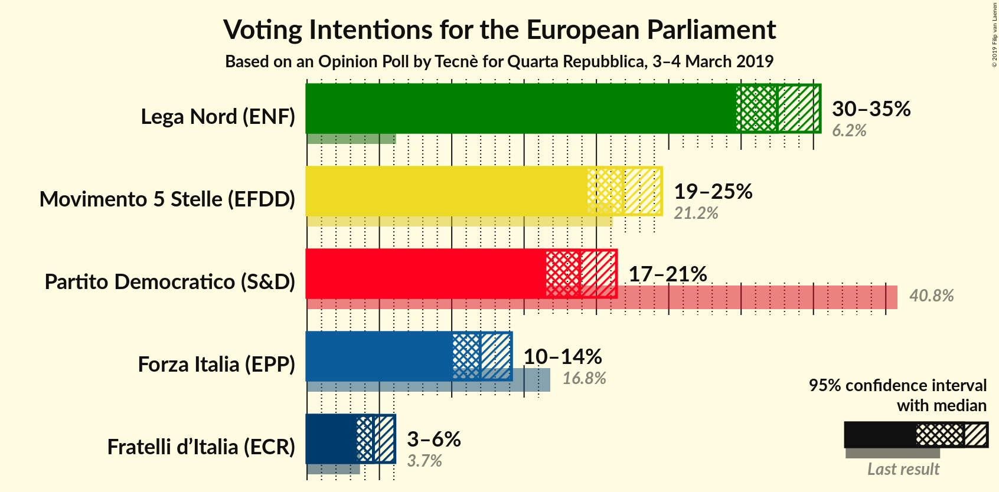
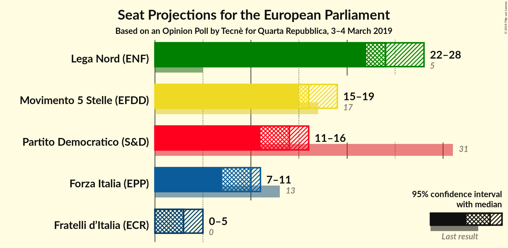
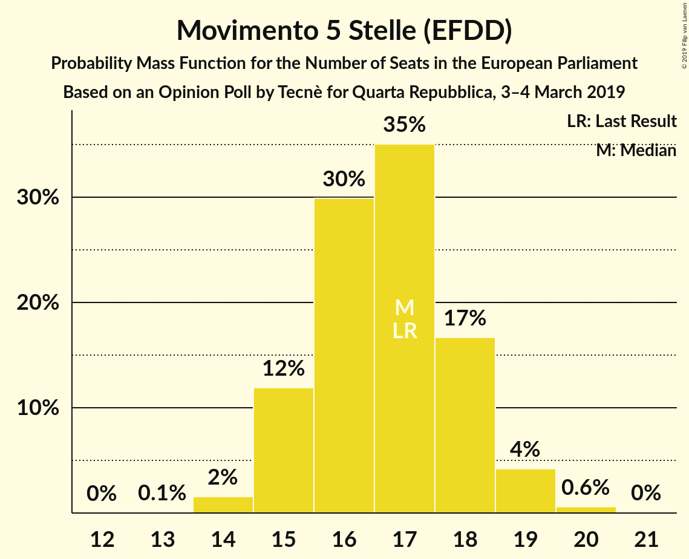
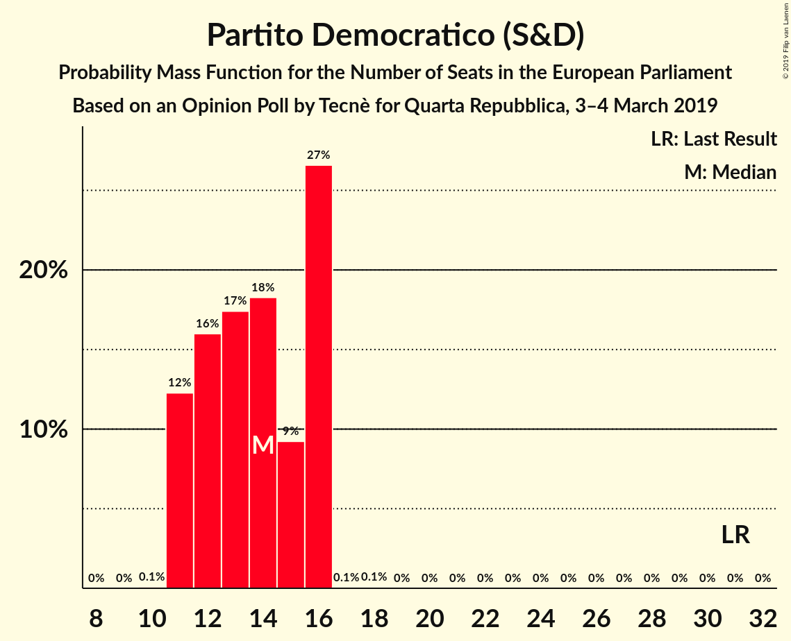
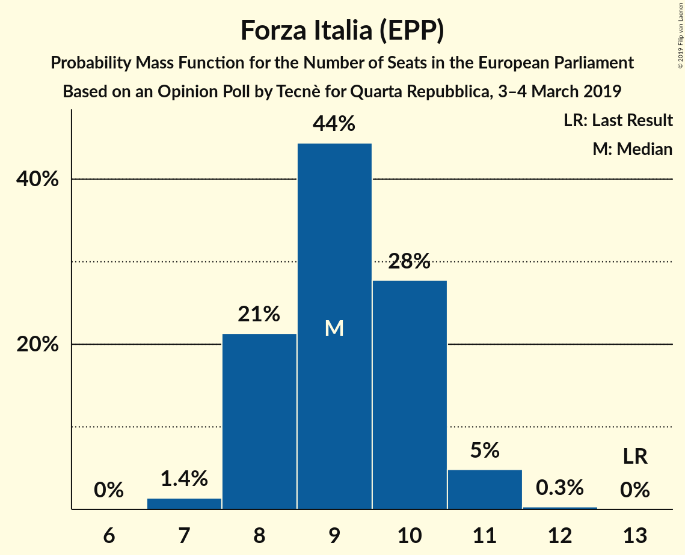
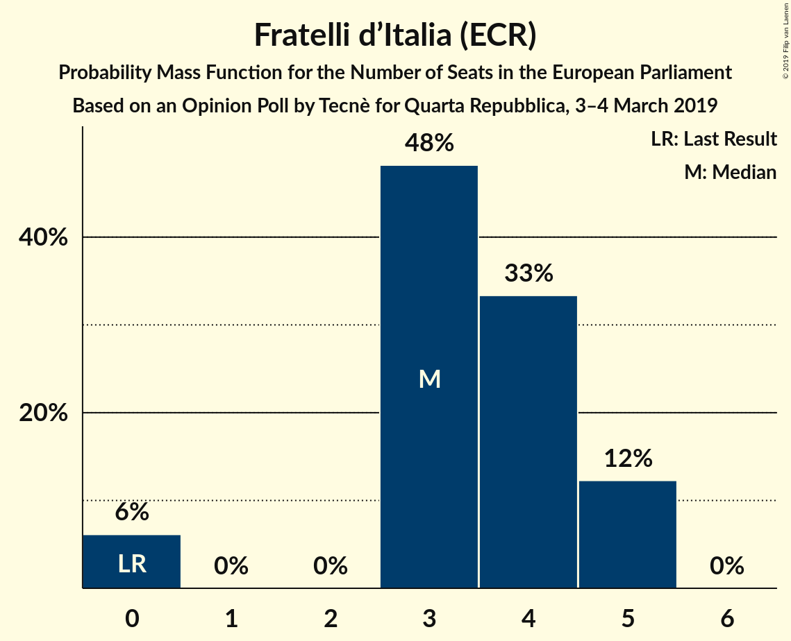
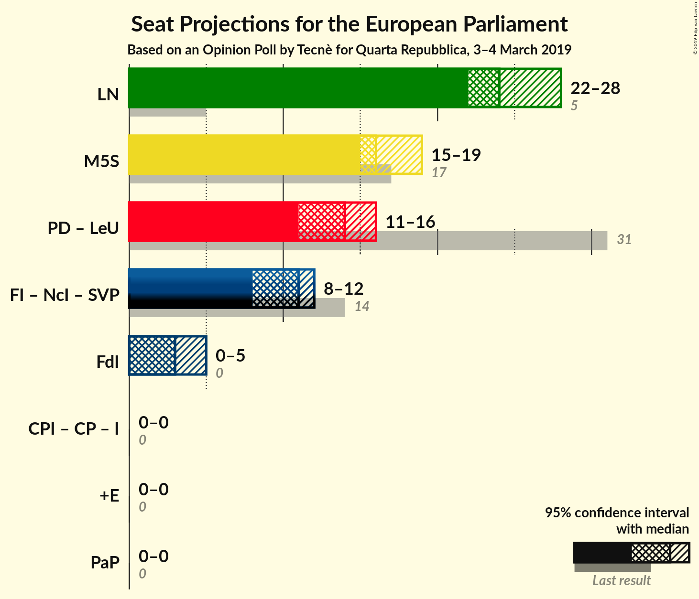
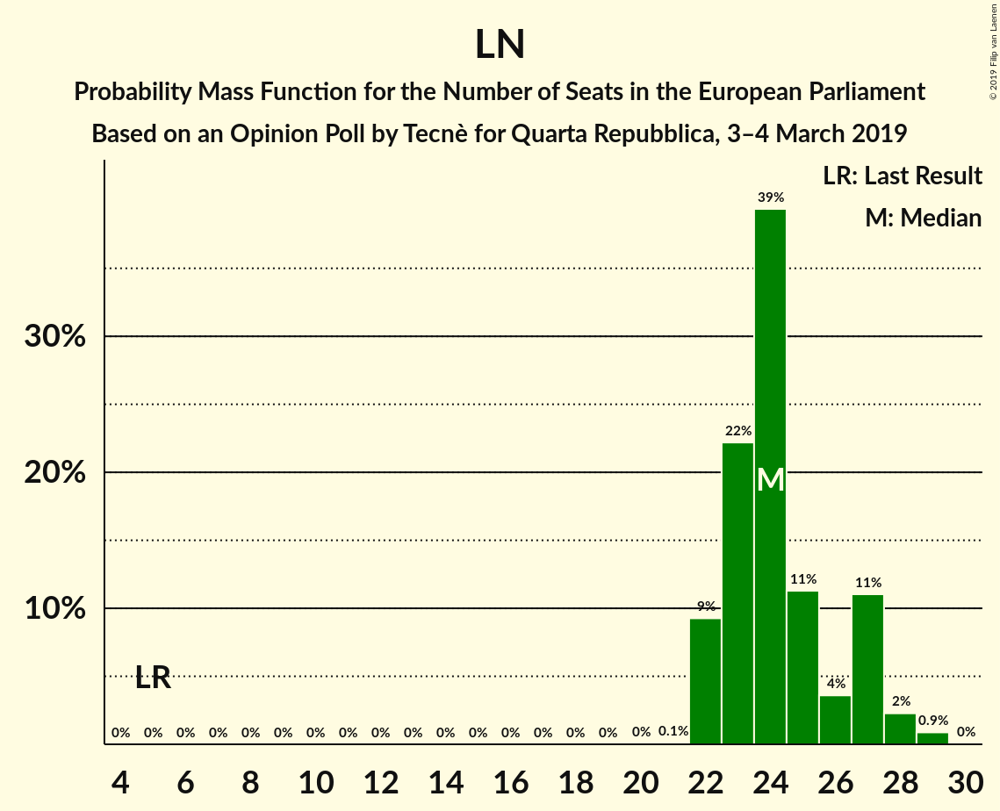
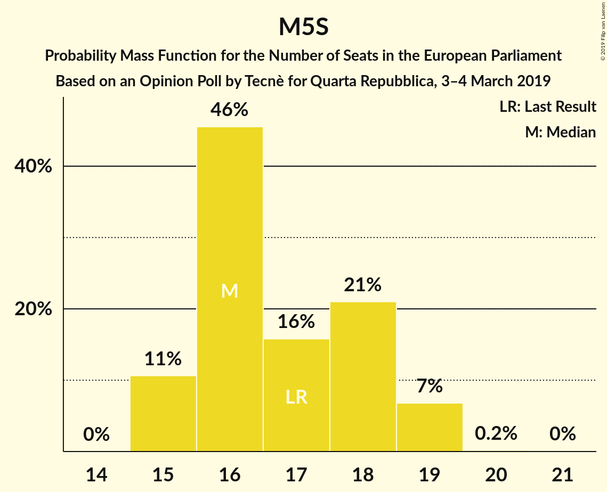
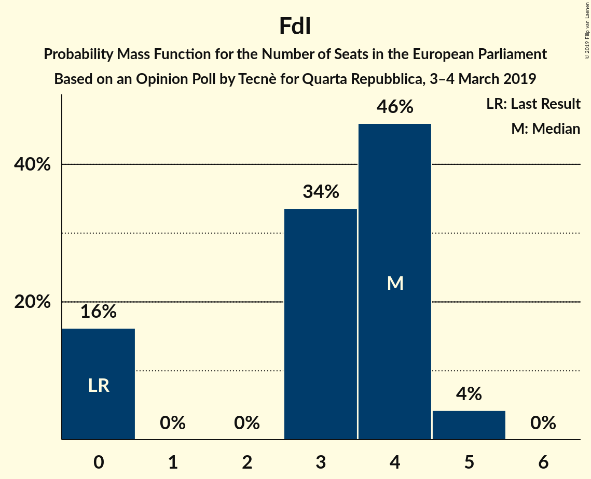

# Opinion Poll by Tecnè for Quarta Repubblica, 3–4 March 2019

<a href="#voting-intentions">Voting Intentions</a> | <a href="#seats">Seats</a> | <a href="#coalitions">Coalitions</a> | <a href="#technical-information">Technical Information</a>

## Voting Intentions

### Confidence Intervals

| Party | Last Result | Poll Result | 80% Confidence Interval | 90% Confidence Interval | 95% Confidence Interval | 99% Confidence Interval |
|:-----:|:-----------:|:-----------:|:-----------------------:|:-----------------------:|:-----------------------:|:-----------------------:|
| Lega Nord (ENF) | 6.2% | 32.5% | 30.7–34.4% |30.1–35.0% |29.7–35.5% |28.8–36.4% |
| Movimento 5 Stelle (EFDD) | 21.2% | 21.8% | 20.2–23.6% |19.8–24.1% |19.4–24.5% |18.6–25.4% |
| Partito Democratico (S&D) | 40.8% | 18.8% | 17.3–20.5% |16.9–21.0% |16.5–21.4% |15.8–22.2% |
| Forza Italia (EPP) | 16.8% | 12.0% | 10.7–13.4% |10.4–13.8% |10.1–14.1% |9.5–14.8% |
| Fratelli d’Italia (ECR) | 3.7% | 4.6% | 3.8–5.5% |3.6–5.8% |3.4–6.1% |3.1–6.6% |

*Note:* The poll result column reflects the actual value used in the calculations. Published results may vary slightly, and in addition be rounded to fewer digits.

## Seats

### Confidence Intervals

| Party | Last Result | Median | 80% Confidence Interval | 90% Confidence Interval | 95% Confidence Interval | 99% Confidence Interval |
|:-----:|:-----------:|:------:|:-----------------------:|:-----------------------:|:-----------------------:|:-----------------------:|
| <a href="#lega-nord-(enf)">Lega Nord (ENF)</a> | 5 | 24 | 23–27 |22–27 |22–28 |22–29 |
| <a href="#movimento-5-stelle-(efdd)">Movimento 5 Stelle (EFDD)</a> | 17 | 16 | 15–18 |15–19 |15–19 |15–19 |
| <a href="#partito-democratico-(s&d)">Partito Democratico (S&D)</a> | 31 | 14 | 11–16 |11–16 |11–16 |11–16 |
| <a href="#forza-italia-(epp)">Forza Italia (EPP)</a> | 13 | 10 | 7–11 |7–11 |7–11 |7–11 |
| <a href="#fratelli-d’italia-(ecr)">Fratelli d’Italia (ECR)</a> | 0 | 3 | 3–5 |0–5 |0–5 |0–5 |

### Lega Nord (ENF)

*For a full overview of the results for this party, see the [Lega Nord (ENF)](party-leganordenf.html) page.*

| Number of Seats | Probability | Accumulated | Special Marks |
|:---------------:|:-----------:|:-----------:|:-------------:|
| 5 | 0% | 100% | Last Result |
| 6 | 0% | 100% |  |
| 7 | 0% | 100% |  |
| 8 | 0% | 100% |  |
| 9 | 0% | 100% |  |
| 10 | 0% | 100% |  |
| 11 | 0% | 100% |  |
| 12 | 0% | 100% |  |
| 13 | 0% | 100% |  |
| 14 | 0% | 100% |  |
| 15 | 0% | 100% |  |
| 16 | 0% | 100% |  |
| 17 | 0% | 100% |  |
| 18 | 0% | 100% |  |
| 19 | 0% | 100% |  |
| 20 | 0% | 100% |  |
| 21 | 0.1% | 100% |  |
| 22 | 9% | 99.9% |  |
| 23 | 22% | 91% |  |
| 24 | 39% | 68% | Median |
| 25 | 11% | 29% |  |
| 26 | 4% | 18% |  |
| 27 | 11% | 14% |  |
| 28 | 2% | 3% |  |
| 29 | 0.9% | 0.9% |  |
| 30 | 0% | 0% |  |

### Movimento 5 Stelle (EFDD)

*For a full overview of the results for this party, see the [Movimento 5 Stelle (EFDD)](party-movimento5stelleefdd.html) page.*

| Number of Seats | Probability | Accumulated | Special Marks |
|:---------------:|:-----------:|:-----------:|:-------------:|
| 15 | 11% | 100% |  |
| 16 | 46% | 89% | Median |
| 17 | 16% | 44% | Last Result |
| 18 | 21% | 28% |  |
| 19 | 7% | 7% |  |
| 20 | 0.2% | 0.2% |  |
| 21 | 0% | 0% |  |

### Partito Democratico (S&D)

*For a full overview of the results for this party, see the [Partito Democratico (S&D)](party-partitodemocraticosd.html) page.*

| Number of Seats | Probability | Accumulated | Special Marks |
|:---------------:|:-----------:|:-----------:|:-------------:|
| 10 | 0.1% | 100% |  |
| 11 | 12% | 99.9% |  |
| 12 | 16% | 88% |  |
| 13 | 17% | 72% |  |
| 14 | 18% | 54% | Median |
| 15 | 9% | 36% |  |
| 16 | 27% | 27% |  |
| 17 | 0.1% | 0.1% |  |
| 18 | 0.1% | 0.1% |  |
| 19 | 0% | 0% |  |
| 20 | 0% | 0% |  |
| 21 | 0% | 0% |  |
| 22 | 0% | 0% |  |
| 23 | 0% | 0% |  |
| 24 | 0% | 0% |  |
| 25 | 0% | 0% |  |
| 26 | 0% | 0% |  |
| 27 | 0% | 0% |  |
| 28 | 0% | 0% |  |
| 29 | 0% | 0% |  |
| 30 | 0% | 0% |  |
| 31 | 0% | 0% | Last Result |

### Forza Italia (EPP)

*For a full overview of the results for this party, see the [Forza Italia (EPP)](party-forzaitaliaepp.html) page.*

| Number of Seats | Probability | Accumulated | Special Marks |
|:---------------:|:-----------:|:-----------:|:-------------:|
| 7 | 10% | 100% |  |
| 8 | 38% | 90% |  |
| 9 | 0.4% | 52% |  |
| 10 | 31% | 51% | Median |
| 11 | 20% | 21% |  |
| 12 | 0.1% | 0.1% |  |
| 13 | 0% | 0% | Last Result |

### Fratelli d’Italia (ECR)

*For a full overview of the results for this party, see the [Fratelli d’Italia (ECR)](party-fratellid’italiaecr.html) page.*

| Number of Seats | Probability | Accumulated | Special Marks |
|:---------------:|:-----------:|:-----------:|:-------------:|
| 0 | 6% | 100% | Last Result |
| 1 | 0% | 94% |  |
| 2 | 0% | 94% |  |
| 3 | 48% | 94% | Median |
| 4 | 33% | 46% |  |
| 5 | 12% | 12% |  |
| 6 | 0% | 0% |  |

## Coalitions

### Confidence Intervals

| Coalition | Last Result | Median | Majority? | 80% Confidence Interval | 90% Confidence Interval | 95% Confidence Interval | 99% Confidence Interval |
|:---------:|:-----------:|:------:|:---------:|:-----------------------:|:-----------------------:|:-----------------------:|:-----------------------:|
| Lega Nord (ENF) | 5 | 24 | 0% | 23–27 | 22–27 | 22–28 | 22–29 |
| Movimento 5 Stelle (EFDD) | 17 | 16 | 0% | 15–18 | 15–19 | 15–19 | 15–19 |
| Fratelli d’Italia (ECR) | 0 | 3 | 0% | 3–5 | 0–5 | 0–5 | 0–5 |

### Lega Nord (ENF)

| Number of Seats | Probability | Accumulated | Special Marks |
|:---------------:|:-----------:|:-----------:|:-------------:|
| 5 | 0% | 100% | Last Result |
| 6 | 0% | 100% |  |
| 7 | 0% | 100% |  |
| 8 | 0% | 100% |  |
| 9 | 0% | 100% |  |
| 10 | 0% | 100% |  |
| 11 | 0% | 100% |  |
| 12 | 0% | 100% |  |
| 13 | 0% | 100% |  |
| 14 | 0% | 100% |  |
| 15 | 0% | 100% |  |
| 16 | 0% | 100% |  |
| 17 | 0% | 100% |  |
| 18 | 0% | 100% |  |
| 19 | 0% | 100% |  |
| 20 | 0% | 100% |  |
| 21 | 0.1% | 100% |  |
| 22 | 9% | 99.9% |  |
| 23 | 22% | 91% |  |
| 24 | 39% | 68% | Median |
| 25 | 11% | 29% |  |
| 26 | 4% | 18% |  |
| 27 | 11% | 14% |  |
| 28 | 2% | 3% |  |
| 29 | 0.9% | 0.9% |  |
| 30 | 0% | 0% |  |

### Movimento 5 Stelle (EFDD)

| Number of Seats | Probability | Accumulated | Special Marks |
|:---------------:|:-----------:|:-----------:|:-------------:|
| 15 | 11% | 100% |  |
| 16 | 46% | 89% | Median |
| 17 | 16% | 44% | Last Result |
| 18 | 21% | 28% |  |
| 19 | 7% | 7% |  |
| 20 | 0.2% | 0.2% |  |
| 21 | 0% | 0% |  |

### Fratelli d’Italia (ECR)

| Number of Seats | Probability | Accumulated | Special Marks |
|:---------------:|:-----------:|:-----------:|:-------------:|
| 0 | 6% | 100% | Last Result |
| 1 | 0% | 94% |  |
| 2 | 0% | 94% |  |
| 3 | 48% | 94% | Median |
| 4 | 33% | 46% |  |
| 5 | 12% | 12% |  |
| 6 | 0% | 0% |  |

## Technical Information

### Opinion Poll

+ **Polling firm:** Tecnè
+ **Commissioner(s):** Quarta Repubblica
+ **Fieldwork period:** 3–4 March 2019

### Calculations

+ **Sample size:** 1003
+ **Simulations done:** 1,024
+ **Error estimate:** 5.64%

