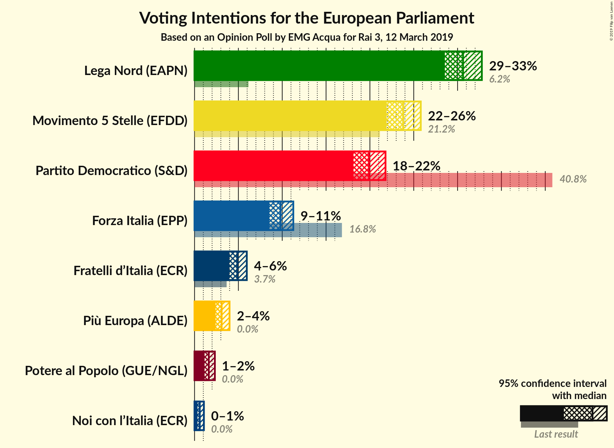
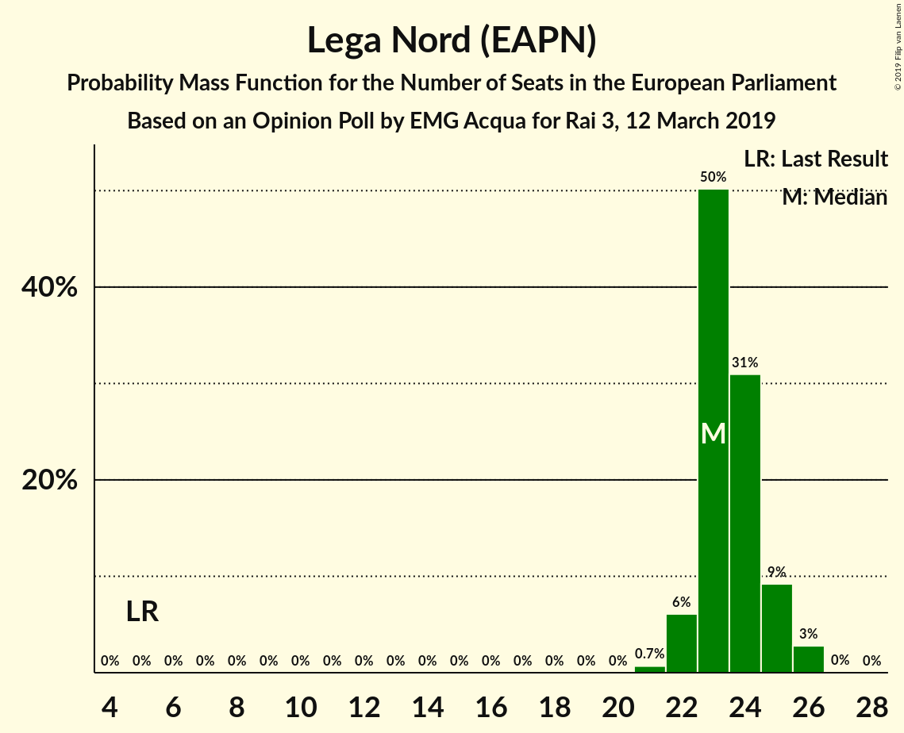
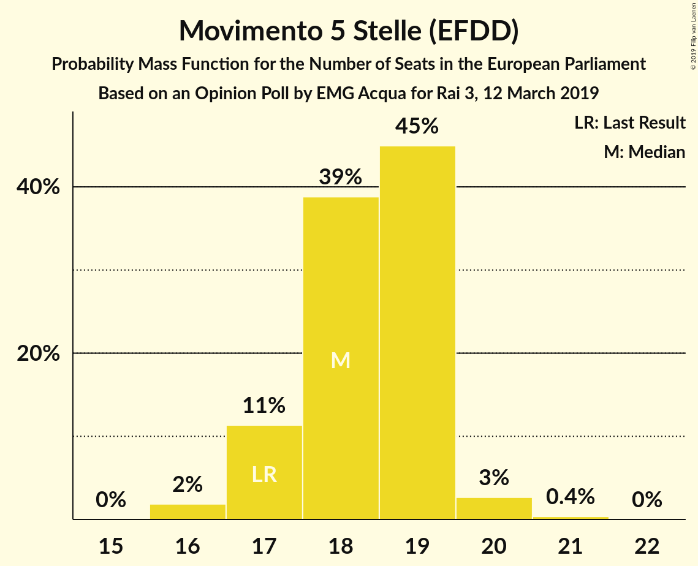
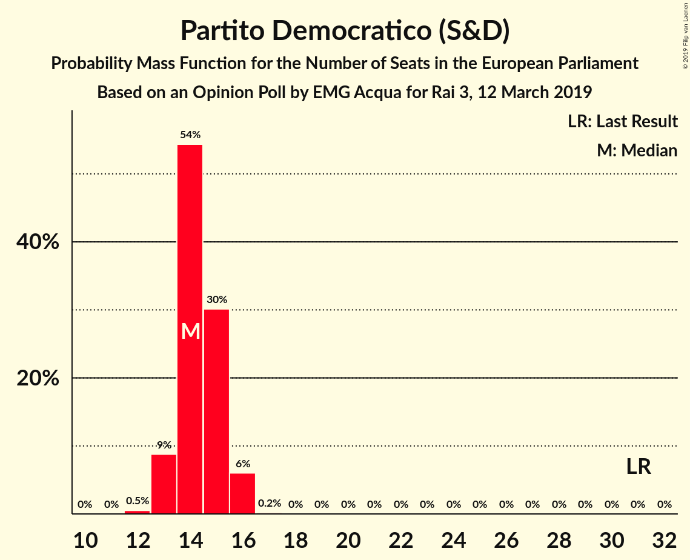
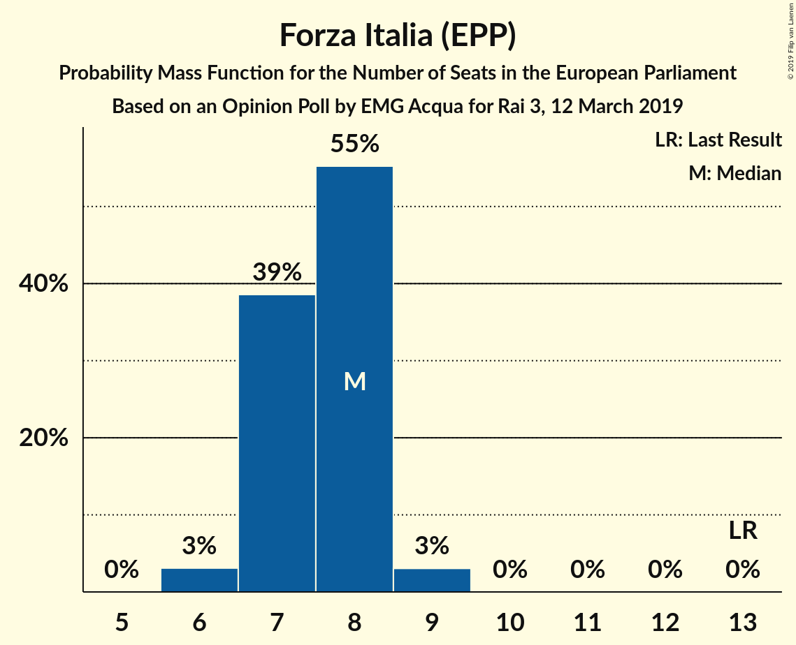
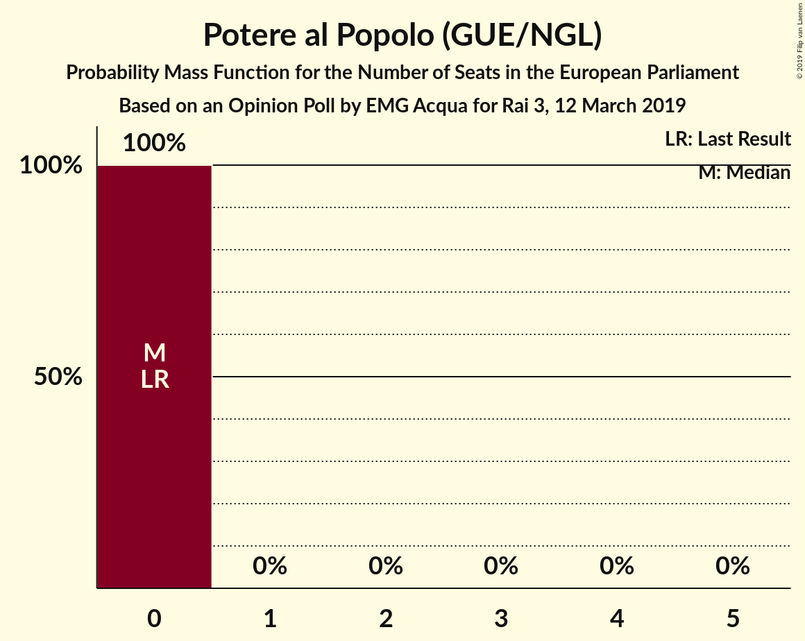
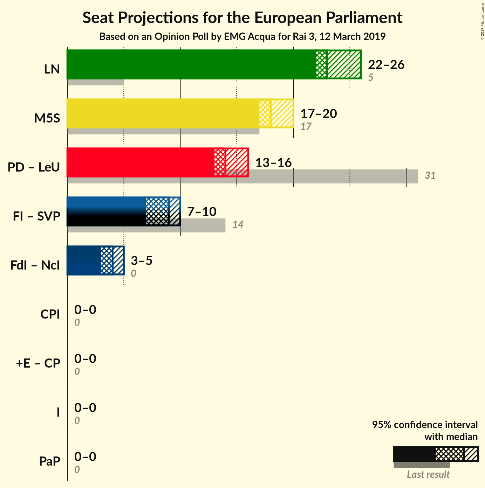
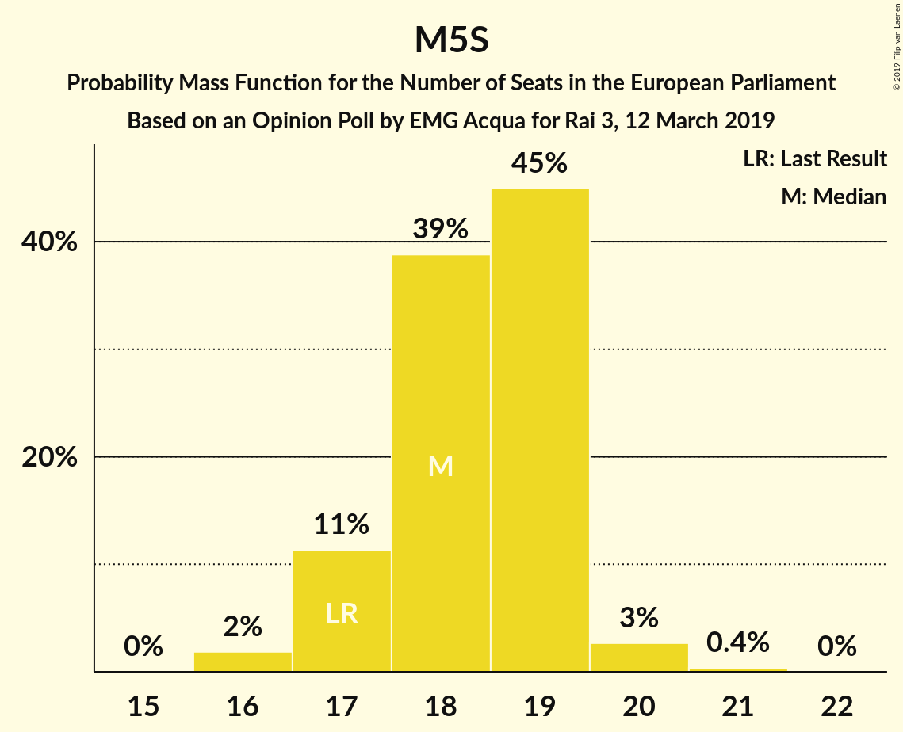
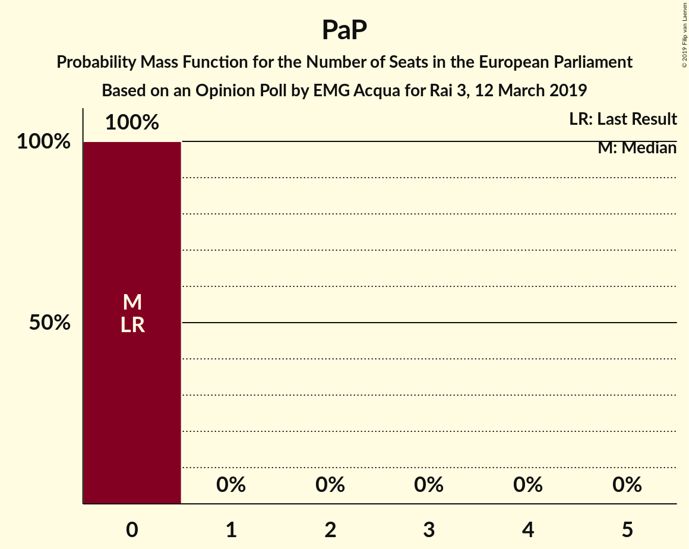

# Opinion Poll by EMG Acqua for Rai 3, 12 March 2019

<a href="#voting-intentions">Voting Intentions</a> | <a href="#seats">Seats</a> | <a href="#coalitions">Coalitions</a> | <a href="#technical-information">Technical Information</a>

## Voting Intentions

### Confidence Intervals

| Party | Last Result | Poll Result | 80% Confidence Interval | 90% Confidence Interval | 95% Confidence Interval | 99% Confidence Interval |
|:-----:|:-----------:|:-----------:|:-----------------------:|:-----------------------:|:-----------------------:|:-----------------------:|
| Lega Nord (EAPN) | 6.2% | 30.6% | 29.3–32.0% |28.9–32.4% |28.5–32.8% |27.9–33.5% |
| Movimento 5 Stelle (EFDD) | 21.2% | 23.8% | 22.6–25.1% |22.2–25.5% |21.9–25.8% |21.3–26.4% |
| Partito Democratico (S&D) | 40.8% | 19.9% | 18.7–21.1% |18.4–21.5% |18.1–21.8% |17.6–22.4% |
| Forza Italia (EPP) | 16.8% | 9.8% | 9.0–10.8% |8.7–11.0% |8.5–11.3% |8.1–11.7% |
| Fratelli d’Italia (ECR) | 3.7% | 4.9% | 4.3–5.6% |4.1–5.8% |4.0–6.0% |3.7–6.3% |
| Più Europa (ALDE) | 0.0% | 3.1% | 2.6–3.7% |2.5–3.8% |2.4–4.0% |2.2–4.3% |
| Potere al Popolo (GUE/NGL) | 0.0% | 1.6% | 1.3–2.1% |1.2–2.2% |1.1–2.3% |1.0–2.6% |
| Noi con l’Italia (ECR) | 0.0% | 0.6% | 0.4–0.9% |0.4–1.0% |0.3–1.1% |0.3–1.2% |

*Note:* The poll result column reflects the actual value used in the calculations. Published results may vary slightly, and in addition be rounded to fewer digits.

## Seats

### Confidence Intervals

| Party | Last Result | Median | 80% Confidence Interval | 90% Confidence Interval | 95% Confidence Interval | 99% Confidence Interval |
|:-----:|:-----------:|:------:|:-----------------------:|:-----------------------:|:-----------------------:|:-----------------------:|
| <a href="#lega-nord-(eapn)">Lega Nord (EAPN)</a> | 5 | 23 | 23–25 |22–25 |22–26 |21–26 |
| <a href="#movimento-5-stelle-(efdd)">Movimento 5 Stelle (EFDD)</a> | 17 | 18 | 17–19 |17–19 |17–20 |16–20 |
| <a href="#partito-democratico-(s&d)">Partito Democratico (S&D)</a> | 31 | 14 | 14–15 |13–16 |13–16 |12–16 |
| <a href="#forza-italia-(epp)">Forza Italia (EPP)</a> | 13 | 8 | 7–8 |7–8 |6–9 |6–9 |
| <a href="#fratelli-d’italia-(ecr)">Fratelli d’Italia (ECR)</a> | 0 | 4 | 3–4 |3–5 |3–5 |0–5 |
| <a href="#più-europa-(alde)">Più Europa (ALDE)</a> | 0 | 0 | 0 |0 |0 |0–3 |
| <a href="#potere-al-popolo-(gue/ngl)">Potere al Popolo (GUE/NGL)</a> | 0 | 0 | 0 |0 |0 |0 |
| <a href="#noi-con-l’italia-(ecr)">Noi con l’Italia (ECR)</a> | 0 | 0 | 0 |0 |0 |0 |

### Lega Nord (EAPN)

*For a full overview of the results for this party, see the [Lega Nord (EAPN)](party-leganordeapn.html) page.*

| Number of Seats | Probability | Accumulated | Special Marks |
|:---------------:|:-----------:|:-----------:|:-------------:|
| 5 | 0% | 100% | Last Result |
| 6 | 0% | 100% |  |
| 7 | 0% | 100% |  |
| 8 | 0% | 100% |  |
| 9 | 0% | 100% |  |
| 10 | 0% | 100% |  |
| 11 | 0% | 100% |  |
| 12 | 0% | 100% |  |
| 13 | 0% | 100% |  |
| 14 | 0% | 100% |  |
| 15 | 0% | 100% |  |
| 16 | 0% | 100% |  |
| 17 | 0% | 100% |  |
| 18 | 0% | 100% |  |
| 19 | 0% | 100% |  |
| 20 | 0% | 100% |  |
| 21 | 0.7% | 100% |  |
| 22 | 6% | 99.3% |  |
| 23 | 50% | 93% | Median |
| 24 | 31% | 43% |  |
| 25 | 9% | 12% |  |
| 26 | 3% | 3% |  |
| 27 | 0% | 0% |  |

### Movimento 5 Stelle (EFDD)

*For a full overview of the results for this party, see the [Movimento 5 Stelle (EFDD)](party-movimento5stelleefdd.html) page.*

| Number of Seats | Probability | Accumulated | Special Marks |
|:---------------:|:-----------:|:-----------:|:-------------:|
| 16 | 2% | 100% |  |
| 17 | 11% | 98% | Last Result |
| 18 | 39% | 87% | Median |
| 19 | 45% | 48% |  |
| 20 | 3% | 3% |  |
| 21 | 0.4% | 0.4% |  |
| 22 | 0% | 0% |  |

### Partito Democratico (S&D)

*For a full overview of the results for this party, see the [Partito Democratico (S&D)](party-partitodemocraticosd.html) page.*

| Number of Seats | Probability | Accumulated | Special Marks |
|:---------------:|:-----------:|:-----------:|:-------------:|
| 12 | 0.5% | 100% |  |
| 13 | 9% | 99.5% |  |
| 14 | 54% | 91% | Median |
| 15 | 30% | 36% |  |
| 16 | 6% | 6% |  |
| 17 | 0.2% | 0.2% |  |
| 18 | 0% | 0% |  |
| 19 | 0% | 0% |  |
| 20 | 0% | 0% |  |
| 21 | 0% | 0% |  |
| 22 | 0% | 0% |  |
| 23 | 0% | 0% |  |
| 24 | 0% | 0% |  |
| 25 | 0% | 0% |  |
| 26 | 0% | 0% |  |
| 27 | 0% | 0% |  |
| 28 | 0% | 0% |  |
| 29 | 0% | 0% |  |
| 30 | 0% | 0% |  |
| 31 | 0% | 0% | Last Result |

### Forza Italia (EPP)

*For a full overview of the results for this party, see the [Forza Italia (EPP)](party-forzaitaliaepp.html) page.*

| Number of Seats | Probability | Accumulated | Special Marks |
|:---------------:|:-----------:|:-----------:|:-------------:|
| 6 | 3% | 100% |  |
| 7 | 39% | 97% |  |
| 8 | 55% | 58% | Median |
| 9 | 3% | 3% |  |
| 10 | 0% | 0% |  |
| 11 | 0% | 0% |  |
| 12 | 0% | 0% |  |
| 13 | 0% | 0% | Last Result |

### Fratelli d’Italia (ECR)

*For a full overview of the results for this party, see the [Fratelli d’Italia (ECR)](party-fratellid’italiaecr.html) page.*

| Number of Seats | Probability | Accumulated | Special Marks |
|:---------------:|:-----------:|:-----------:|:-------------:|
| 0 | 2% | 100% | Last Result |
| 1 | 0% | 98% |  |
| 2 | 0% | 98% |  |
| 3 | 28% | 98% |  |
| 4 | 62% | 70% | Median |
| 5 | 8% | 8% |  |
| 6 | 0% | 0% |  |

### Più Europa (ALDE)

*For a full overview of the results for this party, see the [Più Europa (ALDE)](party-piùeuropaalde.html) page.*

| Number of Seats | Probability | Accumulated | Special Marks |
|:---------------:|:-----------:|:-----------:|:-------------:|
| 0 | 98% | 100% | Last Result, Median |
| 1 | 0% | 2% |  |
| 2 | 0% | 2% |  |
| 3 | 2% | 2% |  |
| 4 | 0.1% | 0.1% |  |
| 5 | 0% | 0% |  |

### Potere al Popolo (GUE/NGL)

*For a full overview of the results for this party, see the [Potere al Popolo (GUE/NGL)](party-poterealpopologuengl.html) page.*

| Number of Seats | Probability | Accumulated | Special Marks |
|:---------------:|:-----------:|:-----------:|:-------------:|
| 0 | 100% | 100% | Last Result, Median |

### Noi con l’Italia (ECR)

*For a full overview of the results for this party, see the [Noi con l’Italia (ECR)](party-noiconl’italiaecr.html) page.*

| Number of Seats | Probability | Accumulated | Special Marks |
|:---------------:|:-----------:|:-----------:|:-------------:|
| 0 | 100% | 100% | Last Result, Median |

## Coalitions

### Confidence Intervals

| Coalition | Last Result | Median | Majority? | 80% Confidence Interval | 90% Confidence Interval | 95% Confidence Interval | 99% Confidence Interval |
|:---------:|:-----------:|:------:|:---------:|:-----------------------:|:-----------------------:|:-----------------------:|:-----------------------:|
| Lega Nord (EAPN) | 5 | 23 | 0% | 23–25 | 22–25 | 22–26 | 21–26 |
| Movimento 5 Stelle (EFDD) | 17 | 18 | 0% | 17–19 | 17–19 | 17–20 | 16–20 |
| Fratelli d’Italia (ECR) – Noi con l’Italia (ECR) | 0 | 4 | 0% | 3–4 | 3–5 | 3–5 | 0–5 |
| Potere al Popolo (GUE/NGL) | 0 | 0 | 0% | 0 | 0 | 0 | 0 |

### Lega Nord (EAPN)

| Number of Seats | Probability | Accumulated | Special Marks |
|:---------------:|:-----------:|:-----------:|:-------------:|
| 5 | 0% | 100% | Last Result |
| 6 | 0% | 100% |  |
| 7 | 0% | 100% |  |
| 8 | 0% | 100% |  |
| 9 | 0% | 100% |  |
| 10 | 0% | 100% |  |
| 11 | 0% | 100% |  |
| 12 | 0% | 100% |  |
| 13 | 0% | 100% |  |
| 14 | 0% | 100% |  |
| 15 | 0% | 100% |  |
| 16 | 0% | 100% |  |
| 17 | 0% | 100% |  |
| 18 | 0% | 100% |  |
| 19 | 0% | 100% |  |
| 20 | 0% | 100% |  |
| 21 | 0.7% | 100% |  |
| 22 | 6% | 99.3% |  |
| 23 | 50% | 93% | Median |
| 24 | 31% | 43% |  |
| 25 | 9% | 12% |  |
| 26 | 3% | 3% |  |
| 27 | 0% | 0% |  |

### Movimento 5 Stelle (EFDD)

| Number of Seats | Probability | Accumulated | Special Marks |
|:---------------:|:-----------:|:-----------:|:-------------:|
| 16 | 2% | 100% |  |
| 17 | 11% | 98% | Last Result |
| 18 | 39% | 87% | Median |
| 19 | 45% | 48% |  |
| 20 | 3% | 3% |  |
| 21 | 0.4% | 0.4% |  |
| 22 | 0% | 0% |  |

### Fratelli d’Italia (ECR) – Noi con l’Italia (ECR)

| Number of Seats | Probability | Accumulated | Special Marks |
|:---------------:|:-----------:|:-----------:|:-------------:|
| 0 | 2% | 100% | Last Result |
| 1 | 0% | 98% |  |
| 2 | 0% | 98% |  |
| 3 | 28% | 98% |  |
| 4 | 62% | 70% | Median |
| 5 | 8% | 8% |  |
| 6 | 0% | 0% |  |

### Potere al Popolo (GUE/NGL)

| Number of Seats | Probability | Accumulated | Special Marks |
|:---------------:|:-----------:|:-----------:|:-------------:|
| 0 | 100% | 100% | Last Result, Median |

## Technical Information

### Opinion Poll

+ **Polling firm:** EMG Acqua
+ **Commissioner(s):** Rai 3
+ **Fieldwork period:** 12 March 2019

### Calculations

+ **Sample size:** 1845
+ **Simulations done:** 131,072
+ **Error estimate:** 1.13%

