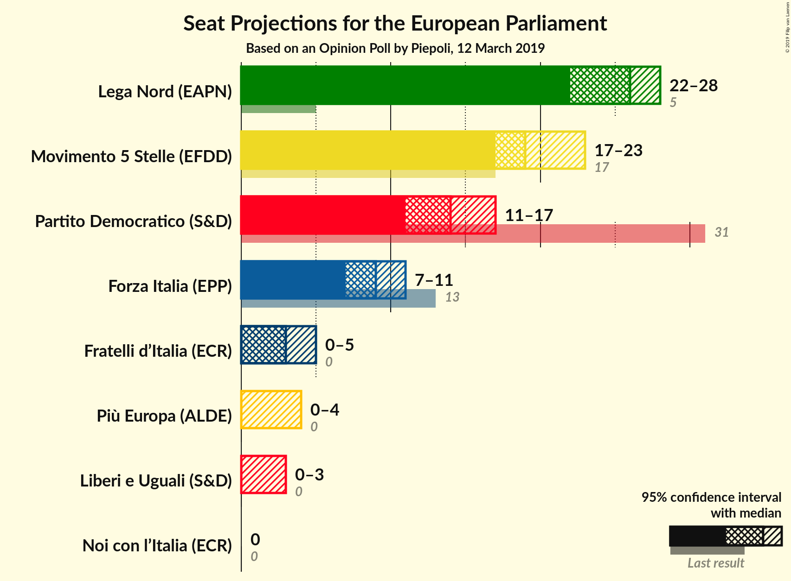
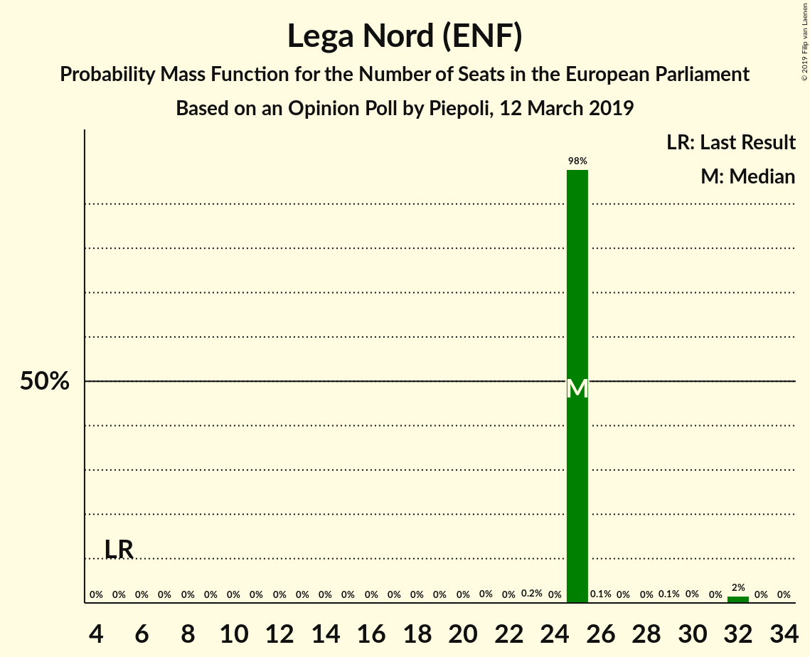
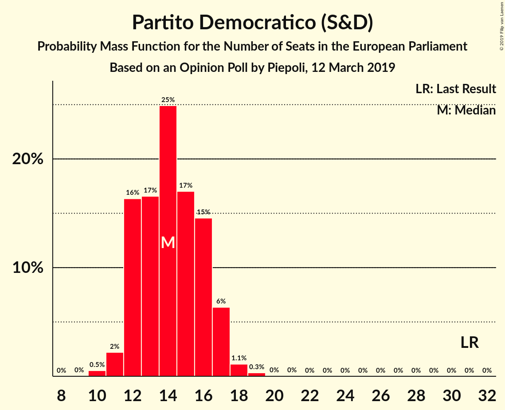
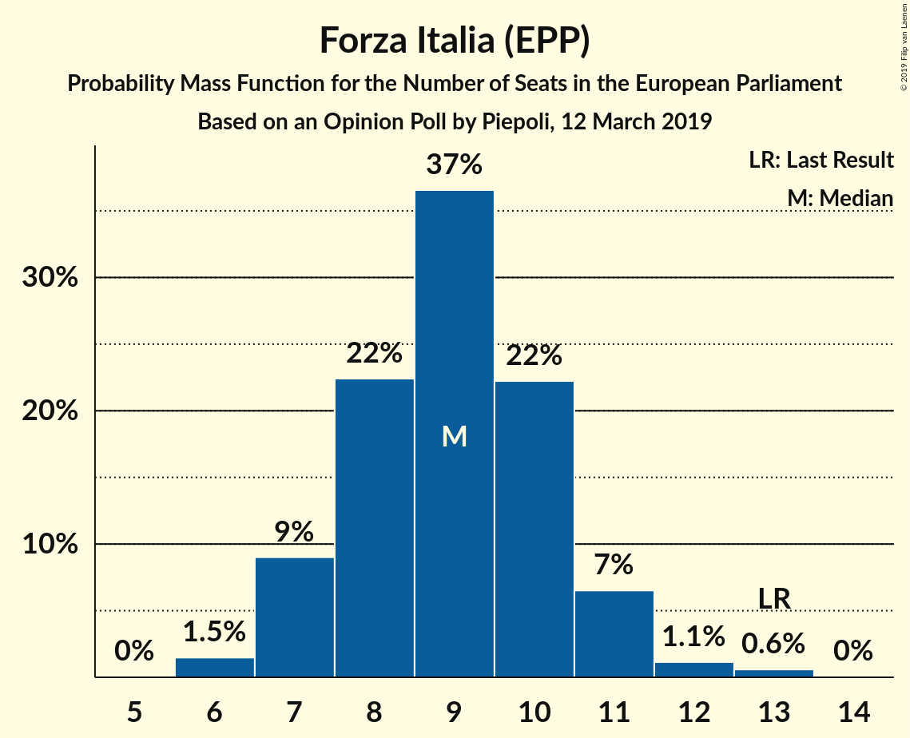
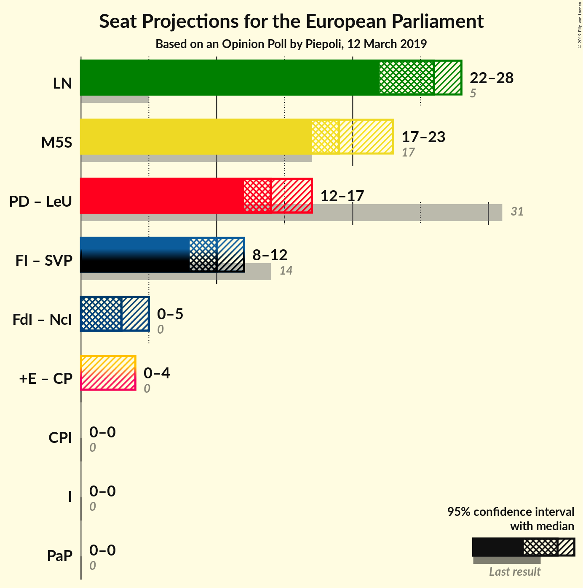
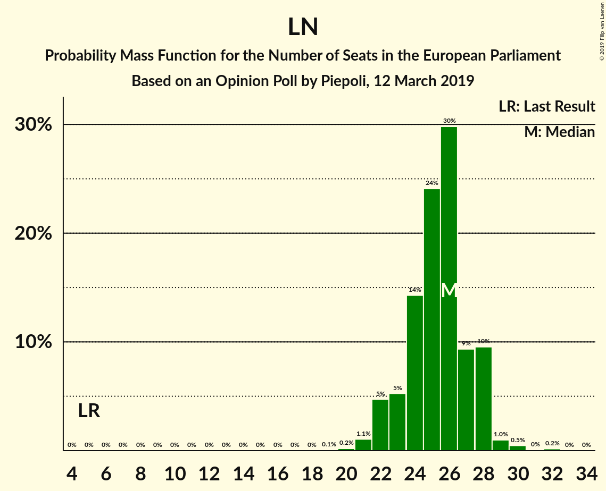
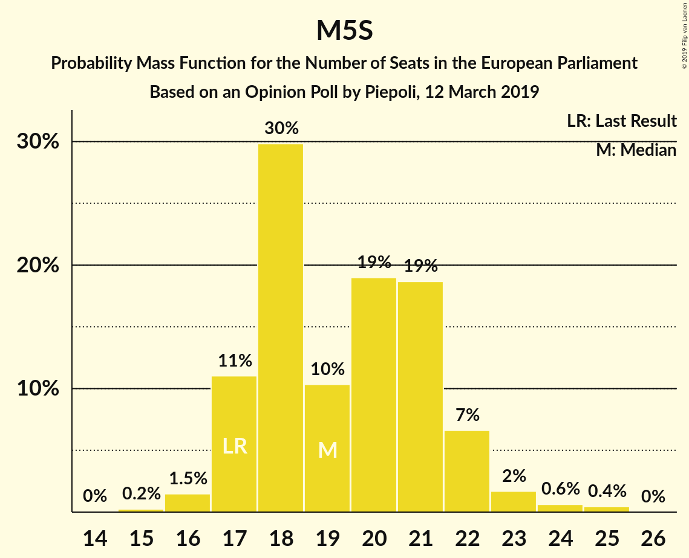

# Opinion Poll by Piepoli, 12 March 2019

<a href="#voting-intentions">Voting Intentions</a> | <a href="#seats">Seats</a> | <a href="#coalitions">Coalitions</a> | <a href="#technical-information">Technical Information</a>

## Voting Intentions

### Confidence Intervals

| Party | Last Result | Poll Result | 80% Confidence Interval | 90% Confidence Interval | 95% Confidence Interval | 99% Confidence Interval |
|:-----:|:-----------:|:-----------:|:-----------------------:|:-----------------------:|:-----------------------:|:-----------------------:|
| Lega Nord (ENF) | 6.2% | 31.6% | 29.0–34.4% |28.3–35.1% |27.7–35.8% |26.5–37.1% |
| Movimento 5 Stelle (EFDD) | 21.2% | 24.6% | 22.3–27.2% |21.6–27.9% |21.0–28.6% |19.9–29.8% |
| Partito Democratico (S&D) | 40.8% | 19.0% | 16.9–21.4% |16.3–22.1% |15.8–22.7% |14.8–23.9% |
| Forza Italia (EPP) | 16.8% | 11.0% | 9.4–13.0% |8.9–13.5% |8.6–14.1% |7.8–15.1% |
| Fratelli d’Italia (ECR) | 3.7% | 4.0% | 3.1–5.4% |2.8–5.8% |2.6–6.1% |2.2–6.8% |
| Più Europa (ALDE) | 0.0% | 3.6% | 2.7–4.9% |2.5–5.3% |2.3–5.6% |1.9–6.3% |
| Liberi e Uguali (S&D) | 0.0% | 2.6% | 1.9–3.8% |1.7–4.1% |1.5–4.4% |1.2–5.0% |
| Noi con l’Italia (EPP) | 0.0% | 0.6% | 0.3–1.3% |0.3–1.6% |0.2–1.8% |0.1–2.2% |

*Note:* The poll result column reflects the actual value used in the calculations. Published results may vary slightly, and in addition be rounded to fewer digits.

## Seats

### Confidence Intervals

| Party | Last Result | Median | 80% Confidence Interval | 90% Confidence Interval | 95% Confidence Interval | 99% Confidence Interval |
|:-----:|:-----------:|:------:|:-----------------------:|:-----------------------:|:-----------------------:|:-----------------------:|
| <a href="#lega-nord-(enf)">Lega Nord (ENF)</a> | 5 | 27 | 24–29 |23–29 |23–29 |22–31 |
| <a href="#movimento-5-stelle-(efdd)">Movimento 5 Stelle (EFDD)</a> | 17 | 20 | 18–22 |17–23 |17–24 |16–25 |
| <a href="#partito-democratico-(s&d)">Partito Democratico (S&D)</a> | 31 | 15 | 13–17 |12–18 |12–18 |11–19 |
| <a href="#forza-italia-(epp)">Forza Italia (EPP)</a> | 13 | 9 | 8–11 |7–11 |7–12 |6–13 |
| <a href="#fratelli-d’italia-(ecr)">Fratelli d’Italia (ECR)</a> | 0 | 3 | 0–4 |0–5 |0–5 |0–5 |
| <a href="#più-europa-(alde)">Più Europa (ALDE)</a> | 0 | 0 | 0–4 |0–4 |0–4 |0–5 |
| <a href="#liberi-e-uguali-(s&d)">Liberi e Uguali (S&D)</a> | 0 | 0 | 0 |0 |0–3 |0–4 |
| <a href="#noi-con-l’italia-(epp)">Noi con l’Italia (EPP)</a> | 0 | 0 | 0 |0 |0 |0 |

### Lega Nord (ENF)

*For a full overview of the results for this party, see the [Lega Nord (ENF)](party-leganordenf.html) page.*

| Number of Seats | Probability | Accumulated | Special Marks |
|:---------------:|:-----------:|:-----------:|:-------------:|
| 5 | 0% | 100% | Last Result |
| 6 | 0% | 100% |  |
| 7 | 0% | 100% |  |
| 8 | 0% | 100% |  |
| 9 | 0% | 100% |  |
| 10 | 0% | 100% |  |
| 11 | 0% | 100% |  |
| 12 | 0% | 100% |  |
| 13 | 0% | 100% |  |
| 14 | 0% | 100% |  |
| 15 | 0% | 100% |  |
| 16 | 0% | 100% |  |
| 17 | 0% | 100% |  |
| 18 | 0% | 100% |  |
| 19 | 0% | 100% |  |
| 20 | 0.1% | 100% |  |
| 21 | 0.2% | 99.9% |  |
| 22 | 1.1% | 99.7% |  |
| 23 | 5% | 98.5% |  |
| 24 | 6% | 93% |  |
| 25 | 11% | 88% |  |
| 26 | 24% | 77% |  |
| 27 | 29% | 52% | Median |
| 28 | 12% | 23% |  |
| 29 | 9% | 12% |  |
| 30 | 2% | 2% |  |
| 31 | 0.5% | 0.7% |  |
| 32 | 0.1% | 0.2% |  |
| 33 | 0.2% | 0.2% |  |
| 34 | 0% | 0% |  |

### Movimento 5 Stelle (EFDD)

*For a full overview of the results for this party, see the [Movimento 5 Stelle (EFDD)](party-movimento5stelleefdd.html) page.*

| Number of Seats | Probability | Accumulated | Special Marks |
|:---------------:|:-----------:|:-----------:|:-------------:|
| 15 | 0.1% | 100% |  |
| 16 | 0.5% | 99.9% |  |
| 17 | 5% | 99.4% | Last Result |
| 18 | 12% | 94% |  |
| 19 | 28% | 82% |  |
| 20 | 18% | 54% | Median |
| 21 | 14% | 36% |  |
| 22 | 13% | 22% |  |
| 23 | 5% | 9% |  |
| 24 | 4% | 5% |  |
| 25 | 0.5% | 1.0% |  |
| 26 | 0.1% | 0.5% |  |
| 27 | 0.3% | 0.3% |  |
| 28 | 0% | 0% |  |

### Partito Democratico (S&D)

*For a full overview of the results for this party, see the [Partito Democratico (S&D)](party-partitodemocraticosd.html) page.*

| Number of Seats | Probability | Accumulated | Special Marks |
|:---------------:|:-----------:|:-----------:|:-------------:|
| 10 | 0.1% | 100% |  |
| 11 | 1.2% | 99.9% |  |
| 12 | 6% | 98.7% |  |
| 13 | 17% | 93% |  |
| 14 | 17% | 76% |  |
| 15 | 28% | 59% | Median |
| 16 | 13% | 31% |  |
| 17 | 11% | 18% |  |
| 18 | 7% | 8% |  |
| 19 | 0.7% | 1.1% |  |
| 20 | 0.3% | 0.3% |  |
| 21 | 0% | 0% |  |
| 22 | 0% | 0% |  |
| 23 | 0% | 0% |  |
| 24 | 0% | 0% |  |
| 25 | 0% | 0% |  |
| 26 | 0% | 0% |  |
| 27 | 0% | 0% |  |
| 28 | 0% | 0% |  |
| 29 | 0% | 0% |  |
| 30 | 0% | 0% |  |
| 31 | 0% | 0% | Last Result |

### Forza Italia (EPP)

*For a full overview of the results for this party, see the [Forza Italia (EPP)](party-forzaitaliaepp.html) page.*

| Number of Seats | Probability | Accumulated | Special Marks |
|:---------------:|:-----------:|:-----------:|:-------------:|
| 6 | 0.8% | 100% |  |
| 7 | 6% | 99.2% |  |
| 8 | 20% | 93% |  |
| 9 | 25% | 73% | Median |
| 10 | 35% | 48% |  |
| 11 | 8% | 13% |  |
| 12 | 4% | 5% |  |
| 13 | 0.7% | 0.8% | Last Result |
| 14 | 0.1% | 0.1% |  |
| 15 | 0% | 0% |  |

### Fratelli d’Italia (ECR)

*For a full overview of the results for this party, see the [Fratelli d’Italia (ECR)](party-fratellid’italiaecr.html) page.*

| Number of Seats | Probability | Accumulated | Special Marks |
|:---------------:|:-----------:|:-----------:|:-------------:|
| 0 | 39% | 100% | Last Result |
| 1 | 0% | 61% |  |
| 2 | 0% | 61% |  |
| 3 | 19% | 61% | Median |
| 4 | 35% | 42% |  |
| 5 | 7% | 7% |  |
| 6 | 0.4% | 0.4% |  |
| 7 | 0% | 0% |  |

### Più Europa (ALDE)

*For a full overview of the results for this party, see the [Più Europa (ALDE)](party-piùeuropaalde.html) page.*

| Number of Seats | Probability | Accumulated | Special Marks |
|:---------------:|:-----------:|:-----------:|:-------------:|
| 0 | 63% | 100% | Last Result, Median |
| 1 | 0% | 37% |  |
| 2 | 0% | 37% |  |
| 3 | 5% | 37% |  |
| 4 | 30% | 32% |  |
| 5 | 2% | 2% |  |
| 6 | 0.1% | 0.1% |  |
| 7 | 0% | 0% |  |

### Liberi e Uguali (S&D)

*For a full overview of the results for this party, see the [Liberi e Uguali (S&D)](party-liberieugualisd.html) page.*

| Number of Seats | Probability | Accumulated | Special Marks |
|:---------------:|:-----------:|:-----------:|:-------------:|
| 0 | 97% | 100% | Last Result, Median |
| 1 | 0% | 3% |  |
| 2 | 0% | 3% |  |
| 3 | 1.3% | 3% |  |
| 4 | 2% | 2% |  |
| 5 | 0.1% | 0.1% |  |
| 6 | 0% | 0% |  |

### Noi con l’Italia (EPP)

*For a full overview of the results for this party, see the [Noi con l’Italia (EPP)](party-noiconl’italiaepp.html) page.*

| Number of Seats | Probability | Accumulated | Special Marks |
|:---------------:|:-----------:|:-----------:|:-------------:|
| 0 | 100% | 100% | Last Result, Median |

## Coalitions

### Confidence Intervals

| Coalition | Last Result | Median | Majority? | 80% Confidence Interval | 90% Confidence Interval | 95% Confidence Interval | 99% Confidence Interval |
|:---------:|:-----------:|:------:|:---------:|:-----------------------:|:-----------------------:|:-----------------------:|:-----------------------:|
| Lega Nord (ENF) | 5 | 27 | 0% | 24–29 | 23–29 | 23–29 | 22–31 |
| Movimento 5 Stelle (EFDD) | 17 | 20 | 0% | 18–22 | 17–23 | 17–24 | 16–25 |
| Partito Democratico (S&D) – Liberi e Uguali (S&D) | 31 | 15 | 0% | 13–17 | 12–18 | 12–18 | 11–20 |
| Fratelli d’Italia (ECR) | 0 | 3 | 0% | 0–4 | 0–5 | 0–5 | 0–5 |
| Più Europa (ALDE) | 0 | 0 | 0% | 0–4 | 0–4 | 0–4 | 0–5 |

### Lega Nord (ENF)

| Number of Seats | Probability | Accumulated | Special Marks |
|:---------------:|:-----------:|:-----------:|:-------------:|
| 5 | 0% | 100% | Last Result |
| 6 | 0% | 100% |  |
| 7 | 0% | 100% |  |
| 8 | 0% | 100% |  |
| 9 | 0% | 100% |  |
| 10 | 0% | 100% |  |
| 11 | 0% | 100% |  |
| 12 | 0% | 100% |  |
| 13 | 0% | 100% |  |
| 14 | 0% | 100% |  |
| 15 | 0% | 100% |  |
| 16 | 0% | 100% |  |
| 17 | 0% | 100% |  |
| 18 | 0% | 100% |  |
| 19 | 0% | 100% |  |
| 20 | 0.1% | 100% |  |
| 21 | 0.2% | 99.9% |  |
| 22 | 1.1% | 99.7% |  |
| 23 | 5% | 98.5% |  |
| 24 | 6% | 93% |  |
| 25 | 11% | 88% |  |
| 26 | 24% | 77% |  |
| 27 | 29% | 52% | Median |
| 28 | 12% | 23% |  |
| 29 | 9% | 12% |  |
| 30 | 2% | 2% |  |
| 31 | 0.5% | 0.7% |  |
| 32 | 0.1% | 0.2% |  |
| 33 | 0.2% | 0.2% |  |
| 34 | 0% | 0% |  |

### Movimento 5 Stelle (EFDD)

| Number of Seats | Probability | Accumulated | Special Marks |
|:---------------:|:-----------:|:-----------:|:-------------:|
| 15 | 0.1% | 100% |  |
| 16 | 0.5% | 99.9% |  |
| 17 | 5% | 99.4% | Last Result |
| 18 | 12% | 94% |  |
| 19 | 28% | 82% |  |
| 20 | 18% | 54% | Median |
| 21 | 14% | 36% |  |
| 22 | 13% | 22% |  |
| 23 | 5% | 9% |  |
| 24 | 4% | 5% |  |
| 25 | 0.5% | 1.0% |  |
| 26 | 0.1% | 0.5% |  |
| 27 | 0.3% | 0.3% |  |
| 28 | 0% | 0% |  |

### Partito Democratico (S&D) – Liberi e Uguali (S&D)

| Number of Seats | Probability | Accumulated | Special Marks |
|:---------------:|:-----------:|:-----------:|:-------------:|
| 11 | 1.0% | 100% |  |
| 12 | 6% | 99.0% |  |
| 13 | 16% | 93% |  |
| 14 | 16% | 77% |  |
| 15 | 28% | 61% | Median |
| 16 | 13% | 33% |  |
| 17 | 11% | 20% |  |
| 18 | 7% | 9% |  |
| 19 | 1.2% | 2% |  |
| 20 | 0.5% | 0.8% |  |
| 21 | 0.3% | 0.3% |  |
| 22 | 0% | 0% |  |
| 23 | 0% | 0% |  |
| 24 | 0% | 0% |  |
| 25 | 0% | 0% |  |
| 26 | 0% | 0% |  |
| 27 | 0% | 0% |  |
| 28 | 0% | 0% |  |
| 29 | 0% | 0% |  |
| 30 | 0% | 0% |  |
| 31 | 0% | 0% | Last Result |

### Fratelli d’Italia (ECR)

| Number of Seats | Probability | Accumulated | Special Marks |
|:---------------:|:-----------:|:-----------:|:-------------:|
| 0 | 39% | 100% | Last Result |
| 1 | 0% | 61% |  |
| 2 | 0% | 61% |  |
| 3 | 19% | 61% | Median |
| 4 | 35% | 42% |  |
| 5 | 7% | 7% |  |
| 6 | 0.4% | 0.4% |  |
| 7 | 0% | 0% |  |

### Più Europa (ALDE)

| Number of Seats | Probability | Accumulated | Special Marks |
|:---------------:|:-----------:|:-----------:|:-------------:|
| 0 | 63% | 100% | Last Result, Median |
| 1 | 0% | 37% |  |
| 2 | 0% | 37% |  |
| 3 | 5% | 37% |  |
| 4 | 30% | 32% |  |
| 5 | 2% | 2% |  |
| 6 | 0.1% | 0.1% |  |
| 7 | 0% | 0% |  |

## Technical Information

### Opinion Poll

+ **Polling firm:** Piepoli
+ **Commissioner(s):** —
+ **Fieldwork period:** 12 March 2019

### Calculations

+ **Sample size:** 500
+ **Simulations done:** 131,072
+ **Error estimate:** 2.56%

