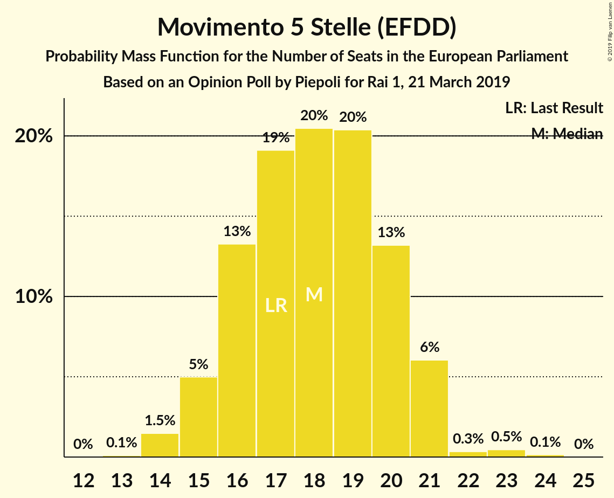
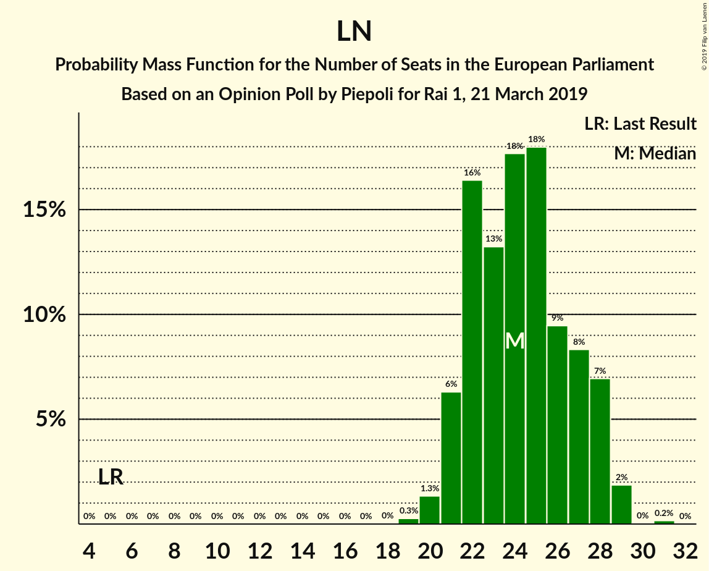
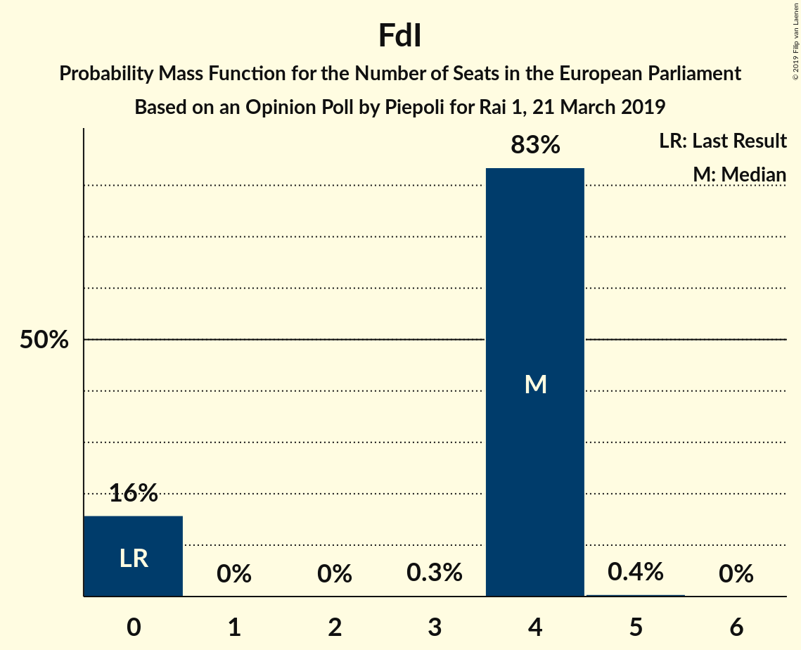

# Opinion Poll by Piepoli for Rai 1, 21 March 2019

<a href="#voting-intentions">Voting Intentions</a> | <a href="#seats">Seats</a> | <a href="#coalitions">Coalitions</a> | <a href="#technical-information">Technical Information</a>

## Voting Intentions

### Confidence Intervals

| Party | Last Result | Poll Result | 80% Confidence Interval | 90% Confidence Interval | 95% Confidence Interval | 99% Confidence Interval |
|:-----:|:-----------:|:-----------:|:-----------------------:|:-----------------------:|:-----------------------:|:-----------------------:|
| Lega Nord (ENF) | 6.2% | 31.0% | 28.4–33.7% |27.7–34.5% |27.1–35.2% |25.9–36.5% |
| Movimento 5 Stelle (EFDD) | 21.2% | 23.0% | 20.7–25.5% |20.1–26.3% |19.5–26.9% |18.5–28.2% |
| Partito Democratico (S&D) | 40.8% | 20.0% | 17.8–22.5% |17.2–23.1% |16.7–23.7% |15.7–25.0% |
| Forza Italia (EPP) | 16.8% | 11.6% | 9.9–13.6% |9.5–14.2% |9.1–14.7% |8.3–15.7% |
| Fratelli d’Italia (ECR) | 3.7% | 4.6% | 3.6–6.0% |3.3–6.4% |3.1–6.8% |2.7–7.6% |
| Più Europa (ALDE) | 0.0% | 3.0% | 2.2–4.2% |2.0–4.6% |1.8–4.9% |1.5–5.5% |
| Liberi e Uguali (S&D) | 0.0% | 2.0% | 1.4–3.1% |1.2–3.4% |1.1–3.6% |0.9–4.2% |
| Noi con l’Italia (EPP) | 0.0% | 0.6% | 0.3–1.3% |0.3–1.6% |0.2–1.8% |0.1–2.2% |

*Note:* The poll result column reflects the actual value used in the calculations. Published results may vary slightly, and in addition be rounded to fewer digits.

## Seats

### Confidence Intervals

| Party | Last Result | Median | 80% Confidence Interval | 90% Confidence Interval | 95% Confidence Interval | 99% Confidence Interval |
|:-----:|:-----------:|:------:|:-----------------------:|:-----------------------:|:-----------------------:|:-----------------------:|
| <a href="#lega-nord-(enf)">Lega Nord (ENF)</a> | 5 | 25 | 23–28 |22–29 |22–29 |21–31 |
| <a href="#movimento-5-stelle-(efdd)">Movimento 5 Stelle (EFDD)</a> | 17 | 19 | 17–21 |16–21 |16–22 |15–23 |
| <a href="#partito-democratico-(s&d)">Partito Democratico (S&D)</a> | 31 | 15 | 13–17 |13–18 |12–19 |12–20 |
| <a href="#forza-italia-(epp)">Forza Italia (EPP)</a> | 13 | 10 | 8–11 |8–12 |7–12 |7–13 |
| <a href="#fratelli-d’italia-(ecr)">Fratelli d’Italia (ECR)</a> | 0 | 4 | 0–5 |0–5 |0–6 |0–6 |
| <a href="#più-europa-(alde)">Più Europa (ALDE)</a> | 0 | 0 | 0–3 |0–4 |0–4 |0–4 |
| <a href="#liberi-e-uguali-(s&d)">Liberi e Uguali (S&D)</a> | 0 | 0 | 0 |0 |0 |0–3 |
| <a href="#noi-con-l’italia-(epp)">Noi con l’Italia (EPP)</a> | 0 | 0 | 0 |0 |0 |0 |

### Lega Nord (ENF)

*For a full overview of the results for this party, see the [Lega Nord (ENF)](party-leganordenf.html) page.*

| Number of Seats | Probability | Accumulated | Special Marks |
|:---------------:|:-----------:|:-----------:|:-------------:|
| 5 | 0% | 100% | Last Result |
| 6 | 0% | 100% |  |
| 7 | 0% | 100% |  |
| 8 | 0% | 100% |  |
| 9 | 0% | 100% |  |
| 10 | 0% | 100% |  |
| 11 | 0% | 100% |  |
| 12 | 0% | 100% |  |
| 13 | 0% | 100% |  |
| 14 | 0% | 100% |  |
| 15 | 0% | 100% |  |
| 16 | 0% | 100% |  |
| 17 | 0% | 100% |  |
| 18 | 0% | 100% |  |
| 19 | 0% | 100% |  |
| 20 | 0.4% | 99.9% |  |
| 21 | 2% | 99.6% |  |
| 22 | 6% | 98% |  |
| 23 | 12% | 92% |  |
| 24 | 16% | 80% |  |
| 25 | 25% | 64% | Median |
| 26 | 15% | 39% |  |
| 27 | 11% | 24% |  |
| 28 | 8% | 13% |  |
| 29 | 3% | 5% |  |
| 30 | 1.2% | 2% |  |
| 31 | 0.4% | 0.6% |  |
| 32 | 0.1% | 0.1% |  |
| 33 | 0.1% | 0.1% |  |
| 34 | 0% | 0% |  |

### Movimento 5 Stelle (EFDD)

*For a full overview of the results for this party, see the [Movimento 5 Stelle (EFDD)](party-movimento5stelleefdd.html) page.*

| Number of Seats | Probability | Accumulated | Special Marks |
|:---------------:|:-----------:|:-----------:|:-------------:|
| 14 | 0.3% | 100% |  |
| 15 | 2% | 99.7% |  |
| 16 | 8% | 98% |  |
| 17 | 13% | 90% | Last Result |
| 18 | 21% | 77% |  |
| 19 | 24% | 56% | Median |
| 20 | 17% | 32% |  |
| 21 | 11% | 16% |  |
| 22 | 3% | 4% |  |
| 23 | 0.7% | 1.1% |  |
| 24 | 0.3% | 0.4% |  |
| 25 | 0.1% | 0.1% |  |
| 26 | 0% | 0% |  |

### Partito Democratico (S&D)

*For a full overview of the results for this party, see the [Partito Democratico (S&D)](party-partitodemocraticosd.html) page.*

| Number of Seats | Probability | Accumulated | Special Marks |
|:---------------:|:-----------:|:-----------:|:-------------:|
| 11 | 0.4% | 100% |  |
| 12 | 4% | 99.5% |  |
| 13 | 12% | 95% |  |
| 14 | 19% | 83% |  |
| 15 | 23% | 65% | Median |
| 16 | 22% | 41% |  |
| 17 | 11% | 19% |  |
| 18 | 6% | 8% |  |
| 19 | 2% | 3% |  |
| 20 | 0.6% | 0.7% |  |
| 21 | 0.1% | 0.1% |  |
| 22 | 0% | 0% |  |
| 23 | 0% | 0% |  |
| 24 | 0% | 0% |  |
| 25 | 0% | 0% |  |
| 26 | 0% | 0% |  |
| 27 | 0% | 0% |  |
| 28 | 0% | 0% |  |
| 29 | 0% | 0% |  |
| 30 | 0% | 0% |  |
| 31 | 0% | 0% | Last Result |

### Forza Italia (EPP)

*For a full overview of the results for this party, see the [Forza Italia (EPP)](party-forzaitaliaepp.html) page.*

| Number of Seats | Probability | Accumulated | Special Marks |
|:---------------:|:-----------:|:-----------:|:-------------:|
| 6 | 0.3% | 100% |  |
| 7 | 3% | 99.7% |  |
| 8 | 12% | 96% |  |
| 9 | 22% | 84% |  |
| 10 | 39% | 62% | Median |
| 11 | 15% | 23% |  |
| 12 | 7% | 8% |  |
| 13 | 1.3% | 2% | Last Result |
| 14 | 0.2% | 0.2% |  |
| 15 | 0% | 0% |  |

### Fratelli d’Italia (ECR)

*For a full overview of the results for this party, see the [Fratelli d’Italia (ECR)](party-fratellid’italiaecr.html) page.*

| Number of Seats | Probability | Accumulated | Special Marks |
|:---------------:|:-----------:|:-----------:|:-------------:|
| 0 | 22% | 100% | Last Result |
| 1 | 0% | 78% |  |
| 2 | 0% | 78% |  |
| 3 | 8% | 78% |  |
| 4 | 48% | 70% | Median |
| 5 | 19% | 22% |  |
| 6 | 3% | 3% |  |
| 7 | 0.2% | 0.2% |  |
| 8 | 0% | 0% |  |

### Più Europa (ALDE)

*For a full overview of the results for this party, see the [Più Europa (ALDE)](party-piùeuropaalde.html) page.*

| Number of Seats | Probability | Accumulated | Special Marks |
|:---------------:|:-----------:|:-----------:|:-------------:|
| 0 | 88% | 100% | Last Result, Median |
| 1 | 0% | 12% |  |
| 2 | 0% | 12% |  |
| 3 | 5% | 12% |  |
| 4 | 6% | 7% |  |
| 5 | 0.3% | 0.3% |  |
| 6 | 0% | 0% |  |

### Liberi e Uguali (S&D)

*For a full overview of the results for this party, see the [Liberi e Uguali (S&D)](party-liberieugualisd.html) page.*

| Number of Seats | Probability | Accumulated | Special Marks |
|:---------------:|:-----------:|:-----------:|:-------------:|
| 0 | 99.1% | 100% | Last Result, Median |
| 1 | 0% | 0.9% |  |
| 2 | 0% | 0.9% |  |
| 3 | 0.5% | 0.9% |  |
| 4 | 0.4% | 0.4% |  |
| 5 | 0% | 0% |  |

### Noi con l’Italia (EPP)

*For a full overview of the results for this party, see the [Noi con l’Italia (EPP)](party-noiconl’italiaepp.html) page.*

| Number of Seats | Probability | Accumulated | Special Marks |
|:---------------:|:-----------:|:-----------:|:-------------:|
| 0 | 100% | 100% | Last Result, Median |

## Coalitions

### Confidence Intervals

| Coalition | Last Result | Median | Majority? | 80% Confidence Interval | 90% Confidence Interval | 95% Confidence Interval | 99% Confidence Interval |
|:---------:|:-----------:|:------:|:---------:|:-----------------------:|:-----------------------:|:-----------------------:|:-----------------------:|
| Lega Nord (ENF) | 5 | 25 | 0% | 23–28 | 22–29 | 22–29 | 21–31 |
| Movimento 5 Stelle (EFDD) | 17 | 19 | 0% | 17–21 | 16–21 | 16–22 | 15–23 |
| Partito Democratico (S&D) – Liberi e Uguali (S&D) | 31 | 15 | 0% | 13–17 | 13–18 | 12–19 | 12–20 |
| Fratelli d’Italia (ECR) | 0 | 4 | 0% | 0–5 | 0–5 | 0–6 | 0–6 |
| Più Europa (ALDE) | 0 | 0 | 0% | 0–3 | 0–4 | 0–4 | 0–4 |

### Lega Nord (ENF)

| Number of Seats | Probability | Accumulated | Special Marks |
|:---------------:|:-----------:|:-----------:|:-------------:|
| 5 | 0% | 100% | Last Result |
| 6 | 0% | 100% |  |
| 7 | 0% | 100% |  |
| 8 | 0% | 100% |  |
| 9 | 0% | 100% |  |
| 10 | 0% | 100% |  |
| 11 | 0% | 100% |  |
| 12 | 0% | 100% |  |
| 13 | 0% | 100% |  |
| 14 | 0% | 100% |  |
| 15 | 0% | 100% |  |
| 16 | 0% | 100% |  |
| 17 | 0% | 100% |  |
| 18 | 0% | 100% |  |
| 19 | 0% | 100% |  |
| 20 | 0.4% | 99.9% |  |
| 21 | 2% | 99.6% |  |
| 22 | 6% | 98% |  |
| 23 | 12% | 92% |  |
| 24 | 16% | 80% |  |
| 25 | 25% | 64% | Median |
| 26 | 15% | 39% |  |
| 27 | 11% | 24% |  |
| 28 | 8% | 13% |  |
| 29 | 3% | 5% |  |
| 30 | 1.2% | 2% |  |
| 31 | 0.4% | 0.6% |  |
| 32 | 0.1% | 0.1% |  |
| 33 | 0.1% | 0.1% |  |
| 34 | 0% | 0% |  |

### Movimento 5 Stelle (EFDD)

| Number of Seats | Probability | Accumulated | Special Marks |
|:---------------:|:-----------:|:-----------:|:-------------:|
| 14 | 0.3% | 100% |  |
| 15 | 2% | 99.7% |  |
| 16 | 8% | 98% |  |
| 17 | 13% | 90% | Last Result |
| 18 | 21% | 77% |  |
| 19 | 24% | 56% | Median |
| 20 | 17% | 32% |  |
| 21 | 11% | 16% |  |
| 22 | 3% | 4% |  |
| 23 | 0.7% | 1.1% |  |
| 24 | 0.3% | 0.4% |  |
| 25 | 0.1% | 0.1% |  |
| 26 | 0% | 0% |  |

### Partito Democratico (S&D) – Liberi e Uguali (S&D)

| Number of Seats | Probability | Accumulated | Special Marks |
|:---------------:|:-----------:|:-----------:|:-------------:|
| 11 | 0.4% | 100% |  |
| 12 | 4% | 99.5% |  |
| 13 | 12% | 95% |  |
| 14 | 18% | 84% |  |
| 15 | 23% | 65% | Median |
| 16 | 22% | 42% |  |
| 17 | 11% | 20% |  |
| 18 | 6% | 9% |  |
| 19 | 2% | 3% |  |
| 20 | 0.7% | 0.9% |  |
| 21 | 0.2% | 0.2% |  |
| 22 | 0% | 0% |  |
| 23 | 0% | 0% |  |
| 24 | 0% | 0% |  |
| 25 | 0% | 0% |  |
| 26 | 0% | 0% |  |
| 27 | 0% | 0% |  |
| 28 | 0% | 0% |  |
| 29 | 0% | 0% |  |
| 30 | 0% | 0% |  |
| 31 | 0% | 0% | Last Result |

### Fratelli d’Italia (ECR)

| Number of Seats | Probability | Accumulated | Special Marks |
|:---------------:|:-----------:|:-----------:|:-------------:|
| 0 | 22% | 100% | Last Result |
| 1 | 0% | 78% |  |
| 2 | 0% | 78% |  |
| 3 | 8% | 78% |  |
| 4 | 48% | 70% | Median |
| 5 | 19% | 22% |  |
| 6 | 3% | 3% |  |
| 7 | 0.2% | 0.2% |  |
| 8 | 0% | 0% |  |

### Più Europa (ALDE)

| Number of Seats | Probability | Accumulated | Special Marks |
|:---------------:|:-----------:|:-----------:|:-------------:|
| 0 | 88% | 100% | Last Result, Median |
| 1 | 0% | 12% |  |
| 2 | 0% | 12% |  |
| 3 | 5% | 12% |  |
| 4 | 6% | 7% |  |
| 5 | 0.3% | 0.3% |  |
| 6 | 0% | 0% |  |

## Technical Information

### Opinion Poll

+ **Polling firm:** Piepoli
+ **Commissioner(s):** Rai 1
+ **Fieldwork period:** 21 March 2019

### Calculations

+ **Sample size:** 500
+ **Simulations done:** 1,048,576
+ **Error estimate:** 1.43%

