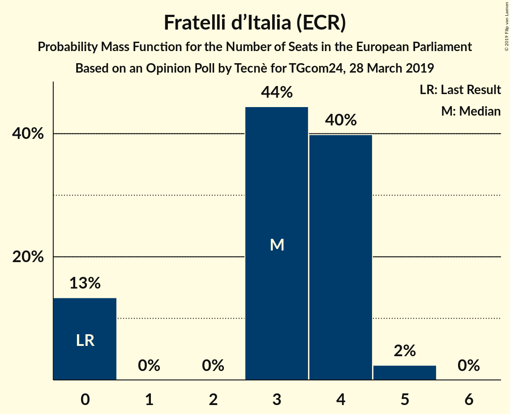

# Opinion Poll by Tecnè for TGcom24, 28 March 2019

<a href="#voting-intentions">Voting Intentions</a> | <a href="#seats">Seats</a> | <a href="#coalitions">Coalitions</a> | <a href="#technical-information">Technical Information</a>

## Voting Intentions

### Confidence Intervals

| Party | Last Result | Poll Result | 80% Confidence Interval | 90% Confidence Interval | 95% Confidence Interval | 99% Confidence Interval |
|:-----:|:-----------:|:-----------:|:-----------------------:|:-----------------------:|:-----------------------:|:-----------------------:|
| Lega Nord (ENF) | 6.2% | 32.0% | 30.2–34.0% |29.7–34.5% |29.2–35.0% |28.3–35.9% |
| Movimento 5 Stelle (EFDD) | 21.2% | 21.0% | 19.4–22.7% |18.9–23.2% |18.5–23.6% |17.8–24.4% |
| Partito Democratico (S&D) | 40.8% | 20.2% | 18.6–21.9% |18.2–22.3% |17.8–22.8% |17.1–23.6% |
| Forza Italia (EPP) | 16.8% | 11.8% | 10.6–13.2% |10.2–13.6% |9.9–13.9% |9.4–14.6% |
| Fratelli d’Italia (ECR) | 3.7% | 4.7% | 3.9–5.7% |3.7–5.9% |3.5–6.2% |3.2–6.7% |

*Note:* The poll result column reflects the actual value used in the calculations. Published results may vary slightly, and in addition be rounded to fewer digits.

## Seats

### Confidence Intervals

| Party | Last Result | Median | 80% Confidence Interval | 90% Confidence Interval | 95% Confidence Interval | 99% Confidence Interval |
|:-----:|:-----------:|:------:|:-----------------------:|:-----------------------:|:-----------------------:|:-----------------------:|
| <a href="#lega-nord-(enf)">Lega Nord (ENF)</a> | 5 | 27 | 27–28 |23–28 |21–28 |21–28 |
| <a href="#movimento-5-stelle-(efdd)">Movimento 5 Stelle (EFDD)</a> | 17 | 17 | 16–17 |16–19 |16–19 |13–19 |
| <a href="#partito-democratico-(s&d)">Partito Democratico (S&D)</a> | 31 | 13 | 13 |13–14 |12–15 |11–16 |
| <a href="#forza-italia-(epp)">Forza Italia (EPP)</a> | 13 | 10 | 9–10 |9–10 |9–11 |8–12 |
| <a href="#fratelli-d’italia-(ecr)">Fratelli d’Italia (ECR)</a> | 0 | 0 | 0 |0–4 |0–4 |0–5 |

### Lega Nord (ENF)

*For a full overview of the results for this party, see the [Lega Nord (ENF)](party-leganordenf.html) page.*

| Number of Seats | Probability | Accumulated | Special Marks |
|:---------------:|:-----------:|:-----------:|:-------------:|
| 5 | 0% | 100% | Last Result |
| 6 | 0% | 100% |  |
| 7 | 0% | 100% |  |
| 8 | 0% | 100% |  |
| 9 | 0% | 100% |  |
| 10 | 0% | 100% |  |
| 11 | 0% | 100% |  |
| 12 | 0% | 100% |  |
| 13 | 0% | 100% |  |
| 14 | 0% | 100% |  |
| 15 | 0% | 100% |  |
| 16 | 0% | 100% |  |
| 17 | 0% | 100% |  |
| 18 | 0% | 100% |  |
| 19 | 0% | 100% |  |
| 20 | 0.1% | 100% |  |
| 21 | 3% | 99.9% |  |
| 22 | 2% | 97% |  |
| 23 | 1.1% | 96% |  |
| 24 | 0.2% | 94% |  |
| 25 | 0.4% | 94% |  |
| 26 | 2% | 94% |  |
| 27 | 72% | 92% | Median |
| 28 | 20% | 20% |  |
| 29 | 0% | 0% |  |

### Movimento 5 Stelle (EFDD)

*For a full overview of the results for this party, see the [Movimento 5 Stelle (EFDD)](party-movimento5stelleefdd.html) page.*

| Number of Seats | Probability | Accumulated | Special Marks |
|:---------------:|:-----------:|:-----------:|:-------------:|
| 12 | 0.3% | 100% |  |
| 13 | 0.4% | 99.7% |  |
| 14 | 0% | 99.3% |  |
| 15 | 0.2% | 99.3% |  |
| 16 | 46% | 99.1% |  |
| 17 | 48% | 53% | Last Result, Median |
| 18 | 0.3% | 5% |  |
| 19 | 5% | 5% |  |
| 20 | 0.1% | 0.1% |  |
| 21 | 0% | 0% |  |

### Partito Democratico (S&D)

*For a full overview of the results for this party, see the [Partito Democratico (S&D)](party-partitodemocraticosd.html) page.*

| Number of Seats | Probability | Accumulated | Special Marks |
|:---------------:|:-----------:|:-----------:|:-------------:|
| 11 | 0.8% | 100% |  |
| 12 | 2% | 99.2% |  |
| 13 | 90% | 97% | Median |
| 14 | 4% | 7% |  |
| 15 | 2% | 3% |  |
| 16 | 0.3% | 0.6% |  |
| 17 | 0.1% | 0.4% |  |
| 18 | 0.3% | 0.3% |  |
| 19 | 0% | 0% |  |
| 20 | 0% | 0% |  |
| 21 | 0% | 0% |  |
| 22 | 0% | 0% |  |
| 23 | 0% | 0% |  |
| 24 | 0% | 0% |  |
| 25 | 0% | 0% |  |
| 26 | 0% | 0% |  |
| 27 | 0% | 0% |  |
| 28 | 0% | 0% |  |
| 29 | 0% | 0% |  |
| 30 | 0% | 0% |  |
| 31 | 0% | 0% | Last Result |

### Forza Italia (EPP)

*For a full overview of the results for this party, see the [Forza Italia (EPP)](party-forzaitaliaepp.html) page.*

| Number of Seats | Probability | Accumulated | Special Marks |
|:---------------:|:-----------:|:-----------:|:-------------:|
| 7 | 0.2% | 100% |  |
| 8 | 2% | 99.8% |  |
| 9 | 10% | 98% |  |
| 10 | 84% | 87% | Median |
| 11 | 2% | 3% |  |
| 12 | 0.6% | 0.6% |  |
| 13 | 0% | 0% | Last Result |

### Fratelli d’Italia (ECR)

*For a full overview of the results for this party, see the [Fratelli d’Italia (ECR)](party-fratellid’italiaecr.html) page.*

| Number of Seats | Probability | Accumulated | Special Marks |
|:---------------:|:-----------:|:-----------:|:-------------:|
| 0 | 93% | 100% | Last Result, Median |
| 1 | 0% | 7% |  |
| 2 | 0% | 7% |  |
| 3 | 0.7% | 7% |  |
| 4 | 5% | 6% |  |
| 5 | 1.0% | 1.1% |  |
| 6 | 0.1% | 0.1% |  |
| 7 | 0% | 0% |  |

## Coalitions

### Confidence Intervals

| Coalition | Last Result | Median | Majority? | 80% Confidence Interval | 90% Confidence Interval | 95% Confidence Interval | 99% Confidence Interval |
|:---------:|:-----------:|:------:|:---------:|:-----------------------:|:-----------------------:|:-----------------------:|:-----------------------:|
| Lega Nord (ENF) | 5 | 27 | 0% | 27–28 | 23–28 | 21–28 | 21–28 |
| Movimento 5 Stelle (EFDD) | 17 | 17 | 0% | 16–17 | 16–19 | 16–19 | 13–19 |
| Fratelli d’Italia (ECR) | 0 | 0 | 0% | 0 | 0–4 | 0–4 | 0–5 |

### Lega Nord (ENF)

| Number of Seats | Probability | Accumulated | Special Marks |
|:---------------:|:-----------:|:-----------:|:-------------:|
| 5 | 0% | 100% | Last Result |
| 6 | 0% | 100% |  |
| 7 | 0% | 100% |  |
| 8 | 0% | 100% |  |
| 9 | 0% | 100% |  |
| 10 | 0% | 100% |  |
| 11 | 0% | 100% |  |
| 12 | 0% | 100% |  |
| 13 | 0% | 100% |  |
| 14 | 0% | 100% |  |
| 15 | 0% | 100% |  |
| 16 | 0% | 100% |  |
| 17 | 0% | 100% |  |
| 18 | 0% | 100% |  |
| 19 | 0% | 100% |  |
| 20 | 0.1% | 100% |  |
| 21 | 3% | 99.9% |  |
| 22 | 2% | 97% |  |
| 23 | 1.1% | 96% |  |
| 24 | 0.2% | 94% |  |
| 25 | 0.4% | 94% |  |
| 26 | 2% | 94% |  |
| 27 | 72% | 92% | Median |
| 28 | 20% | 20% |  |
| 29 | 0% | 0% |  |

### Movimento 5 Stelle (EFDD)

| Number of Seats | Probability | Accumulated | Special Marks |
|:---------------:|:-----------:|:-----------:|:-------------:|
| 12 | 0.3% | 100% |  |
| 13 | 0.4% | 99.7% |  |
| 14 | 0% | 99.3% |  |
| 15 | 0.2% | 99.3% |  |
| 16 | 46% | 99.1% |  |
| 17 | 48% | 53% | Last Result, Median |
| 18 | 0.3% | 5% |  |
| 19 | 5% | 5% |  |
| 20 | 0.1% | 0.1% |  |
| 21 | 0% | 0% |  |

### Fratelli d’Italia (ECR)

| Number of Seats | Probability | Accumulated | Special Marks |
|:---------------:|:-----------:|:-----------:|:-------------:|
| 0 | 93% | 100% | Last Result, Median |
| 1 | 0% | 7% |  |
| 2 | 0% | 7% |  |
| 3 | 0.7% | 7% |  |
| 4 | 5% | 6% |  |
| 5 | 1.0% | 1.1% |  |
| 6 | 0.1% | 0.1% |  |
| 7 | 0% | 0% |  |

## Technical Information

### Opinion Poll

+ **Polling firm:** Tecnè
+ **Commissioner(s):** TGcom24
+ **Fieldwork period:** 28 March 2019

### Calculations

+ **Sample size:** 1002
+ **Simulations done:** 1,024
+ **Error estimate:** 2.07%

