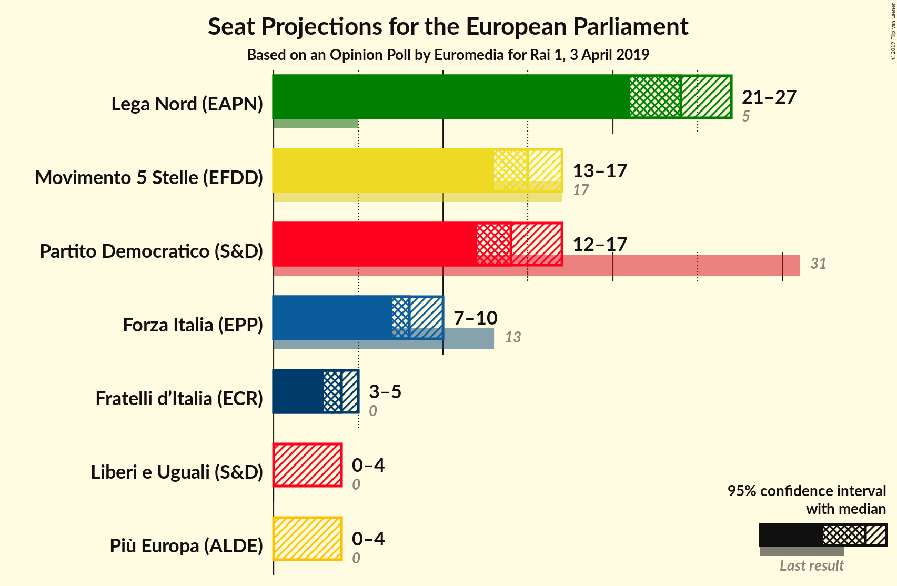
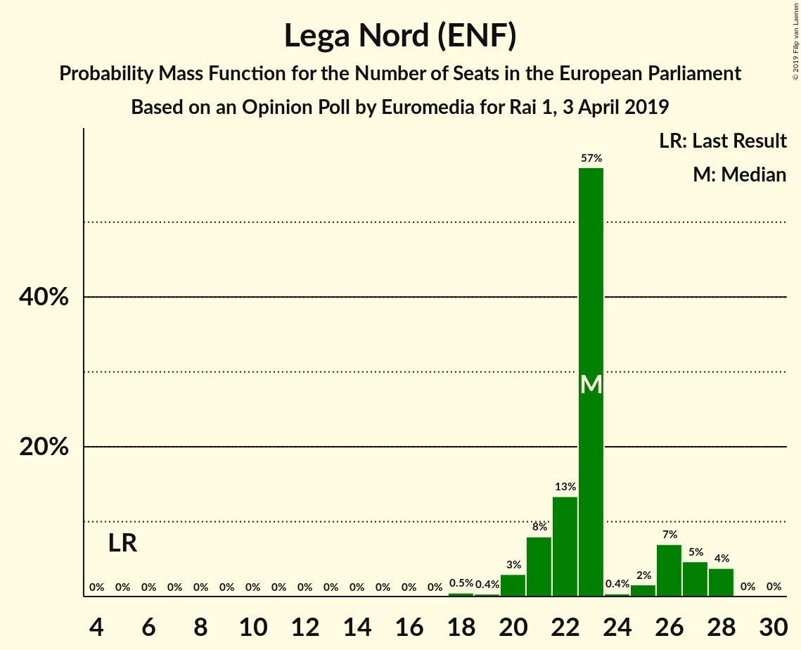
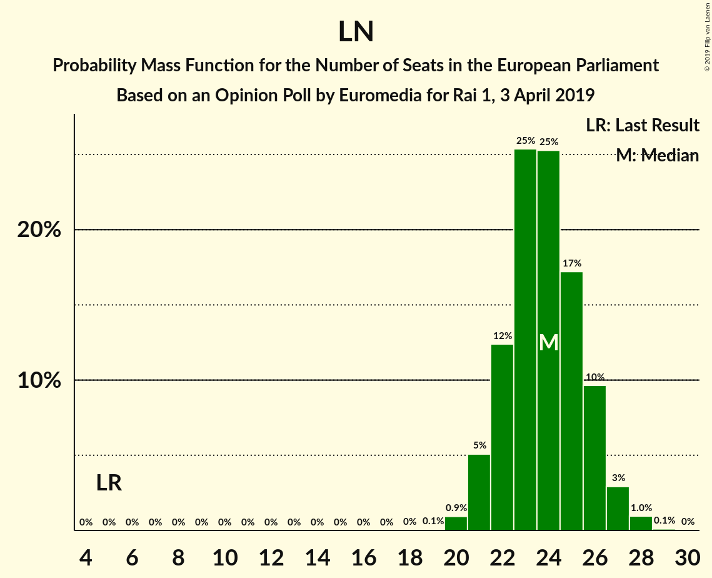
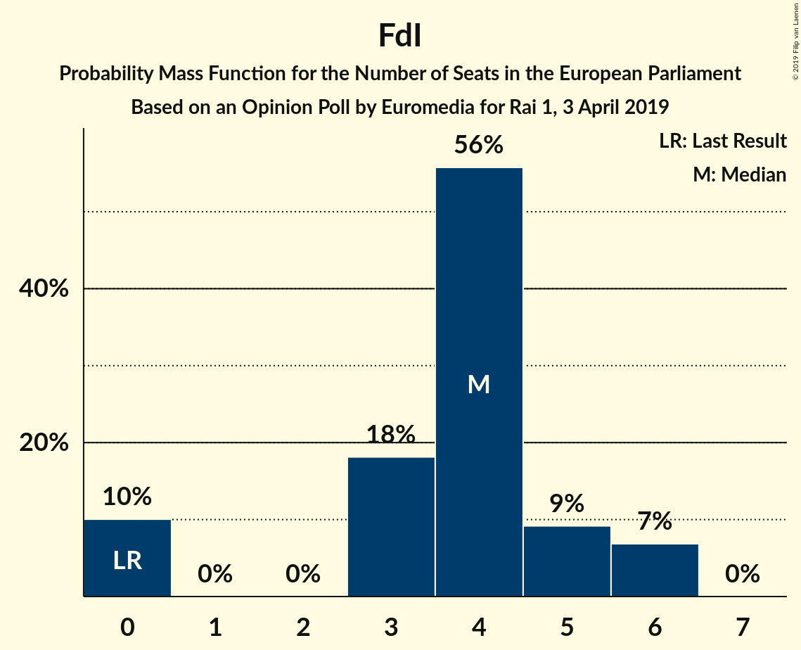
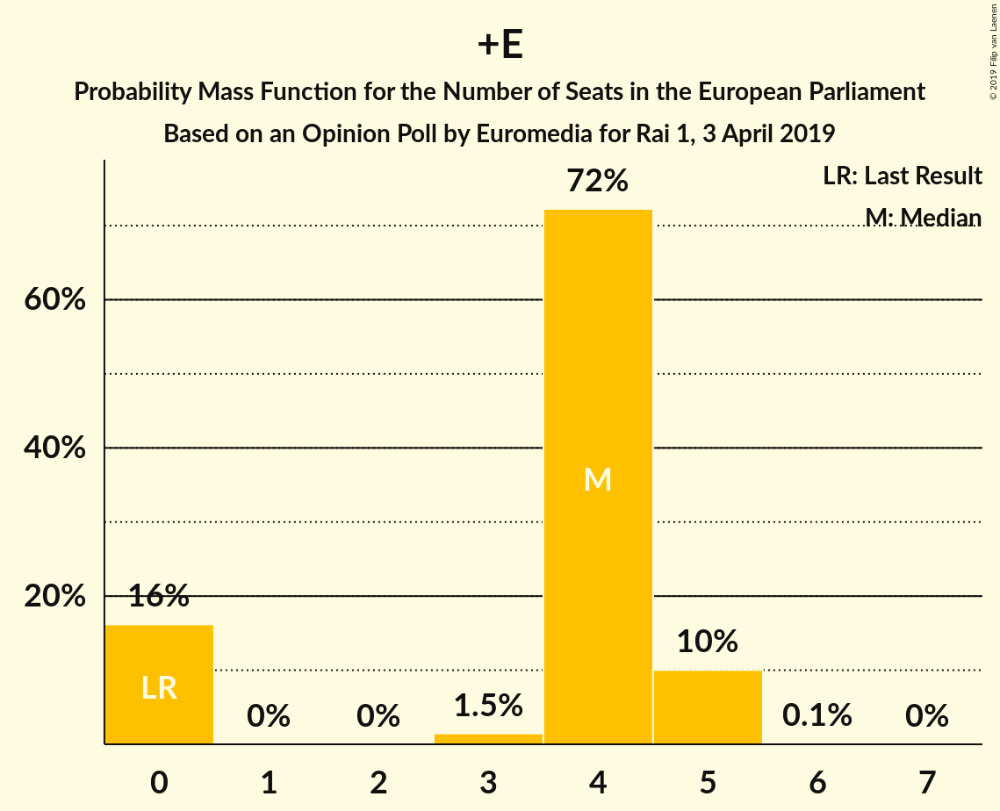

# Opinion Poll by Euromedia for Rai 1, 3 April 2019

<a href="#voting-intentions">Voting Intentions</a> | <a href="#seats">Seats</a> | <a href="#coalitions">Coalitions</a> | <a href="#technical-information">Technical Information</a>

## Voting Intentions

### Confidence Intervals

| Party | Last Result | Poll Result | 80% Confidence Interval | 90% Confidence Interval | 95% Confidence Interval | 99% Confidence Interval |
|:-----:|:-----------:|:-----------:|:-----------------------:|:-----------------------:|:-----------------------:|:-----------------------:|
| Lega Nord (ENF) | 6.2% | 31.4% | 29.3–33.5% |28.7–34.2% |28.2–34.7% |27.3–35.7% |
| Partito Democratico (S&D) | 40.8% | 20.1% | 18.4–22.0% |17.9–22.6% |17.5–23.1% |16.7–24.0% |
| Movimento 5 Stelle (EFDD) | 21.2% | 19.4% | 17.7–21.3% |17.2–21.8% |16.8–22.3% |16.0–23.2% |
| Forza Italia (EPP) | 16.8% | 11.1% | 9.8–12.7% |9.4–13.1% |9.1–13.5% |8.5–14.3% |
| Fratelli d’Italia (ECR) | 3.7% | 5.4% | 4.5–6.5% |4.2–6.9% |4.0–7.2% |3.6–7.8% |
| Liberi e Uguali (S&D) | 0.0% | 3.9% | 3.1–4.9% |2.9–5.2% |2.7–5.5% |2.4–6.0% |
| Più Europa (ALDE) | 0.0% | 3.8% | 3.0–4.8% |2.8–5.1% |2.6–5.3% |2.3–5.8% |

*Note:* The poll result column reflects the actual value used in the calculations. Published results may vary slightly, and in addition be rounded to fewer digits.

## Seats

### Confidence Intervals

| Party | Last Result | Median | 80% Confidence Interval | 90% Confidence Interval | 95% Confidence Interval | 99% Confidence Interval |
|:-----:|:-----------:|:------:|:-----------------------:|:-----------------------:|:-----------------------:|:-----------------------:|
| <a href="#lega-nord-(enf)">Lega Nord (ENF)</a> | 5 | 23 | 21–26 |21–27 |20–28 |19–28 |
| <a href="#partito-democratico-(s&d)">Partito Democratico (S&D)</a> | 31 | 11 | 11–16 |10–16 |10–16 |10–17 |
| <a href="#movimento-5-stelle-(efdd)">Movimento 5 Stelle (EFDD)</a> | 17 | 14 | 13–16 |13–16 |13–17 |13–18 |
| <a href="#forza-italia-(epp)">Forza Italia (EPP)</a> | 13 | 9 | 8–9 |7–10 |6–10 |6–12 |
| <a href="#fratelli-d’italia-(ecr)">Fratelli d’Italia (ECR)</a> | 0 | 4 | 0–5 |0–6 |0–6 |0–6 |
| <a href="#liberi-e-uguali-(s&d)">Liberi e Uguali (S&D)</a> | 0 | 4 | 0–4 |0–4 |0–5 |0–5 |
| <a href="#più-europa-(alde)">Più Europa (ALDE)</a> | 0 | 4 | 0–5 |0–5 |0–5 |0–5 |

### Lega Nord (ENF)

*For a full overview of the results for this party, see the [Lega Nord (ENF)](party-leganordenf.html) page.*

| Number of Seats | Probability | Accumulated | Special Marks |
|:---------------:|:-----------:|:-----------:|:-------------:|
| 5 | 0% | 100% | Last Result |
| 6 | 0% | 100% |  |
| 7 | 0% | 100% |  |
| 8 | 0% | 100% |  |
| 9 | 0% | 100% |  |
| 10 | 0% | 100% |  |
| 11 | 0% | 100% |  |
| 12 | 0% | 100% |  |
| 13 | 0% | 100% |  |
| 14 | 0% | 100% |  |
| 15 | 0% | 100% |  |
| 16 | 0% | 100% |  |
| 17 | 0% | 100% |  |
| 18 | 0.5% | 100% |  |
| 19 | 0.4% | 99.5% |  |
| 20 | 3% | 99.1% |  |
| 21 | 8% | 96% |  |
| 22 | 13% | 88% |  |
| 23 | 57% | 75% | Median |
| 24 | 0.4% | 17% |  |
| 25 | 2% | 17% |  |
| 26 | 7% | 16% |  |
| 27 | 5% | 9% |  |
| 28 | 4% | 4% |  |
| 29 | 0% | 0.1% |  |
| 30 | 0% | 0% |  |

### Partito Democratico (S&D)

*For a full overview of the results for this party, see the [Partito Democratico (S&D)](party-partitodemocraticosd.html) page.*

| Number of Seats | Probability | Accumulated | Special Marks |
|:---------------:|:-----------:|:-----------:|:-------------:|
| 10 | 9% | 100% |  |
| 11 | 57% | 91% | Median |
| 12 | 1.1% | 34% |  |
| 13 | 11% | 33% |  |
| 14 | 5% | 22% |  |
| 15 | 7% | 17% |  |
| 16 | 9% | 10% |  |
| 17 | 0.5% | 1.0% |  |
| 18 | 0.1% | 0.5% |  |
| 19 | 0.4% | 0.4% |  |
| 20 | 0% | 0% |  |
| 21 | 0% | 0% |  |
| 22 | 0% | 0% |  |
| 23 | 0% | 0% |  |
| 24 | 0% | 0% |  |
| 25 | 0% | 0% |  |
| 26 | 0% | 0% |  |
| 27 | 0% | 0% |  |
| 28 | 0% | 0% |  |
| 29 | 0% | 0% |  |
| 30 | 0% | 0% |  |
| 31 | 0% | 0% | Last Result |

### Movimento 5 Stelle (EFDD)

*For a full overview of the results for this party, see the [Movimento 5 Stelle (EFDD)](party-movimento5stelleefdd.html) page.*

| Number of Seats | Probability | Accumulated | Special Marks |
|:---------------:|:-----------:|:-----------:|:-------------:|
| 11 | 0.2% | 100% |  |
| 12 | 0.3% | 99.8% |  |
| 13 | 18% | 99.5% |  |
| 14 | 54% | 82% | Median |
| 15 | 4% | 28% |  |
| 16 | 20% | 24% |  |
| 17 | 4% | 4% | Last Result |
| 18 | 0.2% | 0.6% |  |
| 19 | 0.4% | 0.4% |  |
| 20 | 0% | 0% |  |

### Forza Italia (EPP)

*For a full overview of the results for this party, see the [Forza Italia (EPP)](party-forzaitaliaepp.html) page.*

| Number of Seats | Probability | Accumulated | Special Marks |
|:---------------:|:-----------:|:-----------:|:-------------:|
| 6 | 5% | 100% |  |
| 7 | 0.5% | 95% |  |
| 8 | 21% | 95% |  |
| 9 | 67% | 74% | Median |
| 10 | 6% | 7% |  |
| 11 | 1.2% | 2% |  |
| 12 | 0.5% | 0.5% |  |
| 13 | 0% | 0% | Last Result |

### Fratelli d’Italia (ECR)

*For a full overview of the results for this party, see the [Fratelli d’Italia (ECR)](party-fratellid’italiaecr.html) page.*

| Number of Seats | Probability | Accumulated | Special Marks |
|:---------------:|:-----------:|:-----------:|:-------------:|
| 0 | 10% | 100% | Last Result |
| 1 | 0% | 90% |  |
| 2 | 0% | 90% |  |
| 3 | 18% | 90% |  |
| 4 | 56% | 72% | Median |
| 5 | 9% | 16% |  |
| 6 | 7% | 7% |  |
| 7 | 0% | 0% |  |

### Liberi e Uguali (S&D)

*For a full overview of the results for this party, see the [Liberi e Uguali (S&D)](party-liberieugualisd.html) page.*

| Number of Seats | Probability | Accumulated | Special Marks |
|:---------------:|:-----------:|:-----------:|:-------------:|
| 0 | 19% | 100% | Last Result |
| 1 | 0% | 81% |  |
| 2 | 0% | 81% |  |
| 3 | 16% | 81% |  |
| 4 | 61% | 65% | Median |
| 5 | 4% | 4% |  |
| 6 | 0% | 0% |  |

### Più Europa (ALDE)

*For a full overview of the results for this party, see the [Più Europa (ALDE)](party-piùeuropaalde.html) page.*

| Number of Seats | Probability | Accumulated | Special Marks |
|:---------------:|:-----------:|:-----------:|:-------------:|
| 0 | 16% | 100% | Last Result |
| 1 | 0% | 84% |  |
| 2 | 0% | 84% |  |
| 3 | 1.5% | 84% |  |
| 4 | 72% | 82% | Median |
| 5 | 10% | 10% |  |
| 6 | 0.1% | 0.1% |  |
| 7 | 0% | 0% |  |

## Coalitions

### Confidence Intervals

| Coalition | Last Result | Median | Majority? | 80% Confidence Interval | 90% Confidence Interval | 95% Confidence Interval | 99% Confidence Interval |
|:---------:|:-----------:|:------:|:---------:|:-----------------------:|:-----------------------:|:-----------------------:|:-----------------------:|
| Lega Nord (ENF) | 5 | 23 | 0% | 21–26 | 21–27 | 20–28 | 19–28 |
| Partito Democratico (S&D) – Liberi e Uguali (S&D) | 31 | 15 | 0% | 13–19 | 13–19 | 13–20 | 12–20 |
| Movimento 5 Stelle (EFDD) | 17 | 14 | 0% | 13–16 | 13–16 | 13–17 | 13–18 |
| Fratelli d’Italia (ECR) | 0 | 4 | 0% | 0–5 | 0–6 | 0–6 | 0–6 |
| Più Europa (ALDE) | 0 | 4 | 0% | 0–5 | 0–5 | 0–5 | 0–5 |

### Lega Nord (ENF)

| Number of Seats | Probability | Accumulated | Special Marks |
|:---------------:|:-----------:|:-----------:|:-------------:|
| 5 | 0% | 100% | Last Result |
| 6 | 0% | 100% |  |
| 7 | 0% | 100% |  |
| 8 | 0% | 100% |  |
| 9 | 0% | 100% |  |
| 10 | 0% | 100% |  |
| 11 | 0% | 100% |  |
| 12 | 0% | 100% |  |
| 13 | 0% | 100% |  |
| 14 | 0% | 100% |  |
| 15 | 0% | 100% |  |
| 16 | 0% | 100% |  |
| 17 | 0% | 100% |  |
| 18 | 0.5% | 100% |  |
| 19 | 0.4% | 99.5% |  |
| 20 | 3% | 99.1% |  |
| 21 | 8% | 96% |  |
| 22 | 13% | 88% |  |
| 23 | 57% | 75% | Median |
| 24 | 0.4% | 17% |  |
| 25 | 2% | 17% |  |
| 26 | 7% | 16% |  |
| 27 | 5% | 9% |  |
| 28 | 4% | 4% |  |
| 29 | 0% | 0.1% |  |
| 30 | 0% | 0% |  |

### Partito Democratico (S&D) – Liberi e Uguali (S&D)

| Number of Seats | Probability | Accumulated | Special Marks |
|:---------------:|:-----------:|:-----------:|:-------------:|
| 12 | 0.7% | 100% |  |
| 13 | 19% | 99.3% |  |
| 14 | 4% | 80% |  |
| 15 | 58% | 76% | Median |
| 16 | 3% | 18% |  |
| 17 | 1.0% | 16% |  |
| 18 | 0.4% | 15% |  |
| 19 | 10% | 14% |  |
| 20 | 5% | 5% |  |
| 21 | 0.2% | 0.2% |  |
| 22 | 0% | 0% |  |
| 23 | 0% | 0% |  |
| 24 | 0% | 0% |  |
| 25 | 0% | 0% |  |
| 26 | 0% | 0% |  |
| 27 | 0% | 0% |  |
| 28 | 0% | 0% |  |
| 29 | 0% | 0% |  |
| 30 | 0% | 0% |  |
| 31 | 0% | 0% | Last Result |

### Movimento 5 Stelle (EFDD)

| Number of Seats | Probability | Accumulated | Special Marks |
|:---------------:|:-----------:|:-----------:|:-------------:|
| 11 | 0.2% | 100% |  |
| 12 | 0.3% | 99.8% |  |
| 13 | 18% | 99.5% |  |
| 14 | 54% | 82% | Median |
| 15 | 4% | 28% |  |
| 16 | 20% | 24% |  |
| 17 | 4% | 4% | Last Result |
| 18 | 0.2% | 0.6% |  |
| 19 | 0.4% | 0.4% |  |
| 20 | 0% | 0% |  |

### Fratelli d’Italia (ECR)

| Number of Seats | Probability | Accumulated | Special Marks |
|:---------------:|:-----------:|:-----------:|:-------------:|
| 0 | 10% | 100% | Last Result |
| 1 | 0% | 90% |  |
| 2 | 0% | 90% |  |
| 3 | 18% | 90% |  |
| 4 | 56% | 72% | Median |
| 5 | 9% | 16% |  |
| 6 | 7% | 7% |  |
| 7 | 0% | 0% |  |

### Più Europa (ALDE)

| Number of Seats | Probability | Accumulated | Special Marks |
|:---------------:|:-----------:|:-----------:|:-------------:|
| 0 | 16% | 100% | Last Result |
| 1 | 0% | 84% |  |
| 2 | 0% | 84% |  |
| 3 | 1.5% | 84% |  |
| 4 | 72% | 82% | Median |
| 5 | 10% | 10% |  |
| 6 | 0.1% | 0.1% |  |
| 7 | 0% | 0% |  |

## Technical Information

### Opinion Poll

+ **Polling firm:** Euromedia
+ **Commissioner(s):** Rai 1
+ **Fieldwork period:** 3 April 2019

### Calculations

+ **Sample size:** 800
+ **Simulations done:** 1,024
+ **Error estimate:** 2.93%

