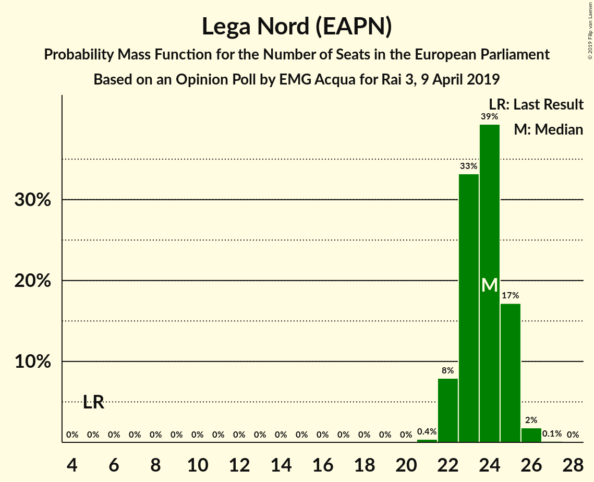
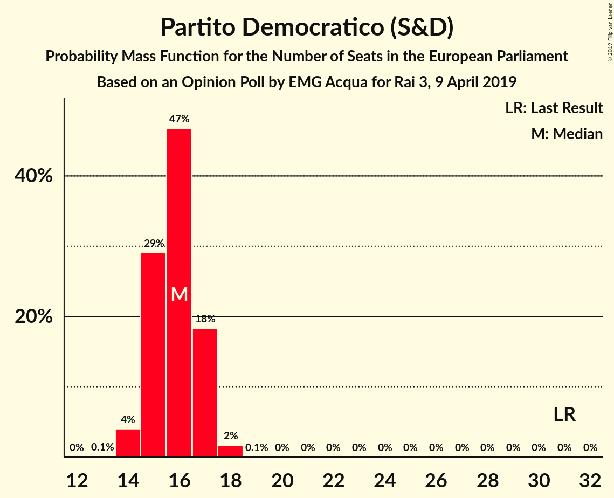
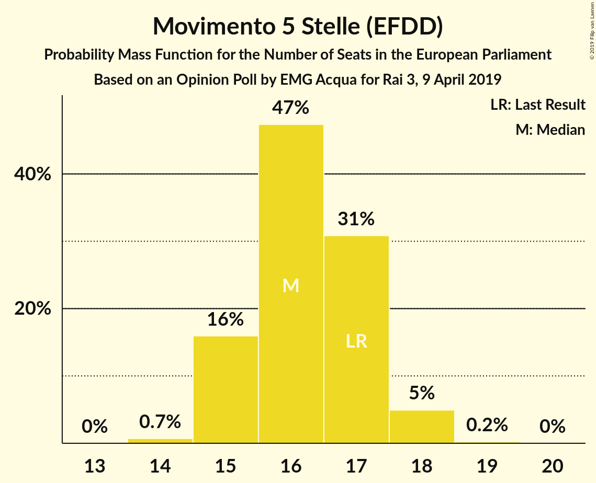
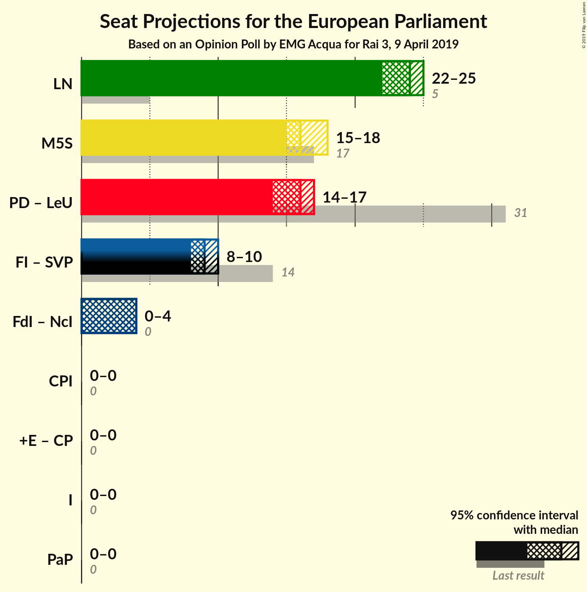
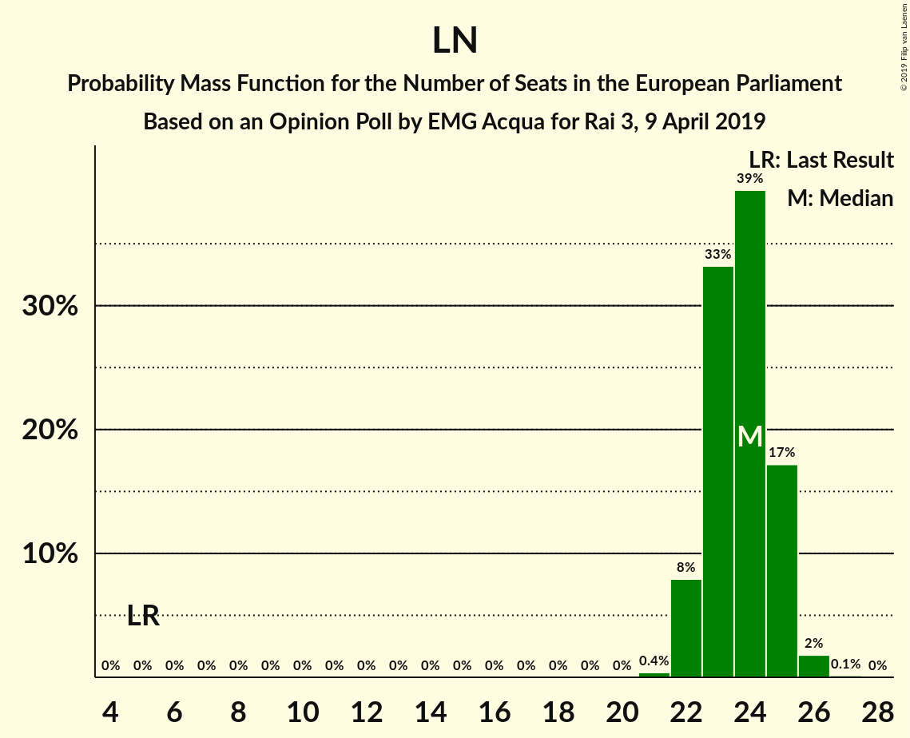
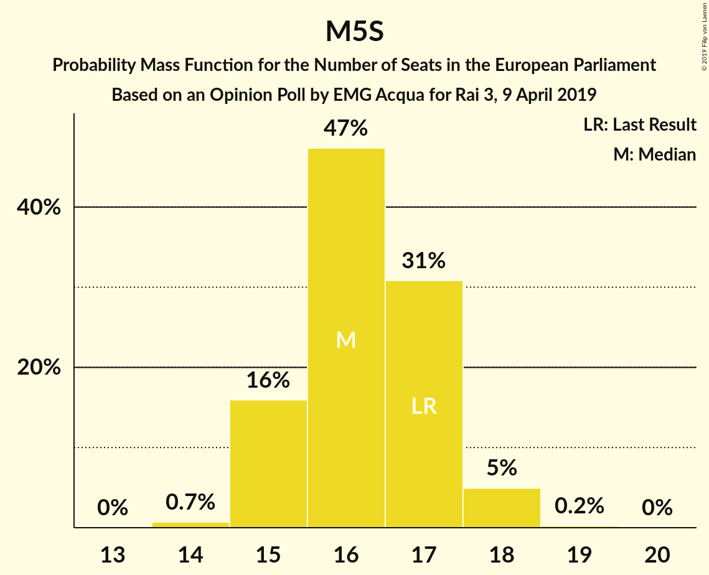

# Opinion Poll by EMG Acqua for Rai 3, 9 April 2019

<a href="#voting-intentions">Voting Intentions</a> | <a href="#seats">Seats</a> | <a href="#coalitions">Coalitions</a> | <a href="#technical-information">Technical Information</a>

## Voting Intentions

### Confidence Intervals

| Party | Last Result | Poll Result | 80% Confidence Interval | 90% Confidence Interval | 95% Confidence Interval | 99% Confidence Interval |
|:-----:|:-----------:|:-----------:|:-----------------------:|:-----------------------:|:-----------------------:|:-----------------------:|
| Lega Nord (EAPN) | 6.2% | 31.4% | 30.0–32.8% |29.6–33.2% |29.3–33.5% |28.7–34.2% |
| Partito Democratico (S&D) | 40.8% | 22.3% | 21.1–23.6% |20.7–23.9% |20.4–24.2% |19.9–24.9% |
| Movimento 5 Stelle (EFDD) | 21.2% | 21.5% | 20.3–22.8% |20.0–23.2% |19.7–23.5% |19.1–24.1% |
| Forza Italia (EPP) | 16.8% | 10.1% | 9.2–11.0% |9.0–11.3% |8.8–11.6% |8.4–12.0% |
| Fratelli d’Italia (ECR) | 3.7% | 4.8% | 4.2–5.5% |4.1–5.7% |3.9–5.9% |3.7–6.3% |
| Più Europa (ALDE) | 0.0% | 2.9% | 2.5–3.5% |2.3–3.7% |2.2–3.8% |2.0–4.1% |
| Noi con l’Italia (ECR) | 0.0% | 0.5% | 0.3–0.8% |0.3–0.9% |0.3–0.9% |0.2–1.1% |

*Note:* The poll result column reflects the actual value used in the calculations. Published results may vary slightly, and in addition be rounded to fewer digits.

## Seats

### Confidence Intervals

| Party | Last Result | Median | 80% Confidence Interval | 90% Confidence Interval | 95% Confidence Interval | 99% Confidence Interval |
|:-----:|:-----------:|:------:|:-----------------------:|:-----------------------:|:-----------------------:|:-----------------------:|
| <a href="#lega-nord-(eapn)">Lega Nord (EAPN)</a> | 5 | 24 | 22–25 |22–25 |22–26 |22–26 |
| <a href="#partito-democratico-(s&d)">Partito Democratico (S&D)</a> | 31 | 16 | 15–17 |15–17 |14–17 |14–18 |
| <a href="#movimento-5-stelle-(efdd)">Movimento 5 Stelle (EFDD)</a> | 17 | 16 | 15–17 |15–18 |15–18 |14–18 |
| <a href="#forza-italia-(epp)">Forza Italia (EPP)</a> | 13 | 8 | 7–8 |7–9 |7–9 |6–9 |
| <a href="#fratelli-d’italia-(ecr)">Fratelli d’Italia (ECR)</a> | 0 | 4 | 3–4 |3–4 |0–4 |0–5 |
| <a href="#più-europa-(alde)">Più Europa (ALDE)</a> | 0 | 0 | 0 |0 |0 |0–3 |
| <a href="#noi-con-l’italia-(ecr)">Noi con l’Italia (ECR)</a> | 0 | 0 | 0 |0 |0 |0 |

### Lega Nord (EAPN)

*For a full overview of the results for this party, see the [Lega Nord (EAPN)](party-leganordeapn.html) page.*

| Number of Seats | Probability | Accumulated | Special Marks |
|:---------------:|:-----------:|:-----------:|:-------------:|
| 5 | 0% | 100% | Last Result |
| 6 | 0% | 100% |  |
| 7 | 0% | 100% |  |
| 8 | 0% | 100% |  |
| 9 | 0% | 100% |  |
| 10 | 0% | 100% |  |
| 11 | 0% | 100% |  |
| 12 | 0% | 100% |  |
| 13 | 0% | 100% |  |
| 14 | 0% | 100% |  |
| 15 | 0% | 100% |  |
| 16 | 0% | 100% |  |
| 17 | 0% | 100% |  |
| 18 | 0% | 100% |  |
| 19 | 0% | 100% |  |
| 20 | 0% | 100% |  |
| 21 | 0.4% | 100% |  |
| 22 | 12% | 99.6% |  |
| 23 | 29% | 88% |  |
| 24 | 39% | 58% | Median |
| 25 | 17% | 19% |  |
| 26 | 2% | 3% |  |
| 27 | 0.2% | 0.2% |  |
| 28 | 0% | 0% |  |

### Partito Democratico (S&D)

*For a full overview of the results for this party, see the [Partito Democratico (S&D)](party-partitodemocraticosd.html) page.*

| Number of Seats | Probability | Accumulated | Special Marks |
|:---------------:|:-----------:|:-----------:|:-------------:|
| 14 | 5% | 100% |  |
| 15 | 34% | 95% |  |
| 16 | 37% | 62% | Median |
| 17 | 22% | 24% |  |
| 18 | 2% | 2% |  |
| 19 | 0% | 0% |  |
| 20 | 0% | 0% |  |
| 21 | 0% | 0% |  |
| 22 | 0% | 0% |  |
| 23 | 0% | 0% |  |
| 24 | 0% | 0% |  |
| 25 | 0% | 0% |  |
| 26 | 0% | 0% |  |
| 27 | 0% | 0% |  |
| 28 | 0% | 0% |  |
| 29 | 0% | 0% |  |
| 30 | 0% | 0% |  |
| 31 | 0% | 0% | Last Result |

### Movimento 5 Stelle (EFDD)

*For a full overview of the results for this party, see the [Movimento 5 Stelle (EFDD)](party-movimento5stelleefdd.html) page.*

| Number of Seats | Probability | Accumulated | Special Marks |
|:---------------:|:-----------:|:-----------:|:-------------:|
| 14 | 0.7% | 100% |  |
| 15 | 18% | 99.3% |  |
| 16 | 44% | 81% | Median |
| 17 | 30% | 38% | Last Result |
| 18 | 7% | 7% |  |
| 19 | 0.2% | 0.2% |  |
| 20 | 0% | 0% |  |

### Forza Italia (EPP)

*For a full overview of the results for this party, see the [Forza Italia (EPP)](party-forzaitaliaepp.html) page.*

| Number of Seats | Probability | Accumulated | Special Marks |
|:---------------:|:-----------:|:-----------:|:-------------:|
| 6 | 1.1% | 100% |  |
| 7 | 40% | 98.9% |  |
| 8 | 54% | 59% | Median |
| 9 | 5% | 5% |  |
| 10 | 0.1% | 0.1% |  |
| 11 | 0% | 0% |  |
| 12 | 0% | 0% |  |
| 13 | 0% | 0% | Last Result |

### Fratelli d’Italia (ECR)

*For a full overview of the results for this party, see the [Fratelli d’Italia (ECR)](party-fratellid’italiaecr.html) page.*

| Number of Seats | Probability | Accumulated | Special Marks |
|:---------------:|:-----------:|:-----------:|:-------------:|
| 0 | 3% | 100% | Last Result |
| 1 | 0% | 97% |  |
| 2 | 0% | 97% |  |
| 3 | 31% | 97% |  |
| 4 | 64% | 66% | Median |
| 5 | 2% | 2% |  |
| 6 | 0% | 0% |  |

### Più Europa (ALDE)

*For a full overview of the results for this party, see the [Più Europa (ALDE)](party-piùeuropaalde.html) page.*

| Number of Seats | Probability | Accumulated | Special Marks |
|:---------------:|:-----------:|:-----------:|:-------------:|
| 0 | 98.5% | 100% | Last Result, Median |
| 1 | 0% | 1.5% |  |
| 2 | 0% | 1.5% |  |
| 3 | 1.4% | 1.5% |  |
| 4 | 0% | 0% |  |

### Noi con l’Italia (ECR)

*For a full overview of the results for this party, see the [Noi con l’Italia (ECR)](party-noiconl’italiaecr.html) page.*

| Number of Seats | Probability | Accumulated | Special Marks |
|:---------------:|:-----------:|:-----------:|:-------------:|
| 0 | 100% | 100% | Last Result, Median |

## Coalitions

### Confidence Intervals

| Coalition | Last Result | Median | Majority? | 80% Confidence Interval | 90% Confidence Interval | 95% Confidence Interval | 99% Confidence Interval |
|:---------:|:-----------:|:------:|:---------:|:-----------------------:|:-----------------------:|:-----------------------:|:-----------------------:|
| Lega Nord (EAPN) | 5 | 24 | 0% | 22–25 | 22–25 | 22–26 | 22–26 |
| Movimento 5 Stelle (EFDD) | 17 | 16 | 0% | 15–17 | 15–18 | 15–18 | 14–18 |
| Fratelli d’Italia (ECR) – Noi con l’Italia (ECR) | 0 | 4 | 0% | 3–4 | 3–4 | 0–4 | 0–5 |

### Lega Nord (EAPN)

| Number of Seats | Probability | Accumulated | Special Marks |
|:---------------:|:-----------:|:-----------:|:-------------:|
| 5 | 0% | 100% | Last Result |
| 6 | 0% | 100% |  |
| 7 | 0% | 100% |  |
| 8 | 0% | 100% |  |
| 9 | 0% | 100% |  |
| 10 | 0% | 100% |  |
| 11 | 0% | 100% |  |
| 12 | 0% | 100% |  |
| 13 | 0% | 100% |  |
| 14 | 0% | 100% |  |
| 15 | 0% | 100% |  |
| 16 | 0% | 100% |  |
| 17 | 0% | 100% |  |
| 18 | 0% | 100% |  |
| 19 | 0% | 100% |  |
| 20 | 0% | 100% |  |
| 21 | 0.4% | 100% |  |
| 22 | 12% | 99.6% |  |
| 23 | 29% | 88% |  |
| 24 | 39% | 58% | Median |
| 25 | 17% | 19% |  |
| 26 | 2% | 3% |  |
| 27 | 0.2% | 0.2% |  |
| 28 | 0% | 0% |  |

### Movimento 5 Stelle (EFDD)

| Number of Seats | Probability | Accumulated | Special Marks |
|:---------------:|:-----------:|:-----------:|:-------------:|
| 14 | 0.7% | 100% |  |
| 15 | 18% | 99.3% |  |
| 16 | 44% | 81% | Median |
| 17 | 30% | 38% | Last Result |
| 18 | 7% | 7% |  |
| 19 | 0.2% | 0.2% |  |
| 20 | 0% | 0% |  |

### Fratelli d’Italia (ECR) – Noi con l’Italia (ECR)

| Number of Seats | Probability | Accumulated | Special Marks |
|:---------------:|:-----------:|:-----------:|:-------------:|
| 0 | 3% | 100% | Last Result |
| 1 | 0% | 97% |  |
| 2 | 0% | 97% |  |
| 3 | 31% | 97% |  |
| 4 | 64% | 66% | Median |
| 5 | 2% | 2% |  |
| 6 | 0% | 0% |  |

## Technical Information

### Opinion Poll

+ **Polling firm:** EMG Acqua
+ **Commissioner(s):** Rai 3
+ **Fieldwork period:** 9 April 2019

### Calculations

+ **Sample size:** 1845
+ **Simulations done:** 131,072
+ **Error estimate:** 1.74%

