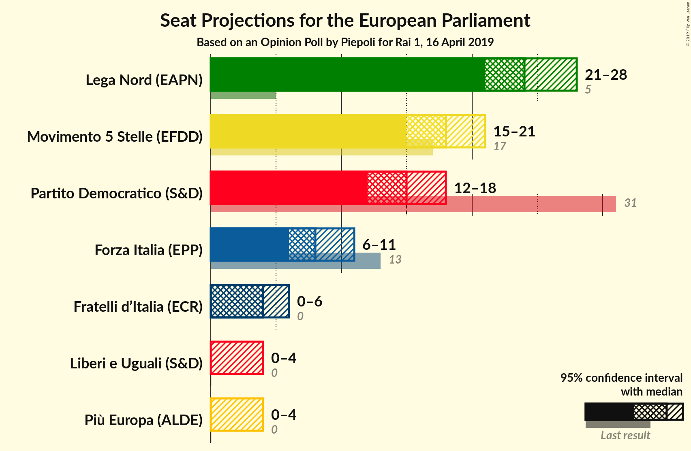
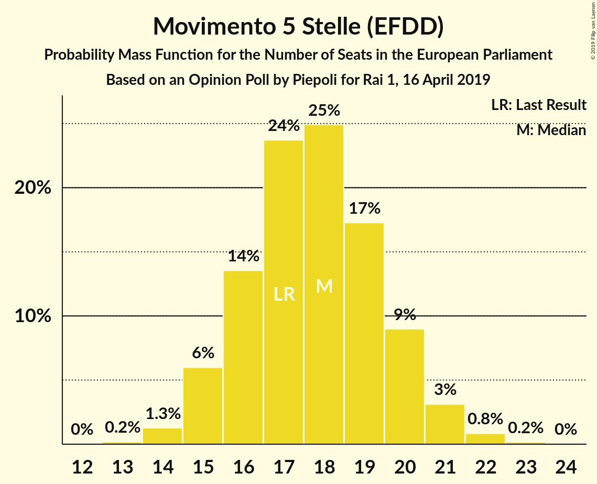
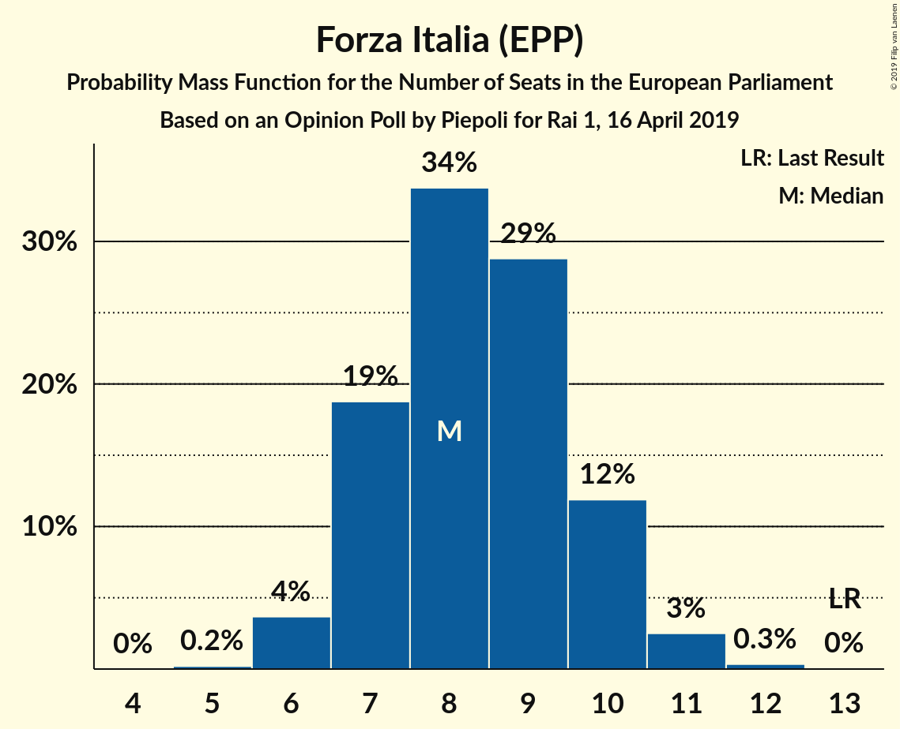
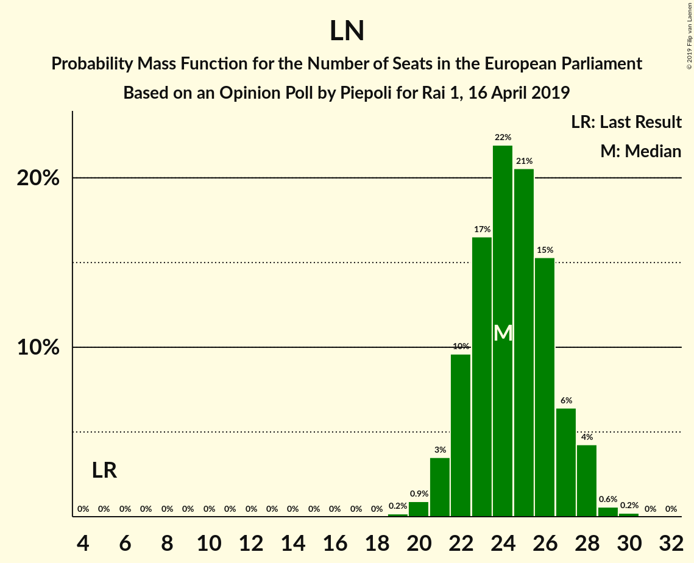
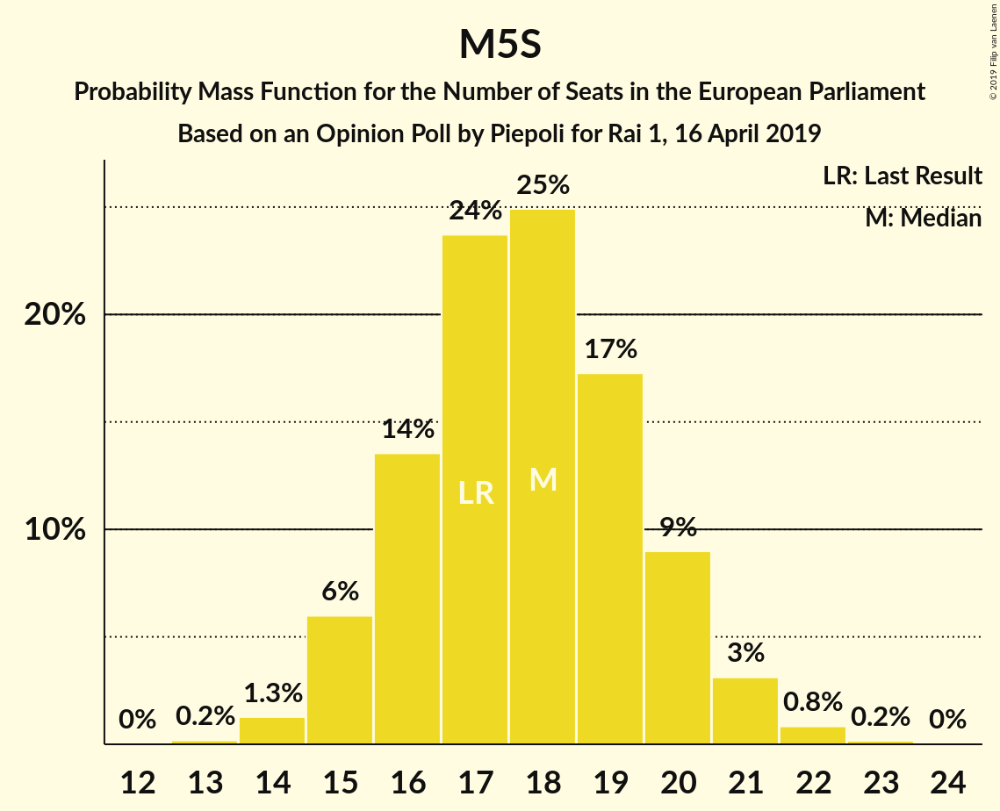

# Opinion Poll by Piepoli for Rai 1, 16 April 2019

<a href="#voting-intentions">Voting Intentions</a> | <a href="#seats">Seats</a> | <a href="#coalitions">Coalitions</a> | <a href="#technical-information">Technical Information</a>

## Voting Intentions

### Confidence Intervals

| Party | Last Result | Poll Result | 80% Confidence Interval | 90% Confidence Interval | 95% Confidence Interval | 99% Confidence Interval |
|:-----:|:-----------:|:-----------:|:-----------------------:|:-----------------------:|:-----------------------:|:-----------------------:|
| Lega Nord (EAPN) | 6.2% | 31.2% | 28.7–34.0% |27.9–34.7% |27.3–35.4% |26.1–36.7% |
| Movimento 5 Stelle (EFDD) | 21.2% | 22.7% | 20.4–25.2% |19.8–25.9% |19.2–26.5% |18.2–27.8% |
| Partito Democratico (S&D) | 40.8% | 20.7% | 18.5–23.1% |17.9–23.8% |17.4–24.4% |16.4–25.7% |
| Forza Italia (EPP) | 16.8% | 10.5% | 9.0–12.5% |8.5–13.0% |8.1–13.5% |7.4–14.5% |
| Fratelli d’Italia (ECR) | 3.7% | 5.6% | 4.5–7.1% |4.1–7.5% |3.9–7.9% |3.4–8.7% |
| Liberi e Uguali (S&D) | 0.0% | 3.6% | 2.7–4.9% |2.5–5.3% |2.3–5.6% |1.9–6.3% |
| Più Europa (ALDE) | 0.0% | 3.0% | 2.2–4.2% |2.0–4.6% |1.8–4.9% |1.5–5.5% |

*Note:* The poll result column reflects the actual value used in the calculations. Published results may vary slightly, and in addition be rounded to fewer digits.

## Seats

### Confidence Intervals

| Party | Last Result | Median | 80% Confidence Interval | 90% Confidence Interval | 95% Confidence Interval | 99% Confidence Interval |
|:-----:|:-----------:|:------:|:-----------------------:|:-----------------------:|:-----------------------:|:-----------------------:|
| <a href="#lega-nord-(eapn)">Lega Nord (EAPN)</a> | 5 | 26 | 24–26 |24–28 |23–28 |22–28 |
| <a href="#movimento-5-stelle-(efdd)">Movimento 5 Stelle (EFDD)</a> | 17 | 16 | 14–18 |14–20 |14–20 |14–20 |
| <a href="#partito-democratico-(s&d)">Partito Democratico (S&D)</a> | 31 | 14 | 13–16 |12–17 |12–17 |12–17 |
| <a href="#forza-italia-(epp)">Forza Italia (EPP)</a> | 13 | 7 | 6–8 |6–8 |5–11 |5–11 |
| <a href="#fratelli-d’italia-(ecr)">Fratelli d’Italia (ECR)</a> | 0 | 4 | 3–4 |0–5 |0–7 |0–7 |
| <a href="#liberi-e-uguali-(s&d)">Liberi e Uguali (S&D)</a> | 0 | 3 | 0–5 |0–5 |0–5 |0–6 |
| <a href="#più-europa-(alde)">Più Europa (ALDE)</a> | 0 | 4 | 0–5 |0–5 |0–5 |0–5 |

### Lega Nord (EAPN)

*For a full overview of the results for this party, see the [Lega Nord (EAPN)](party-leganordeapn.html) page.*

| Number of Seats | Probability | Accumulated | Special Marks |
|:---------------:|:-----------:|:-----------:|:-------------:|
| 5 | 0% | 100% | Last Result |
| 6 | 0% | 100% |  |
| 7 | 0% | 100% |  |
| 8 | 0% | 100% |  |
| 9 | 0% | 100% |  |
| 10 | 0% | 100% |  |
| 11 | 0% | 100% |  |
| 12 | 0% | 100% |  |
| 13 | 0% | 100% |  |
| 14 | 0% | 100% |  |
| 15 | 0% | 100% |  |
| 16 | 0% | 100% |  |
| 17 | 0% | 100% |  |
| 18 | 0% | 100% |  |
| 19 | 0% | 100% |  |
| 20 | 0% | 100% |  |
| 21 | 0% | 100% |  |
| 22 | 2% | 99.9% |  |
| 23 | 0.8% | 98% |  |
| 24 | 27% | 97% |  |
| 25 | 15% | 71% |  |
| 26 | 49% | 56% | Median |
| 27 | 0.7% | 7% |  |
| 28 | 6% | 6% |  |
| 29 | 0% | 0% |  |

### Movimento 5 Stelle (EFDD)

*For a full overview of the results for this party, see the [Movimento 5 Stelle (EFDD)](party-movimento5stelleefdd.html) page.*

| Number of Seats | Probability | Accumulated | Special Marks |
|:---------------:|:-----------:|:-----------:|:-------------:|
| 14 | 12% | 100% |  |
| 15 | 36% | 88% |  |
| 16 | 30% | 52% | Median |
| 17 | 6% | 22% | Last Result |
| 18 | 9% | 16% |  |
| 19 | 1.4% | 8% |  |
| 20 | 6% | 6% |  |
| 21 | 0% | 0% |  |

### Partito Democratico (S&D)

*For a full overview of the results for this party, see the [Partito Democratico (S&D)](party-partitodemocraticosd.html) page.*

| Number of Seats | Probability | Accumulated | Special Marks |
|:---------------:|:-----------:|:-----------:|:-------------:|
| 10 | 0% | 100% |  |
| 11 | 0% | 99.9% |  |
| 12 | 7% | 99.9% |  |
| 13 | 29% | 92% |  |
| 14 | 22% | 63% | Median |
| 15 | 1.2% | 42% |  |
| 16 | 32% | 40% |  |
| 17 | 8% | 9% |  |
| 18 | 0.1% | 0.3% |  |
| 19 | 0.1% | 0.2% |  |
| 20 | 0.1% | 0.1% |  |
| 21 | 0% | 0% |  |
| 22 | 0% | 0% |  |
| 23 | 0% | 0% |  |
| 24 | 0% | 0% |  |
| 25 | 0% | 0% |  |
| 26 | 0% | 0% |  |
| 27 | 0% | 0% |  |
| 28 | 0% | 0% |  |
| 29 | 0% | 0% |  |
| 30 | 0% | 0% |  |
| 31 | 0% | 0% | Last Result |

### Forza Italia (EPP)

*For a full overview of the results for this party, see the [Forza Italia (EPP)](party-forzaitaliaepp.html) page.*

| Number of Seats | Probability | Accumulated | Special Marks |
|:---------------:|:-----------:|:-----------:|:-------------:|
| 4 | 0.1% | 100% |  |
| 5 | 3% | 99.9% |  |
| 6 | 18% | 97% |  |
| 7 | 47% | 79% | Median |
| 8 | 28% | 32% |  |
| 9 | 0.4% | 4% |  |
| 10 | 0.5% | 3% |  |
| 11 | 2% | 3% |  |
| 12 | 0.3% | 0.4% |  |
| 13 | 0.1% | 0.1% | Last Result |
| 14 | 0% | 0% |  |

### Fratelli d’Italia (ECR)

*For a full overview of the results for this party, see the [Fratelli d’Italia (ECR)](party-fratellid’italiaecr.html) page.*

| Number of Seats | Probability | Accumulated | Special Marks |
|:---------------:|:-----------:|:-----------:|:-------------:|
| 0 | 6% | 100% | Last Result |
| 1 | 0% | 94% |  |
| 2 | 0% | 94% |  |
| 3 | 41% | 94% |  |
| 4 | 45% | 53% | Median |
| 5 | 4% | 7% |  |
| 6 | 0.1% | 3% |  |
| 7 | 3% | 3% |  |
| 8 | 0.2% | 0.2% |  |
| 9 | 0% | 0% |  |

### Liberi e Uguali (S&D)

*For a full overview of the results for this party, see the [Liberi e Uguali (S&D)](party-liberieugualisd.html) page.*

| Number of Seats | Probability | Accumulated | Special Marks |
|:---------------:|:-----------:|:-----------:|:-------------:|
| 0 | 40% | 100% | Last Result |
| 1 | 0% | 60% |  |
| 2 | 0% | 60% |  |
| 3 | 29% | 60% | Median |
| 4 | 19% | 31% |  |
| 5 | 10% | 12% |  |
| 6 | 2% | 2% |  |
| 7 | 0% | 0% |  |

### Più Europa (ALDE)

*For a full overview of the results for this party, see the [Più Europa (ALDE)](party-piùeuropaalde.html) page.*

| Number of Seats | Probability | Accumulated | Special Marks |
|:---------------:|:-----------:|:-----------:|:-------------:|
| 0 | 23% | 100% | Last Result |
| 1 | 0% | 77% |  |
| 2 | 0% | 77% |  |
| 3 | 3% | 77% |  |
| 4 | 52% | 74% | Median |
| 5 | 22% | 22% |  |
| 6 | 0% | 0% |  |

## Coalitions

### Confidence Intervals

| Coalition | Last Result | Median | Majority? | 80% Confidence Interval | 90% Confidence Interval | 95% Confidence Interval | 99% Confidence Interval |
|:---------:|:-----------:|:------:|:---------:|:-----------------------:|:-----------------------:|:-----------------------:|:-----------------------:|
| Lega Nord (EAPN) | 5 | 26 | 0% | 24–26 | 24–28 | 23–28 | 22–28 |
| Partito Democratico (S&D) – Liberi e Uguali (S&D) | 31 | 17 | 0% | 14–20 | 12–20 | 12–21 | 12–22 |
| Movimento 5 Stelle (EFDD) | 17 | 16 | 0% | 14–18 | 14–20 | 14–20 | 14–20 |

### Lega Nord (EAPN)

| Number of Seats | Probability | Accumulated | Special Marks |
|:---------------:|:-----------:|:-----------:|:-------------:|
| 5 | 0% | 100% | Last Result |
| 6 | 0% | 100% |  |
| 7 | 0% | 100% |  |
| 8 | 0% | 100% |  |
| 9 | 0% | 100% |  |
| 10 | 0% | 100% |  |
| 11 | 0% | 100% |  |
| 12 | 0% | 100% |  |
| 13 | 0% | 100% |  |
| 14 | 0% | 100% |  |
| 15 | 0% | 100% |  |
| 16 | 0% | 100% |  |
| 17 | 0% | 100% |  |
| 18 | 0% | 100% |  |
| 19 | 0% | 100% |  |
| 20 | 0% | 100% |  |
| 21 | 0% | 100% |  |
| 22 | 2% | 99.9% |  |
| 23 | 0.8% | 98% |  |
| 24 | 27% | 97% |  |
| 25 | 15% | 71% |  |
| 26 | 49% | 56% | Median |
| 27 | 0.7% | 7% |  |
| 28 | 6% | 6% |  |
| 29 | 0% | 0% |  |

### Partito Democratico (S&D) – Liberi e Uguali (S&D)

| Number of Seats | Probability | Accumulated | Special Marks |
|:---------------:|:-----------:|:-----------:|:-------------:|
| 12 | 6% | 100% |  |
| 13 | 1.4% | 94% |  |
| 14 | 22% | 93% |  |
| 15 | 0.5% | 71% |  |
| 16 | 20% | 71% |  |
| 17 | 11% | 51% | Median |
| 18 | 9% | 40% |  |
| 19 | 13% | 31% |  |
| 20 | 15% | 18% |  |
| 21 | 2% | 3% |  |
| 22 | 0.7% | 0.9% |  |
| 23 | 0.1% | 0.1% |  |
| 24 | 0% | 0% |  |
| 25 | 0% | 0% |  |
| 26 | 0% | 0% |  |
| 27 | 0% | 0% |  |
| 28 | 0% | 0% |  |
| 29 | 0% | 0% |  |
| 30 | 0% | 0% |  |
| 31 | 0% | 0% | Last Result |

### Movimento 5 Stelle (EFDD)

| Number of Seats | Probability | Accumulated | Special Marks |
|:---------------:|:-----------:|:-----------:|:-------------:|
| 14 | 12% | 100% |  |
| 15 | 36% | 88% |  |
| 16 | 30% | 52% | Median |
| 17 | 6% | 22% | Last Result |
| 18 | 9% | 16% |  |
| 19 | 1.4% | 8% |  |
| 20 | 6% | 6% |  |
| 21 | 0% | 0% |  |

## Technical Information

### Opinion Poll

+ **Polling firm:** Piepoli
+ **Commissioner(s):** Rai 1
+ **Fieldwork period:** 16 April 2019

### Calculations

+ **Sample size:** 503
+ **Simulations done:** 1,024
+ **Error estimate:** 3.06%

