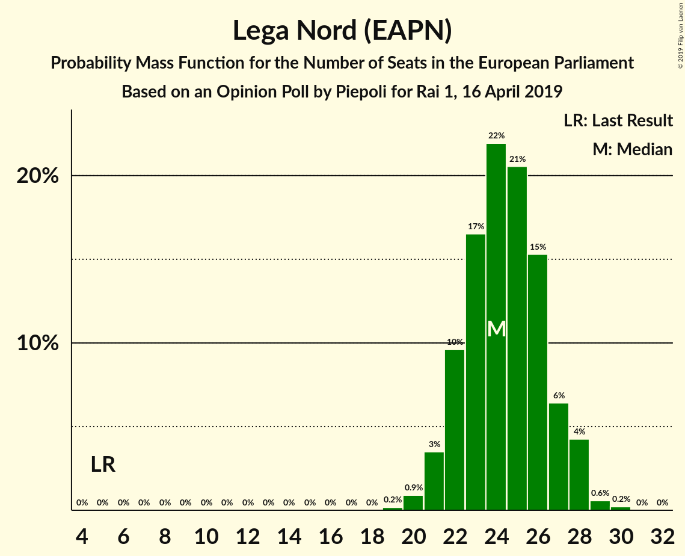
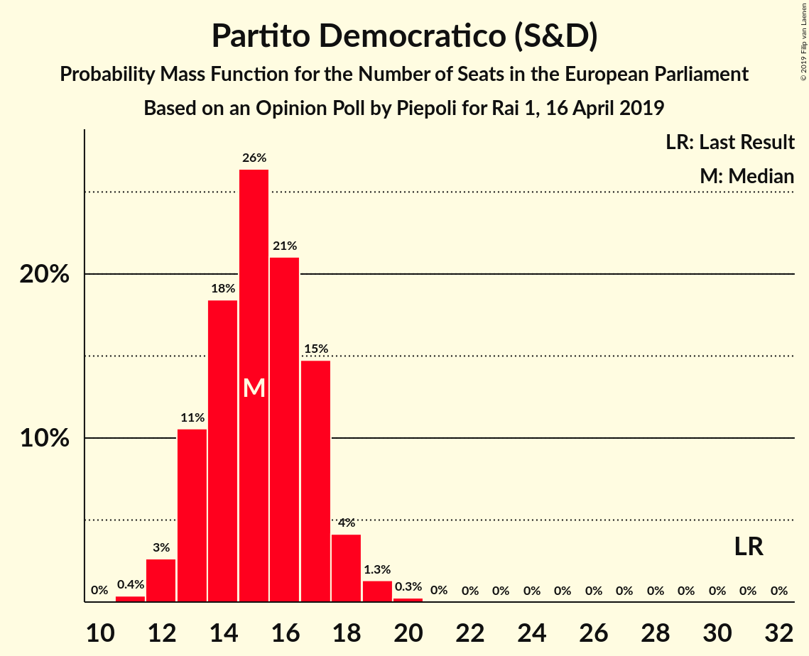

# Opinion Poll by Piepoli for Rai 1, 16 April 2019

<a href="#voting-intentions">Voting Intentions</a> | <a href="#seats">Seats</a> | <a href="#coalitions">Coalitions</a> | <a href="#technical-information">Technical Information</a>

## Voting Intentions

### Confidence Intervals

| Party | Last Result | Poll Result | 80% Confidence Interval | 90% Confidence Interval | 95% Confidence Interval | 99% Confidence Interval |
|:-----:|:-----------:|:-----------:|:-----------------------:|:-----------------------:|:-----------------------:|:-----------------------:|
| Lega Nord (EAPN) | 6.2% | 31.2% | 28.7–34.0% |27.9–34.7% |27.3–35.4% |26.1–36.7% |
| Movimento 5 Stelle (EFDD) | 21.2% | 22.7% | 20.4–25.2% |19.8–25.9% |19.2–26.5% |18.2–27.8% |
| Partito Democratico (S&D) | 40.8% | 20.7% | 18.5–23.1% |17.9–23.8% |17.4–24.4% |16.4–25.7% |
| Forza Italia (EPP) | 16.8% | 10.5% | 9.0–12.5% |8.5–13.0% |8.1–13.5% |7.4–14.5% |
| Fratelli d’Italia (ECR) | 3.7% | 5.6% | 4.5–7.1% |4.1–7.5% |3.9–7.9% |3.4–8.7% |
| Liberi e Uguali (S&D) | 0.0% | 3.6% | 2.7–4.9% |2.5–5.3% |2.3–5.6% |1.9–6.3% |
| Più Europa (ALDE) | 0.0% | 3.0% | 2.2–4.2% |2.0–4.6% |1.8–4.9% |1.5–5.5% |

*Note:* The poll result column reflects the actual value used in the calculations. Published results may vary slightly, and in addition be rounded to fewer digits.

## Seats

### Confidence Intervals

| Party | Last Result | Median | 80% Confidence Interval | 90% Confidence Interval | 95% Confidence Interval | 99% Confidence Interval |
|:-----:|:-----------:|:------:|:-----------------------:|:-----------------------:|:-----------------------:|:-----------------------:|
| <a href="#lega-nord-(eapn)">Lega Nord (EAPN)</a> | 5 | 24 | 22–27 |22–27 |21–28 |20–29 |
| <a href="#movimento-5-stelle-(efdd)">Movimento 5 Stelle (EFDD)</a> | 17 | 18 | 16–20 |15–20 |15–21 |14–22 |
| <a href="#partito-democratico-(s&d)">Partito Democratico (S&D)</a> | 31 | 15 | 13–17 |13–18 |12–18 |12–19 |
| <a href="#forza-italia-(epp)">Forza Italia (EPP)</a> | 13 | 8 | 7–10 |7–10 |6–10 |6–11 |
| <a href="#fratelli-d’italia-(ecr)">Fratelli d’Italia (ECR)</a> | 0 | 4 | 3–6 |3–6 |0–6 |0–7 |
| <a href="#liberi-e-uguali-(s&d)">Liberi e Uguali (S&D)</a> | 0 | 0 | 0–4 |0–4 |0–4 |0–5 |
| <a href="#più-europa-(alde)">Più Europa (ALDE)</a> | 0 | 0 | 0–3 |0–3 |0–4 |0–4 |

### Lega Nord (EAPN)

*For a full overview of the results for this party, see the [Lega Nord (EAPN)](party-leganordeapn.html) page.*

| Number of Seats | Probability | Accumulated | Special Marks |
|:---------------:|:-----------:|:-----------:|:-------------:|
| 5 | 0% | 100% | Last Result |
| 6 | 0% | 100% |  |
| 7 | 0% | 100% |  |
| 8 | 0% | 100% |  |
| 9 | 0% | 100% |  |
| 10 | 0% | 100% |  |
| 11 | 0% | 100% |  |
| 12 | 0% | 100% |  |
| 13 | 0% | 100% |  |
| 14 | 0% | 100% |  |
| 15 | 0% | 100% |  |
| 16 | 0% | 100% |  |
| 17 | 0% | 100% |  |
| 18 | 0% | 100% |  |
| 19 | 0.2% | 100% |  |
| 20 | 1.2% | 99.8% |  |
| 21 | 3% | 98.6% |  |
| 22 | 9% | 96% |  |
| 23 | 16% | 87% |  |
| 24 | 29% | 72% | Median |
| 25 | 13% | 43% |  |
| 26 | 19% | 29% |  |
| 27 | 6% | 10% |  |
| 28 | 4% | 5% |  |
| 29 | 0.3% | 0.7% |  |
| 30 | 0.3% | 0.3% |  |
| 31 | 0% | 0% |  |

### Movimento 5 Stelle (EFDD)

*For a full overview of the results for this party, see the [Movimento 5 Stelle (EFDD)](party-movimento5stelleefdd.html) page.*

| Number of Seats | Probability | Accumulated | Special Marks |
|:---------------:|:-----------:|:-----------:|:-------------:|
| 13 | 0.2% | 100% |  |
| 14 | 1.3% | 99.8% |  |
| 15 | 6% | 98% |  |
| 16 | 12% | 93% |  |
| 17 | 24% | 80% | Last Result |
| 18 | 26% | 56% | Median |
| 19 | 17% | 30% |  |
| 20 | 9% | 13% |  |
| 21 | 3% | 4% |  |
| 22 | 1.1% | 1.3% |  |
| 23 | 0.2% | 0.2% |  |
| 24 | 0% | 0% |  |

### Partito Democratico (S&D)

*For a full overview of the results for this party, see the [Partito Democratico (S&D)](party-partitodemocraticosd.html) page.*

| Number of Seats | Probability | Accumulated | Special Marks |
|:---------------:|:-----------:|:-----------:|:-------------:|
| 11 | 0.4% | 100% |  |
| 12 | 3% | 99.6% |  |
| 13 | 11% | 96% |  |
| 14 | 20% | 85% |  |
| 15 | 28% | 66% | Median |
| 16 | 19% | 37% |  |
| 17 | 13% | 18% |  |
| 18 | 5% | 6% |  |
| 19 | 1.0% | 1.3% |  |
| 20 | 0.2% | 0.2% |  |
| 21 | 0.1% | 0.1% |  |
| 22 | 0% | 0% |  |
| 23 | 0% | 0% |  |
| 24 | 0% | 0% |  |
| 25 | 0% | 0% |  |
| 26 | 0% | 0% |  |
| 27 | 0% | 0% |  |
| 28 | 0% | 0% |  |
| 29 | 0% | 0% |  |
| 30 | 0% | 0% |  |
| 31 | 0% | 0% | Last Result |

### Forza Italia (EPP)

*For a full overview of the results for this party, see the [Forza Italia (EPP)](party-forzaitaliaepp.html) page.*

| Number of Seats | Probability | Accumulated | Special Marks |
|:---------------:|:-----------:|:-----------:|:-------------:|
| 5 | 0.2% | 100% |  |
| 6 | 5% | 99.8% |  |
| 7 | 21% | 95% |  |
| 8 | 37% | 74% | Median |
| 9 | 21% | 38% |  |
| 10 | 15% | 17% |  |
| 11 | 2% | 2% |  |
| 12 | 0.4% | 0.4% |  |
| 13 | 0.1% | 0.1% | Last Result |
| 14 | 0% | 0% |  |

### Fratelli d’Italia (ECR)

*For a full overview of the results for this party, see the [Fratelli d’Italia (ECR)](party-fratellid’italiaecr.html) page.*

| Number of Seats | Probability | Accumulated | Special Marks |
|:---------------:|:-----------:|:-----------:|:-------------:|
| 0 | 3% | 100% | Last Result |
| 1 | 0% | 97% |  |
| 2 | 0% | 97% |  |
| 3 | 7% | 97% |  |
| 4 | 40% | 90% | Median |
| 5 | 38% | 50% |  |
| 6 | 11% | 12% |  |
| 7 | 1.1% | 1.2% |  |
| 8 | 0.1% | 0.1% |  |
| 9 | 0% | 0% |  |

### Liberi e Uguali (S&D)

*For a full overview of the results for this party, see the [Liberi e Uguali (S&D)](party-liberieugualisd.html) page.*

| Number of Seats | Probability | Accumulated | Special Marks |
|:---------------:|:-----------:|:-----------:|:-------------:|
| 0 | 64% | 100% | Last Result, Median |
| 1 | 0% | 36% |  |
| 2 | 0% | 36% |  |
| 3 | 18% | 36% |  |
| 4 | 17% | 18% |  |
| 5 | 1.1% | 1.1% |  |
| 6 | 0% | 0% |  |

### Più Europa (ALDE)

*For a full overview of the results for this party, see the [Più Europa (ALDE)](party-piùeuropaalde.html) page.*

| Number of Seats | Probability | Accumulated | Special Marks |
|:---------------:|:-----------:|:-----------:|:-------------:|
| 0 | 85% | 100% | Last Result, Median |
| 1 | 0% | 15% |  |
| 2 | 0% | 15% |  |
| 3 | 10% | 15% |  |
| 4 | 5% | 5% |  |
| 5 | 0.2% | 0.2% |  |
| 6 | 0% | 0% |  |

## Coalitions

### Confidence Intervals

| Coalition | Last Result | Median | Majority? | 80% Confidence Interval | 90% Confidence Interval | 95% Confidence Interval | 99% Confidence Interval |
|:---------:|:-----------:|:------:|:---------:|:-----------------------:|:-----------------------:|:-----------------------:|:-----------------------:|
| Lega Nord (EAPN) | 5 | 24 | 0% | 22–27 | 22–27 | 21–28 | 20–29 |
| Movimento 5 Stelle (EFDD) | 17 | 18 | 0% | 16–20 | 15–20 | 15–21 | 14–22 |
| Partito Democratico (S&D) – Liberi e Uguali (S&D) | 31 | 16 | 0% | 14–19 | 13–20 | 13–20 | 12–21 |

### Lega Nord (EAPN)

| Number of Seats | Probability | Accumulated | Special Marks |
|:---------------:|:-----------:|:-----------:|:-------------:|
| 5 | 0% | 100% | Last Result |
| 6 | 0% | 100% |  |
| 7 | 0% | 100% |  |
| 8 | 0% | 100% |  |
| 9 | 0% | 100% |  |
| 10 | 0% | 100% |  |
| 11 | 0% | 100% |  |
| 12 | 0% | 100% |  |
| 13 | 0% | 100% |  |
| 14 | 0% | 100% |  |
| 15 | 0% | 100% |  |
| 16 | 0% | 100% |  |
| 17 | 0% | 100% |  |
| 18 | 0% | 100% |  |
| 19 | 0.2% | 100% |  |
| 20 | 1.2% | 99.8% |  |
| 21 | 3% | 98.6% |  |
| 22 | 9% | 96% |  |
| 23 | 16% | 87% |  |
| 24 | 29% | 72% | Median |
| 25 | 13% | 43% |  |
| 26 | 19% | 29% |  |
| 27 | 6% | 10% |  |
| 28 | 4% | 5% |  |
| 29 | 0.3% | 0.7% |  |
| 30 | 0.3% | 0.3% |  |
| 31 | 0% | 0% |  |

### Movimento 5 Stelle (EFDD)

| Number of Seats | Probability | Accumulated | Special Marks |
|:---------------:|:-----------:|:-----------:|:-------------:|
| 13 | 0.2% | 100% |  |
| 14 | 1.3% | 99.8% |  |
| 15 | 6% | 98% |  |
| 16 | 12% | 93% |  |
| 17 | 24% | 80% | Last Result |
| 18 | 26% | 56% | Median |
| 19 | 17% | 30% |  |
| 20 | 9% | 13% |  |
| 21 | 3% | 4% |  |
| 22 | 1.1% | 1.3% |  |
| 23 | 0.2% | 0.2% |  |
| 24 | 0% | 0% |  |

### Partito Democratico (S&D) – Liberi e Uguali (S&D)

| Number of Seats | Probability | Accumulated | Special Marks |
|:---------------:|:-----------:|:-----------:|:-------------:|
| 11 | 0.1% | 100% |  |
| 12 | 1.3% | 99.9% |  |
| 13 | 5% | 98.6% |  |
| 14 | 10% | 94% |  |
| 15 | 22% | 84% | Median |
| 16 | 16% | 62% |  |
| 17 | 19% | 46% |  |
| 18 | 10% | 28% |  |
| 19 | 11% | 17% |  |
| 20 | 4% | 6% |  |
| 21 | 2% | 2% |  |
| 22 | 0.4% | 0.5% |  |
| 23 | 0.1% | 0.1% |  |
| 24 | 0% | 0% |  |
| 25 | 0% | 0% |  |
| 26 | 0% | 0% |  |
| 27 | 0% | 0% |  |
| 28 | 0% | 0% |  |
| 29 | 0% | 0% |  |
| 30 | 0% | 0% |  |
| 31 | 0% | 0% | Last Result |

## Technical Information

### Opinion Poll

+ **Polling firm:** Piepoli
+ **Commissioner(s):** Rai 1
+ **Fieldwork period:** 16 April 2019

### Calculations

+ **Sample size:** 503
+ **Simulations done:** 131,072
+ **Error estimate:** 1.34%

