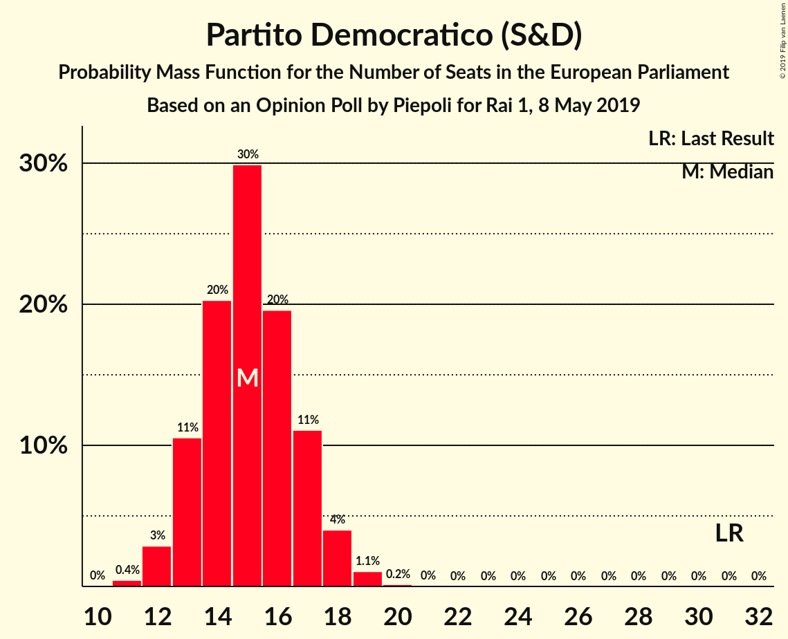
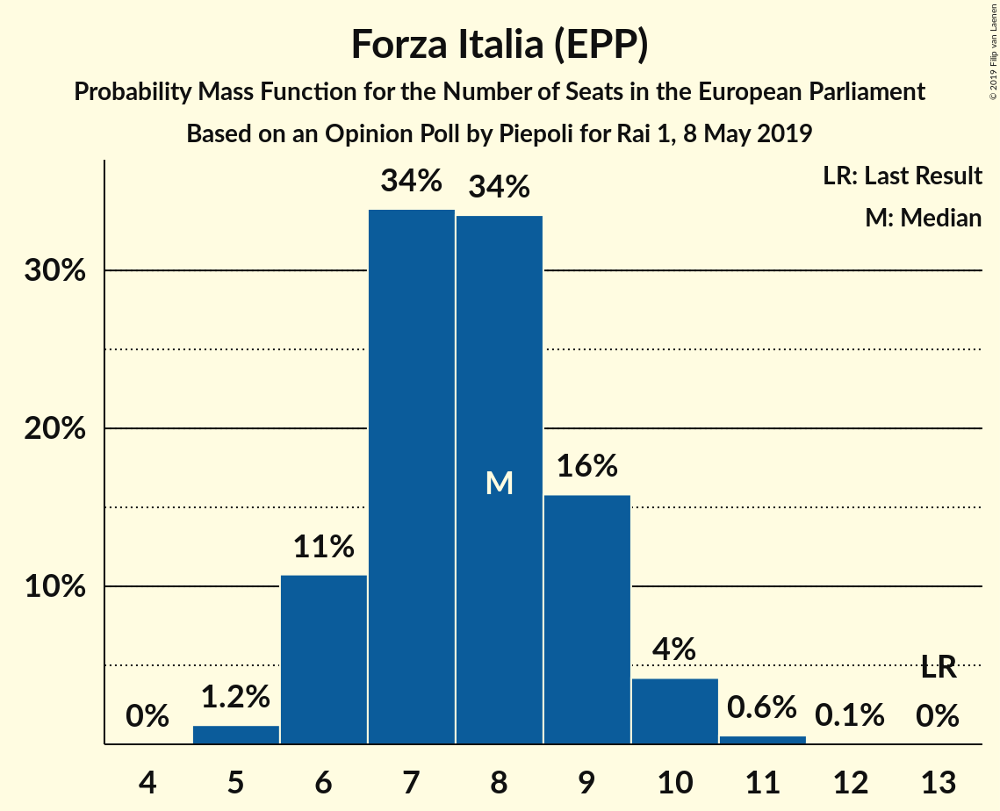

# Opinion Poll by Piepoli for Rai 1, 8 May 2019

<a href="#voting-intentions">Voting Intentions</a> | <a href="#seats">Seats</a> | <a href="#coalitions">Coalitions</a> | <a href="#technical-information">Technical Information</a>

## Voting Intentions

### Confidence Intervals

| Party | Last Result | Poll Result | 80% Confidence Interval | 90% Confidence Interval | 95% Confidence Interval | 99% Confidence Interval |
|:-----:|:-----------:|:-----------:|:-----------------------:|:-----------------------:|:-----------------------:|:-----------------------:|
| Lega Nord (EAPN) | 6.2% | 30.4% | 27.9–33.2% |27.2–33.9% |26.6–34.6% |25.4–35.9% |
| Movimento 5 Stelle (EFDD) | 21.2% | 22.1% | 19.8–24.6% |19.2–25.3% |18.7–25.9% |17.6–27.1% |
| Partito Democratico (S&D) | 40.8% | 21.1% | 18.9–23.5% |18.3–24.2% |17.7–24.9% |16.7–26.1% |
| Forza Italia (EPP) | 16.8% | 9.9% | 8.4–11.9% |8.0–12.4% |7.6–12.9% |7.0–13.8% |
| Fratelli d’Italia (ECR) | 3.7% | 5.0% | 3.9–6.4% |3.6–6.9% |3.4–7.2% |2.9–8.0% |
| Più Europa (ALDE) | 0.0% | 3.6% | 2.7–4.9% |2.5–5.3% |2.3–5.6% |1.9–6.3% |
| Liberi e Uguali (S&D) | 0.0% | 2.0% | 1.4–3.0% |1.2–3.4% |1.1–3.6% |0.9–4.2% |

*Note:* The poll result column reflects the actual value used in the calculations. Published results may vary slightly, and in addition be rounded to fewer digits.

## Seats

### Confidence Intervals

| Party | Last Result | Median | 80% Confidence Interval | 90% Confidence Interval | 95% Confidence Interval | 99% Confidence Interval |
|:-----:|:-----------:|:------:|:-----------------------:|:-----------------------:|:-----------------------:|:-----------------------:|
| <a href="#lega-nord-(eapn)">Lega Nord (EAPN)</a> | 5 | 22 | 21–22 |21–22 |20–23 |18–24 |
| <a href="#movimento-5-stelle-(efdd)">Movimento 5 Stelle (EFDD)</a> | 17 | 16 | 16–17 |16–18 |14–19 |14–20 |
| <a href="#partito-democratico-(s&d)">Partito Democratico (S&D)</a> | 31 | 13 | 12–14 |12–18 |12–20 |12–20 |
| <a href="#forza-italia-(epp)">Forza Italia (EPP)</a> | 13 | 8 | 8–10 |6–10 |6–10 |5–10 |
| <a href="#fratelli-d’italia-(ecr)">Fratelli d’Italia (ECR)</a> | 0 | 4 | 4 |4–5 |4–5 |3–6 |
| <a href="#più-europa-(alde)">Più Europa (ALDE)</a> | 0 | 4 | 0–4 |0–4 |0–5 |0–5 |
| <a href="#liberi-e-uguali-(s&d)">Liberi e Uguali (S&D)</a> | 0 | 0 | 0 |0 |0 |0–3 |

### Lega Nord (EAPN)

*For a full overview of the results for this party, see the [Lega Nord (EAPN)](party-leganordeapn.html) page.*

| Number of Seats | Probability | Accumulated | Special Marks |
|:---------------:|:-----------:|:-----------:|:-------------:|
| 5 | 0% | 100% | Last Result |
| 6 | 0% | 100% |  |
| 7 | 0% | 100% |  |
| 8 | 0% | 100% |  |
| 9 | 0% | 100% |  |
| 10 | 0% | 100% |  |
| 11 | 0% | 100% |  |
| 12 | 0% | 100% |  |
| 13 | 0% | 100% |  |
| 14 | 0% | 100% |  |
| 15 | 0% | 100% |  |
| 16 | 0% | 100% |  |
| 17 | 0% | 100% |  |
| 18 | 0.6% | 100% |  |
| 19 | 1.5% | 99.4% |  |
| 20 | 2% | 98% |  |
| 21 | 22% | 96% |  |
| 22 | 71% | 74% | Median |
| 23 | 1.5% | 3% |  |
| 24 | 1.2% | 2% |  |
| 25 | 0.3% | 0.3% |  |
| 26 | 0% | 0% |  |

### Movimento 5 Stelle (EFDD)

*For a full overview of the results for this party, see the [Movimento 5 Stelle (EFDD)](party-movimento5stelleefdd.html) page.*

| Number of Seats | Probability | Accumulated | Special Marks |
|:---------------:|:-----------:|:-----------:|:-------------:|
| 12 | 0.2% | 100% |  |
| 13 | 0.1% | 99.8% |  |
| 14 | 4% | 99.7% |  |
| 15 | 0% | 96% |  |
| 16 | 74% | 96% | Median |
| 17 | 17% | 22% | Last Result |
| 18 | 2% | 5% |  |
| 19 | 2% | 3% |  |
| 20 | 1.0% | 1.1% |  |
| 21 | 0.1% | 0.1% |  |
| 22 | 0% | 0% |  |

### Partito Democratico (S&D)

*For a full overview of the results for this party, see the [Partito Democratico (S&D)](party-partitodemocraticosd.html) page.*

| Number of Seats | Probability | Accumulated | Special Marks |
|:---------------:|:-----------:|:-----------:|:-------------:|
| 10 | 0.1% | 100% |  |
| 11 | 0.1% | 99.9% |  |
| 12 | 23% | 99.8% |  |
| 13 | 54% | 77% | Median |
| 14 | 15% | 23% |  |
| 15 | 0.5% | 7% |  |
| 16 | 0.7% | 7% |  |
| 17 | 0.9% | 6% |  |
| 18 | 1.0% | 5% |  |
| 19 | 0.5% | 4% |  |
| 20 | 4% | 4% |  |
| 21 | 0.2% | 0.2% |  |
| 22 | 0.1% | 0.1% |  |
| 23 | 0% | 0% |  |
| 24 | 0% | 0% |  |
| 25 | 0% | 0% |  |
| 26 | 0% | 0% |  |
| 27 | 0% | 0% |  |
| 28 | 0% | 0% |  |
| 29 | 0% | 0% |  |
| 30 | 0% | 0% |  |
| 31 | 0% | 0% | Last Result |

### Forza Italia (EPP)

*For a full overview of the results for this party, see the [Forza Italia (EPP)](party-forzaitaliaepp.html) page.*

| Number of Seats | Probability | Accumulated | Special Marks |
|:---------------:|:-----------:|:-----------:|:-------------:|
| 5 | 2% | 100% |  |
| 6 | 3% | 98% |  |
| 7 | 1.2% | 95% |  |
| 8 | 57% | 93% | Median |
| 9 | 4% | 37% |  |
| 10 | 33% | 33% |  |
| 11 | 0.2% | 0.4% |  |
| 12 | 0.2% | 0.2% |  |
| 13 | 0% | 0% | Last Result |

### Fratelli d’Italia (ECR)

*For a full overview of the results for this party, see the [Fratelli d’Italia (ECR)](party-fratellid’italiaecr.html) page.*

| Number of Seats | Probability | Accumulated | Special Marks |
|:---------------:|:-----------:|:-----------:|:-------------:|
| 0 | 0% | 100% | Last Result |
| 1 | 0% | 100% |  |
| 2 | 0% | 100% |  |
| 3 | 2% | 100% |  |
| 4 | 92% | 98% | Median |
| 5 | 5% | 6% |  |
| 6 | 0.3% | 0.7% |  |
| 7 | 0.4% | 0.4% |  |
| 8 | 0% | 0% |  |

### Più Europa (ALDE)

*For a full overview of the results for this party, see the [Più Europa (ALDE)](party-piùeuropaalde.html) page.*

| Number of Seats | Probability | Accumulated | Special Marks |
|:---------------:|:-----------:|:-----------:|:-------------:|
| 0 | 18% | 100% | Last Result |
| 1 | 0% | 82% |  |
| 2 | 0% | 82% |  |
| 3 | 21% | 82% |  |
| 4 | 56% | 61% | Median |
| 5 | 4% | 4% |  |
| 6 | 0% | 0% |  |

### Liberi e Uguali (S&D)

*For a full overview of the results for this party, see the [Liberi e Uguali (S&D)](party-liberieugualisd.html) page.*

| Number of Seats | Probability | Accumulated | Special Marks |
|:---------------:|:-----------:|:-----------:|:-------------:|
| 0 | 99.4% | 100% | Last Result, Median |
| 1 | 0% | 0.6% |  |
| 2 | 0% | 0.6% |  |
| 3 | 0.4% | 0.6% |  |
| 4 | 0.1% | 0.1% |  |
| 5 | 0% | 0% |  |

## Coalitions

### Confidence Intervals

| Coalition | Last Result | Median | Majority? | 80% Confidence Interval | 90% Confidence Interval | 95% Confidence Interval | 99% Confidence Interval |
|:---------:|:-----------:|:------:|:---------:|:-----------------------:|:-----------------------:|:-----------------------:|:-----------------------:|
| Lega Nord (EAPN) | 5 | 22 | 0% | 21–22 | 21–22 | 20–23 | 18–24 |
| Partito Democratico (S&D) – Liberi e Uguali (S&D) | 31 | 13 | 0% | 12–14 | 12–18 | 12–20 | 12–20 |
| Movimento 5 Stelle (EFDD) | 17 | 16 | 0% | 16–17 | 16–18 | 14–19 | 14–20 |

### Lega Nord (EAPN)

| Number of Seats | Probability | Accumulated | Special Marks |
|:---------------:|:-----------:|:-----------:|:-------------:|
| 5 | 0% | 100% | Last Result |
| 6 | 0% | 100% |  |
| 7 | 0% | 100% |  |
| 8 | 0% | 100% |  |
| 9 | 0% | 100% |  |
| 10 | 0% | 100% |  |
| 11 | 0% | 100% |  |
| 12 | 0% | 100% |  |
| 13 | 0% | 100% |  |
| 14 | 0% | 100% |  |
| 15 | 0% | 100% |  |
| 16 | 0% | 100% |  |
| 17 | 0% | 100% |  |
| 18 | 0.6% | 100% |  |
| 19 | 1.5% | 99.4% |  |
| 20 | 2% | 98% |  |
| 21 | 22% | 96% |  |
| 22 | 71% | 74% | Median |
| 23 | 1.5% | 3% |  |
| 24 | 1.2% | 2% |  |
| 25 | 0.3% | 0.3% |  |
| 26 | 0% | 0% |  |

### Partito Democratico (S&D) – Liberi e Uguali (S&D)

| Number of Seats | Probability | Accumulated | Special Marks |
|:---------------:|:-----------:|:-----------:|:-------------:|
| 10 | 0.1% | 100% |  |
| 11 | 0.1% | 99.9% |  |
| 12 | 23% | 99.8% |  |
| 13 | 54% | 77% | Median |
| 14 | 15% | 23% |  |
| 15 | 0.2% | 8% |  |
| 16 | 0.8% | 7% |  |
| 17 | 0.9% | 7% |  |
| 18 | 1.0% | 6% |  |
| 19 | 0.7% | 5% |  |
| 20 | 4% | 4% |  |
| 21 | 0.2% | 0.3% |  |
| 22 | 0.1% | 0.1% |  |
| 23 | 0% | 0% |  |
| 24 | 0% | 0% |  |
| 25 | 0% | 0% |  |
| 26 | 0% | 0% |  |
| 27 | 0% | 0% |  |
| 28 | 0% | 0% |  |
| 29 | 0% | 0% |  |
| 30 | 0% | 0% |  |
| 31 | 0% | 0% | Last Result |

### Movimento 5 Stelle (EFDD)

| Number of Seats | Probability | Accumulated | Special Marks |
|:---------------:|:-----------:|:-----------:|:-------------:|
| 12 | 0.2% | 100% |  |
| 13 | 0.1% | 99.8% |  |
| 14 | 4% | 99.7% |  |
| 15 | 0% | 96% |  |
| 16 | 74% | 96% | Median |
| 17 | 17% | 22% | Last Result |
| 18 | 2% | 5% |  |
| 19 | 2% | 3% |  |
| 20 | 1.0% | 1.1% |  |
| 21 | 0.1% | 0.1% |  |
| 22 | 0% | 0% |  |

## Technical Information

### Opinion Poll

+ **Polling firm:** Piepoli
+ **Commissioner(s):** Rai 1
+ **Fieldwork period:** 8 May 2019

### Calculations

+ **Sample size:** 503
+ **Simulations done:** 1,024
+ **Error estimate:** 8.46%

