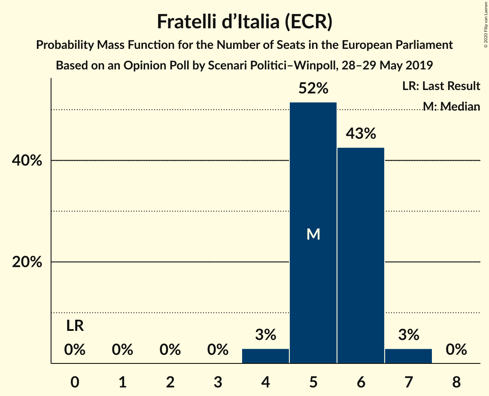
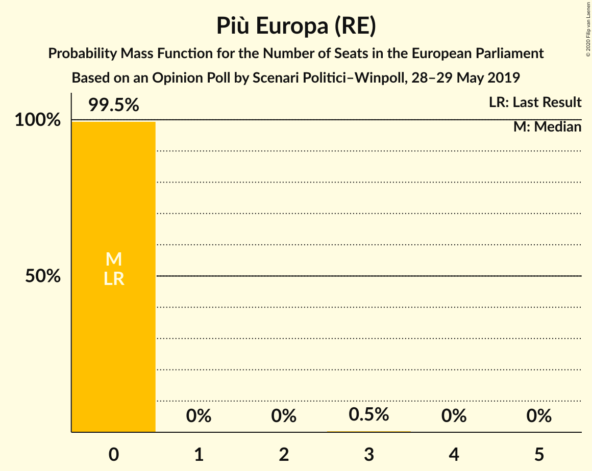

# Opinion Poll by Scenari Politici–Winpoll, 28–29 May 2019

<a href="#voting-intentions">Voting Intentions</a> | <a href="#seats">Seats</a> | <a href="#coalitions">Coalitions</a> | <a href="#technical-information">Technical Information</a>

## Voting Intentions

### Confidence Intervals

| Party | Last Result | Poll Result | 80% Confidence Interval | 90% Confidence Interval | 95% Confidence Interval | 99% Confidence Interval |
|:-----:|:-----------:|:-----------:|:-----------------------:|:-----------------------:|:-----------------------:|:-----------------------:|
| Lega Nord (ID) | 6.2% | 36.3% | 34.7–37.9% |34.2–38.3% |33.9–38.7% |33.1–39.5% |
| Partito Democratico (S&D) | 40.8% | 23.8% | 22.4–25.3% |22.0–25.7% |21.7–26.0% |21.1–26.7% |
| Movimento 5 Stelle (NI) | 21.2% | 16.5% | 15.3–17.8% |15.0–18.2% |14.7–18.5% |14.2–19.1% |
| Forza Italia (EPP) | 16.8% | 7.9% | 7.1–8.9% |6.9–9.2% |6.7–9.4% |6.3–9.9% |
| Fratelli d’Italia (ECR) | 3.7% | 6.8% | 6.0–7.7% |5.8–8.0% |5.6–8.2% |5.3–8.7% |
| Più Europa (RE) | 0.0% | 2.7% | 2.3–3.4% |2.1–3.5% |2.0–3.7% |1.8–4.0% |
| Liberi e Uguali (S&D) | 0.0% | 1.4% | 1.1–1.9% |1.0–2.0% |0.9–2.1% |0.8–2.4% |

*Note:* The poll result column reflects the actual value used in the calculations. Published results may vary slightly, and in addition be rounded to fewer digits.

## Seats

### Confidence Intervals

| Party | Last Result | Median | 80% Confidence Interval | 90% Confidence Interval | 95% Confidence Interval | 99% Confidence Interval |
|:-----:|:-----------:|:------:|:-----------------------:|:-----------------------:|:-----------------------:|:-----------------------:|
| <a href="#lega-nord-(id)">Lega Nord (ID)</a> | 5 | 28 | 26–29 |26–29 |26–30 |25–31 |
| <a href="#partito-democratico-(s&d)">Partito Democratico (S&D)</a> | 31 | 17 | 16–18 |16–19 |15–19 |15–20 |
| <a href="#movimento-5-stelle-(ni)">Movimento 5 Stelle (NI)</a> | 17 | 13 | 12–14 |11–14 |11–14 |11–15 |
| <a href="#forza-italia-(epp)">Forza Italia (EPP)</a> | 13 | 6 | 5–7 |5–7 |5–7 |5–8 |
| <a href="#fratelli-d’italia-(ecr)">Fratelli d’Italia (ECR)</a> | 0 | 5 | 5–6 |4–6 |4–6 |4–7 |
| <a href="#più-europa-(re)">Più Europa (RE)</a> | 0 | 0 | 0 |0 |0 |0–3 |
| <a href="#liberi-e-uguali-(s&d)">Liberi e Uguali (S&D)</a> | 0 | 0 | 0 |0 |0 |0 |

### Lega Nord (ID)

*For a full overview of the results for this party, see the [Lega Nord (ID)](party-leganordid.html) page.*

| Number of Seats | Probability | Accumulated | Special Marks |
|:---------------:|:-----------:|:-----------:|:-------------:|
| 5 | 0% | 100% | Last Result |
| 6 | 0% | 100% |  |
| 7 | 0% | 100% |  |
| 8 | 0% | 100% |  |
| 9 | 0% | 100% |  |
| 10 | 0% | 100% |  |
| 11 | 0% | 100% |  |
| 12 | 0% | 100% |  |
| 13 | 0% | 100% |  |
| 14 | 0% | 100% |  |
| 15 | 0% | 100% |  |
| 16 | 0% | 100% |  |
| 17 | 0% | 100% |  |
| 18 | 0% | 100% |  |
| 19 | 0% | 100% |  |
| 20 | 0% | 100% |  |
| 21 | 0% | 100% |  |
| 22 | 0% | 100% |  |
| 23 | 0% | 100% |  |
| 24 | 0.1% | 100% |  |
| 25 | 2% | 99.9% |  |
| 26 | 11% | 98% |  |
| 27 | 23% | 87% |  |
| 28 | 37% | 64% | Median |
| 29 | 24% | 27% |  |
| 30 | 3% | 4% |  |
| 31 | 0.7% | 0.7% |  |
| 32 | 0% | 0% |  |

### Partito Democratico (S&D)

*For a full overview of the results for this party, see the [Partito Democratico (S&D)](party-partitodemocraticosd.html) page.*

| Number of Seats | Probability | Accumulated | Special Marks |
|:---------------:|:-----------:|:-----------:|:-------------:|
| 14 | 0.1% | 100% |  |
| 15 | 3% | 99.9% |  |
| 16 | 21% | 97% |  |
| 17 | 47% | 76% | Median |
| 18 | 20% | 29% |  |
| 19 | 9% | 10% |  |
| 20 | 1.3% | 1.3% |  |
| 21 | 0% | 0% |  |
| 22 | 0% | 0% |  |
| 23 | 0% | 0% |  |
| 24 | 0% | 0% |  |
| 25 | 0% | 0% |  |
| 26 | 0% | 0% |  |
| 27 | 0% | 0% |  |
| 28 | 0% | 0% |  |
| 29 | 0% | 0% |  |
| 30 | 0% | 0% |  |
| 31 | 0% | 0% | Last Result |

### Movimento 5 Stelle (NI)

*For a full overview of the results for this party, see the [Movimento 5 Stelle (NI)](party-movimento5stelleni.html) page.*

| Number of Seats | Probability | Accumulated | Special Marks |
|:---------------:|:-----------:|:-----------:|:-------------:|
| 10 | 0.3% | 100% |  |
| 11 | 10% | 99.7% |  |
| 12 | 32% | 90% |  |
| 13 | 45% | 58% | Median |
| 14 | 11% | 13% |  |
| 15 | 1.4% | 1.5% |  |
| 16 | 0% | 0% |  |
| 17 | 0% | 0% | Last Result |

### Forza Italia (EPP)

*For a full overview of the results for this party, see the [Forza Italia (EPP)](party-forzaitaliaepp.html) page.*

| Number of Seats | Probability | Accumulated | Special Marks |
|:---------------:|:-----------:|:-----------:|:-------------:|
| 4 | 0.1% | 100% |  |
| 5 | 10% | 99.9% |  |
| 6 | 63% | 89% | Median |
| 7 | 25% | 26% |  |
| 8 | 0.6% | 0.6% |  |
| 9 | 0% | 0% |  |
| 10 | 0% | 0% |  |
| 11 | 0% | 0% |  |
| 12 | 0% | 0% |  |
| 13 | 0% | 0% | Last Result |

### Fratelli d’Italia (ECR)

*For a full overview of the results for this party, see the [Fratelli d’Italia (ECR)](party-fratellid’italiaecr.html) page.*

| Number of Seats | Probability | Accumulated | Special Marks |
|:---------------:|:-----------:|:-----------:|:-------------:|
| 0 | 0% | 100% | Last Result |
| 1 | 0% | 100% |  |
| 2 | 0% | 100% |  |
| 3 | 0% | 100% |  |
| 4 | 6% | 100% |  |
| 5 | 68% | 94% | Median |
| 6 | 25% | 26% |  |
| 7 | 1.0% | 1.0% |  |
| 8 | 0% | 0% |  |

### Più Europa (RE)

*For a full overview of the results for this party, see the [Più Europa (RE)](party-piùeuropare.html) page.*

| Number of Seats | Probability | Accumulated | Special Marks |
|:---------------:|:-----------:|:-----------:|:-------------:|
| 0 | 99.3% | 100% | Last Result, Median |
| 1 | 0% | 0.7% |  |
| 2 | 0% | 0.7% |  |
| 3 | 0.7% | 0.7% |  |
| 4 | 0% | 0% |  |

### Liberi e Uguali (S&D)

*For a full overview of the results for this party, see the [Liberi e Uguali (S&D)](party-liberieugualisd.html) page.*

| Number of Seats | Probability | Accumulated | Special Marks |
|:---------------:|:-----------:|:-----------:|:-------------:|
| 0 | 100% | 100% | Last Result, Median |

## Coalitions

### Confidence Intervals

| Coalition | Last Result | Median | Majority? | 80% Confidence Interval | 90% Confidence Interval | 95% Confidence Interval | 99% Confidence Interval |
|:---------:|:-----------:|:------:|:---------:|:-----------------------:|:-----------------------:|:-----------------------:|:-----------------------:|
| Lega Nord (ID) | 5 | 28 | 0% | 26–29 | 26–29 | 26–30 | 25–31 |
| Partito Democratico (S&D) – Liberi e Uguali (S&D) | 31 | 17 | 0% | 16–18 | 16–19 | 15–19 | 15–20 |

### Lega Nord (ID)

| Number of Seats | Probability | Accumulated | Special Marks |
|:---------------:|:-----------:|:-----------:|:-------------:|
| 5 | 0% | 100% | Last Result |
| 6 | 0% | 100% |  |
| 7 | 0% | 100% |  |
| 8 | 0% | 100% |  |
| 9 | 0% | 100% |  |
| 10 | 0% | 100% |  |
| 11 | 0% | 100% |  |
| 12 | 0% | 100% |  |
| 13 | 0% | 100% |  |
| 14 | 0% | 100% |  |
| 15 | 0% | 100% |  |
| 16 | 0% | 100% |  |
| 17 | 0% | 100% |  |
| 18 | 0% | 100% |  |
| 19 | 0% | 100% |  |
| 20 | 0% | 100% |  |
| 21 | 0% | 100% |  |
| 22 | 0% | 100% |  |
| 23 | 0% | 100% |  |
| 24 | 0.1% | 100% |  |
| 25 | 2% | 99.9% |  |
| 26 | 11% | 98% |  |
| 27 | 23% | 87% |  |
| 28 | 37% | 64% | Median |
| 29 | 24% | 27% |  |
| 30 | 3% | 4% |  |
| 31 | 0.7% | 0.7% |  |
| 32 | 0% | 0% |  |

### Partito Democratico (S&D) – Liberi e Uguali (S&D)

| Number of Seats | Probability | Accumulated | Special Marks |
|:---------------:|:-----------:|:-----------:|:-------------:|
| 14 | 0.1% | 100% |  |
| 15 | 3% | 99.9% |  |
| 16 | 21% | 97% |  |
| 17 | 47% | 76% | Median |
| 18 | 20% | 29% |  |
| 19 | 9% | 10% |  |
| 20 | 1.3% | 1.3% |  |
| 21 | 0% | 0% |  |
| 22 | 0% | 0% |  |
| 23 | 0% | 0% |  |
| 24 | 0% | 0% |  |
| 25 | 0% | 0% |  |
| 26 | 0% | 0% |  |
| 27 | 0% | 0% |  |
| 28 | 0% | 0% |  |
| 29 | 0% | 0% |  |
| 30 | 0% | 0% |  |
| 31 | 0% | 0% | Last Result |

## Technical Information

### Opinion Poll

+ **Polling firm:** Scenari Politici–Winpoll
+ **Commissioner(s):** —
+ **Fieldwork period:** 28–29 May 2019

### Calculations

+ **Sample size:** 1500
+ **Simulations done:** 131,072
+ **Error estimate:** 2.09%

