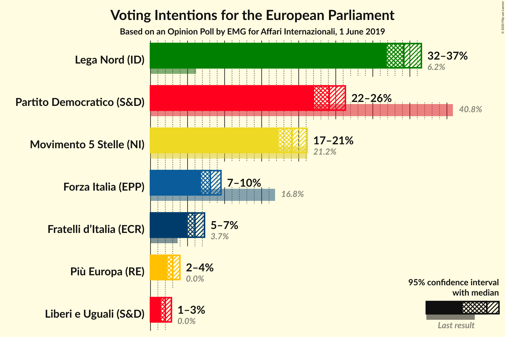
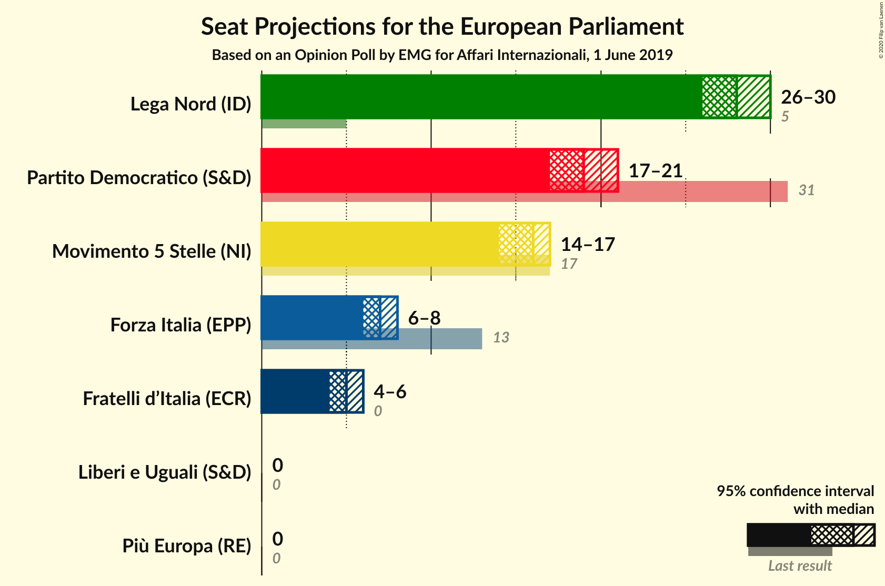
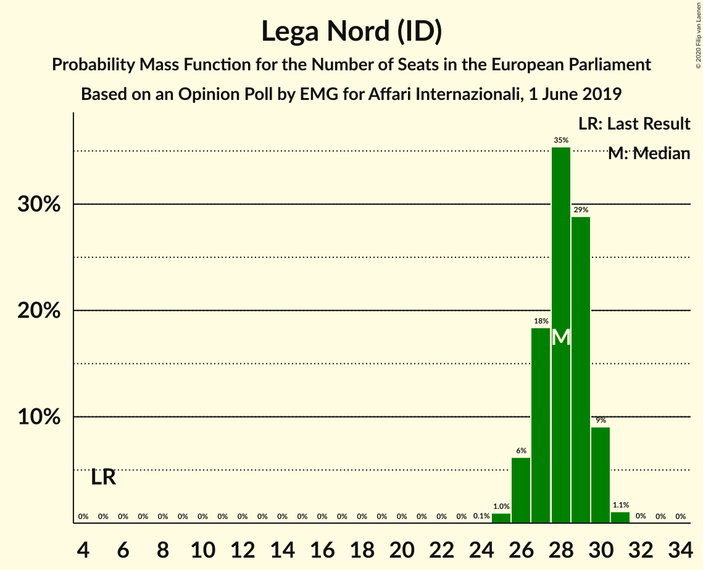
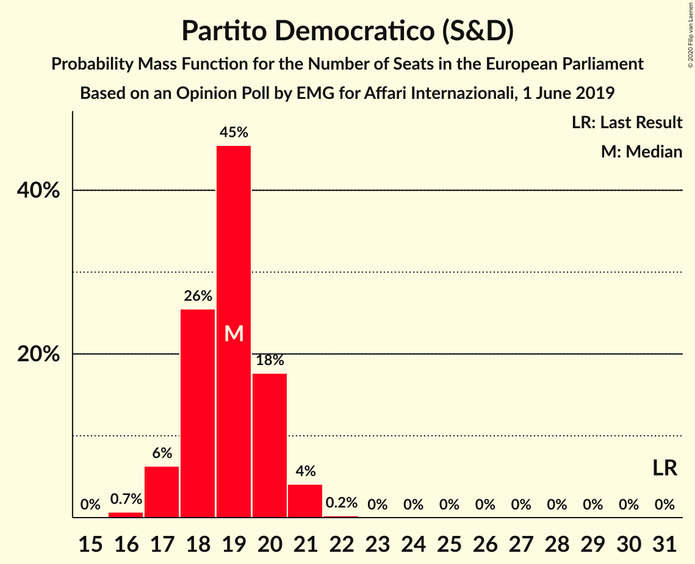
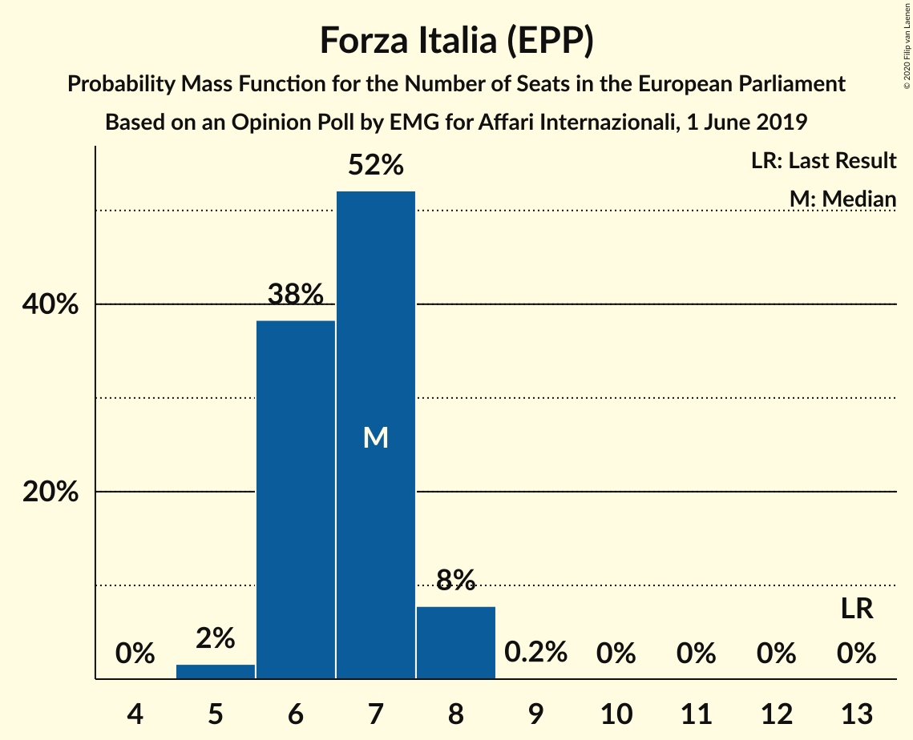
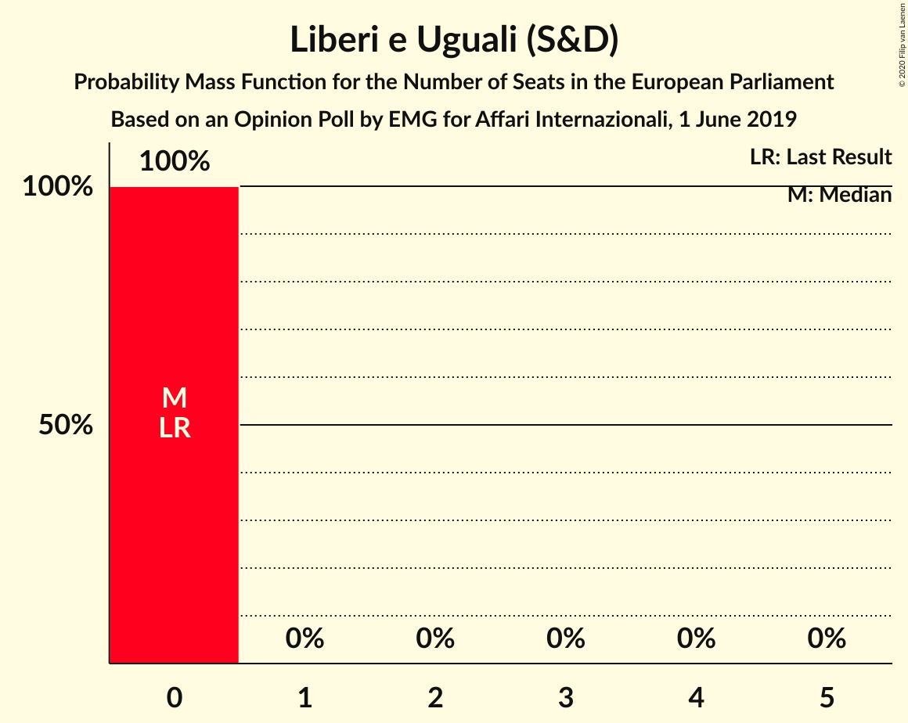
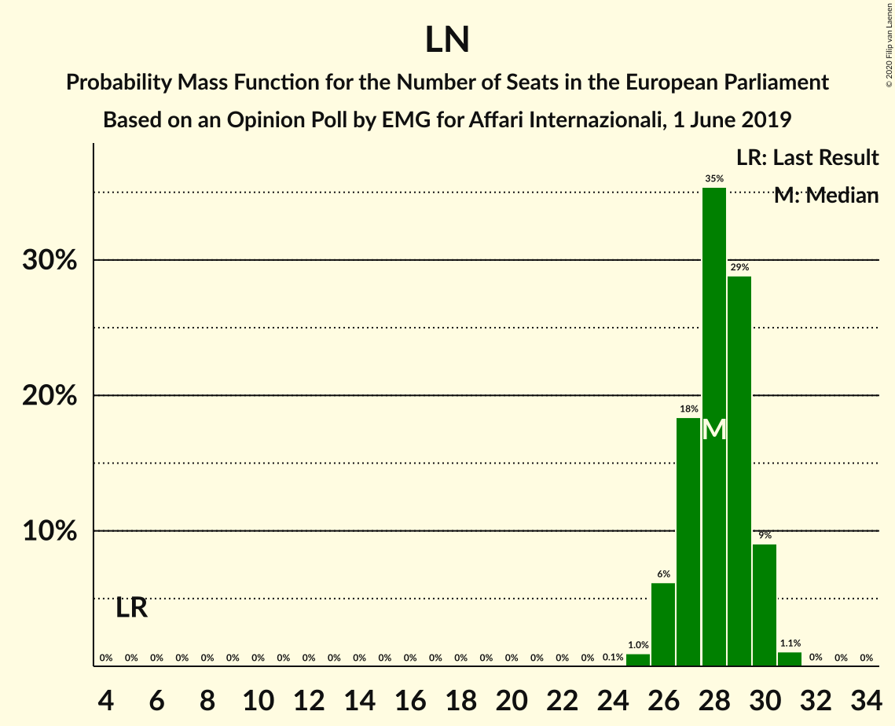

# Opinion Poll by EMG for Affari Internazionali, 1 June 2019

<a href="#voting-intentions">Voting Intentions</a> | <a href="#seats">Seats</a> | <a href="#coalitions">Coalitions</a> | <a href="#technical-information">Technical Information</a>

## Voting Intentions

### Confidence Intervals

| Party | Last Result | Poll Result | 80% Confidence Interval | 90% Confidence Interval | 95% Confidence Interval | 99% Confidence Interval |
|:-----:|:-----------:|:-----------:|:-----------------------:|:-----------------------:|:-----------------------:|:-----------------------:|
| Lega Nord (ID) | 6.2% | 34.2% | 32.7–35.7% |32.3–36.2% |31.9–36.5% |31.2–37.3% |
| Partito Democratico (S&D) | 40.8% | 24.1% | 22.8–25.5% |22.4–25.9% |22.1–26.3% |21.5–27.0% |
| Movimento 5 Stelle (NI) | 21.2% | 19.1% | 17.9–20.4% |17.6–20.8% |17.3–21.1% |16.7–21.8% |
| Forza Italia (EPP) | 16.8% | 8.1% | 7.2–9.0% |7.0–9.3% |6.8–9.5% |6.4–10.0% |
| Fratelli d’Italia (ECR) | 3.7% | 6.0% | 5.3–6.8% |5.1–7.1% |4.9–7.3% |4.6–7.7% |
| Più Europa (RE) | 0.0% | 3.0% | 2.5–3.6% |2.4–3.8% |2.3–4.0% |2.1–4.3% |
| Liberi e Uguali (S&D) | 0.0% | 2.0% | 1.6–2.5% |1.5–2.7% |1.4–2.8% |1.2–3.1% |

*Note:* The poll result column reflects the actual value used in the calculations. Published results may vary slightly, and in addition be rounded to fewer digits.

## Seats

### Confidence Intervals

| Party | Last Result | Median | 80% Confidence Interval | 90% Confidence Interval | 95% Confidence Interval | 99% Confidence Interval |
|:-----:|:-----------:|:------:|:-----------------------:|:-----------------------:|:-----------------------:|:-----------------------:|
| <a href="#lega-nord-(id)">Lega Nord (ID)</a> | 5 | 27 | 26–28 |25–29 |25–29 |24–30 |
| <a href="#partito-democratico-(s&d)">Partito Democratico (S&D)</a> | 31 | 18 | 17–19 |17–20 |16–20 |16–20 |
| <a href="#movimento-5-stelle-(ni)">Movimento 5 Stelle (NI)</a> | 17 | 15 | 14–16 |14–17 |14–17 |13–17 |
| <a href="#forza-italia-(epp)">Forza Italia (EPP)</a> | 13 | 6 | 6–7 |6–7 |5–8 |5–8 |
| <a href="#fratelli-d’italia-(ecr)">Fratelli d’Italia (ECR)</a> | 0 | 5 | 4–5 |4–6 |4–6 |4–6 |
| <a href="#più-europa-(re)">Più Europa (RE)</a> | 0 | 0 | 0 |0 |0 |0–3 |
| <a href="#liberi-e-uguali-(s&d)">Liberi e Uguali (S&D)</a> | 0 | 0 | 0 |0 |0 |0 |

### Lega Nord (ID)

*For a full overview of the results for this party, see the [Lega Nord (ID)](party-leganordid.html) page.*

| Number of Seats | Probability | Accumulated | Special Marks |
|:---------------:|:-----------:|:-----------:|:-------------:|
| 5 | 0% | 100% | Last Result |
| 6 | 0% | 100% |  |
| 7 | 0% | 100% |  |
| 8 | 0% | 100% |  |
| 9 | 0% | 100% |  |
| 10 | 0% | 100% |  |
| 11 | 0% | 100% |  |
| 12 | 0% | 100% |  |
| 13 | 0% | 100% |  |
| 14 | 0% | 100% |  |
| 15 | 0% | 100% |  |
| 16 | 0% | 100% |  |
| 17 | 0% | 100% |  |
| 18 | 0% | 100% |  |
| 19 | 0% | 100% |  |
| 20 | 0% | 100% |  |
| 21 | 0% | 100% |  |
| 22 | 0% | 100% |  |
| 23 | 0% | 100% |  |
| 24 | 1.3% | 100% |  |
| 25 | 8% | 98.7% |  |
| 26 | 22% | 91% |  |
| 27 | 36% | 69% | Median |
| 28 | 25% | 33% |  |
| 29 | 7% | 8% |  |
| 30 | 0.6% | 0.6% |  |
| 31 | 0% | 0% |  |

### Partito Democratico (S&D)

*For a full overview of the results for this party, see the [Partito Democratico (S&D)](party-partitodemocraticosd.html) page.*

| Number of Seats | Probability | Accumulated | Special Marks |
|:---------------:|:-----------:|:-----------:|:-------------:|
| 15 | 0.1% | 100% |  |
| 16 | 4% | 99.9% |  |
| 17 | 20% | 96% |  |
| 18 | 42% | 75% | Median |
| 19 | 29% | 34% |  |
| 20 | 5% | 5% |  |
| 21 | 0.4% | 0.5% |  |
| 22 | 0% | 0% |  |
| 23 | 0% | 0% |  |
| 24 | 0% | 0% |  |
| 25 | 0% | 0% |  |
| 26 | 0% | 0% |  |
| 27 | 0% | 0% |  |
| 28 | 0% | 0% |  |
| 29 | 0% | 0% |  |
| 30 | 0% | 0% |  |
| 31 | 0% | 0% | Last Result |

### Movimento 5 Stelle (NI)

*For a full overview of the results for this party, see the [Movimento 5 Stelle (NI)](party-movimento5stelleni.html) page.*

| Number of Seats | Probability | Accumulated | Special Marks |
|:---------------:|:-----------:|:-----------:|:-------------:|
| 13 | 2% | 100% |  |
| 14 | 24% | 98% |  |
| 15 | 39% | 74% | Median |
| 16 | 28% | 35% |  |
| 17 | 7% | 7% | Last Result |
| 18 | 0.3% | 0.3% |  |
| 19 | 0% | 0% |  |

### Forza Italia (EPP)

*For a full overview of the results for this party, see the [Forza Italia (EPP)](party-forzaitaliaepp.html) page.*

| Number of Seats | Probability | Accumulated | Special Marks |
|:---------------:|:-----------:|:-----------:|:-------------:|
| 5 | 4% | 100% |  |
| 6 | 54% | 96% | Median |
| 7 | 40% | 43% |  |
| 8 | 3% | 3% |  |
| 9 | 0% | 0% |  |
| 10 | 0% | 0% |  |
| 11 | 0% | 0% |  |
| 12 | 0% | 0% |  |
| 13 | 0% | 0% | Last Result |

### Fratelli d’Italia (ECR)

*For a full overview of the results for this party, see the [Fratelli d’Italia (ECR)](party-fratellid’italiaecr.html) page.*

| Number of Seats | Probability | Accumulated | Special Marks |
|:---------------:|:-----------:|:-----------:|:-------------:|
| 0 | 0% | 100% | Last Result |
| 1 | 0% | 100% |  |
| 2 | 0% | 100% |  |
| 3 | 0.2% | 100% |  |
| 4 | 29% | 99.8% |  |
| 5 | 64% | 71% | Median |
| 6 | 7% | 7% |  |
| 7 | 0% | 0% |  |

### Più Europa (RE)

*For a full overview of the results for this party, see the [Più Europa (RE)](party-piùeuropare.html) page.*

| Number of Seats | Probability | Accumulated | Special Marks |
|:---------------:|:-----------:|:-----------:|:-------------:|
| 0 | 98% | 100% | Last Result, Median |
| 1 | 0% | 2% |  |
| 2 | 0% | 2% |  |
| 3 | 2% | 2% |  |
| 4 | 0.2% | 0.2% |  |
| 5 | 0% | 0% |  |

### Liberi e Uguali (S&D)

*For a full overview of the results for this party, see the [Liberi e Uguali (S&D)](party-liberieugualisd.html) page.*

| Number of Seats | Probability | Accumulated | Special Marks |
|:---------------:|:-----------:|:-----------:|:-------------:|
| 0 | 100% | 100% | Last Result, Median |

## Coalitions

### Confidence Intervals

| Coalition | Last Result | Median | Majority? | 80% Confidence Interval | 90% Confidence Interval | 95% Confidence Interval | 99% Confidence Interval |
|:---------:|:-----------:|:------:|:---------:|:-----------------------:|:-----------------------:|:-----------------------:|:-----------------------:|
| Lega Nord (ID) | 5 | 27 | 0% | 26–28 | 25–29 | 25–29 | 24–30 |
| Partito Democratico (S&D) – Liberi e Uguali (S&D) | 31 | 18 | 0% | 17–19 | 17–20 | 16–20 | 16–20 |

### Lega Nord (ID)

| Number of Seats | Probability | Accumulated | Special Marks |
|:---------------:|:-----------:|:-----------:|:-------------:|
| 5 | 0% | 100% | Last Result |
| 6 | 0% | 100% |  |
| 7 | 0% | 100% |  |
| 8 | 0% | 100% |  |
| 9 | 0% | 100% |  |
| 10 | 0% | 100% |  |
| 11 | 0% | 100% |  |
| 12 | 0% | 100% |  |
| 13 | 0% | 100% |  |
| 14 | 0% | 100% |  |
| 15 | 0% | 100% |  |
| 16 | 0% | 100% |  |
| 17 | 0% | 100% |  |
| 18 | 0% | 100% |  |
| 19 | 0% | 100% |  |
| 20 | 0% | 100% |  |
| 21 | 0% | 100% |  |
| 22 | 0% | 100% |  |
| 23 | 0% | 100% |  |
| 24 | 1.3% | 100% |  |
| 25 | 8% | 98.7% |  |
| 26 | 22% | 91% |  |
| 27 | 36% | 69% | Median |
| 28 | 25% | 33% |  |
| 29 | 7% | 8% |  |
| 30 | 0.6% | 0.6% |  |
| 31 | 0% | 0% |  |

### Partito Democratico (S&D) – Liberi e Uguali (S&D)

| Number of Seats | Probability | Accumulated | Special Marks |
|:---------------:|:-----------:|:-----------:|:-------------:|
| 15 | 0.1% | 100% |  |
| 16 | 4% | 99.9% |  |
| 17 | 20% | 96% |  |
| 18 | 42% | 75% | Median |
| 19 | 29% | 34% |  |
| 20 | 5% | 5% |  |
| 21 | 0.4% | 0.5% |  |
| 22 | 0% | 0% |  |
| 23 | 0% | 0% |  |
| 24 | 0% | 0% |  |
| 25 | 0% | 0% |  |
| 26 | 0% | 0% |  |
| 27 | 0% | 0% |  |
| 28 | 0% | 0% |  |
| 29 | 0% | 0% |  |
| 30 | 0% | 0% |  |
| 31 | 0% | 0% | Last Result |

## Technical Information

### Opinion Poll

+ **Polling firm:** EMG
+ **Commissioner(s):** Affari Internazionali
+ **Fieldwork period:** 1 June 2019

### Calculations

+ **Sample size:** 1600
+ **Simulations done:** 131,072
+ **Error estimate:** 1.91%

