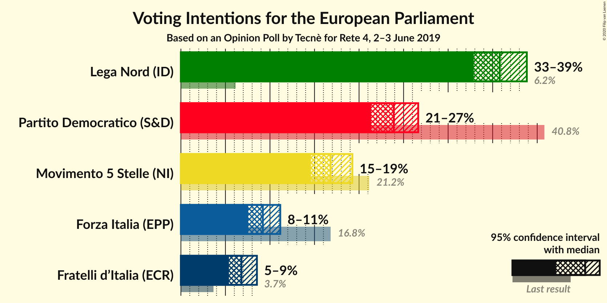
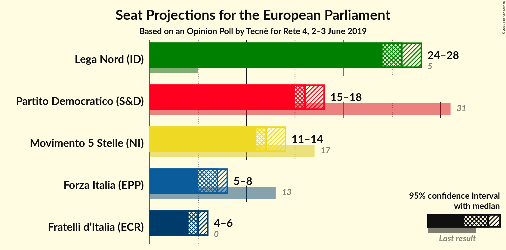
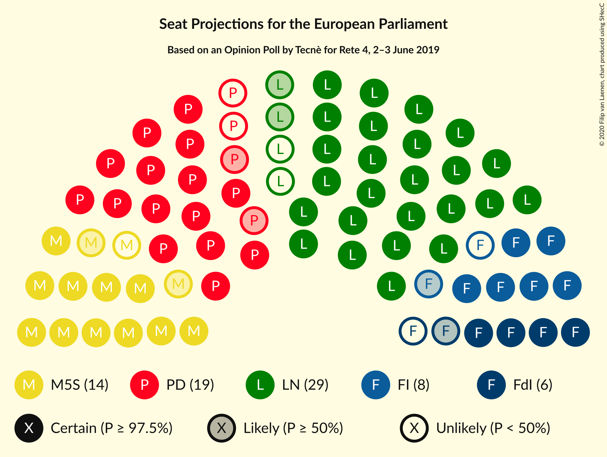
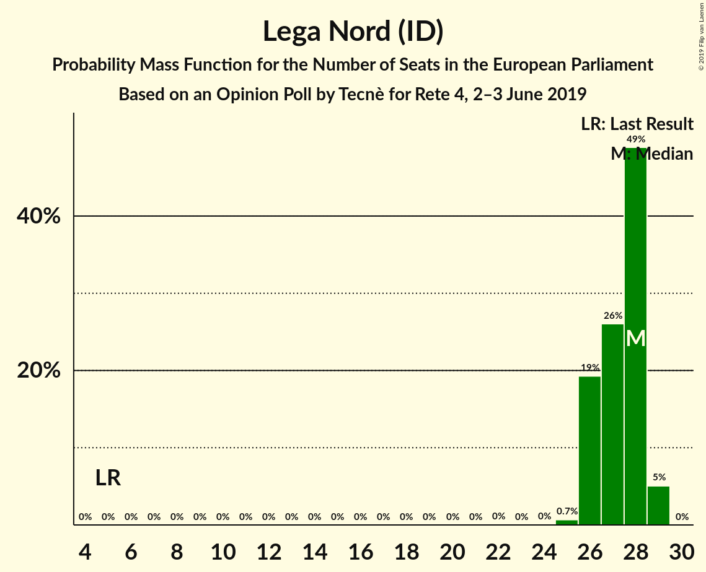
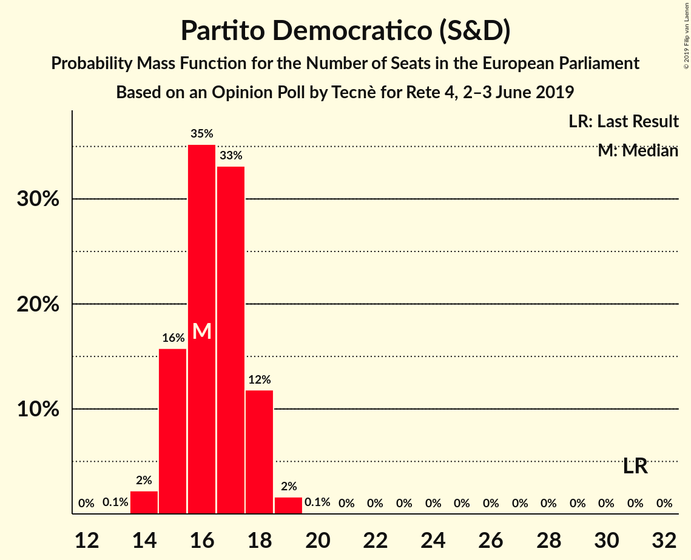
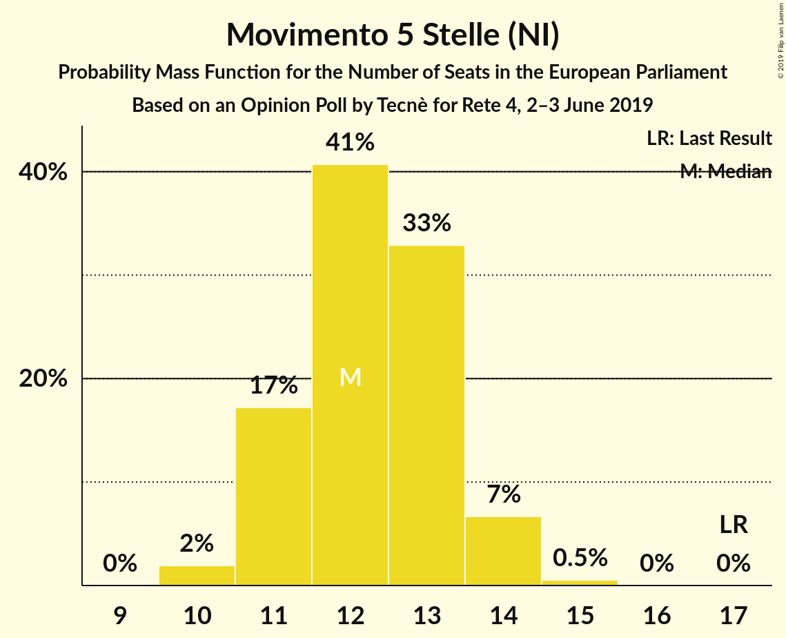
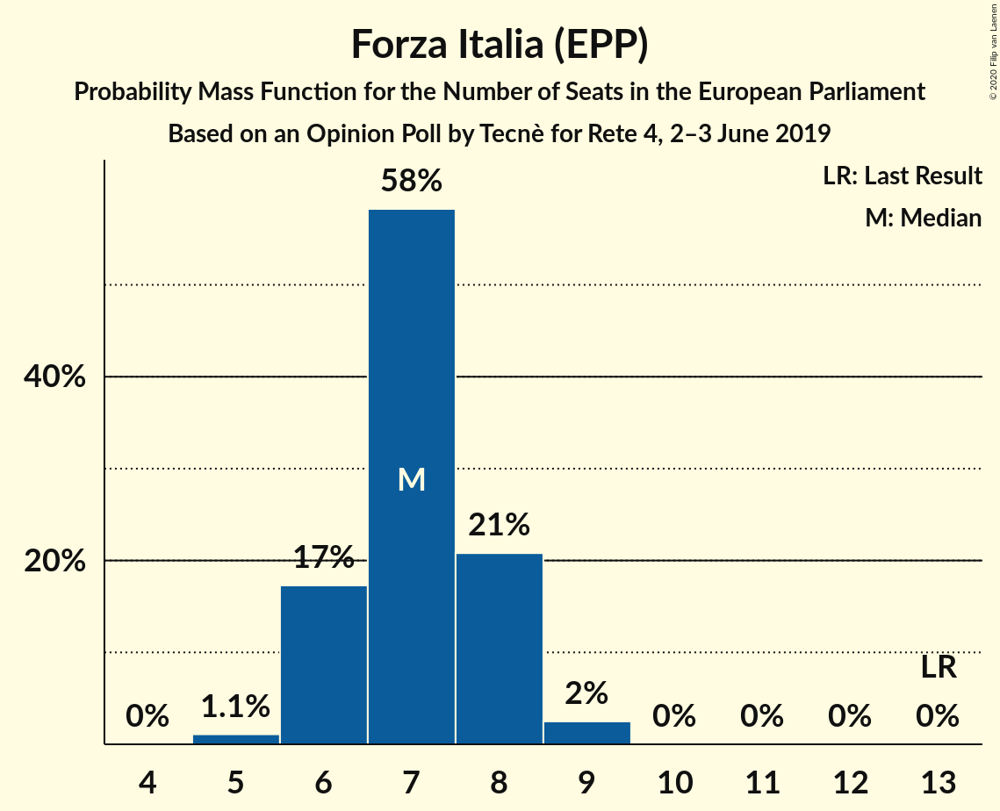
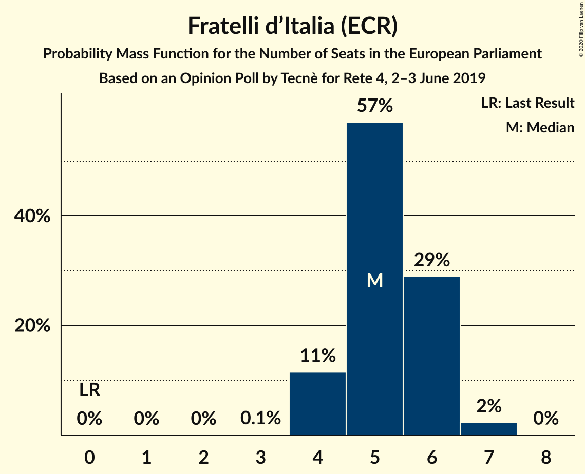
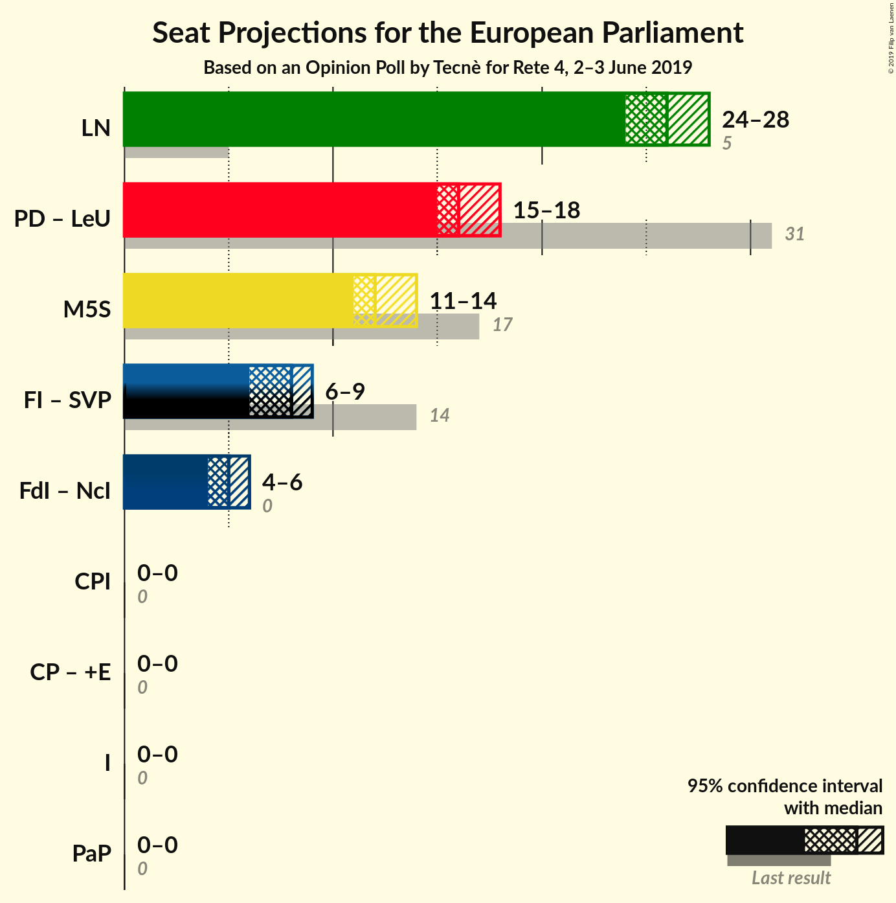
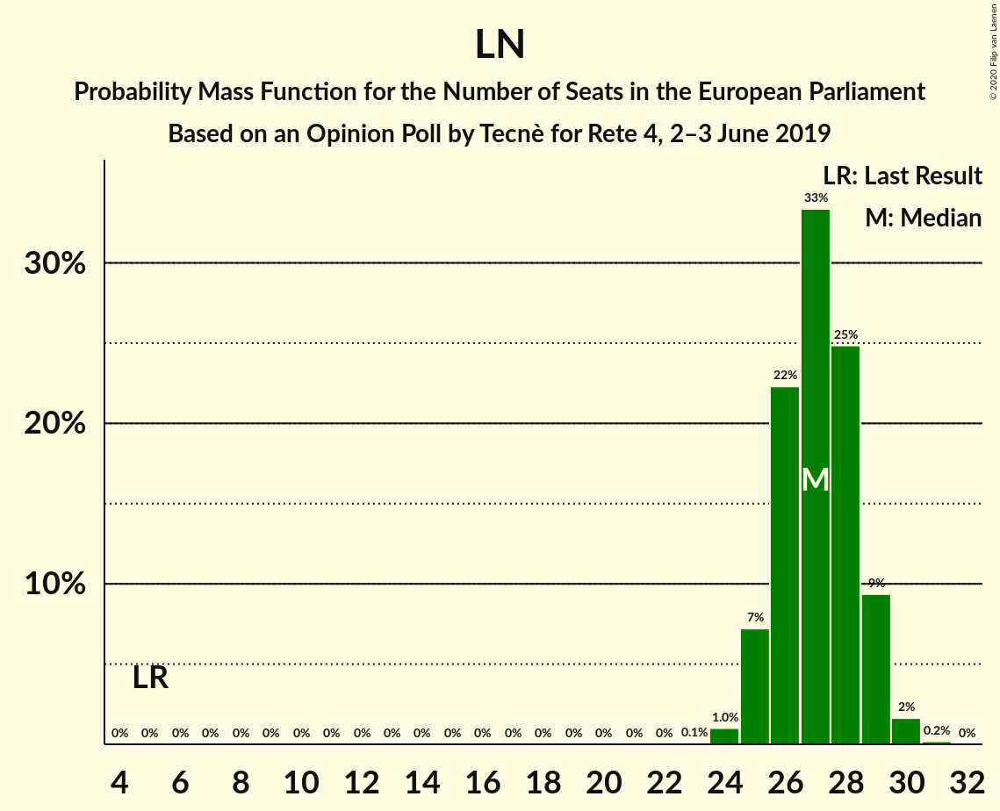

# Opinion Poll by Tecnè for Rete 4, 2–3 June 2019

<a href="#voting-intentions">Voting Intentions</a> | <a href="#seats">Seats</a> | <a href="#coalitions">Coalitions</a> | <a href="#technical-information">Technical Information</a>

## Voting Intentions

### Confidence Intervals

| Party | Last Result | Poll Result | 80% Confidence Interval | 90% Confidence Interval | 95% Confidence Interval | 99% Confidence Interval |
|:-----:|:-----------:|:-----------:|:-----------------------:|:-----------------------:|:-----------------------:|:-----------------------:|
| Lega Nord (ID) | 6.2% | 35.8% | 33.9–37.8% |33.3–38.3% |32.9–38.8% |32.0–39.8% |
| Partito Democratico (S&D) | 40.8% | 23.9% | 22.2–25.7% |21.8–26.2% |21.4–26.6% |20.6–27.5% |
| Movimento 5 Stelle (NI) | 21.2% | 16.8% | 15.4–18.4% |15.0–18.9% |14.6–19.3% |13.9–20.0% |
| Forza Italia (EPP) | 16.8% | 9.2% | 8.1–10.5% |7.8–10.8% |7.6–11.2% |7.1–11.8% |
| Fratelli d’Italia (ECR) | 3.7% | 6.8% | 5.9–7.9% |5.6–8.3% |5.4–8.5% |5.0–9.1% |

*Note:* The poll result column reflects the actual value used in the calculations. Published results may vary slightly, and in addition be rounded to fewer digits.

## Seats

### Confidence Intervals

| Party | Last Result | Median | 80% Confidence Interval | 90% Confidence Interval | 95% Confidence Interval | 99% Confidence Interval |
|:-----:|:-----------:|:------:|:-----------------------:|:-----------------------:|:-----------------------:|:-----------------------:|
| <a href="#lega-nord-(id)">Lega Nord (ID)</a> | 5 | 27 | 26–29 |25–29 |25–29 |24–30 |
| <a href="#partito-democratico-(s&d)">Partito Democratico (S&D)</a> | 31 | 17 | 16–18 |15–19 |15–19 |15–20 |
| <a href="#movimento-5-stelle-(ni)">Movimento 5 Stelle (NI)</a> | 17 | 13 | 12–14 |11–14 |11–15 |11–15 |
| <a href="#forza-italia-(epp)">Forza Italia (EPP)</a> | 13 | 7 | 6–8 |6–8 |6–8 |5–9 |
| <a href="#fratelli-d’italia-(ecr)">Fratelli d’Italia (ECR)</a> | 0 | 5 | 4–6 |4–6 |4–6 |4–7 |

### Lega Nord (ID)

*For a full overview of the results for this party, see the [Lega Nord (ID)](party-leganordid.html) page.*

| Number of Seats | Probability | Accumulated | Special Marks |
|:---------------:|:-----------:|:-----------:|:-------------:|
| 5 | 0% | 100% | Last Result |
| 6 | 0% | 100% |  |
| 7 | 0% | 100% |  |
| 8 | 0% | 100% |  |
| 9 | 0% | 100% |  |
| 10 | 0% | 100% |  |
| 11 | 0% | 100% |  |
| 12 | 0% | 100% |  |
| 13 | 0% | 100% |  |
| 14 | 0% | 100% |  |
| 15 | 0% | 100% |  |
| 16 | 0% | 100% |  |
| 17 | 0% | 100% |  |
| 18 | 0% | 100% |  |
| 19 | 0% | 100% |  |
| 20 | 0% | 100% |  |
| 21 | 0% | 100% |  |
| 22 | 0% | 100% |  |
| 23 | 0.1% | 100% |  |
| 24 | 1.0% | 99.9% |  |
| 25 | 7% | 98.9% |  |
| 26 | 22% | 92% |  |
| 27 | 33% | 70% | Median |
| 28 | 25% | 37% |  |
| 29 | 9% | 12% |  |
| 30 | 2% | 2% |  |
| 31 | 0.2% | 0.2% |  |
| 32 | 0% | 0% |  |

### Partito Democratico (S&D)

*For a full overview of the results for this party, see the [Partito Democratico (S&D)](party-partitodemocraticosd.html) page.*

| Number of Seats | Probability | Accumulated | Special Marks |
|:---------------:|:-----------:|:-----------:|:-------------:|
| 14 | 0.4% | 100% |  |
| 15 | 5% | 99.6% |  |
| 16 | 22% | 95% |  |
| 17 | 37% | 72% | Median |
| 18 | 26% | 35% |  |
| 19 | 8% | 9% |  |
| 20 | 1.1% | 1.2% |  |
| 21 | 0.1% | 0.1% |  |
| 22 | 0% | 0% |  |
| 23 | 0% | 0% |  |
| 24 | 0% | 0% |  |
| 25 | 0% | 0% |  |
| 26 | 0% | 0% |  |
| 27 | 0% | 0% |  |
| 28 | 0% | 0% |  |
| 29 | 0% | 0% |  |
| 30 | 0% | 0% |  |
| 31 | 0% | 0% | Last Result |

### Movimento 5 Stelle (NI)

*For a full overview of the results for this party, see the [Movimento 5 Stelle (NI)](party-movimento5stelleni.html) page.*

| Number of Seats | Probability | Accumulated | Special Marks |
|:---------------:|:-----------:|:-----------:|:-------------:|
| 10 | 0.4% | 100% |  |
| 11 | 7% | 99.6% |  |
| 12 | 31% | 92% |  |
| 13 | 40% | 61% | Median |
| 14 | 18% | 21% |  |
| 15 | 3% | 3% |  |
| 16 | 0.2% | 0.2% |  |
| 17 | 0% | 0% | Last Result |

### Forza Italia (EPP)

*For a full overview of the results for this party, see the [Forza Italia (EPP)](party-forzaitaliaepp.html) page.*

| Number of Seats | Probability | Accumulated | Special Marks |
|:---------------:|:-----------:|:-----------:|:-------------:|
| 5 | 1.1% | 100% |  |
| 6 | 22% | 98.9% |  |
| 7 | 52% | 77% | Median |
| 8 | 23% | 25% |  |
| 9 | 2% | 2% |  |
| 10 | 0.1% | 0.1% |  |
| 11 | 0% | 0% |  |
| 12 | 0% | 0% |  |
| 13 | 0% | 0% | Last Result |

### Fratelli d’Italia (ECR)

*For a full overview of the results for this party, see the [Fratelli d’Italia (ECR)](party-fratellid’italiaecr.html) page.*

| Number of Seats | Probability | Accumulated | Special Marks |
|:---------------:|:-----------:|:-----------:|:-------------:|
| 0 | 0% | 100% | Last Result |
| 1 | 0% | 100% |  |
| 2 | 0% | 100% |  |
| 3 | 0.1% | 100% |  |
| 4 | 11% | 99.9% |  |
| 5 | 57% | 88% | Median |
| 6 | 29% | 31% |  |
| 7 | 2% | 2% |  |
| 8 | 0% | 0% |  |

## Coalitions

### Confidence Intervals

| Coalition | Last Result | Median | Majority? | 80% Confidence Interval | 90% Confidence Interval | 95% Confidence Interval | 99% Confidence Interval |
|:---------:|:-----------:|:------:|:---------:|:-----------------------:|:-----------------------:|:-----------------------:|:-----------------------:|
| Lega Nord (ID) | 5 | 27 | 0% | 26–29 | 25–29 | 25–29 | 24–30 |

### Lega Nord (ID)

| Number of Seats | Probability | Accumulated | Special Marks |
|:---------------:|:-----------:|:-----------:|:-------------:|
| 5 | 0% | 100% | Last Result |
| 6 | 0% | 100% |  |
| 7 | 0% | 100% |  |
| 8 | 0% | 100% |  |
| 9 | 0% | 100% |  |
| 10 | 0% | 100% |  |
| 11 | 0% | 100% |  |
| 12 | 0% | 100% |  |
| 13 | 0% | 100% |  |
| 14 | 0% | 100% |  |
| 15 | 0% | 100% |  |
| 16 | 0% | 100% |  |
| 17 | 0% | 100% |  |
| 18 | 0% | 100% |  |
| 19 | 0% | 100% |  |
| 20 | 0% | 100% |  |
| 21 | 0% | 100% |  |
| 22 | 0% | 100% |  |
| 23 | 0.1% | 100% |  |
| 24 | 1.0% | 99.9% |  |
| 25 | 7% | 98.9% |  |
| 26 | 22% | 92% |  |
| 27 | 33% | 70% | Median |
| 28 | 25% | 37% |  |
| 29 | 9% | 12% |  |
| 30 | 2% | 2% |  |
| 31 | 0.2% | 0.2% |  |
| 32 | 0% | 0% |  |

## Technical Information

### Opinion Poll

+ **Polling firm:** Tecnè
+ **Commissioner(s):** Rete 4
+ **Fieldwork period:** 2–3 June 2019

### Calculations

+ **Sample size:** 1000
+ **Simulations done:** 1,048,576
+ **Error estimate:** 0.61%

