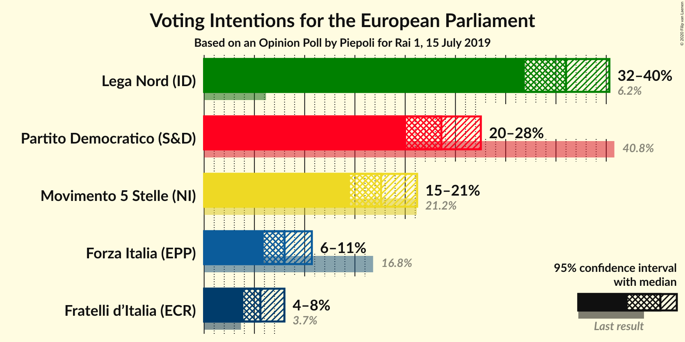
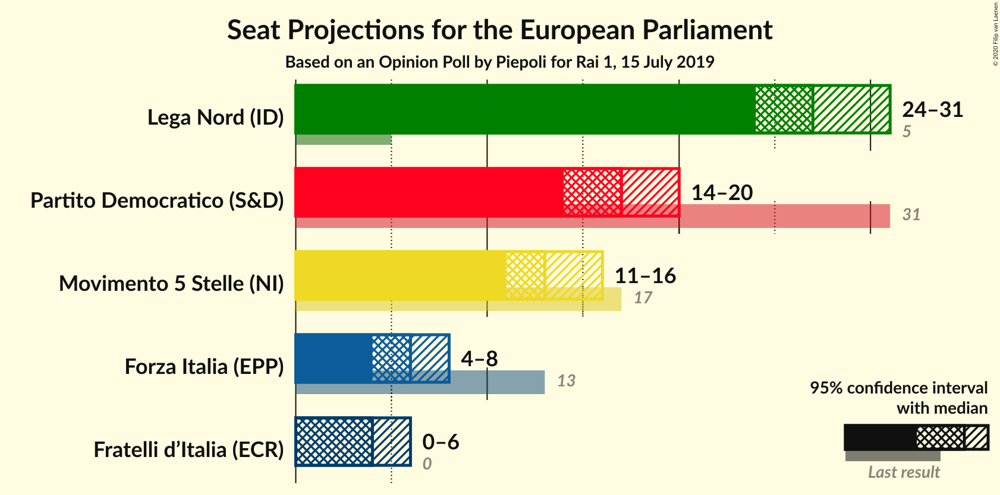
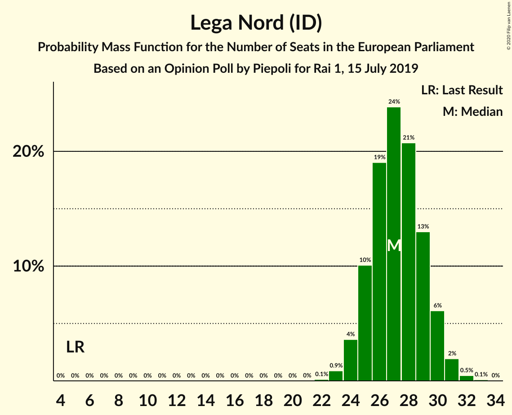

# Opinion Poll by Piepoli for Rai 1, 15 July 2019

<a href="#voting-intentions">Voting Intentions</a> | <a href="#seats">Seats</a> | <a href="#coalitions">Coalitions</a> | <a href="#technical-information">Technical Information</a>

## Voting Intentions

### Confidence Intervals

| Party | Last Result | Poll Result | 80% Confidence Interval | 90% Confidence Interval | 95% Confidence Interval | 99% Confidence Interval |
|:-----:|:-----------:|:-----------:|:-----------------------:|:-----------------------:|:-----------------------:|:-----------------------:|
| Lega Nord (ID) | 6.2% | 36.0% | 33.3–38.8% |32.6–39.6% |31.9–40.3% |30.7–41.7% |
| Partito Democratico (S&D) | 40.8% | 23.6% | 21.3–26.2% |20.6–26.9% |20.1–27.5% |19.0–28.8% |
| Movimento 5 Stelle (NI) | 21.2% | 17.6% | 15.6–20.0% |15.0–20.6% |14.5–21.2% |13.6–22.4% |
| Forza Italia (EPP) | 16.8% | 8.0% | 6.6–9.8% |6.2–10.3% |5.9–10.7% |5.3–11.6% |
| Fratelli d’Italia (ECR) | 3.7% | 5.6% | 4.5–7.1% |4.2–7.6% |3.9–8.0% |3.4–8.8% |

*Note:* The poll result column reflects the actual value used in the calculations. Published results may vary slightly, and in addition be rounded to fewer digits.

## Seats

### Confidence Intervals

| Party | Last Result | Median | 80% Confidence Interval | 90% Confidence Interval | 95% Confidence Interval | 99% Confidence Interval |
|:-----:|:-----------:|:------:|:-----------------------:|:-----------------------:|:-----------------------:|:-----------------------:|
| <a href="#lega-nord-(id)">Lega Nord (ID)</a> | 5 | 27 | 25–29 |25–30 |24–30 |23–32 |
| <a href="#partito-democratico-(s&d)">Partito Democratico (S&D)</a> | 31 | 17 | 15–19 |14–19 |14–20 |13–21 |
| <a href="#movimento-5-stelle-(ni)">Movimento 5 Stelle (NI)</a> | 17 | 13 | 12–15 |11–16 |11–16 |10–17 |
| <a href="#forza-italia-(epp)">Forza Italia (EPP)</a> | 13 | 6 | 5–7 |5–8 |5–8 |4–9 |
| <a href="#fratelli-d’italia-(ecr)">Fratelli d’Italia (ECR)</a> | 0 | 4 | 3–5 |3–6 |0–6 |0–7 |

### Lega Nord (ID)

*For a full overview of the results for this party, see the [Lega Nord (ID)](party-leganordid.html) page.*

| Number of Seats | Probability | Accumulated | Special Marks |
|:---------------:|:-----------:|:-----------:|:-------------:|
| 5 | 0% | 100% | Last Result |
| 6 | 0% | 100% |  |
| 7 | 0% | 100% |  |
| 8 | 0% | 100% |  |
| 9 | 0% | 100% |  |
| 10 | 0% | 100% |  |
| 11 | 0% | 100% |  |
| 12 | 0% | 100% |  |
| 13 | 0% | 100% |  |
| 14 | 0% | 100% |  |
| 15 | 0% | 100% |  |
| 16 | 0% | 100% |  |
| 17 | 0% | 100% |  |
| 18 | 0% | 100% |  |
| 19 | 0% | 100% |  |
| 20 | 0% | 100% |  |
| 21 | 0% | 100% |  |
| 22 | 0.1% | 100% |  |
| 23 | 0.9% | 99.9% |  |
| 24 | 3% | 98.9% |  |
| 25 | 12% | 96% |  |
| 26 | 16% | 84% |  |
| 27 | 25% | 68% | Median |
| 28 | 21% | 43% |  |
| 29 | 14% | 22% |  |
| 30 | 6% | 8% |  |
| 31 | 2% | 2% |  |
| 32 | 0.6% | 0.7% |  |
| 33 | 0.1% | 0.1% |  |
| 34 | 0% | 0% |  |

### Partito Democratico (S&D)

*For a full overview of the results for this party, see the [Partito Democratico (S&D)](party-partitodemocraticosd.html) page.*

| Number of Seats | Probability | Accumulated | Special Marks |
|:---------------:|:-----------:|:-----------:|:-------------:|
| 12 | 0.1% | 100% |  |
| 13 | 0.5% | 99.9% |  |
| 14 | 4% | 99.4% |  |
| 15 | 10% | 95% |  |
| 16 | 25% | 84% |  |
| 17 | 27% | 60% | Median |
| 18 | 19% | 33% |  |
| 19 | 10% | 14% |  |
| 20 | 3% | 4% |  |
| 21 | 0.9% | 1.0% |  |
| 22 | 0.1% | 0.2% |  |
| 23 | 0% | 0% |  |
| 24 | 0% | 0% |  |
| 25 | 0% | 0% |  |
| 26 | 0% | 0% |  |
| 27 | 0% | 0% |  |
| 28 | 0% | 0% |  |
| 29 | 0% | 0% |  |
| 30 | 0% | 0% |  |
| 31 | 0% | 0% | Last Result |

### Movimento 5 Stelle (NI)

*For a full overview of the results for this party, see the [Movimento 5 Stelle (NI)](party-movimento5stelleni.html) page.*

| Number of Seats | Probability | Accumulated | Special Marks |
|:---------------:|:-----------:|:-----------:|:-------------:|
| 9 | 0.1% | 100% |  |
| 10 | 0.9% | 99.9% |  |
| 11 | 5% | 99.0% |  |
| 12 | 20% | 94% |  |
| 13 | 28% | 73% | Median |
| 14 | 25% | 45% |  |
| 15 | 15% | 20% |  |
| 16 | 4% | 6% |  |
| 17 | 0.9% | 1.0% | Last Result |
| 18 | 0.1% | 0.2% |  |
| 19 | 0% | 0% |  |

### Forza Italia (EPP)

*For a full overview of the results for this party, see the [Forza Italia (EPP)](party-forzaitaliaepp.html) page.*

| Number of Seats | Probability | Accumulated | Special Marks |
|:---------------:|:-----------:|:-----------:|:-------------:|
| 3 | 0.1% | 100% |  |
| 4 | 2% | 99.9% |  |
| 5 | 23% | 98% |  |
| 6 | 40% | 74% | Median |
| 7 | 26% | 35% |  |
| 8 | 8% | 9% |  |
| 9 | 1.0% | 1.1% |  |
| 10 | 0.1% | 0.1% |  |
| 11 | 0% | 0% |  |
| 12 | 0% | 0% |  |
| 13 | 0% | 0% | Last Result |

### Fratelli d’Italia (ECR)

*For a full overview of the results for this party, see the [Fratelli d’Italia (ECR)](party-fratellid’italiaecr.html) page.*

| Number of Seats | Probability | Accumulated | Special Marks |
|:---------------:|:-----------:|:-----------:|:-------------:|
| 0 | 3% | 100% | Last Result |
| 1 | 0% | 97% |  |
| 2 | 0% | 97% |  |
| 3 | 11% | 97% |  |
| 4 | 42% | 86% | Median |
| 5 | 36% | 43% |  |
| 6 | 6% | 7% |  |
| 7 | 0.8% | 0.8% |  |
| 8 | 0% | 0% |  |

## Coalitions

### Confidence Intervals

| Coalition | Last Result | Median | Majority? | 80% Confidence Interval | 90% Confidence Interval | 95% Confidence Interval | 99% Confidence Interval |
|:---------:|:-----------:|:------:|:---------:|:-----------------------:|:-----------------------:|:-----------------------:|:-----------------------:|
| Lega Nord (ID) | 5 | 27 | 0% | 25–29 | 25–30 | 24–30 | 23–32 |

### Lega Nord (ID)

| Number of Seats | Probability | Accumulated | Special Marks |
|:---------------:|:-----------:|:-----------:|:-------------:|
| 5 | 0% | 100% | Last Result |
| 6 | 0% | 100% |  |
| 7 | 0% | 100% |  |
| 8 | 0% | 100% |  |
| 9 | 0% | 100% |  |
| 10 | 0% | 100% |  |
| 11 | 0% | 100% |  |
| 12 | 0% | 100% |  |
| 13 | 0% | 100% |  |
| 14 | 0% | 100% |  |
| 15 | 0% | 100% |  |
| 16 | 0% | 100% |  |
| 17 | 0% | 100% |  |
| 18 | 0% | 100% |  |
| 19 | 0% | 100% |  |
| 20 | 0% | 100% |  |
| 21 | 0% | 100% |  |
| 22 | 0.1% | 100% |  |
| 23 | 0.9% | 99.9% |  |
| 24 | 3% | 98.9% |  |
| 25 | 12% | 96% |  |
| 26 | 16% | 84% |  |
| 27 | 25% | 68% | Median |
| 28 | 21% | 43% |  |
| 29 | 14% | 22% |  |
| 30 | 6% | 8% |  |
| 31 | 2% | 2% |  |
| 32 | 0.6% | 0.7% |  |
| 33 | 0.1% | 0.1% |  |
| 34 | 0% | 0% |  |

## Technical Information

### Opinion Poll

+ **Polling firm:** Piepoli
+ **Commissioner(s):** Rai 1
+ **Fieldwork period:** 15 July 2019

### Calculations

+ **Sample size:** 500
+ **Simulations done:** 131,072
+ **Error estimate:** 1.83%

