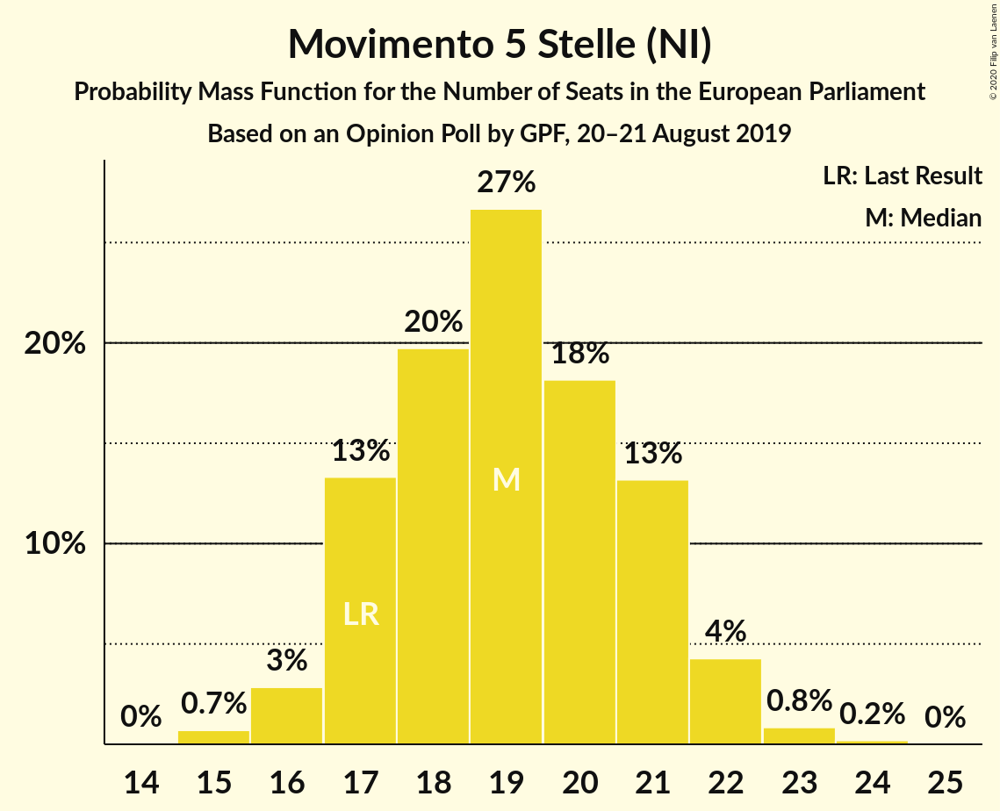
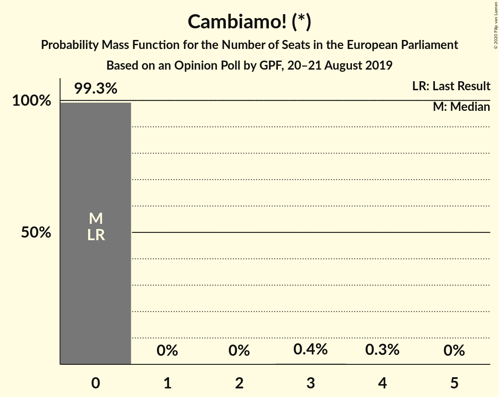
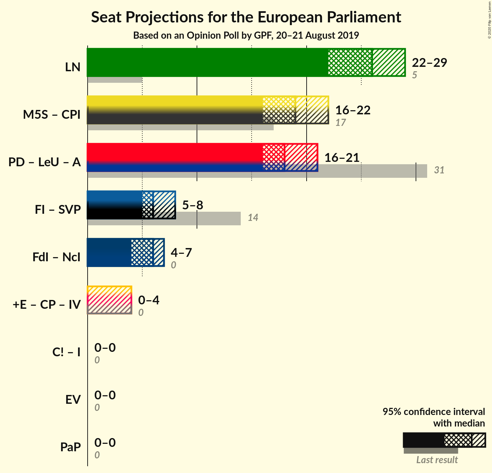

# Opinion Poll by GPF, 20–21 August 2019

<a href="#voting-intentions">Voting Intentions</a> | <a href="#seats">Seats</a> | <a href="#coalitions">Coalitions</a> | <a href="#technical-information">Technical Information</a>

## Voting Intentions

### Confidence Intervals

| Party | Last Result | Poll Result | 80% Confidence Interval | 90% Confidence Interval | 95% Confidence Interval | 99% Confidence Interval |
|:-----:|:-----------:|:-----------:|:-----------------------:|:-----------------------:|:-----------------------:|:-----------------------:|
| Lega Nord (ID) | 6.2% | 31.2% | 28.9–33.7% |28.2–34.4% |27.6–35.0% |26.6–36.2% |
| Partito Democratico (S&D) | 40.8% | 23.5% | 21.4–25.8% |20.8–26.4% |20.3–27.0% |19.3–28.2% |
| Movimento 5 Stelle (NI) | 21.2% | 23.2% | 21.1–25.5% |20.5–26.1% |20.0–26.7% |19.0–27.8% |
| Fratelli d’Italia (ECR) | 3.7% | 6.7% | 5.6–8.2% |5.3–8.6% |5.0–9.0% |4.5–9.8% |
| Forza Italia (EPP) | 16.8% | 5.9% | 4.8–7.3% |4.5–7.7% |4.3–8.1% |3.8–8.8% |
| Più Europa (RE) | 0.0% | 3.0% | 2.2–4.0% |2.0–4.4% |1.9–4.6% |1.6–5.2% |
| Cambiamo! (*) | 0.0% | 2.1% | 1.6–3.1% |1.4–3.4% |1.2–3.6% |1.0–4.1% |
| Liberi e Uguali (S&D) | 0.0% | 1.0% | 0.6–1.7% |0.5–1.9% |0.5–2.1% |0.3–2.6% |

*Note:* The poll result column reflects the actual value used in the calculations. Published results may vary slightly, and in addition be rounded to fewer digits.

## Seats

### Confidence Intervals

| Party | Last Result | Median | 80% Confidence Interval | 90% Confidence Interval | 95% Confidence Interval | 99% Confidence Interval |
|:-----:|:-----------:|:------:|:-----------------------:|:-----------------------:|:-----------------------:|:-----------------------:|
| <a href="#lega-nord-(id)">Lega Nord (ID)</a> | 5 | 25 | 23–27 |22–27 |22–27 |21–29 |
| <a href="#partito-democratico-(s&d)">Partito Democratico (S&D)</a> | 31 | 18 | 16–19 |15–20 |15–20 |14–21 |
| <a href="#movimento-5-stelle-(ni)">Movimento 5 Stelle (NI)</a> | 17 | 18 | 17–20 |16–21 |16–21 |15–22 |
| <a href="#fratelli-d’italia-(ecr)">Fratelli d’Italia (ECR)</a> | 0 | 5 | 4–6 |4–7 |4–7 |4–8 |
| <a href="#forza-italia-(epp)">Forza Italia (EPP)</a> | 13 | 4 | 4–6 |4–6 |3–6 |0–7 |
| <a href="#più-europa-(re)">Più Europa (RE)</a> | 0 | 0 | 0 |0–3 |0–4 |0–4 |
| <a href="#cambiamo!-(*)">Cambiamo! (*)</a> | 0 | 0 | 0 |0 |0 |0–3 |
| <a href="#liberi-e-uguali-(s&d)">Liberi e Uguali (S&D)</a> | 0 | 0 | 0 |0 |0 |0 |

### Lega Nord (ID)

*For a full overview of the results for this party, see the [Lega Nord (ID)](party-leganordid.html) page.*

| Number of Seats | Probability | Accumulated | Special Marks |
|:---------------:|:-----------:|:-----------:|:-------------:|
| 5 | 0% | 100% | Last Result |
| 6 | 0% | 100% |  |
| 7 | 0% | 100% |  |
| 8 | 0% | 100% |  |
| 9 | 0% | 100% |  |
| 10 | 0% | 100% |  |
| 11 | 0% | 100% |  |
| 12 | 0% | 100% |  |
| 13 | 0% | 100% |  |
| 14 | 0% | 100% |  |
| 15 | 0% | 100% |  |
| 16 | 0% | 100% |  |
| 17 | 0% | 100% |  |
| 18 | 0% | 100% |  |
| 19 | 0% | 100% |  |
| 20 | 0.3% | 100% |  |
| 21 | 1.1% | 99.7% |  |
| 22 | 7% | 98.6% |  |
| 23 | 12% | 92% |  |
| 24 | 21% | 80% |  |
| 25 | 19% | 58% | Median |
| 26 | 14% | 40% |  |
| 27 | 23% | 26% |  |
| 28 | 1.1% | 2% |  |
| 29 | 0.8% | 1.0% |  |
| 30 | 0.1% | 0.2% |  |
| 31 | 0.1% | 0.1% |  |
| 32 | 0% | 0% |  |

### Partito Democratico (S&D)

*For a full overview of the results for this party, see the [Partito Democratico (S&D)](party-partitodemocraticosd.html) page.*

| Number of Seats | Probability | Accumulated | Special Marks |
|:---------------:|:-----------:|:-----------:|:-------------:|
| 13 | 0.1% | 100% |  |
| 14 | 0.9% | 99.9% |  |
| 15 | 6% | 99.0% |  |
| 16 | 13% | 93% |  |
| 17 | 18% | 80% |  |
| 18 | 39% | 62% | Median |
| 19 | 13% | 23% |  |
| 20 | 9% | 10% |  |
| 21 | 1.0% | 1.1% |  |
| 22 | 0.2% | 0.2% |  |
| 23 | 0% | 0% |  |
| 24 | 0% | 0% |  |
| 25 | 0% | 0% |  |
| 26 | 0% | 0% |  |
| 27 | 0% | 0% |  |
| 28 | 0% | 0% |  |
| 29 | 0% | 0% |  |
| 30 | 0% | 0% |  |
| 31 | 0% | 0% | Last Result |

### Movimento 5 Stelle (NI)

*For a full overview of the results for this party, see the [Movimento 5 Stelle (NI)](party-movimento5stelleni.html) page.*

| Number of Seats | Probability | Accumulated | Special Marks |
|:---------------:|:-----------:|:-----------:|:-------------:|
| 14 | 0.1% | 100% |  |
| 15 | 2% | 99.9% |  |
| 16 | 4% | 98% |  |
| 17 | 14% | 94% | Last Result |
| 18 | 47% | 80% | Median |
| 19 | 13% | 33% |  |
| 20 | 12% | 20% |  |
| 21 | 7% | 8% |  |
| 22 | 0.7% | 0.9% |  |
| 23 | 0.1% | 0.2% |  |
| 24 | 0.1% | 0.1% |  |
| 25 | 0% | 0% |  |

### Fratelli d’Italia (ECR)

*For a full overview of the results for this party, see the [Fratelli d’Italia (ECR)](party-fratellid’italiaecr.html) page.*

| Number of Seats | Probability | Accumulated | Special Marks |
|:---------------:|:-----------:|:-----------:|:-------------:|
| 0 | 0% | 100% | Last Result |
| 1 | 0% | 100% |  |
| 2 | 0% | 100% |  |
| 3 | 0.1% | 100% |  |
| 4 | 13% | 99.8% |  |
| 5 | 58% | 87% | Median |
| 6 | 23% | 29% |  |
| 7 | 5% | 6% |  |
| 8 | 1.3% | 1.4% |  |
| 9 | 0.1% | 0.1% |  |
| 10 | 0% | 0% |  |

### Forza Italia (EPP)

*For a full overview of the results for this party, see the [Forza Italia (EPP)](party-forzaitaliaepp.html) page.*

| Number of Seats | Probability | Accumulated | Special Marks |
|:---------------:|:-----------:|:-----------:|:-------------:|
| 0 | 0.8% | 100% |  |
| 1 | 0% | 99.2% |  |
| 2 | 0% | 99.2% |  |
| 3 | 4% | 99.2% |  |
| 4 | 47% | 95% | Median |
| 5 | 31% | 49% |  |
| 6 | 16% | 18% |  |
| 7 | 2% | 2% |  |
| 8 | 0.1% | 0.1% |  |
| 9 | 0% | 0% |  |
| 10 | 0% | 0% |  |
| 11 | 0% | 0% |  |
| 12 | 0% | 0% |  |
| 13 | 0% | 0% | Last Result |

### Più Europa (RE)

*For a full overview of the results for this party, see the [Più Europa (RE)](party-piùeuropare.html) page.*

| Number of Seats | Probability | Accumulated | Special Marks |
|:---------------:|:-----------:|:-----------:|:-------------:|
| 0 | 94% | 100% | Last Result, Median |
| 1 | 0% | 6% |  |
| 2 | 0% | 6% |  |
| 3 | 2% | 6% |  |
| 4 | 4% | 4% |  |
| 5 | 0% | 0% |  |

### Cambiamo! (*)

*For a full overview of the results for this party, see the [Cambiamo! (*)](party-cambiamo.html) page.*

| Number of Seats | Probability | Accumulated | Special Marks |
|:---------------:|:-----------:|:-----------:|:-------------:|
| 0 | 99.1% | 100% | Last Result, Median |
| 1 | 0% | 0.9% |  |
| 2 | 0% | 0.9% |  |
| 3 | 0.6% | 0.9% |  |
| 4 | 0.3% | 0.3% |  |
| 5 | 0% | 0% |  |

### Liberi e Uguali (S&D)

*For a full overview of the results for this party, see the [Liberi e Uguali (S&D)](party-liberieugualisd.html) page.*

| Number of Seats | Probability | Accumulated | Special Marks |
|:---------------:|:-----------:|:-----------:|:-------------:|
| 0 | 100% | 100% | Last Result, Median |

## Coalitions

### Confidence Intervals

| Coalition | Last Result | Median | Majority? | 80% Confidence Interval | 90% Confidence Interval | 95% Confidence Interval | 99% Confidence Interval |
|:---------:|:-----------:|:------:|:---------:|:-----------------------:|:-----------------------:|:-----------------------:|:-----------------------:|
| Lega Nord (ID) | 5 | 25 | 0% | 23–27 | 22–27 | 22–27 | 21–29 |
| Partito Democratico (S&D) – Liberi e Uguali (S&D) | 31 | 18 | 0% | 16–19 | 15–20 | 15–20 | 14–21 |

### Lega Nord (ID)

| Number of Seats | Probability | Accumulated | Special Marks |
|:---------------:|:-----------:|:-----------:|:-------------:|
| 5 | 0% | 100% | Last Result |
| 6 | 0% | 100% |  |
| 7 | 0% | 100% |  |
| 8 | 0% | 100% |  |
| 9 | 0% | 100% |  |
| 10 | 0% | 100% |  |
| 11 | 0% | 100% |  |
| 12 | 0% | 100% |  |
| 13 | 0% | 100% |  |
| 14 | 0% | 100% |  |
| 15 | 0% | 100% |  |
| 16 | 0% | 100% |  |
| 17 | 0% | 100% |  |
| 18 | 0% | 100% |  |
| 19 | 0% | 100% |  |
| 20 | 0.3% | 100% |  |
| 21 | 1.1% | 99.7% |  |
| 22 | 7% | 98.6% |  |
| 23 | 12% | 92% |  |
| 24 | 21% | 80% |  |
| 25 | 19% | 58% | Median |
| 26 | 14% | 40% |  |
| 27 | 23% | 26% |  |
| 28 | 1.1% | 2% |  |
| 29 | 0.8% | 1.0% |  |
| 30 | 0.1% | 0.2% |  |
| 31 | 0.1% | 0.1% |  |
| 32 | 0% | 0% |  |

### Partito Democratico (S&D) – Liberi e Uguali (S&D)

| Number of Seats | Probability | Accumulated | Special Marks |
|:---------------:|:-----------:|:-----------:|:-------------:|
| 13 | 0.1% | 100% |  |
| 14 | 0.9% | 99.9% |  |
| 15 | 6% | 99.0% |  |
| 16 | 13% | 93% |  |
| 17 | 18% | 80% |  |
| 18 | 39% | 62% | Median |
| 19 | 13% | 23% |  |
| 20 | 9% | 10% |  |
| 21 | 1.0% | 1.1% |  |
| 22 | 0.2% | 0.2% |  |
| 23 | 0% | 0% |  |
| 24 | 0% | 0% |  |
| 25 | 0% | 0% |  |
| 26 | 0% | 0% |  |
| 27 | 0% | 0% |  |
| 28 | 0% | 0% |  |
| 29 | 0% | 0% |  |
| 30 | 0% | 0% |  |
| 31 | 0% | 0% | Last Result |

## Technical Information

### Opinion Poll

+ **Polling firm:** GPF
+ **Commissioner(s):** —
+ **Fieldwork period:** 20–21 August 2019

### Calculations

+ **Sample size:** 609
+ **Simulations done:** 131,072
+ **Error estimate:** 3.55%

