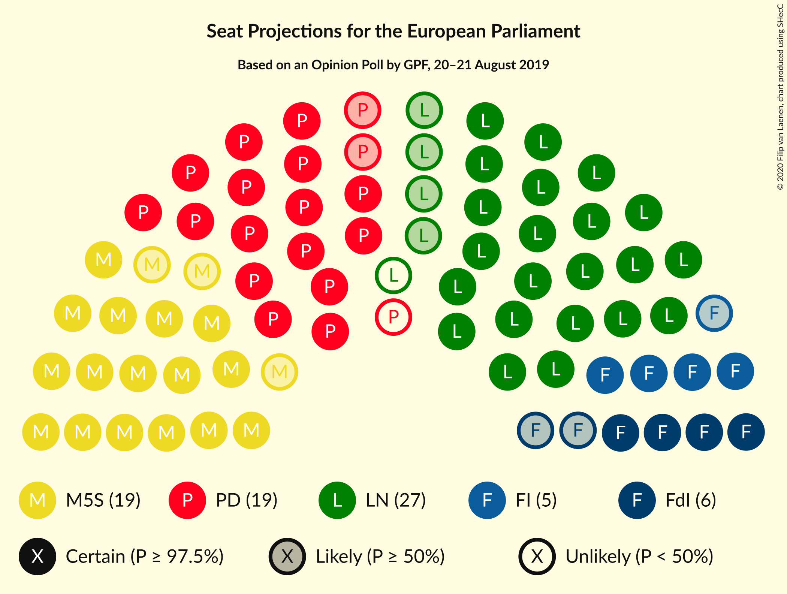
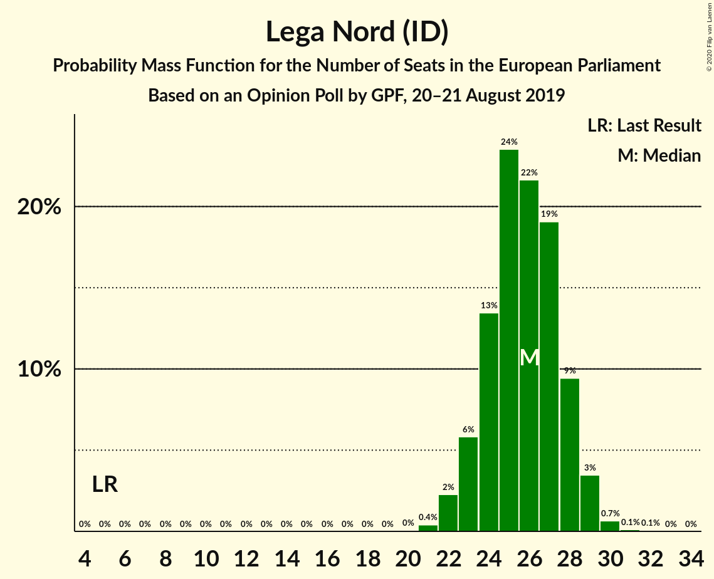
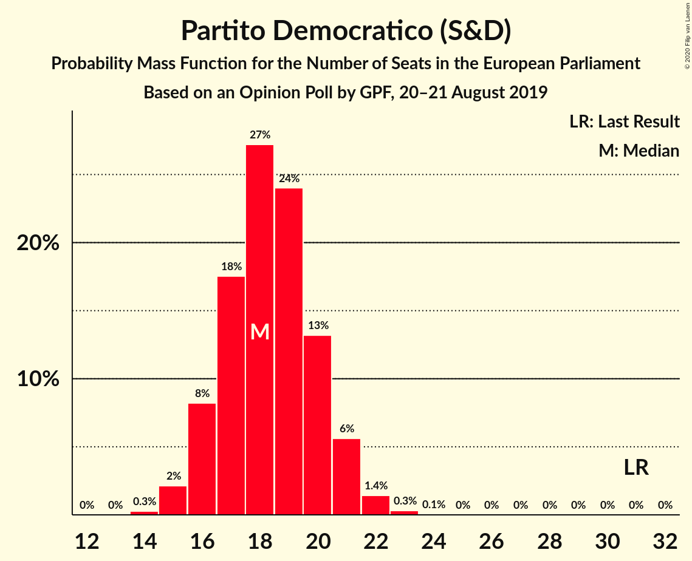
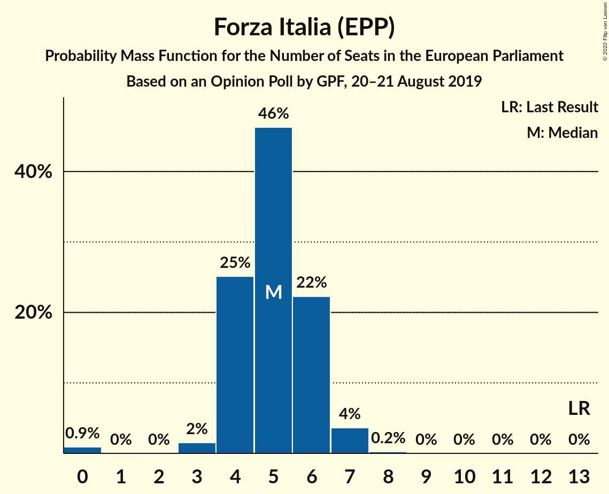

# Opinion Poll by GPF, 20–21 August 2019

<a href="#voting-intentions">Voting Intentions</a> | <a href="#seats">Seats</a> | <a href="#coalitions">Coalitions</a> | <a href="#technical-information">Technical Information</a>

## Voting Intentions

### Confidence Intervals

| Party | Last Result | Poll Result | 80% Confidence Interval | 90% Confidence Interval | 95% Confidence Interval | 99% Confidence Interval |
|:-----:|:-----------:|:-----------:|:-----------------------:|:-----------------------:|:-----------------------:|:-----------------------:|
| Lega Nord (ID) | 6.2% | 31.2% | 28.9–33.7% |28.2–34.4% |27.6–35.0% |26.6–36.2% |
| Partito Democratico (S&D) | 40.8% | 23.5% | 21.4–25.8% |20.8–26.4% |20.3–27.0% |19.3–28.2% |
| Movimento 5 Stelle (NI) | 21.2% | 23.2% | 21.1–25.5% |20.5–26.1% |20.0–26.7% |19.0–27.8% |
| Fratelli d’Italia (ECR) | 3.7% | 6.7% | 5.6–8.2% |5.3–8.6% |5.0–9.0% |4.5–9.8% |
| Forza Italia (EPP) | 16.8% | 5.9% | 4.8–7.3% |4.5–7.7% |4.3–8.1% |3.8–8.8% |

*Note:* The poll result column reflects the actual value used in the calculations. Published results may vary slightly, and in addition be rounded to fewer digits.

## Seats

### Confidence Intervals

| Party | Last Result | Median | 80% Confidence Interval | 90% Confidence Interval | 95% Confidence Interval | 99% Confidence Interval |
|:-----:|:-----------:|:------:|:-----------------------:|:-----------------------:|:-----------------------:|:-----------------------:|
| <a href="#lega-nord-(id)">Lega Nord (ID)</a> | 5 | 23 | 21–24 |20–25 |20–25 |19–26 |
| <a href="#partito-democratico-(s&d)">Partito Democratico (S&D)</a> | 31 | 16 | 15–18 |14–18 |14–19 |13–19 |
| <a href="#movimento-5-stelle-(ni)">Movimento 5 Stelle (NI)</a> | 17 | 17 | 15–18 |15–19 |15–19 |14–20 |
| <a href="#fratelli-d’italia-(ecr)">Fratelli d’Italia (ECR)</a> | 0 | 5 | 4–6 |4–6 |4–7 |3–7 |
| <a href="#forza-italia-(epp)">Forza Italia (EPP)</a> | 13 | 4 | 4–5 |3–6 |3–6 |0–6 |

### Lega Nord (ID)

*For a full overview of the results for this party, see the [Lega Nord (ID)](party-leganordid.html) page.*

| Number of Seats | Probability | Accumulated | Special Marks |
|:---------------:|:-----------:|:-----------:|:-------------:|
| 5 | 0% | 100% | Last Result |
| 6 | 0% | 100% |  |
| 7 | 0% | 100% |  |
| 8 | 0% | 100% |  |
| 9 | 0% | 100% |  |
| 10 | 0% | 100% |  |
| 11 | 0% | 100% |  |
| 12 | 0% | 100% |  |
| 13 | 0% | 100% |  |
| 14 | 0% | 100% |  |
| 15 | 0% | 100% |  |
| 16 | 0% | 100% |  |
| 17 | 0% | 100% |  |
| 18 | 0.1% | 100% |  |
| 19 | 0.8% | 99.9% |  |
| 20 | 4% | 99.1% |  |
| 21 | 14% | 95% |  |
| 22 | 25% | 81% |  |
| 23 | 28% | 55% | Median |
| 24 | 18% | 27% |  |
| 25 | 7% | 9% |  |
| 26 | 2% | 2% |  |
| 27 | 0.3% | 0.3% |  |
| 28 | 0% | 0% |  |

### Partito Democratico (S&D)

*For a full overview of the results for this party, see the [Partito Democratico (S&D)](party-partitodemocraticosd.html) page.*

| Number of Seats | Probability | Accumulated | Special Marks |
|:---------------:|:-----------:|:-----------:|:-------------:|
| 12 | 0.1% | 100% |  |
| 13 | 1.5% | 99.9% |  |
| 14 | 8% | 98% |  |
| 15 | 23% | 90% |  |
| 16 | 32% | 68% | Median |
| 17 | 23% | 36% |  |
| 18 | 10% | 13% |  |
| 19 | 3% | 3% |  |
| 20 | 0.4% | 0.5% |  |
| 21 | 0% | 0% |  |
| 22 | 0% | 0% |  |
| 23 | 0% | 0% |  |
| 24 | 0% | 0% |  |
| 25 | 0% | 0% |  |
| 26 | 0% | 0% |  |
| 27 | 0% | 0% |  |
| 28 | 0% | 0% |  |
| 29 | 0% | 0% |  |
| 30 | 0% | 0% |  |
| 31 | 0% | 0% | Last Result |

### Movimento 5 Stelle (NI)

*For a full overview of the results for this party, see the [Movimento 5 Stelle (NI)](party-movimento5stelleni.html) page.*

| Number of Seats | Probability | Accumulated | Special Marks |
|:---------------:|:-----------:|:-----------:|:-------------:|
| 13 | 0.2% | 100% |  |
| 14 | 2% | 99.8% |  |
| 15 | 11% | 98% |  |
| 16 | 26% | 87% |  |
| 17 | 31% | 61% | Last Result, Median |
| 18 | 20% | 29% |  |
| 19 | 8% | 10% |  |
| 20 | 2% | 2% |  |
| 21 | 0.2% | 0.3% |  |
| 22 | 0% | 0% |  |

### Fratelli d’Italia (ECR)

*For a full overview of the results for this party, see the [Fratelli d’Italia (ECR)](party-fratellid’italiaecr.html) page.*

| Number of Seats | Probability | Accumulated | Special Marks |
|:---------------:|:-----------:|:-----------:|:-------------:|
| 0 | 0.1% | 100% | Last Result |
| 1 | 0% | 99.9% |  |
| 2 | 0% | 99.9% |  |
| 3 | 1.5% | 99.9% |  |
| 4 | 25% | 98% |  |
| 5 | 49% | 73% | Median |
| 6 | 21% | 24% |  |
| 7 | 3% | 3% |  |
| 8 | 0.1% | 0.1% |  |
| 9 | 0% | 0% |  |

### Forza Italia (EPP)

*For a full overview of the results for this party, see the [Forza Italia (EPP)](party-forzaitaliaepp.html) page.*

| Number of Seats | Probability | Accumulated | Special Marks |
|:---------------:|:-----------:|:-----------:|:-------------:|
| 0 | 0.9% | 100% |  |
| 1 | 0% | 99.1% |  |
| 2 | 0% | 99.1% |  |
| 3 | 9% | 99.1% |  |
| 4 | 48% | 90% | Median |
| 5 | 36% | 42% |  |
| 6 | 6% | 6% |  |
| 7 | 0.3% | 0.4% |  |
| 8 | 0% | 0% |  |
| 9 | 0% | 0% |  |
| 10 | 0% | 0% |  |
| 11 | 0% | 0% |  |
| 12 | 0% | 0% |  |
| 13 | 0% | 0% | Last Result |

## Coalitions

### Confidence Intervals

| Coalition | Last Result | Median | Majority? | 80% Confidence Interval | 90% Confidence Interval | 95% Confidence Interval | 99% Confidence Interval |
|:---------:|:-----------:|:------:|:---------:|:-----------------------:|:-----------------------:|:-----------------------:|:-----------------------:|
| Lega Nord (ID) | 5 | 23 | 0% | 21–24 | 20–25 | 20–25 | 19–26 |

### Lega Nord (ID)

| Number of Seats | Probability | Accumulated | Special Marks |
|:---------------:|:-----------:|:-----------:|:-------------:|
| 5 | 0% | 100% | Last Result |
| 6 | 0% | 100% |  |
| 7 | 0% | 100% |  |
| 8 | 0% | 100% |  |
| 9 | 0% | 100% |  |
| 10 | 0% | 100% |  |
| 11 | 0% | 100% |  |
| 12 | 0% | 100% |  |
| 13 | 0% | 100% |  |
| 14 | 0% | 100% |  |
| 15 | 0% | 100% |  |
| 16 | 0% | 100% |  |
| 17 | 0% | 100% |  |
| 18 | 0.1% | 100% |  |
| 19 | 0.8% | 99.9% |  |
| 20 | 4% | 99.1% |  |
| 21 | 14% | 95% |  |
| 22 | 25% | 81% |  |
| 23 | 28% | 55% | Median |
| 24 | 18% | 27% |  |
| 25 | 7% | 9% |  |
| 26 | 2% | 2% |  |
| 27 | 0.3% | 0.3% |  |
| 28 | 0% | 0% |  |

## Technical Information

### Opinion Poll

+ **Polling firm:** GPF
+ **Commissioner(s):** —
+ **Fieldwork period:** 20–21 August 2019

### Calculations

+ **Sample size:** 609
+ **Simulations done:** 1,048,576
+ **Error estimate:** 0.43%

